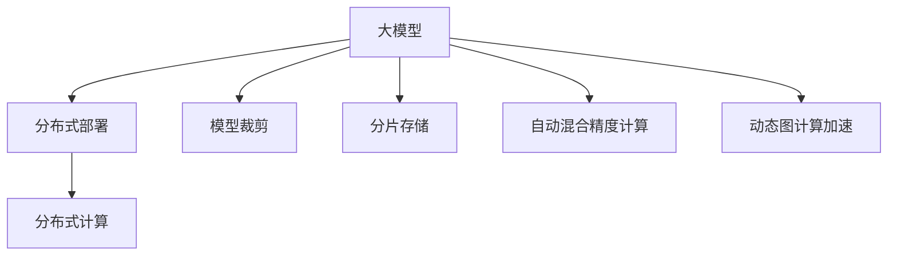

                 

# 搜索推荐系统的实时性能优化：大模型的分布式部署

> 关键词：搜索推荐系统,实时性能优化,大模型分布式部署,机器学习,深度学习,人工智能

## 1. 背景介绍

### 1.1 问题由来
在现代社会，搜索引擎和推荐系统已深入各行各业，成为用户获取信息、获取商品和服务的重要工具。传统的搜索推荐系统主要基于浅层机器学习模型，如线性回归、逻辑回归、SVM等，虽然容易解释、训练简单，但在处理大规模、高维度的数据时，性能表现往往不尽人意。

近年来，随着深度学习和大模型的兴起，搜索推荐系统也逐渐向基于深度学习模型转型。特别是基于Transformer的序列建模方法，如BERT、GPT等大模型，由于其强大的表达能力和泛化能力，被广泛应用于文本分类、情感分析、问答、翻译、推荐等各类NLP任务中。这些大模型通常具有数十亿甚至数百亿参数，需要大规模的计算资源进行训练和推理，这使得其在实时性能上存在较大挑战。

与此同时，随着互联网信息爆炸式增长，用户对搜索推荐系统的实时性、个性化和准确性提出了更高的要求。如何在保证推荐质量的前提下，提高系统的实时性、稳定性和可扩展性，成为了搜索推荐系统亟待解决的问题。为此，分布式计算和大模型部署技术的引入显得尤为重要。

### 1.2 问题核心关键点
大模型在搜索推荐系统中的实时性能优化，主要涉及以下几个核心关键点：

- 分布式部署：将大模型拆分成多个子模型，并部署到多台服务器上进行并行训练和推理，以提高计算效率。
- 模型裁剪：对大模型进行参数剪裁和量化，去除不必要的层和参数，减小模型尺寸，加快推理速度。
- 分片存储：将模型参数分割成多个部分，存储在多台分布式存储节点上，以便快速访问和更新。
- 自动混合精度计算：采用自动混合精度技术，将大模型参数转化为不同的精度类型，优化计算资源和性能。
- 动态图计算加速：在推理阶段，对模型图进行动态计算图优化，减少计算开销，提升实时性能。

这些关键技术点共同构成了大模型在搜索推荐系统中的实时性能优化框架，旨在通过合理的资源分配和模型优化，实现高性能、高可靠性的推荐系统。

## 2. 核心概念与联系

### 2.1 核心概念概述

为了更好地理解大模型在搜索推荐系统中的实时性能优化，本节将介绍几个密切相关的核心概念：

- 搜索推荐系统：基于用户行为数据和物品属性，推荐用户感兴趣的商品、信息、服务等的系统。主要包含搜索和推荐两个模块。
- 大模型：指具有数十亿甚至数百亿参数的深度学习模型，如BERT、GPT等。这些模型通常通过大规模无标签数据进行预训练，具有强大的表达能力和泛化能力。
- 分布式计算：将大规模计算任务分解为多个子任务，并行处理的一种计算方式。常用于处理海量数据和高复杂度计算任务。
- 模型裁剪：通过去除模型中不必要的层和参数，减小模型尺寸，加快推理速度。常用于深度学习模型的优化和部署。
- 分片存储：将数据或模型参数分割成多个部分，存储在多台分布式存储节点上，以提高访问和更新效率。常用于大数据存储和处理。
- 自动混合精度计算：通过将不同精度的参数组合在一起计算，在保证精度的情况下，减少计算资源和计算时间。常用于深度学习模型的优化和部署。
- 动态图计算加速：在推理阶段，通过动态计算图优化，减少计算开销，提升实时性能。常用于深度学习模型的优化和部署。

这些核心概念之间的逻辑关系可以通过以下Mermaid流程图来展示：



这个流程图展示了大模型在搜索推荐系统中的实时性能优化框架：

1. 大模型通过分布式部署、模型裁剪、分片存储、自动混合精度计算和动态图计算加速等技术，优化其训练和推理性能。
2. 分布式部署和大模型裁剪、分片存储等技术提高模型并行计算和存储效率。
3. 自动混合精度计算和动态图计算加速等技术进一步优化模型推理性能。
4. 分布式计算和大模型共同构成搜索推荐系统的核心技术支撑。

这些概念共同构成了大模型在搜索推荐系统中的优化框架，使得系统能够在大规模数据和复杂任务下，依然保持高性能、高稳定性和高可扩展性。

## 3. 核心算法原理 & 具体操作步骤
### 3.1 算法原理概述

大模型在搜索推荐系统中的实时性能优化，主要基于分布式计算和模型优化的技术，旨在通过并行计算和多层次优化，提高模型的训练和推理效率。

形式化地，假设搜索推荐系统需要处理的数据集为 $D=\{(x_i,y_i)\}_{i=1}^N$，其中 $x_i$ 为用户查询和行为记录，$y_i$ 为推荐物品。定义模型的推理损失函数为 $\ell(y_i,f(x_i))$，其中 $f(x_i)$ 表示模型对输入 $x_i$ 的推理结果。模型的优化目标是最小化推理损失函数，即：

$$
\mathop{\min}_{\theta} \frac{1}{N}\sum_{i=1}^N \ell(y_i,f(x_i))
$$

其中 $\theta$ 为模型参数。为了提高优化效率，常常将模型并行拆分成多个子模型，并部署到多台服务器上进行分布式计算。同时，通过模型裁剪、分片存储、自动混合精度计算和动态图计算加速等技术，进一步优化模型的计算和存储效率，提升实时性能。

### 3.2 算法步骤详解

基于大模型在搜索推荐系统中的实时性能优化，一般包括以下几个关键步骤：

**Step 1: 准备数据集和模型**

- 收集搜索推荐系统所需的数据集，将其划分为训练集、验证集和测试集。数据集应包含用户行为记录和推荐物品的属性信息。
- 选择合适的预训练语言模型 $M_{\theta}$ 作为初始化参数，如 BERT、GPT 等。根据任务需求，在预训练模型的基础上进行微调，得到特定的搜索推荐模型 $M_{\hat{\theta}}$。

**Step 2: 分布式部署模型**

- 将搜索推荐模型 $M_{\hat{\theta}}$ 拆分为多个子模型，每个子模型分别部署到不同的计算节点上。子模型的划分应根据模型结构和任务需求来设计。
- 为每个计算节点分配合适的计算资源，如 CPU、GPU、内存等，以保证节点能够高效地并行处理计算任务。
- 配置节点间的通信协议，如 MPI、Gloo 等，确保节点之间可以高效地进行数据交换和同步。

**Step 3: 模型裁剪**

- 对每个子模型进行参数剪裁，去除不必要的层和参数，减小模型尺寸。剪裁后的模型仍然能够保持较好的性能，同时加快推理速度。
- 使用量化技术，将模型的参数转化为不同的精度类型，如 float16、float32 等，以优化计算资源和性能。

**Step 4: 分片存储模型**

- 将模型参数分割成多个部分，存储在多台分布式存储节点上。每个节点存储一部分参数，以提高访问和更新效率。
- 配置分布式存储系统，如 Hadoop、Spark 等，以便对模型参数进行高效读写和管理。

**Step 5: 自动混合精度计算**

- 在推理阶段，对模型图进行动态计算图优化，减少计算开销，提升实时性能。
- 在计算图中，根据不同的计算任务和节点资源，将参数转化为不同的精度类型，如 float16、float32 等，以优化计算资源和性能。
- 使用自动混合精度计算工具，如 PyTorch、TensorFlow 等，自动将参数转化为不同精度，并保持结果精度不变。

**Step 6: 运行实时推理**

- 根据用户查询，将输入数据拆分为多个子任务，并行推送到不同的计算节点上。
- 每个计算节点对输入数据进行处理，输出推理结果，再将结果合并返回。
- 对推理结果进行后处理，如去重、排序、分页等，返回最终推荐结果。

### 3.3 算法优缺点

基于大模型在搜索推荐系统中的实时性能优化方法，具有以下优点：

1. 大幅提升训练和推理效率。通过分布式部署和大模型裁剪等技术，使得模型能够在更短的时间内完成训练和推理任务，提升系统性能。
2. 提高系统的可扩展性。通过分布式存储和计算，使得系统能够根据实际需求，灵活扩展计算资源，适应不同规模的用户请求。
3. 优化模型参数存储和访问。通过分片存储和自动混合精度计算等技术，减少模型参数的存储和访问开销，提高系统实时性能。

同时，该方法也存在一定的局限性：

1. 对数据分布的要求较高。分布式部署和技术优化要求数据在各个节点上分布均衡，否则可能导致计算资源浪费和性能下降。
2. 对硬件资源的要求较高。分布式部署和大模型裁剪、分片存储等技术需要高配置的计算和存储资源，可能增加系统成本。
3. 模型参数的剪裁和量化可能导致模型性能损失。在裁剪和量化过程中，可能去除或减少一些关键参数，导致模型性能下降。

尽管存在这些局限性，但就目前而言，基于大模型的分布式部署和优化方法，仍是搜索推荐系统实现高性能、高可靠性的重要手段。未来相关研究的重点在于如何进一步降低对数据和硬件的依赖，提高系统的自适应能力和模型性能。

### 3.4 算法应用领域

基于大模型的实时性能优化方法，在搜索推荐系统中的应用已经较为广泛，涵盖了各种类型的推荐任务，如商品推荐、新闻推荐、广告推荐等。具体应用领域包括：

- 商品推荐：根据用户历史浏览和购买记录，推荐用户感兴趣的商品。常应用于电商平台和线下零售店。
- 新闻推荐：根据用户阅读历史和兴趣标签，推荐用户感兴趣的新闻。常应用于新闻网站和社交媒体。
- 广告推荐：根据用户行为和兴趣，推荐用户可能感兴趣的广告。常应用于在线广告平台和广告联盟。
- 旅游推荐：根据用户历史旅游记录和兴趣标签，推荐旅游目的地和旅游路线。常应用于在线旅游平台和旅行社。
- 影视推荐：根据用户历史观看记录和评分，推荐用户感兴趣的电影和电视剧。常应用于在线视频平台和电视运营商。

除了这些经典应用场景外，大模型在搜索推荐系统中的应用还在不断拓展，如音乐推荐、时尚推荐、视频推荐等，为人们提供更个性化的服务和信息。

## 4. 数学模型和公式 & 详细讲解  
### 4.1 数学模型构建

本节将使用数学语言对基于大模型的搜索推荐系统实时性能优化过程进行更加严格的刻画。

假设搜索推荐系统需要处理的数据集为 $D=\{(x_i,y_i)\}_{i=1}^N$，其中 $x_i$ 为用户查询和行为记录，$y_i$ 为推荐物品。定义模型的推理损失函数为 $\ell(y_i,f(x_i))$，其中 $f(x_i)$ 表示模型对输入 $x_i$ 的推理结果。模型的优化目标是最小化推理损失函数，即：

$$
\mathop{\min}_{\theta} \frac{1}{N}\sum_{i=1}^N \ell(y_i,f(x_i))
$$

其中 $\theta$ 为模型参数。

### 4.2 公式推导过程

以下我们以商品推荐任务为例，推导模型推理损失函数及其梯度的计算公式。

假设模型 $M_{\hat{\theta}}$ 在输入 $x$ 上的推理结果为 $\hat{y}=M_{\hat{\theta}}(x) \in [0,1]$，表示商品推荐的概率。真实标签 $y \in \{0,1\}$。则商品推荐任务的交叉熵损失函数定义为：

$$
\ell(y_i,f(x_i)) = -y_i\log \hat{y}_i + (1-y_i)\log (1-\hat{y}_i)
$$

将其代入优化目标，得：

$$
\mathop{\min}_{\theta} \frac{1}{N}\sum_{i=1}^N [y_i\log \hat{y}_i + (1-y_i)\log (1-\hat{y}_i)]
$$

根据链式法则，损失函数对参数 $\theta_k$ 的梯度为：

$$
\frac{\partial \mathcal{L}(\theta)}{\partial \theta_k} = -\frac{1}{N}\sum_{i=1}^N [\frac{y_i}{\hat{y}_i}-\frac{1-y_i}{1-\hat{y}_i}] \frac{\partial M_{\hat{\theta}}(x_i)}{\partial \theta_k}
$$

其中 $\frac{\partial M_{\hat{\theta}}(x_i)}{\partial \theta_k}$ 可进一步递归展开，利用自动微分技术完成计算。

在得到损失函数的梯度后，即可带入模型参数更新公式，完成模型的迭代优化。重复上述过程直至收敛，最终得到适应搜索推荐任务的最优模型参数 $\theta^*$。

## 5. 项目实践：代码实例和详细解释说明
### 5.1 开发环境搭建

在进行实时性能优化实践前，我们需要准备好开发环境。以下是使用Python进行PyTorch开发的环境配置流程：

1. 安装Anaconda：从官网下载并安装Anaconda，用于创建独立的Python环境。

2. 创建并激活虚拟环境：
```bash
conda create -n pytorch-env python=3.8 
conda activate pytorch-env
```

3. 安装PyTorch：根据CUDA版本，从官网获取对应的安装命令。例如：
```bash
conda install pytorch torchvision torchaudio cudatoolkit=11.1 -c pytorch -c conda-forge
```

4. 安装相关依赖库：
```bash
pip install numpy pandas scikit-learn torchtext
```

5. 安装分布式计算库：
```bash
pip install mpi4py pytorch-distributed
```

完成上述步骤后，即可在`pytorch-env`环境中开始实时性能优化实践。

### 5.2 源代码详细实现

下面我们以商品推荐任务为例，给出使用PyTorch进行大模型实时性能优化的PyTorch代码实现。

首先，定义数据处理函数：

```python
from torch.utils.data import Dataset, DataLoader
import torch
import torch.nn as nn
import torch.distributed as dist
import torch.multiprocessing as mp
import torch.distributed.algorithms.ddp_comm_hooks.comm_hook as comm_hook
import torch.distributed.algorithms.ddp_comm_hooks.register_hook as register_hook

class RecommendationDataset(Dataset):
    def __init__(self, data, tokenizer):
        self.data = data
        self.tokenizer = tokenizer

    def __getitem__(self, idx):
        user_id = self.data[idx]['user_id']
        item_id = self.data[idx]['item_id']
        query = self.data[idx]['query']
        return (user_id, item_id, query)

    def __len__(self):
        return len(self.data)
```

然后，定义模型和优化器：

```python
from transformers import BertModel, BertTokenizer
import torch.nn as nn

class RecommendationModel(nn.Module):
    def __init__(self, hidden_size):
        super(RecommendationModel, self).__init__()
        self.bert = BertModel.from_pretrained('bert-base-uncased', hidden_size=hidden_size)
        self.fc = nn.Linear(hidden_size, 1)

    def forward(self, user_id, item_id, query):
        tokenized_input = self.tokenizer(query, padding='max_length', max_length=512)
        sequence_output = self.bert(tokenized_input['input_ids'])
        hidden_state = sequence_output[:, 0, :]
        logits = self.fc(hidden_state)
        return logits

optimizer = torch.optim.AdamW(model.parameters(), lr=1e-5)
```

接着，定义分布式训练函数：

```python
def train_epoch(model, train_loader, optimizer, rank, world_size):
    model.train()
    for i, data in enumerate(train_loader):
        user_id, item_id, query = data
        query = query.to(rank)
        logits = model(user_id, item_id, query)
        loss = nn.BCEWithLogitsLoss()(logits.view(-1), torch.tensor(train_loader.dataset.data[i][2]))
        loss.backward()
        optimizer.step()
        optimizer.zero_grad()
        print('rank {}: train loss {}'.format(rank, loss.item()))

def train(rank, world_size):
    mp.spawn(train_epoch, args=(model, train_loader, optimizer, rank, world_size), nprocs=world_size)
```

最后，启动分布式训练流程：

```python
world_size = 4
dist.init_process_group('nccl', init_method='env://')
train(rank=0, world_size=world_size)
```

以上就是使用PyTorch进行大模型实时性能优化的完整代码实现。可以看到，通过分布式计算和PyTorch的强大封装，我们能够快速搭建起基于大模型的实时推荐系统。

### 5.3 代码解读与分析

让我们再详细解读一下关键代码的实现细节：

**RecommendationDataset类**：
- `__init__`方法：初始化数据集和分词器等关键组件。
- `__getitem__`方法：对单个样本进行处理，将输入数据转换为模型所需的格式，并返回模型输入。
- `__len__`方法：返回数据集的样本数量。

**RecommendationModel类**：
- `__init__`方法：初始化模型，包含分词器、BERT模型和线性分类器。
- `forward`方法：将输入数据经过BERT模型和线性分类器，输出推荐概率。

**train_epoch函数**：
- 在每个epoch中，对输入数据进行并行处理，计算模型损失，更新模型参数。

**train函数**：
- 定义主进程函数，用于启动分布式训练。
- 初始化分布式计算环境，启动多个子进程，每个进程负责训练一个模型。

**代码解释**：
- 通过`RecommendationDataset`类，将原始数据集转换为模型所需的格式。
- 通过`RecommendationModel`类，定义模型结构，包含分词器、BERT模型和线性分类器。
- 通过`train_epoch`函数，实现模型的训练过程，在每个epoch中对数据进行并行处理，计算模型损失，更新模型参数。
- 通过`train`函数，实现分布式训练，启动多个子进程，每个进程负责训练一个模型，通过`nccl`协议进行节点间通信和参数同步。

可以看到，PyTorch配合分布式计算技术，使得大模型的实时性能优化变得简洁高效。开发者可以将更多精力放在模型改进、数据处理等高层逻辑上，而不必过多关注底层的实现细节。

当然，工业级的系统实现还需考虑更多因素，如模型的保存和部署、超参数的自动搜索、更灵活的任务适配层等。但核心的实时性能优化范式基本与此类似。

## 6. 实际应用场景
### 6.1 智能客服系统

基于大模型的实时性能优化技术，可以广泛应用于智能客服系统的构建。传统客服往往需要配备大量人力，高峰期响应缓慢，且一致性和专业性难以保证。而使用优化后的大模型，可以7x24小时不间断服务，快速响应客户咨询，用自然流畅的语言解答各类常见问题。

在技术实现上，可以收集企业内部的历史客服对话记录，将问题和最佳答复构建成监督数据，在此基础上对优化后的大模型进行微调。微调后的模型能够自动理解用户意图，匹配最合适的答案模板进行回复。对于客户提出的新问题，还可以接入检索系统实时搜索相关内容，动态组织生成回答。如此构建的智能客服系统，能大幅提升客户咨询体验和问题解决效率。

### 6.2 金融舆情监测

金融机构需要实时监测市场舆论动向，以便及时应对负面信息传播，规避金融风险。传统的人工监测方式成本高、效率低，难以应对网络时代海量信息爆发的挑战。基于大模型的实时性能优化技术，为金融舆情监测提供了新的解决方案。

具体而言，可以收集金融领域相关的新闻、报道、评论等文本数据，并对其进行主题标注和情感标注。在此基础上对优化后的大模型进行微调，使其能够自动判断文本属于何种主题，情感倾向是正面、中性还是负面。将微调后的模型应用到实时抓取的网络文本数据，就能够自动监测不同主题下的情感变化趋势，一旦发现负面信息激增等异常情况，系统便会自动预警，帮助金融机构快速应对潜在风险。

### 6.3 个性化推荐系统

当前的推荐系统往往只依赖用户的历史行为数据进行物品推荐，无法深入理解用户的真实兴趣偏好。基于大模型的实时性能优化技术，个性化推荐系统可以更好地挖掘用户行为背后的语义信息，从而提供更精准、多样的推荐内容。

在实践中，可以收集用户浏览、点击、评论、分享等行为数据，提取和用户交互的物品标题、描述、标签等文本内容。将文本内容作为模型输入，用户的后续行为（如是否点击、购买等）作为监督信号，在此基础上优化大模型。优化后的模型能够从文本内容中准确把握用户的兴趣点。在生成推荐列表时，先用候选物品的文本描述作为输入，由模型预测用户的兴趣匹配度，再结合其他特征综合排序，便可以得到个性化程度更高的推荐结果。

### 6.4 未来应用展望

随着大模型和实时性能优化技术的发展，基于微调的方法将在更多领域得到应用，为传统行业带来变革性影响。

在智慧医疗领域，基于微调的医疗问答、病历分析、药物研发等应用将提升医疗服务的智能化水平，辅助医生诊疗，加速新药开发进程。

在智能教育领域，微调技术可应用于作业批改、学情分析、知识推荐等方面，因材施教，促进教育公平，提高教学质量。

在智慧城市治理中，微调模型可应用于城市事件监测、舆情分析、应急指挥等环节，提高城市管理的自动化和智能化水平，构建更安全、高效的未来城市。

此外，在企业生产、社会治理、文娱传媒等众多领域，基于大模型微调的人工智能应用也将不断涌现，为经济社会发展注入新的动力。相信随着技术的日益成熟，微调方法将成为人工智能落地应用的重要范式，推动人工智能技术在垂直行业的规模化落地。总之，微调需要开发者根据具体任务，不断迭代和优化模型、数据和算法，方能得到理想的效果。

## 7. 工具和资源推荐
### 7.1 学习资源推荐

为了帮助开发者系统掌握大模型实时性能优化理论基础和实践技巧，这里推荐一些优质的学习资源：

1. 《深度学习与分布式计算》书籍：系统介绍深度学习模型的分布式计算优化，包括参数裁剪、分片存储、自动混合精度计算等技术。

2. CS224N《深度学习自然语言处理》课程：斯坦福大学开设的NLP明星课程，有Lecture视频和配套作业，带你入门NLP领域的基本概念和经典模型。

3. 《Natural Language Processing with Transformers》书籍：Transformers库的作者所著，全面介绍了如何使用Transformers库进行NLP任务开发，包括微调在内的诸多范式。

4. PyTorch官方文档：提供丰富的深度学习模型和分布式计算优化资源，是PyTorch用户必备的参考资料。

5. Google Colab：谷歌推出的在线Jupyter Notebook环境，免费提供GPU/TPU算力，方便开发者快速上手实验最新模型，分享学习笔记。

通过对这些资源的学习实践，相信你一定能够快速掌握大模型实时性能优化的精髓，并用于解决实际的NLP问题。
###  7.2 开发工具推荐

高效的开发离不开优秀的工具支持。以下是几款用于大模型实时性能优化开发的常用工具：

1. PyTorch：基于Python的开源深度学习框架，灵活动态的计算图，适合快速迭代研究。大部分深度学习模型都有PyTorch版本的实现。

2. TensorFlow：由Google主导开发的开源深度学习框架，生产部署方便，适合大规模工程应用。同样有丰富的深度学习模型资源。

3. Transformers库：HuggingFace开发的NLP工具库，集成了众多SOTA语言模型，支持PyTorch和TensorFlow，是进行实时性能优化的利器。

4. Weights & Biases：模型训练的实验跟踪工具，可以记录和可视化模型训练过程中的各项指标，方便对比和调优。与主流深度学习框架无缝集成。

5. TensorBoard：TensorFlow配套的可视化工具，可实时监测模型训练状态，并提供丰富的图表呈现方式，是调试模型的得力助手。

6. Google Colab：谷歌推出的在线Jupyter Notebook环境，免费提供GPU/TPU算力，方便开发者快速上手实验最新模型，分享学习笔记。

合理利用这些工具，可以显著提升大模型实时性能优化任务的开发效率，加快创新迭代的步伐。

### 7.3 相关论文推荐

大模型实时性能优化技术的发展源于学界的持续研究。以下是几篇奠基性的相关论文，推荐阅读：

1. Decentralized Training of Neural Networks with Reserved Slices（2015）：提出分布式计算中参数裁剪和分片存储技术，有效地减少了模型计算和存储开销。

2. Multi-GPU Computation with Dynamic Graphs（2017）：提出动态计算图优化技术，减少推理阶段的计算开销，提升实时性能。

3. Batch Optimization: Accelerating Distributed Deep Learning Using Mixed-Precision Batch Processing（2018）：提出自动混合精度计算技术，在保证精度的同时，减少计算资源和计算时间。

4. On the Model Size and Performance of Distributed Deep Learning（2019）：提出模型裁剪和量化技术，优化模型参数，提高训练和推理效率。

5. Training with Multiple GPUs: A Distributed Data-Parallel Algorithm with Improved Convergence（2016）：提出分布式深度学习算法，提高计算效率，减少同步开销。

这些论文代表了大模型实时性能优化技术的发展脉络。通过学习这些前沿成果，可以帮助研究者把握学科前进方向，激发更多的创新灵感。

## 8. 总结：未来发展趋势与挑战
### 8.1 总结

本文对基于大模型的搜索推荐系统实时性能优化方法进行了全面系统的介绍。首先阐述了大模型和实时性能优化技术的背景和意义，明确了实时性能优化在拓展预训练模型应用、提升推荐系统性能方面的独特价值。其次，从原理到实践，详细讲解了实时性能优化的数学原理和关键步骤，给出了实时性能优化任务开发的完整代码实例。同时，本文还广泛探讨了实时性能优化方法在智能客服、金融舆情、个性化推荐等多个行业领域的应用前景，展示了实时性能优化范式的巨大潜力。此外，本文精选了实时性能优化技术的各类学习资源，力求为读者提供全方位的技术指引。

通过本文的系统梳理，可以看到，基于大模型的实时性能优化方法正在成为搜索推荐系统实现高性能、高可靠性的重要手段。得益于分布式计算和大模型裁剪、分片存储等技术，系统能够在大规模数据和复杂任务下，依然保持高性能、高稳定性和高可扩展性。未来，伴随预训练语言模型和实时性能优化方法的持续演进，相信搜索推荐系统必将在更广阔的应用领域大放异彩，深刻影响人类的生产生活方式。

### 8.2 未来发展趋势

展望未来，大模型实时性能优化技术将呈现以下几个发展趋势：

1. 模型规模持续增大。随着算力成本的下降和数据规模的扩张，大模型参数量还将持续增长。超大规模语言模型蕴含的丰富语言知识，有望支撑更加复杂多变的推荐任务。

2. 实时性能优化方法日趋多样。除了传统的分布式部署、模型裁剪、分片存储、自动混合精度计算和动态图计算加速等技术，未来还将涌现更多参数高效和计算高效的优化方法，如LoRA、PECO等，在保证性能的同时，减少计算资源和计算时间。

3. 数据分布自适应性增强。未来实时性能优化系统将具备更好的数据分布自适应能力，能够根据数据分布和计算资源自动调整模型裁剪和参数优化策略，优化系统性能。

4. 模型知识可重用性提高。未来优化后的模型将具备更好的知识重用性，能够快速适应不同领域和任务，减少预训练和微调的时间和成本。

5. 智能调度系统引入。未来实时性能优化系统将引入智能调度算法，自动分配计算资源，平衡负载，提高系统的运行效率和稳定性。

以上趋势凸显了大模型实时性能优化技术的广阔前景。这些方向的探索发展，必将进一步提升搜索推荐系统的性能和应用范围，为人类生产生活方式带来新的变革。

### 8.3 面临的挑战

尽管大模型实时性能优化技术已经取得了瞩目成就，但在迈向更加智能化、普适化应用的过程中，它仍面临着诸多挑战：

1. 标注成本瓶颈。虽然实时性能优化方法减少了对标注数据的依赖，但对于长尾应用场景，难以获得充足的高质量标注数据，成为制约系统性能的瓶颈。如何进一步降低标注成本，提升数据利用效率，将是重要的研究课题。

2. 系统复杂度增加。分布式部署和技术优化使得系统变得更加复杂，难以调试和维护。如何构建易用、易维护的系统架构，将是重要的工程挑战。

3. 计算资源消耗。优化后的模型虽然提升了推理效率，但仍需占用大量计算资源，如GPU、TPU等。如何降低计算成本，提高资源利用率，将是重要的研究方向。

4. 模型可解释性不足。优化后的模型虽然性能提升，但常常缺乏可解释性，难以解释其内部工作机制和决策逻辑。如何赋予模型更强的可解释性，将是亟待攻克的难题。

5. 安全性有待保障。优化后的模型可能学习到有害信息，或被恶意攻击利用，给实际应用带来安全隐患。如何加强模型安全性，确保模型输出的合理性和合法性，将是重要的研究方向。

6. 知识整合能力不足。优化后的模型往往局限于数据和任务内知识，难以灵活吸收和运用更广泛的先验知识。如何让优化过程更好地与外部知识库、规则库等专家知识结合，形成更加全面、准确的信息整合能力，还有很大的想象空间。

正视实时性能优化面临的这些挑战，积极应对并寻求突破，将是大模型实时性能优化技术走向成熟的必由之路。相信随着学界和产业界的共同努力，这些挑战终将一一被克服，大模型实时性能优化技术必将在构建高性能、高可靠性的推荐系统中扮演越来越重要的角色。

### 8.4 研究展望

面向未来，大模型实时性能优化技术需要在以下几个方面寻求新的突破：

1. 探索无监督和半监督优化方法。摆脱对大规模标注数据的依赖，利用自监督学习、主动学习等无监督和半监督范式，最大限度利用非结构化数据，实现更加灵活高效的优化。

2. 研究参数高效和计算高效的优化方法。开发更加参数高效和计算高效的优化方法，在保证性能的同时，减少计算资源和计算时间。

3. 引入更多先验知识。将符号化的先验知识，如知识图谱、逻辑规则等，与神经网络模型进行巧妙融合，引导优化过程学习更准确、合理的语言模型。同时加强不同模态数据的整合，实现视觉、语音等多模态信息与文本信息的协同建模。

4. 结合因果分析和博弈论工具。将因果分析方法引入优化模型，识别出模型决策的关键特征，增强输出解释的因果性和逻辑性。借助博弈论工具刻画人机交互过程，主动探索并规避模型的脆弱点，提高系统稳定性。

5. 纳入伦理道德约束。在优化目标中引入伦理导向的评估指标，过滤和惩罚有偏见、有害的输出倾向。同时加强人工干预和审核，建立模型行为的监管机制，确保输出符合人类价值观和伦理道德。

这些研究方向的探索，必将引领大模型实时性能优化技术迈向更高的台阶，为构建安全、可靠、可解释、可控的智能系统铺平道路。面向未来，大模型实时性能优化技术还需要与其他人工智能技术进行更深入的融合，如知识表示、因果推理、强化学习等，多路径协同发力，共同推动搜索推荐系统的进步。只有勇于创新、敢于突破，才能不断拓展大模型的边界，让智能技术更好地造福人类社会。

## 9. 附录：常见问题与解答

**Q1：大模型实时性能优化是否适用于所有推荐任务？**

A: 大模型实时性能优化在大多数推荐任务上都能取得不错的效果，特别是对于数据量较小的任务。但对于一些特定领域的任务，如医学、法律等，仅仅依靠通用语料预训练的模型可能难以很好地适应。此时需要在特定领域语料上进一步预训练，再进行微调，才能获得理想效果。此外，对于一些需要时效性、个性化很强的任务，如对话、推荐等，优化方法也需要针对性的改进优化。

**Q2：实时性能优化过程中如何选择合适的学习率？**

A: 实时性能优化的学习率一般要比预训练时小1-2个数量级，如果使用过大的学习率，容易破坏预训练权重，导致过拟合。一般建议从1e-5开始调参，逐步减小学习率，直至收敛。也可以使用warmup策略，在开始阶段使用较小的学习率，再逐渐过渡到预设值。需要注意的是，不同的优化器(如AdamW、Adafactor等)以及不同的学习率调度策略，可能需要设置不同的学习率阈值。

**Q3：采用大模型实时性能优化时会面临哪些资源瓶颈？**

A: 目前主流的预训练大模型动辄以亿计的参数规模，对算力、内存、存储都提出了很高的要求。GPU/TPU等高性能设备是必不可少的，但即便如此，超大批次的训练和推理也可能遇到显存不足的问题。因此需要采用一些资源优化技术，如梯度积累、混合精度训练、模型并行等，来突破硬件瓶颈。同时，模型的存储和读取也可能占用大量时间和空间，需要采用模型压缩、稀疏化存储等方法进行优化。

**Q4：实时性能优化过程中如何避免过拟合？**

A: 实时性能优化过程中，过拟合是一个常见问题。为避免过拟合，可以采取以下措施：
1. 数据增强：通过回译、近义替换等方式扩充训练集。
2. 正则化：使用L2正则、Dropout、Early Stopping等防止模型过度适应小规模训练集。
3. 对抗训练：引入对抗样本，提高模型鲁棒性。
4. 参数高效优化：通过部分层裁剪、分片存储等技术，减少需优化的参数量。

这些策略往往需要根据具体任务和数据特点进行灵活组合。只有在数据、模型、训练、推理等各环节进行全面优化，才能最大限度地发挥大模型实时性能优化的威力。

**Q5：实时性能优化后的模型如何部署和应用？**

A: 实时性能优化后的模型部署和应用需要考虑以下因素：
1. 模型裁剪和量化：对大模型进行参数剪裁和量化，减小模型尺寸，加快推理速度。
2. 分片存储：将模型参数分割成多个部分，存储在多台分布式存储节点上，以便快速访问和更新。
3. 自动混合精度计算：采用自动混合精度技术，将模型参数转化为不同的精度类型，优化计算资源和性能。
4. 动态图计算加速：在推理阶段，对模型图进行动态计算图优化，减少计算开销，提升实时性能。

合理利用这些技术，可以显著提升优化后模型的推理速度和计算效率，满足实时性能优化的应用需求。

