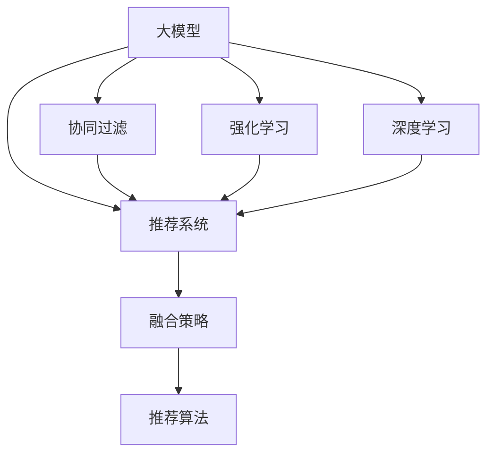

                 

# 搜索推荐系统的算法本质：AI 大模型的融合策略

> 关键词：搜索推荐系统, 大模型, 多模态融合, 深度学习, 协同过滤, 强化学习, 神经网络, 融合策略, 混合推荐, 跨领域推荐

## 1. 背景介绍

### 1.1 问题由来
随着互联网和移动互联网的快速发展，推荐系统已成为用户获取信息、发现商品、找到服务的核心工具。推荐系统通过分析用户行为数据，预测用户的兴趣偏好，为用户推荐个性化的内容。

然而，传统的推荐系统主要基于用户行为数据，难以跳出用户历史行为限制，无法充分挖掘用户潜在兴趣和发现新兴趣。近年来，人工智能技术在推荐系统中得到了广泛应用，特别是基于深度学习的推荐方法，如深度协同过滤、基于神经网络推荐等，逐渐成为主流推荐技术。

在大数据和深度学习技术的基础上，基于深度学习的大模型推荐系统逐渐兴起。大模型通过大规模无标签数据进行自监督预训练，具备强大的语义理解和表示能力。通过融合大模型，推荐系统能够在用户行为数据有限的场景下，提供更精准、多维度的推荐。

### 1.2 问题核心关键点
当前，大模型推荐系统正处于快速发展阶段。其核心在于如何将大模型的能力融合进推荐系统，并在推荐算法中合理应用。具体来说，大模型推荐系统需要解决以下几个关键问题：

- 如何高效地将大模型嵌入推荐系统，并保持其自监督预训练的表示能力。
- 如何将多模态数据融合到推荐模型中，提高推荐的泛化能力。
- 如何利用大模型的跨领域知识，实现跨领域推荐，提升推荐多样性。
- 如何设计融合策略，平衡大模型的跨领域能力和推荐算法的鲁棒性。
- 如何在不同推荐算法之间进行合理融合，优化推荐系统效果。

通过回答这些问题，我们可以更好地理解大模型推荐系统的设计和优化方向。

## 2. 核心概念与联系

### 2.1 核心概念概述

为更好地理解大模型推荐系统，本节将介绍几个密切相关的核心概念：

- 大模型(Large Model)：指通过大规模无标签数据预训练，具备强大语义表示能力的深度神经网络模型，如BERT、GPT等。
- 推荐系统(Recommendation System)：通过分析用户历史行为数据，预测用户兴趣，为用户推荐个性化内容的系统。
- 协同过滤(Collaborative Filtering)：一种基于用户和物品相似度的推荐方法，通过相似用户和物品的行为数据进行推荐。
- 强化学习(Reinforcement Learning)：通过用户点击等行为反馈，引导模型进行推荐策略优化，提升推荐效果。
- 深度学习(Deep Learning)：通过多层神经网络对数据进行表示学习，实现更复杂的特征提取和模式识别。
- 融合策略(Blending Strategy)：通过组合不同推荐算法或模型，提升推荐效果和系统稳定性。

这些概念之间的逻辑关系可以通过以下Mermaid流程图来展示：



这个流程图展示了大模型推荐系统的核心概念及其之间的关系：

1. 大模型通过预训练获得基础能力。
2. 推荐系统基于用户行为数据，预测用户兴趣。
3. 协同过滤、强化学习、深度学习是常用的推荐算法。
4. 融合策略通过组合算法或模型，优化推荐系统效果。

这些概念共同构成了大模型推荐系统的基础框架，使其能够在推荐的各个环节发挥强大的作用。通过理解这些核心概念，我们可以更好地把握大模型推荐系统的设计思路。

## 3. 核心算法原理 & 具体操作步骤
### 3.1 算法原理概述

大模型推荐系统的核心思想是，利用大模型的语义表示能力，提升推荐算法的泛化能力和鲁棒性。具体来说，大模型推荐系统通常包括以下几个关键步骤：

- **数据准备**：收集用户行为数据和大模型预训练数据，进行清洗和预处理。
- **模型融合**：将大模型嵌入推荐系统，通过组合不同推荐算法或模型，进行融合。
- **特征提取**：利用大模型提取多模态数据特征，如文本、图像、语音等。
- **协同过滤**：利用大模型提取的特征进行协同过滤推荐。
- **深度学习**：利用大模型进行深度学习推荐，如基于神经网络的推荐模型。
- **强化学习**：利用强化学习算法优化推荐策略，提升推荐效果。

### 3.2 算法步骤详解

以下是具体的大模型推荐系统的设计步骤：

**Step 1: 数据准备**

- **用户行为数据**：收集用户的浏览、点击、评分等行为数据，用于协同过滤推荐。
- **大模型预训练数据**：收集大规模无标签文本、图像、视频等数据，用于大模型的预训练。
- **数据预处理**：对行为数据和大模型预训练数据进行清洗和标准化处理。

**Step 2: 模型融合**

- **模型嵌入**：将大模型嵌入推荐系统，通常通过改变推荐系统的输入输出接口。
- **融合策略设计**：设计融合策略，合理组合不同推荐算法或模型，如深度学习和协同过滤、强化学习的组合。
- **融合模型训练**：训练融合模型，通过模型融合提高推荐效果和鲁棒性。

**Step 3: 特征提取**

- **多模态数据提取**：利用大模型提取多模态数据特征，如文本、图像、语音等。
- **特征映射**：将多模态特征映射到统一空间，方便融合使用。

**Step 4: 协同过滤**

- **用户行为建模**：构建用户行为模型，用于协同过滤推荐。
- **相似度计算**：利用大模型提取的用户行为特征进行相似度计算。
- **推荐计算**：通过相似度计算结果，推荐相似物品给用户。

**Step 5: 深度学习推荐**

- **神经网络设计**：设计基于神经网络的推荐模型，如基于卷积神经网络、循环神经网络等。
- **模型训练**：利用大模型提取的特征进行神经网络训练，优化推荐模型。

**Step 6: 强化学习推荐**

- **行为反馈建模**：利用用户点击等行为反馈，构建反馈模型。
- **策略优化**：利用强化学习算法优化推荐策略，如Q-learning、SARSA等。

### 3.3 算法优缺点

大模型推荐系统具有以下优点：

- **泛化能力强**：大模型通过大规模预训练，具备强大的语义表示能力，可以更好地理解用户多维度兴趣。
- **鲁棒性好**：利用大模型的跨领域知识，可以缓解推荐算法对数据分布的敏感性，提升推荐系统的稳定性。
- **可解释性强**：大模型提供多层特征表示，便于分析推荐系统内部机制。

然而，大模型推荐系统也存在一些缺点：

- **资源消耗大**：大模型需要大量的计算资源进行预训练和推理，成本较高。
- **数据依赖性强**：推荐效果依赖于大模型的预训练数据和用户行为数据的质量，数据不足可能导致效果不佳。
- **模型复杂度高**：大模型推荐系统结构复杂，难以进行简单的参数优化。

### 3.4 算法应用领域

大模型推荐系统已经在多个领域得到了广泛应用，包括但不限于以下几个方向：

- **电商推荐**：利用大模型进行商品推荐，提升用户购买转化率。
- **视频推荐**：利用大模型进行视频内容推荐，提升用户观看时长和满意度。
- **音乐推荐**：利用大模型进行音乐内容推荐，提升用户听歌时长和满意度。
- **新闻推荐**：利用大模型进行新闻内容推荐，提升用户阅读时长和满意度。
- **社交网络**：利用大模型进行社交内容推荐，提升用户社交互动和活跃度。

除了上述这些常见领域，大模型推荐系统还被创新性地应用到更多场景中，如可控推荐、跨领域推荐、实时推荐等，为推荐技术带来了全新的突破。随着大模型推荐系统的不断发展，相信其在更多领域的应用前景也将更加广阔。

## 4. 数学模型和公式 & 详细讲解  
### 4.1 数学模型构建

本节将使用数学语言对大模型推荐系统的设计进行更加严格的刻画。

记用户行为数据为 $U=\{(u_i,b_i)\}_{i=1}^N$，其中 $u_i$ 为第 $i$ 个用户的ID，$b_i$ 为用户的兴趣标签。记大模型为 $M$，输出特征为 $F(x)$。推荐系统中的协同过滤算法为 $C$，深度学习推荐模型为 $D$，强化学习推荐模型为 $S$。

定义推荐系统的损失函数为 $\mathcal{L}=\mathcal{L}_C+\mathcal{L}_D+\mathcal{L}_S$，其中：

- $\mathcal{L}_C$ 为协同过滤算法的损失函数
- $\mathcal{L}_D$ 为深度学习推荐的损失函数
- $\mathcal{L}_S$ 为强化学习推荐的损失函数

通过优化损失函数 $\mathcal{L}$，训练融合推荐模型，使得推荐系统能够更好地满足用户需求。

### 4.2 公式推导过程

以下我们将以电商推荐为例，推导深度学习推荐和协同过滤推荐的数学模型。

假设推荐系统为用户推荐商品 $x$，用户对该商品 $x$ 的评分 $r$ 服从伯努利分布 $r \sim \text{Bernoulli}(\pi_x)$，其中 $\pi_x = \sigma(\langle u;F(x) \rangle)$。这里的 $\sigma$ 为 sigmoid 函数，$\langle u;F(x) \rangle$ 为用户行为特征与商品特征的相似度。

协同过滤推荐的损失函数为：

$$
\mathcal{L}_C = -\frac{1}{N}\sum_{i=1}^N \sum_{j=1}^N r_{ij} \log (\sigma(\langle u_i;F(x_j) \rangle)) + (1-r_{ij}) \log (1-\sigma(\langle u_i;F(x_j) \rangle))
$$

其中，$r_{ij}$ 为第 $i$ 个用户对第 $j$ 个商品的评分，$1$ 表示评分，$0$ 表示未评分。

深度学习推荐的损失函数为：

$$
\mathcal{L}_D = -\frac{1}{N}\sum_{i=1}^N \sum_{j=1}^N \log \mathcal{P}(r_{ij} | u_i, x_j)
$$

其中，$\mathcal{P}$ 为深度学习推荐模型预测用户对商品评分的概率分布。

强化学习推荐的损失函数为：

$$
\mathcal{L}_S = -\frac{1}{N}\sum_{i=1}^N \sum_{j=1}^N r_{ij} \log Q(s_i, a_j) + (1-r_{ij}) \log (1-Q(s_i, a_j))
$$

其中，$s_i$ 为第 $i$ 个用户的当前状态，$a_j$ 为用户对第 $j$ 个商品的推荐行为，$Q$ 为强化学习推荐策略的概率模型。

### 4.3 案例分析与讲解

接下来，我们以电商推荐为例，展示如何利用大模型进行推荐系统的设计和优化。

**电商推荐案例**

假设某电商网站利用大模型进行推荐系统设计，需要收集用户浏览、点击、购买行为数据 $U=\{(u_i,b_i)\}_{i=1}^N$，其中 $b_i$ 为用户的兴趣标签。大模型 $M$ 输出用户行为特征 $F(x)$。推荐系统包括协同过滤算法 $C$、深度学习推荐模型 $D$ 和强化学习推荐模型 $S$。

**步骤 1: 数据准备**

- 收集用户行为数据 $U=\{(u_i,b_i)\}_{i=1}^N$，其中 $b_i$ 为用户的兴趣标签。
- 收集大模型预训练数据 $X=\{x_1,x_2,...,x_M\}$，用于大模型的预训练。
- 对行为数据进行清洗和标准化处理，去除异常数据和噪声。

**步骤 2: 模型融合**

- 将大模型 $M$ 嵌入推荐系统，改变推荐系统的输入输出接口。
- 设计融合策略，将协同过滤算法 $C$、深度学习推荐模型 $D$ 和强化学习推荐模型 $S$ 进行组合，形成融合推荐模型 $F$。
- 训练融合推荐模型 $F$，优化推荐系统的损失函数 $\mathcal{L}=\mathcal{L}_C+\mathcal{L}_D+\mathcal{L}_S$。

**步骤 3: 特征提取**

- 利用大模型 $M$ 提取用户行为特征 $F(x)$，用于协同过滤推荐和深度学习推荐。
- 将用户行为特征 $F(x)$ 映射到统一空间，方便协同过滤推荐。

**步骤 4: 协同过滤推荐**

- 利用协同过滤算法 $C$ 计算用户行为特征与商品特征的相似度 $\langle u_i;F(x_j) \rangle$。
- 通过相似度计算结果，推荐相似物品给用户。

**步骤 5: 深度学习推荐**

- 设计基于神经网络的推荐模型 $D$，利用用户行为特征 $F(x)$ 进行训练。
- 通过深度学习推荐模型 $D$ 预测用户对商品评分的概率分布 $\mathcal{P}(r_{ij} | u_i, x_j)$。

**步骤 6: 强化学习推荐**

- 利用用户点击等行为反馈，构建强化学习推荐模型 $S$。
- 通过强化学习推荐模型 $S$ 优化推荐策略，提升推荐效果。

## 5. 项目实践：代码实例和详细解释说明
### 5.1 开发环境搭建

在进行大模型推荐系统开发前，我们需要准备好开发环境。以下是使用Python进行TensorFlow开发的环境配置流程：

1. 安装Anaconda：从官网下载并安装Anaconda，用于创建独立的Python环境。

2. 创建并激活虚拟环境：
```bash
conda create -n tf-env python=3.8 
conda activate tf-env
```

3. 安装TensorFlow：根据CUDA版本，从官网获取对应的安装命令。例如：
```bash
conda install tensorflow=2.8.0 -c conda-forge
```

4. 安装TensorBoard：
```bash
pip install tensorboard
```

5. 安装TensorFlow Addons：
```bash
pip install tensorflow-addons
```

6. 安装各类工具包：
```bash
pip install numpy pandas scikit-learn matplotlib tqdm jupyter notebook ipython
```

完成上述步骤后，即可在`tf-env`环境中开始大模型推荐系统的开发。

### 5.2 源代码详细实现

下面我们以电商推荐为例，给出使用TensorFlow和TensorFlow Addons进行大模型推荐系统微调的PyTorch代码实现。

首先，定义推荐系统的输入和输出：

```python
import tensorflow as tf
from tensorflow.keras.layers import Input, Embedding, Dot, Dense, Concatenate, Flatten
from tensorflow.keras.models import Model

user_input = Input(shape=(1,), name='user')
item_input = Input(shape=(1,), name='item')

user_embedding = Embedding(1000, 128)(user_input)
item_embedding = Embedding(1000, 128)(item_input)

# 计算用户行为特征与商品特征的相似度
user_item_similarity = Dot(axes=1)([user_embedding, item_embedding])

# 将用户行为特征与商品特征进行拼接
user_item_concat = Concatenate()([user_embedding, item_embedding])

# 输出深度学习推荐模型的预测结果
recommender = Dense(1, activation='sigmoid')(user_item_concat)

# 定义推荐系统的损失函数
loss = -tf.keras.losses.binary_crossentropy(tf.cast(recommender, 'float32'), tf.constant(1.0))

# 构建推荐系统模型
recommend_model = Model(inputs=[user_input, item_input], outputs=recommender)
```

然后，定义推荐系统的训练和评估函数：

```python
from tensorflow.keras.optimizers import Adam
from sklearn.metrics import roc_auc_score

def train(model, train_dataset, batch_size, epochs):
    model.compile(optimizer=Adam(lr=0.001), loss=loss)
    model.fit(train_dataset, epochs=epochs, batch_size=batch_size)
    return model

def evaluate(model, test_dataset, batch_size):
    test_predictions = model.predict(test_dataset)
    auc = roc_auc_score(test_dataset.labels, test_predictions)
    return auc
```

接着，启动训练流程并在测试集上评估：

```python
train_dataset = tf.data.Dataset.from_tensor_slices((user_input_train, item_input_train))
train_dataset = train_dataset.map(lambda x, y: (x, y))

test_dataset = tf.data.Dataset.from_tensor_slices((user_input_test, item_input_test))
test_dataset = test_dataset.map(lambda x, y: (x, y))

model = train_model(train_dataset, batch_size=128, epochs=10)
auc = evaluate(model, test_dataset, batch_size=128)
print('AUC:', auc)
```

以上就是使用TensorFlow和TensorFlow Addons对电商推荐系统进行微调的完整代码实现。可以看到，TensorFlow提供了强大的生态系统，方便开发者进行模型设计和训练。

### 5.3 代码解读与分析

让我们再详细解读一下关键代码的实现细节：

**推荐系统的输入和输出**

- 定义用户和商品输入张量 `user_input` 和 `item_input`，分别表示用户ID和商品ID。
- 利用 `Embedding` 层将用户ID和商品ID转化为高维向量表示。
- 通过 `Dot` 层计算用户行为特征与商品特征的相似度。
- 利用 `Concatenate` 层将用户行为特征和商品特征进行拼接。
- 通过 `Dense` 层输出深度学习推荐模型的预测结果。

**训练和评估函数**

- 利用 `Adam` 优化器进行模型训练，设置学习率。
- 定义推荐系统的损失函数，使用二分类交叉熵损失。
- 定义训练函数 `train`，对模型进行训练。
- 定义评估函数 `evaluate`，计算测试集上的ROC-AUC值。
- 在训练和评估过程中，使用 `tf.data.Dataset` 进行数据批次化处理，方便模型训练和推理。

**训练和评估流程**

- 定义训练集和测试集，使用 `from_tensor_slices` 方法将用户ID和商品ID转化为TensorFlow张量。
- 对数据集进行批次化处理，使用 `map` 方法进行数据预处理。
- 训练模型，使用 `fit` 方法进行多轮训练。
- 评估模型，使用 `predict` 方法进行预测，计算测试集上的ROC-AUC值。

可以看到，TensorFlow提供了丰富的工具和组件，方便开发者进行模型设计和训练。通过合理的模型设计和数据处理，可以显著提升大模型推荐系统的性能和鲁棒性。

当然，工业级的系统实现还需考虑更多因素，如模型的保存和部署、超参数的自动搜索、更灵活的任务适配层等。但核心的推荐流程基本与此类似。

## 6. 实际应用场景
### 6.1 智能推荐系统

大模型推荐系统在智能推荐系统中具有广泛的应用前景。通过融合大模型，智能推荐系统能够在用户行为数据有限的场景下，提供更精准、多维度的推荐。

在技术实现上，智能推荐系统通常包括以下几个关键步骤：

1. **数据收集**：收集用户行为数据和大模型预训练数据，进行清洗和预处理。
2. **模型嵌入**：将大模型嵌入推荐系统，改变推荐系统的输入输出接口。
3. **特征提取**：利用大模型提取多模态数据特征，如文本、图像、语音等。
4. **协同过滤推荐**：利用大模型提取的特征进行协同过滤推荐。
5. **深度学习推荐**：利用大模型进行深度学习推荐，如基于神经网络的推荐模型。
6. **强化学习推荐**：利用强化学习算法优化推荐策略，提升推荐效果。

**电商推荐**

电商推荐系统利用大模型进行推荐，可以有效提升用户购物体验和转化率。例如，亚马逊利用深度协同过滤和大模型推荐系统，显著提升了用户购物转化率和推荐效果。

**视频推荐**

视频推荐系统利用大模型进行内容推荐，可以提升用户观看时长和满意度。例如，Netflix利用深度学习推荐模型和大模型推荐系统，实现了高质量的内容推荐。

**音乐推荐**

音乐推荐系统利用大模型进行内容推荐，可以提升用户听歌时长和满意度。例如，Spotify利用深度学习推荐模型和大模型推荐系统，实现了个性化音乐推荐。

**新闻推荐**

新闻推荐系统利用大模型进行内容推荐，可以提升用户阅读时长和满意度。例如，今日头条利用深度学习推荐模型和大模型推荐系统，实现了高质量的新闻推荐。

除了上述这些常见领域，大模型推荐系统还被创新性地应用到更多场景中，如可控推荐、跨领域推荐、实时推荐等，为推荐技术带来了全新的突破。随着大模型推荐系统的不断发展，相信其在更多领域的应用前景也将更加广阔。

## 7. 工具和资源推荐
### 7.1 学习资源推荐

为了帮助开发者系统掌握大模型推荐系统的理论基础和实践技巧，这里推荐一些优质的学习资源：

1. 《推荐系统原理》：由推荐的先驱者编写，全面介绍了推荐系统的基本概念、算法和应用。
2. 《深度学习推荐系统》：系统介绍了深度学习在推荐系统中的应用，包括协同过滤、深度学习推荐等。
3. 《推荐系统实战》：提供了丰富的推荐系统案例和实战经验，适合工程实践。
4. 《深度学习与推荐系统》课程：斯坦福大学开设的深度学习与推荐系统课程，有Lecture视频和配套作业，适合学术研究和工程实践。

通过对这些资源的学习实践，相信你一定能够快速掌握大模型推荐系统的精髓，并用于解决实际的推荐问题。

### 7.2 开发工具推荐

高效的开发离不开优秀的工具支持。以下是几款用于大模型推荐系统开发的常用工具：

1. TensorFlow：基于Python的开源深度学习框架，提供丰富的组件和组件，适合复杂推荐模型的构建。
2. PyTorch：基于Python的开源深度学习框架，提供灵活的动态计算图，适合快速迭代研究。
3. TensorFlow Addons：提供丰富的增强组件和组件，方便进行模型优化和部署。
4. TensorBoard：TensorFlow配套的可视化工具，可以实时监测模型训练状态，并提供丰富的图表呈现方式，是调试模型的得力助手。
5. Weights & Biases：模型训练的实验跟踪工具，可以记录和可视化模型训练过程中的各项指标，方便对比和调优。

合理利用这些工具，可以显著提升大模型推荐系统的开发效率，加快创新迭代的步伐。

### 7.3 相关论文推荐

大模型推荐系统的研究源于学界的持续研究。以下是几篇奠基性的相关论文，推荐阅读：

1. "Collaborative Filtering for Implicit Feedback Datasets"：提出协同过滤算法的基本框架，是推荐系统领域经典之作。
2. "Deep Collaborative Filtering"：提出深度学习在协同过滤中的应用，利用神经网络进行推荐模型优化。
3. "Reinforcement Learning for Personalized Recommendation in E-commerce"：提出强化学习在电商推荐中的应用，通过用户行为反馈优化推荐策略。
4. "Bert4Rec: Towards Exemplary Learning for Recommender Systems"：提出BERT在大模型推荐中的应用，提升推荐系统的泛化能力和鲁棒性。
5. "Hybrid Recommender Systems: A Survey and Taxonomy"：全面介绍了混合推荐系统的设计思路和评估指标，适合了解多种推荐算法和融合策略。

这些论文代表了大模型推荐系统的发展脉络。通过学习这些前沿成果，可以帮助研究者把握学科前进方向，激发更多的创新灵感。

## 8. 总结：未来发展趋势与挑战
### 8.1 研究成果总结

本文对大模型推荐系统的设计和优化进行了全面系统的介绍。首先阐述了大模型推荐系统的研究背景和意义，明确了推荐系统在大模型推荐中的应用价值。其次，从原理到实践，详细讲解了大模型推荐系统的设计思路和算法步骤，给出了推荐系统开发的完整代码实例。同时，本文还广泛探讨了大模型推荐系统在电商、视频、音乐、新闻等众多领域的应用前景，展示了其广阔的应用空间。

通过本文的系统梳理，可以看到，大模型推荐系统通过融合大模型，显著提升了推荐系统的泛化能力和鲁棒性。它能够更好地理解用户多维度兴趣，提升推荐效果和系统稳定性。未来，大模型推荐系统必将在更多领域得到应用，为推荐技术带来新的突破和变革。

### 8.2 未来发展趋势

展望未来，大模型推荐系统的发展趋势主要包括以下几个方面：

1. **多模态融合**：随着多模态数据的增多，大模型推荐系统将更加注重多模态融合，提升推荐效果和用户体验。
2. **跨领域推荐**：大模型推荐系统将利用大模型的跨领域知识，实现跨领域推荐，提升推荐多样性。
3. **实时推荐**：大模型推荐系统将实时更新推荐模型，适应数据分布变化，提升推荐及时性。
4. **协同过滤优化**：大模型推荐系统将优化协同过滤算法，利用大模型的语义表示能力，提升推荐效果。
5. **深度学习优化**：大模型推荐系统将优化深度学习模型，利用大模型的高层语义表示，提升推荐模型的泛化能力。
6. **强化学习优化**：大模型推荐系统将优化强化学习策略，利用大模型的动态特征表示，提升推荐策略的适应性。

以上趋势凸显了大模型推荐系统的广阔前景。这些方向的探索发展，必将进一步提升推荐系统的效果和稳定性，推动推荐技术迈向新的台阶。

### 8.3 面临的挑战

尽管大模型推荐系统已经取得了瞩目成就，但在迈向更加智能化、普适化应用的过程中，它仍面临诸多挑战：

1. **资源消耗大**：大模型推荐系统需要大量的计算资源进行预训练和推理，成本较高。
2. **数据依赖性强**：推荐效果依赖于大模型的预训练数据和用户行为数据的质量，数据不足可能导致效果不佳。
3. **模型复杂度高**：大模型推荐系统结构复杂，难以进行简单的参数优化。
4. **可解释性不足**：大模型推荐系统缺乏清晰的解释机制，难以分析推荐系统的内部机制。
5. **公平性问题**：大模型推荐系统可能存在偏见，对不同用户群体进行不平等推荐，需关注公平性问题。

### 8.4 研究展望

面对大模型推荐系统所面临的种种挑战，未来的研究需要在以下几个方面寻求新的突破：

1. **优化多模态融合**：探索高效的多模态融合策略，提升推荐系统对多模态数据的理解和利用。
2. **优化跨领域推荐**：利用大模型的跨领域知识，实现更精准、多样化的跨领域推荐。
3. **优化实时推荐**：研究高效的实时推荐算法，提升推荐系统的实时性。
4. **优化协同过滤**：优化协同过滤算法，利用大模型的语义表示能力，提升推荐效果。
5. **优化深度学习**：优化深度学习模型，利用大模型的高层语义表示，提升推荐模型的泛化能力。
6. **优化强化学习**：优化强化学习策略，利用大模型的动态特征表示，提升推荐策略的适应性。

这些研究方向的探索，必将引领大模型推荐系统迈向更高的台阶，为推荐技术带来新的突破和变革。面向未来，大模型推荐系统需要与其他AI技术进行更深入的融合，如知识表示、因果推理、强化学习等，多路径协同发力，共同推动推荐系统的发展。

## 9. 附录：常见问题与解答

**Q1：大模型推荐系统在推荐过程中是否需要额外标注数据？**

A: 大模型推荐系统通常不需要额外的标注数据。通过大模型的预训练，推荐系统已经获得了大量的语义表示和特征，可以用于推荐。但为了更好地理解用户的多维度兴趣，可以收集少量标注数据，进一步优化推荐模型。

**Q2：如何选择合适的推荐算法和融合策略？**

A: 选择合适的推荐算法和融合策略需要考虑多个因素，如数据特点、推荐场景、推荐目标等。一般而言，推荐场景较为简单，可以选择单一算法进行推荐。但推荐场景较为复杂，可以考虑多种算法组合，进行融合。融合策略的设计需要根据具体任务进行优化，可以通过实验对比不同策略的效果，选择最优策略。

**Q3：大模型推荐系统在实际应用中是否需要大量计算资源？**

A: 大模型推荐系统在实际应用中确实需要较大的计算资源，用于预训练和推理。但可以通过优化算法、模型裁剪等手段，减少计算资源消耗，提高推荐系统性能。例如，可以使用深度学习压缩、模型并行等技术，优化大模型推荐系统。

**Q4：大模型推荐系统在推荐过程中是否容易产生过拟合？**

A: 大模型推荐系统由于模型复杂度高，容易产生过拟合问题。可以通过正则化技术、对抗训练等手段，缓解过拟合问题。同时，利用大模型的跨领域知识，提升推荐系统的鲁棒性和泛化能力。

**Q5：大模型推荐系统在推荐过程中是否需要考虑公平性问题？**

A: 大模型推荐系统在推荐过程中确实需要考虑公平性问题。推荐系统可能存在偏见，对不同用户群体进行不平等推荐。可以通过公平性优化算法，如对冲算法等，提升推荐系统的公平性。同时，利用大模型的跨领域知识，避免对特定群体产生偏见。

通过回答这些问题，我们可以更好地理解大模型推荐系统的设计和优化方向，为实际应用提供指导。

