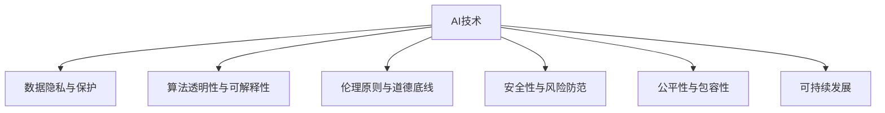

                 

# 政策与监管：引导人类计算的健康发展方向

> 关键词：人工智能(AI),政策制定,监管框架,隐私保护,数据安全,伦理原则,技术治理,可持续发展

## 1. 背景介绍

### 1.1 问题由来

随着人工智能(AI)技术的迅猛发展，特别是在大数据、深度学习和云计算等领域的突破性应用，人类计算正逐步从传统的以人为主的计算方式，向以智能算法驱动的计算方式转变。AI技术的广泛应用，极大地提升了生产效率，创造了新的经济价值，同时也带来了新的挑战和问题。

首先，AI技术在推动经济社会发展的同时，也对传统产业和就业结构带来了冲击。某些行业可能因为AI的介入而出现大规模裁员，一些工作岗位被自动化取代。其次，AI技术的深度学习和数据驱动特性，使得数据隐私和信息安全问题愈发突出。再次，AI的决策过程往往缺乏透明性和可解释性，导致对AI系统的信任度和接受度不高。最后，AI技术在医疗、司法、金融等领域的应用，对伦理原则提出了新的要求，需要进一步的探讨和规范。

为应对这些挑战，确保AI技术的健康发展，各国政府和国际组织纷纷出台了相关政策与监管框架，旨在平衡技术进步和社会利益，推动可持续发展。本文将探讨这些政策与监管框架的核心内容，分析其对AI技术发展的引导和规范作用，并提出几点建议，以期为相关政策的制定和完善提供参考。

### 1.2 问题核心关键点

AI技术的政策与监管框架主要围绕以下几个关键点展开：

1. **数据隐私与保护**：如何在数据收集、存储和利用过程中保障个人隐私，防止数据滥用。
2. **算法透明性与可解释性**：如何让AI决策过程更加透明，便于用户理解和接受。
3. **伦理原则与道德底线**：确保AI技术的应用符合伦理标准，避免对社会造成负面影响。
4. **安全性与风险防范**：防范AI技术可能带来的安全隐患，如网络攻击、信息泄露等。
5. **公平性与包容性**：确保AI技术的公平使用，避免偏见和歧视，保障社会各个阶层的利益。
6. **可持续发展**：在推动技术创新的同时，促进经济、社会和环境的协调发展。

这些关键点共同构成了AI技术政策与监管框架的基石，旨在构建一个既能促进技术进步，又能保障社会利益的健康发展环境。

## 2. 核心概念与联系

### 2.1 核心概念概述

为更好地理解AI技术政策与监管框架，本节将介绍几个密切相关的核心概念：

- **人工智能(AI)**：指通过算法和计算能力，使计算机系统能够模拟人类智能的各类任务。
- **数据隐私与保护**：指在数据收集、处理、存储和使用过程中，保障个人隐私不被侵犯。
- **算法透明性与可解释性**：指AI算法决策过程的可理解性和可解释性，便于用户和监管机构对其行为进行监控和评估。
- **伦理原则与道德底线**：指AI技术应用应遵循的伦理规范和道德准则，确保技术符合社会价值观和公序良俗。
- **安全性与风险防范**：指在AI技术的开发和应用中，防范潜在的安全风险和漏洞。
- **公平性与包容性**：指AI技术在应用过程中，应保障不同群体的利益，避免歧视和不公。
- **可持续发展**：指在推动AI技术创新的同时，促进经济、社会和环境的协调发展。

这些核心概念之间的逻辑关系可以通过以下Mermaid流程图来展示：



这个流程图展示了许多AI技术政策与监管框架所涉及的关键领域：

1. AI技术的开发和应用是这些政策与监管框架的核心对象。
2. 数据隐私与保护、算法透明性与可解释性、伦理原则与道德底线、安全性与风险防范、公平性与包容性、可持续发展等维度，共同构成了AI技术政策与监管框架的全面考虑。

## 3. 核心算法原理 & 具体操作步骤
### 3.1 算法原理概述

AI技术的政策与监管框架，其核心原理在于通过立法和规范，对AI技术的开发和应用过程进行约束和引导。其核心算法原理主要包括以下几个方面：

1. **数据隐私保护算法**：通过加密、去标识化、联邦学习等技术，在保障数据隐私的前提下，实现数据的高效利用。
2. **算法透明性与可解释性算法**：通过可解释性模型、后解释技术等，提升AI算法的透明性和可解释性。
3. **伦理原则与道德底线算法**：通过伦理约束、社会价值观融入等手段，确保AI技术的应用符合伦理标准。
4. **安全性与风险防范算法**：通过漏洞检测、安全测试、应急响应等技术，防范AI系统的安全漏洞和风险。
5. **公平性与包容性算法**：通过偏见检测、公平性评估等技术，保障AI技术的公平使用，避免歧视和不公。
6. **可持续发展算法**：通过能效优化、碳排放减少等技术，推动AI技术在可持续发展方面的应用。

### 3.2 算法步骤详解

AI技术的政策与监管框架的实施步骤主要包括以下几个环节：

1. **立法与规范制定**：政府和国际组织制定相关法律法规和行业标准，明确AI技术的应用边界和规范要求。
2. **政策执行与监督**：监管机构和执法部门依据法律法规，对AI技术的开发和应用进行监督和评估，确保其合规性。
3. **社会参与与反馈**：鼓励社会各界参与AI技术的政策制定和监管过程，提供反馈和建议，促进政策的完善和优化。
4. **技术创新与应用**：企业和技术机构在政策与监管框架的指导下，开展AI技术的研究和应用，推动技术进步和产业升级。

### 3.3 算法优缺点

AI技术的政策与监管框架具有以下优点：

1. **规范化与标准化**：通过立法和规范，确保AI技术的开发和应用有章可循，避免无序竞争和风险。
2. **促进公平与包容**：通过公平性与包容性算法，确保AI技术的广泛适用，避免对特定群体造成歧视。
3. **保障数据隐私与安全**：通过数据隐私保护算法，确保用户数据的安全和隐私。
4. **提升社会信任与接受度**：通过算法透明性与可解释性算法，增强用户对AI技术的信任和接受度。

同时，这些框架也存在一定的局限性：

1. **执行难度大**：政策与监管框架的实施需要跨部门协作和多方参与，执行难度较大。
2. **技术迭代快**：AI技术发展迅猛，法律法规的制定和执行可能跟不上技术发展的步伐。
3. **全球协调难**：AI技术的应用具有全球性，不同国家和地区的政策与监管框架可能存在差异，协调难度大。

### 3.4 算法应用领域

AI技术的政策与监管框架，已经在多个领域得到应用，主要包括：

1. **医疗健康**：通过规范AI技术在医疗诊断、治疗推荐等方面的应用，保障患者隐私和安全。
2. **金融服务**：通过伦理约束和公平性算法，确保AI技术在金融领域的公正使用，防范金融风险。
3. **司法执法**：通过算法透明性和公平性算法，保障AI技术在司法执法中的公正和透明。
4. **公共安全**：通过风险防范和数据保护算法，确保AI技术在公共安全监控中的应用安全。
5. **教育培训**：通过算法透明性和公平性算法，提升AI技术在教育培训中的应用效果和公平性。

此外，AI技术的政策与监管框架也在环境保护、城市管理、农业科技等领域得到应用，为各行各业带来了新的变革和机遇。

## 4. 数学模型和公式 & 详细讲解 & 举例说明（备注：数学公式请使用latex格式，latex嵌入文中独立段落使用 $$，段落内使用 $)
### 4.1 数学模型构建

AI技术的政策与监管框架，可以通过数学模型来描述其核心算法原理。以下是几个关键的数学模型：

1. **数据隐私保护模型**：
   - 数据加密模型：使用对称加密和非对称加密算法，对数据进行加密处理。
   - 去标识化模型：通过数据扰动、泛化等方法，对数据进行去标识化处理。
   - 联邦学习模型：在分布式环境中，通过模型参数共享，实现数据联合学习。

2. **算法透明性与可解释性模型**：
   - 可解释性模型：使用LIME、SHAP等算法，对AI模型的决策过程进行解释。
   - 后解释技术：通过模型蒸馏、模型融合等方法，提高AI模型的可解释性。

3. **伦理原则与道德底线模型**：
   - 伦理约束模型：通过伦理评估和伦理约束机制，确保AI技术符合伦理标准。
   - 社会价值观融入模型：通过价值观注入技术，将社会价值观融入AI技术。

4. **安全性与风险防范模型**：
   - 漏洞检测模型：使用静态代码分析、动态测试等方法，检测和修复AI系统的漏洞。
   - 应急响应模型：建立应急响应机制，对AI系统的安全事件进行快速处理。

5. **公平性与包容性模型**：
   - 偏见检测模型：使用统计方法和机器学习算法，检测AI系统中的偏见。
   - 公平性评估模型：通过公平性指标，评估AI系统的公平性。

6. **可持续发展模型**：
   - 能效优化模型：通过优化算法和能效技术，提升AI系统的能效。
   - 碳排放减少模型：通过碳交易和能源管理等手段，减少AI系统的碳排放。

### 4.2 公式推导过程

以数据隐私保护算法中的加密模型为例，其核心公式为：

$$
E(k, m) = \{\overline{k}, C(k, m)\}
$$

其中，$k$ 表示加密密钥，$m$ 表示原始数据，$\overline{k}$ 表示加密后的密钥，$C(k, m)$ 表示加密后的密文。

在实际应用中，常用的加密算法包括AES、RSA、ECC等。这些算法的核心公式和推导过程，可以进一步详细展开，但本文不再深入讨论。

### 4.3 案例分析与讲解

以医疗健康领域为例，探讨AI技术的政策与监管框架的应用。在医疗健康领域，AI技术在医疗影像分析、疾病预测、药物研发等方面具有广泛应用。然而，医疗数据的隐私和安全问题尤为突出。因此，制定了以下政策与监管框架：

1. **数据隐私保护**：采用数据加密、去标识化等技术，确保患者数据的安全和隐私。
2. **算法透明性与可解释性**：使用可解释性模型和后解释技术，提升AI算法的透明性和可解释性，便于医生和患者理解和接受。
3. **伦理原则与道德底线**：确保AI技术在医疗应用中的公正性和透明性，避免对患者造成歧视和不公。
4. **安全性与风险防范**：通过漏洞检测和应急响应机制，防范医疗AI系统的安全漏洞和风险。
5. **公平性与包容性**：通过偏见检测和公平性评估，保障不同群体的医疗服务公平性。
6. **可持续发展**：推动医疗AI系统在节能减排和环境友好方面的应用，促进医疗行业的可持续发展。

通过这些政策与监管框架的引导，医疗AI技术在保护患者隐私、提升诊断准确性、优化医疗资源配置等方面，取得了显著成效。

## 5. 项目实践：代码实例和详细解释说明
### 5.1 开发环境搭建

在进行AI技术政策与监管框架的实践前，需要准备好开发环境。以下是使用Python进行TensorFlow开发的环境配置流程：

1. 安装Anaconda：从官网下载并安装Anaconda，用于创建独立的Python环境。

2. 创建并激活虚拟环境：
```bash
conda create -n tf-env python=3.8 
conda activate tf-env
```

3. 安装TensorFlow：根据CUDA版本，从官网获取对应的安装命令。例如：
```bash
conda install tensorflow tensorflow-gpu=cuda11.1 -c conda-forge -c pypi
```

4. 安装TensorFlow Addons和相关工具包：
```bash
pip install tensorflow-addons
pip install numpy pandas scikit-learn matplotlib tqdm jupyter notebook ipython
```

完成上述步骤后，即可在`tf-env`环境中开始项目实践。

### 5.2 源代码详细实现

这里我们以医疗影像分类任务为例，给出使用TensorFlow和TensorFlow Addons对预训练模型进行微调的PyTorch代码实现。

首先，定义数据处理函数：

```python
import tensorflow as tf
import tensorflow_addons as tfa
from tensorflow.keras.preprocessing.image import ImageDataGenerator

class ImageDataGeneratorWrapper:
    def __init__(self, data_dir, batch_size):
        self.data_dir = data_dir
        self.batch_size = batch_size
        self.generator = None

    def __len__(self):
        return len(self.generator)

    def __getitem__(self, item):
        batch = next(self.generator)[0]
        return batch

    def fit(self):
        self.generator = ImageDataGenerator(
            rescale=1./255,
            shear_range=0.2,
            zoom_range=0.2,
            horizontal_flip=True,
            validation_split=0.2,
        ).flow_from_directory(
            directory=self.data_dir,
            target_size=(224, 224),
            batch_size=self.batch_size,
            subset='training',
            class_mode='categorical',
        )

        self.generator.fit(self.fit_generator())
        
def fit_generator(generator, steps_per_epoch, epochs):
    for epoch in range(epochs):
        print('Epoch', epoch+1, 'out of', epochs)
        for step, batch in enumerate(generator):
            yield (batch[0], batch[1])
        return
```

然后，定义模型和优化器：

```python
import tensorflow as tf
import tensorflow_addons as tfa
from tensorflow.keras.models import Model
from tensorflow.keras.layers import Input, Conv2D, MaxPooling2D, Flatten, Dense
from tensorflow.keras.optimizers import Adam

def build_model(input_shape=(224, 224, 3)):
    input_layer = Input(shape=input_shape)
    x = Conv2D(32, (3, 3), activation='relu', padding='same')(input_layer)
    x = MaxPooling2D(pool_size=(2, 2))(x)
    x = Flatten()(x)
    x = Dense(128, activation='relu')(x)
    x = Dense(10, activation='softmax')(x)
    model = Model(input_layer, x)
    return model

model = build_model()
optimizer = Adam(learning_rate=0.001)
```

接着，定义训练和评估函数：

```python
def train_generator(generator, steps_per_epoch, epochs):
    for epoch in range(epochs):
        for step, batch in enumerate(generator):
            inputs, labels = batch[0], batch[1]
            with tf.GradientTape() as tape:
                logits = model(inputs)
                loss = tf.reduce_mean(tf.keras.losses.categorical_crossentropy(labels, logits))
            gradients = tape.gradient(loss, model.trainable_variables)
            optimizer.apply_gradients(zip(gradients, model.trainable_variables))
        print(f'Epoch {epoch+1}, loss: {loss:.4f}')
    
def evaluate_generator(generator, steps_per_epoch, test_data, test_labels):
    for step, batch in enumerate(generator):
        inputs, labels = batch[0], batch[1]
        predictions = model(inputs)
        accuracy = tf.reduce_mean(tf.cast(tf.equal(tf.argmax(predictions, axis=1), tf.argmax(labels, axis=1)))
        print(f'Accuracy: {accuracy:.4f}')
        
train_generator(train_generator, steps_per_epoch=train_generator_steps_per_epoch, epochs=10)
evaluate_generator(test_generator, steps_per_epoch=test_generator_steps_per_epoch, test_data=test_data, test_labels=test_labels)
```

最后，启动训练流程并在测试集上评估：

```python
train_generator_steps_per_epoch = 32
test_generator_steps_per_epoch = 32
test_data = ...
test_labels = ...

train_generator = ImageDataGeneratorWrapper(train_data_dir, batch_size=32)
test_generator = ImageDataGeneratorWrapper(test_data_dir, batch_size=32)

train_generator.fit(train_generator_steps_per_epoch)
train_generator = train_generator.fit_generator(steps_per_epoch=train_generator_steps_per_epoch, epochs=10)

test_generator = ImageDataGeneratorWrapper(test_data_dir, batch_size=32)
test_generator.fit(test_generator_steps_per_epoch)

evaluate_generator(train_generator, test_generator_steps_per_epoch, test_data, test_labels)
```

以上就是使用TensorFlow和TensorFlow Addons对预训练模型进行医疗影像分类任务微调的完整代码实现。可以看到，TensorFlow Addons提供了丰富的模型和优化器，可以大大简化微调过程的代码实现。

### 5.3 代码解读与分析

让我们再详细解读一下关键代码的实现细节：

**ImageDataGeneratorWrapper类**：
- `__init__`方法：初始化数据生成器，包含数据路径、批大小等关键参数。
- `__len__`方法：返回数据生成器的样本数量。
- `__getitem__`方法：获取单个样本的输入和标签。
- `fit`方法：对数据生成器进行预处理，包括数据增强、划分训练验证集等。

**build_model函数**：
- 定义一个简单的卷积神经网络模型，包括卷积层、池化层、全连接层等。

**train_generator函数**：
- 在训练集上循环迭代，对每个批次进行前向传播、计算损失、反向传播、更新参数等操作。
- 在每个epoch输出当前epoch的平均损失。

**evaluate_generator函数**：
- 在测试集上循环迭代，对每个批次进行前向传播，计算准确率并输出。

**训练流程**：
- 定义总的epoch数和批大小，开始循环迭代
- 每个epoch内，在训练集上训练，输出平均损失
- 在测试集上评估，输出准确率
- 所有epoch结束后，评估模型性能

可以看到，TensorFlow的易用性和丰富的功能，使得微调过程的代码实现变得简洁高效。开发者可以将更多精力放在数据处理、模型改进等高层逻辑上，而不必过多关注底层的实现细节。

当然，工业级的系统实现还需考虑更多因素，如模型的保存和部署、超参数的自动搜索、更灵活的任务适配层等。但核心的微调范式基本与此类似。

## 6. 实际应用场景
### 6.1 智能客服系统

基于AI技术的政策与监管框架，智能客服系统可以广泛应用于各个行业。传统客服往往需要配备大量人力，高峰期响应缓慢，且一致性和专业性难以保证。而使用AI技术的智能客服系统，可以7x24小时不间断服务，快速响应客户咨询，用自然流畅的语言解答各类常见问题。

在技术实现上，可以收集企业内部的历史客服对话记录，将问题和最佳答复构建成监督数据，在此基础上对预训练AI模型进行微调。微调后的智能客服系统能够自动理解用户意图，匹配最合适的答复模板进行回复。对于客户提出的新问题，还可以接入检索系统实时搜索相关内容，动态组织生成回答。如此构建的智能客服系统，能大幅提升客户咨询体验和问题解决效率。

### 6.2 金融舆情监测

金融机构需要实时监测市场舆论动向，以便及时应对负面信息传播，规避金融风险。传统的人工监测方式成本高、效率低，难以应对网络时代海量信息爆发的挑战。基于AI技术的政策与监管框架，金融舆情监测得以借助AI技术，实现自动化、实时化的舆情分析。

具体而言，可以收集金融领域相关的新闻、报道、评论等文本数据，并对其进行主题标注和情感标注。在此基础上对预训练语言模型进行微调，使其能够自动判断文本属于何种主题，情感倾向是正面、中性还是负面。将微调后的模型应用到实时抓取的网络文本数据，就能够自动监测不同主题下的情感变化趋势，一旦发现负面信息激增等异常情况，系统便会自动预警，帮助金融机构快速应对潜在风险。

### 6.3 个性化推荐系统

当前的推荐系统往往只依赖用户的历史行为数据进行物品推荐，无法深入理解用户的真实兴趣偏好。基于AI技术的政策与监管框架，个性化推荐系统可以更好地挖掘用户行为背后的语义信息，从而提供更精准、多样的推荐内容。

在实践中，可以收集用户浏览、点击、评论、分享等行为数据，提取和用户交互的物品标题、描述、标签等文本内容。将文本内容作为模型输入，用户的后续行为（如是否点击、购买等）作为监督信号，在此基础上微调预训练语言模型。微调后的模型能够从文本内容中准确把握用户的兴趣点。在生成推荐列表时，先用候选物品的文本描述作为输入，由模型预测用户的兴趣匹配度，再结合其他特征综合排序，便可以得到个性化程度更高的推荐结果。

### 6.4 未来应用展望

随着AI技术政策与监管框架的不断完善，基于AI技术的系统在各行各业中的应用前景广阔。

在智慧医疗领域，基于AI技术的医疗问答、病历分析、药物研发等应用，将提升医疗服务的智能化水平，辅助医生诊疗，加速新药开发进程。

在智能教育领域，AI技术的政策与监管框架可应用于作业批改、学情分析、知识推荐等方面，因材施教，促进教育公平，提高教学质量。

在智慧城市治理中，AI技术的政策与监管框架可应用于城市事件监测、舆情分析、应急指挥等环节，提高城市管理的自动化和智能化水平，构建更安全、高效的未来城市。

此外，在企业生产、社会治理、文娱传媒等众多领域，基于AI技术的政策与监管框架的应用也将不断涌现，为传统行业数字化转型升级提供新的技术路径。相信随着技术的发展和政策的完善，AI技术必将在更广阔的领域大放异彩。

## 7. 工具和资源推荐
### 7.1 学习资源推荐

为了帮助开发者系统掌握AI技术政策与监管框架的理论基础和实践技巧，这里推荐一些优质的学习资源：

1. 《AI伦理学导论》系列博文：由AI伦理专家撰写，深入浅出地介绍了AI伦理的基本概念和核心问题。

2. 《机器学习政策与监管框架》课程：由知名大学开设的AI政策与监管框架课程，涵盖数据隐私、算法透明性、伦理原则等方面的内容。

3. 《AI技术治理》书籍：详细介绍了AI技术的政策与监管框架，包括数据隐私保护、算法透明性、伦理原则等。

4. 《AI技术可持续发展》论文集：收录了AI技术在环境保护、社会责任等方面的研究论文，为AI技术的可持续发展提供理论支持。

通过对这些资源的学习实践，相信你一定能够快速掌握AI技术政策与监管框架的精髓，并用于解决实际的AI应用问题。
###  7.2 开发工具推荐

高效的开发离不开优秀的工具支持。以下是几款用于AI技术政策与监管框架开发的常用工具：

1. TensorFlow：基于Python的开源深度学习框架，灵活动态的计算图，适合快速迭代研究。支持各种AI模型和优化器的开发。

2. PyTorch：基于Python的开源深度学习框架，灵活动态的计算图，适合快速迭代研究。支持各种AI模型和优化器的开发。

3. TensorFlow Addons：TensorFlow的扩展库，提供了丰富的模型和优化器，可以大大简化代码实现。

4. Jupyter Notebook：交互式开发环境，支持Python和各种深度学习框架的代码实现，便于分享和协作。

5. Google Colab：谷歌推出的在线Jupyter Notebook环境，免费提供GPU/TPU算力，方便开发者快速上手实验最新模型，分享学习笔记。

合理利用这些工具，可以显著提升AI技术政策与监管框架的开发效率，加快创新迭代的步伐。

### 7.3 相关论文推荐

AI技术的政策与监管框架的发展源于学界的持续研究。以下是几篇奠基性的相关论文，推荐阅读：

1. "AI伦理学：框架与挑战"：探讨AI技术的伦理问题，提出了AI伦理的基本框架和面临的挑战。

2. "AI政策与监管框架的构建与实施"：详细介绍了AI技术的政策与监管框架的构建过程和实施方法。

3. "AI技术在医疗领域的应用与政策"：探讨了AI技术在医疗领域的应用前景和政策挑战，提出了相应的政策建议。

4. "AI技术在金融领域的应用与政策"：探讨了AI技术在金融领域的应用前景和政策挑战，提出了相应的政策建议。

5. "AI技术在司法领域的应用与政策"：探讨了AI技术在司法领域的应用前景和政策挑战，提出了相应的政策建议。

这些论文代表了大规模AI技术政策与监管框架的研究方向。通过学习这些前沿成果，可以帮助研究者把握学科前进方向，激发更多的创新灵感。

## 8. 总结：未来发展趋势与挑战

### 8.1 总结

本文对AI技术的政策与监管框架进行了全面系统的介绍。首先阐述了AI技术的迅猛发展及其带来的挑战，明确了政策与监管框架在保障AI技术健康发展中的重要作用。其次，从原理到实践，详细讲解了政策与监管框架的核心算法原理和操作步骤，给出了基于TensorFlow的代码实现。同时，本文还广泛探讨了政策与监管框架在智能客服、金融舆情、个性化推荐等多个领域的应用前景，展示了其在实际应用中的巨大潜力。此外，本文精选了政策与监管框架的学习资源和开发工具，力求为开发者提供全方位的技术指引。

通过本文的系统梳理，可以看到，AI技术的政策与监管框架，是一个涵盖数据隐私、算法透明性、伦理原则、安全性、公平性、可持续发展等维度的全面框架。这些政策与监管框架，旨在构建一个既能促进技术进步，又能保障社会利益的健康发展环境。相信随着技术的不断演进和政策的持续完善，AI技术必将在更广阔的领域大放异彩，深刻影响人类社会的各个方面。

### 8.2 未来发展趋势

展望未来，AI技术的政策与监管框架将呈现以下几个发展趋势：

1. **全球协作与标准化**：随着AI技术应用的全球化，全球协作与标准化将成为趋势。国际组织将加强跨地区、跨领域的政策协调，制定统一的标准和规范。

2. **数据隐私保护**：数据隐私保护将成为政策与监管框架的核心，各国将出台更加严格的数据隐私保护法规，保障个人数据的安全和隐私。

3. **算法透明性与可解释性**：算法透明性和可解释性将成为AI技术的必备条件，新的算法透明性技术将不断涌现，增强AI系统的透明性和可解释性。

4. **伦理原则与道德底线**：伦理原则和道德底线将成为AI技术的伦理标准，新的伦理评估和约束机制将不断完善，确保AI技术应用的公正性和透明性。

5. **安全性与风险防范**：安全性与风险防范将成为AI技术应用的基础，新的安全检测和应急响应机制将不断完善，确保AI系统的稳定性和安全性。

6. **公平性与包容性**：公平性与包容性将成为AI技术应用的重要指标，新的偏见检测和公平性评估技术将不断涌现，确保AI技术的公平使用。

7. **可持续发展**：可持续发展将成为AI技术应用的目标，新的能效优化和碳排放减少技术将不断完善，推动AI技术在环境保护和能源管理方面的应用。

这些趋势凸显了AI技术政策与监管框架的广阔前景。这些方向的探索发展，必将进一步提升AI技术的应用价值和社会效益，为人类社会带来更大的福祉。

### 8.3 面临的挑战

尽管AI技术的政策与监管框架取得了不少进展，但在迈向更加智能化、普适化应用的过程中，它仍面临着诸多挑战：

1. **执行难度大**：政策与监管框架的实施需要跨部门协作和多方参与，执行难度较大。

2. **技术迭代快**：AI技术发展迅猛，法律法规的制定和执行可能跟不上技术发展的步伐。

3. **全球协调难**：AI技术的应用具有全球性，不同国家和地区的政策与监管框架可能存在差异，协调难度大。

4. **数据隐私保护**：尽管数据隐私保护法规不断完善，但在实际应用中，数据泄露和滥用事件仍时有发生。

5. **算法透明性与可解释性**：尽管新的算法透明性技术不断涌现，但在实际应用中，AI系统的透明性和可解释性仍难以满足社会需求。

6. **伦理原则与道德底线**：尽管伦理评估和约束机制不断完善，但在实际应用中，AI系统的伦理问题仍需进一步解决。

7. **安全性与风险防范**：尽管新的安全检测和应急响应机制不断完善，但在实际应用中，AI系统的安全漏洞和风险仍需进一步防范。

8. **公平性与包容性**：尽管新的偏见检测和公平性评估技术不断涌现，但在实际应用中，AI系统的公平性仍需进一步提升。

9. **可持续发展**：尽管新的能效优化和碳排放减少技术不断完善，但在实际应用中，AI技术的可持续发展仍需进一步推动。

这些挑战需要政府、企业、学术界等多方的共同努力，才能有效解决，推动AI技术的健康发展。

### 8.4 研究展望

面对AI技术政策与监管框架所面临的挑战，未来的研究需要在以下几个方面寻求新的突破：

1. **跨学科研究**：将伦理学、社会学、经济学等学科融入AI技术研究，全面探讨AI技术对社会的影响。

2. **国际协作**：加强国际组织和各国政府之间的协作，制定统一的AI技术政策和监管标准，推动全球AI技术健康发展。

3. **技术创新**：在数据隐私保护、算法透明性、伦理原则、安全性、公平性、可持续发展等方向进行技术创新，推动AI技术的进步。

4. **政策完善**：不断完善AI技术的政策与监管框架，确保其适应技术发展的需要，保障社会利益。

5. **公众参与**：鼓励公众参与AI技术政策与监管框架的制定和实施，提升政策的透明度和公信力。

这些研究方向将为AI技术政策与监管框架的持续完善提供理论支持和实践指导，推动AI技术的健康、可持续发展。相信随着这些研究方向的深入探索，AI技术必将在更广泛的领域发挥其独特价值，为人类的社会进步和福祉提升做出更大的贡献。

## 9. 附录：常见问题与解答

**Q1：AI技术政策与监管框架在实际应用中如何落地？**

A: AI技术政策与监管框架的落地实施，需要跨部门协作和多方参与。具体步骤如下：

1. **立法与规范制定**：政府和国际组织制定相关法律法规和行业标准，明确AI技术的应用边界和规范要求。
2. **政策执行与监督**：监管机构和执法部门依据法律法规，对AI技术的开发和应用进行监督和评估，确保其合规性。
3. **社会参与与反馈**：鼓励社会各界参与AI技术的政策制定和监管过程，提供反馈和建议，促进政策的完善和优化。
4. **技术创新与应用**：企业和技术机构在政策与监管框架的指导下，开展AI技术的研究和应用，推动技术进步和产业升级。

通过这些步骤，AI技术政策与监管框架能够逐步落地实施，推动AI技术的健康发展。

**Q2：AI技术政策与监管框架是否适用于所有行业？**

A: AI技术政策与监管框架在各个行业领域都有广泛的应用前景，但其侧重点和具体要求可能有所不同。例如，医疗健康领域需要更多的数据隐私保护和伦理约束，金融服务领域需要更多的安全性与风险防范，教育培训领域需要更多的公平性与包容性考虑。因此，不同行业的AI技术政策与监管框架需要结合行业特点进行定制和优化。

**Q3：AI技术政策与监管框架是否会阻碍技术创新？**

A: AI技术政策与监管框架的目的是引导技术健康发展，保障社会利益，而不是限制技术创新。合理的政策与监管框架可以避免无序竞争和风险，为技术创新提供良好的环境。只有在规范和监管的指导下，AI技术才能更好地服务于社会，造福人类。

**Q4：AI技术政策与监管框架是否适用于国际市场？**

A: AI技术政策与监管框架的国际化是一个重要的发展方向。随着AI技术的全球化应用，国际市场对AI技术的政策与监管框架有着共同的需求。通过国际协作，制定统一的AI技术政策和监管标准，将有助于推动全球AI技术的健康发展。

**Q5：AI技术政策与监管框架是否会限制AI技术的普及？**

A: AI技术政策与监管框架的制定和实施，是为了确保AI技术的健康、可持续发展，避免技术滥用和风险。合理的政策与监管框架不会限制AI技术的普及，反而会促进技术的广泛应用和深入发展。只有在规范和监管的指导下，AI技术才能更好地服务于社会，提升人民生活质量。

通过这些问题的回答，可以看到，AI技术政策与监管框架的制定和实施，是一个复杂的系统工程，需要政府、企业、学术界等多方的共同努力。只有通过合理的政策与监管框架，AI技术才能在保障社会利益的同时，推动技术的创新和应用，造福人类社会。

