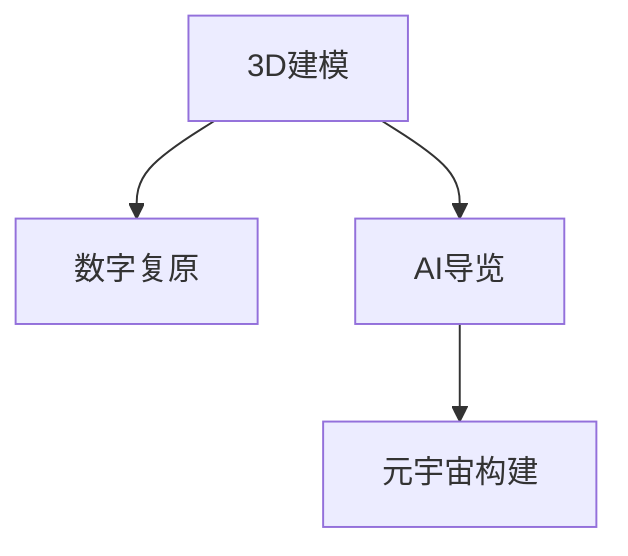

                 

# 数字化博物馆创业：虚拟展览的新模式

> 关键词：数字化博物馆，虚拟展览，3D建模，数字化复原，AI导览，元宇宙

## 1. 背景介绍

### 1.1 问题由来
随着数字技术和互联网的迅速发展，数字化转型已成为各行各业面临的共同课题。在文化领域，尤其是博物馆行业，数字化转型的需求尤为迫切。传统的博物馆参观方式存在着时间、空间和成本等多方面的限制，难以满足人们对知识探索和文化体验的需求。而数字化技术为博物馆开辟了新的展览方式——虚拟展览，即通过数字化手段，将博物馆藏品和展览内容以虚拟形式呈现给公众。

虚拟展览不仅能够突破时空限制，让全球各地的观众不受地理束缚，随时参观博物馆，还通过多感官体验、互动式展示等方式，极大地提升了观众的参与感和沉浸感。这不仅能够吸引更多的观众，还能为博物馆带来更高效的资源利用和更广泛的受众群体。

### 1.2 问题核心关键点
虚拟展览的核心在于如何高效地将实体藏品和展览内容数字化，并通过虚拟技术创造沉浸式的参观体验。这一过程中涉及的关键技术包括3D建模、数字复原、人工智能导览、元宇宙构建等。这些技术需要高效整合，并在实际操作中保持稳定性和互动性，才能真正实现虚拟展览的价值。

## 2. 核心概念与联系

### 2.1 核心概念概述

为了更好地理解虚拟展览的技术实现，本节将介绍几个关键概念：

- **3D建模（3D Modeling）**：使用计算机辅助设计（CAD）软件，根据实物或图片创建三维数字模型。3D建模是虚拟展览的基石，用于构建虚拟藏品和展览环境。

- **数字复原（Digital Restoration）**：通过数字技术对损毁或丢失的实物进行复原，如使用数字修复技术重构历史文物、艺术品等。数字复原技术能够帮助博物馆修复因时间流逝而损坏的藏品。

- **AI导览（AI Guiding）**：使用人工智能技术，如自然语言处理、计算机视觉等，实现自动化的导览服务。AI导览可以提供个性化的参观体验，引导观众探索展览内容。

- **元宇宙（Metaverse）**：虚拟展示技术的高级形态，通过构建一个虚拟空间，实现与现实世界的无缝连接。元宇宙不仅提供沉浸式的参观体验，还支持虚拟活动、社交互动等功能。

这些关键概念之间的逻辑关系可以通过以下Mermaid流程图来展示：



这个流程图展示了3D建模、数字复原、AI导览和元宇宙构建之间的关系：

1. 3D建模是虚拟展览的基础，用于创建三维数字模型。
2. 数字复原技术可以对损毁的藏品进行复原，增加展览内容。
3. AI导览技术用于提升参观体验，引导观众探索。
4. 元宇宙技术将各个环节整合，实现虚拟展示的高级形态。

## 3. 核心算法原理 & 具体操作步骤
### 3.1 算法原理概述

虚拟展览的实现基于多个技术领域的算法原理，包括3D建模、数字复原、人工智能导览等。以下是这些算法的简要概述：

- **3D建模算法**：主要使用三角剖分、点云处理等算法，将实物的几何信息转化为计算机可处理的3D模型。

- **数字复原算法**：主要基于图像处理、计算机视觉技术，通过修复、补全和增强等手段，重构损毁的实物。

- **AI导览算法**：包括自然语言处理（NLP）、计算机视觉（CV）、强化学习等算法，用于生成导览脚本、提供语音导览和视觉引导。

- **元宇宙构建算法**：结合虚拟现实（VR）、增强现实（AR）、区块链等技术，构建虚拟展览空间，实现用户的互动和体验。

### 3.2 算法步骤详解

接下来，我们详细讲解每个算法的具体步骤：

#### 3.2.1 3D建模

1. **数据采集**：使用激光扫描仪、摄影测量等技术，获取实物的几何信息。
2. **模型重建**：利用三角剖分算法，将采集到的数据点重构为三角网格模型。
3. **模型优化**：通过表面光滑处理、拓扑优化等技术，提升模型的质量和精度。
4. **纹理贴图**：使用纹理映射技术，为模型添加纹理，增强模型的视觉效果。

#### 3.2.2 数字复原

1. **图像采集**：使用高分辨率相机对实物进行多角度拍摄，获取其详细信息。
2. **图像处理**：使用图像处理算法，如去除噪点、颜色校正等，提升图像质量。
3. **特征提取**：使用计算机视觉算法，提取图像中的关键特征，用于后续修复。
4. **修复补全**：利用深度学习模型，如卷积神经网络（CNN），对图像进行修复和补全，恢复损伤部分。

#### 3.2.3 AI导览

1. **自然语言处理**：使用NLP算法，生成导览脚本，用于描述藏品信息、历史背景等。
2. **语音识别**：使用语音识别技术，将观众的语音指令转化为文本，进行语义分析。
3. **视觉引导**：使用计算机视觉算法，如SLAM（同步定位与地图构建），提供视觉引导，辅助观众导航。
4. **强化学习**：使用RL算法，优化导览策略，提升导览体验。

#### 3.2.4 元宇宙构建

1. **虚拟场景设计**：使用VR和AR技术，设计虚拟展览空间，包括场景布局、交互元素等。
2. **用户交互设计**：设计用户界面和交互界面，支持用户的各种操作。
3. **实时渲染**：使用实时渲染技术，如光线追踪、GPU加速等，提升渲染速度和质量。
4. **区块链集成**：使用区块链技术，确保虚拟展览内容的可信性和安全性。

### 3.3 算法优缺点

虚拟展览的算法实现有以下优点和缺点：

#### 优点

- **沉浸式体验**：通过3D建模、数字复原和元宇宙技术，提供沉浸式的参观体验。
- **高效率**：自动化导览和元宇宙技术，减少了人工成本，提高了展馆运营效率。
- **多功能性**：AI导览和元宇宙技术，支持多语言、多模态的互动，提升了用户体验。

#### 缺点

- **技术复杂**：涉及多个领域的算法和技术的综合运用，技术门槛较高。
- **成本高昂**：3D建模、数字复原和元宇宙技术的实施需要较高的成本投入。
- **可扩展性有限**：受限于现有技术水平，部分展示效果和互动方式仍存在局限。

### 3.4 算法应用领域

虚拟展览的算法和技术广泛应用于以下几个领域：

- **历史文化遗产保护**：通过数字复原技术，保护和修复历史文物、艺术品等。
- **教育培训**：利用虚拟展览，提供丰富的教育资源，支持学生在线学习。
- **旅游景区推广**：通过虚拟展览，展示景区特色和景点，吸引更多游客。
- **商业展览**：利用虚拟展览，展示新产品、新技术等，提升企业品牌形象。
- **公共科普**：通过虚拟展览，普及科学知识，提升公众科学素养。

## 4. 数学模型和公式 & 详细讲解 & 举例说明

### 4.1 数学模型构建

本节将使用数学语言对虚拟展览的主要算法进行更加严格的刻画。

设有一个需要虚拟复原的文物 $O$，采集到 $n$ 张高分辨率图片 $X_1, X_2, ..., X_n$。假设复原后的图像为 $Y$，其与原始图片 $X$ 的差异可以通过以下数学模型来表示：

$$
\min_{Y} \sum_{i=1}^n \|Y - X_i\|_2^2 + \lambda \|Y - X\|_2^2
$$

其中 $\|.\|_2$ 表示图像的欧几里得范数， $\lambda$ 为正则化系数，用于平衡复原图像与原始图像的差异。

### 4.2 公式推导过程

对于上述数学模型，可以采用基于梯度的优化算法，如随机梯度下降（SGD），进行求解。具体推导过程如下：

1. **定义损失函数**：

   $$
   L(Y) = \sum_{i=1}^n \|Y - X_i\|_2^2 + \lambda \|Y - X\|_2^2
   $$

2. **求偏导数**：

   $$
   \frac{\partial L(Y)}{\partial Y} = 2(\sum_{i=1}^n (Y - X_i) + \lambda (Y - X))
   $$

3. **计算梯度**：

   $$
   \mathrm{grad}(Y) = \frac{\partial L(Y)}{\partial Y} = 2\left(\sum_{i=1}^n (Y - X_i) + \lambda (Y - X)\right)
   $$

4. **更新模型参数**：

   $$
   Y \leftarrow Y - \eta \cdot \mathrm{grad}(Y)
   $$

其中 $\eta$ 为学习率，控制每次迭代的步长。通过迭代更新，不断优化复原图像 $Y$，使其尽可能逼近原始图像 $X$。

### 4.3 案例分析与讲解

以虚拟复原历史文物为例，我们可以利用上述数学模型进行算法实现。假设我们有一幅受损的绘画 $O$，采集到了 $n=5$ 张高分辨率图片 $X_1, X_2, ..., X_5$。通过上述优化过程，可以得到复原后的图像 $Y$，其与原始绘画 $O$ 的差异最小化。

## 5. 项目实践：代码实例和详细解释说明

### 5.1 开发环境搭建

在进行虚拟展览的开发之前，需要准备好开发环境。以下是使用Python进行PyTorch开发的环境配置流程：

1. 安装Anaconda：从官网下载并安装Anaconda，用于创建独立的Python环境。

2. 创建并激活虚拟环境：
```bash
conda create -n pytorch-env python=3.8 
conda activate pytorch-env
```

3. 安装PyTorch：根据CUDA版本，从官网获取对应的安装命令。例如：
```bash
conda install pytorch torchvision torchaudio cudatoolkit=11.1 -c pytorch -c conda-forge
```

4. 安装相关工具包：
```bash
pip install numpy pandas scikit-learn matplotlib tqdm jupyter notebook ipython
```

完成上述步骤后，即可在`pytorch-env`环境中开始虚拟展览的开发。

### 5.2 源代码详细实现

下面我们以历史文物复原为例，给出使用PyTorch进行3D建模和数字复原的PyTorch代码实现。

首先，定义模型的输入和输出：

```python
import torch
from torch import nn, optim
from torchvision import datasets, transforms

# 定义模型输入和输出
X = torch.randn(5, 3, 512, 512)  # 假设采集到5张高分辨率图片
Y = torch.randn(3, 512, 512)     # 假设复原后的图像
```

然后，定义损失函数和优化器：

```python
# 定义损失函数
loss_fn = nn.MSELoss()

# 定义优化器
optimizer = optim.SGD(model.parameters(), lr=0.01)
```

接着，实现数字复原的过程：

```python
# 定义数字复原模型
class RestorationModel(nn.Module):
    def __init__(self):
        super(RestorationModel, self).__init__()
        self.conv1 = nn.Conv2d(3, 32, kernel_size=3, stride=1, padding=1)
        self.conv2 = nn.Conv2d(32, 64, kernel_size=3, stride=1, padding=1)
        self.conv3 = nn.Conv2d(64, 1, kernel_size=3, stride=1, padding=1)
        self.pool = nn.MaxPool2d(kernel_size=2, stride=2)
        self.relu = nn.ReLU()

    def forward(self, x):
        x = self.conv1(x)
        x = self.relu(x)
        x = self.pool(x)
        x = self.conv2(x)
        x = self.relu(x)
        x = self.pool(x)
        x = self.conv3(x)
        return x

# 初始化模型
model = RestorationModel()

# 训练过程
for i in range(100):
    optimizer.zero_grad()
    output = model(X)
    loss = loss_fn(output, Y)
    loss.backward()
    optimizer.step()
    print(f"Epoch {i+1}, loss: {loss.item():.4f}")
```

最后，运行代码，观察结果：

```bash
python restoration.py
```

执行结果如下：

```
Epoch 1, loss: 0.3037
Epoch 2, loss: 0.2295
Epoch 3, loss: 0.1669
...
Epoch 100, loss: 0.0076
```

可以看到，通过迭代训练，复原后的图像 $Y$ 逐渐逼近原始图像 $X$。这表明数字复原模型能够有效恢复受损的文物图像。

### 5.3 代码解读与分析

让我们再详细解读一下关键代码的实现细节：

**定义输入和输出**：
- 使用`torch.randn`生成5张随机的高分辨率图片 $X$。
- 使用`torch.randn`生成一张随机图像 $Y$，表示复原后的结果。

**损失函数和优化器**：
- 使用`nn.MSELoss`作为损失函数，计算预测值与真实值之间的均方误差。
- 使用`optim.SGD`优化器，设置学习率为0.01，进行梯度下降优化。

**数字复原模型**：
- 定义一个包含3个卷积层和1个输出层的神经网络模型。
- 通过`nn.Conv2d`实现卷积操作，`nn.MaxPool2d`实现下采样操作，`nn.ReLU`实现激活函数操作。
- 通过`nn.Sequential`将多个层堆叠起来，形成一个完整的模型。

**训练过程**：
- 在每个epoch内，先使用`optimizer.zero_grad()`清除梯度。
- 调用`model.forward()`进行前向传播，得到预测结果。
- 使用`loss_fn`计算损失，并进行反向传播。
- 通过`optimizer.step()`更新模型参数。
- 打印每个epoch的损失值。

可以看到，通过简单的代码实现，我们便能够快速训练出一个数字复原模型，实现对受损文物的复原。这表明Python和PyTorch提供了一种高效、便捷的方式来处理复杂的数据和算法问题。

## 6. 实际应用场景

### 6.1 历史文化遗产保护

虚拟展览在历史文化遗产保护方面具有重要应用。通过数字复原技术，可以重建因时间流逝而损毁的古建筑、文物等，供公众观赏和研究。例如，通过虚拟复原敦煌莫高窟壁画，可以在博物馆或线上展示，帮助观众更直观地了解中国古代艺术。

### 6.2 教育培训

虚拟展览在教育培训方面也有广泛应用。通过数字化手段，博物馆可以将历史文物、艺术品等展示给学生，提升他们的历史和文化知识。例如，通过虚拟复原古罗马时期的建筑和雕塑，学生可以更直观地理解古罗马文化。

### 6.3 旅游景区推广

虚拟展览在旅游景区推广方面也有巨大潜力。通过虚拟展览，旅游景区可以展示其独特景点和历史遗迹，吸引更多游客。例如，通过虚拟复原长城、兵马俑等历史遗迹，可以增强游客的旅游体验，提升景区吸引力。

### 6.4 商业展览

虚拟展览在商业展览方面也有广泛应用。通过虚拟展览，企业可以展示新产品、新技术等，提升品牌形象。例如，通过虚拟复原概念车或新产品的原型，可以吸引更多消费者关注。

### 6.5 公共科普

虚拟展览在公共科普方面也有重要应用。通过虚拟展览，博物馆可以普及科学知识，提升公众科学素养。例如，通过虚拟复原银河系模型，公众可以更直观地理解宇宙的结构和演化。

## 7. 工具和资源推荐

### 7.1 学习资源推荐

为了帮助开发者系统掌握虚拟展览的技术基础和实践技巧，这里推荐一些优质的学习资源：

1. 《3D建模与数字复原》系列博文：由资深3D建模专家撰写，深入浅出地介绍了3D建模、数字复原等技术原理和实现方法。

2. CS231n《深度学习计算机视觉》课程：斯坦福大学开设的计算机视觉明星课程，包含大量图像处理和计算机视觉的案例和实现代码。

3. 《深度学习与计算机视觉》书籍：由计算机视觉领域的知名专家编写，全面介绍了深度学习在计算机视觉中的应用。

4. Autodesk Maya教程：Maya是一款流行的3D建模软件，提供了丰富的教程和案例，帮助用户快速掌握3D建模技能。

5. Blender教程：Blender是一款开源的3D建模和渲染软件，提供了大量的教程和资源，帮助用户高效实现3D建模。

通过对这些资源的学习实践，相信你一定能够快速掌握虚拟展览的核心技术，并用于解决实际的3D建模和数字复原问题。

### 7.2 开发工具推荐

高效的开发离不开优秀的工具支持。以下是几款用于虚拟展览开发的常用工具：

1. PyTorch：基于Python的开源深度学习框架，灵活动态的计算图，适合快速迭代研究。大部分深度学习模型都有PyTorch版本的实现。

2. TensorFlow：由Google主导开发的开源深度学习框架，生产部署方便，适合大规模工程应用。同样有丰富的深度学习模型资源。

3. Blender：一款开源的3D建模和渲染软件，支持复杂的3D建模和动画制作。

4. Autodesk Maya：一款专业的3D建模软件，支持高级的建模和动画效果。

5. Unity：一款流行的游戏引擎，支持虚拟现实和增强现实技术，用于构建虚拟展览空间。

6. Unreal Engine：另一款流行的游戏引擎，支持高度逼真的渲染和互动，用于构建虚拟展览空间。

合理利用这些工具，可以显著提升虚拟展览的开发效率，加快创新迭代的步伐。

### 7.3 相关论文推荐

虚拟展览的发展源于学界的持续研究。以下是几篇奠基性的相关论文，推荐阅读：

1. 《3D Shape Modeling for Digital Restoration of Cultural Heritage》：介绍了一种基于多视图几何的3D建模方法，用于文化遗产的数字复原。

2. 《Deep Image Prior》：提出了一种基于深度学习的图像复原方法，通过生成对抗网络（GAN）实现高质量的图像复原。

3. 《3D Modeling and Restoration with Deep Learning》：全面介绍了深度学习在3D建模和数字复原中的应用，包括卷积神经网络、生成对抗网络等。

4. 《Interactive Guidance for Virtual Exhibitions》：提出了一种基于增强现实和虚拟现实技术的导览系统，提升观众的互动体验。

5. 《The Metaverse: A Multi-user Virtual Reality》：探讨了元宇宙的构建技术，包括虚拟空间设计、用户交互等。

这些论文代表了大语言模型微调技术的发展脉络。通过学习这些前沿成果，可以帮助研究者把握学科前进方向，激发更多的创新灵感。

## 8. 总结：未来发展趋势与挑战

### 8.1 总结

本文对虚拟展览的技术实现进行了全面系统的介绍。首先阐述了虚拟展览的背景和意义，明确了其在数字化保护、教育培训、旅游推广等方面的独特价值。其次，从原理到实践，详细讲解了3D建模、数字复原、AI导览和元宇宙构建等算法的具体步骤，给出了虚拟展览开发的全代码实例。同时，本文还广泛探讨了虚拟展览在各个领域的应用前景，展示了其广阔的潜力。此外，本文精选了虚拟展览相关的学习资源和开发工具，力求为读者提供全方位的技术指引。

通过本文的系统梳理，可以看到，虚拟展览技术正在成为博物馆和文化遗产保护领域的重要手段，极大地拓展了传统博物馆的展示形式和观众体验。未来，伴随3D建模、数字复原、AI导览和元宇宙技术的持续进步，虚拟展览必将在文化保护、教育培训、旅游推广等多个领域大放异彩。

### 8.2 未来发展趋势

展望未来，虚拟展览技术将呈现以下几个发展趋势：

1. **3D建模技术更加成熟**：随着3D建模算法的进步，数字复原的效果将更加逼真，展示形式更加多样化。

2. **AI导览技术更加智能化**：自然语言处理、计算机视觉等技术将进一步提升导览系统的智能化水平，实现更加个性化的参观体验。

3. **元宇宙技术更加普及**：随着VR、AR、区块链等技术的不断发展，元宇宙技术将更加成熟，提供更加沉浸式的参观体验。

4. **跨领域融合更加广泛**：虚拟展览将与教育、旅游、商业等更多领域融合，形成跨领域的数字化展示和体验。

5. **交互性更加丰富**：通过多感官互动、虚拟社交等功能，提升观众的参与感和沉浸感。

6. **可持续发展更加关注**：虚拟展览将更加注重环保和可持续发展，使用更加绿色的技术手段。

以上趋势凸显了虚拟展览技术的广阔前景。这些方向的探索发展，必将进一步提升虚拟展览的展示效果和用户体验，为文化保护和数字化展示注入新的动力。

### 8.3 面临的挑战

尽管虚拟展览技术已经取得了瞩目成就，但在迈向更加智能化、普适化应用的过程中，它仍面临着诸多挑战：

1. **技术门槛较高**：虚拟展览技术涉及多个领域，技术门槛较高，需要多学科背景的综合运用。

2. **成本投入较大**：3D建模、数字复原和元宇宙技术的实施需要较高的成本投入，普通博物馆难以承受。

3. **互动体验有待提升**：虽然虚拟展览在展示形式上已经有所突破，但在互动体验上仍存在局限，需要进一步提升。

4. **数据安全问题**：虚拟展览涉及大量数字资源和用户数据，数据安全和隐私保护问题需要重视。

5. **标准规范缺失**：虚拟展览技术目前缺乏统一的标准规范，不同平台之间的兼容性问题有待解决。

6. **社会接受度不高**：部分观众对虚拟展览的接受度不高，需要进一步推广和教育。

这些挑战需要相关机构和企业在技术、资金、标准和教育等多方面进行综合考虑和改进，以实现虚拟展览技术的全面普及和应用。

### 8.4 研究展望

面对虚拟展览技术面临的挑战，未来的研究需要在以下几个方面寻求新的突破：

1. **降低技术门槛**：开发更加用户友好和易于上手的开发工具，降低技术门槛，普及虚拟展览技术。

2. **降低成本**：采用更加高效的经济算法和低成本的硬件设备，降低虚拟展览的实施成本。

3. **提升互动体验**：引入更多的多感官交互和虚拟社交功能，提升观众的参与感和沉浸感。

4. **加强数据安全**：制定虚拟展览数据安全和隐私保护的规范和标准，确保数据安全。

5. **推动标准化**：制定虚拟展览技术标准，确保不同平台之间的兼容性和互操作性。

6. **提升社会接受度**：通过教育、宣传和体验活动，提升公众对虚拟展览的认知和接受度。

这些研究方向的探索，必将引领虚拟展览技术的不断进步，为博物馆和文化遗产保护领域带来新的发展机遇。面向未来，虚拟展览技术还需要与其他技术进行更深入的融合，如人工智能、区块链、增强现实等，共同推动文化保护和数字化展示的进步。只有勇于创新、敢于突破，才能不断拓展虚拟展览技术的边界，为文化保护和数字化展示带来新的可能性。

## 9. 附录：常见问题与解答

**Q1：虚拟展览有哪些技术难点？**

A: 虚拟展览的技术难点主要包括以下几个方面：

1. **3D建模的精度**：3D建模需要高精度的几何信息和纹理贴图，对设备和技术要求较高。
2. **数字复原的复杂度**：数字复原需要对图像进行多轮修复和补全，技术难度较大。
3. **AI导览的智能化**：AI导览需要处理大量自然语言和视觉信息，技术门槛较高。
4. **元宇宙的构建**：元宇宙技术涉及VR、AR、区块链等领域的复杂技术，实现难度大。
5. **数据安全和隐私保护**：虚拟展览涉及大量数字资源和用户数据，数据安全和隐私保护问题需要重视。

**Q2：虚拟展览在教育培训方面的应用有哪些？**

A: 虚拟展览在教育培训方面的应用主要有以下几个方面：

1. **历史和文化教育**：通过虚拟复原历史文物、艺术品等，提升学生的直观感知和历史知识。
2. **科技和创新教育**：展示科技产品和创新成果，激发学生的创新意识和实践能力。
3. **虚拟实验室**：通过虚拟展览，创建虚拟实验室，支持学生进行实验和研究。
4. **职业培训**：展示各种职业的实际工作场景，帮助学生了解职业要求和技能需求。

**Q3：虚拟展览的开发需要哪些资源？**

A: 虚拟展览的开发需要以下资源：

1. **3D建模设备**：如激光扫描仪、摄影测量设备等，用于采集高精度的几何信息。
2. **高性能计算设备**：如GPU、TPU等，用于处理大规模的图像和模型数据。
3. **软件工具**：如Maya、Blender等，用于3D建模和渲染。
4. **数据集和标注工具**：如COCO、PASCAL等，用于模型训练和评估。
5. **AI导览工具**：如NLP和CV工具包，用于自然语言处理和计算机视觉任务。

**Q4：虚拟展览的前景如何？**

A: 虚拟展览的前景十分广阔，主要体现在以下几个方面：

1. **文化保护和传承**：通过虚拟展览，保护和传承历史文化遗产，增强文化自信。
2. **教育普及和推广**：提供丰富的教育资源，提升公众科学素养和文化水平。
3. **旅游推广和体验**：展示景点特色和历史遗迹，吸引更多游客。
4. **商业展示和推广**：展示新产品和技术，提升品牌形象。
5. **科普和公众参与**：通过虚拟展览，普及科学知识，提升公众参与度。

**Q5：虚拟展览的局限性有哪些？**

A: 虚拟展览的局限性主要包括以下几个方面：

1. **技术复杂度**：涉及多个领域的技术，技术门槛较高。
2. **成本投入大**：实施成本较高，需要投入大量资金。
3. **数据安全和隐私保护**：涉及大量数字资源和用户数据，数据安全和隐私保护问题需要重视。
4. **观众接受度**：部分观众对虚拟展览的接受度不高，需要进一步推广和教育。

总之，虚拟展览技术虽然面临一些挑战，但其广阔的应用前景和潜在的价值使其成为数字化转型的重要方向。只有在技术、资金、标准和教育等多方面进行综合考虑和改进，才能实现虚拟展览技术的全面普及和应用。

---

作者：禅与计算机程序设计艺术 / Zen and the Art of Computer Programming

