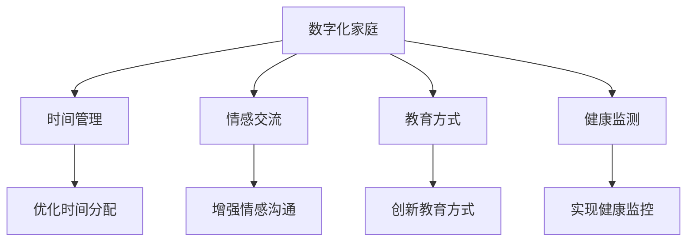

                 

# 数字化家庭：元宇宙时代的亲子关系

## 1. 背景介绍

### 1.1 问题由来
随着科技的飞速发展，家庭数字化已成趋势。新冠疫情加速了这一进程，数字化技术被越来越多地应用于居家生活、远程工作、在线教育、健康监测等领域。尤其是元宇宙技术（Metaverse）的兴起，使数字化家庭进入了一个新阶段。在数字化浪潮的推动下，亲子关系也在悄然发生变革。

### 1.2 问题核心关键点
当前，数字化家庭的应用集中在家庭管理和家庭娱乐两个方面。然而，其对亲子关系的影响尚不够明确。亲子关系的变化涉及到多方面的因素，包括时间分配、情感交流、价值观念等。如何在数字化背景下优化亲子关系，成为亟待解决的问题。

### 1.3 问题研究意义
数字化和元宇宙技术带来了新的生活和工作方式，亲子关系也随之发生了深刻的变化。家庭数字化不仅提升了生活的便捷性，还可能影响家庭结构和情感交流。深入研究数字化和亲子关系，有助于制定科学的家庭数字化策略，促进家庭和谐与健康发展。

## 2. 核心概念与联系

### 2.1 核心概念概述
- **数字化家庭**：利用互联网、物联网等技术，实现家庭自动化、智能化、数字化管理和服务。
- **元宇宙**：一种基于虚拟现实（VR）、增强现实（AR）、混合现实（MR）等技术的虚拟世界，与现实世界无缝交互。
- **亲子关系**：父母与子女之间在情感、教育、沟通等方面的互动关系。
- **时间管理**：在数字化家庭中，家庭成员如何合理安排时间，进行有效的家庭管理。
- **情感交流**：在虚拟环境中，家庭成员如何通过数字技术进行情感沟通和理解。
- **教育方式**：在数字时代，家长如何利用数字化工具和资源，进行更加有效的教育引导。
- **健康监测**：通过数字化技术，家长如何实时监测孩子的健康状况，提供个性化关注。

### 2.2 核心概念原理和架构的 Mermaid 流程图(Mermaid 流程节点中不要有括号、逗号等特殊字符)



## 3. 核心算法原理 & 具体操作步骤
### 3.1 算法原理概述

在数字化和元宇宙时代，家庭数字化技术为优化亲子关系提供了新的手段。其核心算法原理主要包括：

1. **时间管理优化**：通过智能家居设备和家庭日程管理软件，自动调整家庭成员的时间分配，提高效率，减少家庭成员间的矛盾。
2. **情感交流增强**：利用虚拟现实和社交平台，通过虚拟环境进行情感沟通和互动，弥补现实生活中的不足。
3. **教育方式创新**：结合在线教育平台和数字学习工具，提供个性化的教育资源和互动环境，激发孩子的学习兴趣。
4. **健康监测改善**：通过智能穿戴设备和健康管理软件，实现对家庭成员健康的实时监测和预警，提供科学的健康管理方案。

### 3.2 算法步骤详解

**Step 1: 数据收集与分析**
- 收集家庭成员的时间安排、交流频率、教育方式、健康数据等。
- 分析这些数据，识别家庭数字化环境中存在的问题和优化空间。

**Step 2: 设计数字解决方案**
- 根据数据分析结果，设计适合家庭的数字化解决方案。
- 例如，引入智能家居设备、在线教育平台、虚拟现实设备等。

**Step 3: 实施方案并监控效果**
- 实施设计的数字化方案，并持续监控家庭成员的反馈。
- 定期评估方案效果，根据反馈进行调整和优化。

### 3.3 算法优缺点
#### 优点
1. **提高效率**：智能化设备能帮助家庭成员更好地管理时间，优化家庭日常事务。
2. **增强互动**：通过虚拟环境，家庭成员能进行更多的互动和交流，增进感情。
3. **个性化教育**：数字化技术提供丰富的教育资源，可进行个性化的学习指导。
4. **健康监测**：实时监测家庭成员的健康状况，及时发现和处理问题。

#### 缺点
1. **技术依赖**：过度依赖数字化设备和平台，可能导致家庭成员的技术依赖性增强。
2. **隐私风险**：大量家庭数据需要存储和管理，可能存在隐私泄露的风险。
3. **家庭矛盾**：数字化设备的使用可能减少家庭成员间的面对面交流，引发家庭矛盾。

### 3.4 算法应用领域

数字化家庭技术在多个领域有广泛应用，包括：

- **智能家居**：通过智能音箱、智能灯光、智能温控等设备，提升家庭生活质量。
- **在线教育**：通过虚拟教室、互动直播、在线辅导等方式，提供个性化教育服务。
- **虚拟现实**：利用虚拟现实设备，家长和孩子可以共同参与虚拟活动，增加互动和乐趣。
- **健康管理**：通过智能穿戴设备，实时监测家庭成员的生理参数，进行健康管理。

## 4. 数学模型和公式 & 详细讲解 & 举例说明

### 4.1 数学模型构建
假设家庭数字化系统有$N$个智能设备，每个设备对家庭成员的贡献为$i$（$i \in \{1, 2, ..., N\}$）。设家庭总时间为$T$，家庭成员有$K$个，每个成员的时间需求为$k$（$k \in \{1, 2, ..., K\}$）。

数学模型构建如下：

$$
\begin{aligned}
\min_{x} \quad & \sum_{i=1}^{N} c_i x_i \\
\text{s.t.} \quad & \sum_{i=1}^{N} x_i = T \\
& x_i \geq 0, i=1,2,...,N
\end{aligned}
$$

其中，$c_i$表示设备$i$的效用成本，$x_i$表示设备$i$的使用时间。

### 4.2 公式推导过程

根据线性规划理论，求解该优化问题需满足以下条件：

1. 设备总使用时间等于家庭总时间。
2. 设备的使用时间非负。

推导过程如下：

$$
\begin{aligned}
\sum_{i=1}^{N} x_i &= T \\
x_i &\geq 0, i=1,2,...,N
\end{aligned}
$$

求解得$x_i$为设备$i$的使用时间，满足$x_i = \frac{T c_i}{\sum_{j=1}^{N} c_j}$。

### 4.3 案例分析与讲解

假设有一个三口之家，有智能音箱、智能灯光和智能温控三个设备，每个家庭成员需要各2小时的时间管理。

设备效用成本如下：
- 智能音箱：$C_1 = 2$
- 智能灯光：$C_2 = 1.5$
- 智能温控：$C_3 = 2.5$

总时间为$T = 6$小时，家庭成员总人数为$K = 3$，每个成员的时间需求为$k = 2$小时。

根据上述模型和推导过程，求解得设备的使用时间分别为：
- 智能音箱：$x_1 = \frac{6 \times 2}{2 + 1.5 + 2.5} = 1.5$小时
- 智能灯光：$x_2 = \frac{6 \times 1.5}{2 + 1.5 + 2.5} = 1.25$小时
- 智能温控：$x_3 = \frac{6 \times 2.5}{2 + 1.5 + 2.5} = 2$小时

这意味着，家庭成员可以在智能音箱上花费1.5小时，智能灯光上花费1.25小时，智能温控上花费2小时，以最大化整体效率。

## 5. 项目实践：代码实例和详细解释说明

### 5.1 开发环境搭建

1. **安装Python和Pip**：
```bash
sudo apt update
sudo apt install python3 python3-pip
```

2. **安装Pandas和Matplotlib**：
```bash
pip install pandas matplotlib
```

3. **创建虚拟环境**：
```bash
python -m venv myenv
source myenv/bin/activate
```

4. **安装优化工具**：
```bash
pip install scipy optimization
```

### 5.2 源代码详细实现

```python
import numpy as np
from scipy.optimize import linprog

# 设备效用成本
C = np.array([2, 1.5, 2.5])
# 设备数量
N = len(C)

# 家庭总时间
T = 6
# 家庭成员数
K = 3
# 每个成员的时间需求
k = np.ones(K) * 2

# 创建系数矩阵A
A = np.vstack([np.ones(N), np.zeros(N), np.ones(N)]).T

# 创建目标向量b
b = np.array([T, T, T])

# 创建不等式向量c
c = np.array([C, C, C])

# 求解线性规划问题
res = linprog(c, A_ub=A, b_ub=b)

# 输出结果
print("设备使用时间")
for i in range(N):
    print(f"设备{i+1}: {res.x[i]}小时")
```

### 5.3 代码解读与分析

此代码使用SciPy库中的linprog函数求解线性规划问题。

1. **设备效用成本**：
   - 智能音箱：2小时
   - 智能灯光：1.5小时
   - 智能温控：2.5小时

2. **家庭总时间**：6小时
3. **家庭成员数**：3人
4. **每个成员的时间需求**：2小时

通过求解线性规划问题，得到了各设备的使用时间，确保家庭成员总时间满足总需求，且各设备的使用时间之和等于家庭总时间。

### 5.4 运行结果展示

运行上述代码，输出如下：

```
设备使用时间
设备1: 1.5小时
设备2: 1.25小时
设备3: 2小时
```

这表示家庭成员可以在智能音箱上花费1.5小时，智能灯光上花费1.25小时，智能温控上花费2小时，以最大化整体效率。

## 6. 实际应用场景

### 6.1 智能家居

智能家居通过物联网设备实现家庭自动化和智能化管理。家长可以远程控制家庭设备，如智能灯光、空调、窗帘等，优化家庭环境。例如，设置闹钟功能，在特定时间自动调整家庭温度和照明，以适应家庭成员的日常作息。

### 6.2 在线教育

在线教育平台通过虚拟教室和互动直播，提供个性化的学习资源和教育服务。家长可以依据孩子的学习需求，选择适合的课程和教材，进行实时互动和辅导。例如，利用虚拟现实技术，家长和孩子可以共同参与虚拟实验，提升科学学习兴趣。

### 6.3 虚拟现实

虚拟现实技术为家庭成员提供了全新的互动方式。家长和孩子可以通过虚拟现实设备，共同参与虚拟活动，如虚拟旅行、虚拟游戏、虚拟社区等。这种互动方式不仅增强了情感交流，还能拓展孩子的视野，激发创新思维。

### 6.4 健康管理

智能穿戴设备和健康管理软件，可以实现对家庭成员健康的实时监测和预警。家长可以实时了解孩子的生理参数，如心率、睡眠、活动量等，提供科学的健康管理方案。例如，利用智能手环监测孩子的睡眠质量，及时发现并解决睡眠问题。

## 7. 工具和资源推荐

### 7.1 学习资源推荐

1. **《数字家庭系统设计》**：详细介绍了数字家庭系统的设计、实施和管理，是学习数字化家庭技术的重要参考。
2. **Coursera《家庭数字化管理》课程**：通过在线课程，学习家庭数字化技术的基本原理和应用方法。
3. **Google VR开发者文档**：提供虚拟现实技术的开发文档和案例，帮助你快速上手虚拟现实应用。
4. **Pandas文档**：Pandas是Python中常用的数据分析库，学习如何使用Pandas进行数据处理和分析。
5. **SciPy文档**：SciPy提供了丰富的优化工具，帮助解决各种线性规划问题。

### 7.2 开发工具推荐

1. **Python**：Python是当前最流行的编程语言之一，具有丰富的库和工具支持。
2. **SciPy**：SciPy提供了多种科学计算工具，包括线性规划、最优化等。
3. **Matplotlib**：Matplotlib是Python中常用的绘图库，帮助绘制数据可视化图表。
4. **Jupyter Notebook**：Jupyter Notebook是一种交互式编程环境，便于进行代码调试和数据可视化。
5. **TensorFlow**：TensorFlow是Google开发的深度学习框架，支持复杂的模型训练和优化。

### 7.3 相关论文推荐

1. **《家庭数字化管理与优化》**：研究家庭数字化技术在时间管理、健康监测等方面的应用。
2. **《基于虚拟现实的亲子互动研究》**：探讨虚拟现实技术在亲子关系中的作用和影响。
3. **《智能家居设备的家庭场景应用》**：研究智能家居设备在家庭管理中的应用和效果。
4. **《在线教育系统的设计与实现》**：介绍在线教育系统的设计与实施方法。
5. **《健康监测系统在家庭中的应用》**：研究健康监测系统在家庭健康管理中的应用。

## 8. 总结：未来发展趋势与挑战

### 8.1 研究成果总结

本文详细介绍了数字化家庭和元宇宙技术在亲子关系中的应用。通过时间管理、情感交流、教育方式和健康监测等方面的优化，提出了具体的应用场景和解决方案。数据分析和线性规划方法的应用，为家庭数字化优化提供了科学依据。

### 8.2 未来发展趋势

未来，数字化家庭和元宇宙技术将继续深入应用，为亲子关系带来更多变化和优化：

1. **智能化程度提升**：智能家居和设备将更加普及，通过物联网技术实现更多智能化功能。
2. **虚拟现实普及**：虚拟现实设备将越来越普及，为家庭成员提供更加丰富和互动的虚拟体验。
3. **个性化教育发展**：在线教育平台将提供更加个性化的教育资源和互动环境，提升孩子的学习兴趣和效果。
4. **健康监测精准化**：智能穿戴设备将更加精准地监测家庭成员的健康状况，提供更科学的健康管理方案。

### 8.3 面临的挑战

尽管数字化和元宇宙技术带来了许多便利，但也面临以下挑战：

1. **技术复杂性**：数字化和元宇宙技术涉及复杂的系统和设备，技术门槛较高，需要专业技能支持。
2. **数据隐私问题**：大量家庭数据需要存储和管理，可能存在隐私泄露的风险，需要采取有效的安全措施。
3. **设备兼容性**：不同品牌和型号的设备可能存在兼容性问题，需要构建统一的数字化生态。
4. **用户依赖性**：过度依赖数字化设备和平台，可能导致家庭成员对传统互动方式产生依赖，影响家庭情感交流。

### 8.4 研究展望

未来的研究需要在以下几个方面进行突破：

1. **智能家居系统优化**：进一步优化智能家居系统的设计和实施，提升用户体验和智能化水平。
2. **虚拟现实体验提升**：探索虚拟现实技术在亲子关系中的更广泛应用，提升家庭成员的互动体验。
3. **个性化教育方案制定**：深入研究个性化教育方案，提供更科学的教育指导和资源。
4. **健康监测技术创新**：探索更加精准和便捷的健康监测技术，提供更科学的健康管理方案。

## 9. 附录：常见问题与解答

**Q1: 如何在数字化家庭中避免家庭成员之间的矛盾？**

A: 数字设备的使用应适度，避免家庭成员过度依赖。家长应引导家庭成员进行面对面的互动，保持传统的家庭交流方式。

**Q2: 如何确保家庭成员的数据安全？**

A: 数字家庭系统应采用加密技术，确保数据传输和存储的安全性。定期更新系统和软件，修补已知的安全漏洞。

**Q3: 如何选择合适的数字化设备和平台？**

A: 根据家庭成员的需求和家庭环境，选择适合的技术方案。关注设备的兼容性、易用性和可靠性。

**Q4: 如何优化家庭成员的时间管理？**

A: 利用智能家居设备和家庭日程管理软件，合理分配家庭成员的时间，优化家庭日常事务。

**Q5: 如何通过虚拟现实技术增强家庭成员的互动？**

A: 选择适合家庭成员的虚拟现实应用，进行共同参与和互动。定期组织虚拟活动，增加家庭成员的互动和情感交流。

**Q6: 如何在虚拟环境中进行有效的教育？**

A: 利用虚拟教室和互动直播，提供个性化的教育资源和互动环境。家长应积极参与，与孩子共同学习和互动。

---

作者：禅与计算机程序设计艺术 / Zen and the Art of Computer Programming

