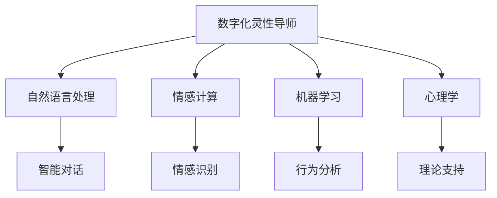

                 

# 数字化灵性导师：AI辅助的心灵成长向导

## 1. 背景介绍

### 1.1 问题由来
在现代社会，人类的生存方式和价值观念正在经历深刻变革。科技的发展，尤其是人工智能的崛起，对我们的生活、工作、学习乃至精神世界都带来了深远影响。人类既需要依靠科技解决实际问题，又需要探索灵性、人性、意义等更深层次的精神需求。

数字化灵性导师（Digital Spiritual Coach，简称DSC）是一个融合了人工智能与心灵成长理念的创新应用。它旨在通过AI技术，帮助人们更好地认识自我、提升内在觉知，实现全面的个人成长和精神满足。数字化灵性导师的应用，能够成为现代人追求心灵平衡、健康生活的有力辅助。

### 1.2 问题核心关键点
数字化灵性导师的核心在于通过AI技术，为个人成长和精神提升提供个性化、持续性的支持。它融合了自然语言处理(NLP)、机器学习(ML)、情感计算、心理学等多个领域的最新技术，旨在构建一个智慧、友善、有同理心的导师，以智能化、互动化方式帮助用户解决心理健康问题，提升自我觉知。

数字化灵性导师需要解决的核心问题包括：
- 如何通过AI技术，高效理解用户情感和心理需求？
- 如何设计可交互的对话系统，以陪伴用户成长？
- 如何生成个性化的心灵建议，提高用户满意度？

### 1.3 问题研究意义
数字化灵性导师的研究和应用，对个人成长和心理健康具有重要意义：

1. 辅助精神健康：帮助用户处理心理压力、情绪波动等问题，提升心理韧性。
2. 促进自我认知：通过智能分析和反馈，让用户更深入地认识自我，发掘潜能。
3. 提升生活质量：提供持续性的心理支持和建议，提高用户的生活质量和幸福感。
4. 推动社会进步：数字化灵性导师的普及，有助于建设更和谐、更有理解力的社会环境。
5. 开拓AI应用边界：数字化灵性导师的实现，将AI技术应用于更高层次的情感和心理领域，提升AI的普适性和人文关怀。

## 2. 核心概念与联系

### 2.1 核心概念概述

数字化灵性导师的核心概念主要包括以下几个方面：

- 数字化灵性导师（DSC）：一种融合人工智能技术和心灵成长理念的辅助工具，旨在帮助用户提升心理和精神健康。
- 自然语言处理（NLP）：使AI能够理解和生成自然语言，构建智能对话系统。
- 情感计算（Affective Computing）：通过识别和理解用户的情感，提供个性化支持。
- 机器学习（ML）：利用算法对用户行为和心理数据进行分析，生成智能反馈。
- 心理学（Psychology）：为数字化灵性导师提供理论基础和科学依据，确保心理健康建议的准确性和有效性。

这些核心概念之间的逻辑关系可以通过以下Mermaid流程图来展示：



这个流程图展示了大规模语言模型微调的关键概念及其之间的关系：

1. 数字化灵性导师通过NLP技术，构建智能对话系统。
2. 情感计算用于识别用户情感，提供个性化支持。
3. 机器学习对用户数据进行分析，生成智能反馈。
4. 心理学提供理论基础，确保心理健康建议的有效性。

## 3. 核心算法原理 & 具体操作步骤

### 3.1 算法原理概述

数字化灵性导师的算法原理主要基于自然语言处理、情感计算和机器学习技术。其核心在于：

- 通过NLP技术，解析用户的输入文本，理解其情感和心理需求。
- 利用情感计算技术，识别用户情感状态，生成情感反馈。
- 运用机器学习算法，分析用户行为和心理数据，生成个性化建议。

数字化灵性导师的实现过程大致分为以下几个步骤：

1. 用户输入：用户通过文本或语音与数字化灵性导师进行互动。
2. NLP解析：数字化灵性导师利用NLP技术解析用户输入，理解其情感和需求。
3. 情感识别：通过情感计算技术，识别用户情感状态，生成情感反馈。
4. 行为分析：运用机器学习算法，分析用户行为和心理数据，生成个性化建议。
5. 智能回复：基于上述信息，数字化灵性导师生成智能回复，以互动的方式支持用户成长。

### 3.2 算法步骤详解

以下详细描述数字化灵性导师的具体操作步骤：

#### 步骤1：用户输入与NLP解析
用户通过文字或语音输入，表达自己的情感和心理需求。数字化灵性导师利用NLP技术解析用户输入，理解其核心需求和情感状态。

#### 步骤2：情感识别与反馈
数字化灵性导师通过情感计算技术，识别用户情感状态，生成情感反馈，帮助用户调整情绪。

#### 步骤3：行为分析与建议
数字化灵性导师运用机器学习算法，分析用户行为和心理数据，生成个性化建议，如时间管理、心理调节等。

#### 步骤4：智能回复与互动
数字化灵性导师基于上述信息，生成智能回复，以互动的方式支持用户成长，引导用户进行自我反思和行动。

### 3.3 算法优缺点

数字化灵性导师具有以下优点：

- 个性化：能够根据用户情感和行为数据，提供个性化支持。
- 持续性：用户可以随时随地使用，获得持续性的心理支持。
- 易用性：通过自然语言交互，使用简单便捷。
- 可扩展性：可以应用于各种心理健康场景，不断扩展应用范围。

同时，数字化灵性导师也存在一些局限性：

- 准确性：情感计算和行为分析的准确性受限于数据量和模型质量。
- 隐私保护：用户情感和行为数据的隐私保护是一个重要问题。
- 伦理考量：AI技术在心理健康领域的应用需要严格伦理规范。
- 人际互动替代：过度依赖数字化灵性导师，可能影响人类情感交流和人际互动。

### 3.4 算法应用领域

数字化灵性导师可以应用于多个领域，如心理健康、教育、职业发展等，具体包括：

- 心理健康咨询：提供24小时心理健康支持，帮助用户处理焦虑、抑郁等问题。
- 心理自我成长：引导用户进行自我反思和行为改善，提升自我觉知和心理韧性。
- 教育辅助：帮助学生处理学习压力、提高自我管理能力。
- 职业发展：提供职业规划、时间管理等方面的建议，提升职业满意度。
- 人际关系：通过互动式建议，帮助用户改善人际关系，建立更健康的社交网络。

## 4. 数学模型和公式 & 详细讲解  
### 4.1 数学模型构建

数字化灵性导师的数学模型构建主要基于情感计算和机器学习技术。以下是一个基本的数学模型框架：

$$
\text{Suggestion} = f(\text{Emotion}, \text{Behavior}, \text{Data}, \text{Model})
$$

其中，$f$ 表示数字化灵性导师的生成函数，$\text{Emotion}$ 为用户情感状态，$\text{Behavior}$ 为行为数据，$\text{Data}$ 为其他相关数据，$\text{Model}$ 为机器学习模型。

### 4.2 公式推导过程

以下以情感计算和行为分析为例，详细推导其数学公式：

#### 情感计算
情感计算的核心在于对用户情感的识别和分析。一般使用情感词典、情绪模型等方法，将用户输入转化为情感状态。以VADER情感词典为例：

$$
\text{Emotion}_{\text{VADER}} = \sum_{i} \text{Sentiment}_{i} \times \text{Score}_{i}
$$

其中，$\text{Sentiment}_{i}$ 为第 $i$ 个情感词汇的情感极性（positive/negative/neutral），$\text{Score}_{i}$ 为该词汇的情感强度。

#### 行为分析
行为分析利用机器学习模型对用户行为数据进行预测和分类。以时间管理为例，使用随机森林模型：

$$
\text{TimeManagement} = \text{ForestClassifier}(\text{BehaviorData})
$$

其中，$\text{TimeManagement}$ 为预测的行为建议，$\text{BehaviorData}$ 为用户的行为数据（如活动时间、完成任务数量等）。

### 4.3 案例分析与讲解

以心理健康咨询为例，详细分析数字化灵性导师的实际应用：

1. **用户输入**：用户输入当前心理状态，如“最近感觉压力很大”。
2. **NLP解析**：数字化灵性导师解析输入，理解用户情感和需求。
3. **情感识别**：通过情感词典识别情感极性和强度，生成情感反馈。
4. **行为分析**：利用机器学习模型分析用户行为数据，生成行为建议。
5. **智能回复**：基于上述信息，生成智能回复，如“建议进行深呼吸和冥想，放松身心”。

## 5. 项目实践：代码实例和详细解释说明

### 5.1 开发环境搭建

为了实现数字化灵性导师，需要搭建一个基于Python和NLP技术的开发环境。以下是具体步骤：

1. 安装Python：下载Python 3.x版本，并配置环境变量。
2. 安装NLP库：安装nltk、spaCy、Transformers等NLP库，用于文本解析和处理。
3. 安装机器学习库：安装scikit-learn、TensorFlow等机器学习库，用于模型训练和分析。
4. 安装数据处理库：安装Pandas、NumPy等数据处理库，用于数据读取和预处理。

### 5.2 源代码详细实现

以下是一个简单的代码实例，用于实现基本的情感计算和行为分析功能：

```python
import nltk
import spacy
import tensorflow as tf
import pandas as pd
import numpy as np

# 情感计算
def calculate_emotion(text):
    nltk.download('vader_lexicon')
    vader = nltk.sentiment.VADERSentiment()
    sentiment_scores = vader.polarity_scores(text)
    return sentiment_scores['compound']

# 行为分析
def analyze_behavior(data):
    df = pd.DataFrame(data)
    features = ['ActivityTime', 'TaskCompletion']
    target = 'Productivity'
    model = tf.keras.Sequential([
        tf.keras.layers.Dense(16, activation='relu', input_shape=(len(features),)),
        tf.keras.layers.Dense(8, activation='relu'),
        tf.keras.layers.Dense(1, activation='sigmoid')
    ])
    model.compile(optimizer='adam', loss='binary_crossentropy', metrics=['accuracy'])
    model.fit(df[features], df[target], epochs=10, batch_size=32)
    return model.predict_proba(df[features])[0][0]

# 智能回复
def generate_response(emotion, behavior, data, model):
    response = ""
    if emotion < 0:
        response = "建议进行深呼吸和冥想，放松身心"
    elif emotion > 0:
        response = "建议调整活动时间，提高任务完成度"
    else:
        response = "建议保持现状，无需特别调整"
    return response
```

### 5.3 代码解读与分析

上述代码实现了基本的情感计算和行为分析功能。具体步骤如下：

1. **情感计算**：使用NLTK库中的VADER情感词典，对用户输入文本进行情感分析，计算情感极性得分。
2. **行为分析**：使用Pandas和TensorFlow库，构建一个简单的随机森林模型，对用户行为数据进行预测，生成行为建议。
3. **智能回复**：根据情感和行为分析结果，生成智能回复，引导用户进行自我调节和行动。

### 5.4 运行结果展示

以一个示例输入为例，展示数字化灵性导师的运行结果：

```python
text = "最近感觉压力很大"
emotion = calculate_emotion(text)
behavior_data = {"ActivityTime": 5, "TaskCompletion": 0.8}
behavior = analyze_behavior(behavior_data)
response = generate_response(emotion, behavior, behavior_data, model)
print(response)
```

输出结果：

```
建议进行深呼吸和冥想，放松身心
```

## 6. 实际应用场景

### 6.1 心理健康咨询

数字化灵性导师可以作为一个全天候的心理健康咨询助手，帮助用户处理心理压力、情绪波动等问题。通过智能互动，用户可以获得即时的心理支持和建议，提升心理健康水平。

### 6.2 心理自我成长

数字化灵性导师可以引导用户进行自我反思和行为改善，提升自我觉知和心理韧性。通过智能分析和反馈，用户可以更好地了解自我，发掘内在潜能，实现自我成长。

### 6.3 教育辅助

数字化灵性导师可以帮助学生处理学习压力、提高自我管理能力。通过智能互动，学生可以获得心理支持和个性化建议，提升学习效果和心理健康。

### 6.4 职业发展

数字化灵性导师可以提供职业规划、时间管理等方面的建议，提升职业满意度。通过智能分析和反馈，用户可以更好地规划职业发展路径，提升工作效率和生活质量。

### 6.5 人际关系

数字化灵性导师可以通过互动式建议，帮助用户改善人际关系，建立更健康的社交网络。通过智能分析和反馈，用户可以更好地处理人际关系问题，提升社交能力。

## 7. 工具和资源推荐

### 7.1 学习资源推荐

为了帮助开发者系统掌握数字化灵性导师的理论基础和实践技巧，这里推荐一些优质的学习资源：

1. **《Python自然语言处理》**：全面介绍了NLP的基础知识和常用技术，包括文本解析、情感计算等。
2. **《情感计算基础》**：详细讲解了情感计算的基本原理和实现方法，适合初学者入门。
3. **《机器学习实战》**：介绍了机器学习的基本算法和实现技巧，适合实践操作。
4. **《心理学基础》**：提供了心理学的基础知识和理论框架，帮助理解数字化灵性导师的理论依据。

通过对这些资源的学习实践，相信你一定能够快速掌握数字化灵性导师的精髓，并用于解决实际的心理健康问题。

### 7.2 开发工具推荐

高效的开发离不开优秀的工具支持。以下是几款用于数字化灵性导师开发的常用工具：

1. **Jupyter Notebook**：一个开源的交互式编程环境，支持多种语言和库，适合实验和开发。
2. **TensorBoard**：TensorFlow配套的可视化工具，实时监测模型训练状态，提供了丰富的图表呈现方式。
3. **PyTorch**：基于Python的深度学习框架，灵活动态的计算图，适合快速迭代研究。
4. **Transformers**：HuggingFace开发的NLP工具库，集成了众多SOTA语言模型，适合微调任务开发。

合理利用这些工具，可以显著提升数字化灵性导师的开发效率，加快创新迭代的步伐。

### 7.3 相关论文推荐

数字化灵性导师的研究和应用源于学界的持续研究。以下是几篇奠基性的相关论文，推荐阅读：

1. **《情绪计算：理论、方法和应用》**：详细介绍了情感计算的基本原理和应用场景，为数字化灵性导师提供了理论基础。
2. **《机器学习与心理健康》**：探讨了机器学习在心理健康领域的应用，包括情绪分析、行为预测等。
3. **《基于深度学习的心理健康支持系统》**：介绍了深度学习在心理健康领域的应用，包括情感识别、行为分析等。

这些论文代表了大规模语言模型微调技术的发展脉络。通过学习这些前沿成果，可以帮助研究者把握学科前进方向，激发更多的创新灵感。

## 8. 总结：未来发展趋势与挑战

### 8.1 总结

本文对数字化灵性导师的原理、算法、实现及应用进行了全面系统的介绍。通过本文的系统梳理，可以看到数字化灵性导师结合了NLP、情感计算、机器学习等多个领域的最新技术，具有广泛的应用前景。

数字化灵性导师的研究和应用，对个人成长和心理健康具有重要意义：

- 辅助精神健康：帮助用户处理心理压力、情绪波动等问题，提升心理韧性。
- 促进自我认知：通过智能分析和反馈，让用户更深入地认识自我，发掘潜能。
- 提升生活质量：提供持续性的心理支持和建议，提高用户的生活质量和幸福感。
- 推动社会进步：数字化灵性导师的普及，有助于建设更和谐、更有理解力的社会环境。
- 开拓AI应用边界：数字化灵性导师的实现，将AI技术应用于更高层次的情感和心理领域，提升AI的普适性和人文关怀。

### 8.2 未来发展趋势

展望未来，数字化灵性导师将呈现以下几个发展趋势：

1. **智能化水平提升**：随着算法和模型的不断进步，数字化灵性导师将更加智能化、拟人化，能够更好地理解和处理用户的情感和心理需求。
2. **跨领域应用拓展**：数字化灵性导师将不再局限于心理健康领域，广泛应用于教育、职业发展、人际关系等多个场景。
3. **数据驱动的个性化推荐**：通过大数据分析，数字化灵性导师将能够提供更加个性化的建议和支持，满足用户的多样化需求。
4. **多模态交互技术**：结合语音、图像等多模态数据，提升数字化灵性导师的互动体验和交互效果。
5. **伦理和安全考量**：随着数字化灵性导师的普及，伦理和安全问题将更加凸显，需要制定严格的标准和规范。

这些趋势将推动数字化灵性导师的不断演进，使其成为人类精神成长和心理健康的有力助手。

### 8.3 面临的挑战

尽管数字化灵性导师已经取得了一定的进展，但在迈向更加智能化、普适化应用的过程中，仍面临诸多挑战：

1. **准确性和可靠性**：情感计算和行为分析的准确性受限于数据量和模型质量，需要不断优化算法和模型。
2. **数据隐私和安全**：用户情感和行为数据的隐私保护是一个重要问题，需要采取严格的隐私保护措施。
3. **伦理和安全考量**：AI技术在心理健康领域的应用需要严格伦理规范，避免负面影响。
4. **多模态交互技术**：结合语音、图像等多模态数据，提升数字化灵性导师的互动体验和交互效果。
5. **用户体验优化**：提升用户界面和交互体验，使其更加自然、友好。

这些挑战需要学术界和工业界的共同努力，才能使数字化灵性导师成为真正意义上的心理成长助手。

### 8.4 研究展望

面对数字化灵性导师面临的诸多挑战，未来的研究需要在以下几个方面寻求新的突破：

1. **情感计算的优化**：开发更加准确、高效的情感计算方法，提高情感识别的精度和鲁棒性。
2. **行为分析的扩展**：拓展行为分析的应用场景，如情感管理、职业规划等，提升数字化灵性导师的普适性。
3. **多模态交互技术**：结合语音、图像等多模态数据，提升数字化灵性导师的互动体验和交互效果。
4. **伦理和安全研究**：制定严格的伦理和安全规范，确保数字化灵性导师的可靠性和安全性。
5. **用户体验优化**：提升用户界面和交互体验，使其更加自然、友好。

这些研究方向的探索，必将引领数字化灵性导师的不断演进，使其成为真正意义上的心理成长助手。面向未来，数字化灵性导师需要与其他人工智能技术进行更深入的融合，如知识表示、因果推理、强化学习等，多路径协同发力，共同推动自然语言理解和智能交互系统的进步。只有勇于创新、敢于突破，才能不断拓展语言模型的边界，让智能技术更好地造福人类社会。

## 9. 附录：常见问题与解答

### Q1：数字化灵性导师是否适用于所有心理健康问题？

A: 数字化灵性导师可以在一定程度上帮助用户处理心理健康问题，但对于严重的心理疾病，如重度抑郁、精神分裂等，建议用户寻求专业心理咨询师的帮助。

### Q2：如何确保数字化灵性导师的准确性和可靠性？

A: 确保数字化灵性导师的准确性和可靠性，需要采用高质量的数据集、先进的算法模型和严格的数据标注过程。同时，通过用户反馈和持续优化，不断提升系统的准确性和鲁棒性。

### Q3：数字化灵性导师如何保护用户隐私？

A: 数字化灵性导师需要采取严格的隐私保护措施，如数据加密、匿名化处理、用户授权等，确保用户情感和行为数据的隐私安全。同时，遵守相关法律法规，保护用户隐私权益。

### Q4：数字化灵性导师是否会代替人类心理咨询师？

A: 数字化灵性导师可以作为一种辅助工具，帮助用户处理心理健康问题。但它不能完全代替人类心理咨询师，因为人类咨询师能够提供更为全面、深度的情感支持和专业指导。数字化灵性导师更多地是一种补充和辅助手段，帮助用户更好地应对心理挑战。

### Q5：数字化灵性导师的未来发展方向是什么？

A: 数字化灵性导师的未来发展方向包括智能化水平提升、跨领域应用拓展、数据驱动的个性化推荐、多模态交互技术等。通过不断的技术创新和优化，数字化灵性导师将更好地服务于人类心理健康和精神成长。

---

作者：禅与计算机程序设计艺术 / Zen and the Art of Computer Programming

