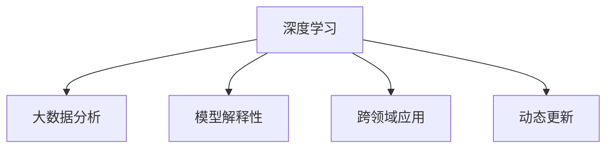

                 

## 1. 背景介绍

### 1.1 问题由来
随着人工智能技术的飞速发展，尤其是深度学习和大数据技术的成熟应用，AI在各行各业中的应用变得越来越广泛。然而，AI的能力依然存在局限性，尤其是在复杂的环境下，需要依靠人类丰富的经验和直觉去辅助决策。因此，如何在AI中培养一种类似于人类的“第六感”能力，成为当前研究的热点。

### 1.2 问题核心关键点
数字化直觉（Digital Intuition）是指在数字化环境中，通过AI技术辅助人类进行决策的能力。其核心关键点包括：

1. **数据驱动决策**：利用大数据分析，识别模式和趋势，辅助人类做出更科学的决策。
2. **模型解释性**：AI模型的决策过程应具备可解释性，便于人类理解和验证。
3. **跨领域应用**：数字化直觉能力应能够应用于不同领域，如医疗、金融、教育等。
4. **动态更新**：随着环境的变化，数字化直觉能力应能够动态更新，保持其准确性和实用性。

本文旨在探讨如何利用AI技术，特别是深度学习和大数据技术，培养和增强人类的数字化直觉能力，使其在复杂环境中做出更加准确的决策。

## 2. 核心概念与联系

### 2.1 核心概念概述

为更好地理解数字化直觉的培养方法，本节将介绍几个密切相关的核心概念：

- **深度学习（Deep Learning）**：一种通过多层神经网络进行数据表示学习和决策的机器学习方法，能够自动提取数据中的特征，并进行复杂模式识别。
- **大数据分析（Big Data Analytics）**：利用先进的数据处理和分析技术，从大规模数据中挖掘有用的信息和知识，辅助决策。
- **模型解释性（Model Interpretability）**：AI模型的决策过程应具备可解释性，便于人类理解和验证，避免“黑箱”问题。
- **跨领域应用（Cross-domain Application）**：AI技术应具备跨领域适用性，能够应用于医疗、金融、教育等多个行业。
- **动态更新（Dynamic Update）**：AI模型应具备动态更新能力，能够随着环境的变化，及时调整和更新模型参数，保持其准确性和实用性。

这些核心概念之间的逻辑关系可以通过以下Mermaid流程图来展示：



这个流程图展示了大数据在数字化直觉培养中的核心作用，以及模型解释性、跨领域应用和动态更新等概念的关联。

## 3. 核心算法原理 & 具体操作步骤
### 3.1 算法原理概述

数字化直觉的培养基于深度学习和大数据分析技术，主要分为以下几个步骤：

1. **数据收集**：从各种来源收集与任务相关的数据。
2. **数据预处理**：清洗和转换数据，准备输入到深度学习模型中。
3. **模型训练**：使用深度学习模型训练，生成数字化直觉模型。
4. **模型验证**：对模型进行验证，确保其泛化能力和鲁棒性。
5. **模型应用**：将模型应用于实际决策中，评估其效果。
6. **模型更新**：根据反馈，动态更新模型，保持其准确性和实用性。

### 3.2 算法步骤详解

以医疗领域的疾病诊断为例，详细讲解数字化直觉的培养过程：

#### 3.2.1 数据收集
从医院、诊所、研究机构等处收集患者的病历数据、检查结果、基因数据等。这些数据应涵盖不同类型和规模，以保证模型的泛化能力。

#### 3.2.2 数据预处理
对收集到的数据进行清洗和转换，如去除噪声、缺失值填充、数据归一化等。同时，进行特征工程，提取与疾病诊断相关的特征。

#### 3.2.3 模型训练
选择合适的深度学习模型，如卷积神经网络（CNN）、递归神经网络（RNN）或Transformer等，使用预处理后的数据进行模型训练。在训练过程中，使用正则化技术（如L2正则化、Dropout等）防止过拟合。

#### 3.2.4 模型验证
在验证集上评估模型的性能，如准确率、召回率、F1分数等。使用交叉验证等方法，确保模型的泛化能力和鲁棒性。

#### 3.2.5 模型应用
将训练好的模型应用于实际的疾病诊断中。例如，对患者的新病例进行预测，判断其是否患有某种疾病。

#### 3.2.6 模型更新
根据诊断结果和患者反馈，动态更新模型参数，以提高诊断的准确性和实用性。

### 3.3 算法优缺点

数字化直觉的培养方法具有以下优点：

1. **高效性**：利用深度学习和数据分析技术，可以快速处理大量数据，生成有用的模型。
2. **广泛适用性**：数字化直觉能力可以应用于医疗、金融、教育等多个领域，具有跨领域适用性。
3. **动态更新**：模型能够根据环境变化进行动态更新，保持其准确性和实用性。

同时，也存在一些缺点：

1. **数据依赖**：模型的效果高度依赖于数据的质量和数量，获取高质量数据成本较高。
2. **解释性不足**：深度学习模型具有“黑箱”特性，其决策过程难以解释。
3. **过拟合风险**：模型在训练时可能存在过拟合问题，影响泛化能力。
4. **资源消耗大**：深度学习模型的训练和推理消耗大量计算资源，需要高性能计算设备支持。

### 3.4 算法应用领域

数字化直觉的培养方法已经在医疗、金融、教育等多个领域得到应用：

- **医疗**：在疾病诊断、个性化治疗、医疗影像分析等方面，使用深度学习模型辅助医生进行决策。
- **金融**：在风险评估、投资策略、客户信用评分等方面，使用大数据分析和机器学习模型辅助金融决策。
- **教育**：在学生行为分析、个性化学习推荐、考试评分等方面，使用深度学习模型辅助教育决策。

## 4. 数学模型和公式 & 详细讲解  
### 4.1 数学模型构建

本节将使用数学语言对数字化直觉的培养过程进行更加严格的刻画。

记数据集为 $D = \{(x_i, y_i)\}_{i=1}^N$，其中 $x_i$ 为输入特征，$y_i$ 为输出标签。假设选择的深度学习模型为 $M_{\theta}$，其中 $\theta$ 为模型参数。

定义损失函数 $\ell(M_{\theta}(x_i), y_i)$，用于衡量模型预测输出与真实标签之间的差异。在训练过程中，目标是最小化损失函数：

$$
\min_{\theta} \frac{1}{N} \sum_{i=1}^N \ell(M_{\theta}(x_i), y_i)
$$

### 4.2 公式推导过程

以二分类任务为例，推导交叉熵损失函数及其梯度计算公式。

假设模型 $M_{\theta}$ 在输入 $x$ 上的输出为 $\hat{y}=M_{\theta}(x) \in [0,1]$，表示样本属于正类的概率。真实标签 $y \in \{0,1\}$。则二分类交叉熵损失函数定义为：

$$
\ell(M_{\theta}(x),y) = -[y\log \hat{y} + (1-y)\log (1-\hat{y})]
$$

将其代入损失函数公式，得：

$$
\min_{\theta} \frac{1}{N} \sum_{i=1}^N -[y_i\log M_{\theta}(x_i)+(1-y_i)\log(1-M_{\theta}(x_i))]
$$

根据链式法则，损失函数对参数 $\theta_k$ 的梯度为：

$$
\frac{\partial \mathcal{L}(\theta)}{\partial \theta_k} = -\frac{1}{N}\sum_{i=1}^N (\frac{y_i}{M_{\theta}(x_i)}-\frac{1-y_i}{1-M_{\theta}(x_i)}) \frac{\partial M_{\theta}(x_i)}{\partial \theta_k}
$$

其中 $\frac{\partial M_{\theta}(x_i)}{\partial \theta_k}$ 可进一步递归展开，利用自动微分技术完成计算。

### 4.3 案例分析与讲解

以医疗领域的疾病诊断为例，分析数字化直觉的培养过程：

1. **数据收集**：从医院收集患者的病历数据，包括症状描述、检查结果、基因数据等。
2. **数据预处理**：对病历数据进行清洗、去噪、缺失值填充、特征提取等预处理。
3. **模型训练**：使用卷积神经网络（CNN）或递归神经网络（RNN）等模型，训练生成疾病诊断模型。
4. **模型验证**：在验证集上评估模型性能，如准确率、召回率、F1分数等。
5. **模型应用**：将训练好的模型应用于新病例的诊断，判断其是否患有某种疾病。
6. **模型更新**：根据医生反馈和新病例的诊断结果，动态更新模型参数，提高诊断准确性。

## 5. 项目实践：代码实例和详细解释说明
### 5.1 开发环境搭建

在进行数字化直觉的培养实践前，我们需要准备好开发环境。以下是使用Python进行PyTorch开发的环境配置流程：

1. 安装Anaconda：从官网下载并安装Anaconda，用于创建独立的Python环境。

2. 创建并激活虚拟环境：
```bash
conda create -n pytorch-env python=3.8 
conda activate pytorch-env
```

3. 安装PyTorch：根据CUDA版本，从官网获取对应的安装命令。例如：
```bash
conda install pytorch torchvision torchaudio cudatoolkit=11.1 -c pytorch -c conda-forge
```

4. 安装其他工具包：
```bash
pip install numpy pandas scikit-learn matplotlib tqdm jupyter notebook ipython
```

完成上述步骤后，即可在`pytorch-env`环境中开始数字化直觉的培养实践。

### 5.2 源代码详细实现

下面我们以医疗领域的疾病诊断为例，给出使用PyTorch进行深度学习模型训练的PyTorch代码实现。

首先，定义数据处理函数：

```python
from torch.utils.data import Dataset
import torch

class DiseaseDataset(Dataset):
    def __init__(self, X, y, tokenizer):
        self.X = X
        self.y = y
        self.tokenizer = tokenizer
        
    def __len__(self):
        return len(self.X)
    
    def __getitem__(self, item):
        x = self.X[item]
        y = self.y[item]
        encoding = self.tokenizer(x, return_tensors='pt', padding='max_length')
        input_ids = encoding['input_ids'][0]
        attention_mask = encoding['attention_mask'][0]
        return {'input_ids': input_ids, 
                'attention_mask': attention_mask,
                'labels': torch.tensor(y, dtype=torch.long)}
```

然后，定义模型和优化器：

```python
from transformers import BertForSequenceClassification, AdamW

model = BertForSequenceClassification.from_pretrained('bert-base-cased', num_labels=10)

optimizer = AdamW(model.parameters(), lr=2e-5)
```

接着，定义训练和评估函数：

```python
from torch.utils.data import DataLoader
from tqdm import tqdm
from sklearn.metrics import classification_report

device = torch.device('cuda') if torch.cuda.is_available() else torch.device('cpu')
model.to(device)

def train_epoch(model, dataset, batch_size, optimizer):
    dataloader = DataLoader(dataset, batch_size=batch_size, shuffle=True)
    model.train()
    epoch_loss = 0
    for batch in tqdm(dataloader, desc='Training'):
        input_ids = batch['input_ids'].to(device)
        attention_mask = batch['attention_mask'].to(device)
        labels = batch['labels'].to(device)
        model.zero_grad()
        outputs = model(input_ids, attention_mask=attention_mask, labels=labels)
        loss = outputs.loss
        epoch_loss += loss.item()
        loss.backward()
        optimizer.step()
    return epoch_loss / len(dataloader)

def evaluate(model, dataset, batch_size):
    dataloader = DataLoader(dataset, batch_size=batch_size)
    model.eval()
    preds, labels = [], []
    with torch.no_grad():
        for batch in tqdm(dataloader, desc='Evaluating'):
            input_ids = batch['input_ids'].to(device)
            attention_mask = batch['attention_mask'].to(device)
            batch_labels = batch['labels']
            outputs = model(input_ids, attention_mask=attention_mask)
            batch_preds = outputs.logits.argmax(dim=2).to('cpu').tolist()
            batch_labels = batch_labels.to('cpu').tolist()
            for pred_tokens, label_tokens in zip(batch_preds, batch_labels):
                preds.append(pred_tokens[:len(label_tokens)])
                labels.append(label_tokens)
                
    print(classification_report(labels, preds))
```

最后，启动训练流程并在测试集上评估：

```python
epochs = 5
batch_size = 16

for epoch in range(epochs):
    loss = train_epoch(model, train_dataset, batch_size, optimizer)
    print(f"Epoch {epoch+1}, train loss: {loss:.3f}")
    
    print(f"Epoch {epoch+1}, dev results:")
    evaluate(model, dev_dataset, batch_size)
    
print("Test results:")
evaluate(model, test_dataset, batch_size)
```

以上就是使用PyTorch对疾病诊断模型进行训练的完整代码实现。可以看到，得益于Transformer库的强大封装，我们可以用相对简洁的代码完成模型的训练和评估。

### 5.3 代码解读与分析

让我们再详细解读一下关键代码的实现细节：

**DiseaseDataset类**：
- `__init__`方法：初始化数据集，包含输入数据X、标签y和分词器等关键组件。
- `__len__`方法：返回数据集的样本数量。
- `__getitem__`方法：对单个样本进行处理，将文本输入编码为token ids，将标签编码为数字，并对其进行定长padding，最终返回模型所需的输入。

**BertForSequenceClassification类**：
- 使用Bert模型作为序列分类器，进行疾病诊断任务的模型训练。

**训练和评估函数**：
- 使用PyTorch的DataLoader对数据集进行批次化加载，供模型训练和推理使用。
- 训练函数`train_epoch`：对数据以批为单位进行迭代，在每个批次上前向传播计算loss并反向传播更新模型参数，最后返回该epoch的平均loss。
- 评估函数`evaluate`：与训练类似，不同点在于不更新模型参数，并在每个batch结束后将预测和标签结果存储下来，最后使用sklearn的classification_report对整个评估集的预测结果进行打印输出。

**训练流程**：
- 定义总的epoch数和batch size，开始循环迭代
- 每个epoch内，先在训练集上训练，输出平均loss
- 在验证集上评估，输出分类指标
- 重复上述步骤直至收敛，得到最终的训练结果

## 6. 实际应用场景
### 6.1 智能医疗

数字化直觉在智能医疗中的应用，主要体现在辅助医生进行疾病诊断和治疗决策上。传统医疗诊断依赖于医生的经验和判断，而数字化直觉技术能够通过分析海量的医疗数据，辅助医生进行精准的疾病诊断，减少误诊率，提升医疗服务质量。

具体而言，数字化直觉技术可以用于：

1. **疾病诊断**：利用深度学习模型，对患者的症状描述、检查结果、基因数据等进行综合分析，辅助医生判断患者是否患有某种疾病。
2. **治疗方案推荐**：根据患者的病情和治疗效果，推荐最佳的治疗方案。
3. **医疗影像分析**：通过图像处理技术，分析医疗影像数据，辅助医生进行疾病诊断和治疗方案制定。

### 6.2 金融风险管理

在金融领域，数字化直觉技术可以应用于风险评估、投资策略、客户信用评分等方面。通过分析市场数据、交易记录、用户行为等数据，构建风险评估模型，辅助金融决策。

具体而言，数字化直觉技术可以用于：

1. **信用评分**：通过分析用户的信用记录、消费行为等数据，评估用户的信用风险，提供精准的信用评分。
2. **投资策略**：利用深度学习模型，分析市场数据，预测股票、商品等金融产品的价格趋势，辅助投资者制定投资策略。
3. **风险评估**：通过分析交易记录、市场数据等，构建风险评估模型，预测投资风险，避免投资损失。

### 6.3 教育个性化推荐

在教育领域，数字化直觉技术可以应用于学生行为分析、个性化学习推荐、考试评分等方面。通过分析学生的学习行为、成绩数据等，推荐个性化的学习资源，提升学生的学习效果。

具体而言，数字化直觉技术可以用于：

1. **学习行为分析**：通过分析学生的学习行为、课程成绩等数据，评估学生的学习状态和能力，提供个性化的学习建议。
2. **个性化推荐**：利用深度学习模型，分析学生的学习行为和兴趣，推荐个性化的学习资源和课程，提升学生的学习效果。
3. **考试评分**：通过分析学生的答题数据，评估学生的考试表现，提供精准的评分和反馈。

### 6.4 未来应用展望

随着数字化直觉技术的不断发展，未来其在各行各业的应用前景广阔：

1. **智能制造**：在制造业中，数字化直觉技术可以应用于生产计划制定、设备维护、质量控制等方面，提高生产效率和质量。
2. **智能物流**：在物流行业中，数字化直觉技术可以应用于路线规划、货物运输、库存管理等方面，提升物流效率和用户体验。
3. **智能家居**：在智能家居领域，数字化直觉技术可以应用于智能安防、智能家居控制、健康管理等方面，提升家居智能化水平。

总之，数字化直觉技术将在多个领域得到广泛应用，推动各行各业的智能化升级，为人类社会带来更高效、更便捷的生活和工作方式。

## 7. 工具和资源推荐
### 7.1 学习资源推荐

为了帮助开发者系统掌握数字化直觉的培养方法，这里推荐一些优质的学习资源：

1. **《深度学习》（Ian Goodfellow等著）**：经典深度学习教材，详细介绍了深度学习的基本原理和算法。
2. **《TensorFlow实战Google深度学习》（王晋东著）**：深度学习实战教程，介绍了TensorFlow在深度学习中的实际应用。
3. **《Python深度学习》（Francois Chollet著）**：深度学习实战教程，介绍了Keras在深度学习中的实际应用。
4. **Coursera《深度学习专项课程》**：由斯坦福大学Andrew Ng教授主讲的深度学习课程，涵盖深度学习的各个方面。
5. **Kaggle数据科学竞赛**：丰富的数据科学竞赛项目，可以锻炼深度学习建模和数据处理能力。

通过对这些资源的学习实践，相信你一定能够快速掌握数字化直觉的培养方法，并用于解决实际的决策问题。

### 7.2 开发工具推荐

高效的开发离不开优秀的工具支持。以下是几款用于数字化直觉培养开发的常用工具：

1. **PyTorch**：基于Python的开源深度学习框架，灵活的计算图，适合快速迭代研究。大部分预训练语言模型都有PyTorch版本的实现。
2. **TensorFlow**：由Google主导开发的开源深度学习框架，生产部署方便，适合大规模工程应用。同样有丰富的预训练语言模型资源。
3. **Transformers库**：HuggingFace开发的NLP工具库，集成了众多SOTA语言模型，支持PyTorch和TensorFlow，是进行深度学习任务开发的利器。
4. **Jupyter Notebook**：强大的数据科学编程环境，支持代码编辑、数据可视化和模型训练。
5. **Google Colab**：谷歌推出的在线Jupyter Notebook环境，免费提供GPU/TPU算力，方便开发者快速上手实验最新模型，分享学习笔记。

合理利用这些工具，可以显著提升数字化直觉培养任务的开发效率，加快创新迭代的步伐。

### 7.3 相关论文推荐

数字化直觉技术的不断发展源于学界的持续研究。以下是几篇奠基性的相关论文，推荐阅读：

1. **《深度学习》（Ian Goodfellow等著）**：经典深度学习教材，详细介绍了深度学习的基本原理和算法。
2. **《TensorFlow实战Google深度学习》（王晋东著）**：深度学习实战教程，介绍了TensorFlow在深度学习中的实际应用。
3. **《Python深度学习》（Francois Chollet著）**：深度学习实战教程，介绍了Keras在深度学习中的实际应用。
4. **Coursera《深度学习专项课程》**：由斯坦福大学Andrew Ng教授主讲的深度学习课程，涵盖深度学习的各个方面。
5. **Kaggle数据科学竞赛**：丰富的数据科学竞赛项目，可以锻炼深度学习建模和数据处理能力。

这些论文代表了大语言模型微调技术的发展脉络。通过学习这些前沿成果，可以帮助研究者把握学科前进方向，激发更多的创新灵感。

## 8. 总结：未来发展趋势与挑战

### 8.1 总结

本文对数字化直觉的培养方法进行了全面系统的介绍。首先阐述了数字化直觉培养的背景和意义，明确了其在决策支持中的独特价值。其次，从原理到实践，详细讲解了数字化直觉的培养过程，包括数据收集、数据预处理、模型训练、模型验证、模型应用和模型更新等关键步骤，给出了数字化直觉技术在医疗、金融、教育等多个领域的应用案例。最后，提供了学习资源、开发工具和相关论文的推荐，力求为读者提供全方位的技术指引。

通过本文的系统梳理，可以看到，数字化直觉技术的培养方法正在成为决策支持领域的重要范式，极大地提升了决策的科学性和智能化水平。未来，伴随深度学习和大数据分析技术的不断发展，数字化直觉技术必将进一步提升决策支持的精准性和实时性，为各行各业带来更高效、更便捷的决策支持方案。

### 8.2 未来发展趋势

展望未来，数字化直觉技术的培养方法将呈现以下几个发展趋势：

1. **多模态融合**：未来的数字化直觉技术将更多地融合多模态数据，如文本、图像、声音等，提升决策支持的全面性和准确性。
2. **跨领域应用**：数字化直觉技术将逐步应用于更多领域，如制造业、物流、家居等领域，推动各行业的智能化升级。
3. **动态更新**：随着环境的变化，数字化直觉技术将具备动态更新能力，及时调整和更新模型参数，保持其准确性和实用性。
4. **高效计算**：未来的数字化直觉技术将更加高效，能够在计算资源有限的情况下，实现快速决策支持。
5. **增强可解释性**：未来的数字化直觉技术将具备更强的可解释性，便于人类理解和验证，避免“黑箱”问题。

### 8.3 面临的挑战

尽管数字化直觉技术已经取得了瞩目成就，但在迈向更加智能化、普适化应用的过程中，它仍面临着诸多挑战：

1. **数据依赖**：模型的效果高度依赖于数据的质量和数量，获取高质量数据成本较高。
2. **解释性不足**：深度学习模型具有“黑箱”特性，其决策过程难以解释。
3. **过拟合风险**：模型在训练时可能存在过拟合问题，影响泛化能力。
4. **资源消耗大**：深度学习模型的训练和推理消耗大量计算资源，需要高性能计算设备支持。

### 8.4 研究展望

面对数字化直觉技术面临的挑战，未来的研究需要在以下几个方面寻求新的突破：

1. **无监督学习**：摆脱对大规模标注数据的依赖，利用自监督学习、主动学习等无监督学习范式，最大限度利用非结构化数据，实现更加灵活高效的决策支持。
2. **动态更新机制**：研究动态更新机制，使得数字化直觉技术能够根据环境变化进行动态更新，保持其准确性和实用性。
3. **跨领域知识融合**：将符号化的先验知识，如知识图谱、逻辑规则等，与神经网络模型进行巧妙融合，引导决策支持过程学习更准确、合理的决策规则。
4. **增强可解释性**：引入因果分析和博弈论工具，增强决策支持过程的因果性和逻辑性，提高系统可解释性。
5. **数据驱动**：探索数据驱动的决策支持方法，通过大数据分析，提取数据中的模式和趋势，辅助决策。

这些研究方向的研究突破，必将引领数字化直觉技术的进一步发展，为各行业提供更精准、更实时的决策支持方案。面向未来，数字化直觉技术还需要与其他人工智能技术进行更深入的融合，如知识表示、因果推理、强化学习等，多路径协同发力，共同推动各行业的智能化升级。

## 9. 附录：常见问题与解答

**Q1：数字化直觉与人类直觉有什么区别？**

A: 数字化直觉是通过深度学习和大数据分析技术，对大规模数据进行分析和建模，辅助人类进行决策的过程。其基于数据驱动的决策过程，与人类依赖经验的直觉不同。数字化直觉能够更好地处理大规模、高维度、非线性的数据，提供更科学、更准确的决策支持。

**Q2：数字化直觉在各个领域的应用前景如何？**

A: 数字化直觉技术在医疗、金融、教育等多个领域具有广阔的应用前景。通过数据驱动的决策支持，能够提升各个领域的工作效率和决策质量，带来显著的经济和社会效益。

**Q3：如何进行数字化直觉的动态更新？**

A: 数字化直觉的动态更新可以通过在线学习、增量学习等方法实现。在新的数据到来时，重新训练模型，更新模型参数，保持其准确性和实用性。

**Q4：如何在计算资源有限的情况下，实现高效的数字化直觉？**

A: 可以通过模型压缩、量化加速等方法，减小模型参数量和计算资源消耗，实现高效的数字化直觉。同时，也可以采用增量学习和在线学习等方法，降低计算资源的消耗。

**Q5：数字化直觉在实际应用中面临的主要挑战是什么？**

A: 数字化直觉在实际应用中面临的主要挑战包括数据依赖、解释性不足、过拟合风险、资源消耗大等。需要从数据质量、模型结构、训练方法等多个方面进行优化，才能更好地应对这些挑战。

总之，数字化直觉技术具有广阔的应用前景和巨大的潜力，为各行各业带来了新的决策支持方案。面对未来，我们需要在算法、数据、计算等多个方面进行深入研究，不断突破技术瓶颈，推动数字化直觉技术的进一步发展。

