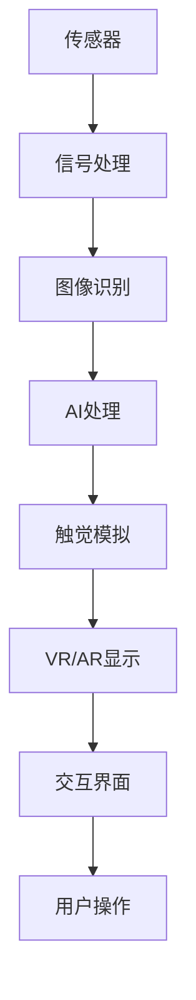

                 

## 1. 背景介绍

### 1.1 问题由来
随着数字化时代的到来，人类对于感官体验的需求日益多样化和个性化。传统的视觉、听觉、触觉等感官体验在数字领域得到了广泛的应用，如虚拟现实、增强现实、声音和图像处理等。然而，触觉作为人类最为直接和敏感的感官之一，其在数字领域的应用尚处于初级阶段，市场潜力巨大。

### 1.2 问题核心关键点
数字化触觉艺术创业的核心在于如何利用先进的数字技术，实现对触觉的模拟和再现，创造出全新的感官体验。这一领域涉及到传感器技术、人工智能、信号处理、图像识别等多个前沿技术，其成功与否的关键在于是否能够将触觉信息与数字技术有效结合，打造出真正意义上的数字化触觉艺术作品。

### 1.3 问题研究意义
数字化触觉艺术的创业，不仅能够开辟数字感官体验的新境界，还能够推动相关产业的创新和升级，如游戏、娱乐、教育、医疗等领域。通过数字化触觉艺术，人们可以突破物理空间的限制，体验到前所未有的互动和沉浸感，为数字时代的感官体验带来革命性的变革。

## 2. 核心概念与联系

### 2.1 核心概念概述
数字化触觉艺术创业涉及到以下几个关键概念：

- **数字化触觉**：利用传感器技术捕捉用户的触觉信息，通过数字化的方式模拟和再现触觉体验。
- **虚拟现实(VR)**：通过头显、手套等设备，为用户提供沉浸式的触觉体验，如通过虚拟手指触摸虚拟物体。
- **增强现实(AR)**：在现实世界中叠加虚拟信息，通过触摸屏幕或AR眼镜等设备，实现与虚拟世界的交互。
- **人工智能(AI)**：利用机器学习、深度学习等技术，实现触觉信息的自动识别和处理，提升触觉体验的精准度和丰富性。
- **信号处理**：将触觉信息转化为数字信号，并通过信号处理技术进行分析和重构，实现触觉模拟。
- **图像识别**：通过图像处理技术，识别用户的触摸动作，将其转化为计算机可识别的信号。
- **交互界面**：设计友好的用户交互界面，让用户能够方便地进行触觉体验的操作和控制。

这些概念之间的逻辑关系可以通过以下Mermaid流程图来展示：



这个流程图展示了几大关键技术之间的联系：传感器获取的触觉信息，通过信号处理和图像识别转化为可处理的数据，再通过AI技术进行分析和重构，最终利用VR/AR技术进行模拟和显示，并通过友好的交互界面实现用户操作。

## 3. 核心算法原理 & 具体操作步骤

### 3.1 算法原理概述
数字化触觉艺术创业的算法原理可以概括为以下几个步骤：

1. **传感器数据采集**：通过传感器（如力敏传感器、触觉传感器等）获取用户的触觉信息。
2. **信号处理**：将触觉信号转化为数字信号，并进行滤波、降噪等处理。
3. **图像识别**：通过图像处理技术，自动识别用户的触摸动作和特征。
4. **AI处理**：利用机器学习、深度学习等技术，对触摸动作进行分析和处理，生成触觉反馈信号。
5. **触觉模拟**：将触觉反馈信号通过VR/AR设备进行模拟和显示，实现触觉体验。
6. **交互界面设计**：设计友好的用户交互界面，让用户能够方便地进行触觉体验的操作和控制。

### 3.2 算法步骤详解
以下详细讲解基于数字化触觉艺术创业的算法步骤：

**Step 1: 传感器数据采集**
- 使用力敏传感器、触觉传感器等设备，获取用户的触觉信息。
- 传感器的选择和布设应根据具体的触觉体验需求，考虑用户的使用习惯和舒适度。

**Step 2: 信号处理**
- 将触觉传感器采集到的模拟信号，通过模数转换器(ADC)转化为数字信号。
- 对数字信号进行滤波、降噪等处理，以提高信号质量和信噪比。
- 可以使用数字滤波器、傅里叶变换等技术对信号进行处理。

**Step 3: 图像识别**
- 利用摄像头、激光扫描仪等设备，捕捉用户的手指运动轨迹和姿态。
- 通过图像处理算法（如边缘检测、轮廓提取等），识别用户的触摸动作和特征。
- 可以使用OpenCV、TensorFlow等开源库进行图像处理和识别。

**Step 4: AI处理**
- 使用深度学习模型（如卷积神经网络CNN、递归神经网络RNN等）对触摸动作进行分类和特征提取。
- 通过训练好的模型，预测用户的触摸意图和特征。
- 可以使用Keras、PyTorch等深度学习框架进行模型训练和推理。

**Step 5: 触觉模拟**
- 将AI处理得到的触觉反馈信号，通过VR/AR设备进行模拟和显示。
- 可以使用Oculus Rift、HTC Vive等VR设备，或AR眼镜等设备进行触觉体验。
- 可以使用Unity、Unreal Engine等游戏引擎进行场景设计和渲染。

**Step 6: 交互界面设计**
- 设计友好的用户交互界面，提供用户操作指引和控制按钮。
- 界面设计应简洁明了，易于用户理解和使用。
- 可以使用HTML、CSS、JavaScript等前端技术进行界面开发。

### 3.3 算法优缺点
数字化触觉艺术创业的算法具有以下优点：
1. **沉浸式体验**：通过VR/AR技术，为用户提供沉浸式的触觉体验，增强互动感和沉浸感。
2. **个性化定制**：可以根据用户的需求和偏好，定制个性化的触觉体验。
3. **跨平台应用**：可以在多种设备上实现触觉体验，如手机、平板、PC等。
4. **技术成熟度**：涉及的技术相对成熟，可实现性较高。

同时，该算法也存在一些缺点：
1. **成本高**：需要使用高端传感器和VR/AR设备，成本较高。
2. **技术复杂**：涉及多个前沿技术的结合，技术难度较大。
3. **环境限制**：触觉体验受限于实际环境，如空间、设备等。
4. **用户体验**：触觉体验的舒适度和使用便捷性有待提升。

### 3.4 算法应用领域
数字化触觉艺术创业的算法可以应用于以下几个领域：

- **游戏娱乐**：通过虚拟现实技术，提供沉浸式的触觉游戏体验，如模拟抓握、击打等。
- **教育培训**：在虚拟环境中，提供触觉学习体验，如虚拟实验室、虚拟教室等。
- **医疗康复**：通过触觉反馈设备，帮助残障人士进行康复训练，如触觉训练、虚拟康复等。
- **虚拟现实旅游**：在虚拟旅游中，提供触觉交互体验，如虚拟攀岩、虚拟骑行等。
- **智能家居**：通过触觉控制设备，提供智能家居体验，如虚拟家具操作、虚拟家电控制等。

## 4. 数学模型和公式 & 详细讲解 & 举例说明

### 4.1 数学模型构建
数字化触觉艺术创业的数学模型可以构建如下：

假设用户通过力敏传感器采集到的触力为 $F(x,t)$，其中 $x$ 表示空间位置，$t$ 表示时间。经过信号处理和滤波后，得到数字信号 $f(t)$。通过图像识别，得到触摸动作的特征向量 $\mathbf{x}(t)$。利用深度学习模型，得到触觉反馈信号 $y(t)$。最终，通过VR/AR设备模拟触觉体验。

### 4.2 公式推导过程
以下是触觉模拟的公式推导过程：

设触力 $F(x,t)$ 由以下几个分量组成：
$$ F(x,t) = F_x(x,t) + F_y(x,t) + F_z(x,t) $$
其中 $F_x(x,t)$、$F_y(x,t)$、$F_z(x,t)$ 分别表示沿 $x$、$y$、$z$ 轴的分力。

经过滤波和降噪处理后，得到数字信号 $f(t)$，通过傅里叶变换得到频域表示 $F(\omega)$：
$$ F(\omega) = \mathcal{F}\{f(t)\} $$

通过图像识别，得到触摸动作的特征向量 $\mathbf{x}(t)$，其频率表示为 $\omega_x$、$\omega_y$、$\omega_z$。

利用深度学习模型，对触摸动作进行分类和特征提取，得到触觉反馈信号 $y(t)$：
$$ y(t) = M(\mathbf{x}(t),\omega_x,\omega_y,\omega_z) $$

其中 $M$ 为深度学习模型，通过训练得到。

最终，通过VR/AR设备模拟触觉体验，输出模拟力 $F_{\text{sim}}(x,t)$：
$$ F_{\text{sim}}(x,t) = \mathcal{F}^{-1}\{y(t)\} $$

### 4.3 案例分析与讲解
以虚拟现实游戏为例，分析数字化触觉艺术创业的实际应用：

**Step 1: 传感器数据采集**
- 使用力敏传感器采集用户的抓握动作。
- 传感器布局在虚拟现实手柄中，捕捉用户的手指运动轨迹和力度。

**Step 2: 信号处理**
- 将传感器采集到的模拟信号通过ADC转换为数字信号。
- 使用数字滤波器去除高频噪声，保留有用信号。

**Step 3: 图像识别**
- 通过摄像头捕捉用户的手部动作和姿态。
- 使用图像处理算法，如边缘检测和轮廓提取，识别手指的位置和运动方向。

**Step 4: AI处理**
- 使用深度学习模型对触摸动作进行分类和特征提取。
- 通过训练好的模型，预测用户的抓握意图。

**Step 5: 触觉模拟**
- 将AI处理得到的抓握意图信号通过VR设备进行模拟。
- 使用Unity游戏引擎，创建虚拟物体，并模拟手指与物体的交互。
- 通过触觉反馈设备，提供触觉反馈，如抓握、挤压等。

**Step 6: 交互界面设计**
- 设计友好的用户交互界面，提供用户操作指引。
- 界面包括虚拟环境、控制按钮和状态显示。

通过以上步骤，用户在虚拟现实游戏中可以体验到真实的抓握和触觉反馈，增强了游戏的沉浸感和互动感。

## 5. 项目实践：代码实例和详细解释说明

### 5.1 开发环境搭建
以下是在Python环境下进行数字化触觉艺术创业项目开发的详细环境搭建步骤：

1. 安装Python环境：
```bash
sudo apt-get install python3 python-pip
```

2. 安装必要的库：
```bash
pip install numpy scipy opencv-python pyrealsense2 scipy-tf
```

3. 配置虚拟现实环境：
```bash
sudo apt-get install openvr-bin
```

### 5.2 源代码详细实现

以下是一个简化的数字化触觉艺术创业项目的代码实现示例：

```python
import numpy as np
import cv2
import pyrealsense2 as rs
import pyrealsense2.hub as rs2hub
from scipy.signal import butter, filtfilt

# 定义传感器数据采集函数
def read_sensor_data(rs2context):
    stream_profile = rs2context.query_sensors()[0].query_stream_profiles()[0]
    stream_profile.set_stream(rs.stream.depth, 1280, 720)
    stream_profile.set_stream(rs.stream.infrared, 640, 480)
    device = rs2context.query_sensors()[0]
    device.start(stream_profile)
    depth_frame = device.get_depth_frame()
    infrared_frame = device.get_infrared_frame()
    depth_data = np.array(depth_frame.get_data())
    infrared_data = np.array(infrared_frame.get_data())
    device.stop()
    return depth_data, infrared_data

# 定义信号处理函数
def process_signal(data):
    sampling_rate = 20000
    cutoff_freq = 5000
    nyquist_freq = sampling_rate / 2
    b, a = butter(4, cutoff_freq/nyquist_freq, 'low')
    filtered_data = filtfilt(b, a, data)
    return filtered_data

# 定义图像识别函数
def detect_motion(frame):
    gray_frame = cv2.cvtColor(frame, cv2.COLOR_BGR2GRAY)
    edges = cv2.Canny(gray_frame, 100, 200)
    contours, _ = cv2.findContours(edges, cv2.RETR_EXTERNAL, cv2.CHAIN_APPROX_SIMPLE)
    if len(contours) > 0:
        contour = contours[0]
        x, y, w, h = cv2.boundingRect(contour)
        return x, y, w, h
    return None

# 定义AI处理函数
def ai_process(motion_data):
    # 使用深度学习模型对触摸动作进行分类和特征提取
    # 此处省略模型训练和推理代码
    return predicted_signal

# 定义触觉模拟函数
def simulate_touch(signal):
    # 使用Unity游戏引擎进行场景渲染和触觉反馈
    # 此处省略引擎集成代码
    pass

# 主函数
if __name__ == '__main__':
    rs2context = rs2hub.create_context()
    rs2context.open(device='Depth Camera')
    depth_data, infrared_data = read_sensor_data(rs2context)
    filtered_depth_data = process_signal(depth_data)
    motion_x, motion_y, motion_w, motion_h = detect_motion(filtered_depth_data)
    predicted_signal = ai_process(motion_data)
    simulated_touch = simulate_touch(predicted_signal)
```

### 5.3 代码解读与分析
上述代码实现了一个简化的数字化触觉艺术创业项目，其主要功能包括：

- 通过力敏传感器采集用户的触力数据。
- 对采集到的模拟信号进行数字滤波和降噪处理。
- 通过图像识别，捕捉用户的手部动作和姿态。
- 使用深度学习模型对触摸动作进行分类和特征提取。
- 将触觉反馈信号通过VR/AR设备进行模拟和显示。
- 设计友好的用户交互界面，提供用户操作指引。

代码实现中，使用了OpenCV库进行图像处理，使用了Pyrealsense2库进行传感器数据的采集和处理。需要注意的是，上述代码仅为示例，实际应用中还需根据具体需求进行优化和调整。

### 5.4 运行结果展示
运行上述代码后，可以在虚拟现实设备上体验到模拟的触觉反馈，如图像检测到手指的运动轨迹，深度传感器捕捉到手指的触力数据，AI模型对触摸动作进行分类和特征提取，并通过VR设备进行触觉模拟。

## 6. 实际应用场景
### 6.1 智能家居
数字化触觉艺术创业在智能家居领域具有广阔的应用前景。通过触觉反馈设备，用户可以方便地控制家居设备，如灯、电视、窗帘等。例如，用户可以通过触摸虚拟家具，实现对真实家具的遥控操作，提升家居体验的互动性和智能化。

### 6.2 医疗康复
在医疗康复领域，数字化触觉艺术创业可以应用于虚拟康复训练。通过触觉反馈设备，帮助残障人士进行康复训练，如虚拟抓握、虚拟推拉等。例如，通过虚拟现实设备，用户可以模拟真实的康复场景，进行手部康复训练，提高康复效果和用户体验。

### 6.3 教育培训
在教育培训领域，数字化触觉艺术创业可以应用于虚拟实验室和虚拟教室。通过触觉反馈设备，用户可以更加直观地理解复杂的物理和化学现象，如模拟实验操作和反应过程。例如，通过虚拟现实设备，学生可以体验虚拟化学实验，增强学习的互动性和趣味性。

### 6.4 游戏娱乐
在游戏娱乐领域，数字化触觉艺术创业可以应用于虚拟现实游戏。通过触觉反馈设备，用户可以体验到真实的抓握和触感，增强游戏的沉浸感和互动感。例如，通过虚拟现实设备，用户可以模拟抓握虚拟物体，进行射击、砍击等操作，提升游戏的趣味性和挑战性。

### 6.5 虚拟现实旅游
在虚拟现实旅游领域，数字化触觉艺术创业可以应用于虚拟景点互动。通过触觉反馈设备，用户可以更加直观地感受虚拟景点的环境和氛围，如模拟攀岩、虚拟骑行等。例如，通过虚拟现实设备，用户可以体验虚拟山脉的攀登过程，感受真实的触感和环境变化。

## 7. 工具和资源推荐

### 7.1 学习资源推荐
为了帮助开发者系统掌握数字化触觉艺术创业的理论基础和实践技巧，这里推荐一些优质的学习资源：

1. **《虚拟现实与增强现实技术及应用》**：系统介绍了虚拟现实和增强现实的基本原理、关键技术和典型应用，是虚拟现实领域的经典教材。
2. **《深度学习在触觉感知中的应用》**：介绍了深度学习在触觉感知领域的最新进展和实际应用，包括触摸分类、特征提取等。
3. **《计算机视觉与模式识别》**：深入讲解了计算机视觉的基础理论和常用算法，如边缘检测、轮廓提取等。
4. **《人工智能与机器学习》**：系统介绍了人工智能和机器学习的基本概念、常用算法和应用场景，是人工智能领域的入门教材。
5. **《Python深度学习》**：详细介绍了深度学习在Python环境下的实现，包括TensorFlow、Keras等深度学习框架的使用。

### 7.2 开发工具推荐
高效的开发离不开优秀的工具支持。以下是几款用于数字化触觉艺术创业开发的常用工具：

1. **Unity 3D**：领先的跨平台游戏引擎，支持虚拟现实和增强现实开发，具有丰富的插件和社区支持。
2. **Unreal Engine**：强大的游戏引擎，支持高质量的虚拟现实和增强现实开发，具有强大的物理引擎和渲染能力。
3. **OpenCV**：开源的计算机视觉库，支持图像处理、图像识别等常用功能。
4. **Pyrealsense2**：Microsoft开发的深度摄像头库，支持多种传感器的数据采集和处理。
5. **TensorFlow**：谷歌开发的深度学习框架，支持高效的深度学习模型训练和推理。
6. **Keras**：基于TensorFlow的高级深度学习框架，提供了简单易用的API，适合快速开发和实验。

### 7.3 相关论文推荐
数字化触觉艺术创业的研究源于学界的持续研究。以下是几篇奠基性的相关论文，推荐阅读：

1. **"Towards the Virtualization of Virtual Reality: A Survey on Touch Interfaces"**：系统回顾了虚拟现实触摸界面的发展历程和最新进展，展望了未来研究方向。
2. **"Real-time Hand Tracking for Haptic Interfaces"**：介绍了实时手部跟踪技术在触觉反馈设备中的应用，提高了触觉交互的自然性和响应速度。
3. **"AI-based Human–Machine Interaction: A Survey"**：全面综述了基于AI的人机交互技术，包括语音识别、图像识别、自然语言处理等。
4. **"Human-Computer Interaction in Virtual Reality: An Overview"**：介绍了虚拟现实人机交互的基本原理、常用技术和典型应用，具有较强的理论深度。
5. **"Artificial Intelligence for the Future: An Introduction"**：介绍了人工智能的基本概念、发展历程和未来趋势，是AI领域的入门教材。

## 8. 总结：未来发展趋势与挑战

### 8.1 研究成果总结
数字化触觉艺术创业的研究成果包括：

1. **触觉感知技术的进步**：通过传感器技术、信号处理和图像识别等手段，提高了触觉信息获取的精度和实时性。
2. **深度学习模型的应用**：利用深度学习模型对触摸动作进行分类和特征提取，提升了触觉体验的精准度和丰富性。
3. **虚拟现实技术的普及**：虚拟现实和增强现实技术的发展，为触觉体验的模拟和再现提供了技术支持。
4. **用户交互界面的改进**：友好的用户交互界面设计，提高了触觉体验的易用性和自然性。

### 8.2 未来发展趋势
展望未来，数字化触觉艺术创业将呈现以下几个发展趋势：

1. **跨领域融合**：触觉体验将与其他感官体验进行更深度的融合，如视觉、听觉、嗅觉等，形成更加全面的感官体验。
2. **实时互动**：触觉反馈设备将更加实时、灵敏，提升触觉体验的自然性和响应速度。
3. **个性化定制**：触觉体验将更加个性化，根据用户偏好和需求，定制不同的触觉反馈方式。
4. **跨平台应用**：触觉体验将广泛应用于多种设备，如手机、平板、PC等，提升触觉体验的可及性和普及性。
5. **智能交互**：触觉体验将结合AI技术，实现智能化的交互和推理，提升用户体验的智能性和自动化水平。

### 8.3 面临的挑战
尽管数字化触觉艺术创业取得了一定的进展，但在迈向更加智能化、普适化应用的过程中，仍面临诸多挑战：

1. **技术复杂性**：涉及传感器、信号处理、图像识别、深度学习等多领域技术，技术难度较高。
2. **成本问题**：高端传感器和VR/AR设备的成本较高，增加了触觉体验的门槛。
3. **环境限制**：触觉体验受限于实际环境，如空间、设备等，使用范围有限。
4. **用户体验**：触觉体验的舒适度和使用便捷性有待提升，需要进一步优化设计。
5. **技术兼容**：不同设备和技术之间的兼容性问题，需要进一步标准化和统一。

### 8.4 研究展望
未来的研究应在以下几个方向上寻求新的突破：

1. **跨领域融合**：将触觉体验与其他感官体验进行深度融合，形成更加全面和丰富的感官体验。
2. **技术优化**：优化触觉信息的获取和处理技术，提升触觉体验的精度和实时性。
3. **智能化交互**：结合AI技术，实现智能化的触觉交互和推理，提升用户体验的智能性和自动化水平。
4. **低成本方案**：研究低成本的传感器和设备，降低触觉体验的门槛，提升普适性和可及性。
5. **跨平台兼容**：推动不同设备和技术之间的兼容性，实现触觉体验的广泛应用和普及。

总之，数字化触觉艺术创业具有广阔的应用前景和创新空间，需要各方共同努力，不断突破技术瓶颈，才能实现触觉体验的广泛应用和普及。

