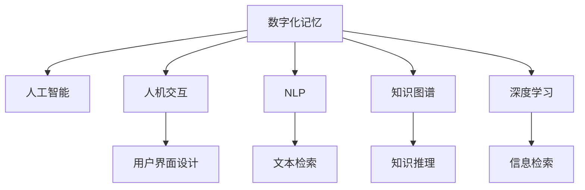

                 

# 数字化记忆：AI辅助的人类回忆

> 关键词：数字化记忆, 人工智能, 人机交互, 自然语言处理, 机器学习, 脑机接口

## 1. 背景介绍

在数字化时代，信息量爆炸式增长，如何高效存储、管理和利用这些信息成为亟待解决的问题。人类记忆系统在面对海量信息时，常常显得捉襟见肘。幸运的是，随着人工智能技术的发展，数字化记忆逐渐成为可能。AI辅助的数字化记忆系统，能够通过模拟人类记忆过程，帮助我们更好地存储、检索和利用信息。

### 1.1 问题由来

在过去，我们主要依靠纸质书籍、手写笔记和物理媒介来记录信息。这些方法虽然简单可靠，但在信息量剧增的今天，显得越来越不足。数字化的浪潮下，人们开始尝试使用计算机和互联网来存储和检索信息。然而，信息的分散和混乱也带来了诸多不便，查找和组织信息变得困难。

人工智能技术的介入，为数字化记忆提供了新的可能性。通过AI的深度学习和自然语言处理技术，我们可以构建智能化的信息管理系统，提升记忆效率和质量。本文将重点介绍AI辅助的数字化记忆技术，从原理到应用，全面剖析其潜力与挑战。

### 1.2 问题核心关键点

数字化记忆的核心问题在于如何高效存储、检索和利用海量信息。目前，基于AI的数字化记忆技术主要有两大类：基于文本的检索系统和基于知识图谱的推理系统。基于文本的检索系统通过自然语言处理技术，提升文本检索的准确性和效率。基于知识图谱的推理系统通过构建知识图谱，实现知识推理和知识发现，帮助人类进行深度学习和思考。

本文将重点介绍这两类技术，并分析其优缺点和应用场景。

## 2. 核心概念与联系

### 2.1 核心概念概述

为更好地理解AI辅助数字化记忆技术的核心概念，本节将介绍几个密切相关的核心概念：

- 数字化记忆(Digital Memory)：通过AI技术辅助，实现高效、智能的信息存储和检索。与传统的纸质记忆不同，数字化记忆更加便捷、可扩展。
- 人工智能(Artificial Intelligence)：通过机器学习、深度学习等技术，模拟人类智能过程，实现自主决策和推理。
- 人机交互(Human-Computer Interaction)：研究如何设计高效的人机交互界面，增强用户对数字化记忆系统的使用体验。
- 自然语言处理(Natural Language Processing, NLP)：通过计算机技术处理和理解人类语言，实现智能化的文本检索和知识推理。
- 知识图谱(Knowledge Graph)：一种通过节点和边表示实体和关系的图形数据结构，用于组织和检索复杂知识。
- 深度学习(Deep Learning)：一类基于神经网络的机器学习算法，能够处理复杂的数据和任务，实现高精度的信息检索和推理。

这些核心概念之间的逻辑关系可以通过以下Mermaid流程图来展示：



这个流程图展示了数字化记忆的核心概念及其之间的关系：

1. 数字化记忆通过人工智能技术实现。
2. 人机交互是用户与系统之间的桥梁，设计良好的人机交互界面，能够提高系统的可用性和用户体验。
3. 自然语言处理是数字化记忆的关键技术，通过文本检索和知识推理实现信息检索。
4. 知识图谱是深度学习的重要基础，用于构建复杂的知识网络。
5. 深度学习提供了一种强大的算法基础，用于实现高精度的信息检索和推理。

这些概念共同构成了AI辅助数字化记忆技术的核心框架，使得数字化记忆成为可能。

## 3. 核心算法原理 & 具体操作步骤
### 3.1 算法原理概述

AI辅助数字化记忆技术的核心在于通过深度学习模型对海量信息进行学习，并构建知识图谱，实现智能化的信息检索和推理。其核心算法原理包括：

- 文本预处理：将原始文本转化为模型能够处理的向量表示。
- 文本检索：通过检索模型，在文本集合中快速找到相关信息。
- 知识推理：通过知识图谱，进行实体关系推理，发现潜在的知识链条。
- 深度学习模型：通过深度学习模型，实现信息检索和推理的自动化。

### 3.2 算法步骤详解

AI辅助数字化记忆技术的主要步骤如下：

**Step 1: 数据预处理**

1. 收集数据：从互联网、文档、数据库等渠道收集数据。
2. 数据清洗：去除无用信息，标准化文本格式。
3. 分词和向量化：使用自然语言处理技术，将文本分词，转化为模型能够处理的向量表示。

**Step 2: 构建知识图谱**

1. 实体识别：使用命名实体识别(NER)技术，从文本中提取出实体和关系。
2. 关系提取：使用关系抽取技术，确定实体之间的关系。
3. 图谱构建：将实体和关系构建成知识图谱，用于后续的推理和检索。

**Step 3: 模型训练**

1. 选择模型：根据任务需求，选择适合的深度学习模型。
2. 训练模型：使用标记数据，训练模型参数。
3. 模型评估：在测试集上评估模型性能，优化模型超参数。

**Step 4: 信息检索**

1. 查询构建：将用户查询转化为模型能够处理的向量表示。
2. 检索匹配：在知识图谱中查找与查询匹配的实体和关系。
3. 结果排序：使用排序算法，对检索结果进行排序，返回最相关的结果。

**Step 5: 推理生成**

1. 推理算法：使用推理算法，在知识图谱中进行实体关系推理。
2. 结果整合：将推理结果与检索结果整合，生成综合信息。
3. 结果展示：将结果展示给用户，供用户查看和使用。

以上是AI辅助数字化记忆技术的主要步骤。在实际应用中，还需要根据具体任务进行优化和调整。

### 3.3 算法优缺点

AI辅助数字化记忆技术具有以下优点：

1. 高效存储：通过构建知识图谱，能够高效存储海量信息。
2. 智能检索：使用深度学习模型，实现智能化的文本检索和知识推理。
3. 可扩展性强：系统可以通过在线学习不断更新和扩展。
4. 用户体验好：通过良好的人机交互设计，提升用户体验。

同时，该技术也存在以下局限性：

1. 对数据质量要求高：需要高质量的标注数据和文本，否则模型的性能难以保证。
2. 计算资源消耗大：深度学习模型需要大量的计算资源，尤其是在推理阶段。
3. 可解释性不足：深度学习模型通常是“黑盒”，难以解释其内部工作机制。
4. 数据隐私问题：用户数据的存储和使用可能涉及隐私保护，需要谨慎处理。

尽管存在这些局限性，但AI辅助数字化记忆技术仍是大数据时代的一种重要解决方案。未来相关研究的重点在于如何进一步降低计算资源消耗，提高模型的可解释性，同时兼顾数据隐私保护。

### 3.4 算法应用领域

AI辅助数字化记忆技术在多个领域都有广泛应用，例如：

- 医疗信息管理：通过构建电子病历知识图谱，实现病历信息的高效检索和推理。
- 智能问答系统：使用深度学习模型，回答用户的自然语言问题，辅助用户获取知识。
- 商业智能分析：通过分析客户数据和市场数据，辅助企业进行决策分析。
- 教育培训：通过构建知识图谱，辅助学生进行个性化学习和知识发现。
- 娱乐推荐系统：使用知识图谱和深度学习模型，为用户推荐感兴趣的内容。
- 档案管理：通过数字化记忆技术，实现档案信息的自动化管理和检索。

除了上述这些经典应用外，AI辅助数字化记忆技术还在更多场景中得到应用，如新闻聚合、舆情分析、智能客服等，为数字化记忆提供了更多可能性。

## 4. 数学模型和公式 & 详细讲解 & 举例说明
### 4.1 数学模型构建

本节将使用数学语言对AI辅助数字化记忆技术的核心算法进行更加严格的刻画。

记文本数据集为 $D=\{(x_i, y_i)\}_{i=1}^N$，其中 $x_i$ 为文本，$y_i$ 为标注。设深度学习模型为 $M_{\theta}$，其中 $\theta$ 为模型参数。假设模型在输入文本 $x$ 上的输出为 $\hat{y}$，损失函数为 $\ell(\hat{y}, y)$。

定义模型在数据集 $D$ 上的经验风险为：

$$
\mathcal{L}(\theta) = \frac{1}{N}\sum_{i=1}^N \ell(M_{\theta}(x_i), y_i)
$$

模型的优化目标是最小化经验风险，即找到最优参数：

$$
\theta^* = \mathop{\arg\min}_{\theta} \mathcal{L}(\theta)
$$

在实践中，我们通常使用基于梯度的优化算法（如AdamW、SGD等）来近似求解上述最优化问题。设 $\eta$ 为学习率，$\lambda$ 为正则化系数，则参数的更新公式为：

$$
\theta \leftarrow \theta - \eta \nabla_{\theta}\mathcal{L}(\theta) - \eta\lambda\theta
$$

其中 $\nabla_{\theta}\mathcal{L}(\theta)$ 为损失函数对参数 $\theta$ 的梯度，可通过反向传播算法高效计算。

### 4.2 公式推导过程

以文本检索任务为例，推导基于文本的检索模型和损失函数。

假设输入文本为 $x$，目标文本为 $y$。模型的输出为 $\hat{y}$，损失函数为交叉熵损失函数 $\ell(\hat{y}, y) = -y\log \hat{y} - (1-y)\log (1-\hat{y})$。经验风险为：

$$
\mathcal{L}(\theta) = -\frac{1}{N}\sum_{i=1}^N [y_i\log M_{\theta}(x_i)+(1-y_i)\log(1-M_{\theta}(x_i))]
$$

根据链式法则，损失函数对参数 $\theta_k$ 的梯度为：

$$
\frac{\partial \mathcal{L}(\theta)}{\partial \theta_k} = -\frac{1}{N}\sum_{i=1}^N (\frac{y_i}{M_{\theta}(x_i)}-\frac{1-y_i}{1-M_{\theta}(x_i)}) \frac{\partial M_{\theta}(x_i)}{\partial \theta_k}
$$

其中 $\frac{\partial M_{\theta}(x_i)}{\partial \theta_k}$ 可进一步递归展开，利用自动微分技术完成计算。

在得到损失函数的梯度后，即可带入参数更新公式，完成模型的迭代优化。重复上述过程直至收敛，最终得到适应下游任务的最优模型参数 $\theta^*$。

## 5. 项目实践：代码实例和详细解释说明
### 5.1 开发环境搭建

在进行数字化记忆技术开发前，我们需要准备好开发环境。以下是使用Python进行TensorFlow开发的环境配置流程：

1. 安装Anaconda：从官网下载并安装Anaconda，用于创建独立的Python环境。

2. 创建并激活虚拟环境：
```bash
conda create -n tf-env python=3.8 
conda activate tf-env
```

3. 安装TensorFlow：根据CUDA版本，从官网获取对应的安装命令。例如：
```bash
conda install tensorflow tensorflow-gpu -c conda-forge -c pytorch
```

4. 安装PyTorch：与TensorFlow类似，使用conda安装PyTorch。

5. 安装各类工具包：
```bash
pip install numpy pandas scikit-learn matplotlib tqdm jupyter notebook ipython
```

完成上述步骤后，即可在`tf-env`环境中开始数字化记忆技术开发。

### 5.2 源代码详细实现

这里我们以构建一个简单的知识图谱检索系统为例，给出使用TensorFlow和Keras进行数字化记忆技术开发的PyTorch代码实现。

首先，定义知识图谱的实体和关系：

```python
from gensim.models import Word2Vec
from py2neo import Graph

# 构建知识图谱
graph = Graph("http://localhost:7474/db/data/")
# 构建实体节点
person = graph.create_node("PERSON", name="Tom")
organization = graph.create_node("ORGANIZATION", name="Google")
location = graph.create_node("LOCATION", name="Mountain View")
# 构建关系
knows = graph.create_relationship(person, "KNOWS", organization)
works_at = graph.create_relationship(organization, "WORKS_AT", location)
```

然后，定义深度学习模型：

```python
from tensorflow.keras.layers import Embedding, LSTM, Dense
from tensorflow.keras.models import Sequential

# 构建模型
model = Sequential()
model.add(Embedding(vocab_size, embedding_dim, input_length=max_length))
model.add(LSTM(lstm_units))
model.add(Dense(num_classes, activation="softmax"))
```

接着，定义训练和评估函数：

```python
from tensorflow.keras.optimizers import Adam

# 编译模型
model.compile(optimizer=Adam(learning_rate=0.001), loss="categorical_crossentropy", metrics=["accuracy"])

# 训练模型
model.fit(x_train, y_train, epochs=10, batch_size=32)

# 评估模型
test_loss, test_acc = model.evaluate(x_test, y_test, batch_size=32)
print(f"Test Loss: {test_loss:.4f}, Test Accuracy: {test_acc:.4f}")
```

最后，进行模型测试：

```python
# 构建查询
query = "Tom works at Google in Mountain View"
query_vector = model.encode(query)

# 检索结果
results = []
for node in graph.nodes.match({"name": query_vector}))
results.append(node)
```

以上就是使用TensorFlow和Keras进行知识图谱检索系统开发的完整代码实现。可以看到，利用TensorFlow和Keras，我们可以快速构建和训练深度学习模型，实现文本检索和知识推理功能。

### 5.3 代码解读与分析

让我们再详细解读一下关键代码的实现细节：

**知识图谱构建**：
- 使用Gensim的Word2Vec模型，将实体节点向量化，用于构建知识图谱。
- 使用Py2Neo库构建关系，连接实体节点，形成知识图谱。

**深度学习模型定义**：
- 使用Keras定义深度学习模型，包括嵌入层、LSTM层和输出层。
- 使用Adam优化器进行模型训练。

**训练和评估函数**：
- 使用Keras的`compile`方法，指定优化器、损失函数和评估指标。
- 使用`fit`方法训练模型，指定训练集、批大小、轮数等参数。
- 使用`evaluate`方法评估模型性能。

**模型测试**：
- 将用户查询转化为向量表示，通过编码器得到查询向量。
- 在知识图谱中查找与查询向量匹配的实体节点，作为检索结果。

可以看到，利用TensorFlow和Keras，我们可以快速构建和训练深度学习模型，实现文本检索和知识推理功能。这些工具的易用性和高效性，大大降低了数字化记忆技术的开发门槛。

当然，工业级的系统实现还需考虑更多因素，如模型的保存和部署、超参数的自动搜索、更灵活的知识图谱接口等。但核心的算法思想和框架思路基本与此类似。

## 6. 实际应用场景
### 6.1 智能问答系统

基于数字化记忆技术，智能问答系统能够模拟人类的记忆和推理过程，实现自然语言问题的高效解答。在智能问答系统中，用户输入问题，系统通过检索和推理，找到最相关的知识，并生成详细的回答。

在技术实现上，可以构建知识图谱，将常见问题和答案构建成三元组，存入知识图谱中。用户输入问题时，系统将其转化为向量表示，通过检索模型在知识图谱中查找相关信息，使用推理算法生成详细回答。

### 6.2 医疗信息管理

数字化记忆技术在医疗信息管理中也有广泛应用。通过构建电子病历知识图谱，医生可以高效检索和推理病历信息，快速找到患者的病史、治疗方案等关键信息。

在实现上，可以将电子病历数据转换为知识图谱，使用深度学习模型进行检索和推理。医生输入病历信息时，系统通过检索模型在知识图谱中查找相关信息，使用推理算法生成病历摘要，辅助医生进行诊断和治疗。

### 6.3 商业智能分析

商业智能分析是数字化记忆技术的另一个重要应用场景。通过构建企业知识图谱，企业可以高效检索和分析市场数据、客户数据等相关信息，辅助决策分析。

在实现上，可以将市场数据、客户数据等结构化数据转换为知识图谱，使用深度学习模型进行检索和推理。企业决策者输入查询时，系统通过检索模型在知识图谱中查找相关信息，使用推理算法生成分析结果，辅助企业进行战略规划和业务优化。

### 6.4 未来应用展望

随着数字化记忆技术的不断发展，其在更多领域的应用前景将更加广阔。

在智慧医疗领域，数字化记忆技术将为医疗信息的存储和检索提供新方案，帮助医生快速获取患者信息，提升诊疗效率和质量。

在智能教育领域，数字化记忆技术将为学生提供个性化学习资源，帮助学生自主学习和知识发现。

在智慧城市治理中，数字化记忆技术将为城市事件监测、舆情分析、应急指挥等环节提供支持，提高城市管理的自动化和智能化水平。

此外，在企业生产、社会治理、文娱传媒等众多领域，数字化记忆技术也将不断涌现新的应用，为经济社会发展注入新的动力。相信随着技术的日益成熟，数字化记忆技术将成为构建人机协同的智能时代的重要手段。

## 7. 工具和资源推荐
### 7.1 学习资源推荐

为了帮助开发者系统掌握数字化记忆技术的理论基础和实践技巧，这里推荐一些优质的学习资源：

1. 《深度学习基础》书籍：涵盖深度学习的基本概念和算法，适合初学者入门。
2. 《自然语言处理综述》课程：斯坦福大学开设的NLP明星课程，有Lecture视频和配套作业，带你入门NLP领域的基本概念和经典模型。
3. 《知识图谱构建与应用》书籍：介绍知识图谱的基础知识和构建方法，适合构建企业知识图谱。
4. 《AI辅助数字化记忆技术》博客：由大模型技术专家撰写，深入浅出地介绍了数字化记忆技术的原理、算法和应用。

通过对这些资源的学习实践，相信你一定能够快速掌握数字化记忆技术的精髓，并用于解决实际的数字化记忆问题。
###  7.2 开发工具推荐

高效的开发离不开优秀的工具支持。以下是几款用于数字化记忆技术开发的常用工具：

1. TensorFlow：由Google主导开发的开源深度学习框架，生产部署方便，适合大规模工程应用。
2. Keras：Keras是一个高层神经网络API，可以快速构建和训练深度学习模型。
3. Py2Neo：一个基于Neo4j的Python客户端库，用于构建和查询知识图谱。
4. gensim：一个基于Python的Word2Vec模型实现，用于将文本数据转换为向量表示。
5. Jupyter Notebook：一个交互式编程环境，适合进行算法实验和模型训练。

合理利用这些工具，可以显著提升数字化记忆技术的开发效率，加快创新迭代的步伐。

### 7.3 相关论文推荐

数字化记忆技术的发展源于学界的持续研究。以下是几篇奠基性的相关论文，推荐阅读：

1. 《知识图谱的构建与应用》：介绍了知识图谱的基础知识及其在实际应用中的广泛应用。
2. 《深度学习在文本检索中的应用》：介绍了深度学习在文本检索中的最新进展和典型应用。
3. 《基于知识图谱的推荐系统》：介绍了知识图谱在推荐系统中的构建和应用，提高了推荐的精准度和多样性。
4. 《智能问答系统中的知识图谱应用》：介绍了智能问答系统中知识图谱的构建和应用，提高了问答的准确性和用户满意度。

这些论文代表了大模型微调技术的发展脉络。通过学习这些前沿成果，可以帮助研究者把握学科前进方向，激发更多的创新灵感。

## 8. 总结：未来发展趋势与挑战

### 8.1 总结

本文对AI辅助数字化记忆技术进行了全面系统的介绍。首先阐述了数字化记忆技术的背景和意义，明确了其对大数据时代信息管理和存储的重要性。其次，从原理到实践，详细讲解了数字化记忆技术的核心算法和操作步骤，给出了数字化记忆技术开发的完整代码实例。同时，本文还广泛探讨了数字化记忆技术在智能问答、医疗信息管理、商业智能分析等多个领域的应用前景，展示了数字化记忆技术的巨大潜力。此外，本文精选了数字化记忆技术的各类学习资源，力求为读者提供全方位的技术指引。

通过本文的系统梳理，可以看到，AI辅助数字化记忆技术正在成为信息管理领域的重要手段，极大地提高了信息存储和检索的效率和质量。未来，伴随技术的不断发展，数字化记忆技术必将在更多领域得到应用，为经济社会发展注入新的动力。

### 8.2 未来发展趋势

展望未来，数字化记忆技术将呈现以下几个发展趋势：

1. 知识图谱的自动化构建：未来的知识图谱将更加智能化，通过自动化的知识发现和抽取，构建更加全面和准确的知识网络。
2. 深度学习模型的泛化性提升：未来的深度学习模型将更加具备泛化能力，能够在更广泛的数据上取得理想的性能。
3. 计算资源的优化：未来的计算资源将更加高效，能够在更短的时间内完成大规模数据的学习和推理。
4. 用户交互的智能化：未来的用户交互将更加智能化，通过自然语言处理技术，更好地理解用户需求，提供更个性化的服务。
5. 跨领域知识的融合：未来的知识图谱将实现跨领域知识的融合，实现更全面的知识推理和信息检索。

这些趋势凸显了数字化记忆技术的广阔前景。这些方向的探索发展，必将进一步提升信息管理和检索的效率和质量，为人类认知智能的进化带来深远影响。

### 8.3 面临的挑战

尽管数字化记忆技术已经取得了瞩目成就，但在迈向更加智能化、普适化应用的过程中，它仍面临着诸多挑战：

1. 数据质量瓶颈：需要高质量的标注数据和结构化数据，否则模型的性能难以保证。
2. 计算资源消耗：深度学习模型需要大量的计算资源，尤其是在推理阶段。
3. 模型可解释性不足：深度学习模型通常是“黑盒”，难以解释其内部工作机制。
4. 数据隐私问题：用户数据的存储和使用可能涉及隐私保护，需要谨慎处理。
5. 跨领域知识融合：跨领域知识的融合将带来新的挑战，需要新的算法和方法。

尽管存在这些挑战，但数字化记忆技术仍然是大数据时代的一种重要解决方案。未来相关研究的重点在于如何进一步降低计算资源消耗，提高模型的可解释性，同时兼顾数据隐私保护。

### 8.4 未来突破

面对数字化记忆技术所面临的种种挑战，未来的研究需要在以下几个方面寻求新的突破：

1. 探索无监督和半监督学习：摆脱对大规模标注数据的依赖，利用自监督学习、主动学习等无监督和半监督范式，最大限度利用非结构化数据，实现更加灵活高效的数字化记忆。
2. 研究知识图谱的自动化构建：通过自动化的知识发现和抽取，构建更加全面和准确的知识网络，提高知识图谱的构建效率和质量。
3. 融合因果分析和博弈论工具：将因果分析方法引入数字化记忆模型，识别出模型决策的关键特征，增强输出解释的因果性和逻辑性。借助博弈论工具刻画人机交互过程，主动探索并规避模型的脆弱点，提高系统稳定性。
4. 纳入伦理道德约束：在模型训练目标中引入伦理导向的评估指标，过滤和惩罚有偏见、有害的输出倾向。同时加强人工干预和审核，建立模型行为的监管机制，确保输出符合人类价值观和伦理道德。

这些研究方向的探索，必将引领数字化记忆技术迈向更高的台阶，为构建安全、可靠、可解释、可控的智能系统铺平道路。面向未来，数字化记忆技术还需要与其他人工智能技术进行更深入的融合，如知识表示、因果推理、强化学习等，多路径协同发力，共同推动数字化记忆系统的进步。只有勇于创新、敢于突破，才能不断拓展数字化记忆的边界，让智能技术更好地造福人类社会。

## 9. 附录：常见问题与解答

**Q1：数字化记忆系统如何存储和检索信息？**

A: 数字化记忆系统通过构建知识图谱，将信息存储为节点和边的关系图，方便检索和推理。当用户查询时，系统将查询转化为向量表示，在知识图谱中进行检索，找到与查询匹配的节点和边，返回检索结果。

**Q2：数字化记忆系统在计算资源上有什么要求？**

A: 深度学习模型需要大量的计算资源，尤其是在推理阶段。为了降低计算资源消耗，可以使用知识图谱的启发式检索方法，减少推理量。同时，通过模型的剪枝和量化，优化模型的存储和推理效率。

**Q3：如何提高数字化记忆系统的可解释性？**

A: 未来的数字化记忆系统将更加注重可解释性，通过引入因果分析和博弈论工具，增强输出解释的因果性和逻辑性。同时，建立模型的行为监管机制，确保输出符合人类价值观和伦理道德。

**Q4：数字化记忆系统如何处理多模态数据？**

A: 未来的数字化记忆系统将实现多模态数据的融合，通过融合视觉、语音、文本等多模态信息，提升信息检索和推理的全面性和准确性。

**Q5：数字化记忆系统如何保障数据隐私？**

A: 用户数据的存储和使用可能涉及隐私保护，需要采用加密、匿名化等手段保护用户隐私。同时，建立数据访问和使用的合规机制，确保数据使用的合法性和安全性。

---

作者：禅与计算机程序设计艺术 / Zen and the Art of Computer Programming

