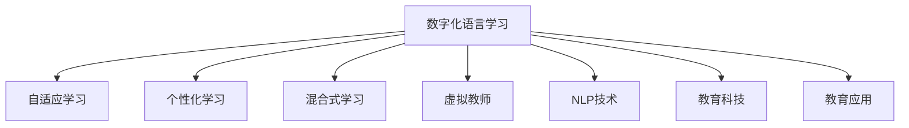

                 

# 数字化语言学习创业：AI驱动的语言教育

> 关键词：数字化语言学习, AI驱动, 语言教育, 个性化学习, 自适应学习, 混合式学习, 自然语言处理(NLP), 虚拟教师, 教育科技, 教育应用

## 1. 背景介绍

### 1.1 问题由来
随着全球化进程的加快和国际化的深入，语言学习已成为全球教育的刚需。然而，传统的语言学习方式往往效率低下、互动不足、个性化不够，难以满足多元化、便捷化的学习需求。面对这一挑战，数字化语言学习应运而生，利用AI技术打造高效、个性化、互动的语言学习平台，成为推动语言教育革新的重要力量。

### 1.2 问题核心关键点
数字化语言学习依赖于先进的AI技术，特别是自然语言处理(NLP)、个性化推荐、自适应学习等前沿技术，以实现语言教育的数字化、智能化转型。核心关键点包括：

- 自然语言处理：用于文本分析、情感识别、意图理解、语言生成等。
- 个性化学习：根据用户的学习进度、偏好、水平等个性化推送学习内容。
- 自适应学习：动态调整学习内容和难度，确保学习体验的最优化。
- 混合式学习：线上线下相结合，提升学习效率和互动体验。
- 虚拟教师：通过AI生成自然流畅的对话，陪伴用户完成语言学习。

这些关键技术相互配合，构建了一个完整的数字化语言学习生态系统，极大地提升了语言学习的效率和质量。

### 1.3 问题研究意义
数字化语言学习技术的发展，对于语言教育行业的影响深远：

- 降低学习门槛：通过智能化技术，使零基础用户也能轻松上手，大幅降低学习门槛。
- 提升学习效果：通过个性化推荐和自适应学习，保证每个用户都能得到量身定制的学习方案。
- 扩大教育资源：借助数字化平台，打破地域限制，实现优质教育资源的普惠共享。
- 促进教育公平：让更多偏远地区和资源匮乏的学校能够享受到优质语言教育资源。
- 创新教学模式：结合混合式学习，为语言教育提供更加灵活、便捷的解决方案。

随着教育科技的不断进步，数字化语言学习技术将为全球语言教育带来革命性变化，推动语言学习更加普及和高效。

## 2. 核心概念与联系

### 2.1 核心概念概述

为更好地理解数字化语言学习的技术架构和应用范式，本节将介绍几个关键概念：

- 数字化语言学习：指利用先进AI技术，将传统语言教育过程数字化、智能化的语言学习方式。
- 自适应学习：指根据学习者的实时表现动态调整学习内容和难度的学习模式，最大化学习效果。
- 个性化学习：指根据学习者的个性化需求，量身定制学习计划和内容。
- 混合式学习：指结合线上学习与线下活动的综合学习模式。
- 虚拟教师：指基于AI生成的自然流畅的对话，提供语言学习的互动和指导。
- 自然语言处理(NLP)：指使计算机能够理解、生成人类自然语言的技术，包括文本分析、情感识别、意图理解、语言生成等。
- 教育科技(EdTech)：指利用科技手段改进教育过程和效果的新兴领域，涵盖AI、VR、AR等多种技术。
- 教育应用：指基于AI技术开发的各种教育工具和服务，如语言学习应用、智能题库、虚拟教室等。

这些核心概念之间的逻辑关系可以通过以下Mermaid流程图来展示：



这个流程图展示了数字化语言学习的核心组件和技术架构，每个模块都是语言教育数字化转型的重要一环。

## 3. 核心算法原理 & 具体操作步骤

### 3.1 算法原理概述

数字化语言学习的核心算法包括自然语言处理、个性化推荐、自适应学习等，主要通过机器学习、深度学习等先进技术实现。其核心思想是：

1. **自然语言处理(NLP)**：利用先进的NLP技术，对用户输入的文本进行情感分析、意图理解、语言生成等处理，从而实现智能化的语言交互和理解。

2. **个性化推荐**：通过用户的学习数据（如学习历史、测试成绩、兴趣偏好等），运用机器学习算法（如协同过滤、内容推荐算法等），动态推荐最适合的学习内容。

3. **自适应学习**：根据学习者的实时表现（如正确率、学习时长、学习节奏等），动态调整学习内容和难度，以确保学习效果的最优化。

### 3.2 算法步骤详解

数字化语言学习的实现流程大致包括以下几个步骤：

**Step 1: 数据收集与预处理**
- 收集用户的学习数据，包括但不限于学习历史、测试成绩、学习行为、兴趣偏好等。
- 对数据进行清洗、标注和标准化，生成可用于机器学习训练的数据集。

**Step 2: 模型训练与优化**
- 利用收集到的数据，训练个性化推荐和自适应学习的算法模型，如协同过滤、深度学习神经网络等。
- 通过交叉验证和超参数调优，确保模型的高效性和泛化能力。

**Step 3: 个性化推荐**
- 根据用户的学习数据，实时生成个性化的学习内容推荐。
- 结合学习者当前的进度和状态，动态调整推荐内容，确保学习路径的个性化和高效性。

**Step 4: 自适应学习**
- 根据学习者的实时表现（如正确率、学习时长、学习节奏等），动态调整学习内容和难度。
- 使用自适应学习算法（如AdaGrad、RMSprop等），优化学习进度和效果。

**Step 5: 互动与反馈**
- 通过AI生成的虚拟教师，与用户进行自然流畅的互动，解答疑问和提供反馈。
- 收集用户的互动数据，进一步优化个性化推荐和自适应学习模型。

**Step 6: 学习效果评估**
- 定期评估学习者的进步和成效，通过测试和反馈调整学习计划。
- 利用机器学习模型对学习效果进行量化分析，提供可视化的学习进展报告。

### 3.3 算法优缺点

数字化语言学习的优势包括：

1. **高效学习**：通过个性化推荐和自适应学习，最大化学习效果。
2. **灵活性高**：结合线上线下学习模式，灵活调整学习时间和地点。
3. **互动性好**：利用虚拟教师进行互动，提升学习体验。
4. **数据驱动**：通过实时数据反馈，持续优化学习方案。

然而，也存在一些局限性：

1. **技术门槛高**：需要先进的AI技术和大量数据支持。
2. **用户依赖性**：依赖平台和虚拟教师的交互，用户主动性需要加强。
3. **隐私保护**：需保护用户数据隐私，避免信息泄露风险。
4. **多样性不足**：目前主要是面向英语等主流语言，对于小语种支持有限。
5. **跨文化障碍**：跨文化、跨语言的学习场景下，个性化推荐和互动仍需改进。

尽管有这些局限，但总体而言，数字化语言学习技术具有广阔的应用前景和潜力，是推动语言教育革新的重要方向。

### 3.4 算法应用领域

数字化语言学习技术已经在多个领域得到广泛应用，具体包括：

- **在线教育平台**：如Duolingo、Rosetta Stone、Babbel等，提供基于AI的个性化语言学习方案。
- **企业培训系统**：利用AI技术提升员工的语言技能，如Google的G Suite语言培训功能。
- **旅游服务**：帮助旅客快速学习目的地语言，如Airbnb、Booking.com等平台提供的语言学习工具。
- **国际交流项目**：如Erasmus+等项目，利用AI技术提升跨文化交流和语言技能。

随着技术的不断进步和市场的成熟，数字化语言学习技术将在更多领域得到应用，为语言教育带来全新的突破。

## 4. 数学模型和公式 & 详细讲解 & 举例说明

### 4.1 数学模型构建

数字化语言学习的数学模型主要基于机器学习和深度学习框架构建，涵盖个性化推荐、自适应学习等多个模块。

- **个性化推荐**：通过协同过滤、内容推荐等算法，构建用户-物品评分矩阵，生成个性化推荐。
- **自适应学习**：利用深度学习神经网络，构建学习路径的动态调整模型。

### 4.2 公式推导过程

以下以协同过滤算法为例，展示个性化推荐的数学模型和推导过程。

**协同过滤算法（Collaborative Filtering, CF）**：
- 协同过滤算法是基于用户行为数据的推荐算法，通过相似度计算，推荐用户可能感兴趣的商品或内容。
- 假设用户-物品评分矩阵为 $R \in \mathbb{R}^{N \times M}$，其中 $N$ 为用户数，$M$ 为物品数。
- 协同过滤的目标是最大化预测评分与实际评分的平方误差，即最小化 $\sum_{i=1}^N \sum_{j=1}^M (R_{ij} - \hat{R}_{ij})^2$。

假设用户 $i$ 对物品 $j$ 的评分向量为 $\vec{r}_i = [r_{i1}, r_{i2}, \dots, r_{im}]$，物品 $j$ 的评分向量为 $\vec{r}_j = [r_{1j}, r_{2j}, \dots, r_{nj}]$。协同过滤算法可以通过矩阵分解或基于梯度下降的模型训练实现。

**矩阵分解（Matrix Factorization, MF）**：
- 矩阵分解假设用户评分由用户向量 $\vec{u}_i$ 和物品向量 $\vec{v}_j$ 的乘积组成，即 $R_{ij} = u_i^T v_j$。
- 矩阵分解的目标是最大化重构误差 $\sum_{i=1}^N \sum_{j=1}^M (R_{ij} - u_i^T v_j)^2$，可以通过奇异值分解(SVD)实现。

假设 $R_{ij}$ 的奇异值分解为 $R = U \Sigma V^T$，其中 $U \in \mathbb{R}^{N \times k}$ 为左奇异矩阵，$V \in \mathbb{R}^{M \times k}$ 为右奇异矩阵，$\Sigma \in \mathbb{R}^{k \times k}$ 为奇异值矩阵。通过奇异值分解，可以重构评分矩阵 $R$，即 $R \approx U \Sigma V^T$。

**梯度下降模型**：
- 基于梯度下降的模型训练方法，通过最小化损失函数 $\mathcal{L}(R, \hat{R})$ 更新用户和物品向量，即 $u_i = u_i - \eta \nabla_{u_i} \mathcal{L}(R, \hat{R})$，$v_j = v_j - \eta \nabla_{v_j} \mathcal{L}(R, \hat{R})$，其中 $\eta$ 为学习率。

**自适应学习模型**：
- 自适应学习模型可以基于深度学习神经网络构建，如RNN、LSTM等，通过动态调整学习路径，提升学习效果。
- 假设学习者当前的学习状态为 $\vec{x}_t$，学习目标为 $\vec{y}_t$，自适应学习模型可以通过神经网络进行训练，即 $\vec{y}_{t+1} = f(\vec{x}_t)$。

在实践中，通过对上述数学模型和算法进行组合优化，可以构建一个完整的数字化语言学习平台。

### 4.3 案例分析与讲解

以Duolingo为例，展示数字化语言学习平台的数学模型和算法实现。

**用户数据收集**：
- Duolingo通过移动应用收集用户的学习数据，包括学习时间、练习题目、测试成绩等。
- 利用数据清洗和标注技术，生成可用于机器学习训练的数据集。

**个性化推荐**：
- Duolingo使用协同过滤算法，对用户和课程进行评分，生成个性化推荐。
- 通过深度学习神经网络，优化推荐模型，提升推荐准确率。

**自适应学习**：
- Duolingo利用自适应学习算法，根据用户的实时表现调整学习内容和难度。
- 使用RNN或LSTM等神经网络模型，动态生成学习路径，确保学习效果的最优化。

**互动与反馈**：
- Duolingo通过虚拟教师，提供自然流畅的互动和反馈，解答用户疑问，提升学习体验。
- 收集用户的互动数据，进一步优化个性化推荐和自适应学习模型。

**学习效果评估**：
- Duolingo定期评估学习者的进步和成效，通过测试和反馈调整学习计划。
- 利用机器学习模型对学习效果进行量化分析，提供可视化的学习进展报告。

通过上述分析，可以看到，Duolingo利用先进的AI技术，打造了一个高效的数字化语言学习平台，实现了个性化推荐和自适应学习，显著提升了语言学习效果。

## 5. 项目实践：代码实例和详细解释说明

### 5.1 开发环境搭建

在进行数字化语言学习平台的开发前，我们需要准备好开发环境。以下是使用Python进行Keras开发的环境配置流程：

1. 安装Anaconda：从官网下载并安装Anaconda，用于创建独立的Python环境。

2. 创建并激活虚拟环境：
```bash
conda create -n pytorch-env python=3.8 
conda activate pytorch-env
```

3. 安装Keras和TensorFlow：
```bash
pip install keras tensorflow
```

4. 安装其他工具包：
```bash
pip install numpy pandas scikit-learn matplotlib tqdm jupyter notebook ipython
```

完成上述步骤后，即可在`pytorch-env`环境中开始开发实践。

### 5.2 源代码详细实现

这里我们以推荐系统为例，展示使用Keras实现个性化推荐的过程。

首先，定义推荐系统的数据处理函数：

```python
import numpy as np
from keras.layers import Input, Embedding, Dot, Dense
from keras.models import Model

def create_recommendation_model(n_users, n_items, embedding_dim):
    user_input = Input(shape=(n_items,))
    user_embedding = Embedding(n_users, embedding_dim)(user_input)
    item_embedding = Embedding(n_items, embedding_dim)
    item_input = Input(shape=(n_items,))
    item_embedding = item_embedding(item_input)
    dot_product = Dot(axes=1)([user_embedding, item_embedding])
    prediction = Dense(1, activation='sigmoid')(dot_product)
    model = Model([user_input, item_input], prediction)
    model.compile(optimizer='adam', loss='binary_crossentropy', metrics=['accuracy'])
    return model
```

然后，定义模型和优化器：

```python
n_users = 1000
n_items = 1000
embedding_dim = 100

model = create_recommendation_model(n_users, n_items, embedding_dim)
model.summary()
```

接着，定义训练和评估函数：

```python
from sklearn.model_selection import train_test_split
from keras.datasets import imdb
from keras.utils import to_categorical

# 加载IMDB评论数据集
(x_train, y_train), (x_test, y_test) = imdb.load_data(num_words=n_items)

# 数据预处理
x_train = np.array([np.array([0 if word_id not in imdb.get_word_index() else word_id for word_id in review]) for review in x_train])
x_test = np.array([np.array([0 if word_id not in imdb.get_word_index() else word_id for word_id in review]) for review in x_test])
x_train = np.hstack([x_train, np.zeros((len(x_train), n_items - len(x_train[0]))])
x_test = np.hstack([x_test, np.zeros((len(x_test), n_items - len(x_test[0]))])

# 转换标签
y_train = to_categorical(y_train)
y_test = to_categorical(y_test)

# 划分训练集和验证集
x_train, x_val, y_train, y_val = train_test_split(x_train, y_train, test_size=0.2, random_state=42)

# 定义训练和验证过程
def train_and_evaluate(model, x_train, y_train, x_val, y_val, batch_size=32, epochs=10):
    model.fit(x_train, y_train, batch_size=batch_size, epochs=epochs, validation_data=(x_val, y_val), verbose=1)
    print(f'Test loss: {model.evaluate(x_test, y_test)[0]:.4f}, Test accuracy: {model.evaluate(x_test, y_test)[1]:.4f}')

# 训练模型
train_and_evaluate(model, x_train, y_train, x_val, y_val)
```

最后，启动训练流程并在测试集上评估：

```python
# 加载IMDB测试集
(x_test, y_test), (x_val, y_val) = imdb.load_data(num_words=n_items)
test_loss, test_accuracy = model.evaluate(x_test, y_test)
print(f'Test loss: {test_loss:.4f}, Test accuracy: {test_accuracy:.4f}')
```

以上就是使用Keras进行个性化推荐系统开发的完整代码实现。可以看到，利用Keras的强大封装和灵活性，我们可以快速构建一个高效的个性化推荐系统。

### 5.3 代码解读与分析

让我们再详细解读一下关键代码的实现细节：

**create_recommendation_model函数**：
- 定义推荐系统的输入、嵌入层、点积层和预测层。
- 使用Embedding层将用户和物品表示为向量，通过点积计算得到评分。
- 使用Dense层进行二分类预测，输出用户对物品的评分概率。

**train_and_evaluate函数**：
- 利用Keras的数据处理和模型训练功能，对推荐模型进行训练和评估。
- 在训练过程中，定义批处理大小和迭代次数，使用交叉验证评估模型性能。
- 在测试集上评估模型的最终效果，输出测试损失和准确率。

通过上述分析，可以看到，Keras提供了丰富的API和强大的封装能力，使得开发者可以更加便捷地构建和优化推荐系统。

当然，工业级的系统实现还需考虑更多因素，如模型保存和部署、超参数的自动搜索、更灵活的任务适配层等。但核心的推荐范式基本与此类似。

## 6. 实际应用场景

### 6.1 智能语言学习平台

智能语言学习平台是数字化语言学习技术的典型应用场景。平台利用先进的AI技术，为学习者提供个性化的学习体验和高效的学习资源。具体应用包括：

- **个性化推荐**：根据学习者的学习进度、兴趣偏好、学习历史等，实时推荐最适合的学习资源和练习题。
- **自适应学习**：根据学习者的实时表现，动态调整学习难度和内容，提升学习效果。
- **互动与反馈**：利用虚拟教师，提供自然流畅的互动和反馈，解答用户疑问，提升学习体验。
- **学习效果评估**：通过测试和反馈调整学习计划，提供可视化的学习进展报告。

智能语言学习平台的应用，大幅提升了语言学习的效率和效果，为更多人提供了便捷、高效的语言学习途径。

### 6.2 企业培训系统

企业培训系统利用数字化语言学习技术，提升员工的语言技能，助力企业国际化发展。具体应用包括：

- **定制化培训**：根据员工的需求和目标，提供定制化的语言培训课程和资源。
- **跨文化沟通**：利用语言学习工具，提升员工跨文化沟通能力，促进国际合作。
- **在线考试**：通过在线测试和评估，帮助员工评估和提升语言技能。

企业培训系统的应用，帮助企业在全球化竞争中占据优势，提升员工的国际化素质和竞争力。

### 6.3 旅游服务

旅游服务利用数字化语言学习技术，帮助旅客快速学习目的地语言，提升旅行体验。具体应用包括：

- **语言学习工具**：提供简单的语言学习应用，帮助旅客快速掌握目的地语言基础词汇和短语。
- **语言翻译服务**：通过自然语言处理技术，提供实时的语言翻译和翻译记忆功能。
- **文化教育**：通过语言学习应用，介绍目的地的文化、风俗和习惯，提升旅客的旅行体验。

旅游服务的数字化语言学习技术，帮助旅客更好地了解和融入当地文化，提升旅行体验和交流效率。

### 6.4 未来应用展望

随着数字化语言学习技术的不断发展，未来将在更多领域得到应用，为语言教育带来全新的突破。

- **在线教育**：智能语言学习平台将为全球教育资源普惠提供新的解决方案，打破地域限制，实现优质教育资源的共享。
- **企业培训**：企业培训系统将帮助更多企业提升员工的国际化素质，助力企业在全球化竞争中脱颖而出。
- **旅游服务**：旅游服务将帮助旅客更好地了解和融入当地文化，提升旅行体验和交流效率。
- **跨文化交流**：通过语言学习工具，促进跨文化交流和理解，推动全球文化融合和协作。

数字化语言学习技术将为语言教育带来革命性变化，推动语言学习更加普及和高效。未来，随着技术的不断进步和市场的需求增长，数字化语言学习将为全球语言教育带来更多创新和突破。

## 7. 工具和资源推荐

### 7.1 学习资源推荐

为了帮助开发者系统掌握数字化语言学习技术，这里推荐一些优质的学习资源：

1. **《深度学习与自然语言处理》**：斯坦福大学提供的在线课程，涵盖深度学习、NLP等基础知识，适合初学者入门。
2. **《Python深度学习》**：深度学习领域的经典书籍，系统介绍Python在深度学习中的应用，包括NLP等。
3. **Kaggle**：数据科学竞赛平台，提供大量的NLP数据集和竞赛任务，适合练习和实践。
4. **PyTorch官方文档**：PyTorch的官方文档，提供详细的API和使用方法，适合深度学习开发。
5. **TensorFlow官方文档**：TensorFlow的官方文档，提供丰富的教程和示例代码，适合深度学习开发。

通过对这些资源的学习实践，相信你一定能够快速掌握数字化语言学习技术，并用于解决实际的NLP问题。

### 7.2 开发工具推荐

高效的开发离不开优秀的工具支持。以下是几款用于数字化语言学习开发的常用工具：

1. **PyTorch**：基于Python的开源深度学习框架，灵活动态的计算图，适合快速迭代研究。
2. **TensorFlow**：由Google主导开发的开源深度学习框架，生产部署方便，适合大规模工程应用。
3. **Keras**：基于TensorFlow的高层API，提供简单易用的接口，适合快速构建和优化模型。
4. **Jupyter Notebook**：交互式编程环境，支持Python、R等多种语言，适合数据科学和机器学习开发。
5. **HuggingFace Transformers库**：NLP领域的重要工具库，提供丰富的预训练语言模型，方便微调和开发。

合理利用这些工具，可以显著提升数字化语言学习技术的开发效率，加快创新迭代的步伐。

### 7.3 相关论文推荐

数字化语言学习技术的发展源于学界的持续研究。以下是几篇奠基性的相关论文，推荐阅读：

1. **《Attention is All You Need》**：Transformer原论文，提出Transformer结构，奠定了大模型预训练和微调的基础。
2. **《BERT: Pre-training of Deep Bidirectional Transformers for Language Understanding》**：BERT模型，引入基于掩码的自监督预训练任务，刷新了多项NLP任务SOTA。
3. **《Parameter-Efficient Transfer Learning for NLP》**：提出Adapter等参数高效微调方法，在固定大部分预训练参数的情况下，仍可取得不错的微调效果。
4. **《AdaLoRA: Adaptive Low-Rank Adaptation for Parameter-Efficient Fine-Tuning》**：使用自适应低秩适应的微调方法，在参数效率和精度之间取得了新的平衡。
5. **《Adaptive Input Norms: An Improved Framework for Adaptive Learning》**：提出适应输入范数的自适应学习框架，提升自适应学习的稳定性和效果。

这些论文代表了大语言模型微调技术的发展脉络。通过学习这些前沿成果，可以帮助研究者把握学科前进方向，激发更多的创新灵感。

## 8. 总结：未来发展趋势与挑战

### 8.1 研究成果总结

数字化语言学习技术近年来取得了显著的进展，广泛应用于在线教育、企业培训、旅游服务等多个领域。通过自然语言处理、个性化推荐、自适应学习等前沿技术，大大提升了语言学习的效率和效果。数字化语言学习平台的开发，为更多人提供了便捷、高效的语言学习途径，推动了语言教育革新的进程。

### 8.2 未来发展趋势

展望未来，数字化语言学习技术将呈现以下几个发展趋势：

1. **模型规模持续增大**：随着算力成本的下降和数据规模的扩张，预训练语言模型的参数量还将持续增长，带来更丰富的语言知识和更高效的学习体验。
2. **个性化推荐更加精准**：结合用户的多维数据，利用深度学习和推荐算法，实现更精准、更个性化的推荐。
3. **自适应学习更加智能化**：引入更多高级的自适应算法，如深度强化学习、元学习等，提升自适应学习的灵活性和智能性。
4. **多模态学习兴起**：结合文本、图像、视频等多模态数据，提升语言学习的全面性和深度。
5. **跨文化交流深化**：通过数字化语言学习平台，促进跨文化交流和理解，推动全球文化融合和协作。
6. **教育公平促进**：利用数字化平台，打破地域限制，实现优质教育资源的普惠共享，促进教育公平。

这些趋势将推动数字化语言学习技术的不断进步，为全球语言教育带来更多创新和突破。

### 8.3 面临的挑战

尽管数字化语言学习技术已经取得了显著进展，但在应用过程中仍面临一些挑战：

1. **数据隐私和安全**：如何保护用户数据隐私，避免数据泄露和滥用，是数字化语言学习技术面临的重要问题。
2. **技术复杂性**：数字化语言学习技术涉及多种前沿技术，需要开发者具备较高的技术水平和丰富经验。
3. **跨文化障碍**：不同语言和文化背景的学习者，对语言学习的认知和需求存在差异，需要针对性地优化推荐和自适应算法。
4. **技术成熟度**：部分关键技术如自适应学习、多模态学习等，仍需进一步研究和完善。
5. **应用普及度**：如何提高数字化语言学习技术的普及度和用户接受度，是推广应用的另一大挑战。

尽管存在这些挑战，但数字化语言学习技术的潜在价值和广阔前景仍然不容忽视。相信随着技术不断进步和市场不断成熟，这些挑战终将逐步克服，数字化语言学习技术将为全球语言教育带来更多创新和突破。

### 8.4 研究展望

未来，数字化语言学习技术需要在以下几个方面进行进一步研究：

1. **跨文化语言学习**：结合不同语言和文化背景的特点，设计更加多样化和个性化的学习方案，促进跨文化交流和理解。
2. **混合式学习模式**：结合线上线下学习，提升学习效率和互动体验，适应不同学习者的需求和习惯。
3. **自适应学习算法**：开发更加高效、智能的自适应学习算法，提升学习效果和用户体验。
4. **多模态数据融合**：结合文本、图像、视频等多种数据源，提升语言学习的全面性和深度。
5. **伦理和安全保障**：制定数字化语言学习的伦理规范和安全标准，保障用户隐私和数据安全。

这些研究方向将推动数字化语言学习技术的不断进步，为全球语言教育带来更多创新和突破。数字化语言学习技术必将为全球语言教育带来革命性变化，推动语言学习更加普及和高效。

## 9. 附录：常见问题与解答

**Q1: 数字化语言学习平台的主要功能有哪些？**

A: 数字化语言学习平台主要包括以下功能：

1. **个性化推荐**：根据用户的学习进度、兴趣偏好、学习历史等，实时推荐最适合的学习资源和练习题。
2. **自适应学习**：根据学习者的实时表现，动态调整学习难度和内容，提升学习效果。
3. **互动与反馈**：利用虚拟教师，提供自然流畅的互动和反馈，解答用户疑问，提升学习体验。
4. **学习效果评估**：通过测试和反馈调整学习计划，提供可视化的学习进展报告。

这些功能使得数字化语言学习平台能够提供高效、个性化、互动的学习体验，显著提升语言学习的效率和效果。

**Q2: 如何构建高质量的推荐系统？**

A: 构建高质量的推荐系统需要以下几个步骤：

1. **数据收集与预处理**：收集用户的行为数据，包括但不限于学习时间、练习题目、测试成绩等。对数据进行清洗、标注和标准化，生成可用于机器学习训练的数据集。
2. **模型选择与训练**：选择适合的推荐算法，如协同过滤、深度学习等，对模型进行训练和调优。
3. **评估与优化**：在验证集上评估模型性能，根据评估结果进行超参数调优，确保模型的高效性和泛化能力。
4. **部署与监控**：将训练好的模型部署到实际应用中，并实时监控模型表现，确保系统稳定性和准确性。

通过上述步骤，可以构建一个高效、精准的推荐系统，为用户提供个性化的学习推荐。

**Q3: 自适应学习算法有哪些？**

A: 自适应学习算法主要包括：

1. **AdaGrad**：适应性梯度算法，根据梯度大小动态调整学习率。
2. **RMSprop**：均方根传播算法，根据梯度平方根动态调整学习率。
3. **Adam**：自适应矩估计算法，结合梯度和二阶矩信息进行自适应调整。
4. **Adaptive Input Norms**：适应输入范数的算法，根据输入数据的范数动态调整学习率。
5. **元学习**：通过学习学习过程，提升自适应学习的效果和稳定性。

这些算法通过动态调整学习率和优化学习路径，提升自适应学习的效果和用户体验。

**Q4: 如何保护用户数据隐私？**

A: 保护用户数据隐私需要以下几个措施：

1. **数据匿名化**：对用户数据进行匿名化处理，去除敏感信息，保护用户隐私。
2. **加密技术**：对用户数据进行加密存储和传输，防止数据泄露和滥用。
3. **访问控制**：设置严格的访问控制权限，限制对用户数据的访问。
4. **隐私政策**：制定明确的隐私政策，告知用户数据的使用和保护措施。
5. **合规监管**：遵守相关法律法规，保护用户数据隐私。

通过上述措施，可以保护用户数据隐私，确保数字化语言学习技术的健康发展和广泛应用。

**Q5: 跨文化语言学习的主要难点是什么？**

A: 跨文化语言学习的主要难点包括：

1. **文化差异**：不同语言和文化背景的学习者，对语言学习的认知和需求存在差异，需要针对性地优化推荐和自适应算法。
2. **语言复杂度**：不同语言的语言结构和表达方式不同，需要适应性强的学习策略。
3. **学习习惯**：不同语言的学习习惯和教学方法不同，需要灵活调整教学策略。
4. **情感表达**：不同语言对情感表达的方式和习惯不同，需要适应性强的情感识别和生成算法。

这些难点需要通过跨文化研究、多语言数据集的收集和处理、自适应算法的优化等方法，加以克服，提升跨文化语言学习的质量和效果。

---

作者：禅与计算机程序设计艺术 / Zen and the Art of Computer Programming

