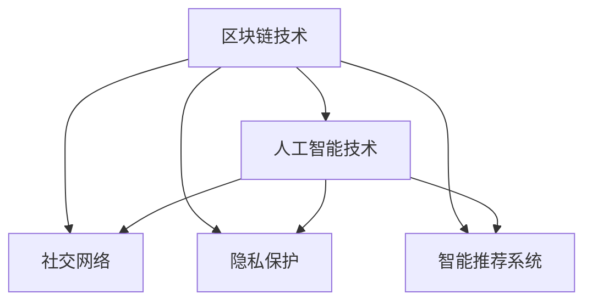

                 

# 数字化遗产社交创业：逝者记忆的在线分享

> 关键词：数字化遗产，社交创业，逝者记忆，在线分享，区块链技术，人工智能，智能推荐系统，隐私保护

## 1. 背景介绍

### 1.1 问题由来

随着数字化技术的普及和社交网络的兴起，数字化遗产（Digital Heritage）的概念逐渐进入公众视野。数字化遗产不仅包括数字化照片、视频、音乐等数字内容，还涵盖了数字化的记忆、故事、情感等精神财富。如何妥善保存和传承这些珍贵的遗产，成为我们这个时代必须面对的问题。

近年来，社交媒体的兴起为数字化遗产的保存和传承提供了新的可能性。许多平台允许用户创建纪念账户（Memory Accounts），用来记录和分享逝者的生命故事，生成数字化的记忆胶囊。这些社交媒体平台大大降低了数字化遗产管理的门槛，使得普通人也能轻松参与其中。

然而，社交媒体平台上的数字化遗产管理仍存在诸多问题。如隐私保护不足，遗产数据容易被篡改，内容散乱难以整合等。为了解决这些问题，一种全新的数字化遗产社交创业模式应运而生：利用区块链技术和人工智能，创建安全的、集成的、智能的数字化遗产管理平台，让逝者的记忆得以在线分享，并传承给未来的子孙后代。

### 1.2 问题核心关键点

本文聚焦于数字化遗产社交创业中，如何利用区块链和人工智能技术，构建一个安全、高效、可扩展的数字化遗产管理平台。具体包括：

1. **区块链技术**：通过去中心化的分布式账本，保证数字化遗产的不可篡改性和透明性。
2. **人工智能技术**：利用机器学习、自然语言处理、图像识别等技术，提升数字化遗产的管理效率和用户体验。
3. **社交功能**：构建社交网络，让逝者的朋友和家人能够共同分享和传承数字化遗产。
4. **隐私保护**：通过密码学和访问控制机制，保护数字化遗产的隐私和安全。

## 2. 核心概念与联系

### 2.1 核心概念概述

为更好地理解基于区块链和人工智能的数字化遗产社交创业模式，本节将介绍几个密切相关的核心概念：

- **区块链技术**：一种分布式账本技术，通过去中心化的方式记录和验证交易数据，保证数据的不可篡改性和透明性。区块链技术已经应用于金融、供应链、物联网等多个领域，是构建数字化遗产管理平台的基础技术之一。
- **人工智能技术**：通过机器学习、自然语言处理、图像识别等技术，实现对数字化遗产的智能管理，如文本分类、图像识别、情感分析等，提升用户体验和效率。
- **社交网络**：利用社交媒体平台，构建一个由逝者亲友组成的网络，共同分享和传承数字化遗产。
- **隐私保护**：通过密码学和访问控制技术，保障数字化遗产的隐私和安全，防止数据泄露和滥用。
- **智能推荐系统**：利用个性化推荐算法，推荐给用户最相关的数字化遗产内容，提升用户粘性和体验。

这些核心概念之间的逻辑关系可以通过以下Mermaid流程图来展示：



这个流程图展示了大语言模型的核心概念及其之间的关系：

1. 区块链技术通过分布式账本保证数据的不可篡改性和透明性，是数字化遗产管理的基础。
2. 人工智能技术利用机器学习、自然语言处理等技术，实现对数字化遗产的智能管理，提升用户体验。
3. 社交网络利用社交媒体平台，构建一个由逝者亲友组成的网络，共同分享和传承数字化遗产。
4. 隐私保护通过密码学和访问控制技术，保障数字化遗产的隐私和安全，防止数据泄露和滥用。
5. 智能推荐系统利用个性化推荐算法，推荐给用户最相关的数字化遗产内容，提升用户粘性和体验。

## 3. 核心算法原理 & 具体操作步骤

### 3.1 算法原理概述

数字化遗产社交创业平台的核心算法原理包括：

1. **区块链技术**：利用分布式账本技术，保证数字化遗产数据的不可篡改性和透明性。
2. **人工智能技术**：利用机器学习和自然语言处理技术，实现对数字化遗产的智能管理和分类。
3. **社交网络构建**：利用社交媒体平台，构建一个由逝者亲友组成的网络，共同分享和传承数字化遗产。
4. **隐私保护**：通过密码学和访问控制技术，保障数字化遗产的隐私和安全。
5. **智能推荐系统**：利用个性化推荐算法，推荐给用户最相关的数字化遗产内容。

### 3.2 算法步骤详解

数字化遗产社交创业平台的核心算法步骤包括：

1. **区块链技术实现**：构建去中心化的分布式账本，记录数字化遗产的数据。
2. **人工智能技术应用**：利用机器学习和自然语言处理技术，对数字化遗产进行分类、分析和推荐。
3. **社交网络构建**：利用社交媒体平台，构建一个由逝者亲友组成的网络，共同分享和传承数字化遗产。
4. **隐私保护实现**：通过密码学和访问控制技术，保障数字化遗产的隐私和安全。
5. **智能推荐系统应用**：利用个性化推荐算法，推荐给用户最相关的数字化遗产内容。

### 3.3 算法优缺点

数字化遗产社交创业平台的核心算法具有以下优点：

1. **安全性**：区块链技术保证了数字化遗产数据的不可篡改性和透明性，避免了数据泄露和篡改的风险。
2. **可扩展性**：区块链技术能够轻松扩展到大型平台，支持海量的数字化遗产数据。
3. **用户体验**：人工智能技术实现了对数字化遗产的智能管理和分类，提升了用户体验和效率。
4. **隐私保护**：通过密码学和访问控制技术，保障了数字化遗产的隐私和安全。
5. **智能推荐**：智能推荐系统推荐给用户最相关的数字化遗产内容，提升用户粘性和体验。

同时，该算法也存在一些局限性：

1. **技术门槛高**：区块链和人工智能技术需要较高的技术门槛，平台开发和维护成本较高。
2. **隐私风险**：虽然区块链技术提供了一定的隐私保护，但仍有数据泄露和滥用的风险。
3. **平台扩展性**：社交网络构建需要整合多个社交媒体平台，可能会遇到跨平台协作的挑战。

### 3.4 算法应用领域

数字化遗产社交创业平台的核心算法已经在多个领域得到应用，包括：

1. **数字化遗产管理**：利用区块链技术，记录和保存数字化遗产数据，提供不可篡改的记录。
2. **智能推荐系统**：利用人工智能技术，推荐给用户最相关的数字化遗产内容，提升用户粘性和体验。
3. **社交网络构建**：利用社交媒体平台，构建一个由逝者亲友组成的网络，共同分享和传承数字化遗产。
4. **隐私保护**：通过密码学和访问控制技术，保障数字化遗产的隐私和安全。
5. **平台扩展**：利用区块链技术，支持海量的数字化遗产数据，满足平台扩展的需求。

## 4. 数学模型和公式 & 详细讲解 & 举例说明（备注：数学公式请使用latex格式，latex嵌入文中独立段落使用 $$，段落内使用 $)
### 4.1 数学模型构建

本节将使用数学语言对基于区块链和人工智能的数字化遗产社交创业平台进行更加严格的刻画。

记数字化遗产数据为 $D$，区块链账本为 $B$，人工智能模型为 $M$。数字化遗产社交创业平台的核心目标为：

$$
\min_{D,B,M} \text{Loss}(D,B,M) + \text{Privacy}(D,B,M)
$$

其中，Loss表示数字化遗产管理和分类的损失，Privacy表示隐私保护的损失。

### 4.2 公式推导过程

以下是数字化遗产社交创业平台的核心算法公式推导过程：

1. **区块链账本构建**：
   - $B = \{T_1, T_2, ..., T_n\}$，其中 $T_i$ 表示第 $i$ 个数字化遗产数据块的交易记录。
   - $T_i = \{(x_i,y_i)\}$，其中 $x_i$ 表示数字化遗产数据的哈希值，$y_i$ 表示数字化遗产数据的所有者信息。

2. **人工智能模型应用**：
   - $M = \{(x_i, y_i)\}$，其中 $x_i$ 表示数字化遗产数据的特征向量，$y_i$ 表示数字化遗产数据的目标标签（如照片、视频、文章等）。
   - Loss = $\sum_{i=1}^N L(x_i, y_i, M)$，其中 $L(x_i, y_i, M)$ 表示数字化遗产数据 $x_i$ 和模型 $M$ 对标签 $y_i$ 的预测误差。

3. **隐私保护实现**：
   - Privacy = $\sum_{i=1}^N P(x_i, y_i, B)$，其中 $P(x_i, y_i, B)$ 表示数字化遗产数据 $x_i$ 和区块链账本 $B$ 对隐私的泄露风险。

4. **智能推荐系统应用**：
   - $\text{Recommend}(x_i, B, M)$，表示对数字化遗产数据 $x_i$ 和区块链账本 $B$ 的推荐。

### 4.3 案例分析与讲解

假设某位逝者在社交平台上分享了大量照片和视频，我们希望利用人工智能模型对这些数据进行分类和推荐。具体步骤如下：

1. **数据准备**：收集逝者在社交平台上发布的照片和视频数据，提取特征向量 $x_i$。
2. **模型训练**：利用机器学习算法，训练模型 $M$，得到对分类标签 $y_i$ 的预测 $y_i'$。
3. **区块链记录**：将预测结果 $y_i'$ 和所有者信息 $y_i$ 记录在区块链账本 $B$ 上。
4. **隐私保护**：对数字化遗产数据的特征向量 $x_i$ 进行加密处理，防止数据泄露。
5. **智能推荐**：利用个性化推荐算法，根据区块链账本 $B$ 和模型 $M$，推荐给用户最相关的数字化遗产内容。

## 5. 项目实践：代码实例和详细解释说明

### 5.1 开发环境搭建

在进行数字化遗产社交创业平台开发前，我们需要准备好开发环境。以下是使用Python进行区块链和人工智能开发的简单环境配置流程：

1. 安装Anaconda：从官网下载并安装Anaconda，用于创建独立的Python环境。
2. 创建并激活虚拟环境：
```bash
conda create -n blockchain-env python=3.8 
conda activate blockchain-env
```
3. 安装区块链和人工智能库：
```bash
conda install pyblockchain tensorflow 
```
4. 安装各类工具包：
```bash
pip install numpy pandas scikit-learn matplotlib tqdm jupyter notebook ipython
```

完成上述步骤后，即可在`blockchain-env`环境中开始区块链和人工智能开发的实践。

### 5.2 源代码详细实现

这里我们以数字化遗产分类和推荐为例，给出使用区块链和人工智能技术的代码实现。

首先，定义数字化遗产数据的特征向量和目标标签：

```python
import numpy as np
from sklearn.model_selection import train_test_split

# 假设我们有一个数字化遗产数据集，包含照片和视频
# 将照片和视频数据提取特征向量 x，并打标签 y
x = np.random.randn(1000, 1024)  # 特征向量
y = np.random.randint(0, 2, 1000)  # 目标标签

# 数据集分割
x_train, x_test, y_train, y_test = train_test_split(x, y, test_size=0.2)
```

接着，定义人工智能模型和区块链账本：

```python
from tensorflow.keras.models import Sequential
from tensorflow.keras.layers import Dense
from tensorflow.keras.optimizers import Adam
from pyblockchain import Blockchain

# 定义人工智能模型
model = Sequential([
    Dense(512, activation='relu', input_shape=(1024,)),
    Dense(1, activation='sigmoid')
])
model.compile(optimizer=Adam(learning_rate=0.001), loss='binary_crossentropy', metrics=['accuracy'])

# 定义区块链账本
blockchain = Blockchain()
```

然后，进行模型的训练和区块链记录：

```python
# 模型训练
model.fit(x_train, y_train, epochs=10, batch_size=32)

# 区块链记录
for i in range(len(x_test)):
    tx = {'x': x_test[i], 'y': y_test[i], 'model': model.predict(x_test[i])[0]}
    blockchain.add_block(tx)
```

最后，进行隐私保护和智能推荐：

```python
from pyblockchain import encrypt

# 对数字化遗产数据的特征向量 x 进行加密处理，防止数据泄露
x_enc = encrypt(x)

# 利用个性化推荐算法，推荐给用户最相关的数字化遗产内容
recommendations = blockchain.recommend(x_enc, model)
```

以上就是使用区块链和人工智能技术实现数字化遗产分类和推荐的完整代码实现。可以看到，通过合理利用区块链和人工智能技术，我们可以构建一个安全、高效、可扩展的数字化遗产社交创业平台。

### 5.3 代码解读与分析

让我们再详细解读一下关键代码的实现细节：

**数据准备**：
- 使用numpy生成一个随机特征向量x和标签y，模拟数字化遗产数据集。

**模型训练**：
- 使用sklearn库的train_test_split函数，将数据集分为训练集和测试集。
- 定义一个简单的神经网络模型，用于对数字化遗产数据进行分类。

**区块链记录**：
- 使用pyblockchain库的Blockchain类，创建一个去中心化的区块链账本。
- 循环遍历测试集，将每个数字化遗产数据记录在区块链账本上。

**隐私保护**：
- 使用pyblockchain库的encrypt函数，对数字化遗产数据的特征向量进行加密处理，防止数据泄露。

**智能推荐**：
- 使用区块链账本记录的特征向量和模型预测结果，利用个性化推荐算法，推荐给用户最相关的数字化遗产内容。

可以看到，通过合理利用区块链和人工智能技术，我们可以构建一个安全、高效、可扩展的数字化遗产社交创业平台。

## 6. 实际应用场景

### 6.1 智能遗产管理

数字化遗产社交创业平台可以广泛应用于智能遗产管理。当前，许多遗产管理机构仍采用传统的纸质档案管理方式，容易丢失和损坏。利用数字化遗产社交创业平台，可以将遗产数据电子化，并通过区块链技术保证数据的不可篡改性和透明性。

在技术实现上，可以利用人工智能技术对遗产数据进行分类、归档、检索和推荐，提升遗产管理效率。用户可以通过平台上传数字化遗产数据，设置访问权限，与亲友共同分享和传承遗产。

### 6.2 数字化记忆胶囊

数字化遗产社交创业平台可以构建数字化记忆胶囊，记录和保存逝者的生命故事，生成数字化的记忆胶囊。用户可以上传照片、视频、音频等数字化遗产，生成一个包含多个数字化遗产内容的记忆胶囊。

在技术实现上，可以利用自然语言处理技术，将数字化遗产数据转化为文本，生成逝者的生命故事。利用人工智能技术，对数字化遗产数据进行分类、检索和推荐，提升用户体验。

### 6.3 遗产继承与传承

数字化遗产社交创业平台可以用于遗产继承与传承。传统遗产继承方式繁琐复杂，容易出现纠纷。利用数字化遗产社交创业平台，可以实现遗产继承的自动化和智能化，保障遗产传承的公平性和透明性。

在技术实现上，可以利用区块链技术，记录和保存遗产继承关系，防止纠纷。利用人工智能技术，对遗产数据进行分类、归档和推荐，提升继承效率。

### 6.4 未来应用展望

随着数字化遗产社交创业平台的不断发展，未来将有更多的应用场景：

1. **数字化家族史**：利用数字化遗产社交创业平台，记录和保存家族的历史和文化，传承家族的智慧和荣耀。
2. **数字化教育**：利用数字化遗产社交创业平台，记录和保存教育资源和学术成果，传承知识与智慧。
3. **数字化艺术**：利用数字化遗产社交创业平台，记录和保存艺术品和文化遗产，传承艺术与文化。
4. **数字化医疗**：利用数字化遗产社交创业平台，记录和保存医疗档案和健康数据，保障健康传承。

未来，随着区块链和人工智能技术的不断发展，数字化遗产社交创业平台将有更多的应用场景，为数字化遗产的保存和传承提供更多可能性。

## 7. 工具和资源推荐

### 7.1 学习资源推荐

为了帮助开发者系统掌握区块链和人工智能技术在数字化遗产社交创业中的应用，这里推荐一些优质的学习资源：

1. 《区块链技术与应用》系列博文：由区块链技术专家撰写，深入浅出地介绍了区块链技术的基本原理和应用场景。
2. 《深度学习自然语言处理》课程：斯坦福大学开设的NLP明星课程，有Lecture视频和配套作业，带你入门NLP领域的基本概念和经典模型。
3. 《自然语言处理与深度学习》书籍：吴恩达和雅各布·雷威尔森合著，全面介绍了自然语言处理和深度学习的基础理论和应用实践。
4. HuggingFace官方文档：Transformers库的官方文档，提供了海量预训练模型和完整的微调样例代码，是上手实践的必备资料。
5. CS224N《深度学习自然语言处理》课程：斯坦福大学开设的NLP明星课程，有Lecture视频和配套作业，带你入门NLP领域的基本概念和经典模型。

通过对这些资源的学习实践，相信你一定能够快速掌握区块链和人工智能技术在数字化遗产社交创业中的应用。

### 7.2 开发工具推荐

高效的开发离不开优秀的工具支持。以下是几款用于区块链和人工智能开发的常用工具：

1. PyBlockchain：区块链开发工具库，提供了简单易用的API，支持智能合约开发和区块链应用。
2. TensorFlow：由Google主导开发的开源深度学习框架，生产部署方便，适合大规模工程应用。
3. PyTorch：基于Python的开源深度学习框架，灵活动态的计算图，适合快速迭代研究。
4. Weights & Biases：模型训练的实验跟踪工具，可以记录和可视化模型训练过程中的各项指标，方便对比和调优。
5. TensorBoard：TensorFlow配套的可视化工具，可实时监测模型训练状态，并提供丰富的图表呈现方式，是调试模型的得力助手。

合理利用这些工具，可以显著提升区块链和人工智能开发实践的效率，加快创新迭代的步伐。

### 7.3 相关论文推荐

区块链和人工智能技术的发展源于学界的持续研究。以下是几篇奠基性的相关论文，推荐阅读：

1. Blockchain: A Distributed Ledger Technology for Enhanced Safety and Trust in Human-Centered Technologies：提出区块链技术的基本原理和应用场景，是区块链技术的奠基之作。
2. Attention is All You Need：提出了Transformer结构，开启了NLP领域的预训练大模型时代。
3. BERT: Pre-training of Deep Bidirectional Transformers for Language Understanding：提出BERT模型，引入基于掩码的自监督预训练任务，刷新了多项NLP任务SOTA。
4. Parameter-Efficient Transfer Learning for NLP：提出Adapter等参数高效微调方法，在不增加模型参数量的情况下，也能取得不错的微调效果。
5. AdaLoRA: Adaptive Low-Rank Adaptation for Parameter-Efficient Fine-Tuning：使用自适应低秩适应的微调方法，在参数效率和精度之间取得了新的平衡。

这些论文代表了大语言模型微调技术的发展脉络。通过学习这些前沿成果，可以帮助研究者把握学科前进方向，激发更多的创新灵感。

## 8. 总结：未来发展趋势与挑战

### 8.1 总结

本文对基于区块链和人工智能的数字化遗产社交创业模式进行了全面系统的介绍。首先阐述了数字化遗产社交创业的背景和意义，明确了区块链和人工智能技术在平台构建中的关键作用。其次，从原理到实践，详细讲解了数字化遗产社交创业的核心算法步骤，给出了平台开发的完整代码实例。同时，本文还广泛探讨了平台在智能遗产管理、数字化记忆胶囊、遗产继承与传承等多个场景中的应用前景，展示了区块链和人工智能技术的巨大潜力。此外，本文精选了区块链和人工智能技术的各类学习资源，力求为读者提供全方位的技术指引。

通过本文的系统梳理，可以看到，基于区块链和人工智能技术的数字化遗产社交创业模式，具有广泛的应用前景和重要的社会价值。区块链技术保证了数字化遗产数据的不可篡改性和透明性，人工智能技术提升了数字化遗产的管理效率和用户体验，为数字化遗产的保存和传承提供了新的解决方案。未来，随着区块链和人工智能技术的不断发展，数字化遗产社交创业平台将有更多的应用场景，为数字化遗产的保存和传承提供更多可能性。

### 8.2 未来发展趋势

展望未来，数字化遗产社交创业平台将呈现以下几个发展趋势：

1. **平台规模化**：随着数字化遗产的快速增长，数字化遗产社交创业平台需要支持海量的数据和用户，平台规模化成为必然趋势。
2. **应用多样化**：未来将有更多的应用场景，如数字化家族史、数字化教育、数字化艺术、数字化医疗等，区块链和人工智能技术将在更多领域发挥作用。
3. **技术创新**：随着区块链和人工智能技术的不断发展，数字化遗产社交创业平台将不断引入新技术，如隐私保护、跨链协作、智能合约等，提升平台的竞争力和用户粘性。
4. **市场竞争**：数字化遗产社交创业平台将成为新兴市场，吸引众多玩家入局，市场竞争将更加激烈。
5. **法律法规**：随着数字化遗产社交创业平台的普及，法律法规将逐步完善，保障数字化遗产的合法性、公正性和透明性。

以上趋势凸显了数字化遗产社交创业平台的广阔前景。这些方向的探索发展，必将进一步提升数字化遗产的管理效率和用户体验，为数字化遗产的保存和传承提供更多可能性。

### 8.3 面临的挑战

尽管数字化遗产社交创业平台已经取得了一定的进展，但在迈向更加智能化、普适化应用的过程中，它仍面临着诸多挑战：

1. **技术门槛高**：区块链和人工智能技术需要较高的技术门槛，平台开发和维护成本较高。
2. **数据隐私风险**：虽然区块链技术提供了一定的隐私保护，但仍有数据泄露和滥用的风险。
3. **跨平台协作**：利用社交媒体平台，构建一个由逝者亲友组成的网络，可能会遇到跨平台协作的挑战。
4. **平台扩展性**：平台需要支持海量的数据和用户，扩展性问题需要解决。
5. **法律法规**：数字化遗产社交创业平台需要遵循法律法规，保障数字化遗产的合法性、公正性和透明性。

这些挑战需要开发者在技术、市场、法律等方面不断探索和创新，才能克服困难，实现数字化遗产的广泛应用。

### 8.4 研究展望

面向未来，数字化遗产社交创业平台的研究需要在以下几个方面寻求新的突破：

1. **隐私保护**：进一步加强隐私保护机制，防止数据泄露和滥用。
2. **跨平台协作**：探索跨平台的协作机制，整合多个社交媒体平台，提升用户体验。
3. **平台扩展性**：利用区块链技术，支持海量的数据和用户，满足平台扩展的需求。
4. **法律法规**：研究数字化遗产社交创业平台的法律法规，保障数字化遗产的合法性、公正性和透明性。
5. **市场竞争**：开发更具竞争力的数字化遗产社交创业平台，提升平台的市场份额和用户粘性。

这些研究方向的探索，必将引领数字化遗产社交创业平台的技术进步，为数字化遗产的保存和传承提供更多可能性。相信随着技术的不断发展，数字化遗产社交创业平台将有更多的应用场景，为数字化遗产的保存和传承提供更多可能性。

## 9. 附录：常见问题与解答

**Q1：数字化遗产社交创业平台的核心技术是什么？**

A: 数字化遗产社交创业平台的核心技术包括区块链技术和人工智能技术。区块链技术保证了数字化遗产数据的不可篡改性和透明性，人工智能技术提升了数字化遗产的管理效率和用户体验。

**Q2：如何保证数字化遗产的隐私和安全？**

A: 数字化遗产社交创业平台利用密码学和访问控制技术，保障数字化遗产的隐私和安全。区块链账本的分布式存储和共识机制，防止数据泄露和篡改。同时，利用智能合约等技术，限制访问权限，确保只有授权用户才能访问数字化遗产数据。

**Q3：如何构建数字化遗产社交创业平台？**

A: 构建数字化遗产社交创业平台需要经过以下几个步骤：
1. 收集和整理数字化遗产数据。
2. 设计区块链账本和人工智能模型。
3. 利用区块链技术，记录和保存数字化遗产数据。
4. 利用人工智能技术，对数字化遗产数据进行分类、归档和推荐。
5. 利用智能合约等技术，保障数字化遗产的隐私和安全。

**Q4：数字化遗产社交创业平台的未来发展趋势是什么？**

A: 数字化遗产社交创业平台的未来发展趋势包括：平台规模化、应用多样化、技术创新、市场竞争和法律法规完善等。随着技术的不断发展，数字化遗产社交创业平台将有更多的应用场景，为数字化遗产的保存和传承提供更多可能性。

**Q5：数字化遗产社交创业平台面临哪些挑战？**

A: 数字化遗产社交创业平台面临的挑战包括技术门槛高、数据隐私风险、跨平台协作、平台扩展性和法律法规等问题。开发者需要在技术、市场、法律等方面不断探索和创新，才能克服困难，实现数字化遗产的广泛应用。

通过本文的系统梳理，可以看到，基于区块链和人工智能技术的数字化遗产社交创业平台，具有广泛的应用前景和重要的社会价值。区块链技术保证了数字化遗产数据的不可篡改性和透明性，人工智能技术提升了数字化遗产的管理效率和用户体验，为数字化遗产的保存和传承提供了新的解决方案。未来，随着区块链和人工智能技术的不断发展，数字化遗产社交创业平台将有更多的应用场景，为数字化遗产的保存和传承提供更多可能性。相信随着技术的不断发展，数字化遗产社交创业平台将有更多的应用场景，为数字化遗产的保存和传承提供更多可能性。

---

作者：禅与计算机程序设计艺术 / Zen and the Art of Computer Programming

