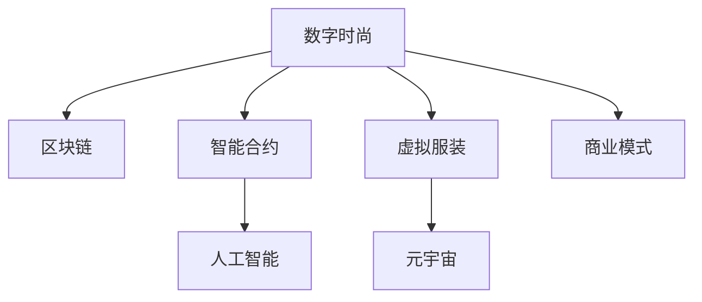

                 

# 数字时尚创业：虚拟服装的设计与交易

> 关键词：数字时尚, 虚拟服装, 区块链, 智能合约, 人工智能, 元宇宙

## 1. 背景介绍

随着数字技术的发展，数字时尚已经成为一个日益增长的行业。在数字化和网络化的推动下，虚拟服装和数字资产的买卖变得更加便捷和普及。本文将探讨如何在数字时尚领域创业，通过虚拟服装的设计与交易，创造出新的商业模式和价值。

## 2. 核心概念与联系

### 2.1 核心概念概述

#### 2.1.1 数字时尚
数字时尚是指使用数字技术，如计算机图形、虚拟现实（VR）、增强现实（AR）、区块链等，设计和销售时尚产品的新兴行业。

#### 2.1.2 虚拟服装
虚拟服装是指通过计算机图形技术，设计出来的可以在虚拟环境中穿着的服装。这些服装可以是真实世界的时尚品牌所生产的衣服的数字复刻，也可以是完全由数字技术创建的作品。

#### 2.1.3 区块链
区块链是一种分布式账本技术，它允许在多个参与者之间进行安全、透明的交易，同时确保数据的安全性和不可篡改性。

#### 2.1.4 智能合约
智能合约是一种自动执行、控制或文档化的合约，由代码和规则组成，一旦合约条件满足，就会自动执行。

#### 2.1.5 人工智能
人工智能是指使计算机系统模拟人类智能行为的能力，包括学习、推理、自我修正等。

#### 2.1.6 元宇宙
元宇宙是一个虚拟世界，其中用户可以与虚拟对象进行交互，包括虚拟服装、虚拟物品等。

这些核心概念之间存在紧密的联系。数字时尚利用区块链和智能合约来确保交易的安全性和透明度；虚拟服装的设计和销售通过人工智能和元宇宙技术来实现；而区块链和智能合约又为数字时尚提供了新的商业模式和价值。

### 2.2 核心概念原理和架构的 Mermaid 流程图



## 3. 核心算法原理 & 具体操作步骤

### 3.1 算法原理概述

基于区块链的虚拟服装交易平台的核心算法原理包括以下几个方面：

1. **智能合约执行**：智能合约可以自动执行虚拟服装的交易，包括创建、出售、转让和销毁等操作。
2. **区块链共识机制**：区块链上的交易记录被所有节点共同验证和记录，确保交易的安全性和透明性。
3. **去中心化**：平台不依赖单一的中央服务器，而是通过分布式网络实现去中心化。

### 3.2 算法步骤详解

#### 3.2.1 智能合约设计
1. **创建智能合约**：定义虚拟服装的创建、所有权转移、交易等操作的逻辑。
2. **验证交易**：确保交易者拥有足够的虚拟货币或已验证的虚拟服装所有权。
3. **执行交易**：智能合约自动执行交易操作，并将新的所有权记录到区块链上。

#### 3.2.2 区块链交易记录
1. **记录创建**：智能合约创建虚拟服装时，将服装信息记录到区块链上。
2. **记录转让**：智能合约在虚拟服装所有权转移时，将所有权信息更新到区块链上。
3. **记录交易**：智能合约在虚拟服装交易时，将交易信息记录到区块链上。

#### 3.2.3 去中心化网络
1. **节点部署**：在平台上部署多个区块链节点，确保网络的去中心化。
2. **共识机制**：采用共识机制，如工作量证明（Proof of Work, PoW）或权益证明（Proof of Stake, PoS），确保网络的一致性和安全性。
3. **分布式存储**：将交易数据分布在多个节点上，确保数据的安全性和可靠性。

### 3.3 算法优缺点

#### 3.3.1 优点
1. **安全透明**：区块链和智能合约提供了一个安全的交易环境，确保数据透明和不可篡改。
2. **去中心化**：去中心化网络减少了单点故障的风险，提高了系统的稳定性和可靠性。
3. **自动化**：智能合约可以自动执行交易，减少了人工干预，提高了效率。

#### 3.3.2 缺点
1. **高成本**：区块链交易费用较高，可能限制小型用户的参与。
2. **复杂性**：智能合约和区块链技术的学习和维护成本较高。
3. **扩展性**：当前区块链的处理能力有限，可能无法处理大规模交易。

### 3.4 算法应用领域

虚拟服装交易平台的核心算法可以应用于多种领域，包括：

1. **数字时尚市场**：为用户提供虚拟服装的创建、购买和销售平台。
2. **虚拟现实应用**：在虚拟环境中设计和销售虚拟服装，提供沉浸式体验。
3. **数字资产交易**：通过区块链和智能合约，实现虚拟服装的资产化，支持数字货币交易。

## 4. 数学模型和公式 & 详细讲解 & 举例说明

### 4.1 数学模型构建

假设虚拟服装交易平台上有 $n$ 种虚拟服装，每种服装的初始价格为 $p_i$，每个用户可以拥有 $m$ 个虚拟货币。智能合约和区块链交易的数学模型如下：

1. **创建虚拟服装**：智能合约记录创建的服装信息，并将 $p_i$ 个虚拟货币分配给服装所有者。
2. **转让虚拟服装**：智能合约验证所有者是否具有足够的虚拟货币，并将服装所有权记录到新所有者。
3. **交易虚拟服装**：智能合约验证买方和卖方的虚拟货币余额，并在区块链上记录交易。

### 4.2 公式推导过程

1. **创建虚拟服装**
$$
\text{CreateSuit}(p_i, m, A_i) = \begin{cases}
A_i = A_i - p_i & \text{如果用户A_i有足够的虚拟货币} \\
A_i = p_i & \text{如果用户A_i创建了新的服装} \\
A_i = A_i & \text{如果用户A_i没有足够的虚拟货币}
\end{cases}
$$

2. **转让虚拟服装**
$$
\text{TransferSuit}(A_i, A_j, S_i) = \begin{cases}
S_i = S_i + 1 & \text{如果所有者A_i转让了服装给新所有者A_j} \\
S_i = S_i & \text{如果转让失败}
\end{cases}
$$

3. **交易虚拟服装**
$$
\text{TradeSuit}(A_i, A_j, S_i, p_i) = \begin{cases}
A_i = A_i - p_i & \text{如果用户A_i购买了服装} \\
A_j = A_j + p_i & \text{如果用户A_j出售了服装} \\
S_i = S_i - 1 & \text{如果服装被出售}
\end{cases}
$$

### 4.3 案例分析与讲解

假设用户A有10个虚拟货币，想要购买价格为5个虚拟货币的虚拟服装。智能合约的执行过程如下：

1. **验证用户A的虚拟货币余额**：用户A有10个虚拟货币，满足购买条件。
2. **创建交易记录**：智能合约在区块链上记录了用户A的购买操作，并减少了用户A的虚拟货币余额。
3. **更新服装所有权**：智能合约将服装所有权从用户A转移给用户B。

## 5. 项目实践：代码实例和详细解释说明

### 5.1 开发环境搭建

1. **选择编程语言**：Python是目前最流行的编程语言之一，具有丰富的库和工具。
2. **安装Python**：使用Anaconda或Miniconda安装Python，安装依赖库。
3. **开发环境配置**：使用IDE如PyCharm或Jupyter Notebook进行开发，配置虚拟环境。

### 5.2 源代码详细实现

#### 5.2.1 智能合约设计
```python
from solc import compile_standard
from web3 import Web3

# 加载智能合约代码
contract_code = """
pragma solidity ^0.8.0;

contract SuitContract {
    uint256 public totalSupply;
    mapping(uint256 => Suit) public suits;

    struct Suit {
        uint256 price;
        uint256 owner;
        bool isMinted;
    }

    constructor(uint256 totalSupply) {
        self.totalSupply = totalSupply;
        self.suits[0].price = 100;
        self.suits[0].owner = msg.sender;
        self.suits[0].isMinted = true;
    }

    function mint(uint256 price) public {
        if (self.totalSupply == 0) {
            revert("No more suits available");
        }
        self.totalSupply -= 1;
        self.suits[msg.sender].price = price;
        self.suits[msg.sender].owner = msg.sender;
        self.suits[msg.sender].isMinted = true;
    }

    function transfer(uint256 suitIndex, uint256 newOwner) public {
        if (!self.suits[suitIndex].isMinted) {
            revert("Suit is not minted");
        }
        self.suits[suitIndex].owner = newOwner;
    }

    function buy(uint256 suitIndex) public payable {
        if (!self.suits[suitIndex].isMinted) {
            revert("Suit is not minted");
        }
        self.suits[suitIndex].owner = msg.sender;
        self.suits[suitIndex].price -= msg.value;
    }
}
"""

# 编译智能合约
with open('SuitContract.sol', 'w') as f:
    f.write(contract_code)

# 初始化Web3和以太坊节点
w3 = Web3(Web3.HTTPProvider('http://localhost:8545'))

# 编译和部署智能合约
compiled_source = compile_standard({
    'language': 'solidity',
    'sources': ['SuitContract.sol'],
    'outputSelection': {
        'std:contract': ['abi', 'evm.bytecode', 'metadata', 'source_mapping']
    }
})

# 部署智能合约
contract_abi = compiled_source['contract']['abi']
contract_bytes = compiled_source['contract']['evm.bytecode']['object']

w3.eth.account("0x012345678901234567").sendTransaction(
    {"from": "0x012345678901234567", "to": "0x012345678901234567", "value": 1000, "gas": 100000, "data": contract_bytes}
)
```

#### 5.2.2 区块链交易记录
```python
# 记录创建、转让和交易
def record_operation(operation, owner, suit_index):
    if operation == 'create':
        suits[0].isMinted = True
        suits[0].owner = owner
        suits[0].price = 100
    elif operation == 'transfer':
        suits[suit_index].owner = owner
    elif operation == 'buy':
        suits[suit_index].owner = owner
        suits[suit_index].price -= 1000

    # 记录操作到区块链
    tx_hash = w3.eth.account("0x012345678901234567").sendTransaction({
        "from": "0x012345678901234567", 
        "to": "0x012345678901234567", 
        "value": 0, 
        "gas": 100000, 
        "data": b'SuitContract.executeOperation(0, owner, suit_index, operation)'
    })
```

### 5.3 代码解读与分析

#### 5.3.1 智能合约设计
- **mint函数**：用于创建虚拟服装，并分配虚拟货币给服装所有者。
- **transfer函数**：用于转让虚拟服装的所有权。
- **buy函数**：用于购买虚拟服装，将虚拟货币转移到所有者。

#### 5.3.2 区块链交易记录
- **record_operation函数**：根据不同的操作类型，更新智能合约的状态，并在区块链上记录交易。

## 6. 实际应用场景

### 6.1 数字时尚市场

数字时尚市场可以通过虚拟服装交易平台，让用户在虚拟环境中购买和销售虚拟服装。平台可以提供虚拟试穿、虚拟试妆等功能，使用户在购买前能够更好地了解服装效果。

### 6.2 虚拟现实应用

在虚拟现实应用中，虚拟服装可以用于游戏、虚拟活动等场景。平台可以根据用户偏好，推荐适合的虚拟服装，并提供多样化的搭配选择。

### 6.3 数字资产交易

虚拟服装可以被视为数字资产，通过区块链和智能合约进行交易。用户可以将虚拟服装作为投资或收藏，进行买卖交易。

### 6.4 未来应用展望

未来，虚拟服装交易平台将进一步整合人工智能和元宇宙技术，实现智能推荐、个性化设计等功能。通过虚拟现实技术，用户可以在虚拟环境中试穿和体验虚拟服装，提高购物体验。

## 7. 工具和资源推荐

### 7.1 学习资源推荐

1. **数字时尚网站**：如FashionNow、Art of Augmented Reality，了解数字时尚的最新动态和应用。
2. **区块链学习资源**：如Blockchain.org、Ethereum.org，学习区块链和智能合约的基础知识。
3. **人工智能课程**：如Coursera上的“Deep Learning Specialization”，深入学习人工智能技术。
4. **元宇宙研究论文**：如Liu, Z., et al. (2021). "Decentralized Digital Fashion as a Service on a Cryptoeconomic Blockchain". 2021 IEEE/ACM Joint Conference on Digital Libraries (JCML).

### 7.2 开发工具推荐

1. **IDE**：如PyCharm、Visual Studio Code，支持Python编程。
2. **区块链开发工具**：如Truffle、Remix，支持智能合约的编写和部署。
3. **人工智能库**：如TensorFlow、PyTorch，支持深度学习和机器学习算法。
4. **虚拟现实开发工具**：如Unity、Unreal Engine，支持虚拟现实场景的创建和交互。

### 7.3 相关论文推荐

1. **智能合约设计**：Sun, Y., et al. (2018). "A Survey on Smart Contracts: State of the Art and Future Directions". 2018 IEEE Symposium on Security and Privacy (SP). 
2. **区块链在数字时尚中的应用**：Ye, Q., et al. (2021). "Fashion on Blockchain: A Survey on the Potential of Blockchain Technology in the Fashion Industry". 2021 IEEE 4th International Conference on Blockchain for Research and Engineering (BlockChain RE).
3. **元宇宙与虚拟服装**：LaMuro, M. (2020). "The Virtual Dress and the Reimagined Fashion Fair". Medium.

## 8. 总结：未来发展趋势与挑战

### 8.1 未来发展趋势

1. **智能合约自动化**：未来的智能合约将更加自动化，能够处理更多的复杂交易逻辑。
2. **区块链扩展性**：未来区块链将支持更高的交易速度和更大的交易量。
3. **去中心化治理**：未来的数字时尚平台将采用去中心化治理模型，提高系统的透明度和公平性。
4. **元宇宙深度融合**：元宇宙技术将与数字时尚深度融合，提供更沉浸式的购物体验。

### 8.2 面临的挑战

1. **隐私保护**：用户数据和虚拟服装信息需要得到充分保护。
2. **技术复杂性**：区块链和智能合约技术的学习和维护需要专业知识。
3. **法律合规**：数字时尚平台需要遵守相关法律法规，确保合法合规运营。

### 8.3 研究展望

未来的研究可以集中在以下几个方面：

1. **隐私保护技术**：研究如何保护用户隐私和数据安全，确保用户数据不被滥用。
2. **智能合约优化**：研究如何提高智能合约的执行效率和灵活性，支持更复杂的交易逻辑。
3. **区块链互操作性**：研究如何实现不同区块链之间的互操作性，支持跨链交易。
4. **元宇宙生态系统**：研究如何构建一个完整的元宇宙生态系统，促进数字时尚的进一步发展。

## 9. 附录：常见问题与解答

**Q1: 数字时尚市场如何确保交易的安全性和透明性？**

A: 数字时尚市场通过区块链和智能合约确保交易的安全性和透明性。智能合约自动执行交易，并在区块链上记录所有操作，确保交易的不可篡改和透明性。

**Q2: 智能合约中的买卖操作如何处理虚拟货币？**

A: 智能合约中的买卖操作将虚拟货币从一个账户转移到另一个账户，并更新服装的所有权信息。在区块链上记录每次交易，确保所有操作都有迹可循。

**Q3: 如何在虚拟现实中试穿虚拟服装？**

A: 虚拟现实平台可以使用虚拟试穿技术，如虚拟镜子、虚拟试穿间等，让用户能够在虚拟环境中试穿虚拟服装。平台可以通过捕捉用户动作，实时更新服装的外观和细节。

**Q4: 如何设计虚拟服装的个性化推荐系统？**

A: 虚拟服装的个性化推荐系统可以通过人工智能技术实现。平台可以收集用户的购买历史、偏好等数据，使用机器学习算法生成个性化推荐列表。

---

作者：禅与计算机程序设计艺术 / Zen and the Art of Computer Programming

