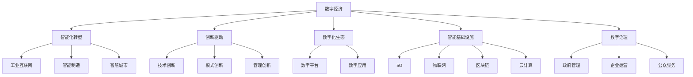

                 

# 数字经济：社会发展的助推器

> 关键词：数字经济, 社会变革, 智能化转型, 创新驱动, 数字化生态, 智能基础设施, 数字治理

## 1. 背景介绍

### 1.1 问题由来

数字经济作为21世纪经济发展的全新形态，已经成为全球各国竞争的重要战场。特别是在新冠疫情的冲击下，全球经济受到重创，而数字经济凭借其高度的弹性、韧性和创新能力，迅速成为复苏和增长的主要引擎。近年来，我国数字经济规模持续快速增长，已占GDP的约40%，成为经济增长的重要动力。

然而，数字经济发展的过程中，也面临着诸多挑战和问题。例如，如何在确保数据安全、隐私保护的前提下，推动数字经济的健康发展？如何在打破数字鸿沟的同时，促进数字包容和共享？如何在保护竞争公平的同时，鼓励创新和竞争？这些问题需要我们从多角度、多层次进行深入思考和解决。

## 2. 核心概念与联系

### 2.1 核心概念概述

为了更好地理解数字经济的核心概念及其相互关系，本节将从宏观经济视角、微观技术视角以及社会治理视角，介绍几个关键概念：

- **数字经济**：以数字技术为核心，通过数字资源的整合与共享，创造新价值和增长点的经济形态。包括电子信息、通信、大数据、云计算、人工智能等多个领域。

- **智能化转型**：传统经济向数字经济的转变，涉及工业互联网、智能制造、智慧城市等多个层面，依托数字技术驱动的产业升级和创新。

- **创新驱动**：强调通过技术创新、模式创新、管理创新等，不断推动数字经济的发展和进步，实现新旧动能转换，构建新发展格局。

- **数字化生态**：构建由数字技术、数字平台、数字应用等多维度要素构成的数字环境，实现各要素的协同发展和生态化治理。

- **智能基础设施**：包括5G、物联网、区块链、云计算等新型基础设施，支撑数字经济的稳定运行和创新发展。

- **数字治理**：运用数字技术手段，提高社会治理的智能化、精准化水平，优化政府、企业、公众间的互动和协同。

这些核心概念通过以下Mermaid流程图进行联系和展示：



这个流程图展示了数字经济、智能化转型、创新驱动、数字化生态、智能基础设施和数字治理之间的关系，及其对各个领域的具体影响。

## 3. 核心算法原理 & 具体操作步骤

### 3.1 算法原理概述

数字经济的核心在于利用数字化技术，如云计算、大数据、人工智能等，实现数据资源的有效整合和共享，从而创造新的价值和增长点。其基本算法原理主要包括：

1. **数据采集与整合**：通过物联网、5G、云计算等技术，收集和整合海量数据资源，为数字经济提供数据基础。

2. **数据分析与挖掘**：应用大数据分析、机器学习等技术，对数据进行深度挖掘和分析，提取有价值的信息和洞察。

3. **模型训练与优化**：利用人工智能算法，如神经网络、集成学习等，训练和优化模型，提升数据处理和预测的准确性。

4. **平台构建与应用**：基于数据和模型，构建各种数字平台和应用，实现数据的协同共享和应用创新。

### 3.2 算法步骤详解

数字经济的发展和应用，通常遵循以下步骤：

**Step 1: 数据收集与清洗**
- 通过物联网、5G、传感器等技术，从不同渠道收集原始数据。
- 对数据进行去重、去噪、标准化等预处理，确保数据质量。

**Step 2: 数据存储与管理**
- 使用云存储技术，将数据集中存储在云端，确保数据的高效访问和备份。
- 构建数据管理平台，实现数据的分类、索引、权限控制等。

**Step 3: 数据处理与分析**
- 应用大数据处理技术，如Hadoop、Spark等，对数据进行分布式处理。
- 利用数据挖掘和机器学习算法，对数据进行深度分析，提取有用信息和洞察。

**Step 4: 模型训练与优化**
- 选择合适的模型算法，如神经网络、集成学习等，训练和优化模型。
- 使用交叉验证等技术，评估模型性能，进行参数调整。

**Step 5: 平台构建与应用**
- 基于数据和模型，构建各种数字平台和应用，如电子商务、在线教育、智慧城市等。
- 通过API等接口，实现数据的开放共享和应用创新。

**Step 6: 数据安全与隐私保护**
- 应用数据加密、匿名化等技术，保护数据安全和隐私。
- 构建安全防护机制，防范数据泄露和攻击。

### 3.3 算法优缺点

数字经济的应用在带来巨大商业价值和社会效益的同时，也存在一些显著缺点：

**优点**：
1. 高效率：数字技术可以快速处理和分析大量数据，提升决策和运营效率。
2. 低成本：通过数字化转型，企业可以显著降低运营成本，提高利润率。
3. 创新性：数字技术催生了诸多新业态和新模式，推动经济创新发展。
4. 普惠性：数字经济的发展惠及更多中小企业和普通消费者，促进公平竞争。

**缺点**：
1. 数据安全：海量数据收集和处理过程中，存在数据泄露和隐私风险。
2. 技术依赖：过度依赖数字技术可能带来系统性风险和脆弱性。
3. 就业冲击：自动化和智能化可能导致部分岗位的消失，影响就业市场。
4. 公平性：数字化转型可能加剧数字鸿沟，加剧社会不平等。

### 3.4 算法应用领域

数字经济的应用领域广泛，涵盖多个行业和领域：

- **工业互联网**：通过云计算、物联网、人工智能等技术，实现工业生产的高效化和智能化。
- **智能制造**：运用数字技术，提升制造过程的自动化、定制化和智能化水平。
- **智慧城市**：构建基于数据的城市管理平台，提升城市治理和服务的智能化水平。
- **在线教育**：通过数字化技术，实现教育的普惠化和个性化。
- **金融科技**：利用大数据、区块链等技术，创新金融服务和产品，提升金融服务的智能化和安全性。
- **电子商务**：依托数字平台，实现商品和服务的在线交易和物流管理。

以上这些应用领域，都为数字经济的发展提供了广阔的空间和机会。

## 4. 数学模型和公式 & 详细讲解 & 举例说明

### 4.1 数学模型构建

数字经济的核心在于数据资源的有效整合和共享。因此，数学模型构建需要从数据的采集、存储、处理、分析等多个方面进行设计和实现。以下是一个简化的数学模型构建框架：

**数据采集模型**：
- 目标：从不同渠道收集原始数据。
- 输入：数据类型、数据来源、数据频率等。
- 输出：原始数据集。

**数据存储模型**：
- 目标：集中存储和管理数据。
- 输入：原始数据集。
- 输出：数据存储平台、数据索引、数据权限等。

**数据处理模型**：
- 目标：对数据进行清洗、去重、去噪、标准化等预处理。
- 输入：原始数据集。
- 输出：清洗后的数据集。

**数据分析模型**：
- 目标：对数据进行深度挖掘和分析。
- 输入：清洗后的数据集。
- 输出：分析结果、洞察信息等。

**模型训练模型**：
- 目标：训练和优化机器学习模型。
- 输入：分析结果、训练数据、训练算法等。
- 输出：优化后的模型。

### 4.2 公式推导过程

以数据处理模型为例，对数据预处理的基本步骤进行数学建模：

**数据清洗公式**：
$$
\text{cleaned\_data} = \text{original\_data} \rightarrow \{\text{去重}, \text{去噪}, \text{标准化}\}
$$

**数据去重公式**：
$$
\text{cleaned\_data} = \text{original\_data} \cup \text{unique\_data}
$$

**数据去噪公式**：
$$
\text{cleaned\_data} = \text{original\_data} - \text{noisy\_data}
$$

**数据标准化公式**：
$$
\text{normalized\_data} = \frac{\text{cleaned\_data} - \text{mean}}{\text{std}}
$$

### 4.3 案例分析与讲解

以智能制造中的生产计划优化为例，分析数字技术的应用：

**问题描述**：
某制造企业需要优化其生产计划，以提高生产效率和资源利用率。

**数据采集**：
- 从ERP系统、MES系统、生产设备等渠道，收集生产数据、设备状态、订单信息等。

**数据存储与管理**：
- 使用云存储平台，集中存储和处理这些数据。
- 构建数据管理平台，实现数据的分类、索引、权限控制等。

**数据分析与挖掘**：
- 应用大数据处理技术，如Hadoop、Spark等，对数据进行分布式处理。
- 利用机器学习算法，如回归分析、聚类分析等，提取生产效率和资源利用率的关键影响因素。

**模型训练与优化**：
- 选择合适的算法，如支持向量机、随机森林等，训练和优化生产计划优化模型。
- 使用交叉验证等技术，评估模型性能，进行参数调整。

**平台构建与应用**：
- 构建智能制造平台，集成生产数据、模型算法、可视化工具等。
- 通过API等接口，实现数据共享和应用创新。

## 5. 项目实践：代码实例和详细解释说明

### 5.1 开发环境搭建

在进行数字经济项目开发前，需要先搭建好开发环境。以下是使用Python进行PyTorch开发的环境配置流程：

1. 安装Anaconda：从官网下载并安装Anaconda，用于创建独立的Python环境。

2. 创建并激活虚拟环境：
```bash
conda create -n pytorch-env python=3.8 
conda activate pytorch-env
```

3. 安装PyTorch：根据CUDA版本，从官网获取对应的安装命令。例如：
```bash
conda install pytorch torchvision torchaudio cudatoolkit=11.1 -c pytorch -c conda-forge
```

4. 安装TensorFlow：由Google主导开发的开源深度学习框架，生产部署方便，适合大规模工程应用。同样有丰富的预训练语言模型资源。

5. 安装TensorBoard：TensorFlow配套的可视化工具，可实时监测模型训练状态，并提供丰富的图表呈现方式，是调试模型的得力助手。

6. 安装Weights & Biases：模型训练的实验跟踪工具，可以记录和可视化模型训练过程中的各项指标，方便对比和调优。

完成上述步骤后，即可在`pytorch-env`环境中开始数字经济项目开发。

### 5.2 源代码详细实现

这里我们以智能制造的生产计划优化为例，给出使用PyTorch进行数字经济项目开发的PyTorch代码实现。

首先，定义生产计划优化的数据处理函数：

```python
import pandas as pd
import numpy as np
from sklearn.preprocessing import StandardScaler
from sklearn.decomposition import PCA

def preprocess_data(data):
    # 数据清洗：去重、去噪、标准化
    cleaned_data = data.drop_duplicates().replace('', np.nan).dropna()
    normalized_data = (cleaned_data - cleaned_data.mean()) / cleaned_data.std()
    # 特征选择：选择与生产效率和资源利用率相关的关键特征
    selected_features = ['feature1', 'feature2', 'feature3']
    selected_data = normalized_data[selected_features]
    # 数据降维：使用PCA进行特征降维
    pca = PCA(n_components=2)
    pca_data = pca.fit_transform(selected_data)
    return pca_data
```

然后，定义模型训练函数：

```python
from sklearn.linear_model import LinearRegression
from sklearn.model_selection import train_test_split

def train_model(X, y):
    # 划分训练集和验证集
    X_train, X_valid, y_train, y_valid = train_test_split(X, y, test_size=0.2, random_state=42)
    # 训练线性回归模型
    model = LinearRegression()
    model.fit(X_train, y_train)
    # 评估模型性能
    mse_train = model.score(X_train, y_train)
    mse_valid = model.score(X_valid, y_valid)
    return model, mse_train, mse_valid
```

接着，定义主函数，进行项目实践：

```python
# 加载生产数据
data = pd.read_csv('production_data.csv')
# 数据预处理
X = preprocess_data(data)
y = data['production_efficiency'].values
# 模型训练
model, mse_train, mse_valid = train_model(X, y)
# 模型评估
print(f'训练集MSE: {mse_train:.3f}')
print(f'验证集MSE: {mse_valid:.3f}')
# 预测生产效率
X_test = preprocess_data(pd.read_csv('test_data.csv'))
y_pred = model.predict(X_test)
print(f'测试集生产效率预测结果: {y_pred}')
```

以上就是使用PyTorch进行智能制造生产计划优化的完整代码实现。可以看到，通过数据预处理和机器学习算法，可以有效优化生产计划，提高生产效率和资源利用率。

### 5.3 代码解读与分析

让我们再详细解读一下关键代码的实现细节：

**preprocess_data函数**：
- 首先，对原始数据进行清洗，去重、去噪、标准化，确保数据质量。
- 然后，选择与生产效率和资源利用率相关的关键特征，进行特征选择。
- 最后，使用PCA进行特征降维，减少计算复杂度。

**train_model函数**：
- 使用sklearn的train_test_split方法，将数据集划分为训练集和验证集。
- 训练线性回归模型，并计算训练集和验证集的MSE。
- 返回训练好的模型和MSE值，方便后续评估和预测。

**主函数**：
- 加载原始生产数据，进行数据预处理和模型训练。
- 计算训练集和验证集的MSE，评估模型性能。
- 使用训练好的模型对测试集进行预测，输出生产效率预测结果。

这些代码展示了从数据处理到模型训练的全流程，有助于理解数字经济项目开发的基本框架和方法。

## 6. 实际应用场景

### 6.1 智能制造

智能制造是数字经济的重要应用领域之一。通过数字化技术和数据分析，智能制造可以实现生产过程的自动化、智能化和精细化管理。

**实际应用**：
某智能制造企业通过数据采集、存储、处理、分析等技术手段，实现了生产计划的优化和生产效率的提升。具体应用场景包括：
- 实时监测生产设备状态，预测设备故障和维护需求。
- 根据订单信息和库存数据，优化生产计划和物料管理。
- 利用数据分析技术，发现生产流程中的瓶颈和改进点。
- 通过可视化工具，实时监控生产过程和运营指标。

**技术实现**：
- 数据采集：通过物联网和传感器设备，收集生产设备的运行数据、订单信息、库存数据等。
- 数据处理：使用Python和PyTorch等工具，对数据进行清洗、去重、标准化、降维等预处理。
- 数据分析：应用机器学习和深度学习算法，进行生产效率和资源利用率的关键影响因素分析。
- 模型训练：利用训练好的模型，优化生产计划和物料管理。
- 平台构建：通过API接口，实现数据共享和应用创新。

### 6.2 智慧城市

智慧城市是数字经济的另一重要应用领域。通过数字化技术和数据分析，智慧城市可以实现城市治理的智能化、精准化和协同化管理。

**实际应用**：
某智慧城市通过数据采集、存储、处理、分析等技术手段，实现了城市管理的智能化和协同化。具体应用场景包括：
- 实时监测城市交通流量，优化交通信号和路线规划。
- 利用数据分析技术，发现城市公共服务的短板和改进点。
- 通过可视化工具，实时监控城市运行和应急情况。
- 利用智能基础设施，提高城市治理的效率和质量。

**技术实现**：
- 数据采集：通过传感器、摄像头、RFID等技术，收集城市交通、环境、公共服务等信息。
- 数据处理：使用Python和PyTorch等工具，对数据进行清洗、去重、标准化、降维等预处理。
- 数据分析：应用机器学习和深度学习算法，进行城市运行和公共服务的分析评估。
- 模型训练：利用训练好的模型，优化城市交通和公共服务。
- 平台构建：通过API接口，实现数据共享和应用创新。

### 6.3 金融科技

金融科技是数字经济的另一个重要应用领域。通过数字化技术和数据分析，金融科技可以实现金融服务的智能化和创新化。

**实际应用**：
某金融科技公司通过数据采集、存储、处理、分析等技术手段，实现了金融服务的智能化和创新化。具体应用场景包括：
- 实时监测市场动态，提供实时金融信息服务。
- 利用数据分析技术，发现市场趋势和投资机会。
- 通过可视化工具，实时监控市场和风险。
- 利用智能算法，提升金融产品的定制化和精准化。

**技术实现**：
- 数据采集：通过金融市场、新闻、社交媒体等渠道，收集市场数据、新闻资讯、社交情绪等信息。
- 数据处理：使用Python和PyTorch等工具，对数据进行清洗、去重、标准化、降维等预处理。
- 数据分析：应用机器学习和深度学习算法，进行市场趋势和投资机会的预测分析。
- 模型训练：利用训练好的模型，优化金融产品和服务。
- 平台构建：通过API接口，实现数据共享和应用创新。

## 7. 工具和资源推荐

### 7.1 学习资源推荐

为了帮助开发者系统掌握数字经济的核心概念和实践技巧，这里推荐一些优质的学习资源：

1. 《数字经济概论》书籍：详细介绍了数字经济的基本概念、发展历程、应用场景等，是理解数字经济的基础读物。
2. 《智能制造》课程：由工业互联网领域专家讲授，深入浅出地介绍了智能制造的原理、技术和应用。
3. 《智慧城市》课程：由城市治理专家讲授，涵盖智慧城市的各个方面，包括智能交通、智慧医疗、智慧教育等。
4. 《金融科技》课程：由金融科技领域的专家讲授，介绍金融科技的原理、技术和应用，涵盖金融服务、区块链、数字货币等。
5. 《Python深度学习》书籍：由深度学习领域的专家撰写，深入浅出地介绍了Python和深度学习的原理、技术和应用。
6. 《数据科学》课程：由数据科学领域的专家讲授，涵盖数据采集、数据处理、数据分析、机器学习等各个环节。

通过对这些资源的学习实践，相信你一定能够快速掌握数字经济的核心概念和实践技巧，并用于解决实际的数字经济问题。

### 7.2 开发工具推荐

高效的开发离不开优秀的工具支持。以下是几款用于数字经济开发常用的工具：

1. Python：作为数字经济开发的主要编程语言，Python以其易读易写、库丰富等优势，成为数据处理、数据分析、模型训练等环节的得力助手。
2. PyTorch：基于Python的深度学习框架，支持动态计算图、GPU加速、自动化微分等特性，适合进行复杂模型训练。
3. TensorFlow：由Google主导开发的深度学习框架，支持分布式计算、GPU加速、可视化分析等特性，适合进行大规模模型训练和部署。
4. Jupyter Notebook：基于Python的交互式开发环境，支持代码编写、数据可视化、模型训练等环节，适合进行实验和开发。
5. Weights & Biases：模型训练的实验跟踪工具，可以记录和可视化模型训练过程中的各项指标，方便对比和调优。
6. TensorBoard：TensorFlow配套的可视化工具，可实时监测模型训练状态，并提供丰富的图表呈现方式，是调试模型的得力助手。

合理利用这些工具，可以显著提升数字经济项目开发效率，加快创新迭代的步伐。

### 7.3 相关论文推荐

数字经济的发展离不开学界的持续研究。以下是几篇奠基性的相关论文，推荐阅读：

1. "The Digital Transformation: Opportunities and Challenges"：详细分析了数字转型的机遇和挑战，探讨了企业如何利用数字化技术提升竞争力。
2. "Smart Manufacturing: Trends and Technologies"：介绍了智能制造的最新趋势和技术，强调了数字化技术和人工智能在制造中的应用。
3. "Intelligent Cities: A Review and Future Directions"：综述了智慧城市的最新进展和未来方向，探讨了如何构建更智能化、更高效的城市治理体系。
4. "FinTech: Innovations, Disruptions and Regulatory Challenges"：分析了金融科技的创新、颠覆和监管挑战，探讨了如何构建更安全、更公平的金融服务体系。
5. "Data-Driven Decision Making in Smart Manufacturing"：探讨了如何利用数据驱动决策，优化智能制造的生产计划和运营管理。
6. "A Survey on AI for Smart Cities"：综述了AI在智慧城市中的应用，探讨了如何通过AI提升城市治理的智能化水平。

这些论文代表了大数字经济技术的发展脉络。通过学习这些前沿成果，可以帮助研究者把握学科前进方向，激发更多的创新灵感。

## 8. 总结：未来发展趋势与挑战

### 8.1 总结

本文对数字经济的核心概念及其应用进行了全面系统的介绍。首先阐述了数字经济的宏观背景和微观技术基础，明确了其对社会经济发展的深远影响。其次，从数据采集、存储、处理、分析等多个环节，详细讲解了数字经济项目的开发流程和关键技术。同时，本文还广泛探讨了数字经济在智能制造、智慧城市、金融科技等多个领域的应用前景，展示了其广阔的发展空间。此外，本文精选了数字经济项目开发的学习资源、开发工具和相关论文，力求为读者提供全方位的技术指引。

通过本文的系统梳理，可以看到，数字经济以其高效、灵活、创新的特点，成为推动社会经济发展的重要引擎。数字技术的广泛应用，正在深刻改变各行各业的运营模式和发展路径，带来前所未有的商业机会和社会变革。

### 8.2 未来发展趋势

展望未来，数字经济的发展将呈现以下几个趋势：

1. **智能化转型加速**：传统行业将加快数字化转型的步伐，实现智能化、自动化、精细化管理，提升生产效率和运营质量。
2. **融合发展深化**：数字经济将与实体经济深度融合，形成数字生态圈，实现跨领域、跨行业、跨地域的协同发展。
3. **创新驱动加强**：数字技术将持续推动产业创新，涌现更多新业态、新模式、新应用，促进经济结构优化升级。
4. **数字包容普惠**：数字经济的发展将惠及更多中小企业和普通消费者，缩小数字鸿沟，实现公平竞争和普惠发展。
5. **智能基础设施升级**：5G、物联网、区块链、云计算等新型基础设施将得到快速发展，支撑数字经济的稳定运行和创新发展。
6. **数字治理完善**：数字经济将推动政府、企业、公众间的协同治理，提升治理效率和质量，实现数据共享和应用创新。

这些趋势凸显了数字经济发展的广阔前景，将深刻影响社会的各个方面。数字经济不仅改变了经济结构和发展方式，也正在塑造新的生产力和生产关系，推动社会全面进步。

### 8.3 面临的挑战

尽管数字经济的发展前景广阔，但在迈向更加智能化、普惠化的过程中，仍面临诸多挑战：

1. **数据安全与隐私保护**：海量数据收集和处理过程中，存在数据泄露和隐私风险，需要构建完善的数据安全和隐私保护机制。
2. **技术依赖与系统性风险**：过度依赖数字技术可能带来系统性风险和脆弱性，需要加强技术风险管理和应急响应机制。
3. **就业冲击与职业转型**：自动化和智能化可能导致部分岗位的消失，影响就业市场，需要加强职业培训和转型支持。
4. **数字鸿沟与公平性**：数字化转型可能加剧数字鸿沟，加剧社会不平等，需要关注数字包容和公平性问题。
5. **伦理道德与安全性**：数字经济的发展可能带来伦理道德和安全问题，需要加强伦理约束和安全防护。

这些挑战需要我们认真对待，积极应对，才能实现数字经济的健康和可持续发展。

### 8.4 研究展望

面对数字经济所面临的挑战，未来的研究需要在以下几个方面寻求新的突破：

1. **数据安全与隐私保护**：探索新的数据加密、匿名化、去标识化技术，保障数据安全和隐私保护。
2. **技术风险管理**：研究系统性风险管理和应急响应机制，提高数字经济的韧性性和鲁棒性。
3. **职业培训与转型支持**：加强职业培训和技能转型，帮助失业人员重新就业和职业发展。
4. **数字包容与公平性**：制定数字包容政策，推动数字经济惠及更多中小企业和普通消费者，促进公平竞争。
5. **伦理道德与安全**：研究数字经济的伦理道德规范，制定安全标准和合规要求，确保数字经济的健康发展。

这些研究方向将引领数字经济向更加智能化、普惠化、安全化的方向发展，为构建人机协同的智能社会提供新的思路和技术路径。

## 9. 附录：常见问题与解答

**Q1：数字经济对传统行业的影响有哪些？**

A: 数字经济对传统行业的影响主要体现在以下几个方面：
1. 生产方式变革：通过数字化技术，实现生产过程的自动化、智能化和精细化管理，提升生产效率和运营质量。
2. 服务模式创新：利用数字化技术，创新服务模式，实现线上线下一体化运营，提升用户体验和满意度。
3. 产业链优化：通过数字化技术，优化供应链和价值链，实现全链条协同和资源优化，提升整体竞争力。
4. 数据驱动决策：利用大数据分析、人工智能等技术，优化决策过程，提高决策的科学性和精准性。

**Q2：如何构建数字经济的生态系统？**

A: 构建数字经济的生态系统需要从以下几个方面进行：
1. 数据共享与开放：通过API接口和数据平台，实现数据的共享和开放，促进数据资源的高效利用。
2. 跨行业协同：推动不同行业间的合作和协同，形成数字生态圈，实现跨领域、跨行业、跨地域的协同发展。
3. 标准与规范：制定数据标准和规范，确保数据的格式统一和兼容，促进数据的流通和应用。
4. 技术创新与应用：鼓励技术创新和应用，推动数字技术在各个行业中的应用，形成创新生态。
5. 法规与监管：制定和完善相关法规和监管政策，保障数字经济的健康发展和数据安全。

**Q3：数字经济面临的主要风险有哪些？**

A: 数字经济面临的主要风险包括：
1. 数据安全风险：海量数据收集和处理过程中，存在数据泄露和隐私风险，需要构建完善的数据安全和隐私保护机制。
2. 技术依赖风险：过度依赖数字技术可能带来系统性风险和脆弱性，需要加强技术风险管理和应急响应机制。
3. 市场竞争风险：数字化转型可能加剧市场竞争，导致企业间的激烈竞争，需要加强市场监管和公平竞争。
4. 伦理道德风险：数字经济的发展可能带来伦理道德问题，如算法偏见、数据滥用等，需要加强伦理约束和安全防护。
5. 社会治理风险：数字经济的发展可能带来社会治理挑战，如数据滥用、隐私侵犯、数字鸿沟等，需要加强数字治理和社会管理。

**Q4：如何应对数字经济的挑战？**

A: 应对数字经济的挑战需要从以下几个方面进行：
1. 加强数据安全和隐私保护：制定和完善数据安全和隐私保护法规，推广先进的数据加密、匿名化、去标识化技术，保障数据安全和隐私保护。
2. 提升技术风险管理能力：加强技术风险管理和应急响应机制，提高数字经济的韧性性和鲁棒性。
3. 促进职业培训和转型支持：加强职业培训和技能转型，帮助失业人员重新就业和职业发展，减少数字化转型的社会成本。
4. 推动数字包容和公平性：制定数字包容政策，推动数字经济惠及更多中小企业和普通消费者，促进公平竞争。
5. 加强伦理约束和安全防护：研究数字经济的伦理道德规范，制定安全标准和合规要求，确保数字经济的健康发展。

这些措施有助于应对数字经济面临的挑战，推动数字经济的持续健康发展。

---

作者：禅与计算机程序设计艺术 / Zen and the Art of Computer Programming

