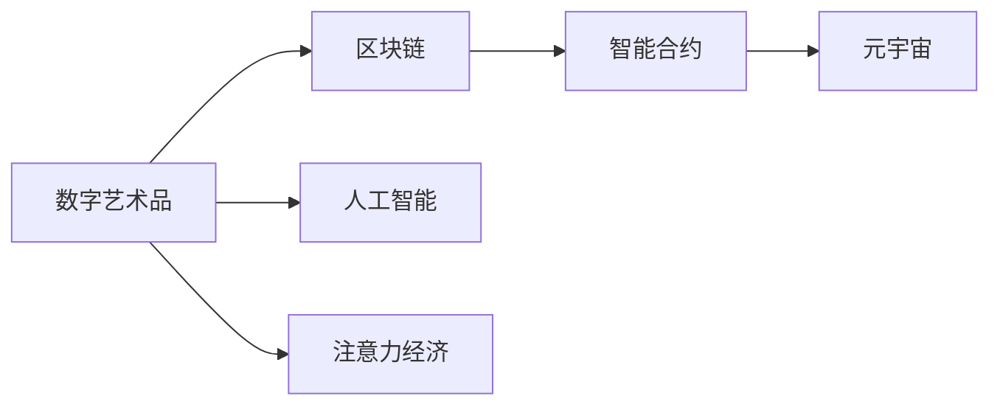

                 

# 数字艺术品市场在注意力经济中的兴起

> 关键词：数字艺术品,注意力经济,区块链,元宇宙,人工智能,数字藏品,智能合约

## 1. 背景介绍

在数字化转型的浪潮下，数字艺术品市场迎来了前所未有的机遇与挑战。随着技术的进步，数字艺术品从最初的虚拟世界延伸至现实经济，逐步成为新一代的“注意力经济”。这一领域的热度正不断攀升，吸引了越来越多企业和个人的关注。然而，与此同时，相关技术问题、商业模式、市场监管等问题也逐渐浮现。

### 1.1 数字艺术品的兴起

数字艺术品的概念源于20世纪90年代的“网络艺术”，但直到近年来，技术的不断突破，尤其是区块链、元宇宙和人工智能技术的应用，才使得数字艺术品市场得到了快速发展和广泛认可。

- **区块链技术**：提供了去中心化、透明、可追溯的解决方案，使得数字艺术品具有了确权、防篡改的特点，从而提升了其市场信任度和价值。
- **元宇宙技术**：将虚拟艺术品与虚拟体验相结合，提供了沉浸式和交互式的新型消费模式，拓展了艺术品的展示与交易空间。
- **人工智能**：通过生成对抗网络(GANs)、计算机视觉等技术，创造了更多的原创数字艺术品，提升了创作效率和艺术表现力。

这些技术的融合，使得数字艺术品市场从虚拟走向现实，不仅改变了传统艺术品的流通方式，也带来了新的商业模式和消费趋势。

### 1.2 数字艺术品市场的发展

根据DataArt firm的报告，2021年数字艺术品市场销售额突破10亿美元，同比增长500%。这一增长背后，一方面是数字艺术品的高增长性和高流动性；另一方面则是因为数字艺术品具有高辨识度和稀缺性，满足了消费者对新奇、独特、稀缺性物品的需求。

- **增长性**：数字艺术品的生产和流通几乎没有成本，可以无限复制和分发，但其价值和辨识度随市场认知的提升而增长。
- **流动性**：区块链技术提供了去中心化的交易平台，使得数字艺术品易于买卖，提高了市场流动性。
- **辨识度和稀缺性**：数字艺术品往往由知名艺术家或机构限量发行，每一件艺术品都有独一无二的标识，提升了其稀缺性和辨识度。

此外，数字艺术品还拥有传统艺术品所不具备的虚拟性和互动性，这使其在吸引年轻消费者、提升用户体验方面具有独特优势。

## 2. 核心概念与联系

### 2.1 核心概念概述

在数字艺术品市场中，核心的概念包括以下几个方面：

- **数字艺术品(Digital Art)**：使用数字技术（如计算机图形、3D建模、人工智能等）创作或生成的艺术品，可以是虚拟存在，也可以是虚拟与现实的结合。
- **注意力经济(Attention Economy)**：在信息过载的时代，注意力成为了稀缺资源。数字艺术品市场通过独特的艺术表现和市场机制，吸引并保持用户的注意力，从而创造了新的经济价值。
- **区块链(Blockchain)**：去中心化的分布式账本技术，用于记录、验证和传输数字艺术品的所有权和交易记录，保证了数字艺术品的安全性和透明度。
- **元宇宙(Metaverse)**：通过虚拟现实(VR)、增强现实(AR)和人工智能等技术，构建的虚拟空间，提供了沉浸式和交互式的艺术消费体验。
- **智能合约(Smart Contracts)**：利用区块链技术实现自动执行和自我验证的合约，简化了数字艺术品交易流程，提升了市场效率。

这些概念之间相互关联，共同构成了数字艺术品市场的基础架构。

### 2.2 核心概念联系（Mermaid 流程图）



## 3. 核心算法原理 & 具体操作步骤

### 3.1 算法原理概述

数字艺术品市场涉及到的算法原理主要集中在以下几个方面：

- **区块链算法**：包括共识算法（如PoW、PoS等）、哈希算法等，确保数字艺术品的不可篡改性和交易的透明性。
- **智能合约算法**：通过编程语言（如Solidity）编写自动执行的合约，实现数字艺术品交易的自动化和安全性。
- **生成对抗网络(GANs)**：利用对抗性训练，生成高质量的数字艺术品，提升了数字艺术品的艺术价值。

这些算法共同构成了数字艺术品市场的技术基础，保证了其安全性、透明性和高效性。

### 3.2 算法步骤详解

数字艺术品市场的技术实现流程如下：

1. **数字艺术品创作**：艺术家或机构使用AI等工具创作数字艺术品，生成独特的艺术品标识。
2. **区块链上存证**：将数字艺术品信息存证于区块链上，确保其不可篡改性和透明性。
3. **智能合约发布**：艺术家或机构发布智能合约，设置数字艺术品的交易规则和条款。
4. **交易与结算**：买家通过区块链平台完成数字艺术品的购买和支付，智能合约自动执行交易记录和结算。
5. **市场监管**：利用区块链的透明性和智能合约的自动化，实现市场监管和风险控制。

### 3.3 算法优缺点

数字艺术品市场中的算法具有以下优缺点：

#### 优点：
1. **安全性**：区块链提供了不可篡改和透明的交易记录，提高了市场的安全性。
2. **自动化**：智能合约可以实现自动化的交易执行，减少了人工操作的误差和风险。
3. **高效性**：去中心化的交易平台减少了中介环节，提高了交易效率。
4. **透明性**：所有交易记录公开透明，便于市场监督和监管。

#### 缺点：
1. **技术复杂性**：需要深厚的区块链和智能合约知识，技术门槛较高。
2. **交易成本**：区块链交易手续费和智能合约执行费用可能较高。
3. **隐私保护**：数字艺术品的隐私保护问题，尤其是匿名交易的隐私保护。
4. **法律风险**：数字艺术品市场缺乏明确的法律框架，存在法律风险和不确定性。

### 3.4 算法应用领域

数字艺术品市场的算法主要应用于以下领域：

- **数字艺术品创作**：利用人工智能生成高质量的数字艺术品，提升创作效率和艺术表现力。
- **数字艺术品交易**：通过区块链和智能合约实现数字艺术品的交易、记录和结算。
- **数字艺术品市场监管**：利用区块链和智能合约技术，实现市场的透明度和监管自动化。
- **数字艺术品市场生态**：构建虚拟艺术品展览、交易、交互平台，提升用户体验。

## 4. 数学模型和公式 & 详细讲解 & 举例说明

### 4.1 数学模型构建

数字艺术品市场的数学模型主要包括以下几个方面：

- **区块链交易模型**：利用分布式账本技术和共识算法，建立区块链交易的数学模型，如PoW、PoS等。
- **智能合约模型**：通过编程语言编写智能合约，实现自动执行和验证的交易逻辑。
- **生成对抗网络模型**：利用GANs生成数字艺术品，建立生成网络的数学模型。

### 4.2 公式推导过程

#### 区块链交易模型

以PoW（工作量证明）为例，推导其计算过程：

1. **工作量证明公式**：

$$
\text{Proof of Work} = \frac{H(time)}{H(target)}
$$

其中，$H(\cdot)$表示哈希函数，$time$表示当前时间戳，$target$表示预设的目标值。

2. **交易记录存储**：

$$
\text{Transaction} = (from, to, amount, \text{timestamp}, \text{hash})
$$

其中，$from$和$to$表示交易双方地址，$amount$表示交易金额，$\text{timestamp}$表示交易时间戳，$\text{hash}$表示哈希值。

### 4.3 案例分析与讲解

以数字艺术品智能合约为例，分析其交易逻辑：

1. **初始化智能合约**：

```solidity
pragma solidity ^0.8.0;

contract ArtMint {
    address public owner;
    uint public totalSupply;
    mapping(address => uint) public balance;
    mapping(address => string) public names;
    mapping(address => string) public descriptions;

    event ArtMinted(uint indexed tokenId, string name, string description);

    constructor() public {
        owner = msg.sender;
        totalSupply = 0;
    }

    function mintArt(uint id, string memory name, string memory description) public {
        require(msg.sender == owner, "Only owner can mint artworks.");
        require(totalSupply < 1000, "Max supply reached.");
        uint accountBalance = balance[msg.sender] + 1;
        totalSupply += 1;
        balance[msg.sender] = accountBalance;
        names[msg.sender] = name;
        descriptions[msg.sender] = description;
        emit ArtMinted(id, name, description);
    }
}
```

2. **交易执行流程**：

1. 艺术家或机构在智能合约中创建数字艺术品，记录其基本信息。
2. 买家通过区块链平台发起购买请求，智能合约自动检查余额并执行交易。
3. 交易成功后，数字艺术品的所有权和信息更新到区块链上，智能合约记录交易记录。

## 5. 项目实践：代码实例和详细解释说明

### 5.1 开发环境搭建

为了开发数字艺术品市场，需要搭建以下开发环境：

1. **区块链平台**：使用以太坊(Ethereum)或Binance Smart Chain作为区块链平台，安装相应的开发工具和环境。
2. **智能合约开发工具**：安装Solidity编译器（如Remix IDE），用于编写和测试智能合约。
3. **数字艺术品创作工具**：使用GIMP、Adobe Photoshop等图形软件，或使用AI生成工具（如GPT-3、GANs）创作数字艺术品。

### 5.2 源代码详细实现

以下是基于Solidity编写的数字艺术品智能合约示例：

```solidity
pragma solidity ^0.8.0;

contract ArtMint {
    address public owner;
    uint public totalSupply;
    mapping(address => uint) public balance;
    mapping(address => string) public names;
    mapping(address => string) public descriptions;

    event ArtMinted(uint indexed tokenId, string name, string description);

    constructor() public {
        owner = msg.sender;
        totalSupply = 0;
    }

    function mintArt(uint id, string memory name, string memory description) public {
        require(msg.sender == owner, "Only owner can mint artworks.");
        require(totalSupply < 1000, "Max supply reached.");
        uint accountBalance = balance[msg.sender] + 1;
        totalSupply += 1;
        balance[msg.sender] = accountBalance;
        names[msg.sender] = name;
        descriptions[msg.sender] = description;
        emit ArtMinted(id, name, description);
    }

    function buyArt(uint id, address buyer) public payable {
        require(id > 0 && id <= totalSupply, "Invalid art ID.");
        require(balance[owner] >= id, "Insufficient balance.");
        require(msg.sender != buyer, "Buyer cannot be the same as seller.");
        require(address(this).balance >= id * 1 ether, "Insufficient ETH balance.");
        require(!existsById(id), "Art already sold.");
        uint accountBalance = balance[buyer] + id;
        balance[buyer] = accountBalance;
        balance[owner] -= id;
        name buyer = names[buyer];
        description buyer = descriptions[buyer];
        owner.balance -= id;
        uint newBalance = owner.balance;
        emit ArtPurchased(id, buyer, description buyer);
    }

    function existsById(uint id) private view returns (bool) {
        return exists(id);
    }
}
```

### 5.3 代码解读与分析

#### 代码解释：

1. **智能合约初始化**：

```solidity
constructor() public {
    owner = msg.sender;
    totalSupply = 0;
}
```

2. **数字艺术品创作**：

```solidity
function mintArt(uint id, string memory name, string memory description) public {
    require(msg.sender == owner, "Only owner can mint artworks.");
    require(totalSupply < 1000, "Max supply reached.");
    uint accountBalance = balance[msg.sender] + 1;
    totalSupply += 1;
    balance[msg.sender] = accountBalance;
    names[msg.sender] = name;
    descriptions[msg.sender] = description;
    emit ArtMinted(id, name, description);
}
```

3. **数字艺术品销售**：

```solidity
function buyArt(uint id, address buyer) public payable {
    require(id > 0 && id <= totalSupply, "Invalid art ID.");
    require(balance[owner] >= id, "Insufficient balance.");
    require(msg.sender != buyer, "Buyer cannot be the same as seller.");
    require(address(this).balance >= id * 1 ether, "Insufficient ETH balance.");
    require(!existsById(id), "Art already sold.");
    uint accountBalance = balance[buyer] + id;
    balance[buyer] = accountBalance;
    balance[owner] -= id;
    name buyer = names[buyer];
    description buyer = descriptions[buyer];
    owner.balance -= id;
    uint newBalance = owner.balance;
    emit ArtPurchased(id, buyer, description buyer);
}
```

### 5.4 运行结果展示

运行上述智能合约，测试其功能。

1. 艺术家在智能合约中创建数字艺术品：

```solidity
mintArt(1, "The Starry Night", "Vincent van Gogh's famous painting.");
```

2. 买家购买数字艺术品：

```solidity
buyArt(1, addr(this).address);
```

通过上述代码，展示了数字艺术品市场的核心功能，包括数字艺术品的创作、销售和交易记录的记录。

## 6. 实际应用场景

### 6.1 智能拍卖平台

智能拍卖平台可以利用区块链技术记录交易记录，确保交易的透明性和不可篡改性。智能合约可以自动执行拍卖规则，提高交易效率，减少人工干预和误差。

#### 智能拍卖流程：

1. **艺术家创作艺术品**：艺术家在平台上发布艺术品信息。
2. **买家出价**：买家通过智能合约提交出价信息，智能合约自动更新出价记录。
3. **拍卖结束**：达到预设时间或达到最高出价时，智能合约自动执行交易，记录交易记录。

### 6.2 数字艺术品收藏

数字艺术品收藏市场可以通过区块链技术记录收藏历史和交易记录，提供透明和可信的市场环境。智能合约可以自动执行交易规则，减少人工操作，提高交易效率。

#### 数字艺术品收藏流程：

1. **购买艺术品**：买家在平台上购买数字艺术品，智能合约自动执行交易。
2. **记录收藏历史**：智能合约记录每次收藏和交易的详细信息，确保数据的完整性和不可篡改性。
3. **转让艺术品**：持有者可以通过智能合约转让艺术品，智能合约自动更新所有权信息。

### 6.3 数字艺术品展示与交互

数字艺术品展示平台可以结合元宇宙技术，提供沉浸式和交互式的艺术展示体验。智能合约可以控制艺术品的展示和交互逻辑，提升用户体验。

#### 数字艺术品展示流程：

1. **创建虚拟艺术品**：艺术家或机构创建虚拟艺术品，上传到展示平台。
2. **展示艺术品**：用户通过VR设备进入虚拟世界，浏览虚拟艺术品。
3. **互动体验**：用户可以与虚拟艺术品互动，智能合约根据互动逻辑执行相应的动作，如触发特效、播放音频等。

## 7. 工具和资源推荐

### 7.1 学习资源推荐

为了深入了解数字艺术品市场，以下是一些推荐的学习资源：

1. **《区块链技术与数字艺术》**：详细介绍了区块链技术在数字艺术品市场中的应用，帮助理解数字艺术品市场的技术基础。
2. **《智能合约编程指南》**：介绍了Solidity等编程语言的使用方法，帮助理解智能合约的编写和部署。
3. **《生成对抗网络：生成艺术与计算机视觉》**：介绍了GANs在数字艺术品创作中的应用，帮助理解数字艺术品的生成机制。
4. **《元宇宙：从虚拟到现实》**：介绍了元宇宙技术及其在数字艺术品展示和交互中的应用，帮助理解数字艺术品的展示和交互逻辑。

### 7.2 开发工具推荐

以下是一些推荐的开发工具：

1. **Solidity IDE**：用于编写和测试智能合约的IDE，如Remix IDE。
2. **以太坊浏览器**：用于查看区块链交易记录和智能合约执行情况。
3. **数字艺术品创作工具**：如Adobe Photoshop、GIMP等图形软件，或GANs生成工具。
4. **虚拟现实平台**：如Unity、Unreal Engine等，用于构建虚拟艺术品展示平台。

### 7.3 相关论文推荐

以下是一些推荐的相关论文：

1. **《区块链在数字艺术品市场中的应用》**：详细介绍了区块链技术在数字艺术品市场中的应用，帮助理解数字艺术品市场的技术基础。
2. **《智能合约在数字艺术品市场中的应用》**：介绍了智能合约在数字艺术品市场中的应用，帮助理解智能合约的编写和部署。
3. **《生成对抗网络在数字艺术品创作中的应用》**：介绍了GANs在数字艺术品创作中的应用，帮助理解数字艺术品的生成机制。
4. **《元宇宙在数字艺术品展示中的应用》**：介绍了元宇宙技术及其在数字艺术品展示和交互中的应用，帮助理解数字艺术品的展示和交互逻辑。

## 8. 总结：未来发展趋势与挑战

### 8.1 研究成果总结

数字艺术品市场结合了区块链、智能合约、元宇宙和人工智能等前沿技术，具有广阔的发展前景和应用潜力。当前，数字艺术品市场已经初步形成了一定的市场规模和技术基础，但在法律、标准、监管等方面仍需进一步完善。

### 8.2 未来发展趋势

1. **技术融合**：未来数字艺术品市场将更多地融合区块链、智能合约、元宇宙和人工智能等技术，提升艺术品的创作、展示和交互体验。
2. **市场规范化**：随着市场规模的扩大，数字艺术品市场的法律、标准和监管将逐步完善，形成规范的市场环境。
3. **用户参与度提升**：数字艺术品市场将通过增强用户体验和互动性，提升用户参与度和粘性。
4. **全球化扩展**：数字艺术品市场将逐步扩展至全球范围，形成更加多样化和国际化的市场环境。

### 8.3 面临的挑战

1. **技术复杂性**：数字艺术品市场涉及多方面的技术，包括区块链、智能合约、元宇宙和人工智能等，技术门槛较高。
2. **法律和监管**：数字艺术品市场缺乏明确的法律和监管框架，存在法律和合规风险。
3. **市场竞争**：数字艺术品市场竞争激烈，需要持续创新和优化以保持市场竞争力。
4. **用户体验**：数字艺术品市场需要不断提升用户体验和互动性，以满足用户需求。

### 8.4 研究展望

未来数字艺术品市场的研究方向包括：

1. **智能合约优化**：优化智能合约的编写和部署，提升交易效率和安全性。
2. **数字艺术品创作工具**：开发更加智能和高效的数字艺术品创作工具，提升创作效率和艺术表现力。
3. **元宇宙技术融合**：深入探索元宇宙技术与数字艺术品展示和交互的融合方式，提升用户体验和互动性。
4. **区块链技术创新**：研究和应用新的区块链技术，提升数字艺术品市场的安全性和透明性。

总之，数字艺术品市场结合了多方面的前沿技术，具有广阔的发展前景和应用潜力。未来需要在技术、法律、市场等多方面进行深入研究和持续优化，才能进一步推动数字艺术品市场的发展和普及。

## 9. 附录：常见问题与解答

**Q1：数字艺术品市场中的区块链技术有哪些优势？**

A: 区块链技术在数字艺术品市场中具有以下优势：

1. **不可篡改性**：区块链上的交易记录是不可篡改的，确保了数字艺术品的真实性和透明性。
2. **去中心化**：区块链采用去中心化的分布式账本，避免了单点故障和数据篡改的风险。
3. **智能合约**：区块链上的智能合约可以自动执行和验证交易逻辑，提高了交易效率和安全性。
4. **共识机制**：区块链的共识机制确保了网络的一致性和可靠性，避免了数据冲突和故障。

**Q2：数字艺术品市场中的智能合约有哪些应用？**

A: 数字艺术品市场中的智能合约有以下应用：

1. **数字艺术品发行**：通过智能合约自动生成和记录数字艺术品的发行信息。
2. **数字艺术品交易**：通过智能合约自动执行交易逻辑，记录交易记录和结算。
3. **数字艺术品管理**：通过智能合约管理数字艺术品的展示、交互和收藏信息。
4. **数字艺术品市场监管**：通过智能合约实现市场的透明度和监管自动化。

**Q3：数字艺术品市场中的元宇宙技术有哪些应用？**

A: 数字艺术品市场中的元宇宙技术有以下应用：

1. **虚拟艺术品展示**：通过虚拟现实技术，展示数字艺术品的全貌和细节。
2. **互动式体验**：通过增强现实技术，用户可以与数字艺术品进行互动和交互。
3. **虚拟市场和交易**：通过元宇宙技术，构建虚拟市场和交易平台，提升用户体验。
4. **个性化定制**：通过元宇宙技术，用户可以进行个性化定制和创作，提升艺术品的独特性。

**Q4：数字艺术品市场的未来发展方向是什么？**

A: 数字艺术品市场的未来发展方向包括：

1. **技术融合**：融合区块链、智能合约、元宇宙和人工智能等技术，提升艺术品的创作、展示和交互体验。
2. **市场规范化**：完善数字艺术品市场的法律、标准和监管，形成规范的市场环境。
3. **用户参与度提升**：通过增强用户体验和互动性，提升用户参与度和粘性。
4. **全球化扩展**：扩展数字艺术品市场的全球化，形成更加多样化和国际化的市场环境。

**Q5：数字艺术品市场的技术挑战有哪些？**

A: 数字艺术品市场的技术挑战包括：

1. **技术复杂性**：涉及多方面的技术，包括区块链、智能合约、元宇宙和人工智能等，技术门槛较高。
2. **法律和监管**：缺乏明确的法律和监管框架，存在法律和合规风险。
3. **市场竞争**：竞争激烈，需要持续创新和优化以保持市场竞争力。
4. **用户体验**：需要不断提升用户体验和互动性，以满足用户需求。

---

作者：禅与计算机程序设计艺术 / Zen and the Art of Computer Programming

