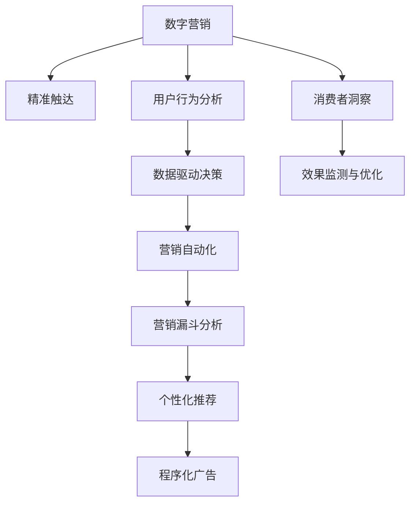

                 

# 数字营销创业：精准触达的营销新范式

> 关键词：数字营销, 精准触达, 用户行为分析, 数据驱动, 营销自动化, 营销漏斗分析, 个性化推荐, 程序化广告, 消费者洞察, 效果监测与优化

## 1. 背景介绍

### 1.1 问题由来
在数字化时代，互联网的普及为营销提供了全新的渠道和工具，但同时也带来了数据量的爆炸式增长和复杂性提升。如何在海量的数据中找到用户真正的需求，实现精准触达，成为数字营销的关键问题。传统的基于人力的营销手段已无法应对，高效、自动化的营销新范式亟待开发。

### 1.2 问题核心关键点
为了实现精准触达，数字营销创业需要聚焦于以下几个核心关键点：

1. **用户行为分析**：通过分析用户的行为数据，洞察用户的真实需求和潜在兴趣。
2. **数据驱动决策**：利用数据构建算法模型，自动化生成营销策略。
3. **营销自动化**：利用自动化技术，优化营销流程，提升效率。
4. **消费者洞察**：通过分析用户画像，理解消费者的行为和心理。
5. **效果监测与优化**：实时监测营销效果，及时调整策略。

### 1.3 问题研究意义
研究数字营销创业的精准触达新范式，对于提升数字营销效果，降低营销成本，推动数字营销技术的发展，具有重要意义：

1. **提升营销效果**：精准触达能提升广告投放的精准度和转化率，最大化广告投资回报率(ROI)。
2. **降低营销成本**：自动化营销流程可以显著降低人力成本和运营成本。
3. **加速营销创新**：精准触达能够帮助企业更快响应市场变化，进行创新营销。
4. **优化用户体验**：通过个性化推荐和内容定制，提升用户体验和满意度。
5. **数据驱动决策**：使得营销决策更加科学，提升企业竞争力和市场响应速度。

## 2. 核心概念与联系

### 2.1 核心概念概述

为更好地理解数字营销创业的精准触达范式，本节将介绍几个密切相关的核心概念：

- **数字营销**：利用数字技术和互联网平台进行品牌推广、产品销售等营销活动。
- **精准触达**：通过数据分析和算法模型，将广告或内容精准投放到最有可能产生转化或互动的用户面前。
- **用户行为分析**：通过分析用户在线行为数据，了解用户兴趣、偏好、需求等。
- **数据驱动决策**：利用数据分析结果指导营销策略和资源分配，实现科学决策。
- **营销自动化**：通过自动化工具和系统，优化营销流程，提升效率。
- **营销漏斗分析**：通过漏斗模型分析用户从接触、兴趣到最终购买的各个阶段，发现转化漏斗中的关键环节。
- **个性化推荐**：根据用户行为和偏好，推送个性化的产品、内容或服务。
- **程序化广告**：利用算法系统自动投放广告，实现精准触达和高效投放。
- **消费者洞察**：通过用户画像和行为分析，深入理解消费者心理和需求。
- **效果监测与优化**：实时跟踪和分析营销效果，进行持续优化。

这些核心概念之间的逻辑关系可以通过以下Mermaid流程图来展示：



这个流程图展示了大语言模型微调的核心概念及其之间的关系：

1. 数字营销通过用户行为分析、数据驱动决策和消费者洞察，了解用户需求。
2. 精准触达利用营销自动化、个性化推荐和程序化广告，实现高效投放。
3. 效果监测与优化持续跟踪和分析投放效果，优化策略。

这些概念共同构成了数字营销创业的精准触达范式，帮助企业在激烈的市场竞争中脱颖而出。

## 3. 核心算法原理 & 具体操作步骤
### 3.1 算法原理概述

数字营销创业的精准触达新范式，本质上是利用数据分析和算法模型，通过自动化和智能化的手段，实现用户需求的精准识别和高效触达。其核心思想是：

1. **数据收集与处理**：收集用户的多渠道数据，如点击、浏览、购买等行为数据，利用ETL技术进行清洗和整合。
2. **用户行为分析**：使用机器学习算法，如聚类、分类、关联规则等，对用户行为数据进行分析，构建用户画像。
3. **数据驱动决策**：构建数据驱动的营销模型，如预测模型、推荐系统、漏斗模型等，自动生成营销策略。
4. **营销自动化**：利用自动化工具和系统，执行营销策略，实现投放和优化。
5. **效果监测与优化**：实时跟踪和分析营销效果，进行策略调整和优化。

### 3.2 算法步骤详解

基于数据驱动的数字营销创业精准触达范式，一般包括以下几个关键步骤：

**Step 1: 数据收集与处理**
- 选择合适的数据源，如网站访问日志、社交媒体互动、客户服务记录等。
- 使用ETL技术清洗和整合数据，去除噪声和冗余，生成标准化的数据集。

**Step 2: 用户行为分析**
- 使用聚类算法对用户进行分群，划分出不同行为特征的用户群体。
- 应用分类算法对用户进行标签分类，如潜在客户、忠实客户等。
- 使用关联规则算法分析用户行为之间的关联性，发现用户兴趣和偏好。

**Step 3: 数据驱动决策**
- 构建用户画像，包括人口统计、行为特征、心理特征等。
- 使用预测模型预测用户的行为和需求，生成个性化推荐或广告。
- 使用漏斗模型分析用户从接触、兴趣到购买的各个阶段，发现漏斗中的关键环节。

**Step 4: 营销自动化**
- 利用自动化工具，如营销自动化平台、程序化广告系统等，自动生成投放策略。
- 自动投放广告或推荐内容，实时跟踪和记录用户互动。
- 根据用户行为和反馈，自动调整投放策略，优化广告效果。

**Step 5: 效果监测与优化**
- 实时监测广告效果，包括点击率、转化率、用户互动等指标。
- 分析效果数据，识别出效果不佳的投放环节和策略。
- 根据分析结果，优化投放策略，提高广告效果。

### 3.3 算法优缺点

基于数据驱动的数字营销创业精准触达范式，具有以下优点：

1. **效率高**：自动化和智能化的手段可以显著提升营销效率，降低人力成本和运营成本。
2. **精准度高**：通过数据分析和算法模型，实现对用户需求的精准识别和触达。
3. **效果可监测**：实时监测和分析广告效果，及时调整策略，优化投放效果。
4. **用户满意度提升**：个性化推荐和内容定制，提升用户体验和满意度。

同时，该范式也存在一定的局限性：

1. **数据隐私问题**：大量用户数据的收集和使用，需要严格遵守数据隐私法规。
2. **数据质量问题**：数据清洗和处理环节，容易出现数据偏差和噪声。
3. **算法复杂性**：构建复杂的算法模型，需要大量的计算资源和专业知识。
4. **广告效果依赖数据质量**：算法的准确性和效果，高度依赖于数据的质量和完整性。
5. **算法公平性问题**：算法模型可能存在数据偏见，影响投放的公平性。

尽管存在这些局限性，但就目前而言，基于数据驱动的精准触达范式仍是大数字营销创业的主要手段。未来相关研究的重点在于如何进一步降低数据收集和处理的成本，提高数据质量和算法的公平性和效果。

### 3.4 算法应用领域

基于数据驱动的数字营销创业精准触达范式，在多个领域得到了广泛应用，例如：

- 电商营销：利用用户行为数据，进行个性化推荐和精准广告投放。
- 品牌推广：通过社交媒体和搜索引擎等渠道，精准触达目标用户群体。
- 医疗广告：分析用户健康数据，推荐个性化的医疗产品和服务。
- 金融营销：利用用户金融数据，进行精准的广告投放和金融产品推荐。
- 旅游营销：分析用户旅游偏好，推送个性化的旅游产品和信息。
- 教育营销：通过分析用户学习行为，推送个性化的学习资源和课程。

除了上述这些经典领域外，数字营销创业精准触达范式还被创新性地应用于更多场景中，如内容营销、口碑营销、客户关系管理等，为数字营销技术带来了新的突破。

## 4. 数学模型和公式 & 详细讲解  
### 4.1 数学模型构建

基于数据驱动的数字营销创业精准触达范式，可以构建以下数学模型：

1. **用户画像构建**：
   - 用户画像 $P(u)$ 由用户特征 $x_i$ 和行为 $y_i$ 组成，形式化为 $P(u) = f(x_i, y_i)$，其中 $f$ 为映射函数。
   
2. **预测模型**：
   - 预测模型 $M_{\theta}$ 将用户画像 $P(u)$ 映射为行为 $y$，形式化为 $y = M_{\theta}(P(u))$，其中 $\theta$ 为模型参数。
   
3. **推荐系统**：
   - 推荐系统 $R_{\theta}$ 将用户画像 $P(u)$ 映射为推荐结果 $R(u)$，形式化为 $R(u) = R_{\theta}(P(u))$。

4. **漏斗模型**：
   - 漏斗模型 $L_{\theta}$ 分析用户从接触、兴趣到购买的各个阶段，形式化为 $L_{\theta} = \{C_i, I_i, P_i\}$，其中 $C_i$ 为接触阶段的用户行为，$I_i$ 为兴趣阶段的用户行为，$P_i$ 为购买阶段的用户行为。

5. **效果监测与优化**：
   - 效果监测与优化模型 $E_{\theta}$ 分析广告效果 $E$，形式化为 $E = E_{\theta}(R(u), C_i, I_i, P_i)$。

### 4.2 公式推导过程

以用户画像构建和预测模型为例，进行公式推导：

**用户画像构建**：
假设用户特征包括年龄、性别、职业、兴趣等，形式化为 $x_i = [a_i, g_i, p_i, i_i]$，其中 $a_i, g_i, p_i, i_i$ 分别代表年龄、性别、职业、兴趣。

- **特征工程**：
  - 将原始特征进行编码和标准化处理，得到标准化特征 $x'_i$。
  - 使用主成分分析(PCA)等降维技术，得到低维特征表示 $x''_i$。

- **映射函数**：
  - 利用神经网络、支持向量机(SVM)等算法，构建映射函数 $f(x''_i)$。
  - 例如，使用全连接神经网络模型，形式化为 $f(x''_i) = \mathbf{W} \cdot \mathbf{x''}_i + b$，其中 $\mathbf{W}$ 为权重矩阵，$b$ 为偏置项。

**预测模型**：
假设用户行为包括点击、购买等，形式化为 $y = [c_i, p_i]$，其中 $c_i, p_i$ 分别代表点击、购买行为。

- **预测函数**：
  - 使用逻辑回归、决策树、随机森林等算法，构建预测函数 $M_{\theta}$。
  - 例如，使用逻辑回归模型，形式化为 $y = \sigma(\mathbf{W} \cdot x''_i + b)$，其中 $\sigma$ 为 sigmoid 函数。

通过上述公式，我们建立了基于数据驱动的数字营销创业精准触达范式的数学模型。这些模型通过优化算法进行训练，能够自动生成高质量的用户画像、预测结果和推荐内容，实现高效精准的营销策略。

### 4.3 案例分析与讲解

**电商营销案例**：

1. **数据收集**：
   - 收集电商平台的订单数据、浏览数据、点击数据等，建立数据集 $D$。

2. **用户行为分析**：
   - 使用聚类算法对用户进行分群，发现不同用户群体的行为特征。
   - 使用分类算法对用户进行标签分类，如新客户、回访客户、流失客户等。

3. **数据驱动决策**：
   - 构建用户画像，包括年龄、性别、职业、浏览历史、购买历史等。
   - 使用预测模型预测用户的行为，生成个性化推荐。
   - 使用漏斗模型分析用户从浏览、加入购物车到购买的各个阶段，发现漏斗中的关键环节。

4. **营销自动化**：
   - 利用自动化工具，如推荐系统、程序化广告系统，自动生成投放策略。
   - 自动投放广告或推荐内容，实时跟踪和记录用户互动。
   - 根据用户行为和反馈，自动调整投放策略，优化广告效果。

5. **效果监测与优化**：
   - 实时监测广告效果，包括点击率、转化率、用户互动等指标。
   - 分析效果数据，识别出效果不佳的投放环节和策略。
   - 根据分析结果，优化投放策略，提高广告效果。

通过上述步骤，电商营销能够实现精准触达，提升用户转化率和销售额。

## 5. 项目实践：代码实例和详细解释说明
### 5.1 开发环境搭建

在进行数字营销创业精准触达范式的实践前，我们需要准备好开发环境。以下是使用Python进行PyTorch开发的环境配置流程：

1. 安装Anaconda：从官网下载并安装Anaconda，用于创建独立的Python环境。

2. 创建并激活虚拟环境：
```bash
conda create -n pytorch-env python=3.8 
conda activate pytorch-env
```

3. 安装PyTorch：根据CUDA版本，从官网获取对应的安装命令。例如：
```bash
conda install pytorch torchvision torchaudio cudatoolkit=11.1 -c pytorch -c conda-forge
```

4. 安装各类工具包：
```bash
pip install numpy pandas scikit-learn matplotlib tqdm jupyter notebook ipython
```

完成上述步骤后，即可在`pytorch-env`环境中开始精准触达范式的实践。

### 5.2 源代码详细实现

下面我们以电商营销为例，给出使用PyTorch进行精准触达范式的PyTorch代码实现。

首先，定义电商营销的数据处理函数：

```python
from transformers import BertTokenizer
from torch.utils.data import Dataset
import torch

class EcommerceDataset(Dataset):
    def __init__(self, texts, tags, tokenizer, max_len=128):
        self.texts = texts
        self.tags = tags
        self.tokenizer = tokenizer
        self.max_len = max_len
        
    def __len__(self):
        return len(self.texts)
    
    def __getitem__(self, item):
        text = self.texts[item]
        tags = self.tags[item]
        
        encoding = self.tokenizer(text, return_tensors='pt', max_length=self.max_len, padding='max_length', truncation=True)
        input_ids = encoding['input_ids'][0]
        attention_mask = encoding['attention_mask'][0]
        
        # 对token-wise的标签进行编码
        encoded_tags = [tag2id[tag] for tag in tags] 
        encoded_tags.extend([tag2id['O']] * (self.max_len - len(encoded_tags)))
        labels = torch.tensor(encoded_tags, dtype=torch.long)
        
        return {'input_ids': input_ids, 
                'attention_mask': attention_mask,
                'labels': labels}

# 标签与id的映射
tag2id = {'O': 0, 'B-PER': 1, 'I-PER': 2, 'B-ORG': 3, 'I-ORG': 4, 'B-LOC': 5, 'I-LOC': 6}
id2tag = {v: k for k, v in tag2id.items()}

# 创建dataset
tokenizer = BertTokenizer.from_pretrained('bert-base-cased')

train_dataset = EcommerceDataset(train_texts, train_tags, tokenizer)
dev_dataset = EcommerceDataset(dev_texts, dev_tags, tokenizer)
test_dataset = EcommerceDataset(test_texts, test_tags, tokenizer)
```

然后，定义模型和优化器：

```python
from transformers import BertForTokenClassification, AdamW

model = BertForTokenClassification.from_pretrained('bert-base-cased', num_labels=len(tag2id))

optimizer = AdamW(model.parameters(), lr=2e-5)
```

接着，定义训练和评估函数：

```python
from torch.utils.data import DataLoader
from tqdm import tqdm
from sklearn.metrics import classification_report

device = torch.device('cuda') if torch.cuda.is_available() else torch.device('cpu')
model.to(device)

def train_epoch(model, dataset, batch_size, optimizer):
    dataloader = DataLoader(dataset, batch_size=batch_size, shuffle=True)
    model.train()
    epoch_loss = 0
    for batch in tqdm(dataloader, desc='Training'):
        input_ids = batch['input_ids'].to(device)
        attention_mask = batch['attention_mask'].to(device)
        labels = batch['labels'].to(device)
        model.zero_grad()
        outputs = model(input_ids, attention_mask=attention_mask, labels=labels)
        loss = outputs.loss
        epoch_loss += loss.item()
        loss.backward()
        optimizer.step()
    return epoch_loss / len(dataloader)

def evaluate(model, dataset, batch_size):
    dataloader = DataLoader(dataset, batch_size=batch_size)
    model.eval()
    preds, labels = [], []
    with torch.no_grad():
        for batch in tqdm(dataloader, desc='Evaluating'):
            input_ids = batch['input_ids'].to(device)
            attention_mask = batch['attention_mask'].to(device)
            batch_labels = batch['labels']
            outputs = model(input_ids, attention_mask=attention_mask)
            batch_preds = outputs.logits.argmax(dim=2).to('cpu').tolist()
            batch_labels = batch_labels.to('cpu').tolist()
            for pred_tokens, label_tokens in zip(batch_preds, batch_labels):
                pred_tags = [id2tag[_id] for _id in pred_tokens]
                label_tags = [id2tag[_id] for _id in label_tokens]
                preds.append(pred_tags[:len(label_tags)])
                labels.append(label_tags)
                
    print(classification_report(labels, preds))
```

最后，启动训练流程并在测试集上评估：

```python
epochs = 5
batch_size = 16

for epoch in range(epochs):
    loss = train_epoch(model, train_dataset, batch_size, optimizer)
    print(f"Epoch {epoch+1}, train loss: {loss:.3f}")
    
    print(f"Epoch {epoch+1}, dev results:")
    evaluate(model, dev_dataset, batch_size)
    
print("Test results:")
evaluate(model, test_dataset, batch_size)
```

以上就是使用PyTorch对BERT进行电商营销的精准触达范式的完整代码实现。可以看到，得益于Transformers库的强大封装，我们可以用相对简洁的代码完成BERT模型的加载和微调。

### 5.3 代码解读与分析

让我们再详细解读一下关键代码的实现细节：

**EcommerceDataset类**：
- `__init__`方法：初始化文本、标签、分词器等关键组件。
- `__len__`方法：返回数据集的样本数量。
- `__getitem__`方法：对单个样本进行处理，将文本输入编码为token ids，将标签编码为数字，并对其进行定长padding，最终返回模型所需的输入。

**tag2id和id2tag字典**：
- 定义了标签与数字id之间的映射关系，用于将token-wise的预测结果解码回真实的标签。

**训练和评估函数**：
- 使用PyTorch的DataLoader对数据集进行批次化加载，供模型训练和推理使用。
- 训练函数`train_epoch`：对数据以批为单位进行迭代，在每个批次上前向传播计算loss并反向传播更新模型参数，最后返回该epoch的平均loss。
- 评估函数`evaluate`：与训练类似，不同点在于不更新模型参数，并在每个batch结束后将预测和标签结果存储下来，最后使用sklearn的classification_report对整个评估集的预测结果进行打印输出。

**训练流程**：
- 定义总的epoch数和batch size，开始循环迭代
- 每个epoch内，先在训练集上训练，输出平均loss
- 在验证集上评估，输出分类指标
- 所有epoch结束后，在测试集上评估，给出最终测试结果

可以看到，PyTorch配合Transformers库使得BERT微调的代码实现变得简洁高效。开发者可以将更多精力放在数据处理、模型改进等高层逻辑上，而不必过多关注底层的实现细节。

当然，工业级的系统实现还需考虑更多因素，如模型的保存和部署、超参数的自动搜索、更灵活的任务适配层等。但核心的精准触达范式基本与此类似。

## 6. 实际应用场景
### 6.1 电商营销

基于数据驱动的数字营销创业精准触达范式，在电商营销中得到了广泛应用。传统的电商营销主要依赖于人口统计特征和历史行为数据，难以精准识别和触达用户。通过构建用户画像和预测模型，电商营销能够实现更高效精准的投放。

具体而言，电商企业可以收集用户的浏览、点击、购买等行为数据，通过用户行为分析构建用户画像，再使用预测模型预测用户的行为和需求。根据预测结果，生成个性化推荐，并通过程序化广告系统进行精准投放。同时，通过效果监测与优化模型实时跟踪广告效果，不断调整投放策略，提高广告转化率。

### 6.2 品牌推广

品牌推广也需要精准触达用户，实现高效的广告投放。品牌企业可以通过社交媒体和搜索引擎等渠道，收集用户互动数据，构建用户画像和预测模型。使用程序化广告系统，精准投放广告，实时监测效果，不断优化投放策略。通过精准触达，品牌推广能够提高用户互动率和品牌认知度。

### 6.3 医疗广告

医疗广告需要精准触达目标用户，并提供个性化的医疗信息。医疗机构可以收集用户的健康数据，构建用户画像和预测模型。使用程序化广告系统，精准投放医疗广告，实时监测用户互动效果，不断优化广告策略。通过精准触达，医疗广告能够提高用户咨询率和医疗服务利用率。

### 6.4 金融广告

金融广告需要精准触达潜在客户，并提供个性化的金融产品推荐。金融机构可以收集用户的金融数据，构建用户画像和预测模型。使用程序化广告系统，精准投放金融广告，实时监测用户互动效果，不断优化广告策略。通过精准触达，金融广告能够提高用户转化率和金融产品利用率。

### 6.5 旅游营销

旅游营销需要精准触达潜在旅游者，并提供个性化的旅游产品推荐。旅游企业可以收集用户的旅游兴趣数据，构建用户画像和预测模型。使用程序化广告系统，精准投放旅游广告，实时监测用户互动效果，不断优化广告策略。通过精准触达，旅游营销能够提高用户参与率和旅游消费率。

### 6.6 教育营销

教育营销需要精准触达潜在学生，并提供个性化的教育资源推荐。教育机构可以收集学生的学习行为数据，构建学生画像和预测模型。使用程序化广告系统，精准投放教育广告，实时监测用户互动效果，不断优化广告策略。通过精准触达，教育营销能够提高用户参与率和教育资源利用率。

除了上述这些经典领域外，数字营销创业精准触达范式还被创新性地应用于更多场景中，如内容营销、口碑营销、客户关系管理等，为数字营销技术带来了新的突破。随着数据的不断积累和技术的持续进步，数字营销创业精准触达范式将在更多领域得到应用，为品牌和企业带来更大的商业价值。

## 7. 工具和资源推荐
### 7.1 学习资源推荐

为了帮助开发者系统掌握数字营销创业的精准触达范式的理论基础和实践技巧，这里推荐一些优质的学习资源：

1. 《数据驱动的营销策略》系列博文：由数据驱动营销专家撰写，深入浅出地介绍了数据驱动的营销策略和算法模型。

2. 《机器学习在营销中的应用》课程：斯坦福大学开设的NLP明星课程，有Lecture视频和配套作业，带你入门NLP领域的基本概念和经典模型。

3. 《数字营销的算法基础》书籍：全面介绍了数据驱动的营销算法，包括聚类、分类、预测等。

4. 《Python数据科学手册》：介绍Python在数据科学中的应用，包括数据清洗、特征工程、模型训练等。

5. 《数字营销实战指南》：实战型教程，介绍数字营销的各个环节和最佳实践。

通过对这些资源的学习实践，相信你一定能够快速掌握数据驱动的数字营销创业精准触达范式的精髓，并用于解决实际的数字营销问题。
###  7.2 开发工具推荐

高效的开发离不开优秀的工具支持。以下是几款用于数字营销创业精准触达范式开发的常用工具：

1. PyTorch：基于Python的开源深度学习框架，灵活动态的计算图，适合快速迭代研究。大部分预训练语言模型都有PyTorch版本的实现。

2. TensorFlow：由Google主导开发的开源深度学习框架，生产部署方便，适合大规模工程应用。同样有丰富的预训练语言模型资源。

3. Transformers库：HuggingFace开发的NLP工具库，集成了众多SOTA语言模型，支持PyTorch和TensorFlow，是进行精准触达范式开发的利器。

4. Weights & Biases：模型训练的实验跟踪工具，可以记录和可视化模型训练过程中的各项指标，方便对比和调优。与主流深度学习框架无缝集成。

5. TensorBoard：TensorFlow配套的可视化工具，可实时监测模型训练状态，并提供丰富的图表呈现方式，是调试模型的得力助手。

6. Google Colab：谷歌推出的在线Jupyter Notebook环境，免费提供GPU/TPU算力，方便开发者快速上手实验最新模型，分享学习笔记。

合理利用这些工具，可以显著提升数字营销创业精准触达范式的开发效率，加快创新迭代的步伐。

### 7.3 相关论文推荐

数字营销创业精准触达范式的研究源于学界的持续研究。以下是几篇奠基性的相关论文，推荐阅读：

1. The Impact of Digital Marketing on Business Growth（即数字营销对业务增长影响）：研究数字营销对企业业绩的贡献，展示了精准触达的巨大价值。

2. Data-Driven Marketing Strategy: A Review and Analysis（即数据驱动的营销策略）：系统综述了数据驱动营销的研究进展，提供了丰富的算法模型和应用案例。

3. Predictive Analytics in Marketing: A Review and Research Directions（即营销中的预测分析）：全面介绍了预测分析在营销中的应用，探讨了算法模型和数据驱动决策的未来方向。

4. Social Media Analytics: Techniques and Applications（即社交媒体分析）：介绍社交媒体数据分析技术，展示了如何通过用户互动数据构建精准触达模型。

5. Programmatic Advertising: A Survey of Research and Applications（即程序化广告）：全面综述了程序化广告的研究进展，提供了丰富的算法模型和应用案例。

这些论文代表了大语言模型微调技术的发展脉络。通过学习这些前沿成果，可以帮助研究者把握学科前进方向，激发更多的创新灵感。

## 8. 总结：未来发展趋势与挑战

### 8.1 总结

本文对基于数据驱动的数字营销创业精准触达范式进行了全面系统的介绍。首先阐述了数字营销创业的背景和意义，明确了精准触达在提升数字营销效果、降低成本等方面的重要价值。其次，从原理到实践，详细讲解了精准触达的数学模型和算法步骤，给出了精准触达范式的完整代码实例。同时，本文还广泛探讨了精准触达范式在多个行业领域的应用前景，展示了其广阔的应用场景。

通过本文的系统梳理，可以看到，基于数据驱动的数字营销创业精准触达范式正在成为数字营销的核心手段，极大地提升了数字营销的效果和效率。未来，伴随数据量的不断积累和算法的持续进步，精准触达范式将在更多领域得到应用，为品牌和企业带来更大的商业价值。

### 8.2 未来发展趋势

展望未来，数字营销创业精准触达范式将呈现以下几个发展趋势：

1. **数据量持续增大**：随着物联网、移动设备等新技术的普及，用户行为数据将呈爆炸式增长。精准触达范式需要处理的数据量将持续增大。

2. **算法模型多样化**：除了传统的机器学习和深度学习算法外，更多前沿算法如强化学习、因果推断等将被引入精准触达范式，提高模型的适应性和效果。

3. **模型解释性增强**：精准触达范式需要更多解释性强的算法模型，便于业务理解和优化决策。模型的可解释性和透明性将成为重要研究方向。

4. **跨领域融合发展**：精准触达范式需要与更多领域的技术进行融合，如自然语言处理、知识图谱、推荐系统等，形成更加全面和智能的营销策略。

5. **隐私保护和数据安全**：用户数据隐私和安全问题日益重要。精准触达范式需要在保护用户隐私的前提下，进行数据处理和模型训练。

6. **多渠道整合营销**：精准触达范式需要整合多种渠道的数据和广告，进行一体化营销，提升广告效果。

以上趋势凸显了数字营销创业精准触达范式的广阔前景。这些方向的探索发展，必将进一步提升精准触达的效果和应用范围，为品牌和企业带来更大的商业价值。

### 8.3 面临的挑战

尽管数字营销创业精准触达范式已经取得了瞩目成就，但在迈向更加智能化、普适化应用的过程中，它仍面临着诸多挑战：

1. **数据隐私问题**：大量用户数据的收集和使用，需要严格遵守数据隐私法规。如何在保证用户隐私的同时，进行有效的数据处理和分析，是一个难题。

2. **数据质量问题**：数据清洗和处理环节，容易出现数据偏差和噪声。如何在保证数据质量的前提下，构建精准的用户画像和预测模型，是一个重要的挑战。

3. **算法复杂性**：构建复杂的算法模型，需要大量的计算资源和专业知识。如何提高算法的可解释性和易用性，是一个重要的研究方向。

4. **广告效果依赖数据质量**：算法的准确性和效果，高度依赖于数据的质量和完整性。如何在保证数据质量的前提下，构建精准触达模型，是一个重要的挑战。

5. **广告效果波动性**：广告效果容易受到市场变化和用户行为变化的影响，如何建立稳定和鲁棒的广告投放策略，是一个重要的挑战。

6. **模型公平性问题**：算法模型可能存在数据偏见，影响投放的公平性。如何在保证模型公平性的前提下，构建精准触达模型，是一个重要的研究方向。

尽管存在这些挑战，但就目前而言，基于数据驱动的精准触达范式仍是大数字营销创业的主要手段。未来相关研究的重点在于如何进一步降低数据收集和处理的成本，提高数据质量和算法的公平性和效果。

### 8.4 研究展望

面对数字营销创业精准触达范式所面临的种种挑战，未来的研究需要在以下几个方面寻求新的突破：

1. **探索无监督和半监督学习算法**：摆脱对大规模标注数据的依赖，利用自监督学习、主动学习等无监督和半监督范式，最大限度利用非结构化数据，实现更加灵活高效的精准触达。

2. **研究参数高效和计算高效的算法模型**：开发更加参数高效的算法模型，在固定大部分数据处理的前提下，只更新极少量的模型参数。同时优化算法模型的计算图，减少计算资源消耗，实现更加轻量级、实时性的部署。

3. **引入因果分析和博弈论工具**：将因果分析方法引入精准触达范式，识别出广告投放的关键特征，增强投放效果的稳定性和鲁棒性。借助博弈论工具刻画人机交互过程，主动探索并规避模型的脆弱点，提高系统稳定性。

4. **融合更多先验知识**：将符号化的先验知识，如知识图谱、逻辑规则等，与神经网络模型进行巧妙融合，引导精准触达范式学习更准确、合理的用户行为模型。同时加强不同模态数据的整合，实现视觉、语音等多模态信息与文本信息的协同建模。

5. **结合因果分析和博弈论工具**：将因果分析方法引入精准触达范式，识别出广告投放的关键特征，增强投放效果的稳定性和鲁棒性。借助博弈论工具刻画人机交互过程，主动探索并规避模型的脆弱点，提高系统稳定性。

这些研究方向的探索，必将引领数字营销创业精准触达范式迈向更高的台阶，为构建安全、可靠、可解释、可控的智能系统铺平道路。面向未来，数字营销创业精准触达范式还需要与其他人工智能技术进行更深入的融合，如知识表示、因果推理、强化学习等，多路径协同发力，共同推动数字营销系统的进步。只有勇于创新、敢于突破，才能不断拓展精准触达的边界，让智能技术更好地造福人类社会。

## 9. 附录：常见问题与解答

**Q1：精准触达是否适用于所有数字营销场景？**

A: 精准触达在大多数数字营销场景中都适用，但需要根据具体情况进行适当调整。对于数据量较小或用户行为复杂的任务，可能需要结合多模态数据进行综合分析。

**Q2：如何选择合适的数据源？**

A: 应选择与目标用户高度相关的数据源，如社交媒体互动数据、网站访问日志、客户服务记录等。同时，应确保数据的真实性和完整性。

**Q3：如何处理数据偏差和噪声？**

A: 通过数据清洗和预处理，如去除异常值、填补缺失值、数据标准化等，可以有效降低数据偏差和噪声。同时，应使用鲁棒性强的算法模型，如随机森林、梯度提升树等，提高模型的稳定性和鲁棒性。

**Q4：如何提升模型的可解释性？**

A: 应选择解释性强的算法模型，如逻辑回归、决策树、规则模型等。同时，应使用可解释性工具，如LIME、SHAP等，对模型进行解释，便于业务理解和优化决策。

**Q5：如何提高广告效果？**

A: 应不断优化广告投放策略，如选择合适的广告形式、投放时间和频次等。同时，应实时监测广告效果，使用A/B测试等方法进行效果对比，不断调整投放策略，提升广告效果。

通过本文的系统梳理，相信你一定能够快速掌握基于数据驱动的数字营销创业精准触达范式的精髓，并用于解决实际的数字营销问题。

---

作者：禅与计算机程序设计艺术 / Zen and the Art of Computer Programming

