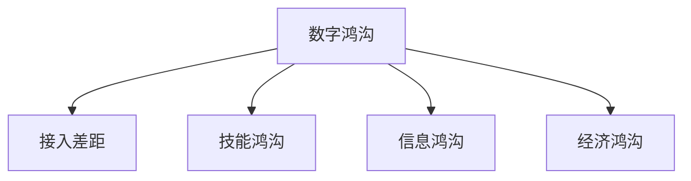

                 

# 数字鸿沟：弥合人类计算中的不平等现象

## 1. 背景介绍

### 1.1 问题由来
数字鸿沟，又称数字分化(Digital Divide)，是指不同社会群体在技术获取、使用和利用方面的不平等现象。这个概念最早由美国政府在20世纪90年代提出，用以描述互联网普及和技术获取的不均衡性。随着数字技术的发展，数字鸿沟成为全球范围内需要共同面对的问题。

数字鸿沟不仅体现在硬件设备的获取和接入上，更深刻地反映在技术技能、教育水平、经济状况等方面的差异。这些差异导致不同社会群体在数字社会中的参与度和受益程度不一，进而加剧了社会不平等。尤其在发展中国家和偏远地区，数字鸿沟问题更为突出。

### 1.2 问题核心关键点
数字鸿沟的核心关键点包括：
- **接入差距**：不同地区和社会群体在互联网接入和设备获取上的不平等，限制了部分人群的数字化体验。
- **技能鸿沟**：数字技能和知识的不平等，导致某些群体难以有效地使用数字工具和资源。
- **信息鸿沟**：不同群体获取和利用数字信息的不平等，影响了他们在教育、就业、医疗等方面的机会。
- **经济鸿沟**：数字技术和信息的不平等获取，加剧了贫富差距。

理解这些关键点，有助于我们更好地把握数字鸿沟的本质，制定有效的弥合策略。

### 1.3 问题研究意义
研究数字鸿沟问题，对于提升社会公平性、推动经济社会发展具有重要意义：

1. **促进社会公平**：通过缩小技术接入和使用的不平等，让更多人受益于数字时代的红利。
2. **提升经济发展**：数字技术的广泛应用可以推动创新和生产力的提升，促进经济增长。
3. **增强社会包容性**：提高数字技术的应用普及度，改善弱势群体的信息获取和参与机会。
4. **推动教育进步**：通过教育资源的数字化，提升教育质量和覆盖范围。
5. **促进公共服务**：数字技术的普及可以提升公共服务的效率和质量，如在线医疗、电子政务等。

## 2. 核心概念与联系

### 2.1 核心概念概述

为了更好地理解数字鸿沟问题，本节将介绍几个核心概念：

- **数字鸿沟**：不同社会群体在数字技术和信息获取上的不平等现象。
- **接入差距**：不同地区和社会群体在互联网接入和设备获取上的差异。
- **技能鸿沟**：数字技能和知识的不平等，导致部分人群难以有效使用数字工具。
- **信息鸿沟**：不同群体获取和利用数字信息的不平等。
- **经济鸿沟**：数字技术和信息获取的不平等，加剧了贫富差距。

这些核心概念之间的逻辑关系可以通过以下Mermaid流程图来展示：



这个流程图展示了大数字鸿沟问题的各个维度及其相互关系。

## 3. 核心算法原理 & 具体操作步骤

### 3.1 算法原理概述

数字鸿沟问题通常通过以下算法原理进行分析和解决：

1. **数据采集与分析**：收集不同地区和社会群体的数字接入、技能、信息获取和经济状况等数据，进行分析。
2. **模型建立**：使用机器学习模型，如回归、分类等，预测数字鸿沟的影响因素和程度。
3. **策略制定**：根据模型预测结果，制定针对性的政策和措施，缩小数字鸿沟。
4. **政策实施**：通过政府、企业和社会组织的共同努力，实施相关策略。
5. **效果评估**：定期评估政策效果，调整优化策略。

### 3.2 算法步骤详解

以下是数字鸿沟问题的分析和解决步骤：

**Step 1: 数据收集与预处理**

- 确定研究对象和范围。
- 收集关于互联网接入、数字技能、信息获取和经济状况等的数据。
- 对数据进行清洗和预处理，去除异常值和缺失值。

**Step 2: 特征工程与模型选择**

- 进行特征工程，提取对数字鸿沟有影响的特征，如年龄、性别、教育水平、收入等。
- 选择适合的机器学习模型，如回归模型、分类模型、聚类模型等。
- 划分训练集和测试集，进行模型训练和验证。

**Step 3: 模型训练与参数调优**

- 使用训练集训练模型，调整模型参数以提高模型性能。
- 使用交叉验证等方法评估模型性能，避免过拟合。

**Step 4: 策略制定与实施**

- 根据模型预测结果，制定针对性的策略，如提供互联网接入、技能培训、信息普及、经济支持等。
- 实施策略，进行资源配置和政策推广。

**Step 5: 效果评估与反馈**

- 定期评估策略效果，收集反馈信息。
- 根据评估结果和反馈，调整优化策略。

### 3.3 算法优缺点

数字鸿沟问题分析和解决算法具有以下优点：
1. 数据驱动。通过收集和分析数据，可以客观评估数字鸿沟问题。
2. 模型预测。使用机器学习模型，可以预测数字鸿沟的影响因素和程度。
3. 策略优化。通过不断调整策略，可以逐步缩小数字鸿沟。

同时，该算法也存在一定的局限性：
1. 数据质量问题。数据收集和处理的质量直接影响分析结果。
2. 模型偏差。模型可能存在偏差，预测结果不够准确。
3. 政策实施难度。策略实施涉及多方利益，协调难度大。
4. 效果评估复杂。数字鸿沟问题复杂多样，评估难度大。

尽管存在这些局限性，但数字鸿沟问题分析和解决算法仍是大数据技术在社会公平领域的重要应用。未来相关研究的重点在于如何进一步提升数据质量、优化模型预测、简化策略实施、优化评估方法，以提高数字鸿沟问题的解决效果。

### 3.4 算法应用领域

数字鸿沟问题分析和解决算法已经广泛应用于多个领域，例如：

- **教育领域**：通过数字鸿沟分析，制定教育资源数字化和普及策略，提高教育公平性。
- **医疗领域**：分析数字鸿沟对医疗资源获取的影响，制定远程医疗和电子健康记录普及策略。
- **就业领域**：分析数字鸿沟对就业机会的影响，提供技能培训和数字设备获取支持。
- **经济领域**：通过数字鸿沟分析，制定经济支持和产业数字转型策略，缩小贫富差距。
- **社会治理**：分析数字鸿沟对社会治理的影响，制定公共服务数字化和信息普及策略。

## 4. 数学模型和公式 & 详细讲解  
### 4.1 数学模型构建

假设数字鸿沟问题可以用一个回归模型来描述，即：

$$
Y = \beta_0 + \beta_1 X_1 + \beta_2 X_2 + \ldots + \beta_n X_n + \epsilon
$$

其中 $Y$ 表示数字鸿沟程度，$X_i$ 表示第 $i$ 个影响因素，$\beta_i$ 表示第 $i$ 个影响因素的系数，$\epsilon$ 表示随机误差。

**Step 1: 数据准备**

- 收集数据集 $D=\{(x_i,y_i)\}_{i=1}^N$，其中 $x_i=(x_{i1},x_{i2},\ldots,x_{in})$ 表示影响因素，$y_i$ 表示数字鸿沟程度。
- 对数据进行归一化和标准化处理。

**Step 2: 模型训练**

- 使用最小二乘法或梯度下降法训练模型，最小化损失函数：

$$
\hat{\beta} = \mathop{\arg\min}_{\beta} \frac{1}{N} \sum_{i=1}^N (y_i - \beta_0 - \sum_{j=1}^n \beta_j x_{ij})^2
$$

- 求解 $\beta$ 的值，得到模型参数 $\hat{\beta}$。

**Step 3: 预测与评估**

- 使用测试集进行模型预测，计算预测误差。
- 使用均方误差(MSE)或决定系数(R-squared)等指标评估模型性能。

### 4.2 公式推导过程

以下是回归模型中关键公式的推导过程：

- **均方误差(MSE)**：

$$
MSE = \frac{1}{N} \sum_{i=1}^N (y_i - \hat{y}_i)^2
$$

- **决定系数(R-squared)**：

$$
R^2 = 1 - \frac{\sum_{i=1}^N (\hat{y}_i - \bar{y})^2}{\sum_{i=1}^N (y_i - \bar{y})^2}
$$

其中 $\hat{y}_i$ 表示模型预测值，$\bar{y}$ 表示真实值均值。

### 4.3 案例分析与讲解

以教育领域为例，分析数字鸿沟对教育资源获取的影响：

- **数据收集**：收集不同地区学生的互联网接入、数字技能、家庭收入等数据。
- **特征选择**：选择互联网接入、家庭收入、数字技能作为影响因素。
- **模型训练**：使用线性回归模型训练，得到数字鸿沟的预测公式。
- **效果评估**：评估模型预测结果，确定不同因素对数字鸿沟的影响程度。
- **策略制定**：针对性地制定互联网接入、技能培训和经济支持策略，缩小数字鸿沟。

## 5. 项目实践：代码实例和详细解释说明

### 5.1 开发环境搭建

在进行数字鸿沟问题分析和解决实践前，我们需要准备好开发环境。以下是使用Python进行数据分析和模型训练的环境配置流程：

1. 安装Anaconda：从官网下载并安装Anaconda，用于创建独立的Python环境。

2. 创建并激活虚拟环境：
```bash
conda create -n digital_divide python=3.8 
conda activate digital_divide
```

3. 安装相关库：
```bash
pip install pandas numpy scikit-learn matplotlib seaborn
```

完成上述步骤后，即可在`digital_divide`环境中开始数字鸿沟问题分析和解决实践。

### 5.2 源代码详细实现

这里我们以一个简单的回归模型为例，展示数字鸿沟问题分析和解决的基本流程。

首先，定义数据处理函数：

```python
import pandas as pd
from sklearn.preprocessing import StandardScaler

def load_data():
    data = pd.read_csv('digital_divide.csv')
    X = data[['internet_access', 'digital_skill', 'income']]
    y = data['digital_divide']
    return X, y

def scale_data(X):
    scaler = StandardScaler()
    X_scaled = scaler.fit_transform(X)
    return X_scaled
```

然后，定义模型训练函数：

```python
from sklearn.linear_model import LinearRegression
from sklearn.metrics import mean_squared_error, r2_score

def train_model(X, y):
    model = LinearRegression()
    X_train, X_test, y_train, y_test = train_test_split(X, y, test_size=0.2, random_state=42)
    model.fit(X_train, y_train)
    y_pred = model.predict(X_test)
    mse = mean_squared_error(y_test, y_pred)
    r2 = r2_score(y_test, y_pred)
    return mse, r2
```

接着，启动训练流程：

```python
X, y = load_data()
X_scaled = scale_data(X)
mse, r2 = train_model(X_scaled, y)
print(f"MSE: {mse:.3f}, R^2: {r2:.3f}")
```

以上就是使用Python进行回归模型训练和数字鸿沟问题分析的基本流程。可以看到，通过Pandas和Scikit-learn等库，可以很方便地处理数据、训练模型，并评估预测效果。

### 5.3 代码解读与分析

让我们再详细解读一下关键代码的实现细节：

**load_data函数**：
- 使用Pandas读取CSV格式的数据集，并将其拆分为特征和标签。
- 使用Scikit-learn的StandardScaler对特征进行标准化处理。

**train_model函数**：
- 使用Scikit-learn的LinearRegression模型训练回归模型。
- 使用train_test_split函数将数据集划分为训练集和测试集。
- 计算模型在测试集上的均方误差和决定系数，作为模型性能的评估指标。

**训练流程**：
- 使用load_data函数加载数据集。
- 对数据进行标准化处理。
- 使用train_model函数训练模型，并输出预测误差和决定系数。

可以看到，使用Python进行数字鸿沟问题分析和解决，代码实现简洁高效。开发者可以根据具体任务，灵活调整数据处理和模型训练方法，以适应不同的问题需求。

当然，工业级的系统实现还需考虑更多因素，如数据处理自动化、模型调优策略、策略实施方案等。但核心的数字鸿沟问题分析和解决流程，基本与此类似。

## 6. 实际应用场景

### 6.1 教育领域的数字鸿沟分析

教育领域的数字鸿沟问题尤为突出，主要体现在以下几个方面：

- **设备接入**：不同地区和经济条件的学校，设备接入情况不一。
- **数字技能**：学生的数字技能水平差异显著，影响了数字化学习效果。
- **信息获取**：教育资源的数字化程度不高，限制了学生的信息获取。

通过数字鸿沟问题分析和解决算法，可以为教育领域带来以下影响：

- **资源优化**：分析不同地区和学校的数字鸿沟问题，优化资源配置，确保每个学生都能享受到数字化教育。
- **技能培训**：针对性地提供数字技能培训，提升学生的数字化学习能力。
- **信息普及**：推动教育资源的数字化和普及，提高教育质量。

### 6.2 医疗领域的数字鸿沟分析

医疗领域的数字鸿沟问题主要体现在以下几个方面：

- **设备接入**：医疗资源分布不均，部分地区和基层医疗机构设备不足。
- **信息获取**：医疗信息的数字化程度不高，限制了患者的信息获取。
- **远程医疗**：部分地区和群体难以获得远程医疗服务。

通过数字鸿沟问题分析和解决算法，可以为医疗领域带来以下影响：

- **设备普及**：分析不同地区和医疗机构的数字鸿沟问题，推动医疗设备的普及。
- **信息普及**：推动医疗信息的数字化和普及，提高患者的信息获取。
- **远程医疗**：推动远程医疗服务的普及，提高医疗服务的覆盖范围和质量。

### 6.3 经济领域的数字鸿沟分析

经济领域的数字鸿沟问题主要体现在以下几个方面：

- **设备接入**：不同收入群体在设备接入上存在显著差异。
- **数字技能**：数字技能的不平等影响了就业机会和经济增长。
- **信息获取**：数字信息的不平等获取加剧了贫富差距。

通过数字鸿沟问题分析和解决算法，可以为经济领域带来以下影响：

- **技能培训**：提供数字技能培训，提升低收入群体的就业机会和经济增长能力。
- **信息普及**：推动数字信息的普及，提高经济信息的获取和利用。
- **经济支持**：提供经济支持，缩小贫富差距。

## 7. 工具和资源推荐

### 7.1 学习资源推荐

为了帮助开发者系统掌握数字鸿沟问题分析和解决的理论基础和实践技巧，这里推荐一些优质的学习资源：

1. 《数字鸿沟与公平性》系列博文：深入浅出地介绍了数字鸿沟问题的定义、影响和解决策略。

2. 《数字鸿沟与社会发展》课程：由知名大学开设的在线课程，系统讲解数字鸿沟问题在各个领域的应用。

3. 《数字鸿沟：理论和实践》书籍：全面介绍数字鸿沟问题的理论框架和实际案例。

4. 《数字鸿沟研究方法》书籍：介绍如何收集、处理和分析数字鸿沟相关数据。

5. 《数字鸿沟政策设计》系列文章：探讨如何制定有效的数字鸿沟政策和措施。

通过对这些资源的学习实践，相信你一定能够快速掌握数字鸿沟问题分析和解决的核心方法，并应用于实际问题。

### 7.2 开发工具推荐

高效的开发离不开优秀的工具支持。以下是几款用于数字鸿沟问题分析和解决开发的常用工具：

1. Jupyter Notebook：开源的交互式数据科学平台，方便编写和运行Python代码，支持数据可视化。

2. R语言：广泛用于数据分析和统计建模的工具，支持丰富的数据处理和模型训练包。

3. Tableau：数据可视化工具，支持快速创建交互式图表和报表。

4. Python Pandas库：数据处理和分析工具，支持大规模数据的快速处理。

5. Python Scikit-learn库：机器学习工具，支持多种算法的实现和模型评估。

合理利用这些工具，可以显著提升数字鸿沟问题分析和解决的开发效率，加快创新迭代的步伐。

### 7.3 相关论文推荐

数字鸿沟问题分析和解决技术的发展源于学界的持续研究。以下是几篇奠基性的相关论文，推荐阅读：

1. Digital Divide: Concepts, Dynamics, and Policies in a Networked Society（数字鸿沟：网络社会中的概念、动态和政策）：系统介绍了数字鸿沟的概念、影响和政策框架。

2. Bridging the Digital Divide: A Review of Research on Household Digitalization（弥合数字鸿沟：家庭数字化研究综述）：总结了数字化家庭普及的主要影响因素和策略。

3. Connecting the Unconnected: Leveraging Information and Communication Technology to Bridge the Digital Divide（连接未连接：利用信息通信技术弥合数字鸿沟）：探讨了ICT技术在弥合数字鸿沟中的作用。

4. Bridging the Digital Divide through Data-Driven Policy Making（数据驱动政策制定：弥合数字鸿沟）：介绍了数据驱动的政策制定方法。

5. Digital Inequality in the Public Sector: Bridging the Digital Divide through E-Government Services（公共部门中的数字不平等：通过电子政务服务弥合数字鸿沟）：探讨了电子政务服务在弥合数字鸿沟中的作用。

这些论文代表了大数据技术在数字鸿沟问题研究中的发展脉络。通过学习这些前沿成果，可以帮助研究者把握学科前进方向，激发更多的创新灵感。

## 8. 总结：未来发展趋势与挑战

### 8.1 总结

本文对数字鸿沟问题进行了全面系统的介绍。首先阐述了数字鸿沟问题的背景和核心关键点，明确了问题对社会公平、经济发展等方面的重要影响。其次，从原理到实践，详细讲解了数字鸿沟问题的分析和解决算法，给出了数字鸿沟问题分析和解决实践的完整代码实例。同时，本文还广泛探讨了数字鸿沟问题在教育、医疗、经济等多个领域的应用前景，展示了数字鸿沟问题分析和解决算法的广阔应用前景。

通过本文的系统梳理，可以看到，数字鸿沟问题分析和解决算法在数字社会公平性、经济社会发展等领域具有重要意义。未来的研究需要在数据质量、模型优化、策略实施等方面寻求新的突破，以提升数字鸿沟问题分析和解决的精度和效果。

### 8.2 未来发展趋势

展望未来，数字鸿沟问题分析和解决技术将呈现以下几个发展趋势：

1. **数据驱动的精准分析**：通过更丰富、更精准的数据，可以更精确地分析数字鸿沟的影响因素和程度。
2. **模型优化与集成**：结合多种机器学习模型，进行模型集成和优化，提高预测精度。
3. **策略实施的多样化**：根据不同地区的具体情况，制定多样化的策略，提高策略实施的效果。
4. **跨领域应用拓展**：将数字鸿沟问题分析和解决技术应用于更多领域，如教育、医疗、交通等。
5. **政策与技术结合**：将政策制定和执行与技术应用相结合，推动数字鸿沟问题的系统性解决。
6. **技术创新的促进**：通过数字鸿沟问题分析和解决，促进技术创新，推动社会全面进步。

以上趋势凸显了数字鸿沟问题分析和解决技术的广阔前景。这些方向的探索发展，必将进一步提升数字鸿沟问题分析和解决的效果，推动社会公平和经济发展。

### 8.3 面临的挑战

尽管数字鸿沟问题分析和解决技术已经取得了一定进展，但在迈向更加智能化、普适化应用的过程中，仍面临诸多挑战：

1. **数据质量问题**：数据收集和处理的质量直接影响分析结果，需要进一步提升数据质量。
2. **模型复杂性**：模型复杂度高，需要更多算力和资源进行训练和优化。
3. **政策实施难度**：政策实施涉及多方利益，协调难度大，需要更多政策引导和保障。
4. **效果评估复杂**：数字鸿沟问题复杂多样，评估难度大，需要更科学的方法和指标。

尽管存在这些挑战，但数字鸿沟问题分析和解决技术仍是大数据技术在社会公平领域的重要应用。未来相关研究的重点在于如何进一步提升数据质量、优化模型预测、简化策略实施、优化评估方法，以提高数字鸿沟问题的解决效果。

### 8.4 研究展望

面对数字鸿沟问题分析和解决所面临的挑战，未来的研究需要在以下几个方面寻求新的突破：

1. **大数据技术的融合**：将大数据技术与其他技术结合，如人工智能、区块链、物联网等，提高数字鸿沟问题分析和解决的效果。
2. **算法优化与创新**：开发更加高效、精准的数字鸿沟问题分析和解决算法，提高模型的预测精度。
3. **跨领域应用的拓展**：将数字鸿沟问题分析和解决技术应用于更多领域，推动各领域的数字化转型。
4. **政策与技术结合**：将政策制定和执行与技术应用相结合，推动数字鸿沟问题的系统性解决。
5. **社会公平与经济发展的结合**：将数字鸿沟问题分析和解决与社会公平、经济发展相结合，推动社会的全面进步。

这些研究方向的探索，必将引领数字鸿沟问题分析和解决技术迈向更高的台阶，为构建公平、包容、可持续的数字社会铺平道路。

## 9. 附录：常见问题与解答

**Q1：数字鸿沟问题分析的第一步是什么？**

A: 数字鸿沟问题分析的第一步是数据收集与预处理。需要确定研究对象和范围，收集关于互联网接入、数字技能、信息获取和经济状况等的数据，并对数据进行清洗和预处理，去除异常值和缺失值。

**Q2：如何选择影响数字鸿沟的关键特征？**

A: 选择影响数字鸿沟的关键特征，需要结合具体问题和数据集进行分析。一般选择与数字鸿沟相关的指标，如互联网接入、数字技能、家庭收入等。同时可以通过特征选择算法，如Lasso回归、随机森林等，确定最优特征组合。

**Q3：数字鸿沟问题分析和解决算法的局限性有哪些？**

A: 数字鸿沟问题分析和解决算法的局限性主要包括数据质量问题、模型复杂性、政策实施难度和效果评估复杂等。需要进一步提升数据质量、优化模型预测、简化策略实施、优化评估方法，以提高数字鸿沟问题的解决效果。

**Q4：如何提高数字鸿沟问题分析和解决的效果？**

A: 提高数字鸿沟问题分析和解决的效果，可以从以下几个方面入手：
1. 收集更多、更高质量的数据，进行更精准的分析。
2. 开发更加高效、精准的算法，提高预测精度。
3. 制定多种策略，根据不同地区的具体情况进行优化。
4. 进行跨领域应用拓展，推动各领域的数字化转型。
5. 结合政策制定和执行，推动数字鸿沟问题的系统性解决。

这些措施将有助于提升数字鸿沟问题分析和解决的效果，推动数字社会公平和经济发展。

**Q5：数字鸿沟问题分析和解决算法的未来发展方向是什么？**

A: 数字鸿沟问题分析和解决算法的未来发展方向包括：
1. 数据驱动的精准分析，通过更丰富、更精准的数据，进行更精确的分析和预测。
2. 模型优化与集成，结合多种机器学习模型，进行模型集成和优化，提高预测精度。
3. 策略实施的多样化，根据不同地区的具体情况，制定多样化的策略，提高策略实施的效果。
4. 跨领域应用拓展，将数字鸿沟问题分析和解决技术应用于更多领域，如教育、医疗、交通等。
5. 政策与技术结合，将政策制定和执行与技术应用相结合，推动数字鸿沟问题的系统性解决。

这些方向将引领数字鸿沟问题分析和解决技术迈向更高的台阶，为构建公平、包容、可持续的数字社会铺平道路。

---

作者：禅与计算机程序设计艺术 / Zen and the Art of Computer Programming

