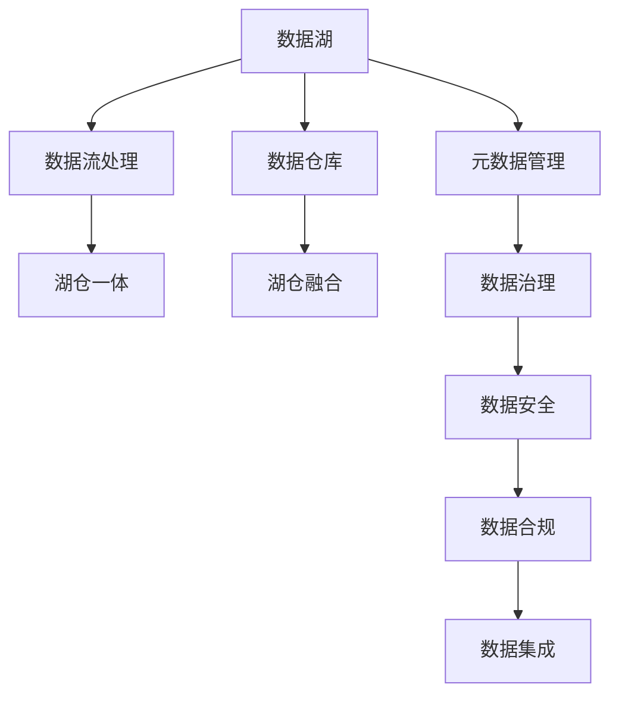

                 

# 数据湖架构：统一数据管理平台

## 1. 背景介绍

随着数字化转型的深入，企业对数据的需求变得日益多样和复杂。如何高效地收集、存储、管理和分析海量数据，成为一个重要的课题。传统的关系型数据库在应对数据量大、结构复杂、类型多样、速度要求高的场景时显得力不从心。而数据湖（Data Lake）作为一种新兴的数据管理平台，以其灵活的架构、强大的计算能力和可扩展性，逐步成为解决这些问题的重要手段。本文将深入探讨数据湖架构的核心概念、原理及应用实践，帮助你全面理解这一技术的精髓。

## 2. 核心概念与联系

### 2.1 核心概念概述

为了更好地理解数据湖架构，本节将介绍几个关键概念：

- **数据湖（Data Lake）**：一种分布式存储平台，用于存储大规模的、结构化和非结构化数据。数据湖可以容纳海量的数据，支持任意数据类型和格式，并提供快速的访问和处理能力。
- **数据仓库（Data Warehouse）**：一种数据管理架构，专门用于支持企业决策分析。数据仓库通过抽取、转换和加载（ETL）技术，将不同来源的数据整合存储，并通过多维数据分析提供支持。
- **数据流处理（Data Streaming）**：实时处理和分析高速流数据的技术，支持低延迟、高吞吐量的数据处理需求。
- **湖仓一体（Lakehouse）**：将数据湖和数据仓库结合的一种架构，融合两者的优点，支持更灵活的数据管理、分析和应用。

### 2.2 核心概念原理和架构的 Mermaid 流程图



这个流程图展示了数据湖架构中各关键组件的关系：

1. 数据湖存储数据，数据仓库进行数据分析，数据流处理支持实时数据处理。
2. 湖仓一体融合了数据湖和数据仓库的优点。
3. 元数据管理、数据治理、数据安全、数据合规和数据集成是确保数据质量和安全性的关键组件。

## 3. 核心算法原理 & 具体操作步骤

### 3.1 算法原理概述

数据湖架构的核心原理是采用分布式存储和计算，通过大数据技术支持海量数据的存储、处理和分析。数据湖架构通常包括数据湖、数据仓库、数据流处理、湖仓一体、元数据管理、数据治理、数据安全、数据合规和数据集成等组件，形成一个灵活、可扩展的数据管理平台。

### 3.2 算法步骤详解

数据湖架构的构建通常包括以下几个关键步骤：

**Step 1: 数据收集与存储**

- 通过ETL工具或API将各种来源的数据（如关系型数据库、文件系统、云存储等）抽取到数据湖中。
- 根据数据类型和业务需求，选择合适的存储格式（如Parquet、Avro等），并设置相应的数据分区和索引。
- 利用分布式存储技术，如Apache Hadoop、Apache Spark等，实现数据的快速读写和并行处理。

**Step 2: 数据清洗与治理**

- 对数据湖中的数据进行清洗，去除重复、错误和无关数据。
- 通过元数据管理工具记录数据湖中的数据结构和数据流，便于后续管理和查询。
- 实施数据治理策略，包括数据质量评估、数据生命周期管理等，确保数据的质量和可用性。

**Step 3: 数据分析与处理**

- 将数据湖中的数据导入数据仓库，通过SQL或ML技术进行分析和挖掘。
- 利用数据流处理技术，实时处理和分析高速流数据，支持低延迟、高吞吐量的数据处理需求。
- 结合湖仓一体架构，实现数据湖和数据仓库的无缝融合，提升数据管理的灵活性和效率。

**Step 4: 数据应用与输出**

- 根据业务需求，将分析结果通过API、报表、仪表盘等方式进行展示和应用。
- 利用数据湖和数据仓库的输出，支持企业决策分析、客户画像、产品推荐等应用场景。
- 在数据安全和合规方面，确保数据湖中的数据符合法律法规和行业标准，避免数据泄露和滥用。

### 3.3 算法优缺点

数据湖架构具有以下优点：

- **灵活性高**：数据湖支持任意数据类型和格式，可以存储结构化和非结构化数据，具有极高的灵活性。
- **可扩展性强**：采用分布式存储和计算，能够轻松扩展数据湖的存储和计算能力。
- **成本低廉**：利用开源软件和硬件，可以大大降低数据管理的成本。
- **支持大数据分析**：数据湖架构支持大规模数据分析，能够处理海量数据。

同时，数据湖架构也存在以下缺点：

- **数据管理复杂**：数据湖中的数据管理复杂，需要有效的数据治理和质量控制策略。
- **数据安全风险高**：数据湖中的数据量大、类型多，存在较高的数据泄露和安全风险。
- **处理速度慢**：相对于数据仓库，数据湖的处理速度较慢，无法满足实时性要求。

### 3.4 算法应用领域

数据湖架构广泛应用于多个领域：

- **金融行业**：支持风险管理、合规监控、客户分析等应用。
- **零售行业**：支持客户画像、个性化推荐、库存管理等应用。
- **医疗行业**：支持电子病历管理、健康数据分析、公共卫生监控等应用。
- **制造业**：支持设备监控、生产优化、供应链管理等应用。
- **能源行业**：支持能源监测、资源管理、环境分析等应用。

## 4. 数学模型和公式 & 详细讲解 & 举例说明

### 4.1 数学模型构建

在数据湖架构中，数学模型主要用于数据分析和处理。常见的数学模型包括统计模型、机器学习模型和深度学习模型。

以机器学习模型为例，假设我们有一个数据集 $D=\{(x_i,y_i)\}_{i=1}^N$，其中 $x_i$ 为输入，$y_i$ 为输出。我们的目标是找到一个函数 $f(x)$，使得对于任意输入 $x$，输出的预测值 $y'$ 与真实值 $y$ 尽可能接近。为此，我们定义损失函数 $\mathcal{L}(f(x))$，通常使用均方误差（MSE）或交叉熵（CE）作为损失函数。

我们的目标是最小化损失函数 $\mathcal{L}(f(x))$，即：

$$
\min_{f(x)} \mathcal{L}(f(x))
$$

通过梯度下降等优化算法，不断更新模型参数，直到损失函数最小化。

### 4.2 公式推导过程

以线性回归模型为例，我们假设模型函数为 $f(x)=\beta_0+\beta_1x_1+\beta_2x_2+\cdots+\beta_nx_n$。我们的目标是最小化损失函数：

$$
\mathcal{L}(f(x))=\frac{1}{2N}\sum_{i=1}^N(y_i-f(x_i))^2
$$

通过梯度下降算法，我们可以计算模型参数的更新公式：

$$
\beta_j \leftarrow \beta_j - \frac{\eta}{N}\sum_{i=1}^N \frac{\partial \mathcal{L}(f(x))}{\partial \beta_j}
$$

其中 $\eta$ 为学习率。

### 4.3 案例分析与讲解

假设我们有一个电商平台的销售数据集，包括用户ID、商品ID、销售时间、销售额等。我们的目标是预测用户未来30天的购买金额。

首先，我们需要对数据进行预处理，包括缺失值处理、异常值检测、特征工程等。然后，我们可以使用随机森林、梯度提升树等机器学习模型进行训练和预测。

```python
from sklearn.ensemble import RandomForestRegressor
from sklearn.model_selection import train_test_split
from sklearn.metrics import mean_squared_error

# 加载数据
X, y = load_data()

# 划分训练集和测试集
X_train, X_test, y_train, y_test = train_test_split(X, y, test_size=0.2)

# 训练模型
model = RandomForestRegressor()
model.fit(X_train, y_train)

# 预测并评估
y_pred = model.predict(X_test)
mse = mean_squared_error(y_test, y_pred)
print("均方误差：", mse)
```

## 5. 项目实践：代码实例和详细解释说明

### 5.1 开发环境搭建

在进行数据湖架构实践前，我们需要准备好开发环境。以下是使用Python进行PySpark开发的环境配置流程：

1. 安装Python：从官网下载并安装Python，用于脚本编写。

2. 安装PySpark：安装Apache Spark的Python API，可以使用pip安装：
```bash
pip install pyspark
```

3. 安装Spark：在集群中安装Spark，可以在Linux系统上安装。

4. 配置Spark环境变量：设置Spark配置文件，用于指定Spark的核心节点、工作节点、内存等参数。

完成上述步骤后，即可在本地或集群环境中开始数据湖架构的开发实践。

### 5.2 源代码详细实现

以下是使用PySpark对电商数据集进行清洗和分析的代码实现。

```python
from pyspark.sql import SparkSession
from pyspark.sql.functions import col, when, count
from pyspark.sql.types import IntegerType, DoubleType

# 创建SparkSession
spark = SparkSession.builder.appName('data_lake_demo').getOrCreate()

# 加载数据
data = spark.read.json('sales_data.json')

# 数据清洗
data_cleaned = data.dropna()

# 特征工程
data_cleaned = data_cleaned.withColumn('user_age', col('user_id').as('user_id')).withColumn('user_age', when(col('age') > 18, 1).otherwise(0))

# 数据统计
user_stats = data_cleaned.groupBy('user_id').agg(count().alias('purchase_count'), count().alias('purchase_amount'))
user_stats.show()

# 数据输出
user_stats.write.json('user_stats.json')
```

### 5.3 代码解读与分析

让我们再详细解读一下关键代码的实现细节：

**SparkSession创建**：通过`SparkSession.builder`创建Spark环境，设置应用名称和Spark配置参数。

**数据加载**：使用`spark.read.json`方法读取JSON格式的数据文件。

**数据清洗**：通过`dropna`方法去除缺失值，`withColumn`方法添加新列和计算字段。

**特征工程**：利用`when`方法进行条件判断，添加新列`user_age`。

**数据统计**：使用`groupBy`方法进行分组，`agg`方法进行聚合计算，`show`方法输出结果。

**数据输出**：使用`write.json`方法将数据结果输出为JSON格式文件。

## 6. 实际应用场景

### 6.1 智能客服系统

数据湖架构可以应用于智能客服系统的构建。传统的客服系统依赖人工客服，成本高、效率低、服务质量难以保障。而通过数据湖架构，可以整合多种渠道的客户数据，利用机器学习和自然语言处理技术，构建智能客服系统。

智能客服系统可以支持自动化回复、问题识别、上下文理解、情绪分析等功能，提供7x24小时不间断的服务，显著提升客户体验和满意度。

### 6.2 金融风险管理

数据湖架构可以支持金融风险管理系统的建设。金融行业的数据量大、结构复杂，利用数据湖架构可以高效存储和管理各类数据。

在风险管理中，数据湖架构可以支持客户风险评估、信用评分、欺诈检测等应用。通过实时数据流处理，可以在第一时间识别并处理风险事件，保障金融安全。

### 6.3 医疗数据分析

数据湖架构可以支持医疗数据分析系统的建设。医疗数据具有量大、多源、异构的特点，利用数据湖架构可以高效存储和管理各类数据。

在医疗数据分析中，数据湖架构可以支持电子病历管理、健康数据分析、公共卫生监控等应用。通过数据挖掘和机器学习技术，可以为医疗决策提供支持，提升医疗服务的质量和效率。

### 6.4 未来应用展望

数据湖架构具有广泛的应用前景，未来将在更多领域得到应用。

在智慧城市建设中，数据湖架构可以支持城市交通管理、环境监测、公共安全等应用。通过实时数据流处理，可以实现城市管理的智能化和精准化。

在智能制造中，数据湖架构可以支持设备监控、生产优化、供应链管理等应用。通过数据湖架构，可以实现生产过程的可视化和智能化。

在智慧农业中，数据湖架构可以支持农业数据管理、农作物监测、精准农业等应用。通过数据湖架构，可以实现农业生产的智能化和精准化。

## 7. 工具和资源推荐

### 7.1 学习资源推荐

为了帮助开发者系统掌握数据湖架构的理论基础和实践技巧，这里推荐一些优质的学习资源：

1. **《Hadoop 权威指南》**：深入讲解了Hadoop生态系统的各个组件，是Hadoop技术的入门经典。

2. **《Spark 入门与实战》**：介绍了Apache Spark的基本概念、核心组件和实战应用，是Spark技术的入门指南。

3. **《大数据技术权威指南》**：全面介绍了大数据技术的各个方面，包括数据湖、数据仓库、数据流处理、湖仓一体等。

4. **《数据湖解决方案》**：详细介绍了数据湖架构的设计和实现，是数据湖架构的实战指南。

5. **《Python 数据科学手册》**：介绍了Python在数据湖架构中的应用，包括数据清洗、数据分析、机器学习等。

通过对这些资源的学习实践，相信你一定能够快速掌握数据湖架构的精髓，并用于解决实际的大数据问题。

### 7.2 开发工具推荐

高效的开发离不开优秀的工具支持。以下是几款用于数据湖架构开发的常用工具：

1. **Jupyter Notebook**：开源的Python交互式开发环境，支持代码编写、数据可视化、交互式计算等功能。

2. **PySpark**：Apache Spark的Python API，支持分布式计算和大数据处理。

3. **Apache Hadoop**：开源的大数据分布式存储和计算平台，支持海量数据的存储和处理。

4. **Apache Flink**：开源的流处理平台，支持实时数据流处理和高吞吐量的数据处理需求。

5. **Apache Kafka**：开源的分布式消息队列，支持高可靠性和高吞吐量的数据传输。

6. **Apache Cassandra**：开源的分布式数据库，支持高可用性和高扩展性的数据存储。

合理利用这些工具，可以显著提升数据湖架构的开发效率，加快创新迭代的步伐。

### 7.3 相关论文推荐

数据湖架构的发展源于学界的持续研究。以下是几篇奠基性的相关论文，推荐阅读：

1. **《数据湖：可扩展数据存储和处理的解决方案》**：详细介绍了数据湖架构的设计和实现，是数据湖架构的学术基础。

2. **《数据湖架构：一种灵活的数据管理解决方案》**：介绍了数据湖架构的优点和挑战，是数据湖架构的实践指南。

3. **《数据湖：一种分布式数据存储和处理的解决方案》**：介绍了数据湖架构的技术细节和应用场景，是数据湖架构的理论基础。

4. **《数据湖和数据仓库：一种统一的数据管理解决方案》**：介绍了数据湖和数据仓库的融合，是数据湖架构的最新进展。

这些论文代表了大数据技术的发展脉络。通过学习这些前沿成果，可以帮助研究者把握学科前进方向，激发更多的创新灵感。

## 8. 总结：未来发展趋势与挑战

### 8.1 总结

本文对数据湖架构的核心概念、原理及应用实践进行了全面系统的介绍。首先阐述了数据湖架构的研究背景和意义，明确了数据湖架构在应对大规模、复杂、多样数据管理中的独特价值。其次，从原理到实践，详细讲解了数据湖架构的数学模型和具体操作步骤，给出了数据湖架构的完整代码实例。同时，本文还广泛探讨了数据湖架构在智能客服、金融风险管理、医疗数据分析等多个领域的应用前景，展示了数据湖架构的巨大潜力。此外，本文精选了数据湖架构的学习资源，力求为读者提供全方位的技术指引。

通过本文的系统梳理，可以看到，数据湖架构为大规模、复杂、多样数据的管理和分析提供了灵活、可扩展的解决方案，极大地提升了数据管理的效率和灵活性。未来，伴随数据湖架构技术的持续演进，相信在大数据管理的各个领域，数据湖架构将发挥越来越重要的作用。

### 8.2 未来发展趋势

展望未来，数据湖架构将呈现以下几个发展趋势：

1. **湖仓一体**：数据湖和数据仓库的融合，将数据湖的灵活性和数据仓库的分析能力结合起来，提供更全面的数据管理解决方案。

2. **云数据湖**：利用云服务构建数据湖架构，提升数据湖的可扩展性和灵活性，降低数据管理的成本和复杂度。

3. **数据治理**：通过数据治理工具，实现数据的统一管理、质量和合规控制，确保数据的质量和安全性。

4. **实时数据处理**：利用实时数据流处理技术，支持低延迟、高吞吐量的数据处理需求，提升数据的实时分析和应用能力。

5. **多源数据融合**：通过数据湖架构，支持多种数据源的整合和分析，提升数据的完整性和多样性。

6. **自动化的数据管理**：通过自动化的数据管理工具，实现数据的自动清洗、转换和治理，提升数据管理的效率和准确性。

以上趋势凸显了数据湖架构的发展方向，这些方向的探索发展，必将进一步提升数据湖架构的性能和应用范围，为大数据管理的各个领域带来深远影响。

### 8.3 面临的挑战

尽管数据湖架构已经取得了瞩目成就，但在迈向更加智能化、普适化应用的过程中，它仍面临着诸多挑战：

1. **数据管理复杂**：数据湖中的数据量大、类型多，管理复杂，需要有效的数据治理和质量控制策略。

2. **数据安全风险高**：数据湖中的数据量大、类型多，存在较高的数据泄露和安全风险。

3. **处理速度慢**：相对于数据仓库，数据湖的处理速度较慢，无法满足实时性要求。

4. **成本高昂**：数据湖架构的建设和管理需要大量的硬件资源和人力投入，成本较高。

5. **技术门槛高**：数据湖架构涉及多种大数据技术和工具，技术门槛较高，需要专业的技术人才。

6. **数据一致性问题**：数据湖架构中的数据分散存储，难以保证数据的一致性和完整性。

正视数据湖架构面临的这些挑战，积极应对并寻求突破，将是大数据管理技术走向成熟的必由之路。相信随着学界和产业界的共同努力，这些挑战终将一一被克服，数据湖架构必将在大数据管理的各个领域发挥更大的作用。

### 8.4 研究展望

面对数据湖架构所面临的种种挑战，未来的研究需要在以下几个方面寻求新的突破：

1. **自动化数据治理**：通过自动化的数据治理工具，实现数据的自动清洗、转换和治理，提升数据管理的效率和准确性。

2. **数据流处理优化**：利用高性能计算和分布式存储技术，优化数据流处理的性能，提升数据处理的实时性和吞吐量。

3. **数据一致性保障**：通过分布式事务和一致性协议，保证数据湖中的数据一致性和完整性。

4. **数据安全强化**：通过加密、访问控制、审计等手段，强化数据湖中的数据安全，保障数据隐私和合规。

5. **数据质量提升**：通过数据清洗、数据标准化、数据验证等手段，提升数据湖中的数据质量，确保数据的可靠性和可用性。

6. **数据湖与数据仓库的融合**：通过湖仓一体架构，实现数据湖和数据仓库的无缝融合，提升数据管理的灵活性和效率。

这些研究方向的探索，必将引领数据湖架构技术迈向更高的台阶，为大数据管理的各个领域带来深远影响。面向未来，数据湖架构还需要与其他大数据技术进行更深入的融合，如云计算、人工智能、区块链等，多路径协同发力，共同推动大数据管理的进步。

## 9. 附录：常见问题与解答

**Q1：数据湖架构是否适用于所有数据管理场景？**

A: 数据湖架构适用于大规模、复杂、多样的数据管理场景，但并不适用于所有数据管理场景。对于结构化数据管理需求高的场景，如财务报表、订单管理等，仍需使用传统的数据仓库架构。

**Q2：数据湖架构在数据安全方面有哪些措施？**

A: 数据湖架构在数据安全方面有以下措施：

1. **数据加密**：通过数据加密技术，保护数据在传输和存储过程中的安全性。

2. **访问控制**：通过访问控制技术，限制对数据湖中的数据访问权限，防止未经授权的数据访问。

3. **审计日志**：通过审计日志技术，记录数据访问和操作记录，保障数据的可追溯性。

4. **数据脱敏**：通过数据脱敏技术，保护敏感数据，避免数据泄露。

5. **数据合规**：通过数据合规工具，确保数据湖中的数据符合法律法规和行业标准。

这些措施可以有效保护数据湖中的数据安全，确保数据隐私和合规。

**Q3：数据湖架构在数据质量管理方面有哪些措施？**

A: 数据湖架构在数据质量管理方面有以下措施：

1. **数据清洗**：通过数据清洗工具，去除重复、错误和无关数据，提升数据的质量和完整性。

2. **数据标准化**：通过数据标准化工具，统一数据格式和命名规范，提升数据的规范性和一致性。

3. **数据验证**：通过数据验证工具，检查数据的正确性和完整性，发现和纠正数据错误。

4. **数据质量评估**：通过数据质量评估工具，定期评估数据的质量和可靠性，提升数据的管理水平。

这些措施可以有效提升数据湖中的数据质量，确保数据的可靠性和可用性。

**Q4：数据湖架构在数据集成方面有哪些措施？**

A: 数据湖架构在数据集成方面有以下措施：

1. **ETL工具**：通过ETL工具，实现数据抽取、转换和加载，将多种数据源的数据整合到数据湖中。

2. **API接口**：通过API接口，实现数据湖与其他系统或应用的数据集成和交互。

3. **数据导出**：通过数据导出工具，将数据湖中的数据导出到其他系统或应用中。

4. **数据同步**：通过数据同步工具，实现数据湖中的数据与外部数据源的同步和更新。

这些措施可以有效实现数据的集成和共享，提升数据管理的灵活性和效率。

**Q5：数据湖架构在实时数据处理方面有哪些措施？**

A: 数据湖架构在实时数据处理方面有以下措施：

1. **数据流处理框架**：利用数据流处理框架，如Apache Kafka、Apache Flink等，实现实时数据处理和分析。

2. **实时数据存储**：通过实时数据存储技术，如Apache Cassandra等，实现数据的实时存储和访问。

3. **实时数据查询**：通过实时数据查询工具，如Apache Spark等，实现实时数据的查询和分析。

4. **实时数据监控**：通过实时数据监控工具，实时监测数据处理过程和结果，保障数据的准确性和可靠性。

这些措施可以有效提升数据湖架构的实时数据处理能力，满足低延迟、高吞吐量的数据处理需求。

---

作者：禅与计算机程序设计艺术 / Zen and the Art of Computer Programming

