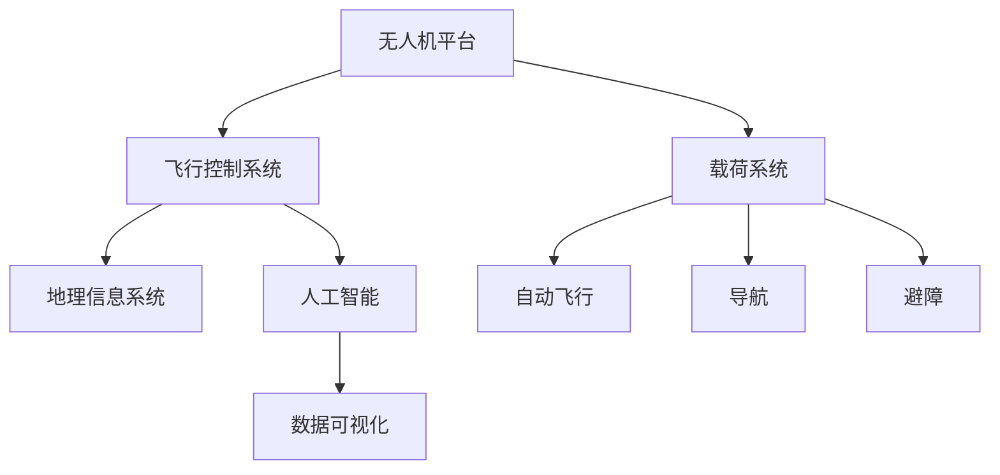

                 

# 无人机创业：空中视角的商业应用

## 1. 背景介绍

近年来，随着技术的进步和市场的兴起，无人机（Unmanned Aerial Vehicles, UAVs）在商业应用上取得了长足的发展。无人机凭借其灵活、高效、成本低等优点，迅速在多个领域找到了新的应用场景。从农业、物流、测绘，到医疗、旅游、安防，无人机的商业应用几乎无所不在。

### 1.1 问题由来
无人机创业成功的关键在于选择合适的应用领域和细分市场，深入挖掘实际需求。在各种应用场景中，无人机需要结合自身的技术优势和市场需求进行定制化开发，才能真正实现商业价值。

### 1.2 问题核心关键点
无人机创业的关键在于以下几点：
1. **市场调研**：理解目标市场需求，确定具体应用场景。
2. **技术选型**：选择合适的无人机平台和飞行控制系统。
3. **业务拓展**：寻找合适的客户和合作伙伴。
4. **商业模式设计**：明确盈利模式和收费策略。
5. **安全性与合规性**：确保飞行安全，遵守法律法规。
6. **市场推广**：进行有效的市场推广和品牌建设。

### 1.3 问题研究意义
深入研究无人机的商业应用，对于推动无人机技术的商业化和产业化，提升无人机企业的市场竞争力，具有重要的现实意义。无人机技术的广泛应用，将推动产业升级和经济社会发展，为人类生活带来更多便利和可能。

## 2. 核心概念与联系

### 2.1 核心概念概述

无人机创业涉及多个关键概念，以下对其核心概念进行概述：

- **无人机平台（UAV Platform）**：指无人机的主体部分，包括机身、动力系统、控制系统和机载设备等。常见的平台类型有固定翼、多旋翼、垂直起降等。
- **飞行控制系统（Flight Control System, FCS）**：用于管理无人机飞行姿态和路径的控制系统。通常包括自动飞行、导航、避障等功能。
- **载荷系统（Payload System）**：搭载于无人机平台上的各类设备，如摄像头、传感器、通信模块等。
- **地理信息系统（Geographic Information System, GIS）**：用于存储和分析地理数据的系统。在无人机应用中，常用于路径规划、地理信息采集等。
- **人工智能（Artificial Intelligence, AI）**：通过深度学习等技术，使无人机具备更强的自主决策能力和智能化水平。
- **数据可视化（Data Visualization）**：将飞行数据、图像数据等可视化，方便用户理解和操作。

这些核心概念之间通过无人机的飞行任务和应用场景联系起来，形成了无人机创业的完整技术框架。

### 2.2 核心概念原理和架构的 Mermaid 流程图



以上流程图展示了无人机平台、飞行控制系统、载荷系统、地理信息系统、人工智能和数据可视化之间的关系和交互方式。

## 3. 核心算法原理 & 具体操作步骤

### 3.1 算法原理概述

无人机创业中，核心算法原理主要包括以下几个方面：

- **路径规划算法**：用于确定无人机在特定任务中的飞行路径。常见的算法包括A*算法、D*算法、RRT算法等。
- **避障算法**：用于在飞行过程中检测并避开障碍物。常用的算法包括动态窗口、势能场算法等。
- **多机协作算法**：用于多无人机协同完成任务，提高任务效率。常见的算法包括分布式协作算法、全局路径规划算法等。
- **数据处理与分析算法**：用于对采集的地理信息和图像数据进行处理和分析。常用的算法包括图像识别、地理空间分析等。

### 3.2 算法步骤详解

以下是无人机创业中几个关键算法的详细步骤：

#### 路径规划算法

1. **环境建模**：建立无人机飞行环境的数学模型，包括地形、障碍物等。
2. **目标点设定**：设定无人机需要到达的目标点或目标区域。
3. **路径搜索**：使用A*、D*、RRT等算法搜索最优路径。
4. **路径优化**：对搜索结果进行路径优化，避免障碍物、考虑风速等外部因素。
5. **路径跟踪**：将优化后的路径发送给飞行控制系统，执行飞行任务。

#### 避障算法

1. **传感器数据采集**：通过激光雷达、摄像头等传感器采集环境数据。
2. **数据预处理**：对采集的数据进行预处理，包括滤波、坐标转换等。
3. **障碍检测**：使用目标检测、障碍物检测等算法，识别出环境中的障碍物。
4. **避障决策**：根据避障算法，规划避障路径，生成避障指令。
5. **避障执行**：将避障指令发送给飞行控制系统，调整飞行姿态和速度，避开障碍物。

#### 多机协作算法

1. **任务分配**：根据任务需求，将任务分配给多架无人机。
2. **路径规划**：每架无人机独立进行路径规划，生成各自的飞行路径。
3. **信息交换**：各无人机之间进行信息交换，共享环境数据和状态信息。
4. **协同执行**：各无人机根据协作算法，协调飞行动作，完成任务。

### 3.3 算法优缺点

无人机创业中的算法具有以下优点：

1. **提高任务效率**：通过路径规划和避障算法，提高无人机的任务执行效率和成功率。
2. **增强安全性**：多机协作算法可减少无人机单点故障的风险，提高整体安全性。
3. **提升智能化水平**：人工智能算法使无人机具备更强的自主决策和环境适应能力。

同时，也存在一些缺点：

1. **计算复杂度高**：路径规划、避障等算法计算复杂度较高，需要强大的硬件支持。
2. **数据处理量大**：多机协作和数据处理需要处理大量数据，对存储和通信要求较高。
3. **算法调整难度大**：算法复杂度高，调整和优化算法难度较大。

### 3.4 算法应用领域

无人机创业中的算法主要应用于以下几个领域：

1. **物流配送**：用于快递、货物配送等任务，提高配送效率和降低成本。
2. **农业植保**：用于农药喷洒、作物监测等任务，提升农业生产效率和质量。
3. **安防监控**：用于安防监控、巡逻、边界监控等任务，提高安全性和响应速度。
4. **环境监测**：用于环境监测、地质勘探、水文调查等任务，提供高精度的数据支持。
5. **应急救援**：用于灾害救援、医疗急救等任务，快速响应和精准定位。
6. **摄影测绘**：用于高精度测绘、航拍摄影等任务，提供高质量的地理信息和图像数据。

## 4. 数学模型和公式 & 详细讲解

### 4.1 数学模型构建

无人机的飞行任务涉及数学建模，以下介绍几个典型的数学模型：

#### 1. 路径规划模型

路径规划模型通常使用图论中的最短路径算法，如A*算法、D*算法。以A*算法为例，其数学模型为：

$$
A* = \{(s, f_n(s), g_n(s), \delta, \tau, \eta)\}
$$

其中，$s$ 为当前节点，$f_n(s)$ 为当前节点到目标节点的估价函数，$g_n(s)$ 为当前节点到起点的实际距离，$\delta$ 为启发式函数，$\tau$ 为节点激活顺序，$\eta$ 为边权重。

#### 2. 避障模型

避障模型通常使用基于势能场的算法。以势能场算法为例，其数学模型为：

$$
U_i = \sum_{j=1}^{N}w_j|x_j - x_i|
$$

其中，$U_i$ 为节点$i$的势能，$x_j$ 为节点$j$的位置，$w_j$ 为权值。

### 4.2 公式推导过程

#### 1. 路径规划算法的公式推导

以A*算法为例，其公式推导过程如下：

$$
f_n(s) = g_n(s) + h_n(s)
$$

其中，$g_n(s)$ 为当前节点到起点的实际距离，$h_n(s)$ 为当前节点到目标节点的估价函数，$f_n(s)$ 为当前节点的估价函数。

#### 2. 避障算法的公式推导

以势能场算法为例，其公式推导过程如下：

$$
U_i = \sum_{j=1}^{N}w_j|x_j - x_i|
$$

其中，$U_i$ 为节点$i$的势能，$x_j$ 为节点$j$的位置，$w_j$ 为权值。

### 4.3 案例分析与讲解

以物流配送为例，假设无人机需要从仓库A飞往配送点B，配送点B有多个目标位置C、D、E。

1. **路径规划**：使用A*算法，生成从A到B的最优路径，避开障碍物。
2. **避障处理**：通过激光雷达等传感器，检测到前方的障碍物，调整飞行路径，避开障碍物。
3. **任务执行**：将货物运送到目标位置C、D、E。

## 5. 项目实践：代码实例和详细解释说明

### 5.1 开发环境搭建

无人机创业的开发环境搭建主要包括软硬件环境配置和开发工具选择：

1. **软环境搭建**：安装Python、ROS（Robot Operating System）等软件，搭建开发环境。
2. **硬件环境搭建**：配置无人机平台、飞行控制系统、载荷系统等硬件设备，进行地面测试。

### 5.2 源代码详细实现

以下是无人机的路径规划算法的Python代码实现：

```python
import numpy as np
import math

# 定义节点类
class Node:
    def __init__(self, x, y):
        self.x = x
        self.y = y

    def distance(self, other):
        return math.sqrt((self.x - other.x)**2 + (self.y - other.y)**2)

# 定义启发式函数
def heuristic(node, goal):
    return node.distance(goal)

# 定义A*算法
def astar(start, goal):
    open_list = []
    closed_list = []
    g_score = {start: 0}
    f_score = {start: heuristic(start, goal)}
    parents = {start: None}

    open_list.append(start)
    while open_list:
        current = min(open_list, key=lambda node: f_score[node])
        if current == goal:
            return get_path(parents, goal)
        open_list.remove(current)
        closed_list.append(current)

        for neighbor in get_neighbors(current):
            tentative_g_score = g_score[current] + current.distance(neighbor)
            if neighbor not in closed_list and (neighbor not in open_list or tentative_g_score < g_score[neighbor]):
                g_score[neighbor] = tentative_g_score
                f_score[neighbor] = tentative_g_score + heuristic(neighbor, goal)
                parents[neighbor] = current
                if neighbor not in open_list:
                    open_list.append(neighbor)

    return None

# 定义邻居函数
def get_neighbors(node):
    neighbors = []
    # 省略邻居生成代码
    return neighbors

# 定义路径追踪函数
def get_path(parents, goal):
    path = [goal]
    while path[-1] != start:
        path.append(parents[path[-1]])
    return list(reversed(path))
```

### 5.3 代码解读与分析

上述代码中，`Node`类表示节点，包含节点坐标和距离函数；`heuristic`函数为启发式函数，计算节点到目标节点的估计距离；`astar`函数为A*算法实现，包括打开列表、关闭列表、g-score、f-score、父母节点等关键数据结构；`get_neighbors`函数为邻居生成函数，用于生成当前节点的邻居节点；`get_path`函数为路径追踪函数，用于生成从起点到终点的路径。

## 6. 实际应用场景

### 6.1 物流配送

物流配送是无人机创业的重要应用场景之一。无人机可以快速响应配送需求，减少人力成本，提高配送效率。以下是一个典型的物流配送场景：

假设一家物流公司需要快速配送货物，可以通过无人机进行配送。具体步骤如下：

1. **任务规划**：使用路径规划算法，生成最优的飞行路径。
2. **避障处理**：通过激光雷达等传感器，检测并避开道路、障碍物等。
3. **货物装载**：将货物装载到无人机上，设定起点和终点。
4. **飞行执行**：启动无人机，按照规划路径进行飞行，到达配送点后卸载货物，返回起点。

### 6.2 农业植保

农业植保是无人机创业的另一个重要应用场景。无人机可以用于农药喷洒、作物监测等任务，提高农业生产效率和质量。以下是一个典型的农业植保场景：

假设一家农业公司需要喷洒农药，可以通过无人机进行高效植保。具体步骤如下：

1. **任务规划**：使用路径规划算法，生成最优的飞行路径。
2. **避障处理**：通过激光雷达等传感器，检测并避开田间的障碍物。
3. **农药装载**：将农药装入无人机载荷系统，设定起点和终点。
4. **飞行执行**：启动无人机，按照规划路径进行飞行，喷洒农药，返回起点。

### 6.3 安防监控

安防监控是无人机创业的重要应用场景之一。无人机可以用于监控、巡逻、边界监控等任务，提高安全性和响应速度。以下是一个典型的安防监控场景：

假设一家安保公司需要监控特定区域，可以通过无人机进行24小时监控。具体步骤如下：

1. **任务规划**：使用路径规划算法，生成最优的飞行路径。
2. **避障处理**：通过激光雷达等传感器，检测并避开监控区域内的障碍物。
3. **相机装载**：将高清相机装入无人机载荷系统，设定起点和终点。
4. **飞行执行**：启动无人机，按照规划路径进行飞行，进行实时监控，返回起点。

## 7. 工具和资源推荐

### 7.1 学习资源推荐

无人机创业涉及多个领域的技术知识，以下推荐一些优质的学习资源：

1. **ROS官方文档**：ROS官方文档提供了丰富的ROS知识库，包括ROS开发指南、ROS包管理、ROS节点和工具等。
2. **Python官方文档**：Python官方文档提供了Python语言的完整参考手册，包括Python基础、标准库、第三方库等。
3. **ROS Tutorials**：ROS Tutorials提供了大量的ROS实践教程，涵盖ROS基础、ROS节点开发、ROS视觉SLAM等。
4. **ROS感知开发教程**：ROS感知开发教程提供了深度学习和感知开发的教程，涵盖图像处理、SLAM、语义分割等。
5. **ROS-Building**：ROS-Building提供了ROS系统构建和部署的教程，涵盖ROS系统安装、ROS系统配置、ROS系统测试等。

### 7.2 开发工具推荐

无人机创业的开发工具推荐如下：

1. **ROS**：ROS是开源的机器人操作系统，提供了完善的开发工具和框架。
2. **Gazebo**：Gazebo是ROS中的虚拟仿真平台，用于进行无人机的模拟测试。
3. **Rviz**：Rviz是ROS中的视觉仿真工具，用于展示无人机的飞行状态和路径。
4. **ROS Navigation Stack**：ROS Navigation Stack提供了无人机的路径规划和导航功能。
5. **ROS SLAM**：ROS SLAM提供了无人机的同步定位与地图构建功能。

### 7.3 相关论文推荐

无人机创业涉及多个领域的研究论文，以下推荐几篇代表性的论文：

1. **《A Survey of Path Planning Algorithms》**：这篇论文综述了路径规划算法的各种方法和应用，包括A*算法、D*算法、RRT算法等。
2. **《A Survey of UAV Navigation》**：这篇论文综述了无人机的导航方法和技术，包括路径规划、避障、多机协作等。
3. **《Autonomous UAV Systems: From Standalone to Networked Operations》**：这篇论文综述了无人机的自主系统和网络化操作，包括多机协作、任务分配、任务协调等。
4. **《A Survey of Drone Navigation Algorithms》**：这篇论文综述了无人机的导航算法，包括路径规划、避障、多机协作等。
5. **《UAV-Aided Disaster Response: Survey and Future Challenges》**：这篇论文综述了无人机在灾害响应中的应用，包括路径规划、避障、数据采集等。

## 8. 总结：未来发展趋势与挑战

### 8.1 研究成果总结

无人机创业在技术上取得了长足进步，但也面临诸多挑战。未来，无人机的商业应用将进一步拓展，应用场景将更加多样。同时，随着技术的进步，无人机的自主性和智能化水平将显著提升，实现更加高效的作业。

### 8.2 未来发展趋势

未来无人机创业的发展趋势主要包括以下几个方面：

1. **自动化程度提高**：无人机的自主飞行、自主避障、自主决策等能力将进一步提高，实现更高效的作业。
2. **智能化水平提升**：无人机的感知、认知、决策等能力将进一步提升，实现更精准的任务执行。
3. **多机协作增强**：多无人机协同作业将变得更加普遍，实现更高效的任务分配和协作。
4. **应用场景扩展**：无人机将应用于更多的领域，如物流、农业、安防、医疗等，带来更广泛的商业价值。
5. **安全性与合规性加强**：无人机的飞行安全、数据隐私、法律法规等问题将得到更加严格的监管和保障。

### 8.3 面临的挑战

无人机创业也面临着诸多挑战，主要包括以下几个方面：

1. **技术瓶颈**：无人机的飞行控制、路径规划、避障等技术仍存在许多瓶颈，需要进一步突破。
2. **数据获取难度**：获取高质量的训练数据和实际作业数据难度较大，需要更多开源数据和数据采集技术。
3. **成本高昂**：无人机系统的研发、制造、运营成本较高，需要更多的商业模式创新。
4. **市场竞争激烈**：无人机行业竞争激烈，需要更多的商业创新和市场开拓。
5. **法律法规限制**：无人机的飞行、数据采集等行为需要遵守相关法律法规，需要更多的法律支持和政策引导。

### 8.4 研究展望

未来无人机创业的研究展望主要包括以下几个方面：

1. **技术创新**：进一步提升无人机的自主飞行、避障、路径规划等技术，实现更高效的作业。
2. **数据驱动**：利用大数据和人工智能技术，实现更加精准的任务执行和决策。
3. **多模态融合**：将无人机与传感器、机器视觉、激光雷达等设备进行融合，实现更全面的信息采集和处理。
4. **跨领域合作**：与政府、企业、科研机构等进行跨领域合作，推动无人机技术的商业化应用。
5. **伦理和安全**：加强无人机的伦理和安全研究，确保无人机系统的可靠性和安全性。

## 9. 附录：常见问题与解答

**Q1：无人机创业中常见的技术难点有哪些？**

A: 无人机创业中的技术难点主要包括：

1. **飞行控制**：无人机的飞行控制需要高性能的飞行控制器和传感器，保证飞行稳定和响应快速。
2. **路径规划**：路径规划需要高效算法和强大计算能力，保证无人机在复杂环境中能够高效规划路径。
3. **避障处理**：避障需要高性能的传感器和算法，保证无人机能够实时检测和避开障碍物。
4. **多机协作**：多机协作需要高效通信和协作算法，保证多无人机协同高效执行任务。
5. **数据处理**：数据处理需要高性能计算和存储设备，保证无人机能够高效处理采集的数据。

**Q2：无人机创业中需要注意的安全和合规问题有哪些？**

A: 无人机创业中需要注意的安全和合规问题主要包括：

1. **飞行安全**：无人机需要在合规的飞行空域内飞行，避免侵犯空域规定。
2. **数据隐私**：无人机的数据采集需要遵守相关法律法规，保护用户隐私。
3. **法律法规**：无人机的飞行、数据采集等行为需要遵守相关法律法规，避免违法行为。
4. **设备安全**：无人机的设备需要在安全环境中运行，避免意外损坏和故障。
5. **责任划分**：无人机的运行过程中需要明确责任划分，避免因设备故障或其他原因导致的法律责任。

**Q3：无人机创业中如何选择适合的平台和载荷？**

A: 无人机创业中选择适合的平台和载荷需要考虑以下几个因素：

1. **任务需求**：根据任务需求选择适合的平台和载荷，如固定翼平台适用于长距离飞行，多旋翼平台适用于灵活机动。
2. **作业环境**：根据作业环境选择适合的平台和载荷，如地形复杂的环境选择四旋翼平台，平坦环境选择固定翼平台。
3. **载荷需求**：根据载荷需求选择适合的平台和载荷，如携带大型载荷选择多旋翼平台，携带小型载荷选择固定翼平台。
4. **成本预算**：根据成本预算选择适合的平台和载荷，如高成本预算选择高端平台，低成本预算选择低端平台。
5. **性能要求**：根据性能要求选择适合的平台和载荷，如高性能要求选择高端平台，一般性能要求选择低端平台。

**Q4：无人机创业中如何进行市场推广和品牌建设？**

A: 无人机创业中市场推广和品牌建设需要考虑以下几个因素：

1. **市场调研**：了解目标市场需求，确定具体应用场景。
2. **产品设计**：设计符合市场需求的产品，注重用户体验和功能设计。
3. **营销策略**：制定科学的营销策略，包括线上线下推广、广告投放等。
4. **品牌建设**：注重品牌建设，提升品牌知名度和美誉度。
5. **客户关系**：建立良好的客户关系，提供优质的售后服务。
6. **市场营销**：通过市场活动、展会、技术交流等形式，提升产品知名度。

通过以上市场推广和品牌建设策略，可以有效提升无人机的市场竞争力和品牌影响力。

---

作者：禅与计算机程序设计艺术 / Zen and the Art of Computer Programming

