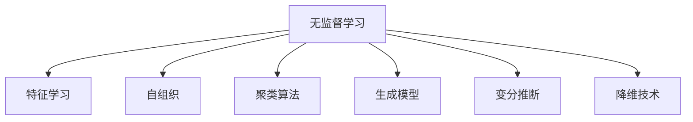

                 

# 无监督学习的前沿进展:探索数据的内在结构

> 关键词：无监督学习,深度学习,特征学习,自组织,聚类算法,变分推断,生成模型,降维技术

## 1. 背景介绍

### 1.1 问题由来
无监督学习(Unsupervised Learning)是指在没有明确标注数据的情况下，通过模型从数据中自行学习特征和模式的一类学习方法。在当前的大数据时代，数据规模呈现指数级增长，但真正标注好的数据仍然是稀缺资源。如何在不依赖标注数据的情况下，挖掘数据的潜在价值，是近年来人工智能领域的热门研究方向。

无监督学习在数据探索、特征学习、异常检测、降维等任务上具有广泛的应用前景。例如，在图像处理领域，可以使用自编码器学习图像的隐表示；在文本分析领域，可以通过主题模型发现文本隐含的结构；在推荐系统中，聚类算法能够帮助发现用户相似的兴趣点。

无监督学习不仅能够降低对标注数据的需求，还能在数据分布未知、任务复杂的情况下提供解决方案。因此，深度学习、特征学习、自组织、聚类算法、生成模型、变分推断、降维技术等无监督学习相关领域的研究得到了长足的发展。

### 1.2 问题核心关键点
无监督学习的核心在于通过模型对数据的内在结构进行建模和探索，从而挖掘出数据的潜在特征和模式。其主要包括以下几个关键点：

1. **特征提取**：无监督学习的核心任务之一是自动从数据中提取有意义的特征，以供下游任务使用。

2. **数据降维**：在处理大规模数据时，将高维数据映射到低维空间，保留数据的关键信息，同时降低计算复杂度。

3. **异常检测**：通过模型对数据分布进行建模，识别出与数据分布显著不同的异常点或异常区域。

4. **聚类与分离**：将相似的数据点分为一组，不同类别的数据点分为不同组，挖掘数据的结构和模式。

5. **生成模型**：学习数据生成的概率模型，用于生成新样本或生成对抗性样本。

6. **变分推断**：用于处理复杂概率模型，通过近似推断得出模型参数的后验分布。

这些关键点构成了无监督学习的理论基础和实践框架，使得模型能够在不依赖标注数据的情况下，从原始数据中获取有价值的信息。

### 1.3 问题研究意义
无监督学习的研究具有重要意义：

1. **降低成本**：通过无监督学习，可以避免标注数据的成本，特别是对于大规模数据集而言，标注数据获取的成本非常高昂。

2. **数据探索**：无监督学习提供了数据探索的工具，帮助研究人员和数据科学家理解数据的结构和模式。

3. **新算法**：无监督学习推动了深度学习、生成模型等前沿技术的发展，产生了大量创新算法和应用。

4. **应用广泛**：无监督学习在自然语言处理、计算机视觉、推荐系统、生物信息学等多个领域都有广泛的应用。

5. **未来趋势**：无监督学习在未来将更加普及，其理论与应用将得到更深入的拓展和完善。

## 2. 核心概念与联系

### 2.1 核心概念概述

为了更好地理解无监督学习的原理和实践，本节将介绍几个核心概念：

- **无监督学习(Unsupervised Learning)**：指在没有标注数据的情况下，通过模型自行学习数据的特征和模式。
- **特征学习(Feature Learning)**：指模型自动从原始数据中学习出具有代表性和区分度的特征表示。
- **自组织(Self-Organization)**：指模型能够自我组织和调整，以适应数据分布的变化。
- **聚类算法(Clustering Algorithms)**：指将数据分为不同类别的算法，如K-Means、DBSCAN等。
- **生成模型(Generative Models)**：指通过学习数据生成的概率模型，如GAN、VAE等。
- **变分推断(Variational Inference)**：指通过近似推断得到复杂模型参数的后验分布。
- **降维技术(Dimensionality Reduction)**：指将高维数据映射到低维空间的技术，如PCA、t-SNE等。

这些核心概念之间的逻辑关系可以通过以下Mermaid流程图来展示：



这个流程图展示了无监督学习中的几个主要任务及其相互关系。特征学习、自组织、聚类算法、生成模型、变分推断、降维技术等方法相互配合，共同构成无监督学习的框架。

## 3. 核心算法原理 & 具体操作步骤
### 3.1 算法原理概述

无监督学习主要包括特征学习、聚类、生成模型、变分推断等方法，各方法的主要算法原理如下：

#### 3.1.1 特征学习
特征学习是指模型自动从数据中学习出具有代表性和区分度的特征表示。其主要算法原理包括：

- **自编码器(Autoencoders)**：通过编码器将输入映射到低维空间，再通过解码器将低维表示映射回原始空间。训练目标是最小化重构误差。
- **卷积神经网络(CNNs)**：通过卷积层和池化层提取图像中的局部特征，再通过全连接层进行分类或回归。
- **循环神经网络(RNNs)**：通过时间步循环提取序列数据的特征，适用于处理时间序列数据。
- **自注意力机制(Attention)**：通过自注意力机制提取序列中重要部分的特征表示，如Transformer模型。

#### 3.1.2 聚类算法
聚类算法是指将数据分为不同类别的算法，其主要算法原理包括：

- **K-Means**：通过K个中心点迭代更新，将数据点分配到最近的中心点。
- **DBSCAN**：通过密度聚类，将数据点分为核心点、边界点、噪声点。
- **层次聚类(Hierarchical Clustering)**：通过构建层次结构，将数据点逐层合并。
- **谱聚类(Spectral Clustering)**：通过图表示征，将数据点映射到低维空间进行聚类。

#### 3.1.3 生成模型
生成模型是指通过学习数据生成的概率模型，其主要算法原理包括：

- **高斯混合模型(GMM)**：通过混合高斯分布生成数据，适用于建模连续性数据。
- **隐马尔可夫模型(HMM)**：通过状态转移和观测概率生成序列数据，适用于建模时间序列数据。
- **生成对抗网络(GANs)**：通过对抗训练生成新样本，适用于生成图像、文本等数据。
- **变分自编码器(VAEs)**：通过变分推断生成新样本，适用于生成图像、文本等数据。

#### 3.1.4 变分推断
变分推断是指通过近似推断得到复杂模型参数的后验分布，其主要算法原理包括：

- **期望最大化(EM)**：通过最大化似然函数来估计模型参数。
- **变分贝叶斯(VB)**：通过变分推断估计模型参数的后验分布。
- **期望传播(Expectation Propagation, EP)**：通过近似推断估计模型参数的后验分布。

#### 3.1.5 降维技术
降维技术是指将高维数据映射到低维空间的技术，其主要算法原理包括：

- **主成分分析(PCA)**：通过PCA算法找到数据中的主要成分，实现数据降维。
- **线性判别分析(LDA)**：通过线性判别分析实现数据分类和降维。
- **t-SNE**：通过t-SNE算法将数据映射到低维空间，保留数据局部结构。

### 3.2 算法步骤详解

无监督学习算法的操作步骤包括以下几个关键步骤：

**Step 1: 数据预处理**
- 对原始数据进行清洗、归一化、标准化等预处理，以保证数据的有效性。

**Step 2: 特征提取**
- 使用自编码器、CNNs、RNNs、Attention等方法，自动从数据中学习特征表示。

**Step 3: 聚类分析**
- 使用K-Means、DBSCAN、层次聚类、谱聚类等算法，将数据分为不同类别。

**Step 4: 生成模型**
- 使用GMM、HMM、GANs、VAEs等生成模型，学习数据生成的概率模型。

**Step 5: 变分推断**
- 使用EM、VB、EP等方法，近似推断模型参数的后验分布。

**Step 6: 降维处理**
- 使用PCA、LDA、t-SNE等算法，将高维数据映射到低维空间。

**Step 7: 模型评估与优化**
- 使用准确率、F1分数、重构误差等指标，评估模型性能。
- 根据评估结果，调整模型参数和超参数，优化模型性能。

### 3.3 算法优缺点

无监督学习的优缺点如下：

**优点：**
- **无需标注数据**：无监督学习不需要标注数据，降低了数据标注的成本。
- **数据探索**：能够挖掘数据的潜在结构和模式，发现数据中的隐藏信息。
- **泛化能力强**：无监督学习能够适应数据分布的变化，具有较强的泛化能力。

**缺点：**
- **模型复杂**：无监督学习模型的复杂度较高，需要大量的计算资源和时间。
- **结果解读困难**：无监督学习的结果通常缺乏直观的解读，难以解释模型的决策过程。
- **过拟合风险**：模型过度拟合数据的局部结构，可能失去泛化能力。

### 3.4 算法应用领域

无监督学习在各个领域都有广泛的应用，以下是几个典型的应用场景：

- **计算机视觉**：使用自编码器、CNNs等方法，自动从图像数据中学习特征表示，用于图像分类、目标检测等任务。
- **自然语言处理**：使用LDA、主题模型、Attention等方法，自动从文本数据中学习主题和语义表示，用于文本分类、情感分析等任务。
- **推荐系统**：使用协同过滤、聚类等方法，自动发现用户之间的相似性，用于个性化推荐。
- **金融分析**：使用PCA、LDA等方法，自动从金融数据中发现模式和趋势，用于风险控制、市场预测等任务。
- **生物信息学**：使用GMM、HMM等方法，自动从生物数据中学习特征和模式，用于基因序列分析、蛋白质结构预测等任务。

## 4. 数学模型和公式 & 详细讲解 & 举例说明

### 4.1 数学模型构建

为了更好地理解无监督学习的数学模型，本节将详细构建几个核心算法的数学模型。

#### 4.1.1 自编码器
自编码器(Autoencoder)是一种无监督学习模型，其数学模型如下：

$$
f(x; \theta) = g(W_2 h_1(W_1 x + b_1) + b_2)
$$

其中，$x$ 为输入，$f(x; \theta)$ 为重构输出，$h_1$ 为编码器，$g$ 为解码器，$W_1$、$b_1$、$W_2$、$b_2$ 为模型参数。

#### 4.1.2 K-Means
K-Means是一种聚类算法，其数学模型如下：

$$
K-Means = \arg\min_{K, C} \sum_{i=1}^N \min_{k=1}^K ||x_i - \mu_k||^2
$$

其中，$N$ 为数据点数量，$K$ 为聚类数，$x_i$ 为数据点，$\mu_k$ 为聚类中心。

#### 4.1.3 变分自编码器
变分自编码器(VAE)是一种生成模型，其数学模型如下：

$$
\begin{aligned}
p(x|z) &= N(x|W_2 z + b_2, diag(1/\sigma_z^2) W_2^T) \\
q(z|x) &= N(z|W_1 x + b_1, diag(1/\sigma_z^2) W_1^T)
\end{aligned}
$$

其中，$x$ 为输入，$z$ 为隐变量，$W_1$、$b_1$、$W_2$、$b_2$、$\sigma_z$ 为模型参数。

### 4.2 公式推导过程

下面对几个核心算法的公式推导过程进行详细讲解：

#### 4.2.1 自编码器
自编码器的推导过程如下：

- **重构误差最小化**：假设输入数据为 $x \in \mathbb{R}^d$，编码器将输入映射到低维空间 $h_1(x) \in \mathbb{R}^h$，解码器将低维表示映射回原始空间 $f(x; \theta) \in \mathbb{R}^d$。训练目标是最小化重构误差：

$$
\mathcal{L} = ||x - f(x; \theta)||^2
$$

- **自编码器优化**：将重构误差最小化目标转化为最小化编码器和解码器的损失函数：

$$
\mathcal{L}_{AE} = \frac{1}{N} \sum_{i=1}^N ||x_i - f(x_i; \theta)||^2
$$

- **参数更新**：使用梯度下降法优化模型参数，最小化自编码器的损失函数。

#### 4.2.2 K-Means
K-Means的推导过程如下：

- **聚类损失最小化**：假设数据集为 $X = \{x_i\}_{i=1}^N$，每个数据点 $x_i \in \mathbb{R}^d$。聚类数为 $K$，聚类中心为 $\mu_k \in \mathbb{R}^d$。聚类损失为：

$$
\mathcal{L}_{K-Means} = \sum_{i=1}^N ||x_i - \mu_{k_i}||^2
$$

其中，$k_i$ 为数据点 $x_i$ 所属的聚类。

- **K-Means优化**：将聚类损失最小化目标转化为优化聚类中心和数据点归类的目标：

$$
\mathcal{L}_{K-Means} = \sum_{k=1}^K \sum_{x \in C_k} ||x - \mu_k||^2
$$

- **参数更新**：使用梯度下降法优化模型参数，最小化K-Means的聚类损失。

#### 4.2.3 变分自编码器
变分自编码器的推导过程如下：

- **重构误差最小化**：假设输入数据为 $x \in \mathbb{R}^d$，隐变量为 $z \in \mathbb{R}^h$。编码器将输入映射到隐变量空间 $h_1(x) \in \mathbb{R}^h$，解码器将隐变量映射回原始空间 $f(x; \theta) \in \mathbb{R}^d$。训练目标是最小化重构误差：

$$
\mathcal{L}_{VAE} = \frac{1}{N} \sum_{i=1}^N ||x_i - f(x_i; \theta)||^2
$$

- **变分推断**：假设隐变量 $z$ 的概率分布为 $q(z|x)$，模型参数 $w$ 的后验分布为 $p(w|x)$。变分推断的优化目标为最大化 $p(w|x)$ 的对数似然：

$$
\mathcal{L}_{VAE} = \mathcal{L}_{VAE-Recon} + \mathcal{L}_{VAE-KL}
$$

其中，$\mathcal{L}_{VAE-Recon}$ 为重构误差损失，$\mathcal{L}_{VAE-KL}$ 为KL散度损失。

- **参数更新**：使用梯度下降法优化模型参数，最小化变分自编码器的损失函数。

### 4.3 案例分析与讲解

下面以一个具体案例为例，详细讲解无监督学习算法的应用。

#### 案例背景
假设有一个包含1000张猫狗图像的数据集，目标是从中选择100张图像，使得这100张图像的狗的概率最大。

#### 数据预处理
首先对原始图像数据进行预处理，包括去噪、归一化、缩放等操作，保证数据的一致性和有效性。

#### 特征提取
使用自编码器对图像数据进行特征提取，得到1000张图像的隐表示。

#### 聚类分析
使用K-Means算法对1000张图像的隐表示进行聚类，得到50个聚类。

#### 生成模型
使用变分自编码器对聚类后的图像隐表示进行生成，得到100张图像的生成样本。

#### 结果评估
评估生成的100张图像中狗的类别，选择狗的概率最大的图像。

## 5. 项目实践：代码实例和详细解释说明

### 5.1 开发环境搭建

在进行无监督学习实践前，我们需要准备好开发环境。以下是使用Python进行TensorFlow开发的环境配置流程：

1. 安装Anaconda：从官网下载并安装Anaconda，用于创建独立的Python环境。

2. 创建并激活虚拟环境：
```bash
conda create -n tensorflow-env python=3.8 
conda activate tensorflow-env
```

3. 安装TensorFlow：根据CUDA版本，从官网获取对应的安装命令。例如：
```bash
conda install tensorflow -c tensorflow -c conda-forge
```

4. 安装各类工具包：
```bash
pip install numpy pandas scikit-learn matplotlib tqdm jupyter notebook ipython
```

完成上述步骤后，即可在`tensorflow-env`环境中开始无监督学习实践。

### 5.2 源代码详细实现

下面我们以使用TensorFlow实现自编码器和变分自编码器为例，给出代码实现。

#### 自编码器代码实现

```python
import tensorflow as tf
import numpy as np

class Autoencoder(tf.keras.Model):
    def __init__(self, input_dim):
        super(Autoencoder, self).__init__()
        self.encoder = tf.keras.Sequential([
            tf.keras.layers.Dense(32, input_dim=input_dim, activation='relu'),
            tf.keras.layers.Dense(16, activation='relu')
        ])
        self.decoder = tf.keras.Sequential([
            tf.keras.layers.Dense(32, activation='relu'),
            tf.keras.layers.Dense(input_dim, activation='sigmoid')
        ])
    
    def call(self, x):
        encoded = self.encoder(x)
        decoded = self.decoder(encoded)
        return decoded

# 创建自编码器模型
input_dim = 784
ae = Autoencoder(input_dim)

# 编译模型
ae.compile(optimizer='adam', loss='mse')

# 训练模型
x_train = np.load('train_images.npy')
x_train = x_train / 255.0
x_train = x_train.reshape(-1, input_dim)
ae.fit(x_train, x_train, epochs=100, batch_size=32)

# 生成新图像
x_new = np.random.randn(1, input_dim)
x_new_decoded = ae.predict(x_new)
plt.imshow(x_new_decoded[0].reshape(28, 28), cmap='gray')
plt.show()
```

#### 变分自编码器代码实现

```python
import tensorflow as tf
import numpy as np
import matplotlib.pyplot as plt

class VAE(tf.keras.Model):
    def __init__(self, input_dim):
        super(VAE, self).__init__()
        self.encoder = tf.keras.Sequential([
            tf.keras.layers.Dense(32, input_dim=input_dim, activation='relu'),
            tf.keras.layers.Dense(16, activation='relu')
        ])
        self.latent_dim = 16
        self.decoder = tf.keras.Sequential([
            tf.keras.layers.Dense(32, activation='relu'),
            tf.keras.layers.Dense(input_dim, activation='sigmoid')
        ])
    
    def sample(self, z_mean, z_log_var):
        epsilon = tf.random.normal(shape=(tf.shape(z_mean)[0], self.latent_dim))
        return z_mean + tf.exp(z_log_var / 2) * epsilon
    
    def encode(self, x):
        encoded = self.encoder(x)
        z_mean, z_log_var = tf.split(encoded, 2, axis=1)
        return z_mean, z_log_var
    
    def reparameterize(self, z_mean, z_log_var):
        z = self.sample(z_mean, z_log_var)
        return z
    
    def decode(self, z):
        decoded = self.decoder(z)
        return decoded
    
    def call(self, x):
        z_mean, z_log_var = self.encode(x)
        z = self.reparameterize(z_mean, z_log_var)
        decoded = self.decode(z)
        return z, z_mean, z_log_var, decoded

# 创建变分自编码器模型
input_dim = 784
vae = VAE(input_dim)

# 编译模型
vae.compile(optimizer='adam', loss=self.vae_loss)

# 训练模型
x_train = np.load('train_images.npy')
x_train = x_train / 255.0
x_train = x_train.reshape(-1, input_dim)
vae.fit(x_train, x_train, epochs=100, batch_size=32)

# 生成新图像
z_mean = np.random.randn(1, self.latent_dim)
z_log_var = np.zeros((1, self.latent_dim))
z = vae.reparameterize(z_mean, z_log_var)
z_decoded = vae.decode(z)
plt.imshow(z_decoded[0].reshape(28, 28), cmap='gray')
plt.show()
```

### 5.3 代码解读与分析

下面我们详细解读一下关键代码的实现细节：

#### 自编码器
```python
class Autoencoder(tf.keras.Model):
    def __init__(self, input_dim):
        super(Autoencoder, self).__init__()
        self.encoder = tf.keras.Sequential([
            tf.keras.layers.Dense(32, input_dim=input_dim, activation='relu'),
            tf.keras.layers.Dense(16, activation='relu')
        ])
        self.decoder = tf.keras.Sequential([
            tf.keras.layers.Dense(32, activation='relu'),
            tf.keras.layers.Dense(input_dim, activation='sigmoid')
        ])
    
    def call(self, x):
        encoded = self.encoder(x)
        decoded = self.decoder(encoded)
        return decoded
```
自编码器的核心是编码器和解码器，其中编码器将输入映射到低维空间，解码器将低维表示映射回原始空间。`call`方法中，输入 $x$ 首先经过编码器 $h_1(x)$ 得到隐表示 $z$，再经过解码器 $f(x; \theta)$ 得到重构输出 $f(x; \theta)$。

#### 变分自编码器
```python
class VAE(tf.keras.Model):
    def __init__(self, input_dim):
        super(VAE, self).__init__()
        self.encoder = tf.keras.Sequential([
            tf.keras.layers.Dense(32, input_dim=input_dim, activation='relu'),
            tf.keras.layers.Dense(16, activation='relu')
        ])
        self.latent_dim = 16
        self.decoder = tf.keras.Sequential([
            tf.keras.layers.Dense(32, activation='relu'),
            tf.keras.layers.Dense(input_dim, activation='sigmoid')
        ])
    
    def sample(self, z_mean, z_log_var):
        epsilon = tf.random.normal(shape=(tf.shape(z_mean)[0], self.latent_dim))
        return z_mean + tf.exp(z_log_var / 2) * epsilon
    
    def encode(self, x):
        encoded = self.encoder(x)
        z_mean, z_log_var = tf.split(encoded, 2, axis=1)
        return z_mean, z_log_var
    
    def reparameterize(self, z_mean, z_log_var):
        z = self.sample(z_mean, z_log_var)
        return z
    
    def decode(self, z):
        decoded = self.decoder(z)
        return decoded
    
    def call(self, x):
        z_mean, z_log_var = self.encode(x)
        z = self.reparameterize(z_mean, z_log_var)
        decoded = self.decode(z)
        return z, z_mean, z_log_var, decoded
```
变分自编码器的核心是编码器和解码器，其中编码器将输入映射到隐变量空间，解码器将隐变量映射回原始空间。`sample`方法中，使用重参数技巧生成隐变量 $z$。`encode`方法中，输入 $x$ 首先经过编码器 $h_1(x)$ 得到隐变量 $z$ 和隐变量条件概率 $q(z|x)$。`reparameterize`方法中，使用重参数技巧生成隐变量 $z$。`call`方法中，输入 $x$ 首先经过编码器 $h_1(x)$ 得到隐变量 $z$ 和隐变量条件概率 $q(z|x)$，再使用重参数技巧生成隐变量 $z$，最后经过解码器 $f(x; \theta)$ 得到重构输出 $f(x; \theta)$。

## 6. 实际应用场景
### 6.1 图像处理

无监督学习在图像处理领域有广泛的应用，主要集中在图像降维、图像去噪、图像生成等方面。例如，使用自编码器对图像进行降维，使用变分自编码器对图像进行去噪和生成。

### 6.2 自然语言处理

无监督学习在自然语言处理领域有广泛的应用，主要集中在文本聚类、主题建模、情感分析等方面。例如，使用LDA对文本进行主题建模，使用变分自编码器对文本进行生成。

### 6.3 推荐系统

无监督学习在推荐系统领域有广泛的应用，主要集中在用户聚类、物品聚类、协同过滤等方面。例如，使用K-Means对用户进行聚类，使用变分自编码器对物品进行生成。

### 6.4 金融分析

无监督学习在金融分析领域有广泛的应用，主要集中在风险控制、市场预测、异常检测等方面。例如，使用PCA对金融数据进行降维，使用GMM对金融数据进行建模。

### 6.5 生物信息学

无监督学习在生物信息学领域有广泛的应用，主要集中在基因序列分析、蛋白质结构预测等方面。例如，使用GMM对蛋白质序列进行建模，使用LDA对基因数据进行聚类。

## 7. 工具和资源推荐
### 7.1 学习资源推荐

为了帮助开发者系统掌握无监督学习的理论基础和实践技巧，这里推荐一些优质的学习资源：

1. 《深度学习》：Ian Goodfellow、Yoshua Bengio、Aaron Courville所著，全面介绍了深度学习的基本原理和应用。

2. 《无监督学习与深度学习》：Tom M. Mitchell所著，详细介绍了无监督学习的理论基础和应用。

3. 《TensorFlow官方文档》：TensorFlow官方文档，包含各种深度学习算法的实现和应用。

4. 《PyTorch官方文档》：PyTorch官方文档，包含各种深度学习算法的实现和应用。

5. 《机器学习速成课程》：Andrew Ng在Coursera上开设的机器学习课程，系统介绍了机器学习的基本概念和算法。

6. 《深度学习入门》：斋藤康毅所著，从数学角度介绍了深度学习的原理和实现。

通过对这些资源的学习实践，相信你一定能够系统掌握无监督学习的精髓，并用于解决实际的NLP问题。
###  7.2 开发工具推荐

高效的开发离不开优秀的工具支持。以下是几款用于无监督学习开发的常用工具：

1. TensorFlow：由Google主导开发的开源深度学习框架，生产部署方便，适合大规模工程应用。

2. PyTorch：基于Python的开源深度学习框架，灵活动态的计算图，适合快速迭代研究。

3. Keras：高层次深度学习框架，易于上手，支持多种后端，如TensorFlow、Theano等。

4. Scikit-learn：基于Python的科学计算库，提供了丰富的机器学习算法和工具。

5. Scipy：基于Python的科学计算库，提供了高效的数学函数和数据结构。

6. Matplotlib：Python的绘图库，用于可视化模型训练和结果展示。

7. Jupyter Notebook：Python的交互式笔记本，方便进行模型实验和分享学习笔记。

合理利用这些工具，可以显著提升无监督学习的开发效率，加快创新迭代的步伐。

### 7.3 相关论文推荐

无监督学习的研究源于学界的持续研究。以下是几篇奠基性的相关论文，推荐阅读：

1. Auto-Encoding Variational Bayes：提出变分自编码器，实现对数据的生成建模。

2. Generative Adversarial Nets：提出生成对抗网络，实现数据的生成和对抗性样本生成。

3. Generative Model-Based Clustering of Text Documents：提出基于生成模型的文本聚类算法。

4. Semi-Supervised Learning with Deep Generative Models：提出深度生成模型用于半监督学习。

5. Spectral Clustering：提出谱聚类算法，用于数据聚类和降维。

这些论文代表了大规模无监督学习模型的发展脉络。通过学习这些前沿成果，可以帮助研究者把握学科前进方向，激发更多的创新灵感。

## 8. 总结：未来发展趋势与挑战

### 8.1 总结

本文对无监督学习的核心算法进行了全面系统的介绍。首先阐述了无监督学习的背景和研究意义，明确了无监督学习在数据探索、特征学习、聚类算法、生成模型等任务上的应用价值。其次，从原理到实践，详细讲解了自编码器、K-Means、变分自编码器等核心算法的数学模型和公式推导过程，给出了无监督学习任务开发的完整代码实例。同时，本文还广泛探讨了无监督学习在图像处理、自然语言处理、推荐系统等多个领域的应用前景，展示了无监督学习模型的强大能力。

通过本文的系统梳理，可以看到，无监督学习作为一种强大的数据探索工具，具有广泛的应用场景和丰富的理论基础。其核心在于通过模型对数据的内在结构进行建模和探索，从而挖掘出数据的潜在特征和模式。随着深度学习、生成模型等前沿技术的发展，无监督学习必将在未来发挥更大的作用，推动人工智能技术的进一步普及和应用。

### 8.2 未来发展趋势

展望未来，无监督学习将呈现以下几个发展趋势：

1. **模型复杂化**：随着深度学习模型的不断进步，无监督学习模型将越来越复杂，能够更好地处理高维数据和复杂结构。

2. **数据结构化**：无监督学习将更多地利用数据结构化信息，如时序结构、空间结构等，提升模型性能和应用效果。

3. **多模态融合**：无监督学习将更多地融合视觉、语音、文本等多模态信息，实现更全面、准确的数据建模。

4. **自适应学习**：无监督学习将更多地利用自适应学习技术，如元学习、迁移学习等，提升模型对新任务的适应能力。

5. **在线学习**：无监督学习将更多地应用于在线学习场景，实时更新模型，提升模型对数据分布变化的适应性。

6. **解释性增强**：无监督学习将更多地关注模型解释性，引入因果分析、可解释性技术，提升模型的透明度和可信度。

这些趋势凸显了无监督学习的广阔前景。随着深度学习、生成模型等前沿技术的发展，无监督学习必将在未来发挥更大的作用，推动人工智能技术的进一步普及和应用。

### 8.3 面临的挑战

尽管无监督学习的发展前景广阔，但在实践中仍面临诸多挑战：

1. **数据质量要求高**：无监督学习模型的性能高度依赖于数据的完整性和质量，不完整、有噪声的数据可能导致模型失效。

2. **模型复杂度大**：无监督学习模型通常较为复杂，需要大量的计算资源和时间，难以在大规模数据集上应用。

3. **解释性不足**：无监督学习模型通常缺乏直观的解释性，难以解释模型的决策过程和输出结果。

4. **过拟合风险高**：无监督学习模型容易过度拟合数据的局部结构，导致泛化性能下降。

5. **多模态融合难度大**：多模态数据的融合和建模难度较大，需要多学科知识的交叉应用。

6. **伦理道德问题**：无监督学习模型的应用过程中可能涉及伦理道德问题，如数据隐私、公平性等。

正视无监督学习面临的这些挑战，积极应对并寻求突破，将是无监督学习进一步发展的重要方向。相信随着学界和产业界的共同努力，这些挑战终将一一被克服，无监督学习必将在未来发挥更大的作用。

### 8.4 研究展望

面向未来，无监督学习的研究需要在以下几个方面寻求新的突破：

1. **无监督学习与监督学习的结合**：将无监督学习与监督学习结合，形成混合学习方法，提升模型性能和泛化能力。

2. **自适应学习与在线学习**：结合自适应学习和在线学习技术，提升模型的实时性和适应性，应对数据分布的变化。

3. **多模态融合与融合算法**：探索多模态数据的融合算法，实现更加全面、准确的数据建模。

4. **解释性增强与可视化技术**：引入解释性增强和可视化技术，提升模型的透明度和可信度。

5. **伦理道德保障**：加强数据隐私保护和模型公平性研究，确保无监督学习模型的伦理道德。

这些研究方向将进一步拓展无监督学习的应用边界，推动无监督学习技术向更高效、更智能、更可信的方向发展。

## 9. 附录：常见问题与解答

**Q1：无监督学习和监督学习有什么区别？**

A: 无监督学习和监督学习的区别在于是否需要标注数据。无监督学习不需要标注数据，通过模型自行学习数据的特征和模式；监督学习需要标注数据，通过有监督学习优化模型性能。

**Q2：无监督学习在实际应用中有哪些优点？**

A: 无监督学习在实际应用中具有以下优点：
1. 无需标注数据，降低成本。
2. 数据探索能力强，发现数据中的潜在结构和模式。
3. 泛化能力强，适应数据分布的变化。
4. 算法灵活，适用于各种数据类型和任务。

**Q3：无监督学习在处理数据时有哪些挑战？**

A: 无监督学习在处理数据时面临以下挑战：
1. 数据质量要求高，不完整、有噪声的数据可能导致模型失效。
2. 模型复杂度大，需要大量的计算资源和时间。
3. 解释性不足，难以解释模型的决策过程和输出结果。
4. 过拟合风险高，容易过度拟合数据的局部结构。
5. 多模态融合难度大，需要多学科知识的交叉应用。
6. 伦理道德问题，数据隐私和公平性等需要重视。

**Q4：无监督学习在实际应用中有哪些应用场景？**

A: 无监督学习在实际应用中具有以下应用场景：
1. 图像处理：图像降维、图像去噪、图像生成等。
2. 自然语言处理：文本聚类、主题建模、情感分析等。
3. 推荐系统：用户聚类、物品聚类、协同过滤等。
4. 金融分析：风险控制、市场预测、异常检测等。
5. 生物信息学：基因序列分析、蛋白质结构预测等。

**Q5：无监督学习如何避免过拟合？**

A: 无监督学习避免过拟合的常见方法包括：
1. 数据增强：通过数据增强技术，扩充训练集，减少模型过拟合。
2. 正则化：使用L2正则化、Dropout等正则化技术，限制模型的复杂度。
3. 自适应学习：引入自适应学习技术，提升模型的泛化能力。
4. 对抗训练：引入对抗样本，提高模型的鲁棒性，避免过拟合。

这些方法需要根据具体任务和数据特点进行灵活组合，才能最大限度地发挥无监督学习的优势。

---

作者：禅与计算机程序设计艺术 / Zen and the Art of Computer Programming

