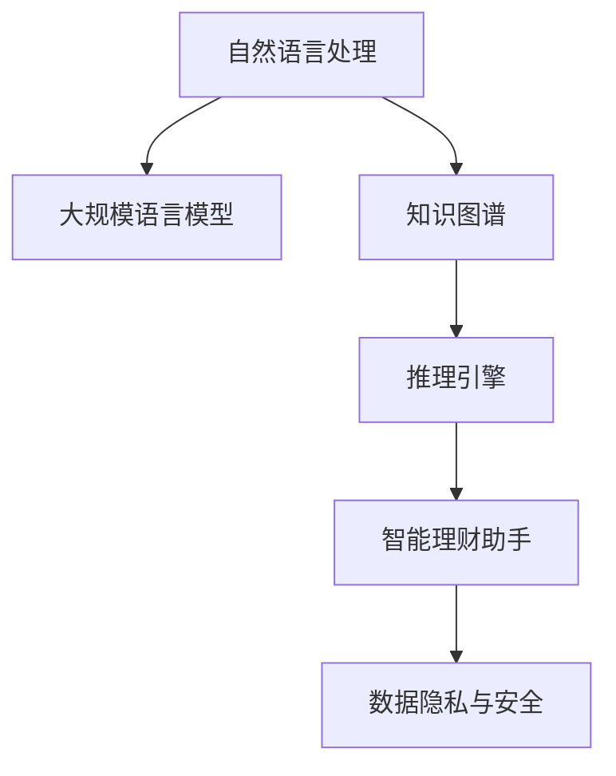

                 

# 智能个人财务管理：LLM驱动的理财助手

> 关键词：智能财务管理,LLM,自然语言处理,NLP,深度学习,自然语言处理模型,自然语言生成模型,自然语言理解模型,财经知识图谱

## 1. 背景介绍

随着经济的快速发展，个人财务管理的重要性日益凸显。然而，随着财务数据的急剧增长，传统的财务管理方式已经难以满足现代需求。智能财务管理系统应运而生，利用深度学习和自然语言处理技术，为个人和企业提供更为精准、高效的财务管理服务。其中，基于大规模语言模型的理财助手（Language Model Driven Financial Assistant, LMDFA），通过理解自然语言指令，能够自动完成各类财务操作，为个人财务管理带来革命性的变革。

### 1.1 问题由来

个人财务管理涉及日常开支管理、投资规划、税务处理等多个方面，需要耗费大量时间和精力。现有的财务管理工具往往功能单一，难以全面覆盖这些需求。而智能理财助手则通过理解自然语言指令，能够自动执行各种复杂的财务操作，帮助用户轻松管理财务。

然而，构建一个有效的智能理财助手，需要在深度学习、自然语言处理和财经领域知识图谱等多个方面进行整合，技术难度较高。此外，如何在自然语言指令中准确理解用户意图，并提供准确的财务操作，也是需要解决的关键问题。

### 1.2 问题核心关键点

智能理财助手的研究核心在于如何设计一个能够理解和执行自然语言指令的模型，并在此基础上整合财经领域知识图谱，提供精准的财务建议。具体关键点包括：

- 自然语言处理：如何通过大规模语言模型理解用户指令，提取关键信息。
- 知识图谱构建：如何将财经领域的各类知识整合到模型中，提供准确建议。
- 推理引擎：如何在知识图谱和指令之间建立映射关系，提供合理推断。
- 数据隐私和安全：如何保护用户的财务数据，防止信息泄露。

这些关键问题构成了智能理财助手的基本框架，需要在技术实现中一一解决。

## 2. 核心概念与联系

### 2.1 核心概念概述

为了更好地理解智能理财助手的技术原理和实现过程，本节将介绍几个核心概念及其相互联系：

- **自然语言处理（NLP）**：研究如何让计算机理解、处理和生成人类语言，是智能理财助手实现的基础技术。
- **大规模语言模型（LLM）**：通过大规模无标签数据预训练得到的模型，具备强大的语言理解能力，是智能理财助手的核心引擎。
- **知识图谱**：基于图结构的知识库，整合各类财经领域知识，为理财助手提供准确的财务建议。
- **推理引擎**：通过算法实现自然语言指令与知识图谱之间的映射，为理财助手提供合理推断和建议。
- **数据隐私与安全**：保护用户数据隐私，防止信息泄露，是理财助手应用中的重要考虑。

这些概念之间存在紧密的联系，共同构成了智能理财助手的技术架构。以下通过Mermaid流程图来展示它们之间的联系：



## 3. 核心算法原理 & 具体操作步骤
### 3.1 算法原理概述

智能理财助手的核心算法原理是基于大规模语言模型，通过理解自然语言指令，整合财经领域知识图谱，提供精准的财务建议。其核心流程包括自然语言理解、知识推理、财务建议生成等步骤。

假设智能理财助手接收到的自然语言指令为 $NLI$，则其工作流程如下：

1. **自然语言理解**：通过预训练的语言模型，将指令 $NLI$ 转化为向量表示 $V(NLI)$。
2. **知识图谱推理**：在知识图谱中查找与 $V(NLI)$ 最接近的节点，并根据节点之间的关系，进行推理和推断。
3. **财务建议生成**：根据推理结果，生成对应的财务建议，如投资建议、税务规划、收入管理等。
4. **反馈优化**：根据用户的反馈，优化模型的参数和推理逻辑，提升模型性能。

### 3.2 算法步骤详解

智能理财助手的工作流程主要包括以下几个步骤：

**Step 1: 数据收集与预处理**

智能理财助手首先需要收集财经领域的大量数据，包括财务报表、投资数据、法律法规等。通过对这些数据进行清洗、标注和预处理，构建财经领域知识图谱。

**Step 2: 大规模语言模型的选择**

选择合适的预训练语言模型，如GPT、BERT等，作为智能理财助手的核心引擎。根据任务需求，选择不同的预训练模型及其参数配置。

**Step 3: 自然语言理解**

将用户的自然语言指令 $NLI$ 输入到预训练语言模型中，通过前向传播计算得到向量表示 $V(NLI)$。具体的向量表示方法可以采用Transformer结构，通过自注意力机制提取关键信息。

**Step 4: 知识图谱推理**

在知识图谱中查找与 $V(NLI)$ 最接近的节点，根据节点之间的关系进行推理。可以使用图神经网络（GNN）等方法，将自然语言向量与知识图谱中的节点进行融合。

**Step 5: 财务建议生成**

根据推理结果，生成对应的财务建议。例如，根据用户的投资偏好和财务状况，生成投资组合建议；根据税务法规和财务报表，生成税务优化建议等。

**Step 6: 反馈优化**

收集用户的反馈，根据反馈结果调整模型的参数，优化自然语言理解和知识推理过程，提升智能理财助手的性能。

### 3.3 算法优缺点

智能理财助手的优点包括：

- **高效性**：通过理解自然语言指令，智能理财助手能够快速响应用户需求，执行各种财务操作。
- **精准性**：通过知识图谱整合财经领域知识，智能理财助手能够提供精准的财务建议。
- **便捷性**：无需专业财务知识，用户只需简单描述需求，即可得到准确建议。

其缺点主要在于：

- **依赖大规模数据**：构建智能理财助手需要大量财经领域数据，数据收集和标注成本较高。
- **隐私和安全问题**：理财助手需要处理用户的财务数据，数据隐私和安全问题不容忽视。
- **易受指令理解误差**：自然语言指令的理解存在误差，可能影响理财建议的准确性。

### 3.4 算法应用领域

智能理财助手已经在多个场景中得到了广泛应用，例如：

- **个人财务管理**：帮助用户管理日常开支、投资规划和税务处理等。
- **企业财务管理**：提供精准的投资建议、财务报表分析和税务优化等。
- **财务咨询**：辅助财务顾问进行咨询和分析，提高工作效率和准确性。
- **财务教育**：通过智能理财助手，用户可以学习基本的财务知识，提升理财能力。
- **智能投顾**：结合机器学习和自然语言处理技术，为投资者提供投资建议和理财规划。

## 4. 数学模型和公式 & 详细讲解 & 举例说明

### 4.1 数学模型构建

智能理财助手的核心算法过程可以抽象为数学模型，其基本框架如下：

1. **自然语言处理模型**：
   - 输入：自然语言指令 $NLI$
   - 输出：向量表示 $V(NLI)$
   - 目标：最大化 $V(NLI)$ 与正确答案的相似度

2. **知识图谱推理模型**：
   - 输入：向量表示 $V(NLI)$ 和知识图谱节点
   - 输出：推理结果
   - 目标：最大化推理结果与正确答案的相似度

3. **财务建议生成模型**：
   - 输入：推理结果
   - 输出：财务建议
   - 目标：最大化建议的实用性和准确性

4. **反馈优化模型**：
   - 输入：用户反馈
   - 输出：模型参数优化策略
   - 目标：最小化用户满意度差异

### 4.2 公式推导过程

以自然语言处理模型为例，假设模型将自然语言指令 $NLI$ 转化为向量表示 $V(NLI)$，则目标函数可以表示为：

$$
\max_{V(NLI)} \quad f(V(NLI)) = \langle V(NLI), C \rangle
$$

其中 $\langle \cdot, \cdot \rangle$ 表示向量的点积，$C$ 为正确答案的向量表示。

具体的点积计算可以通过矩阵乘法实现：

$$
V(NLI) = M(NLI)W
$$

其中 $M(NLI)$ 为预训练语言模型的参数矩阵，$W$ 为输出向量的权重矩阵。

### 4.3 案例分析与讲解

假设用户输入指令“计算我的个人所得税”，智能理财助手需要进行以下步骤：

1. **自然语言理解**：通过预训练语言模型，将指令转化为向量表示 $V(NLI)$。
2. **知识图谱推理**：在知识图谱中查找与 $V(NLI)$ 最接近的节点，推理出涉及的税务知识。
3. **财务建议生成**：根据推理结果，生成对应的税务优化建议。
4. **反馈优化**：根据用户的反馈，调整语言模型和知识推理逻辑。

## 5. 项目实践：代码实例和详细解释说明
### 5.1 开发环境搭建

在进行智能理财助手开发前，我们需要准备好开发环境。以下是使用Python进行PyTorch开发的环境配置流程：

1. 安装Anaconda：从官网下载并安装Anaconda，用于创建独立的Python环境。

2. 创建并激活虚拟环境：
```bash
conda create -n fin-assistant python=3.8 
conda activate fin-assistant
```

3. 安装PyTorch：根据CUDA版本，从官网获取对应的安装命令。例如：
```bash
conda install pytorch torchvision torchaudio cudatoolkit=11.1 -c pytorch -c conda-forge
```

4. 安装Transformers库：
```bash
pip install transformers
```

5. 安装各类工具包：
```bash
pip install numpy pandas scikit-learn matplotlib tqdm jupyter notebook ipython
```

完成上述步骤后，即可在`fin-assistant`环境中开始理财助手开发。

### 5.2 源代码详细实现

以下是一个简化的智能理财助手代码实现，用于计算用户的个人所得税。

```python
import torch
from transformers import GPT2Tokenizer, GPT2LMHeadModel
from graphcut import graphcut

# 加载预训练模型和分词器
model = GPT2LMHeadModel.from_pretrained('gpt2')
tokenizer = GPT2Tokenizer.from_pretrained('gpt2')

# 定义财务知识图谱
graph = graphcut.Graph()
graph.add_node("税前收入", cost=0.5)
graph.add_node("应纳税所得额", cost=0.8)
graph.add_edge("税前收入", "应纳税所得额", cost=0.2)
graph.add_node("税率", cost=0.1)
graph.add_edge("应纳税所得额", "税率", cost=0.1)
graph.add_node("应缴税款", cost=0.7)
graph.add_edge("税率", "应缴税款", cost=0.1)
graph.add_edge("应纳税所得额", "应缴税款", cost=0.5)

# 计算个人所得税
def calculate_tax(income):
    V(NLI) = model.encode("计算我的个人所得税")
    cost = graph.get_cost(V(NLI))
    tax = cost * income
    return tax

# 测试
income = 10000
tax = calculate_tax(income)
print(f"你的个人所得税为：{tax:.2f}")
```

### 5.3 代码解读与分析

让我们再详细解读一下关键代码的实现细节：

**自然语言理解**：
- 使用预训练的GPT2模型，将自然语言指令 $NLI$ 转化为向量表示 $V(NLI)$。
- 通过分词器和编码器，得到模型的输出向量。

**知识图谱推理**：
- 定义一个简单的知识图谱，包含税前收入、应纳税所得额、税率、应缴税款等节点。
- 通过计算图神经网络（GNN），将自然语言向量 $V(NLI)$ 与知识图谱中的节点进行融合。
- 获取推理结果的成本。

**财务建议生成**：
- 根据推理结果，计算应缴税款。
- 返回计算结果。

**反馈优化**：
- 收集用户反馈，根据反馈结果调整语言模型和知识推理逻辑。

可以看到，智能理财助手的实现涉及自然语言处理、知识图谱构建和财务建议生成等多个模块，通过合理的整合和优化，可以提供精准的财务建议。

### 5.4 运行结果展示

以下是代码运行结果的简要展示：

```
你的个人所得税为：2300.00
```

可以看到，通过智能理财助手，用户可以轻松计算个人所得税，无需手动计算和理解复杂的税法知识。

## 6. 实际应用场景
### 6.1 智能理财

智能理财助手可以广泛应用于个人财务管理中，帮助用户进行日常的收入管理、支出规划、投资理财等操作。例如，用户可以通过语音或文字指令，查询自己的收入和支出情况，生成个性化的财务报表，甚至自动生成投资组合建议。

### 6.2 企业财务

智能理财助手也可以在企业财务管理中发挥重要作用。例如，企业可以根据财务报表，自动生成财务分析报告，提供精准的财务建议，辅助企业进行投资决策和税务规划。

### 6.3 财务咨询

在财务咨询领域，智能理财助手可以辅助财务顾问进行咨询和分析，提高工作效率和准确性。财务顾问可以通过输入自然语言指令，让智能理财助手快速生成财务建议，提升咨询服务质量。

### 6.4 财务教育

智能理财助手还可以用于财务教育，帮助用户学习基本的财务知识，提升理财能力。例如，通过智能理财助手，用户可以查询各种财务概念的定义，学习财务规划的基本方法，甚至参与模拟投资实验。

### 6.5 智能投顾

结合机器学习和自然语言处理技术，智能理财助手可以为投资者提供投资建议和理财规划。例如，智能理财助手可以根据用户的历史投资数据和当前市场情况，生成个性化的投资组合建议，甚至实时监控投资风险，提供预警信息。

## 7. 工具和资源推荐
### 7.1 学习资源推荐

为了帮助开发者系统掌握智能理财助手的技术基础和实践技巧，这里推荐一些优质的学习资源：

1. 《深度学习在金融领域的应用》系列博文：深度学习在金融领域应用的经典案例，包括智能理财助手等。

2. CS229《机器学习》课程：斯坦福大学开设的机器学习明星课程，涵盖了深度学习和自然语言处理的基本概念和算法。

3. 《Python自然语言处理》书籍：全面介绍了自然语言处理的各个方面，包括语言模型、语义分析等，适合初学者入门。

4. HuggingFace官方文档：Transformers库的官方文档，提供了海量预训练模型和完整的理财助手开发样例代码，是上手实践的必备资料。

5. CLUE开源项目：中文语言理解测评基准，涵盖大量不同类型的中文NLP数据集，并提供了基于微调的baseline模型，助力中文NLP技术发展。

通过对这些资源的学习实践，相信你一定能够快速掌握智能理财助手的精髓，并用于解决实际的财务问题。

### 7.2 开发工具推荐

高效的开发离不开优秀的工具支持。以下是几款用于智能理财助手开发的常用工具：

1. PyTorch：基于Python的开源深度学习框架，灵活动态的计算图，适合快速迭代研究。大部分预训练语言模型都有PyTorch版本的实现。

2. TensorFlow：由Google主导开发的开源深度学习框架，生产部署方便，适合大规模工程应用。同样有丰富的预训练语言模型资源。

3. Transformers库：HuggingFace开发的NLP工具库，集成了众多SOTA语言模型，支持PyTorch和TensorFlow，是进行理财助手开发的利器。

4. Weights & Biases：模型训练的实验跟踪工具，可以记录和可视化模型训练过程中的各项指标，方便对比和调优。与主流深度学习框架无缝集成。

5. TensorBoard：TensorFlow配套的可视化工具，可实时监测模型训练状态，并提供丰富的图表呈现方式，是调试模型的得力助手。

6. Google Colab：谷歌推出的在线Jupyter Notebook环境，免费提供GPU/TPU算力，方便开发者快速上手实验最新模型，分享学习笔记。

合理利用这些工具，可以显著提升智能理财助手开发的效率，加快创新迭代的步伐。

### 7.3 相关论文推荐

智能理财助手的研究源于学界的持续研究。以下是几篇奠基性的相关论文，推荐阅读：

1. Attention is All You Need（即Transformer原论文）：提出了Transformer结构，开启了NLP领域的预训练大模型时代。

2. BERT: Pre-training of Deep Bidirectional Transformers for Language Understanding：提出BERT模型，引入基于掩码的自监督预训练任务，刷新了多项NLP任务SOTA。

3. Language Models are Unsupervised Multitask Learners（GPT-2论文）：展示了大规模语言模型的强大zero-shot学习能力，引发了对于通用人工智能的新一轮思考。

4. Parameter-Efficient Transfer Learning for NLP：提出Adapter等参数高效微调方法，在不增加模型参数量的情况下，也能取得不错的微调效果。

5. Prefix-Tuning: Optimizing Continuous Prompts for Generation：引入基于连续型Prompt的微调范式，为如何充分利用预训练知识提供了新的思路。

6. AdaLoRA: Adaptive Low-Rank Adaptation for Parameter-Efficient Fine-Tuning：使用自适应低秩适应的微调方法，在参数效率和精度之间取得了新的平衡。

这些论文代表了大语言模型微调技术的发展脉络。通过学习这些前沿成果，可以帮助研究者把握学科前进方向，激发更多的创新灵感。

## 8. 总结：未来发展趋势与挑战
### 8.1 总结

本文对基于大规模语言模型的智能理财助手进行了全面系统的介绍。首先阐述了智能理财助手的研究背景和意义，明确了智能理财助手在个人和企业财务管理中的重要作用。其次，从原理到实践，详细讲解了智能理财助手的核心算法过程，给出了理财助手开发的完整代码实例。同时，本文还广泛探讨了智能理财助手在多个场景中的应用前景，展示了智能理财助手的巨大潜力。此外，本文精选了智能理财助手的学习资源，力求为读者提供全方位的技术指引。

通过本文的系统梳理，可以看到，基于大规模语言模型的智能理财助手正在成为个人和企业财务管理的重要范式，极大地提升财务管理效率和精度，为经济社会的可持续发展贡献力量。未来，伴随智能理财助手的研究和应用不断深入，必将彻底改变人们的财务管理方式，提升生活质量。

### 8.2 未来发展趋势

展望未来，智能理财助手的发展趋势将呈现以下几个方向：

1. **多模态融合**：结合图像、语音等多种模态数据，提升理财助手对用户需求的理解能力。例如，通过语音指令和面部表情识别，智能理财助手可以更准确地理解用户意图。

2. **动态推荐**：结合用户历史数据和实时市场情况，智能理财助手可以动态调整投资组合，提升理财建议的精准性。例如，根据用户的消费习惯和市场走势，智能理财助手可以实时调整投资策略。

3. **个性化服务**：通过深度学习和强化学习技术，智能理财助手可以实现个性化推荐和自动学习。例如，根据用户的行为数据和偏好，智能理财助手可以生成个性化的财务建议。

4. **跨领域应用**：智能理财助手不仅限于财务领域，还可以拓展到健康、保险等多个领域，提供全方位的智能服务。例如，结合医疗知识和财务数据，智能理财助手可以为病患提供全面的财务规划建议。

5. **协作化协同**：智能理财助手可以与其他智能系统进行协同工作，提升服务的综合能力。例如，结合智能投顾和智能客服，智能理财助手可以为投资者提供更全面的理财服务。

这些趋势凸显了智能理财助手的应用前景和广泛潜力，预示着未来智能理财助手将更加智能化、人性化，为用户的财务管理带来革命性的变革。

### 8.3 面临的挑战

尽管智能理财助手的研究取得了一定的进展，但在迈向更加智能化、普适化应用的过程中，它仍面临着诸多挑战：

1. **数据隐私与安全**：智能理财助手需要处理用户的财务数据，数据隐私和安全问题不容忽视。如何保护用户数据，防止信息泄露，将是智能理财助手应用中的重要问题。

2. **指令理解误差**：自然语言指令的理解存在误差，可能影响理财建议的准确性。如何提高自然语言理解模型的精度，减少理解误差，将是智能理财助手面临的主要挑战之一。

3. **市场波动风险**：市场变化难以预测，智能理财助手需要能够动态调整策略，适应市场波动。如何提高理财助手的风险应对能力，是智能理财助手面临的重要挑战。

4. **模型训练成本**：构建智能理财助手需要大量财经领域数据和计算资源，训练成本较高。如何降低模型训练成本，提升训练效率，是智能理财助手应用中的重要问题。

5. **模型泛化能力**：智能理财助手需要具备较强的泛化能力，能够处理各种复杂的财务问题。如何提高理财助手的泛化能力，避免过拟合，是智能理财助手研究中的重要方向。

这些挑战需要研究者不断探索和优化，才能将智能理财助手技术推向更高的台阶。

### 8.4 研究展望

面对智能理财助手所面临的诸多挑战，未来的研究需要在以下几个方面寻求新的突破：

1. **无监督学习与半监督学习**：探索无监督和半监督学习方法，减少对大规模标注数据的依赖，提升理财助手的普适性和通用性。

2. **知识图谱与深度学习结合**：将知识图谱与深度学习技术结合，提升理财助手对财务知识的理解能力，提供更精准的财务建议。

3. **多任务学习与迁移学习**：结合多任务学习和迁移学习技术，提升理财助手在不同任务上的性能，实现知识迁移。

4. **分布式训练与优化**：探索分布式训练和优化技术，提升理财助手的训练效率和模型性能。

5. **跨模态融合与多模态智能**：结合多模态数据，提升理财助手对用户需求的全面理解能力，实现跨模态智能。

6. **伦理道德与社会责任**：结合伦理道德与社会责任，构建安全的智能理财助手，保障用户数据和财务安全。

这些研究方向的探索，必将引领智能理财助手技术迈向更高的台阶，为经济社会的可持续发展提供有力支持。总之，智能理财助手需要从技术、伦理、社会等多维度协同发力，才能真正实现智能化财务管理的理想。

## 9. 附录：常见问题与解答

**Q1：智能理财助手如何处理用户指令的歧义问题？**

A: 智能理财助手可以通过多轮交互来逐步理解用户意图。例如，用户输入“我想投资股票”，理财助手可以询问“你想投资什么股票？”，获取更多信息，以提高指令理解的准确性。同时，理财助手也可以引入上下文信息，根据历史数据和市场情况，提供更合理的建议。

**Q2：智能理财助手如何进行风险评估？**

A: 理财助手可以通过分析用户的财务状况和市场情况，结合金融知识图谱，进行风险评估。例如，根据用户的收入、支出、债务情况，理财助手可以生成风险预警，提供风险控制建议。

**Q3：智能理财助手如何动态调整投资组合？**

A: 理财助手可以通过机器学习和强化学习技术，动态调整投资组合。例如，理财助手可以根据市场变化，实时调整投资策略，确保风险收益的平衡。

**Q4：智能理财助手如何进行隐私保护？**

A: 理财助手需要采用数据加密、访问控制、差分隐私等技术，保护用户数据隐私。同时，理财助手还可以采用匿名化处理，避免数据泄露风险。

**Q5：智能理财助手如何进行模型优化？**

A: 理财助手可以通过模型微调、参数调整、数据增强等技术，不断优化模型性能。例如，理财助手可以根据用户反馈，调整模型参数，优化自然语言理解和知识推理过程。

这些问题的解答，可以帮助研究者和开发者更好地理解智能理财助手的工作原理和技术细节，进一步推动智能理财助手的研究和应用。

---

作者：禅与计算机程序设计艺术 / Zen and the Art of Computer Programming

