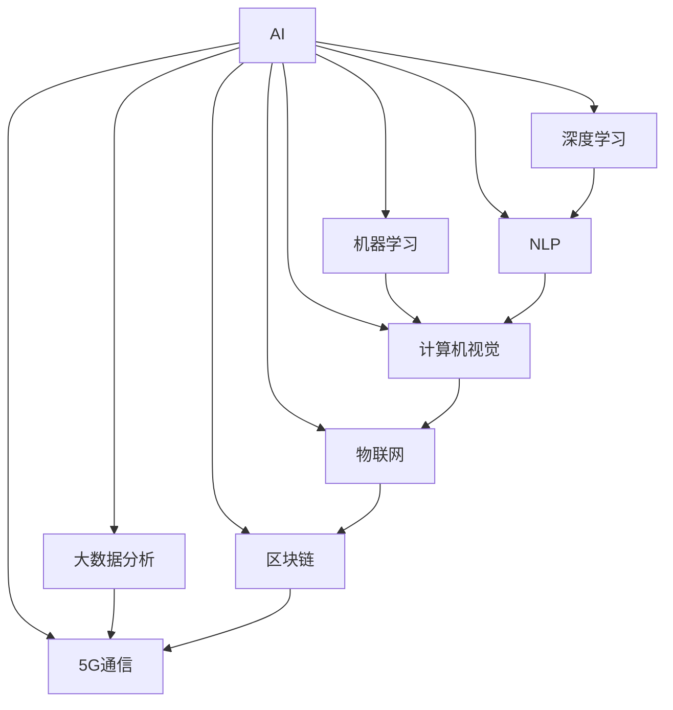

                 

## 1. 背景介绍

### 1.1 问题由来

在数字化时代，传统的行业运行模式和商业模式面临着前所未有的挑战。数字技术的飞速发展，正在重塑各行各业的生态系统，带来新的机遇和变革。智能化、数字化、网络化、服务化，成为新时代企业发展的必由之路。

然而，由于行业认知、技术积累、资源投入等方面的限制，许多传统行业在数字化转型的道路上步履蹒跚，甚至陷入了数字鸿沟。如何借助新技术突破瓶颈，实现产业升级，成为当下亟需解决的问题。

### 1.2 问题核心关键点

本文章将聚焦于如何利用新技术，特别是人工智能（AI）技术，实现对传统行业的颠覆式创新。通过引入AI技术，传统行业可以实现效率提升、成本优化、客户体验改善和模式创新，从而走出困境，实现高质量发展。

**核心关键点**：

1. **智能技术赋能**：将AI技术应用于企业的决策、运营、产品等环节，提升效率和质量。
2. **数据驱动决策**：基于大数据和AI技术，精准预测市场需求，优化资源配置。
3. **客户体验提升**：通过个性化推荐、智能客服等手段，提升客户满意度和忠诚度。
4. **业务模式创新**：结合AI和新兴技术，如区块链、物联网、5G等，打造全新的商业模式。
5. **人工智能伦理**：在利用AI技术的同时，需关注隐私保护、伦理安全等问题，确保技术应用的合规性和安全性。

### 1.3 问题研究意义

通过本文章，希望能为希望利用AI技术实现传统行业升级的企业提供全面、系统的指导，帮助他们理解和应用新技术，最终实现产业数字化、智能化、服务化。这不仅有助于提升企业的市场竞争力和盈利能力，还能为社会的整体数字化转型贡献力量。

## 2. 核心概念与联系

### 2.1 核心概念概述

为更好地理解利用AI技术颠覆传统行业的方法，本文将介绍以下核心概念：

1. **人工智能（AI）**：利用计算机模拟人脑思考、学习和解决问题的能力，实现智能决策、自动化操作和智能化服务。
2. **大数据分析**：通过收集、存储、处理和分析大规模数据，实现数据驱动的决策支持。
3. **机器学习（ML）**：让机器通过数据学习和优化算法，实现自动化的模式识别和预测。
4. **深度学习（DL）**：基于神经网络结构，模拟人脑神经元处理信息，适用于处理高维、非线性问题。
5. **自然语言处理（NLP）**：使机器能理解、处理和生成自然语言，实现智能对话和信息抽取。
6. **计算机视觉（CV）**：让机器“看”见并理解图像和视频内容，实现自动检测和识别。
7. **物联网（IoT）**：通过互联网连接和控制各种设备和传感器，实现智能互联和自动控制。
8. **区块链**：一种去中心化的分布式账本技术，实现安全的交易和数据共享。
9. **5G通信**：新一代无线通信技术，提供更高的网络速度和更低的延迟，支持海量设备互联。

这些核心概念通过以下Mermaid流程图来展示其联系和应用场景：



这个流程图展示了AI技术与其他新兴技术的紧密联系和应用场景，共同构成了颠覆传统行业的新兴技术框架。

## 3. 核心算法原理 & 具体操作步骤

### 3.1 算法原理概述

利用AI技术颠覆传统行业，本质上是一种基于数据的智能优化过程。通过数据驱动和智能算法，实现对企业决策、运营和客户体验的全方位优化。

核心算法流程如下：

1. **数据收集与处理**：通过传感器、终端设备、互联网等渠道，收集行业数据。
2. **数据清洗与特征提取**：对收集到的数据进行清洗和预处理，提取有价值的特征。
3. **模型训练与优化**：选择合适的算法和模型，如机器学习、深度学习、强化学习等，基于历史数据进行模型训练和优化。
4. **应用与反馈**：将训练好的模型应用于企业运营和客户服务中，收集反馈信息，持续优化模型和算法。

### 3.2 算法步骤详解

**步骤1：数据收集与处理**

1. **数据源识别**：明确需要采集的数据类型，如客户行为数据、运营绩效数据、设备运行数据等。
2. **数据采集**：通过传感器、智能终端、互联网接口等手段，收集数据。
3. **数据清洗**：对收集的数据进行去重、去噪、异常值处理，确保数据质量。
4. **特征提取**：从清洗后的数据中提取有意义的特征，如客户行为特征、设备运行状态等。

**步骤2：模型训练与优化**

1. **选择合适的算法**：根据具体业务需求，选择合适的机器学习或深度学习算法。
2. **模型构建与训练**：基于提取的特征，构建模型，使用历史数据进行训练和验证。
3. **模型优化**：通过调整算法参数、增加训练数据等手段，优化模型性能。
4. **模型部署**：将训练好的模型部署到生产环境中，实现实时预测和决策。

**步骤3：应用与反馈**

1. **业务场景集成**：将训练好的模型集成到企业的业务场景中，如智能客服、供应链优化、设备维护等。
2. **实时预测与决策**：基于新采集的数据，实时进行预测和决策。
3. **持续反馈与优化**：收集应用过程中的反馈信息，持续优化模型和算法。

### 3.3 算法优缺点

**优点**：

1. **效率提升**：AI技术能够自动化处理大量数据和复杂任务，大幅提升工作效率。
2. **成本优化**：减少人力和时间成本，提高资源利用率。
3. **决策精准**：基于数据驱动的决策过程，提高决策的准确性和科学性。
4. **客户体验提升**：通过个性化服务和智能客服，提升客户满意度和忠诚度。
5. **模式创新**：结合AI技术和新兴技术，打造全新的商业模式。

**缺点**：

1. **数据隐私和安全**：数据收集和处理过程中存在隐私泄露和数据安全风险。
2. **算法复杂度**：复杂算法需要大量的计算资源和时间，应用门槛较高。
3. **数据质量要求高**：模型的效果依赖于数据的质量和完整性。
4. **技术门槛高**：需要专业的技术团队进行模型构建和应用部署。
5. **伦理和法律问题**：AI技术的应用需遵守相关伦理和法律法规，避免滥用。

### 3.4 算法应用领域

AI技术可以应用于各个行业，以下列举几个典型领域：

1. **金融**：利用AI进行风险管理、欺诈检测、量化交易、智能投顾等。
2. **制造**：利用AI进行生产优化、设备预测性维护、质量控制等。
3. **医疗**：利用AI进行疾病预测、诊断、个性化治疗等。
4. **零售**：利用AI进行客户分析、库存管理、智能推荐等。
5. **物流**：利用AI进行路径优化、需求预测、配送调度等。
6. **农业**：利用AI进行土壤分析、病虫害检测、精准农业等。
7. **能源**：利用AI进行能源消耗优化、智能电网、可再生能源管理等。

## 4. 数学模型和公式 & 详细讲解 & 举例说明

### 4.1 数学模型构建

**4.1.1 模型概述**

基于AI技术的颠覆式创新，可以构建以下数学模型：

- **预测模型**：用于预测未来趋势和行为，如销售预测、设备故障预测等。
- **优化模型**：用于优化资源配置和业务流程，如供应链优化、生产调度和库存管理等。
- **分类模型**：用于分类和识别，如客户细分、欺诈检测、情感分析等。
- **回归模型**：用于数值预测，如客户价值预测、能源消耗预测等。
- **序列模型**：用于处理时间序列数据，如股票价格预测、智能客服对话等。

**4.1.2 模型选择**

根据具体业务需求，选择合适的模型类型：

- **线性回归**：适用于简单的数值预测任务。
- **逻辑回归**：适用于二分类任务，如客户流失预测。
- **决策树**：适用于分类和决策任务，如客户细分。
- **随机森林**：适用于复杂的分类和预测任务。
- **支持向量机**：适用于非线性分类和回归任务。
- **神经网络**：适用于高维、非线性任务，如图像识别、自然语言处理等。

**4.1.3 模型训练**

使用训练数据对模型进行训练，优化模型参数：

$$
\theta = \mathop{\arg\min}_{\theta} \frac{1}{N}\sum_{i=1}^N \ell(y_i, f_{\theta}(x_i))
$$

其中，$\theta$ 为模型参数，$N$ 为样本数，$y_i$ 为真实标签，$f_{\theta}(x_i)$ 为模型预测。$\ell$ 为损失函数，常见的有均方误差、交叉熵等。

### 4.2 公式推导过程

**4.2.1 线性回归**

线性回归模型为：

$$
y = \beta_0 + \beta_1 x_1 + \beta_2 x_2 + \ldots + \beta_n x_n + \epsilon
$$

其中，$y$ 为预测值，$\beta_0, \beta_1, \ldots, \beta_n$ 为回归系数，$x_1, \ldots, x_n$ 为特征变量，$\epsilon$ 为随机误差。

回归系数的最小二乘估计为：

$$
\hat{\beta} = (X^TX)^{-1}X^Ty
$$

其中，$X$ 为特征矩阵，$y$ 为真实标签向量。

**4.2.2 逻辑回归**

逻辑回归模型为：

$$
\log\left(\frac{p(y=1|x)}{1-p(y=1|x)}\right) = \beta_0 + \beta_1 x_1 + \beta_2 x_2 + \ldots + \beta_n x_n
$$

其中，$p(y=1|x)$ 为正类概率，$\beta_0, \beta_1, \ldots, \beta_n$ 为回归系数。

回归系数的最小化目标是：

$$
\mathop{\arg\min}_{\beta} \frac{1}{N}\sum_{i=1}^N \ell(y_i, f_{\beta}(x_i))
$$

其中，$\ell$ 为交叉熵损失函数。

### 4.3 案例分析与讲解

**案例1：客户流失预测**

1. **数据收集**：收集客户基本信息、购买记录、服务评价等数据。
2. **数据预处理**：清洗和特征提取，如计算客户消费频率、服务满意度等。
3. **模型选择**：选择逻辑回归模型。
4. **模型训练**：基于历史数据进行模型训练。
5. **模型应用**：实时预测客户流失概率，优化客户留存策略。

**案例2：供应链优化**

1. **数据收集**：收集生产、库存、物流等数据。
2. **数据预处理**：清洗和特征提取，如计算库存周转率、订单响应时间等。
3. **模型选择**：选择线性回归或随机森林模型。
4. **模型训练**：基于历史数据进行模型训练。
5. **模型应用**：实时优化生产调度和库存管理，提升供应链效率。

## 5. 项目实践：代码实例和详细解释说明

### 5.1 开发环境搭建

**5.1.1 Python环境配置**

1. **安装Anaconda**：从官网下载并安装Anaconda，用于创建独立的Python环境。

```bash
conda create -n myenv python=3.8
conda activate myenv
```

2. **安装Pandas和Scikit-learn**：

```bash
conda install pandas scikit-learn
```

3. **安装TensorFlow和Keras**：

```bash
pip install tensorflow keras
```

**5.1.2 数据准备**

1. **数据来源**：收集所需的数据，存储在本地或云存储中。
2. **数据清洗**：使用Python代码对数据进行清洗和预处理，如缺失值处理、异常值检测等。
3. **数据分割**：将数据分为训练集、验证集和测试集。

### 5.2 源代码详细实现

**5.2.1 数据预处理**

```python
import pandas as pd
import numpy as np
from sklearn.model_selection import train_test_split

# 读取数据
data = pd.read_csv('data.csv')

# 数据清洗
data = data.dropna()

# 特征工程
data['feature1'] = data['col1'] + data['col2']
data['feature2'] = np.log(data['col3'])

# 数据分割
train, test = train_test_split(data, test_size=0.2)
```

**5.2.2 模型训练**

```python
from sklearn.linear_model import LinearRegression
from sklearn.metrics import mean_squared_error

# 模型选择
model = LinearRegression()

# 模型训练
train_x = train[['feature1', 'feature2']]
train_y = train['target']
model.fit(train_x, train_y)

# 模型验证
test_x = test[['feature1', 'feature2']]
test_y = test['target']
mse = mean_squared_error(test_y, model.predict(test_x))
print(f"Validation MSE: {mse}")
```

**5.2.3 模型应用**

```python
# 实时数据处理和模型预测
def predict(real_data):
    real_data = np.array(real_data)
    predictions = model.predict(real_data)
    return predictions
```

### 5.3 代码解读与分析

**5.3.1 数据预处理**

- **缺失值处理**：通过`dropna()`函数删除缺失值。
- **特征工程**：通过组合特征和转换特征，提取有意义的特征。
- **数据分割**：通过`train_test_split()`函数将数据分割为训练集和测试集。

**5.3.2 模型训练**

- **模型选择**：选择线性回归模型。
- **模型训练**：使用`fit()`函数训练模型。
- **模型验证**：使用`mean_squared_error()`函数计算验证集上的均方误差。

**5.3.3 模型应用**

- **实时数据处理**：将实时数据转换为模型输入。
- **模型预测**：使用`predict()`函数进行预测。

### 5.4 运行结果展示

- **模型训练结果**：打印训练集和验证集的MSE值。
- **模型预测结果**：展示模型对新数据的预测结果。

## 6. 实际应用场景

### 6.1 智能制造

智能制造结合了AI技术和物联网技术，实现生产自动化和智能化。通过传感器和智能设备收集生产数据，利用AI进行预测性维护、质量控制和生产调度。

### 6.2 智慧医疗

智慧医疗利用AI进行疾病诊断、治疗方案推荐、病历分析等。通过收集患者的电子病历、医学影像、基因数据等，构建医学知识图谱，实现精准医疗。

### 6.3 智能交通

智能交通利用AI进行交通流量预测、路径优化、自动驾驶等。通过实时收集交通数据，分析交通模式和行为，实现智能交通管理。

### 6.4 未来应用展望

- **AI+边缘计算**：结合AI和边缘计算，实现实时数据处理和决策，降低延迟，提高效率。
- **AI+区块链**：利用区块链的不可篡改性，保护AI模型的数据隐私和安全。
- **AI+物联网**：通过AI技术优化物联网设备的运行和维护，提升设备和系统的智能化水平。
- **AI+大数据**：结合大数据分析和AI技术，实现数据的深度挖掘和智能决策。

## 7. 工具和资源推荐

### 7.1 学习资源推荐

1. **Coursera**：提供由顶尖大学和公司提供的AI相关课程，涵盖机器学习、深度学习、计算机视觉等多个领域。
2. **Kaggle**：提供丰富的数据集和比赛，通过实践提升AI技能。
3. **Udacity**：提供AI相关课程，包括自动驾驶、机器人、自然语言处理等。
4. **Google AI**：提供免费的AI课程和资源，涵盖AI基础、实践项目等。

### 7.2 开发工具推荐

1. **Jupyter Notebook**：用于编写和执行Python代码，支持数据可视化、代码解释等。
2. **TensorBoard**：用于可视化模型训练过程，监控训练进度和结果。
3. **Github**：用于存储和分享代码，方便协作和版本管理。
4. **PyTorch Lightning**：用于快速搭建和训练深度学习模型，支持分布式训练和自动化调参。

### 7.3 相关论文推荐

1. **Deep Learning**（Goodfellow et al.）：介绍深度学习的基本原理和应用，是AI领域的经典书籍。
2. **Hands-On Machine Learning with Scikit-Learn, Keras, and TensorFlow**（Aurélien Géron）：详细讲解机器学习和深度学习的实践技巧，涵盖模型构建、调参、优化等。
3. **Natural Language Processing with Transformers**（Thomas Wolf）：介绍Transformer模型及其在自然语言处理中的应用。

## 8. 总结：未来发展趋势与挑战

### 8.1 研究成果总结

本文章系统介绍了AI技术在颠覆传统行业中的应用，从理论到实践，展示了利用AI技术进行智能优化的流程和方法。AI技术在各个行业的成功应用，证明了其强大的潜力。

### 8.2 未来发展趋势

1. **自动化和智能化**：未来AI技术将进一步实现自动化和智能化，提升生产效率和决策质量。
2. **跨领域融合**：AI技术将与其他新兴技术如物联网、区块链、5G等深度融合，形成新的技术生态。
3. **数据驱动决策**：基于大数据和AI技术，实现数据驱动的决策支持，提升企业竞争力。
4. **持续学习和优化**：AI模型将具备持续学习和优化能力，不断提高性能。
5. **伦理和安全性**：AI技术的应用需遵守相关伦理和法律法规，确保数据安全和隐私保护。

### 8.3 面临的挑战

1. **数据隐私和安全**：AI技术的应用需考虑数据隐私和安全问题，防止数据泄露和滥用。
2. **技术门槛高**：AI技术的复杂性和应用门槛较高，需要专业的技术团队进行部署和维护。
3. **伦理和法律问题**：AI技术的应用需遵守相关伦理和法律法规，避免滥用和歧视。
4. **模型泛化性**：AI模型需具备良好的泛化性，能够在不同的场景和数据上表现稳定。
5. **计算资源需求高**：AI技术的实现需大量的计算资源，需考虑成本和效率。

### 8.4 研究展望

未来AI技术在颠覆传统行业中的应用将更加广泛和深入。通过持续的技术创新和应用实践，相信AI技术将为各行各业带来深刻的变革和突破。

## 9. 附录：常见问题与解答

**Q1: 如何选择合适的AI模型？**

A: 根据具体业务需求，选择适合的AI模型。常用模型包括线性回归、逻辑回归、决策树、随机森林、支持向量机、神经网络等。

**Q2: 如何处理数据隐私问题？**

A: 通过数据加密、去标识化等手段，保护数据隐私和安全。同时遵守相关法律法规，确保数据使用的合规性。

**Q3: 如何优化模型性能？**

A: 通过调整算法参数、增加训练数据、优化特征工程等手段，提升模型性能。同时进行模型调参和超参数优化，找到最佳模型配置。

**Q4: 如何部署AI模型？**

A: 使用容器化技术如Docker，将AI模型打包为标准镜像，部署到云平台或本地服务器。使用API接口实现模型调用和数据输入输出。

**Q5: 如何确保AI模型的安全性？**

A: 通过数据加密、访问控制、审计日志等手段，确保AI模型的安全性。定期进行安全评估和漏洞修复，防止模型滥用。

---

作者：禅与计算机程序设计艺术 / Zen and the Art of Computer Programming

