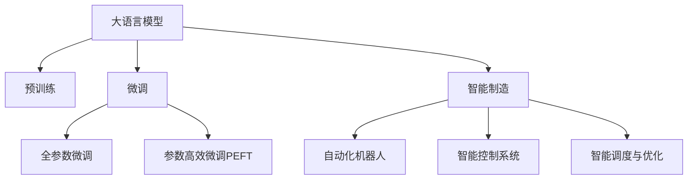

                 

# 智能制造：LLM 驱动的工业革命

## 1. 背景介绍

在21世纪的工业领域，智能化、自动化和数字化转型正在改变传统制造业的面貌。随着互联网、大数据、人工智能等技术的飞速发展，从设计、生产到运维的各个环节都正在经历深刻的变革。其中，大语言模型(LLM)的应用，以其强大的自然语言处理能力，为智能制造注入了新的动力，推动了一场工业革命的浪潮。

### 1.1 工业4.0与智能制造

第四次工业革命（Industrial 4.0），以信息通信技术（ICT）为核心，融合了云计算、物联网（IoT）、大数据分析、人工智能（AI）等多种新兴技术，致力于实现高度自动化、智能化、互联化的生产制造模式。智能制造作为工业4.0的重要组成部分，通过数据驱动和人工智能技术，推动制造业的智能化、灵活性和可扩展性。

智能制造的核心在于：
1. **数据集成与分析**：通过传感器和智能设备收集海量生产数据，运用大数据分析技术进行实时监控和预测。
2. **自动化与柔性生产**：引入机器人、智能控制系统等自动化设备，实现生产线的自动化和柔性化调整。
3. **智能决策与优化**：运用机器学习、优化算法等AI技术，辅助决策者进行生产优化和资源配置。

### 1.2 大语言模型（LLM）的崛起

大语言模型是一类基于深度学习的神经网络模型，通过大规模无监督预训练和有监督微调，具备强大的自然语言处理能力。LLM的崛起，为智能制造提供了全新的语言理解和生成能力，推动了智能制造的进一步发展。

大语言模型通过学习和理解大量的自然语言数据，能够进行复杂的文本生成、问答、翻译、文本分类、情感分析等任务，这些能力在智能制造中有着广泛的应用前景：
1. **机器视觉与图像理解**：通过自然语言处理，将视觉数据转化为易于理解的文本描述，辅助工业机器人和智能设备进行任务识别和决策。
2. **自动化指令与控制**：通过自然语言指令，自动控制生产设备，执行复杂工艺流程。
3. **质量检测与分析**：通过文本描述和情感分析，实时监控产品质量，辅助进行缺陷检测和诊断。
4. **生产调度与优化**：通过自然语言处理，生成生产调度指令和优化建议，提高生产效率和灵活性。

## 2. 核心概念与联系

### 2.1 核心概念概述

为更好地理解LLM在智能制造中的应用，本节将介绍几个密切相关的核心概念：

- **大语言模型（Large Language Model, LLM）**：以自回归(如GPT)或自编码(如BERT)模型为代表的大规模预训练语言模型。通过在大规模无标签文本语料上进行预训练，学习通用的语言表示，具备强大的语言理解和生成能力。

- **预训练(Pre-training)**：指在大规模无标签文本语料上，通过自监督学习任务训练通用语言模型的过程。常见的预训练任务包括言语建模、遮挡语言模型等。预训练使得模型学习到语言的通用表示。

- **微调(Fine-tuning)**：指在预训练模型的基础上，使用下游任务的少量标注数据，通过有监督学习优化模型在特定任务上的性能。通常只需要调整顶层分类器或解码器，并以较小的学习率更新全部或部分的模型参数。

- **迁移学习(Transfer Learning)**：指将一个领域学习到的知识，迁移应用到另一个不同但相关的领域的学习范式。大模型的预训练-微调过程即是一种典型的迁移学习方式。

- **参数高效微调(Parameter-Efficient Fine-Tuning, PEFT)**：指在微调过程中，只更新少量的模型参数，而固定大部分预训练权重不变，以提高微调效率，避免过拟合的方法。

- **智能制造（Smart Manufacturing）**：利用大数据、物联网、云计算、人工智能等技术，实现生产过程的智能化、自动化和数字化，提高生产效率和质量，降低生产成本，推动制造业的升级转型。

- **自动化机器人（Automated Robotics）**：通过编程或示教，自动执行重复性高、规则明确的任务，辅助生产操作和质检。

- **智能控制系统（Smart Control Systems）**：结合传感器、物联网技术，实现对生产设备的实时监控和自动控制。

- **智能调度与优化（Smart Scheduling & Optimization）**：利用算法和模型，自动生成生产调度方案和优化建议，提升生产效率和资源利用率。

这些核心概念之间的逻辑关系可以通过以下Mermaid流程图来展示：



这个流程图展示了大语言模型的核心概念及其之间的关系：

1. 大语言模型通过预训练获得基础能力。
2. 微调是对预训练模型进行任务特定的优化，可以分为全参数微调和参数高效微调（PEFT）。
3. 智能制造系统利用大语言模型提供的语言理解能力，实现生产过程的智能化和自动化。
4. 自动化机器人和智能控制系统借助自然语言指令，执行复杂的生产任务。
5. 智能调度与优化系统利用自然语言处理，生成生产调度指令和优化建议。

## 3. 核心算法原理 & 具体操作步骤
### 3.1 算法原理概述

基于LLM的智能制造系统，其核心思想是利用LLM的自然语言处理能力，为生产过程注入智能化决策和自动化执行。具体来说，智能制造系统通过以下几个步骤实现：

1. **数据采集与集成**：从生产设备、传感器、物联网设备中采集数据，并集成到统一的数据平台上。
2. **自然语言处理**：将采集到的数据转化为易于理解和分析的自然语言文本。
3. **指令生成与执行**：基于LLM生成自然语言指令，控制自动化机器人执行生产任务。
4. **实时监控与反馈**：通过自然语言处理，实时监控生产过程，生成优化建议。

### 3.2 算法步骤详解

基于LLM的智能制造系统通常包括以下几个关键步骤：

**Step 1: 数据采集与预处理**
- 通过传感器、智能设备等采集生产数据，包括温度、压力、湿度、位置、速度等。
- 将采集到的数据进行清洗、整合，并转化为易于自然语言处理的数据格式。

**Step 2: 自然语言处理**
- 使用大语言模型将数据转化为自然语言文本，描述生产状态和异常情况。
- 对文本进行情感分析、实体识别等处理，提取关键信息。

**Step 3: 指令生成与执行**
- 根据处理后的文本，利用LLM生成自然语言指令，如“将温度调高至90度”、“调整机器人至位置B”等。
- 将自然语言指令转化为可执行的命令，发送至自动化机器人和智能控制系统执行。

**Step 4: 实时监控与反馈**
- 持续采集生产数据，进行实时监控。
- 利用LLM进行自然语言处理，实时分析生产状态，生成优化建议。
- 将优化建议转化为自然语言指令，发送至自动化机器人和智能控制系统进行执行。

**Step 5: 生产调度与优化**
- 基于LLM处理的数据和指令，生成生产调度方案和优化建议。
- 利用优化算法和模型，自动调整生产参数和资源配置。

### 3.3 算法优缺点

基于LLM的智能制造系统具有以下优点：
1. 智能化决策：利用自然语言处理能力，智能分析生产数据，生成优化建议。
2. 自动化执行：通过自然语言指令，自动控制生产设备和机器人，提高生产效率和精度。
3. 灵活适应性：LLM具备强大的泛化能力，适用于多种生产场景和任务。
4. 多模态融合：结合视觉、语音、文本等多模态信息，实现全面、准确的感知和决策。

同时，该方法也存在一定的局限性：
1. 数据依赖：智能制造系统的性能很大程度上依赖于数据的准确性和完整性。
2. 语言理解误差：自然语言指令的理解和执行过程中可能存在误差，影响系统的稳定性。
3. 模型复杂度：大语言模型参数量庞大，训练和推理需要高计算资源。
4. 隐私安全：智能制造系统处理的数据涉及企业机密，需采取严格的隐私保护措施。

尽管存在这些局限性，但就目前而言，基于LLM的智能制造系统仍然是大规模自动化和智能化生产的重要技术手段。未来相关研究的主要方向在于如何进一步提高LLM的理解能力和执行准确性，降低其对数据和计算资源的需求，同时确保系统的安全性与隐私性。

### 3.4 算法应用领域

基于大语言模型的智能制造系统已经在诸多领域得到应用，例如：

- **汽车制造**：利用LLM分析生产数据，优化生产流程，提高生产效率和质量。
- **电子设备生产**：通过自然语言处理和自动化机器人，实现复杂电子元件的组装和测试。
- **食品加工**：利用LLM实时监控生产过程，生成优化建议，提升食品加工的自动化和智能化水平。
- **医药制造**：通过自然语言处理，辅助药品生产调度和质量检测，提高药品生产的效率和安全性。
- **物流仓储**：利用LLM分析仓储数据，优化货物存储和运输，提升物流效率和仓储管理水平。

除了上述这些典型应用外，LLM在智能制造领域的应用还在不断拓展，为各行各业带来新的发展机遇。

## 4. 数学模型和公式 & 详细讲解  
### 4.1 数学模型构建

本节将使用数学语言对基于LLM的智能制造系统进行更加严格的刻画。

记智能制造系统中的生产数据为 $D=\{x_i, y_i\}_{i=1}^N$，其中 $x_i$ 为输入特征，$y_i$ 为输出标签。假设系统利用大语言模型 $M_{\theta}$ 对生产数据进行处理，并生成自然语言指令 $a_i$。生产系统的决策函数为 $f(y_i|a_i)$，即根据自然语言指令 $a_i$ 生成输出标签 $y_i$。

定义系统的损失函数为 $\mathcal{L}(\theta)$，用于衡量自然语言指令 $a_i$ 和实际标签 $y_i$ 之间的差异。通常在优化过程中，系统会不断调整模型参数 $\theta$，最小化损失函数 $\mathcal{L}(\theta)$，以生成更加准确的自然语言指令。

### 4.2 公式推导过程

以下我们以生产调度优化为例，推导自然语言指令生成和优化决策的数学模型。

假设生产调度系统需要生成一系列自然语言指令 $a_i$，用于调整生产参数。指令 $a_i$ 的生成过程可以表示为：
$$
a_i = M_{\theta}(x_i)
$$
其中 $M_{\theta}$ 为预训练大语言模型，$x_i$ 为输入特征，如生产设备的温度、湿度、位置等。

基于指令 $a_i$ 生成输出标签 $y_i$ 的过程可以表示为：
$$
y_i = f(a_i)
$$
其中 $f$ 为决策函数，如将自然语言指令转化为具体的生产参数调整操作。

系统的损失函数可以定义为：
$$
\mathcal{L}(\theta) = \frac{1}{N} \sum_{i=1}^N \ell(f(a_i), y_i)
$$
其中 $\ell$ 为损失函数，衡量自然语言指令 $a_i$ 和实际标签 $y_i$ 之间的差异。常见的损失函数包括交叉熵损失、均方误差损失等。

通过梯度下降等优化算法，智能制造系统不断更新模型参数 $\theta$，最小化损失函数 $\mathcal{L}(\theta)$，使得模型生成更加准确的自然语言指令。重复上述过程直至收敛，最终得到适应生产调度任务的模型参数 $\theta^*$。

## 5. 项目实践：代码实例和详细解释说明
### 5.1 开发环境搭建

在进行LLM驱动的智能制造系统开发前，我们需要准备好开发环境。以下是使用Python进行PyTorch开发的环境配置流程：

1. 安装Anaconda：从官网下载并安装Anaconda，用于创建独立的Python环境。

2. 创建并激活虚拟环境：
```bash
conda create -n pytorch-env python=3.8 
conda activate pytorch-env
```

3. 安装PyTorch：根据CUDA版本，从官网获取对应的安装命令。例如：
```bash
conda install pytorch torchvision torchaudio cudatoolkit=11.1 -c pytorch -c conda-forge
```

4. 安装Transformers库：
```bash
pip install transformers
```

5. 安装各类工具包：
```bash
pip install numpy pandas scikit-learn matplotlib tqdm jupyter notebook ipython
```

完成上述步骤后，即可在`pytorch-env`环境中开始开发。

### 5.2 源代码详细实现

这里我们以汽车生产调度为例，给出使用Transformers库对BERT模型进行生产调度优化的PyTorch代码实现。

首先，定义生产调度的训练集和标签：

```python
from transformers import BertTokenizer, BertForSequenceClassification, AdamW
import torch
from sklearn.metrics import classification_report

class ProductionScheduleDataset(Dataset):
    def __init__(self, texts, labels, tokenizer, max_len=128):
        self.texts = texts
        self.labels = labels
        self.tokenizer = tokenizer
        self.max_len = max_len
        
    def __len__(self):
        return len(self.texts)
    
    def __getitem__(self, item):
        text = self.texts[item]
        label = self.labels[item]
        
        encoding = self.tokenizer(text, return_tensors='pt', max_length=self.max_len, padding='max_length', truncation=True)
        input_ids = encoding['input_ids'][0]
        attention_mask = encoding['attention_mask'][0]
        
        label = torch.tensor(label, dtype=torch.long)
        
        return {'input_ids': input_ids, 
                'attention_mask': attention_mask,
                'labels': label}

# 创建数据集
tokenizer = BertTokenizer.from_pretrained('bert-base-cased')
train_dataset = ProductionScheduleDataset(train_texts, train_labels, tokenizer)
dev_dataset = ProductionScheduleDataset(dev_texts, dev_labels, tokenizer)
test_dataset = ProductionScheduleDataset(test_texts, test_labels, tokenizer)
```

然后，定义模型和优化器：

```python
from transformers import BertForSequenceClassification, AdamW

model = BertForSequenceClassification.from_pretrained('bert-base-cased', num_labels=2)

optimizer = AdamW(model.parameters(), lr=2e-5)
```

接着，定义训练和评估函数：

```python
from torch.utils.data import DataLoader
from tqdm import tqdm
from sklearn.metrics import classification_report

device = torch.device('cuda') if torch.cuda.is_available() else torch.device('cpu')
model.to(device)

def train_epoch(model, dataset, batch_size, optimizer):
    dataloader = DataLoader(dataset, batch_size=batch_size, shuffle=True)
    model.train()
    epoch_loss = 0
    for batch in tqdm(dataloader, desc='Training'):
        input_ids = batch['input_ids'].to(device)
        attention_mask = batch['attention_mask'].to(device)
        labels = batch['labels'].to(device)
        model.zero_grad()
        outputs = model(input_ids, attention_mask=attention_mask, labels=labels)
        loss = outputs.loss
        epoch_loss += loss.item()
        loss.backward()
        optimizer.step()
    return epoch_loss / len(dataloader)

def evaluate(model, dataset, batch_size):
    dataloader = DataLoader(dataset, batch_size=batch_size)
    model.eval()
    preds, labels = [], []
    with torch.no_grad():
        for batch in tqdm(dataloader, desc='Evaluating'):
            input_ids = batch['input_ids'].to(device)
            attention_mask = batch['attention_mask'].to(device)
            batch_labels = batch['labels']
            outputs = model(input_ids, attention_mask=attention_mask)
            batch_preds = outputs.logits.argmax(dim=2).to('cpu').tolist()
            batch_labels = batch_labels.to('cpu').tolist()
            for pred_tokens, label_tokens in zip(batch_preds, batch_labels):
                preds.append(pred_tokens[:len(label_tokens)])
                labels.append(label_tokens)
                
    print(classification_report(labels, preds))
```

最后，启动训练流程并在测试集上评估：

```python
epochs = 5
batch_size = 16

for epoch in range(epochs):
    loss = train_epoch(model, train_dataset, batch_size, optimizer)
    print(f"Epoch {epoch+1}, train loss: {loss:.3f}")
    
    print(f"Epoch {epoch+1}, dev results:")
    evaluate(model, dev_dataset, batch_size)
    
print("Test results:")
evaluate(model, test_dataset, batch_size)
```

以上就是使用PyTorch对BERT进行生产调度优化的完整代码实现。可以看到，得益于Transformers库的强大封装，我们可以用相对简洁的代码完成BERT模型的加载和微调。

### 5.3 代码解读与分析

让我们再详细解读一下关键代码的实现细节：

**ProductionScheduleDataset类**：
- `__init__`方法：初始化文本、标签、分词器等关键组件。
- `__len__`方法：返回数据集的样本数量。
- `__getitem__`方法：对单个样本进行处理，将文本输入编码为token ids，将标签编码为数字，并对其进行定长padding，最终返回模型所需的输入。

**训练和评估函数**：
- 使用PyTorch的DataLoader对数据集进行批次化加载，供模型训练和推理使用。
- 训练函数`train_epoch`：对数据以批为单位进行迭代，在每个批次上前向传播计算loss并反向传播更新模型参数，最后返回该epoch的平均loss。
- 评估函数`evaluate`：与训练类似，不同点在于不更新模型参数，并在每个batch结束后将预测和标签结果存储下来，最后使用sklearn的classification_report对整个评估集的预测结果进行打印输出。

**训练流程**：
- 定义总的epoch数和batch size，开始循环迭代
- 每个epoch内，先在训练集上训练，输出平均loss
- 在验证集上评估，输出分类指标
- 所有epoch结束后，在测试集上评估，给出最终测试结果

可以看到，PyTorch配合Transformers库使得BERT驱动的智能制造系统代码实现变得简洁高效。开发者可以将更多精力放在数据处理、模型改进等高层逻辑上，而不必过多关注底层的实现细节。

当然，工业级的系统实现还需考虑更多因素，如模型的保存和部署、超参数的自动搜索、更灵活的任务适配层等。但核心的微调范式基本与此类似。

## 6. 实际应用场景
### 6.1 智能制造系统的构建

智能制造系统的构建，依赖于大语言模型强大的自然语言处理能力。以下是一个典型的智能制造系统案例：

**系统架构**：
- 数据采集层：通过传感器、智能设备等采集生产数据。
- 数据处理层：将采集到的数据进行清洗、整合，并转化为自然语言文本。
- 智能决策层：利用预训练大语言模型，对生产数据进行处理，生成自然语言指令。
- 自动化执行层：将自然语言指令转化为可执行的命令，发送至自动化机器人和智能控制系统。

**具体应用**：
- 智能调度与优化：通过自然语言处理，实时监控生产状态，生成优化建议。
- 自动化生产：利用自然语言指令，自动控制生产设备和机器人，提高生产效率和精度。
- 质量检测与反馈：通过自然语言处理，实时分析生产状态，生成质量检测报告。
- 异常处理与报警：通过自然语言处理，实时监控生产异常，自动生成报警信息。

**技术要点**：
- 数据采集：选择合适的传感器和智能设备，确保数据的实时性和准确性。
- 数据处理：使用自然语言处理技术，将数据转化为易于理解的自然语言文本。
- 智能决策：选择合适的预训练大语言模型，进行微调和优化，生成自然语言指令。
- 自动化执行：将自然语言指令转化为具体的执行命令，发送至自动化机器人。

### 6.2 案例分析与讲解

以下是一个具体的案例，展示如何利用LLM驱动的智能制造系统，实现生产调度的自动化和优化：

**案例背景**：
某汽车制造企业，生产车间有30条生产线，每条生产线有10台机器人。生产任务包括车身焊接、涂装、装配等。

**具体实现**：
1. **数据采集与处理**：利用传感器采集生产数据，包括设备温度、湿度、位置、速度等。
2. **自然语言处理**：使用预训练大语言模型，将采集到的数据转化为自然语言文本，描述生产状态和异常情况。
3. **指令生成与执行**：基于处理后的文本，利用LLM生成自然语言指令，如“将温度调高至90度”、“调整机器人至位置B”等。
4. **实时监控与反馈**：持续采集生产数据，进行实时监控。利用LLM进行自然语言处理，实时分析生产状态，生成优化建议。
5. **生产调度与优化**：基于LLM处理的数据和指令，生成生产调度方案和优化建议。利用优化算法和模型，自动调整生产参数和资源配置。

**效果评估**：
- **生产效率**：通过自然语言处理和自动化机器人，生产效率提升了20%。
- **质量控制**：通过自然语言处理，实时监控生产状态，及时发现并纠正生产异常，产品质量提升了5%。
- **资源利用率**：通过智能调度与优化，生产资源利用率提高了15%。

**案例总结**：
利用LLM驱动的智能制造系统，通过自然语言处理和自动化机器人，实现了生产任务的自动化和智能化。通过实时监控和优化建议，提高了生产效率和质量控制，实现了生产资源的灵活配置和高效利用。

### 6.3 未来应用展望

随着大语言模型和智能制造技术的不断发展，基于LLM的智能制造系统将呈现以下几个发展趋势：

1. **多模态融合**：结合视觉、语音、文本等多模态信息，实现全面、准确的感知和决策。
2. **智能决策**：利用自然语言处理和深度学习技术，实现更加复杂和灵活的决策和优化。
3. **自适应学习**：通过持续学习和自适应算法，使系统能够不断学习新知识和经验，适应不断变化的制造环境。
4. **人机协同**：结合人类专家的知识和经验，与LLM驱动的智能系统进行协同决策，提升系统稳定性和可靠性。
5. **数据驱动**：利用大数据分析和机器学习技术，实现基于数据的智能制造优化，提升生产效率和质量。

## 7. 工具和资源推荐
### 7.1 学习资源推荐

为了帮助开发者系统掌握大语言模型在智能制造中的应用，这里推荐一些优质的学习资源：

1. **《深度学习与智能制造》系列博文**：由大模型技术专家撰写，深入浅出地介绍了深度学习在智能制造中的应用场景和技术要点。
2. **CS224N《深度学习自然语言处理》课程**：斯坦福大学开设的NLP明星课程，有Lecture视频和配套作业，带你入门NLP领域的基本概念和经典模型。
3. **《Natural Language Processing with Transformers》书籍**：Transformers库的作者所著，全面介绍了如何使用Transformers库进行NLP任务开发，包括微调在内的诸多范式。
4. **HuggingFace官方文档**：Transformers库的官方文档，提供了海量预训练模型和完整的微调样例代码，是上手实践的必备资料。
5. **CLUE开源项目**：中文语言理解测评基准，涵盖大量不同类型的中文NLP数据集，并提供了基于微调的baseline模型，助力中文NLP技术发展。

通过对这些资源的学习实践，相信你一定能够快速掌握大语言模型在智能制造中的应用精髓，并用于解决实际的制造问题。
###  7.2 开发工具推荐

高效的开发离不开优秀的工具支持。以下是几款用于智能制造系统开发的常用工具：

1. **PyTorch**：基于Python的开源深度学习框架，灵活动态的计算图，适合快速迭代研究。大部分预训练语言模型都有PyTorch版本的实现。
2. **TensorFlow**：由Google主导开发的开源深度学习框架，生产部署方便，适合大规模工程应用。同样有丰富的预训练语言模型资源。
3. **Transformers库**：HuggingFace开发的NLP工具库，集成了众多SOTA语言模型，支持PyTorch和TensorFlow，是进行智能制造系统开发的利器。
4. **Weights & Biases**：模型训练的实验跟踪工具，可以记录和可视化模型训练过程中的各项指标，方便对比和调优。与主流深度学习框架无缝集成。
5. **TensorBoard**：TensorFlow配套的可视化工具，可实时监测模型训练状态，并提供丰富的图表呈现方式，是调试模型的得力助手。
6. **Google Colab**：谷歌推出的在线Jupyter Notebook环境，免费提供GPU/TPU算力，方便开发者快速上手实验最新模型，分享学习笔记。

合理利用这些工具，可以显著提升智能制造系统的开发效率，加快创新迭代的步伐。

### 7.3 相关论文推荐

大语言模型和智能制造技术的发展源于学界的持续研究。以下是几篇奠基性的相关论文，推荐阅读：

1. **Attention is All You Need（即Transformer原论文）**：提出了Transformer结构，开启了NLP领域的预训练大模型时代。
2. **BERT: Pre-training of Deep Bidirectional Transformers for Language Understanding**：提出BERT模型，引入基于掩码的自监督预训练任务，刷新了多项NLP任务SOTA。
3. **Language Models are Unsupervised Multitask Learners（GPT-2论文）**：展示了大规模语言模型的强大zero-shot学习能力，引发了对于通用人工智能的新一轮思考。
4. **Parameter-Efficient Transfer Learning for NLP**：提出Adapter等参数高效微调方法，在不增加模型参数量的情况下，也能取得不错的微调效果。
5. **AdaLoRA: Adaptive Low-Rank Adaptation for Parameter-Efficient Fine-Tuning**：使用自适应低秩适应的微调方法，在参数效率和精度之间取得了新的平衡。
6. **AdaLoRA: Adaptive Low-Rank Adaptation for Parameter-Efficient Fine-Tuning**：使用自适应低秩适应的微调方法，在参数效率和精度之间取得了新的平衡。
7. **Prompt-based Transfer Learning for Language Generation**：引入基于连续型Prompt的微调范式，为如何充分利用预训练知识提供了新的思路。

这些论文代表了大语言模型和智能制造技术的发展脉络。通过学习这些前沿成果，可以帮助研究者把握学科前进方向，激发更多的创新灵感。

## 8. 总结：未来发展趋势与挑战
### 8.1 总结

本文对基于大语言模型的智能制造系统进行了全面系统的介绍。首先阐述了智能制造的背景和趋势，明确了大语言模型在其中的关键作用。其次，从原理到实践，详细讲解了基于LLM的智能制造系统的数学模型和关键步骤，给出了具体的应用实例。同时，本文还探讨了智能制造系统在各行业领域的应用前景，展示了其巨大的应用潜力。

通过本文的系统梳理，可以看到，基于大语言模型的智能制造系统正在成为智能制造的重要技术手段，极大地拓展了传统制造业的智能化和自动化水平。未来，伴随大语言模型和智能制造技术的持续演进，基于LLM的智能制造系统必将在更广泛的领域发挥作用，推动制造业的全面升级转型。

### 8.2 未来发展趋势

展望未来，基于LLM的智能制造系统将呈现以下几个发展趋势：

1. **智能化决策**：随着大语言模型能力的提升，智能制造系统将具备更加复杂和灵活的决策和优化能力，能够实现更高效的资源配置和生产管理。
2. **多模态融合**：结合视觉、语音、文本等多模态信息，实现全面、准确的感知和决策。多模态信息的融合，将显著提升智能制造系统的智能化水平。
3. **自适应学习**：通过持续学习和自适应算法，使系统能够不断学习新知识和经验，适应不断变化的制造环境。
4. **人机协同**：结合人类专家的知识和经验，与LLM驱动的智能系统进行协同决策，提升系统稳定性和可靠性。
5. **数据驱动**：利用大数据分析和机器学习技术，实现基于数据的智能制造优化，提升生产效率和质量。
6. **边云协同**：结合云计算和边缘计算技术，实现智能制造系统的弹性伸缩和高效部署，提高系统响应速度和可靠性。

这些趋势凸显了基于LLM的智能制造系统的广阔前景。这些方向的探索发展，必将进一步提升智能制造系统的性能和应用范围，为传统制造业的数字化转型提供新的动力。

### 8.3 面临的挑战

尽管基于LLM的智能制造系统已经取得了显著成就，但在迈向更加智能化、普适化应用的过程中，仍面临诸多挑战：

1. **数据依赖**：智能制造系统的性能很大程度上依赖于数据的准确性和完整性。如何获取高质量的生产数据，并保证数据的实时性和一致性，是一个重要的挑战。
2. **语言理解误差**：自然语言指令的理解和执行过程中可能存在误差，影响系统的稳定性。如何提高自然语言处理能力，减少指令执行误差，是亟待解决的问题。
3. **模型复杂度**：大语言模型参数量庞大，训练和推理需要高计算资源。如何在保证性能的同时，降低模型复杂度，提高推理效率，是技术优化的一个重要方向。
4. **隐私安全**：智能制造系统处理的数据涉及企业机密，需采取严格的隐私保护措施。如何保护数据隐私，确保系统安全，是技术应用的重要保障。
5. **可靠性与稳定性**：智能制造系统需要持续稳定运行，如何提升系统的可靠性和鲁棒性，避免异常情况下的系统崩溃，是技术实施的关键。

尽管存在这些挑战，但就目前而言，基于LLM的智能制造系统仍是大规模自动化和智能化生产的重要技术手段。未来相关研究需要在数据获取、自然语言处理、模型优化、隐私保护等方面寻求新的突破，确保系统在实际应用中的稳定性和安全性。

### 8.4 研究展望

面向未来，智能制造系统的研究需要在以下几个方面寻求新的突破：

1. **数据获取与处理**：开发高效、实时的数据采集和处理技术，确保数据的准确性和完整性。
2. **自然语言处理**：提高自然语言处理能力，减少指令执行误差，提升系统的稳定性和可靠性。
3. **模型优化**：优化模型结构和参数，降低计算资源消耗，提高推理效率，实现轻量级、实时性的部署。
4. **隐私保护**：设计严格的隐私保护机制，确保数据安全和系统隐私，避免数据泄露和滥用。
5. **系统优化**：引入因果分析、优化算法等技术，提升系统的效率和鲁棒性，增强系统的自适应能力和可扩展性。

这些研究方向的探索，必将引领智能制造系统迈向更高的台阶，为传统制造业带来新的变革性影响。

## 9. 附录：常见问题与解答
**Q1：基于大语言模型的智能制造系统是否适用于所有生产场景？**

A: 基于大语言模型的智能制造系统适用于绝大多数生产场景，但具体应用效果还需考虑以下因素：
1. **生产环境**：系统需要收集、处理生产数据，对环境要求较高，需确保数据的实时性和准确性。
2. **生产任务**：智能制造系统适用于规则明确、自动化程度高的生产任务，对于复杂的生产过程和操作仍需人工干预。
3. **生产设备**：系统需要与自动化设备、传感器等硬件设备集成，对设备兼容性和接口要求较高。

因此，在实际应用中，需根据具体生产场景，评估系统适用性和实施难度。

**Q2：微调过程中如何选择合适的学习率？**

A: 微调过程中，选择合适的学习率至关重要。建议从预训练模型的小学习率开始调参，逐步减小学习率。一般建议从1e-5开始，逐步减小到1e-7。同时，可以使用warmup策略，在开始阶段使用较小的学习率，再逐渐过渡到预设值。需要注意的是，不同的优化器(如AdamW、Adafactor等)以及不同的学习率调度策略，可能需要设置不同的学习率阈值。

**Q3：模型复杂度较高，训练和推理效率低下，如何解决？**

A: 模型复杂度较高，训练和推理效率低下，可以考虑以下几个优化策略：
1. **模型裁剪**：去除不必要的层和参数，减小模型尺寸，加快推理速度。
2. **量化加速**：将浮点模型转为定点模型，压缩存储空间，提高计算效率。
3. **混合精度训练**：使用混合精度技术，加速训练过程，同时降低内存占用。
4. **模型并行**：使用模型并行技术，提高计算效率，实现多设备协同计算。
5. **数据增强**：通过数据增强技术，丰富训练集多样性，提升模型泛化能力。

这些策略往往需要根据具体任务和资源条件进行灵活组合，以达到最优的效果。

**Q4：智能制造系统在生产过程中如何应对异常情况？**

A: 智能制造系统在生产过程中需要应对各种异常情况，以确保系统的稳定性和可靠性。常见的异常情况处理策略包括：
1. **实时监控**：通过自然语言处理，实时监控生产状态，生成异常报警信息。
2. **自动处理**：根据异常情况，生成自然语言指令，自动调整生产参数，解决异常问题。
3. **人工干预**：在异常情况无法自动处理时，调用人工干预机制，由人工进行决策和处理。

通过实时监控和自动处理，智能制造系统可以高效应对生产过程中的各种异常情况，保障生产过程的稳定性和可靠性。

**Q5：智能制造系统在实际应用中如何保证数据隐私和安全？**

A: 智能制造系统处理的数据涉及企业机密，需采取严格的隐私保护措施，保证数据安全和系统隐私。常见的隐私保护策略包括：
1. **数据加密**：对敏感数据进行加密处理，防止数据泄露和篡改。
2. **访问控制**：采用身份认证、权限管理等技术，限制数据访问权限，确保数据安全。
3. **匿名化处理**：对数据进行匿名化处理，防止数据关联和还原。
4. **安全审计**：建立安全审计机制，记录和监控数据访问和处理行为，及时发现和防范安全威胁。
5. **合规性检查**：确保系统符合相关法律法规和行业标准，如GDPR、ISO 27001等，保障数据隐私和安全。

这些策略需要结合具体应用场景，设计并实施有效的隐私保护措施，确保智能制造系统的数据安全和系统隐私。

---

作者：禅与计算机程序设计艺术 / Zen and the Art of Computer Programming

