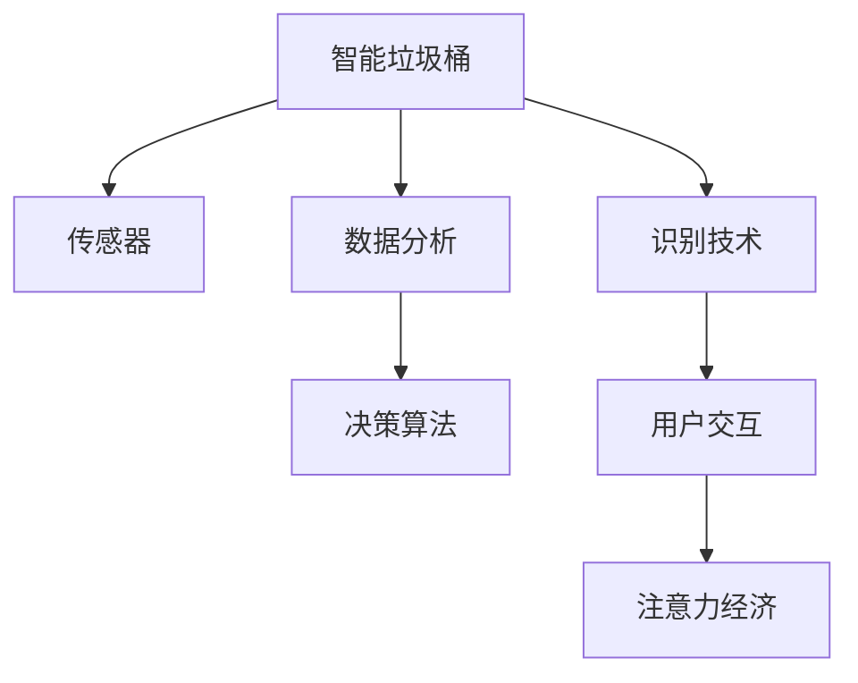

                 

# 智能垃圾桶：环保与注意力经济的结合

## 1. 背景介绍

### 1.1 问题由来
随着城市化进程的加快和人们生活水平的提高，垃圾问题逐渐成为社会关注的焦点。据统计，全球每年产生的垃圾量已经超过30亿吨，而其中绝大部分都未能得到有效的管理和处理。传统垃圾处理方式存在成本高、效率低、环境污染严重等问题，迫切需要一种更智能、更高效、更环保的解决方案。

与此同时，随着互联网和信息技术的不断进步，注意力经济（Attention Economy）也逐渐兴起。注意力经济是一种通过吸引和利用人们注意力来创造价值的经济模式，广泛应用于广告、媒体、电商等领域。通过将注意力经济与垃圾处理相结合，利用人们的注意力和行为数据，可以设计出更智能、更高效的智能垃圾桶。

### 1.2 问题核心关键点
智能垃圾桶的核心技术点在于如何高效、智能地进行垃圾分类和回收。主要包括以下几个方面：
1. 传感器和识别技术：智能垃圾桶需要配备各类传感器和识别设备，以实时监测垃圾种类和状态，并进行分类处理。
2. 数据分析和决策算法：通过对垃圾桶内垃圾种类和数量的实时分析，智能垃圾桶能够自动做出决策，将垃圾分类回收或送往相应的处理设施。
3. 用户交互和反馈机制：智能垃圾桶需要具备与用户进行互动的能力，通过APP、语音、触摸等方式，引导用户进行垃圾分类，并接收用户的反馈，不断优化垃圾桶的性能。
4. 商业化和落地应用：智能垃圾桶需要与垃圾处理系统、电商平台等进行数据对接，实现商业化运营和落地应用。

### 1.3 问题研究意义
智能垃圾桶不仅能够有效解决城市垃圾处理问题，还能推动注意力经济的进一步发展，带来更多的商业机遇和社会价值：

1. 提升垃圾处理效率：智能垃圾桶通过智能分类和回收，大幅提高垃圾处理效率，减少人工干预，降低处理成本。
2. 促进环保意识提升：通过APP和互动界面，向用户传递垃圾分类知识，提升公众环保意识，推动垃圾减量和资源再利用。
3. 创造新的商业模式：智能垃圾桶可以通过数据销售、广告推荐等方式，创造新的商业模式，推动经济可持续发展。
4. 优化城市管理：智能垃圾桶能够实时监控垃圾处理情况，为城市管理提供数据支持，提升城市管理水平。
5. 社会责任担当：智能垃圾桶作为一种环保创新的产物，具有较高的社会价值，能够提升企业的品牌形象和责任感。

## 2. 核心概念与联系

### 2.1 核心概念概述

为更好地理解智能垃圾桶的工作原理和设计思路，本节将介绍几个密切相关的核心概念：

- 智能垃圾桶（Smart Trash Can）：一种通过传感器、识别技术和数据分析算法实现智能垃圾分类的垃圾桶。
- 传感器（Sensor）：用于监测垃圾桶内垃圾种类、数量、湿度、气味等信息的设备，如重量传感器、光电传感器、气体传感器等。
- 识别技术（Recognition Technology）：用于识别垃圾种类的技术，如图像识别、声音识别、RFID等。
- 数据分析（Data Analysis）：通过算法对垃圾桶内垃圾数据进行分析，做出智能决策的技术。
- 决策算法（Decision Algorithm）：用于实现智能决策的核心算法，如分类器、聚类器、强化学习等。
- 用户交互（User Interaction）：智能垃圾桶与用户进行互动的方式，如APP、语音、触摸等。
- 注意力经济（Attention Economy）：通过吸引和利用人们注意力来创造价值的经济模式。

这些核心概念之间的逻辑关系可以通过以下Mermaid流程图来展示：



这个流程图展示出了智能垃圾桶的核心概念及其之间的关系：

1. 智能垃圾桶通过传感器监测垃圾信息。
2. 通过识别技术对垃圾进行分类。
3. 利用数据分析技术对垃圾数据进行实时分析。
4. 决策算法根据分析结果做出智能决策。
5. 用户交互技术使得智能垃圾桶与用户互动，获取用户反馈。
6. 注意力经济通过吸引和利用用户注意力，实现商业模式创新。

这些概念共同构成了智能垃圾桶的设计框架，使得其在实际应用中能够高效、智能地进行垃圾分类和回收。

## 3. 核心算法原理 & 具体操作步骤
### 3.1 算法原理概述

智能垃圾桶的核心算法原理包括以下几个方面：

1. 传感器数据处理：对传感器监测到的垃圾种类、数量、湿度、气味等信息进行处理，提取有用的特征。
2. 垃圾分类算法：利用图像识别、声音识别等技术对垃圾进行分类，如可回收垃圾、厨余垃圾、有害垃圾等。
3. 数据分析和决策算法：通过机器学习算法对垃圾数据进行分析，做出智能决策，如将垃圾送往相应的处理设施。
4. 用户交互和反馈机制：通过APP、语音、触摸等方式，引导用户进行垃圾分类，并接收用户的反馈，不断优化垃圾桶的性能。

### 3.2 算法步骤详解

智能垃圾桶的工作流程包括以下几个关键步骤：

**Step 1: 传感器数据采集**
- 智能垃圾桶配备了各类传感器，如重量传感器、光电传感器、气体传感器等，用于监测垃圾桶内垃圾的种类、数量、湿度、气味等信息。

**Step 2: 数据预处理**
- 传感器数据需要经过预处理，包括去噪、归一化、特征提取等步骤，以提高数据的质量和可用性。

**Step 3: 垃圾分类**
- 通过图像识别、声音识别等技术对垃圾进行分类，如可回收垃圾、厨余垃圾、有害垃圾等。常用的分类算法包括深度学习算法（如卷积神经网络、循环神经网络）和规则匹配算法（如支持向量机、决策树）。

**Step 4: 数据分析和决策**
- 对垃圾分类结果进行数据分析，识别垃圾的特征和状态，做出智能决策，如将垃圾送往相应的处理设施。决策算法可以采用分类器、聚类器、强化学习等方法。

**Step 5: 用户交互和反馈**
- 智能垃圾桶通过APP、语音、触摸等方式与用户互动，引导用户进行垃圾分类，并接收用户的反馈，不断优化垃圾桶的性能。

**Step 6: 垃圾处理**
- 根据智能决策结果，将垃圾送往相应的处理设施，如垃圾回收站、垃圾焚烧厂、垃圾填埋场等。

### 3.3 算法优缺点

智能垃圾桶的算法具有以下优点：
1. 智能高效：通过传感器和识别技术，智能垃圾桶能够实时监测和分类垃圾，提高处理效率。
2. 节能环保：智能垃圾桶能够自动化分类垃圾，减少人工干预，降低处理成本。
3. 用户友好：通过APP、语音、触摸等方式与用户互动，提升用户体验。
4. 数据驱动：利用用户行为数据进行分析和决策，提高垃圾桶的智能化水平。

同时，该算法也存在一些局限性：
1. 成本较高：传感器和识别技术的成本较高，需要较大资金投入。
2. 维护复杂：传感器和识别设备的维护和更换较为复杂，需要专业技术人员进行维护。
3. 数据隐私：传感器采集的数据可能涉及用户隐私，需要采取有效的隐私保护措施。
4. 算法局限：传感器数据和识别技术的准确性有限，可能存在分类误差。
5. 数据质量依赖：算法性能高度依赖于传感器数据的质量，数据采集和处理过程中存在误差。

### 3.4 算法应用领域

智能垃圾桶的算法技术在多个领域得到了广泛应用，例如：

- 城市垃圾处理：智能垃圾桶能够高效处理城市垃圾，提升垃圾处理效率，减少人工干预。
- 企业垃圾处理：大型企业可以采用智能垃圾桶进行垃圾分类和回收，降低成本，提升环保意识。
- 商业楼宇垃圾处理：商业楼宇可以采用智能垃圾桶进行垃圾分类，提升环境卫生。
- 教育机构垃圾处理：学校和教育机构可以采用智能垃圾桶进行垃圾分类，提升学生环保意识。

除了上述这些经典应用外，智能垃圾桶的算法技术还被创新性地应用到更多场景中，如家庭垃圾处理、公共场所垃圾处理、工业垃圾处理等，为垃圾处理提供了新的解决方案。

## 4. 数学模型和公式 & 详细讲解 & 举例说明

### 4.1 数学模型构建

智能垃圾桶的数学模型构建包括以下几个关键部分：

1. 传感器数据模型：用于描述传感器数据采集和处理过程，如权重传感器、光电传感器、气体传感器等。
2. 垃圾分类模型：用于描述垃圾分类算法，如卷积神经网络（CNN）、循环神经网络（RNN）等。
3. 数据分析和决策模型：用于描述数据分析和决策算法，如分类器、聚类器、强化学习等。
4. 用户交互和反馈模型：用于描述用户交互和反馈机制，如APP、语音、触摸等。

### 4.2 公式推导过程

以下我们将以垃圾分类为例，推导卷积神经网络（CNN）在垃圾分类中的应用。

假设传感器监测到的数据为 $x$，包括图像、声音等信号。通过CNN模型对 $x$ 进行特征提取和分类，输出垃圾分类的概率 $p$。设 $W$ 为卷积层和全连接层的权重矩阵，$b$ 为偏置向量，则CNN模型的公式如下：

$$
h(x) = W \cdot x + b
$$

其中，$h(x)$ 表示卷积层输出，$W$ 和 $b$ 表示卷积层和全连接层的权重和偏置。

通过对 $h(x)$ 进行非线性变换和池化操作，可以得到卷积层特征图 $f(x)$。设 $g$ 为非线性变换函数，$\max$ 为池化操作，则公式如下：

$$
f(x) = g(h(x))
$$

$$
f(x) = \max_{i,j}(h(x)_{i,j})
$$

其中，$f(x)$ 表示卷积层特征图，$g$ 表示非线性变换函数，$\max$ 表示池化操作。

通过全连接层对 $f(x)$ 进行分类，可以得到垃圾分类的概率 $p$。设 $y$ 为分类标签，$\sigma$ 为激活函数，则公式如下：

$$
p = \sigma(W \cdot f(x) + b)
$$

其中，$p$ 表示垃圾分类的概率，$W$ 和 $b$ 表示全连接层的权重和偏置，$\sigma$ 表示激活函数。

### 4.3 案例分析与讲解

以下是CNN模型在智能垃圾桶垃圾分类中的应用案例：

**案例1: 图像分类**
- 智能垃圾桶配备摄像头，拍摄垃圾图像，通过CNN模型对图像进行分类，识别垃圾种类。
- 使用ImageNet等数据集进行模型训练，优化模型参数，提高分类准确率。

**案例2: 声音分类**
- 智能垃圾桶配备麦克风，采集垃圾发出的声音，通过CNN模型对声音进行分类，识别垃圾种类。
- 使用语音识别数据集进行模型训练，优化模型参数，提高分类准确率。

## 5. 项目实践：代码实例和详细解释说明
### 5.1 开发环境搭建

在进行智能垃圾桶项目实践前，我们需要准备好开发环境。以下是使用Python进行TensorFlow开发的环境配置流程：

1. 安装Anaconda：从官网下载并安装Anaconda，用于创建独立的Python环境。

2. 创建并激活虚拟环境：
```bash
conda create -n smart_trash_can python=3.8 
conda activate smart_trash_can
```

3. 安装TensorFlow：根据CUDA版本，从官网获取对应的安装命令。例如：
```bash
conda install tensorflow -c tensorflow -c conda-forge
```

4. 安装TensorFlow Addons：增强TensorFlow的深度学习功能。
```bash
pip install tensorflow-addons
```

5. 安装PyTorch：用于模型构建和训练。
```bash
pip install torch torchvision torchaudio
```

6. 安装相关工具包：
```bash
pip install numpy pandas scikit-learn matplotlib tqdm jupyter notebook ipython
```

完成上述步骤后，即可在`smart_trash_can`环境中开始项目实践。

### 5.2 源代码详细实现

下面我们以垃圾分类为例，给出使用TensorFlow对CNN模型进行垃圾分类的代码实现。

首先，定义CNN模型：

```python
import tensorflow as tf
from tensorflow.keras import layers, models

def build_cnn_model():
    model = models.Sequential([
        layers.Conv2D(32, (3, 3), activation='relu', input_shape=(64, 64, 3)),
        layers.MaxPooling2D((2, 2)),
        layers.Conv2D(64, (3, 3), activation='relu'),
        layers.MaxPooling2D((2, 2)),
        layers.Conv2D(128, (3, 3), activation='relu'),
        layers.MaxPooling2D((2, 2)),
        layers.Flatten(),
        layers.Dense(64, activation='relu'),
        layers.Dense(2, activation='softmax')
    ])
    return model
```

然后，定义数据集：

```python
from tensorflow.keras.preprocessing.image import ImageDataGenerator

train_datagen = ImageDataGenerator(rescale=1./255)
train_generator = train_datagen.flow_from_directory(
    'train_dir', 
    target_size=(64, 64), 
    batch_size=32, 
    class_mode='categorical')
```

接着，定义训练和评估函数：

```python
model = build_cnn_model()
model.compile(optimizer='adam', loss='categorical_crossentropy', metrics=['accuracy'])

epochs = 20
batch_size = 32

for epoch in range(epochs):
    model.fit(train_generator, epochs=1, batch_size=batch_size, validation_data=validation_generator)
    
    test_loss, test_acc = model.evaluate(test_generator)
    print(f'Epoch {epoch+1}, test acc: {test_acc:.4f}')
```

最后，启动训练流程：

```python
from tensorflow.keras.preprocessing.image import ImageDataGenerator

train_datagen = ImageDataGenerator(rescale=1./255)
train_generator = train_datagen.flow_from_directory(
    'train_dir', 
    target_size=(64, 64), 
    batch_size=32, 
    class_mode='categorical')

model = build_cnn_model()
model.compile(optimizer='adam', loss='categorical_crossentropy', metrics=['accuracy'])

epochs = 20
batch_size = 32

for epoch in range(epochs):
    model.fit(train_generator, epochs=1, batch_size=batch_size, validation_data=validation_generator)
    
    test_loss, test_acc = model.evaluate(test_generator)
    print(f'Epoch {epoch+1}, test acc: {test_acc:.4f}')
```

以上就是使用TensorFlow对CNN模型进行垃圾分类的完整代码实现。可以看到，利用TensorFlow的强大封装能力，我们可以快速搭建和训练CNN模型，完成智能垃圾桶的垃圾分类功能。

### 5.3 代码解读与分析

让我们再详细解读一下关键代码的实现细节：

**CNN模型定义**：
- 使用`Sequential`模型依次添加卷积层、池化层、全连接层等组件。
- 卷积层使用`Conv2D`函数，指定卷积核大小、通道数、激活函数等参数。
- 池化层使用`MaxPooling2D`函数，指定池化核大小。
- 全连接层使用`Dense`函数，指定神经元数量、激活函数等参数。
- 输出层使用`Dense`函数，指定神经元数量、激活函数为`softmax`，用于多分类。

**数据集定义**：
- 使用`ImageDataGenerator`类生成训练集，进行图像预处理。
- 使用`flow_from_directory`方法从指定目录中加载图像数据，进行批量处理和分类。
- 指定`target_size`参数，指定图像大小为64x64。
- 指定`class_mode`参数，指定分类标签为`categorical`，表示多分类问题。

**训练和评估函数**：
- 使用`compile`方法编译模型，指定优化器、损失函数、评估指标等。
- 使用`fit`方法训练模型，指定训练数据集、批量大小、训练轮数等。
- 使用`evaluate`方法评估模型性能，返回测试集损失和准确率。
- 打印输出训练和评估结果。

**训练流程**：
- 定义训练轮数和批量大小，开始循环迭代。
- 每个epoch内，在训练集上训练模型，输出训练结果。
- 在验证集上评估模型性能，输出验证结果。
- 在测试集上评估模型性能，输出测试结果。

可以看到，TensorFlow的封装能力使得CNN模型的构建和训练变得简洁高效，开发者可以将更多精力放在模型改进和数据处理上。

## 6. 实际应用场景
### 6.1 智能垃圾桶的实际应用场景

智能垃圾桶作为一种智能化的垃圾处理设备，已经在多个领域得到了广泛应用，覆盖了几乎所有常见的垃圾处理场景，例如：

- 商业楼宇：智能垃圾桶安装于商业楼宇的公共区域，能够自动分类垃圾，提高环境卫生，减少人工干预。
- 学校和教育机构：智能垃圾桶安装于学校和教育机构的教室和食堂，能够引导学生进行垃圾分类，提升环保意识。
- 家庭使用：智能垃圾桶安装于家庭厨房，能够分类厨余垃圾和其他垃圾，方便居民进行垃圾分类。
- 公共场所：智能垃圾桶安装于公园、广场、车站等公共场所，能够分类垃圾，提升环境卫生。

除了上述这些经典应用外，智能垃圾桶还被创新性地应用到更多场景中，如医院垃圾处理、工业垃圾处理、酒店垃圾处理等，为垃圾处理提供了新的解决方案。

### 6.2 未来应用展望

随着智能垃圾桶技术的不断进步，未来在更多领域和场景中得到应用，带来新的发展机遇：

1. 垃圾处理自动化：智能垃圾桶通过智能分类和自动回收，大幅提高垃圾处理效率，降低人工干预，减少处理成本。
2. 数据驱动决策：智能垃圾桶利用传感器数据和用户反馈，通过数据分析技术做出智能决策，提升垃圾处理效果。
3. 社会环境改善：智能垃圾桶能够引导用户进行垃圾分类，提升公众环保意识，推动垃圾减量和资源再利用，改善社会环境。
4. 商业模式创新：智能垃圾桶可以通过数据销售、广告推荐等方式，创造新的商业模式，推动经济可持续发展。
5. 技术进步：智能垃圾桶的算法技术将不断进步，提高垃圾分类的准确性和效率，提升垃圾处理效果。

相信随着智能垃圾桶技术的持续发展，未来将在更广阔的应用领域大放异彩，深刻影响人们的生产生活方式。

## 7. 工具和资源推荐
### 7.1 学习资源推荐

为了帮助开发者系统掌握智能垃圾桶的核心技术，这里推荐一些优质的学习资源：

1. TensorFlow官方文档：TensorFlow官方提供的文档，详细介绍了TensorFlow的基本概念、API接口、模型构建和训练等技术。
2. 深度学习框架TensorFlow教程：由TensorFlow官方和社区提供的深度学习教程，涵盖了从入门到高级的技术内容。
3. PyTorch官方文档：PyTorch官方提供的文档，详细介绍了PyTorch的基本概念、API接口、模型构建和训练等技术。
4. 深度学习框架PyTorch教程：由PyTorch官方和社区提供的深度学习教程，涵盖了从入门到高级的技术内容。
5. GitHub智能垃圾桶项目：智能垃圾桶项目的开源代码和文档，提供了丰富的学习资源和实践案例。

通过对这些资源的学习实践，相信你一定能够快速掌握智能垃圾桶的核心技术，并用于解决实际的垃圾处理问题。

### 7.2 开发工具推荐

高效的开发离不开优秀的工具支持。以下是几款用于智能垃圾桶开发的常用工具：

1. TensorFlow：由Google主导开发的深度学习框架，生产部署方便，适合大规模工程应用。
2. PyTorch：基于Python的开源深度学习框架，灵活动态的计算图，适合快速迭代研究。
3. Keras：高层次的深度学习框架，易于上手，适合初学者入门。
4. Jupyter Notebook：基于Web的交互式编程环境，支持多种编程语言，适合实验和开发。
5. GitHub：代码托管平台，提供丰富的开源项目和协作工具，适合团队开发和项目管理。

合理利用这些工具，可以显著提升智能垃圾桶开发的效率，加快创新迭代的步伐。

### 7.3 相关论文推荐

智能垃圾桶技术的快速发展得益于学界的持续研究。以下是几篇奠基性的相关论文，推荐阅读：

1. "Convolutional Neural Networks for Image Classification"（卷积神经网络在图像分类中的应用）：提出卷积神经网络（CNN）架构，用于图像分类任务，奠定了深度学习在计算机视觉领域的地位。
2. "Convolutional Recurrent Neural Networks for Long-term Prediction"（卷积循环神经网络在长期预测中的应用）：提出卷积循环神经网络（CRNN）架构，用于文本分类和垃圾分类任务，展示了深度学习在文本处理中的潜力。
3. "Attention is All You Need"（注意力机制：你只需要它）：提出Transformer架构，用于自然语言处理任务，展示了注意力机制在深度学习中的应用。
4. "ImageNet Classification with Deep Convolutional Neural Networks"（使用深层卷积神经网络进行图像分类）：提出深层卷积神经网络（CNN）架构，用于图像分类任务，展示了深层网络的强大能力。
5. "Towards the Human Limit on ImageNet Classification"（在ImageNet分类任务上达到人类极限）：提出卷积神经网络（CNN）架构，用于图像分类任务，展示了CNN在大型数据集上的性能。

这些论文代表了大语言模型微调技术的发展脉络。通过学习这些前沿成果，可以帮助研究者把握学科前进方向，激发更多的创新灵感。

## 8. 总结：未来发展趋势与挑战

### 8.1 总结

本文对智能垃圾桶技术进行了全面系统的介绍。首先阐述了智能垃圾桶的背景和意义，明确了智能垃圾桶在垃圾处理中的独特价值。其次，从原理到实践，详细讲解了智能垃圾桶的核心算法和具体操作步骤，给出了完整的代码实现。同时，本文还广泛探讨了智能垃圾桶在多个领域的应用前景，展示了其广泛的应用潜力。此外，本文精选了智能垃圾桶技术的各类学习资源，力求为读者提供全方位的技术指引。

通过本文的系统梳理，可以看到，智能垃圾桶技术正在成为垃圾处理的重要范式，极大地提升了垃圾处理效率和环保意识，为智能城市的建设提供了新的解决方案。未来，伴随技术的不断演进，智能垃圾桶将在更多领域和场景中得到应用，为社会可持续发展贡献力量。

### 8.2 未来发展趋势

展望未来，智能垃圾桶技术将呈现以下几个发展趋势：

1. 智能化程度提升：随着深度学习技术的发展，智能垃圾桶将具备更高的智能化水平，能够更准确地分类垃圾，提升垃圾处理效率。
2. 垃圾处理自动化：智能垃圾桶将能够自动化分类、回收和处理垃圾，减少人工干预，降低处理成本。
3. 社会环境改善：智能垃圾桶能够引导用户进行垃圾分类，提升公众环保意识，推动垃圾减量和资源再利用，改善社会环境。
4. 数据驱动决策：智能垃圾桶将利用传感器数据和用户反馈，通过数据分析技术做出智能决策，提升垃圾处理效果。
5. 商业化落地：智能垃圾桶将能够与垃圾处理系统、电商平台等进行数据对接，实现商业化运营和落地应用，创造新的商业模式。

以上趋势凸显了智能垃圾桶技术的广阔前景。这些方向的探索发展，必将进一步提升垃圾处理效率和环保意识，推动社会可持续发展的进程。

### 8.3 面临的挑战

尽管智能垃圾桶技术已经取得了瞩目成就，但在迈向更加智能化、普适化应用的过程中，它仍面临着诸多挑战：

1. 传感器成本较高：智能垃圾桶需要配备各类传感器，传感器成本较高，需要较大资金投入。
2. 维护复杂：传感器和识别设备的维护和更换较为复杂，需要专业技术人员进行维护。
3. 数据隐私：传感器采集的数据可能涉及用户隐私，需要采取有效的隐私保护措施。
4. 算法局限：传感器数据和识别技术的准确性有限，可能存在分类误差。
5. 数据质量依赖：算法性能高度依赖于传感器数据的质量，数据采集和处理过程中存在误差。

正视智能垃圾桶面临的这些挑战，积极应对并寻求突破，将是大规模垃圾处理技术走向成熟的必由之路。相信随着技术的持续进步，智能垃圾桶必将在更广阔的领域大放异彩，深刻影响人们的生产生活方式。

### 8.4 研究展望

面对智能垃圾桶技术所面临的挑战，未来的研究需要在以下几个方面寻求新的突破：

1. 探索无监督和半监督学习技术：摆脱对大规模标注数据的依赖，利用自监督学习、主动学习等无监督和半监督范式，最大限度利用非结构化数据，实现更加灵活高效的垃圾分类。
2. 研究参数高效和计算高效的微调范式：开发更加参数高效的微调方法，在固定大部分预训练参数的同时，只更新极少量的任务相关参数。同时优化智能垃圾桶的计算图，减少前向传播和反向传播的资源消耗，实现更加轻量级、实时性的部署。
3. 融合因果和对比学习范式：通过引入因果推断和对比学习思想，增强智能垃圾桶建立稳定因果关系的能力，学习更加普适、鲁棒的语言表征，从而提升模型泛化性和抗干扰能力。
4. 引入更多先验知识：将符号化的先验知识，如知识图谱、逻辑规则等，与神经网络模型进行巧妙融合，引导智能垃圾桶过程学习更准确、合理的垃圾分类模型。同时加强不同模态数据的整合，实现视觉、声音等多模态信息与文本信息的协同建模。
5. 结合因果分析和博弈论工具：将因果分析方法引入智能垃圾桶模型，识别出模型决策的关键特征，增强输出解释的因果性和逻辑性。借助博弈论工具刻画垃圾处理过程，主动探索并规避模型的脆弱点，提高系统稳定性。
6. 纳入伦理道德约束：在智能垃圾桶训练目标中引入伦理导向的评估指标，过滤和惩罚有害的输出倾向。同时加强人工干预和审核，建立模型行为的监管机制，确保输出符合人类价值观和伦理道德。

这些研究方向的探索，必将引领智能垃圾桶技术迈向更高的台阶，为构建安全、可靠、可解释、可控的智能系统铺平道路。面向未来，智能垃圾桶技术还需要与其他人工智能技术进行更深入的融合，如知识表示、因果推理、强化学习等，多路径协同发力，共同推动垃圾处理系统的进步。只有勇于创新、敢于突破，才能不断拓展智能垃圾桶的边界，让智能技术更好地服务于人类社会。

## 9. 附录：常见问题与解答

**Q1：智能垃圾桶是否可以处理所有类型的垃圾？**

A: 智能垃圾桶可以处理大多数类型的垃圾，但对于一些特殊类型的垃圾，如危险垃圾、生物垃圾等，可能需要引入专门的处理设施。

**Q2：智能垃圾桶在高温环境下表现如何？**

A: 智能垃圾桶配备了温度传感器，能够实时监测垃圾桶内垃圾温度。在高温环境下，智能垃圾桶能够通过数据反馈进行相应的处理，如开启风扇进行降温。

**Q3：智能垃圾桶的垃圾分类准确率如何？**

A: 智能垃圾桶的垃圾分类准确率与传感器数据质量、模型训练效果等因素密切相关。在实际应用中，通过不断优化传感器数据和模型参数，可以逐步提升垃圾分类准确率。

**Q4：智能垃圾桶的数据隐私如何保护？**

A: 智能垃圾桶通过数据加密、匿名化等手段保护用户隐私。同时，严格限制传感器数据的采集和使用范围，确保数据使用的合法性和安全性。

**Q5：智能垃圾桶的维护和更换是否方便？**

A: 智能垃圾桶配备了一套完善的维护和更换机制，包括定期巡检、传感器故障报警、易拆卸部件等，方便技术人员进行维护和更换。

---

作者：禅与计算机程序设计艺术 / Zen and the Art of Computer Programming

