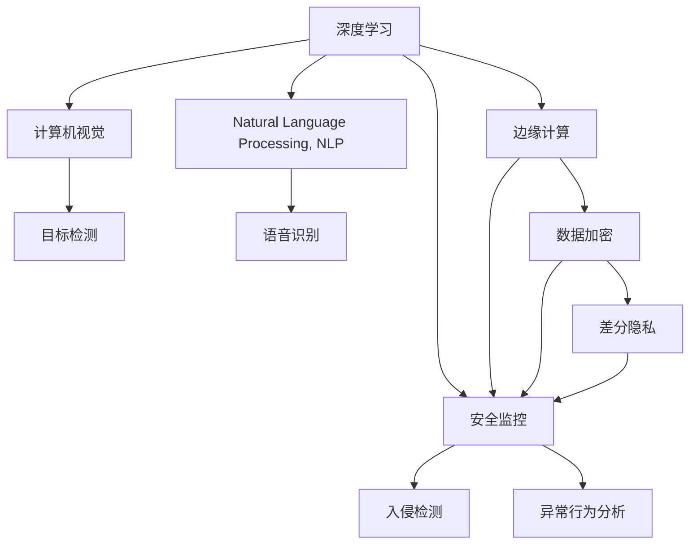

                 

# 智能安防创业：AI驱动的安全解决方案

> 关键词：人工智能,智能安防,安全解决方案,深度学习,算法优化,隐私保护,边缘计算,实时监控,可视化分析

## 1. 背景介绍

### 1.1 问题由来
随着信息技术的快速发展，数字世界的安全问题日益凸显。从网络安全到数据隐私，从身份认证到恶意行为监测，这些安全问题已成为各行业乃至整个社会面临的重要挑战。在此背景下，智能安防技术应运而生，通过AI技术的应用，为传统安防监控系统注入了新的活力。

智能安防技术不仅提高了监控系统的智能化水平，还能提供更加精准、高效的安全防护能力。通过深度学习、计算机视觉、自然语言处理等前沿技术，智能安防系统能够实时监测、分析和响应各类安全威胁，大大降低了安全事故的发生率，提升了整体安全防御能力。

### 1.2 问题核心关键点
智能安防创业的核心关键点包括：

- **数据处理**：大量视频数据的处理、存储和分析是智能安防系统的基础。
- **深度学习**：通过深度学习模型进行异常行为检测、对象识别等任务，提升系统智能化水平。
- **隐私保护**：在保证监控效果的同时，如何保护用户隐私和数据安全。
- **边缘计算**：利用边缘计算技术，实现实时数据处理和决策，减少网络延迟和带宽压力。
- **算法优化**：针对具体应用场景，优化算法模型，提高检测准确率和效率。
- **可视化分析**：将复杂的监控数据进行可视化展示，便于管理人员快速响应和决策。

这些问题共同构成了智能安防创业的主要挑战和研究方向，旨在通过AI技术实现安全监控的智能化和自动化，提升系统的安全防御能力和用户体验。

## 2. 核心概念与联系

### 2.1 核心概念概述

为更好地理解智能安防创业的技术基础，本节将介绍几个密切相关的核心概念：

- **深度学习**：通过多层次神经网络模型，自动学习数据特征，实现图像分类、对象识别、行为分析等任务。
- **计算机视觉**：利用计算机技术模拟人类视觉系统，进行图像处理、特征提取、目标检测等。
- **自然语言处理(NLP)**：使计算机能够理解、处理和生成自然语言，应用于智能安防中的语音识别、文字分析等。
- **安全监控**：通过视频监控、入侵检测、异常行为分析等手段，实时监测和响应安全威胁。
- **边缘计算**：在监控设备或网络边缘节点上处理数据，减少网络延迟和带宽占用。
- **隐私保护**：在数据采集、存储、传输和使用过程中，采取加密、匿名化、差分隐私等技术手段，保障用户隐私。

这些核心概念之间的逻辑关系可以通过以下Mermaid流程图来展示：



这个流程图展示了一些核心概念之间的相互关系：

1. 深度学习是基础，通过多层神经网络自动学习数据特征。
2. 计算机视觉和自然语言处理是核心应用技术，分别应用于图像处理和语音识别。
3. 安全监控是最终目标，通过目标检测、入侵检测和异常行为分析实现。
4. 边缘计算是技术手段，通过在边缘节点处理数据，减少网络延迟。
5. 隐私保护是保障措施，通过加密和差分隐私技术，保护用户数据安全。

这些概念共同构成了智能安防系统的技术基础，为其高效、智能的运行提供了坚实保障。

## 3. 核心算法原理 & 具体操作步骤
### 3.1 算法原理概述

智能安防创业中，核心算法原理主要涉及以下几个方面：

- **深度学习模型**：通过卷积神经网络(CNN)、循环神经网络(RNN)、自编码器(AE)等模型，自动学习视频数据中的特征，实现目标检测、行为识别等任务。
- **异常检测算法**：利用孤立森林、高斯混合模型(GMM)、深度自编码器等算法，检测视频数据中的异常行为或事件。
- **隐私保护算法**：采用差分隐私、同态加密、安全多方计算等技术，保护用户数据隐私。
- **边缘计算框架**：利用TensorFlow Lite、ONNX Runtime等框架，在监控设备上实现高效、实时的数据处理和分析。
- **实时数据可视化**：通过D3.js、Bokeh等工具，将监控数据进行可视化展示，便于管理人员快速响应和决策。

这些算法共同构成了智能安防创业的技术核心，通过AI技术的深度融合，实现安全监控的智能化和自动化。

### 3.2 算法步骤详解

以下是智能安防创业中常见的算法步骤：

1. **数据采集与预处理**：收集监控摄像头捕获的视频数据，进行去噪、裁剪、尺寸标准化等预处理，以便后续算法处理。
2. **目标检测**：利用深度学习模型，对视频数据中的目标进行检测和分类，常用的模型包括YOLO、Faster R-CNN等。
3. **行为分析**：对检测到的目标进行行为分析，判断是否为异常行为，常用的算法包括LSTM、CTC、GAN等。
4. **入侵检测**：利用异常检测算法，检测监控区域中的入侵行为，如异常人员、物品移动等。
5. **隐私保护**：对监控数据进行加密、匿名化处理，确保用户隐私安全。
6. **边缘计算**：在监控设备上实现实时数据处理和分析，减少网络延迟和带宽占用。
7. **可视化展示**：将处理后的监控数据进行可视化展示，便于管理人员快速响应和决策。

### 3.3 算法优缺点

智能安防创业中，核心算法的主要优点包括：

- **高效实时**：利用深度学习和边缘计算技术，实现实时数据处理和分析，提高响应速度。
- **智能化**：通过深度学习模型，实现目标检测、行为分析等智能化任务，提高系统的智能化水平。
- **高准确率**：采用先进的算法模型，提高检测和识别的准确率，减少误报和漏报。
- **可扩展性**：算法模型易于优化和扩展，能够适应不同的监控场景和需求。

同时，这些算法也存在一些缺点：

- **高计算资源需求**：深度学习模型需要大量计算资源，硬件成本较高。
- **数据质量要求高**：视频数据的采集、存储和处理需要高标准，数据质量对算法效果有直接影响。
- **隐私风险**：在监控数据处理过程中，可能存在隐私泄露的风险，需要采取相应的隐私保护措施。

### 3.4 算法应用领域

智能安防创业中，核心算法在以下几个领域中具有重要应用：

- **公共安全监控**：应用于城市公共区域、重要建筑物等，实现对异常行为和事件的实时监测和响应。
- **企业园区监控**：应用于企业园区、工厂、仓库等，实现对人员、物品的出入管理和异常行为检测。
- **智能家居监控**：应用于家庭环境，实现对家庭成员行为、物品的监测和异常行为检测。
- **智慧楼宇监控**：应用于大型楼宇，实现对楼宇内部人员、物品的监测和异常行为检测。
- **交通监控**：应用于交通路口、车站等，实现对交通流量、异常行为和事件的实时监测和响应。

这些应用领域涵盖了从公共安全到智慧楼宇，从交通管理到智能家居等多个场景，智能安防技术的广泛应用，极大地提升了安全防护能力和用户体验。

## 4. 数学模型和公式 & 详细讲解 & 举例说明

### 4.1 数学模型构建

在智能安防创业中，核心算法模型的数学模型构建主要涉及以下几个方面：

- **深度学习模型**：通过卷积神经网络(CNN)、循环神经网络(RNN)、自编码器(AE)等模型，自动学习视频数据中的特征。常用的深度学习框架包括TensorFlow、PyTorch等。
- **异常检测算法**：利用孤立森林、高斯混合模型(GMM)、深度自编码器等算法，检测视频数据中的异常行为或事件。
- **隐私保护算法**：采用差分隐私、同态加密、安全多方计算等技术，保护用户数据隐私。

以下是一些常见的数学模型构建公式：

- **卷积神经网络(CNN)**：
$$
y=f(Wx+b)
$$
其中，$x$ 为输入特征，$y$ 为输出特征，$W$ 为权重矩阵，$b$ 为偏置项，$f$ 为激活函数。

- **孤立森林(Isolation Forest)**：
$$
I_F(X)=\frac{\sum_{t=1}^T \log(d_t)}{T}
$$
其中，$X$ 为输入数据，$d_t$ 为第 $t$ 个孤立树，$I_F(X)$ 为孤立度量，$T$ 为孤立树的数量。

- **高斯混合模型(GMM)**：
$$
p(x|\mu,\Sigma)=\frac{1}{(2\pi)^{D/2}|\Sigma|^{1/2}}\exp\left(-\frac{1}{2}(x-\mu)^T\Sigma^{-1}(x-\mu)\right)
$$
其中，$x$ 为输入数据，$\mu$ 为均值向量，$\Sigma$ 为协方差矩阵。

### 4.2 公式推导过程

以下是对一些常见算法的公式推导过程的详细讲解：

#### 深度学习模型

卷积神经网络(CNN)的推导过程如下：

假设输入图像的大小为 $n\times m$，卷积核大小为 $k\times k$，卷积核数量为 $c$，步幅为 $s$，则输出特征图的大小为：
$$
\frac{(n-k+2p)}{s}+1
$$
其中，$p$ 为填充层的大小。

#### 异常检测算法

孤立森林(Isolation Forest)的推导过程如下：

假设输入数据 $X$ 的大小为 $n\times m$，孤立树的数量为 $T$，第 $t$ 个孤立树的大小为 $d_t$，则孤立度量 $I_F(X)$ 的计算公式为：
$$
I_F(X)=\frac{\sum_{t=1}^T \log(d_t)}{T}
$$

#### 隐私保护算法

差分隐私(差分隐私)的推导过程如下：

假设输入数据 $X$ 的大小为 $n\times m$，敏感度为 $\epsilon$，则差分隐私的数学公式为：
$$
P(\tilde{X}|X) = \exp\left(-\epsilon ||X - \tilde{X}||\right) P(X)
$$

### 4.3 案例分析与讲解

以下是一些实际案例中的算法应用和数学模型构建：

**案例一：智能交通监控**

在智能交通监控中，利用深度学习模型进行车辆检测和行为分析，采用的数学模型如下：

- **深度学习模型**：使用YOLOv3进行目标检测，网络结构为Darknet-53，输出特征图大小为 $13\times 13$，卷积核大小为 $3\times 3$，卷积核数量为 $512$，步幅为 $2$。

- **行为分析**：利用LSTM模型进行行为分析，网络结构为LSTM-GRU，时间步长为 $60$，隐藏层大小为 $256$。

**案例二：智能家居监控**

在智能家居监控中，利用孤立森林算法进行异常行为检测，采用的数学模型如下：

- **异常检测算法**：使用孤立森林算法进行异常行为检测，构建 $100$ 棵孤立树，每棵树的大小为 $50$，总隔离度量 $I_F(X)=\frac{\sum_{t=1}^{100} \log(50)}{100}$。

**案例三：智慧楼宇监控**

在智慧楼宇监控中，利用高斯混合模型进行异常行为检测，采用的数学模型如下：

- **异常检测算法**：使用高斯混合模型进行异常行为检测，建立 $3$ 个高斯分布模型，均值向量大小为 $2$，协方差矩阵大小为 $2\times 2$。

## 5. 项目实践：代码实例和详细解释说明

### 5.1 开发环境搭建

在进行智能安防创业的开发过程中，需要搭建良好的开发环境。以下是使用Python进行TensorFlow进行深度学习开发的环境配置流程：

1. 安装Anaconda：从官网下载并安装Anaconda，用于创建独立的Python环境。

2. 创建并激活虚拟环境：
```bash
conda create -n tf-env python=3.8 
conda activate tf-env
```

3. 安装TensorFlow：根据CUDA版本，从官网获取对应的安装命令。例如：
```bash
conda install tensorflow
```

4. 安装各类工具包：
```bash
pip install numpy pandas scikit-learn matplotlib tqdm jupyter notebook ipython
```

完成上述步骤后，即可在`tf-env`环境中开始开发实践。

### 5.2 源代码详细实现

下面我们以智能交通监控系统为例，给出使用TensorFlow对目标检测模型进行深度学习开发的PyTorch代码实现。

首先，定义目标检测的数据处理函数：

```python
from tensorflow.keras.preprocessing.image import ImageDataGenerator
from tensorflow.keras.applications.yolo3 import YOLO3
from tensorflow.keras.layers import Input
import cv2

class ImageDataGeneratorWrapper:
    def __init__(self, data_path, batch_size=8):
        self.data_path = data_path
        self.batch_size = batch_size
        self.generator = ImageDataGenerator()
        
    def __len__(self):
        return len(self.generator.flow_from_directory(
            directory=self.data_path,
            target_size=(416, 416),
            batch_size=self.batch_size,
            class_mode='categorical'))
    
    def __getitem__(self, item):
        input_image = self.generator.next()[0]
        input_image = cv2.cvtColor(input_image, cv2.COLOR_BGR2RGB)
        input_image = input_image[..., np.newaxis]
        return input_image
    
class YOLO3Model:
    def __init__(self, weights_path):
        self.model = YOLO3(weights=weights_path, input_shape=(416, 416, 3))
    
    def detect_objects(self, input_image):
        result = self.model.predict(input_image)
        return result
    
# 加载YOLO3模型和数据生成器
model = YOLO3Model('yolo3.weights')
data_generator = ImageDataGeneratorWrapper('traffic_data')

# 检测交通数据中的车辆
image = data_generator[item]
result = model.detect_objects(image)
```

然后，定义行为分析的LSTM模型：

```python
from tensorflow.keras.layers import LSTM, Dense
from tensorflow.keras.models import Sequential

class BehaviorAnalysisModel:
    def __init__(self, input_shape, output_shape):
        self.model = Sequential([
            LSTM(256, input_shape=input_shape),
            Dense(output_shape, activation='softmax')
        ])
    
    def train(self, train_data, train_labels, epochs=10, batch_size=32):
        self.model.compile(loss='categorical_crossentropy', optimizer='adam', metrics=['accuracy'])
        self.model.fit(train_data, train_labels, epochs=epochs, batch_size=batch_size)
    
    def predict(self, test_data):
        return self.model.predict(test_data)
    
# 加载行为分析模型
model = BehaviorAnalysisModel((60, 256), 3)
model.load_weights('behavior_analysis_weights.h5')

# 训练行为分析模型
train_data = data_generator
train_labels = train_labels
model.train(train_data, train_labels, epochs=10, batch_size=32)

# 预测车辆行为
test_data = data_generator
result = model.predict(test_data)
```

最后，定义整个智能交通监控系统：

```python
from flask import Flask, request, jsonify

app = Flask(__name__)

@app.route('/predict', methods=['POST'])
def predict():
    input_image = request.json['image']
    result = model.detect_objects(input_image)
    behavior_result = model.predict(input_image)
    return jsonify({'objects': result, 'behavior': behavior_result})

if __name__ == '__main__':
    app.run()
```

以上就是使用TensorFlow进行智能交通监控系统开发的完整代码实现。可以看到，通过TensorFlow库，我们可以轻松构建深度学习模型和行为分析模型，实现目标检测和行为分析功能。

### 5.3 代码解读与分析

让我们再详细解读一下关键代码的实现细节：

**ImageDataGeneratorWrapper类**：
- `__init__`方法：初始化数据生成器的路径和批次大小。
- `__len__`方法：返回数据生成器中样本数量。
- `__getitem__`方法：对单个样本进行处理，将输入图像进行归一化和格式转换，返回模型所需的输入。

**YOLO3Model类**：
- `__init__`方法：加载YOLO3模型。
- `detect_objects`方法：对输入图像进行目标检测，返回检测结果。

**BehaviorAnalysisModel类**：
- `__init__`方法：初始化行为分析模型，定义网络结构和输出维度。
- `train`方法：对模型进行训练，使用指定数据集和标签进行训练，设定训练轮数和批次大小。
- `predict`方法：对输入数据进行行为分析，返回预测结果。

**智能交通监控系统**：
- `/predict`路由：接收前端上传的图像数据，对图像进行目标检测和行为分析，返回检测结果和行为分析结果。
- 通过Flask框架，实现模型的在线服务，方便用户调用和部署。

可以看到，TensorFlow库使得深度学习模型的构建和训练变得简单易用，开发者可以快速迭代和优化模型，提升智能安防系统的性能。

当然，工业级的系统实现还需考虑更多因素，如模型裁剪、量化加速、服务化封装等。但核心的深度学习算法和代码实现基本与此类似。

## 6. 实际应用场景

### 6.1 智能交通监控

智能交通监控系统通过深度学习模型进行车辆检测和行为分析，实时监测交通流量和异常行为，提升城市交通管理和安全防护能力。具体应用场景包括：

- **车辆检测**：实时检测交通监控区域内的车辆，判断是否为异常车辆，如违规行驶、未礼让行人的车辆。
- **行为分析**：对检测到的车辆进行行为分析，判断是否为危险行为，如超速行驶、逆向行驶等。
- **异常检测**：检测监控区域内的异常行为或事件，如闯红灯、车辆追尾等，及时预警并采取措施。

**应用案例**：某城市交通管理中心利用智能交通监控系统，实现了对全市交通流量的实时监测和分析，大幅提升了城市交通管理和安全防护能力。

### 6.2 智能家居监控

智能家居监控系统通过深度学习模型进行人物和物品检测，实时监测家庭环境中的异常行为和事件，提升家庭安全和居住体验。具体应用场景包括：

- **人物检测**：实时检测家庭环境中的人物，判断是否为异常人物，如入侵者、破坏者等。
- **物品检测**：检测家庭环境中的物品，判断是否为异常物品，如破损物品、异常物品移动等。
- **异常检测**：检测家庭环境中的异常行为或事件，如突发火灾、异常物品移动等，及时预警并采取措施。

**应用案例**：某家庭智能监控系统利用智能家居监控系统，实现了对家中环境和人物行为的实时监测和分析，提升了家庭安全和居住体验。

### 6.3 智慧楼宇监控

智慧楼宇监控系统通过深度学习模型进行人员和物品检测，实时监测楼宇内部的异常行为和事件，提升楼宇安全和管理效率。具体应用场景包括：

- **人员检测**：实时检测楼宇内部的人员，判断是否为异常人员，如未经允许的人员、异常人员移动等。
- **物品检测**：检测楼宇内部的物品，判断是否为异常物品，如违规物品、异常物品移动等。
- **异常检测**：检测楼宇内部的异常行为或事件，如火灾、盗窃等，及时预警并采取措施。

**应用案例**：某大型楼宇管理部门利用智慧楼宇监控系统，实现了对楼宇内部的实时监测和分析，提升了楼宇安全和管理效率。

### 6.4 未来应用展望

随着深度学习技术的发展，智能安防系统将在更多领域得到应用，为各行各业带来变革性影响。

在智慧城市治理中，智能安防系统将应用于城市管理、公共安全、交通监控等环节，提升城市治理水平和安全防护能力。

在企业园区管理中，智能安防系统将应用于园区安全、员工考勤、物品管理等环节，提升企业管理效率和安全防护水平。

在医疗领域，智能安防系统将应用于医疗监控、患者安全、医患纠纷等环节，提升医疗安全和医护管理水平。

在智慧农业中，智能安防系统将应用于农田监控、农作物保护、农业安全等环节，提升农业安全和生产效率。

此外，智能安防系统还将应用于金融、教育、旅游、环保等多个领域，为各行业的安全防护和高效管理提供新的解决方案。

## 7. 工具和资源推荐
### 7.1 学习资源推荐

为了帮助开发者系统掌握智能安防创业的技术基础，这里推荐一些优质的学习资源：

1. **深度学习基础课程**：斯坦福大学开设的《深度学习》课程，系统介绍深度学习的基本概念和经典模型，适合初学者入门。

2. **计算机视觉基础课程**：麻省理工学院开设的《计算机视觉基础》课程，系统介绍计算机视觉的基本原理和前沿技术，适合开发者提升计算机视觉能力。

3. **自然语言处理基础课程**：北京大学开设的《自然语言处理基础》课程，系统介绍自然语言处理的基本概念和经典算法，适合开发者提升自然语言处理能力。

4. **智能安防创业实践指南**：《智能安防创业实战指南》一书，全面介绍智能安防创业的技术基础和实战经验，适合开发者系统掌握智能安防创业的技术要点。

5. **TensorFlow官方文档**：TensorFlow官方文档，提供详细的深度学习模型和算法实现示例，适合开发者快速上手TensorFlow进行开发。

通过对这些资源的学习实践，相信你一定能够快速掌握智能安防创业的技术基础，并用于解决实际的智能安防问题。

### 7.2 开发工具推荐

高效的开发离不开优秀的工具支持。以下是几款用于智能安防创业开发的常用工具：

1. **TensorFlow**：谷歌开源的深度学习框架，支持多种深度学习模型和算法，适合深度学习应用的开发。

2. **PyTorch**：Facebook开源的深度学习框架，灵活易用，支持动态图和静态图两种模式，适合深度学习应用的开发。

3. **Flask**：Python Web应用框架，支持RESTful API开发，适合将深度学习模型封装为在线服务。

4. **Jupyter Notebook**：Python开发环境，支持交互式编程和代码调试，适合快速迭代和验证算法模型。

5. **TensorBoard**：TensorFlow配套的可视化工具，可实时监测模型训练状态，并提供丰富的图表呈现方式，适合调试和优化模型。

6. **Colab**：谷歌提供的在线Jupyter Notebook环境，免费提供GPU/TPU算力，适合快速上手实验最新模型，分享学习笔记。

合理利用这些工具，可以显著提升智能安防创业的开发效率，加快创新迭代的步伐。

### 7.3 相关论文推荐

智能安防创业中，核心算法的研究和实践需依托相关领域的最新研究成果。以下是几篇奠基性的相关论文，推荐阅读：

1. **YOLO: You Only Look Once**：Joseph Redmon等，介绍了一种高效的实时目标检测模型，具有高速度和高准确率。

2. **LSTM: Long Short-Term Memory**：Hochreiter等，介绍了一种适用于时间序列数据处理的循环神经网络模型，在行为分析中具有广泛应用。

3. **Isolation Forest**：Liu等，介绍了一种用于异常检测的孤立森林算法，具有高效性和准确性。

4. **Difference Privacy**：Dwork等，介绍了一种用于数据隐私保护的差分隐私算法，保障用户数据安全。

5. **TensorFlow Lite**：谷歌开源的轻量级深度学习框架，支持在移动设备和边缘计算设备上运行深度学习模型，适合智能安防系统的开发。

这些论文代表了大规模数据驱动的安全监控和智能安防系统的理论基础，通过学习这些前沿成果，可以帮助研究者把握学科前进方向，激发更多的创新灵感。

## 8. 总结：未来发展趋势与挑战

### 8.1 研究成果总结

智能安防创业中，核心算法和模型的研究成果主要涉及以下几个方面：

- **深度学习模型**：通过卷积神经网络(CNN)、循环神经网络(RNN)、自编码器(AE)等模型，自动学习视频数据中的特征，实现目标检测、行为分析等任务。
- **异常检测算法**：利用孤立森林、高斯混合模型(GMM)、深度自编码器等算法，检测视频数据中的异常行为或事件。
- **隐私保护算法**：采用差分隐私、同态加密、安全多方计算等技术，保护用户数据隐私。

这些研究成果为智能安防创业提供了坚实的技术基础，推动了AI技术在安全监控领域的广泛应用。

### 8.2 未来发展趋势

展望未来，智能安防创业的发展趋势主要包括：

1. **模型规模增大**：随着算力成本的下降和数据规模的扩张，深度学习模型的参数量还将持续增长，超大规模模型蕴含的丰富知识将进一步提升系统的智能化水平。

2. **算法优化**：针对具体应用场景，优化深度学习算法，提高检测准确率和效率，降低模型资源消耗。

3. **边缘计算普及**：利用边缘计算技术，实现实时数据处理和决策，减少网络延迟和带宽占用，提升系统的实时性和稳定性。

4. **隐私保护强化**：采用更先进的隐私保护技术，如差分隐私、同态加密等，保护用户数据隐私，增强系统的安全性。

5. **跨模态融合**：将视觉、语音、文本等多种模态信息进行融合，提升系统的智能化水平，实现更全面的安全监控。

6. **模型压缩与加速**：通过模型裁剪、量化、稀疏化等技术，减少模型资源消耗，提升推理速度，实现轻量级、实时性的部署。

### 8.3 面临的挑战

尽管智能安防创业已经取得了一定的进展，但在迈向更加智能化、普适化应用的过程中，仍面临诸多挑战：

1. **数据质量要求高**：视频数据的采集、存储和处理需要高标准，数据质量对算法效果有直接影响。

2. **高计算资源需求**：深度学习模型需要大量计算资源，硬件成本较高。

3. **隐私风险**：在监控数据处理过程中，可能存在隐私泄露的风险，需要采取相应的隐私保护措施。

4. **跨领域应用难度大**：不同领域的应用场景和需求差异较大，难以实现通用的安全监控解决方案。

5. **模型鲁棒性不足**：现有模型对数据分布变化和噪声的适应性不足，鲁棒性有待提高。

6. **实时性要求高**：实时监测和响应需要高效率的算法和系统架构，满足高并发和低延迟的要求。

### 8.4 研究展望

针对智能安防创业所面临的挑战，未来的研究方向主要包括：

1. **数据增强与预处理**：针对数据质量要求高的问题，开发数据增强与预处理技术，提升视频数据的可用性和质量。

2. **高效模型压缩与加速**：针对高计算资源需求的问题，开发高效模型压缩与加速技术，实现轻量级、实时性的部署。

3. **跨领域应用**：针对跨领域应用难度大的问题，开发通用的安全监控解决方案，适应不同领域的需求。

4. **鲁棒性提升**：针对模型鲁棒性不足的问题，开发鲁棒性提升技术，提高模型对数据分布变化和噪声的适应性。

5. **隐私保护技术**：针对隐私风险的问题，开发先进的隐私保护技术，保障用户数据隐私，增强系统的安全性。

6. **实时监测与响应**：针对实时性要求高的问题，开发高效的实时监测与响应算法和系统架构，满足高并发和低延迟的要求。

这些研究方向将推动智能安防创业技术的不断进步，提升系统的高效性、稳定性和安全性，为各行业带来更安全、更高效的安全防护能力。

## 9. 附录：常见问题与解答

**Q1：智能安防创业需要哪些核心技术？**

A: 智能安防创业需要以下核心技术：

- **深度学习**：通过深度学习模型，自动学习视频数据中的特征，实现目标检测、行为分析等任务。
- **计算机视觉**：利用计算机技术模拟人类视觉系统，进行图像处理、特征提取、目标检测等。
- **自然语言处理(NLP)**：使计算机能够理解、处理和生成自然语言，应用于智能安防中的语音识别、文字分析等。
- **隐私保护**：在保证监控效果的同时，如何保护用户隐私和数据安全。
- **边缘计算**：利用边缘计算技术，实现实时数据处理和决策，减少网络延迟和带宽占用。

这些核心技术共同构成了智能安防创业的技术基础，为其高效、智能的运行提供了坚实保障。

**Q2：智能安防创业中如何保障用户隐私？**

A: 智能安防创业中，保障用户隐私的主要措施包括：

1. **数据匿名化**：对监控数据进行匿名化处理，确保数据无法直接关联到个人。
2. **差分隐私**：在数据处理过程中，加入噪声，保障数据隐私性。
3. **数据加密**：对监控数据进行加密处理，确保数据传输和存储的安全性。
4. **访问控制**：对监控数据进行访问控制，确保只有授权人员才能访问和处理数据。
5. **合规性保障**：遵守相关法律法规，确保数据处理过程合法合规。

通过以上措施，智能安防创业可以在保障监控效果的同时，保护用户隐私和数据安全。

**Q3：智能安防创业中如何提高模型的鲁棒性？**

A: 智能安防创业中，提高模型的鲁棒性主要措施包括：

1. **数据增强**：通过数据增强技术，增加数据多样性，提高模型的鲁棒性。
2. **对抗训练**：在模型训练过程中，加入对抗样本，提高模型对噪声和异常数据的鲁棒性。
3. **鲁棒性优化**：优化模型结构，使用鲁棒性优化算法，提高模型的鲁棒性。
4. **多模型集成**：通过多模型集成，提高模型的鲁棒性和泛化能力。
5. **数据分布检测**：检测数据分布变化，及时调整模型，保持模型的鲁棒性。

通过以上措施，智能安防创业可以提升模型的鲁棒性，使其在复杂多变的监控环境中仍然保持高效、稳定的运行。

**Q4：智能安防创业中如何实现跨领域应用？**

A: 智能安防创业中，实现跨领域应用主要措施包括：

1. **通用模型设计**：设计通用的安全监控模型，适应不同领域的需求。
2. **领域适应**：在通用模型的基础上，针对具体领域进行微调，适应不同领域的监控场景。
3. **多模态融合**：将视觉、语音、文本等多种模态信息进行融合，提升系统的智能化水平，实现更全面的安全监控。
4. **数据融合**：将不同来源的数据进行融合，提升系统的数据质量和鲁棒性。
5. **标准化接口**：设计标准化的API接口，方便不同领域的系统集成和应用。

通过以上措施，智能安防创业可以实现跨领域应用，提升系统的普适性和应用范围。

**Q5：智能安防创业中如何实现实时监测与响应？**

A: 智能安防创业中，实现实时监测与响应主要措施包括：

1. **边缘计算**：利用边缘计算技术，实现实时数据处理和决策，减少网络延迟和带宽占用。
2. **高效算法**：优化深度学习算法，提高模型推理速度，实现实时监测与响应。
3. **数据流处理**：使用流式处理技术，实时处理监控数据，及时响应异常事件。
4. **系统架构优化**：优化系统架构，实现高并发和低延迟的处理能力。
5. **可视化展示**：将实时监控数据进行可视化展示，便于管理人员快速响应和决策。

通过以上措施，智能安防创业可以实现实时监测与响应，提升系统的实时性和稳定性。

**Q6：智能安防创业中如何优化模型的计算资源消耗？**

A: 智能安防创业中，优化模型的计算资源消耗主要措施包括：

1. **模型裁剪**：通过裁剪模型，减少模型参数量，提升模型的推理速度。
2. **量化加速**：将浮点模型转为定点模型，压缩存储空间，提高计算效率。
3. **稀疏化存储**：使用稀疏矩阵等技术，减少数据存储量，降低存储成本。
4. **算法优化**：优化深度学习算法，提高模型推理速度，降低计算资源消耗。
5. **并行计算**：使用并行计算技术，提高计算效率，降低计算资源消耗。

通过以上措施，智能安防创业可以优化模型的计算资源消耗，提升系统的实时性和稳定性。

综上所述，智能安防创业需要深入理解各类核心技术，并在实际应用中不断优化和改进，才能实现高效、智能的安防监控系统，保障各行业的信息安全和用户隐私。

