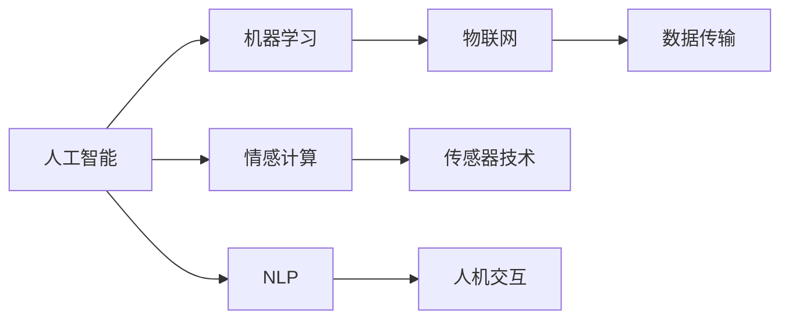

                 

# 智能宠物陪伴机器人创业：科技宠物的新定义

## 1. 背景介绍

在科技日益发展的今天，人工智能(AI)已经深入到生活的方方面面，从自动驾驶、智能家居到个性化推荐，AI正以惊人的速度改变着人们的生活。但人们是否曾想过，AI可以如何改变宠物的陪伴方式？智能宠物陪伴机器人正是这一愿景的实现者。通过结合AI技术和物联网(IoT)设备，智能宠物陪伴机器人能够为宠物提供更加科学、个性化的陪伴，同时也为宠物主提供更便捷、高效的养护体验。

### 1.1 传统宠物陪伴方式的不足

传统宠物陪伴方式通常依赖于宠物主人的亲自照顾，但这种方式存在着诸多局限性：

- **时间和精力限制**：现代人生活节奏快，工作压力大，难以抽出足够时间陪伴宠物，导致宠物孤独感增加。
- **知识和技术缺乏**：许多人对于宠物的科学养护知识了解不足，无法提供专业、科学的养护方案。
- **环境适应性差**：传统宠物陪伴方式往往难以适应各种环境变化，如恶劣天气、突发疾病等。

### 1.2 智能宠物陪伴机器人的兴起

智能宠物陪伴机器人通过集成AI技术，实现了宠物陪伴方式的智能化和个性化。它们不仅可以定时喂食、自动清洁、监测健康状态，还能与宠物互动、提供情感支持。此外，智能宠物陪伴机器人还具备远程监控和自动报警功能，能够及时响应宠物的健康危机，为宠物主提供更安心的养护体验。

## 2. 核心概念与联系

### 2.1 核心概念概述

智能宠物陪伴机器人融合了人工智能、物联网、传感器技术、机器学习等多个领域，其核心概念包括：

- **人工智能**：通过机器学习算法，使机器人具备学习、推理和决策能力。
- **物联网**：将传感器设备与互联网连接，实现数据的实时采集和传输。
- **机器学习**：通过训练数据集，使机器人能够不断学习和优化其行为。
- **情感计算**：通过分析宠物的行为、声音和身体语言，理解宠物的情绪和需求。
- **自然语言处理(NLP)**：使机器人能够理解并回应人类的语言指令，实现人机交互。

这些核心概念相互关联，共同构成了智能宠物陪伴机器人的技术基础。

### 2.2 核心概念原理和架构的 Mermaid 流程图



通过以上流程图可以看出，智能宠物陪伴机器人的核心技术模块及其相互关系：

- **人工智能**是整个系统的“大脑”，负责决策和控制。
- **机器学习**使得机器人能够不断学习和优化，提升陪伴质量。
- **情感计算**帮助机器人理解宠物的情绪和需求，提供更个性化的服务。
- **NLP**使得机器人能够与人类进行自然语言交互，提高用户体验。
- **物联网**使得机器人具备实时数据采集和远程控制能力。
- **传感器技术**是数据采集的基础，用于监测宠物的健康和行为。

## 3. 核心算法原理 & 具体操作步骤

### 3.1 算法原理概述

智能宠物陪伴机器人的核心算法原理主要基于以下几个方面：

- **强化学习**：通过与环境的交互，机器人不断调整其行为，以达到最优的陪伴效果。
- **深度学习**：通过大量数据训练神经网络，使机器人具备高精度的图像识别、语音识别和自然语言理解能力。
- **情感识别**：通过分析宠物的行为和声音，识别其情绪状态，调整陪伴策略。
- **远程监控**：通过物联网技术，实现远程监控和报警，及时响应宠物的健康危机。

### 3.2 算法步骤详解

智能宠物陪伴机器人主要包括以下几个算法步骤：

1. **数据采集与预处理**：通过传感器采集宠物的行为、声音、身体状况等数据，并进行预处理和清洗。
2. **特征提取与表示**：利用深度学习算法提取数据中的特征，并转换为模型能够处理的格式。
3. **模型训练与优化**：使用强化学习和深度学习算法训练模型，不断优化其行为和决策能力。
4. **情感识别与交互**：通过情感计算和NLP技术，识别宠物的情绪和需求，提供个性化的陪伴和互动。
5. **远程监控与报警**：通过物联网技术，实现远程监控和报警功能，保障宠物的健康与安全。

### 3.3 算法优缺点

智能宠物陪伴机器人算法具有以下优点：

- **个性化陪伴**：能够根据宠物的个性和需求提供定制化的服务。
- **高效便捷**：通过远程监控和自动化操作，减轻了宠物主人的负担。
- **实时响应**：能够实时监测和响应宠物的健康危机，保障其安全。

但同时，也存在一些局限性：

- **数据隐私问题**：传感器和设备的数据采集可能涉及隐私保护问题。
- **模型复杂度**：高度复杂的算法增加了系统的计算和存储负担。
- **成本高昂**：开发和部署智能宠物陪伴机器人需要较高的成本和技术门槛。

### 3.4 算法应用领域

智能宠物陪伴机器人在多个领域都有广泛的应用：

- **家庭宠物陪伴**：为家中的宠物提供24小时的陪伴和养护。
- **宠物诊所辅助**：辅助宠物医生进行诊断和治疗，提升诊疗效率。
- **宠物零售**：通过智能宠物陪伴机器人提供产品推荐和销售服务。
- **宠物旅行**：在宠物旅行中，智能宠物陪伴机器人可以提供实时的监控和陪伴。
- **宠物训练**：通过智能宠物陪伴机器人辅助宠物训练，提升训练效果。

## 4. 数学模型和公式 & 详细讲解 & 举例说明

### 4.1 数学模型构建

智能宠物陪伴机器人的核心模型通常包括两部分：行为模型和情感模型。

- **行为模型**：用于预测和控制机器人的行为，目标是最小化行为代价，最大化宠物的满意度。
- **情感模型**：用于分析宠物的情绪状态，目标是通过情感数据优化机器人的互动策略。

### 4.2 公式推导过程

以行为模型为例，假设行为模型为线性马尔可夫决策过程，状态集为 $S$，动作集为 $A$，奖励函数为 $R$，转移概率为 $P$。模型的目标是通过Q-learning算法学习最优策略 $\pi$。Q-learning算法通过迭代更新Q值，最终得到最优策略 $\pi$。

$$
Q(s, a) \leftarrow Q(s, a) + \alpha \left[R(s, a) + \gamma \max_{a'} Q(s', a') - Q(s, a) \right]
$$

其中 $\alpha$ 为学习率，$\gamma$ 为折扣因子。

### 4.3 案例分析与讲解

以智能宠物喂食为例，假设智能宠物陪伴机器人需要定时喂食，模型目标是找到最优的喂食时间间隔 $t$，以最大化宠物的满意度。

首先，通过传感器采集宠物的行为数据，如运动量、饮食量等，作为模型输入。然后，使用强化学习算法，如Q-learning，训练行为模型，找到最优的喂食时间间隔 $t$。最后，模型会根据宠物的需求，调整喂食频率，提供个性化的喂养方案。

## 5. 项目实践：代码实例和详细解释说明

### 5.1 开发环境搭建

智能宠物陪伴机器人的开发环境通常需要以下组件：

- **编程语言**：Python或C++，Python由于其丰富的库和社区支持，更适合快速开发。
- **操作系统**：Linux或Windows，Linux系统更适合服务器部署和开发。
- **开发工具**：PyTorch或TensorFlow等深度学习框架，ROS（Robot Operating System）等机器人开发平台。
- **传感器和硬件**：摄像头、传感器、麦克风等硬件设备，用于数据采集。
- **云平台**：AWS、Google Cloud等云服务提供商，用于数据存储和远程控制。

### 5.2 源代码详细实现

以智能宠物喂食为例，以下是使用PyTorch实现的行为模型代码：

```python
import torch
import torch.nn as nn
import torch.optim as optim

class BehaviorModel(nn.Module):
    def __init__(self, input_size, output_size):
        super(BehaviorModel, self).__init__()
        self.fc1 = nn.Linear(input_size, 128)
        self.fc2 = nn.Linear(128, output_size)
        
    def forward(self, x):
        x = F.relu(self.fc1(x))
        x = self.fc2(x)
        return x

# 训练数据集
input_data = ... # 传感器采集的输入数据
target_data = ... # 模型预测的目标数据

# 定义模型和优化器
model = BehaviorModel(input_size, output_size)
optimizer = optim.Adam(model.parameters(), lr=0.001)

# 定义损失函数
criterion = nn.MSELoss()

# 训练循环
for epoch in range(num_epochs):
    for i in range(len(input_data)):
        # 前向传播
        output = model(input_data[i])
        loss = criterion(output, target_data[i])
        
        # 反向传播和参数更新
        optimizer.zero_grad()
        loss.backward()
        optimizer.step()
        
# 保存模型
torch.save(model.state_dict(), 'behavior_model.pth')
```

### 5.3 代码解读与分析

以上代码实现了基于PyTorch的简单行为模型，具体步骤如下：

- **定义模型**：使用神经网络模块，定义输入和输出大小，并初始化权重和偏置。
- **前向传播**：将输入数据输入模型，计算输出。
- **损失计算**：计算模型预测与真实标签之间的均方误差。
- **反向传播**：计算梯度并更新模型参数。
- **保存模型**：将训练好的模型权重和偏置保存为文件。

通过不断迭代训练，模型能够学习到最优的喂食时间间隔 $t$，从而提供个性化的喂养方案。

### 5.4 运行结果展示

训练完毕后，使用以下代码对模型进行测试：

```python
# 加载模型
model = BehaviorModel(input_size, output_size)
model.load_state_dict(torch.load('behavior_model.pth'))

# 输入测试数据
test_input = ... # 传感器采集的测试数据

# 预测输出
test_output = model(test_input)
print(test_output)
```

运行结果展示了模型对输入数据的预测输出，即最优的喂食时间间隔 $t$。

## 6. 实际应用场景

### 6.1 家庭宠物陪伴

智能宠物陪伴机器人在家庭宠物陪伴场景中，能够提供24小时的陪伴和养护。通过定时喂食、自动清洁、监测健康状态，机器人能够减轻宠物主人的负担，提升宠物的生活质量。

### 6.2 宠物诊所辅助

在宠物诊所中，智能宠物陪伴机器人可以辅助宠物医生进行诊断和治疗，提升诊疗效率。机器人通过分析宠物的行为和声音，识别其情绪状态，提供心理支持，减少宠物的恐惧感。

### 6.3 宠物零售

在宠物零售领域，智能宠物陪伴机器人可以提供产品推荐和销售服务。通过分析宠物的需求和行为，机器人能够推荐最适合的产品，提升销售转化率。

### 6.4 宠物旅行

在宠物旅行中，智能宠物陪伴机器人可以提供实时的监控和陪伴。通过传感器和物联网技术，机器人能够及时响应宠物的健康危机，保障其安全。

### 6.5 宠物训练

在宠物训练中，智能宠物陪伴机器人可以辅助宠物训练，提升训练效果。通过数据分析和情感识别，机器人能够及时调整训练策略，提高训练效率。

## 7. 工具和资源推荐

### 7.1 学习资源推荐

为了帮助开发者系统掌握智能宠物陪伴机器人的开发，推荐以下学习资源：

- **《深度学习》课程**：斯坦福大学开设的深度学习课程，涵盖深度学习的基本概念和算法。
- **ROS官方文档**：ROS官方文档，详细介绍了ROS平台的使用方法和API接口。
- **PyTorch官方文档**：PyTorch官方文档，提供了丰富的API和示例代码。
- **传感器技术文献**：传感器技术文献，如《机器人传感器技术》等。

### 7.2 开发工具推荐

智能宠物陪伴机器人的开发需要以下工具：

- **编程语言**：Python或C++。
- **深度学习框架**：PyTorch或TensorFlow。
- **机器人平台**：ROS。
- **传感器和硬件**：摄像头、传感器、麦克风等。
- **云平台**：AWS、Google Cloud等。

### 7.3 相关论文推荐

智能宠物陪伴机器人涉及多个领域的知识，以下是一些相关论文：

- **强化学习在宠物训练中的应用**：研究强化学习算法如何应用于宠物训练。
- **基于深度学习的宠物行为分析**：研究深度学习算法在宠物行为分析中的应用。
- **情感计算在宠物陪伴中的应用**：研究情感计算算法如何应用于宠物陪伴。

## 8. 总结：未来发展趋势与挑战

### 8.1 未来发展趋势

智能宠物陪伴机器人未来将在以下几个方面取得突破：

- **技术进步**：随着深度学习、强化学习等技术的不断进步，智能宠物陪伴机器人的智能化水平将进一步提升。
- **用户接受度**：随着技术的普及和应用场景的拓展，智能宠物陪伴机器人的用户接受度将不断提高。
- **市场规模**：随着宠物主群体的扩大和消费能力的提升，智能宠物陪伴机器人市场将迅速增长。
- **行业标准**：智能宠物陪伴机器人行业将逐步形成统一的标准和规范，提升系统的互操作性和安全性。

### 8.2 面临的挑战

智能宠物陪伴机器人在发展过程中仍面临以下挑战：

- **技术复杂度**：智能宠物陪伴机器人涉及多种先进技术，开发和维护成本较高。
- **数据隐私**：传感器和设备的数据采集可能涉及隐私保护问题，需要合理的隐私保护措施。
- **硬件限制**：传感器和硬件设备的精度和性能限制了机器人的功能拓展。
- **用户体验**：智能宠物陪伴机器人的用户体验还需进一步优化，提高用户黏性。
- **伦理问题**：智能宠物陪伴机器人涉及伦理问题，需要合理的设计和监管。

### 8.3 研究展望

智能宠物陪伴机器人未来的研究方向包括：

- **多模态交互**：研究如何实现多模态的人机交互，提升用户体验。
- **智能决策**：研究如何通过强化学习等算法提升智能宠物陪伴机器人的决策能力。
- **情感计算**：研究如何更好地理解宠物的情感需求，提供个性化的服务。
- **隐私保护**：研究如何保护传感器和设备采集的数据隐私。
- **伦理规范**：研究如何建立智能宠物陪伴机器人的伦理规范，确保其安全性。

## 9. 附录：常见问题与解答

**Q1: 智能宠物陪伴机器人如何实现情感计算？**

A: 智能宠物陪伴机器人通过分析宠物的行为、声音和身体语言，理解宠物的情绪和需求。使用深度学习算法，如卷积神经网络(CNN)和循环神经网络(RNN)，对数据进行特征提取和情感识别。

**Q2: 智能宠物陪伴机器人如何实现远程监控？**

A: 智能宠物陪伴机器人通过物联网技术，实现数据的实时采集和传输。使用Wi-Fi、蓝牙、GPRS等通信协议，将数据传输到云端平台，供宠物主人远程监控和控制。

**Q3: 智能宠物陪伴机器人如何保护数据隐私？**

A: 智能宠物陪伴机器人需要在数据采集、存储和传输过程中采取隐私保护措施。使用数据加密、匿名化、访问控制等技术，确保数据的安全性和隐私性。

**Q4: 智能宠物陪伴机器人如何提高用户体验？**

A: 智能宠物陪伴机器人需要通过用户界面设计和用户体验优化，提高用户黏性。使用自然语言处理(NLP)技术，提供人性化的交互体验，同时提供个性化的服务，满足用户需求。

**Q5: 智能宠物陪伴机器人如何处理硬件限制？**

A: 智能宠物陪伴机器人需要在硬件选型和设计上进行优化，以提升设备的精度和性能。使用高性能的传感器和处理器，优化算法，降低计算和存储负担。

---

作者：禅与计算机程序设计艺术 / Zen and the Art of Computer Programming

