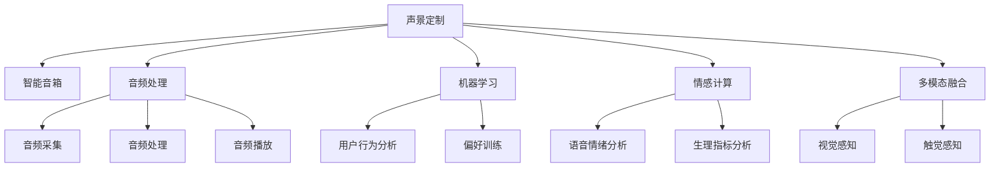

                 

# 智能家居声景定制创业：个性化的听觉环境营造

在追求生活品质的今天，智能家居已经不再是遥不可及的概念。随着物联网技术的发展，各种智能设备（如智能音箱、智能电视、智能门铃等）开始普及，极大提升了人们的生活便捷性和舒适度。但智能家居仅仅停留在硬件设备上还远远不够，还需要软件和服务来赋予它们真正的生命力。本文将深入探讨智能家居中个性化的听觉环境营造，即声景定制创业的奥秘。

## 1. 背景介绍

### 1.1 问题由来
随着生活节奏的加快，人们越来越渴望能够在繁忙的工作之余，拥有一个温馨、舒适、个性化的家居环境。传统的智能家居系统往往只能通过简单的开关控制和远程管理，难以满足人们对于个性化体验的追求。

### 1.2 问题核心关键点
个性化声景营造需要考虑以下几个关键点：

1. **用户需求的多样性**：不同用户对于家居环境的声景需求各不相同，需要系统能够根据用户喜好进行智能定制。
2. **声景的动态变化**：居家生活环境中，声景需要随时间、场景和用户的活动状态而动态变化。
3. **技术的融合**：声景定制不仅需要音频处理技术，还需要机器学习、用户行为分析、情感计算等多项技术的融合。
4. **用户体验的提升**：声景营造最终目的是提升用户的居家体验，因此需要考虑声景的实际效果和用户的情感反馈。

### 1.3 问题研究意义
个性化的声景营造对于提升人们的生活质量和幸福感具有重要意义：

1. **环境适应性**：根据不同场景和需求，自动调整家居环境的声音，提升用户的舒适度。
2. **情感提升**：通过音乐、白噪音等声景营造，调节用户的情绪，缓解压力。
3. **智能家居的升级**：声景定制能够使智能家居系统更加智能化、人性化。

## 2. 核心概念与联系

### 2.1 核心概念概述

为了更好地理解个性化声景营造的原理和架构，本节将介绍几个关键概念：

- **声景定制**：根据用户需求，通过算法和硬件设备对家居环境中的声音进行智能调整，营造出符合用户期望的听觉体验。
- **智能音箱**：能够与用户交互的音频设备，可以作为声景定制的执行器和控制器。
- **音频处理**：包括音频的采集、处理、播放等，是声景定制的核心技术之一。
- **机器学习**：通过分析用户行为和偏好，训练声景定制模型，实现个性化声景的智能推荐。
- **情感计算**：通过分析用户的语音情绪、生理指标等，判断用户的情绪状态，从而调整声景。
- **多模态融合**：结合视觉、触觉等多种感知信息，提升声景定制的效果和准确性。

这些核心概念之间的逻辑关系可以通过以下Mermaid流程图来展示：

这个流程图展示了个性化声景营造的核心概念及其之间的关系：

1. 声景定制系统基于智能音箱进行音频处理。
2. 声景定制系统通过机器学习分析用户行为，训练模型进行个性化声景推荐。
3. 情感计算通过分析用户语音和生理指标，判断用户情绪，调整声景。
4. 多模态融合将视觉和触觉等感知信息与音频信息结合，提升声景定制的效果。

## 3. 核心算法原理 & 具体操作步骤

### 3.1 算法原理概述

个性化声景营造的核心算法包括音频处理、机器学习、情感计算等多项技术。其中，音频处理是基础，机器学习是核心，情感计算是补充。

#### 3.1.1 音频处理

音频处理主要涉及音频的采集、处理和播放，是声景定制的基础。音频采集通过麦克风等设备，采集家居环境中的声音信号。音频处理包括降噪、语音识别、回声消除等，提升音频质量。音频播放则通过智能音箱等设备，播放定制的声景。

#### 3.1.2 机器学习

机器学习是声景定制的核心算法，通过分析用户行为和偏好，训练声景定制模型，实现个性化声景的智能推荐。常用的机器学习算法包括决策树、随机森林、神经网络等。

#### 3.1.3 情感计算

情感计算通过分析用户的语音情绪、生理指标等，判断用户的情绪状态，从而调整声景。常用的情感计算技术包括语音情绪分析、生理指标监测等。

### 3.2 算法步骤详解

个性化声景营造的算法步骤包括音频采集、特征提取、用户行为分析、声景推荐和情感调整等。

#### 3.2.1 音频采集

音频采集是声景定制的第一步，通常通过麦克风等设备，采集家居环境中的声音信号。采集的音频信号经过降噪和预处理，进入后续处理阶段。

#### 3.2.2 特征提取

特征提取是声景定制的关键步骤，通过提取音频信号的特征，如频率、振幅、能量等，用于后续的用户行为分析和声景推荐。常用的特征提取算法包括傅里叶变换、梅尔频率倒谱系数等。

#### 3.2.3 用户行为分析

用户行为分析通过分析用户的语音、生理指标等，判断用户的活动状态和情绪状态，从而进行声景推荐和调整。常用的行为分析算法包括隐马尔可夫模型、支持向量机等。

#### 3.2.4 声景推荐

声景推荐通过机器学习模型，根据用户的行为和偏好，推荐符合用户期望的声景。常用的声景推荐算法包括协同过滤、深度学习等。

#### 3.2.5 情感调整

情感调整通过情感计算技术，判断用户的情绪状态，从而调整声景。常用的情感调整算法包括语音情绪分析、生理指标监测等。

### 3.3 算法优缺点

个性化声景营造的算法具有以下优点：

1. **个性化体验**：根据用户需求和偏好，智能调整家居环境的声音，提升用户的舒适度。
2. **智能化推荐**：通过机器学习模型，实现声景的智能推荐，提升用户体验。
3. **情感调节**：通过情感计算技术，调节用户的情绪，缓解压力。

但同时，也存在以下缺点：

1. **复杂度较高**：算法涉及音频处理、机器学习、情感计算等多项技术，实现复杂。
2. **数据需求量大**：需要大量用户数据进行模型训练和行为分析，对数据收集和处理能力要求较高。
3. **实时性要求高**：声景定制需要实时响应用户需求，对计算资源和网络带宽要求较高。

### 3.4 算法应用领域

个性化声景营造在多个领域都有广泛的应用：

1. **智能家居**：通过智能音箱等设备，实现声景的定制和调整，提升用户的居家体验。
2. **医疗健康**：通过情感计算技术，监测用户的生理指标，进行情绪调节，辅助心理健康。
3. **车载系统**：通过声景定制，营造舒适的车内环境，提升驾驶体验。
4. **办公室环境**：通过声景定制，调节办公环境的噪音和声景，提升工作效率和舒适度。

## 4. 数学模型和公式 & 详细讲解 & 举例说明

### 4.1 数学模型构建

为了更好地理解声景定制的数学原理，本节将介绍声景定制的数学模型。

设用户的行为特征为 $\mathbf{x} \in \mathbb{R}^n$，声景特征为 $\mathbf{y} \in \mathbb{R}^m$。声景定制的目标是找到一个映射函数 $f: \mathbb{R}^n \rightarrow \mathbb{R}^m$，使得推荐声景与用户行为特征的匹配度最大化。

目标函数为：

$$
\max_{\mathbf{w}, b} \sum_{i=1}^N \mathbf{w}^\top (\mathbf{x}_i - \mathbf{y}_i) + \frac{\lambda}{2} \|\mathbf{w}\|^2
$$

其中，$\mathbf{w}$ 和 $b$ 分别为机器学习模型的参数和偏置项，$\lambda$ 为正则化系数。

### 4.2 公式推导过程

通过上述目标函数，我们可以使用梯度下降等优化算法求解 $\mathbf{w}$ 和 $b$，得到最优的声景定制模型。

设 $\nabla_{\mathbf{w}} \mathcal{L}(\mathbf{w})$ 和 $\nabla_{b} \mathcal{L}(b)$ 分别为目标函数对 $\mathbf{w}$ 和 $b$ 的梯度，则模型参数的更新公式为：

$$
\mathbf{w} \leftarrow \mathbf{w} - \eta \nabla_{\mathbf{w}} \mathcal{L}(\mathbf{w}) - \eta \lambda \mathbf{w}
$$

其中，$\eta$ 为学习率。

### 4.3 案例分析与讲解

假设我们有一个智能音箱，用于声景定制。通过音频采集和特征提取，获取当前环境中的声音信号 $\mathbf{x}$。使用机器学习模型 $f(\mathbf{x}; \mathbf{w}, b)$ 预测用户的行为特征 $\mathbf{y}$。根据 $\mathbf{y}$ 和用户的偏好，推荐合适的声景 $\mathbf{s}$。最后，通过智能音箱播放声景 $\mathbf{s}$。

具体实现步骤如下：

1. 通过麦克风等设备采集音频信号 $\mathbf{x}$。
2. 对 $\mathbf{x}$ 进行降噪和预处理，得到特征向量 $\mathbf{f}_x$。
3. 使用机器学习模型 $f(\mathbf{f}_x; \mathbf{w}, b)$ 预测用户的行为特征 $\mathbf{y}$。
4. 根据 $\mathbf{y}$ 和用户的偏好，推荐声景 $\mathbf{s}$。
5. 通过智能音箱播放声景 $\mathbf{s}$。

## 5. 项目实践：代码实例和详细解释说明

### 5.1 开发环境搭建

在进行声景定制的开发之前，我们需要准备好开发环境。以下是使用Python进行PyTorch开发的环

