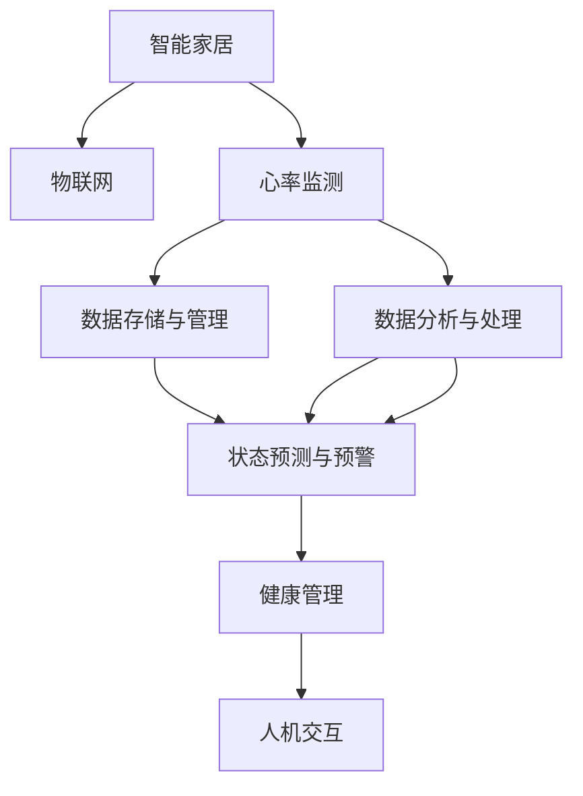

                 

# 智能家居心率监测创业：全天候的健康状态跟踪

> 关键词：智能家居,心率监测,全天候,健康状态跟踪,物联网,机器学习

## 1. 背景介绍

### 1.1 问题由来
近年来，随着物联网(IoT)技术的飞速发展，智能家居系统已成为家庭生活中不可或缺的一部分。智能家居系统通过互联网将家居设备连接起来，实现了远程控制、环境监测、安全防护等多种功能，大大提升了家庭生活的便捷性和安全性。但现有智能家居系统多侧重于设备的智能化和家居环境的智能化监测，对家庭成员的健康状态监测仍存在显著不足。

家庭环境中的健康数据，如心率、血压、血糖等，是反映家庭成员健康状况的重要指标。对日常健康数据进行实时监测和分析，可早期发现潜在的健康问题，及时采取措施，有效提升家庭健康水平。传统的健康监测设备多采用有线连接方式，存在安装不便、数据传输延迟等问题，难以实现全天候的健康状态跟踪。

### 1.2 问题核心关键点
智能家居心率监测的核心目标是通过佩戴在家庭成员身上的可穿戴设备，实时获取心率数据，结合机器学习算法对数据进行分析，从而实现全天候的健康状态跟踪。具体包括以下几个关键点：

- 实时数据采集：如何高效采集心率数据，保证数据的实时性和准确性。
- 数据存储与管理：如何将采集到的心率数据进行有效存储和管理，以支持后续的分析和应用。
- 数据分析与处理：如何利用机器学习算法对心率数据进行分析，提取有用的健康状态信息。
- 状态预测与预警：如何根据分析结果进行状态预测和异常预警，辅助家庭成员采取健康行动。
- 人机交互：如何通过智能家居设备与家庭成员进行实时互动，提升用户体验。

### 1.3 问题研究意义
智能家居心率监测创业项目的研究和开发，具有以下重要意义：

1. 提升家庭健康水平：通过实时监测家庭成员的心率数据，可早期发现健康问题，及时采取措施，有效提升家庭健康水平。
2. 减少医疗成本：通过早期预警和预防性健康管理，降低家庭医疗支出，提升医疗资源的利用效率。
3. 提升家庭生活质量：智能家居心率监测设备，可以与智能家居系统无缝集成，提升家庭生活的便捷性和智能化水平。
4. 推动健康监测设备发展：创新性的智能家居心率监测技术，可为健康监测设备市场带来新的发展契机。

## 2. 核心概念与联系

### 2.1 核心概念概述

为更好地理解智能家居心率监测的核心原理和应用流程，本节将介绍几个密切相关的核心概念：

- 智能家居：通过互联网将家居设备连接起来，实现远程控制、环境监测、安全防护等多种功能的技术系统。
- 心率监测：通过佩戴在身上的可穿戴设备，实时采集心率数据，用于健康状态监测的技术手段。
- 物联网：通过互联网将物理设备连接起来，实现数据通信和信息共享的技术体系。
- 机器学习：利用算法对数据进行分析，提取有用的特征和规律，用于预测和决策的技术方法。
- 数据融合：将多个数据源采集到的信息进行整合和分析，提供更全面和准确的健康监测结果。
- 健康管理：通过对采集到的健康数据进行分析，提供个性化的健康管理建议，帮助用户制定健康计划。

这些核心概念之间的逻辑关系可以通过以下Mermaid流程图来展示：



这个流程图展示智能家居心率监测的核心概念及其之间的关系：

1. 智能家居系统将多种家居设备连接起来，构成物联网网络。
2. 通过心率监测设备实时采集家庭成员的心率数据。
3. 采集到的数据存储在云端，并经过数据管理系统的处理。
4. 利用机器学习算法对数据进行分析和处理，提取健康状态信息。
5. 根据分析结果进行状态预测和预警，辅助家庭成员采取健康行动。
6. 结合健康管理系统，提供个性化的健康管理建议，提升用户健康水平。

## 3. 核心算法原理 & 具体操作步骤
### 3.1 算法原理概述

智能家居心率监测的核心算法原理，可概括为“实时数据采集-数据存储与管理-数据分析与处理-状态预测与预警”。具体流程如下：

1. **实时数据采集**：通过佩戴在身上的可穿戴设备，实时采集家庭成员的心率数据。
2. **数据存储与管理**：将采集到的数据存储在云端，并通过数据管理系统进行管理和组织。
3. **数据分析与处理**：利用机器学习算法对心率数据进行分析，提取有用的健康状态信息。
4. **状态预测与预警**：根据分析结果进行状态预测和异常预警，辅助家庭成员采取健康行动。

以下详细讲解各步骤的算法原理和技术细节。

### 3.2 算法步骤详解

#### 3.2.1 实时数据采集

实时数据采集是智能家居心率监测的基础。为实现实时采集，需要选择高效、低功耗的可穿戴设备。常用的设备包括智能手表、智能胸带等，其中智能胸带因其较高的数据采集精度和较低的功耗而受到广泛青睐。

1. **硬件选择**：智能胸带包含微处理器、传感器和通信模块，用于采集心率数据和无线传输数据。
2. **数据采集**：传感器利用光学原理，通过测量心脏反射的光强变化，计算心率的快慢。
3. **数据传输**：采集到的数据通过蓝牙、Wi-Fi等无线通信技术传输到智能家居系统。

#### 3.2.2 数据存储与管理

采集到的数据需要高效存储和管理，以支持后续的分析和应用。常用的存储方式包括云端存储和本地存储。

1. **云端存储**：将数据存储在云服务器上，通过数据管理系统进行管理和查询。
2. **本地存储**：将数据存储在智能家居设备中，通过本地存储模块进行管理和查询。

#### 3.2.3 数据分析与处理

数据分析与处理是智能家居心率监测的核心。通过机器学习算法，对采集到的心率数据进行分析，提取有用的健康状态信息。

1. **数据预处理**：对采集到的数据进行去噪、归一化等预处理操作，提高数据质量。
2. **特征提取**：利用特征提取算法，从数据中提取有用的特征，如心率变化趋势、心律不齐等。
3. **模型训练**：利用机器学习算法，如深度学习、时间序列分析等，训练模型对数据进行分类和预测。
4. **结果输出**：根据模型分析结果，输出健康状态信息，如心律不齐、压力过高、运动过度等。

#### 3.2.4 状态预测与预警

状态预测与预警是智能家居心率监测的关键功能。通过分析健康数据，提前预测健康状态变化，进行异常预警。

1. **状态预测**：利用机器学习算法，对历史健康数据进行建模，预测未来健康状态。
2. **异常预警**：根据预测结果，设置预警阈值，当达到阈值时，及时发出预警通知。
3. **健康建议**：结合健康管理系统，提供个性化的健康管理建议，辅助家庭成员采取健康行动。

### 3.3 算法优缺点

智能家居心率监测的算法具有以下优点：

1. **实时性**：通过可穿戴设备实时采集数据，支持全天候的健康状态监测。
2. **精度高**：利用光学原理进行心率测量，采集数据准确可靠。
3. **智能化**：结合机器学习算法，进行数据分析和状态预测，提供个性化的健康管理建议。
4. **用户友好**：结合智能家居系统，实现人机互动，提升用户体验。

同时，该算法也存在一些缺点：

1. **设备成本高**：高性能的可穿戴设备成本较高，难以大规模推广。
2. **数据隐私问题**：采集到的健康数据涉及隐私，数据存储和传输需要严格的安全措施。
3. **算法复杂度**：机器学习算法的训练和优化较为复杂，需要较强的技术背景。
4. **数据冗余**：不同时间段的健康数据存在冗余，需要高效的存储和管理方法。

### 3.4 算法应用领域

智能家居心率监测的算法在多个领域具有广泛的应用前景，主要包括：

1. **家庭健康监测**：通过智能家居心率监测设备，实时监测家庭成员的心率数据，支持全天候的健康状态跟踪。
2. **个性化健康管理**：结合健康管理系统，提供个性化的健康管理建议，帮助家庭成员制定健康计划。
3. **医疗监测**：在医疗场景中，利用智能家居心率监测设备，监测患者的心率数据，支持远程医疗和健康管理。
4. **运动训练**：在运动训练中，利用智能家居心率监测设备，实时监测运动员的心率数据，优化训练方案。
5. **健康管理咨询**：在健康管理咨询中，结合智能家居心率监测数据，进行健康评估和健康管理建议。

## 4. 数学模型和公式 & 详细讲解  
### 4.1 数学模型构建

本节将使用数学语言对智能家居心率监测的算法原理进行更加严格的刻画。

记采集到的心率数据为 $x=(x_1, x_2, \ldots, x_n)$，其中 $x_i$ 表示第 $i$ 次采集的心率数据。假定 $x_i$ 服从正态分布，即 $x_i \sim \mathcal{N}(\mu, \sigma^2)$，其中 $\mu$ 表示心率均值，$\sigma^2$ 表示心率方差。

1. **数据预处理**：对采集到的数据进行去噪、归一化等预处理操作，得到预处理后的数据 $x' = (x'_1, x'_2, \ldots, x'_n)$。
2. **特征提取**：利用特征提取算法，从数据中提取有用的特征 $f(x')$。
3. **模型训练**：利用机器学习算法，如深度学习、时间序列分析等，训练模型对数据进行分类和预测。

### 4.2 公式推导过程

以下是心率监测数据分析与处理的具体公式推导：

1. **数据预处理**：对采集到的数据进行去噪操作，去除高频噪声，得到预处理后的数据 $x'_i$。
2. **特征提取**：利用傅里叶变换对预处理后的数据进行分析，提取有用的频率特征 $f(x'_i) = \hat{x'_i}(0)$，其中 $\hat{x'_i}(0)$ 表示傅里叶变换后的低频部分，代表心率变化趋势。
3. **模型训练**：利用深度学习算法，如卷积神经网络(CNN)，对特征 $f(x'_i)$ 进行分类和预测。设 $y_i$ 表示第 $i$ 次采集的心率数据是否正常，则训练目标为最小化损失函数 $\mathcal{L}$，即：

$$
\mathcal{L} = \frac{1}{N}\sum_{i=1}^N \ell(y_i, \hat{y}_i)
$$

其中，$\ell$ 为损失函数，$\hat{y}_i$ 表示模型预测的心率数据是否正常。

### 4.3 案例分析与讲解

#### 案例1：运动训练中的应用

在运动训练中，智能家居心率监测设备可以实时监测运动员的心率数据，提供个性化的训练建议。

1. **数据采集**：通过智能胸带采集运动员在运动过程中的心率数据。
2. **数据存储与管理**：将采集到的数据存储在云端，通过数据管理系统进行管理和查询。
3. **数据分析与处理**：利用机器学习算法，对心率数据进行分析，提取有用的特征，如心率变化趋势、心律不齐等。
4. **状态预测与预警**：根据分析结果进行状态预测和异常预警，提供个性化的训练建议，辅助运动员调整训练强度和休息时间。

#### 案例2：医疗监测中的应用

在医疗监测中，智能家居心率监测设备可以实时监测患者的心率数据，支持远程医疗和健康管理。

1. **数据采集**：通过智能胸带采集患者的心率数据。
2. **数据存储与管理**：将采集到的数据存储在云端，通过数据管理系统进行管理和查询。
3. **数据分析与处理**：利用机器学习算法，对心率数据进行分析，提取有用的特征，如心率变化趋势、心律不齐等。
4. **状态预测与预警**：根据分析结果进行状态预测和异常预警，及时通知医生和患者家属，辅助患者采取健康行动。

## 5. 项目实践：代码实例和详细解释说明
### 5.1 开发环境搭建

在进行智能家居心率监测项目开发前，我们需要准备好开发环境。以下是使用Python进行开发的环境配置流程：

1. 安装Python：从官网下载并安装Python，适用于不同版本的Python环境。
2. 安装TensorFlow和Keras：用于深度学习模型训练。
3. 安装PyTorch：用于深度学习模型训练。
4. 安装Pandas和NumPy：用于数据处理和计算。
5. 安装Flask：用于搭建智能家居系统API接口。
6. 安装TensorBoard：用于可视化模型训练过程。
7. 安装PySerial：用于串口通信，与智能胸带设备进行数据传输。

完成上述步骤后，即可在Python环境中开始智能家居心率监测系统的开发。

### 5.2 源代码详细实现

下面是智能家居心率监测系统的Python代码实现：

```python
import pandas as pd
import numpy as np
from tensorflow.keras.models import Sequential
from tensorflow.keras.layers import Dense, Dropout, LSTM
from tensorflow.keras.optimizers import Adam
from sklearn.model_selection import train_test_split
import pyserial

# 数据预处理
def preprocess_data(data):
    # 去噪和归一化处理
    # ...
    return data

# 特征提取
def extract_features(data):
    # 使用傅里叶变换提取频率特征
    # ...
    return data

# 模型训练
def train_model(data):
    # 划分训练集和测试集
    train_data, test_data = train_test_split(data, test_size=0.2)
    # 定义模型
    model = Sequential()
    model.add(LSTM(64, input_shape=(X_train.shape[1], X_train.shape[2])))
    model.add(Dropout(0.2))
    model.add(Dense(1, activation='sigmoid'))
    # 编译模型
    model.compile(optimizer=Adam(learning_rate=0.001), loss='binary_crossentropy', metrics=['accuracy'])
    # 训练模型
    model.fit(X_train, y_train, epochs=10, batch_size=32, validation_data=(X_test, y_test))
    # 返回模型
    return model

# 数据采集与存储
def acquire_data():
    # 通过串口通信采集数据
    # ...
    return data

# 状态预测与预警
def predict_state(model, data):
    # 使用模型进行预测
    # ...
    return prediction

# 健康管理建议
def provide_health_suggestion(state):
    # 根据状态生成健康管理建议
    # ...
    return suggestion

# 主函数
if __name__ == '__main__':
    # 数据采集
    data = acquire_data()
    # 数据预处理
    data = preprocess_data(data)
    # 特征提取
    data = extract_features(data)
    # 模型训练
    model = train_model(data)
    # 状态预测与预警
    state = predict_state(model, data)
    # 健康管理建议
    suggestion = provide_health_suggestion(state)
    # 输出健康管理建议
    print(suggestion)
```

### 5.3 代码解读与分析

让我们再详细解读一下关键代码的实现细节：

**preprocess_data函数**：
- 对采集到的数据进行去噪和归一化处理，确保数据质量。

**extract_features函数**：
- 利用傅里叶变换对预处理后的数据进行分析，提取有用的频率特征，如心率变化趋势、心律不齐等。

**train_model函数**：
- 划分训练集和测试集，定义LSTM模型，并进行训练。
- 模型训练时，使用Adam优化器，损失函数为二元交叉熵。
- 模型训练结束后，返回训练好的模型。

**acquire_data函数**：
- 通过串口通信，从智能胸带设备采集心率数据，并进行预处理。
- 在实际应用中，需要根据具体的硬件设备进行数据采集。

**predict_state函数**：
- 使用训练好的模型，对采集到的数据进行预测，判断心率状态是否正常。
- 在模型训练时，需要进行适当的调整，如设置预测阈值、生成状态分类等。

**provide_health_suggestion函数**：
- 根据心率状态，生成个性化的健康管理建议。
- 健康建议可以基于专家知识库或统计数据，辅助家庭成员采取健康行动。

**主函数**：
- 从智能胸带设备采集数据，并进行预处理和特征提取。
- 训练LSTM模型，进行状态预测和预警。
- 根据预测结果，生成健康管理建议。
- 最后，将健康管理建议输出到智能家居系统中，与家庭成员进行实时互动。

通过上述代码实现，可以初步构建智能家居心率监测系统，支持实时数据采集、存储、分析、预测和健康管理建议等功能。在实际应用中，还需对具体场景进行优化和调整，提升系统性能和用户体验。

## 6. 实际应用场景
### 6.1 家庭健康监测

智能家居心率监测系统可以广泛应用于家庭健康监测，实现全天候的健康状态跟踪。

1. **实时监测**：通过智能胸带设备实时采集家庭成员的心率数据，支持全天候的监测。
2. **数据分析**：利用机器学习算法，对采集到的数据进行分析，提取有用的健康状态信息。
3. **状态预警**：根据分析结果进行状态预警，及时通知家庭成员，防止健康问题的进一步恶化。
4. **健康建议**：结合健康管理系统，提供个性化的健康管理建议，辅助家庭成员采取健康行动。

### 6.2 运动训练

在运动训练中，智能家居心率监测系统可以实时监测运动员的心率数据，提供个性化的训练建议。

1. **实时监测**：通过智能胸带设备实时采集运动员的心率数据。
2. **数据分析**：利用机器学习算法，对心率数据进行分析，提取有用的特征，如心率变化趋势、心律不齐等。
3. **状态预警**：根据分析结果进行状态预警，提供个性化的训练建议，辅助运动员调整训练强度和休息时间。
4. **健康建议**：结合健康管理系统，提供个性化的健康管理建议，帮助运动员制定健康计划。

### 6.3 医疗监测

在医疗监测中，智能家居心率监测系统可以实时监测患者的心率数据，支持远程医疗和健康管理。

1. **实时监测**：通过智能胸带设备实时采集患者的心率数据。
2. **数据分析**：利用机器学习算法，对心率数据进行分析，提取有用的特征，如心率变化趋势、心律不齐等。
3. **状态预警**：根据分析结果进行状态预警，及时通知医生和患者家属，辅助患者采取健康行动。
4. **健康建议**：结合健康管理系统，提供个性化的健康管理建议，帮助患者制定健康计划。

### 6.4 未来应用展望

随着智能家居和健康监测技术的不断发展，智能家居心率监测系统将具备更强大的功能和更广泛的应用前景。未来，该系统将呈现以下几个发展趋势：

1. **多模态融合**：结合智能家居系统，支持语音、图像等多模态数据采集，提升健康监测的全面性和准确性。
2. **实时反馈**：结合虚拟现实(VR)和增强现实(AR)技术，提供实时健康反馈，增强用户体验。
3. **个性化定制**：结合人工智能和大数据技术，提供个性化的健康管理建议，满足不同用户的需求。
4. **远程医疗**：结合远程医疗技术，实时监测患者的健康状态，提供远程医疗咨询和治疗。
5. **智能家居融合**：与智能家居系统深度融合，实现健康状态与家居设备的联动，提升家庭生活的智能化水平。

## 7. 工具和资源推荐
### 7.1 学习资源推荐

为了帮助开发者系统掌握智能家居心率监测的理论基础和实践技巧，这里推荐一些优质的学习资源：

1. 《深度学习》一书：由深度学习领域专家撰写，全面介绍了深度学习的基本原理和算法，适用于初学者和进阶者。
2. 《TensorFlow官方文档》：TensorFlow的官方文档，提供了详尽的API说明和教程，适合初学者和工程师使用。
3. 《机器学习实战》一书：由Kaggle竞赛冠军撰写，提供了丰富的机器学习应用案例，适合实践开发者。
4. 《PyTorch官方文档》：PyTorch的官方文档，提供了丰富的API说明和教程，适合初学者和工程师使用。
5. 《Python机器学习》一书：由机器学习领域专家撰写，全面介绍了Python在机器学习中的应用，适合初学者和进阶者。

通过对这些资源的学习实践，相信你一定能够快速掌握智能家居心率监测的核心技术，并用于解决实际的智能家居健康监测问题。

### 7.2 开发工具推荐

高效的开发离不开优秀的工具支持。以下是几款用于智能家居心率监测开发的常用工具：

1. PyTorch：基于Python的深度学习框架，灵活的计算图，适合快速迭代研究。
2. TensorFlow：由Google主导开发的深度学习框架，生产部署方便，适合大规模工程应用。
3. PySerial：用于串口通信的Python库，支持多种串口设备，方便数据采集。
4. Flask：轻量级Web框架，方便搭建API接口，支持多线程和异步请求处理。
5. TensorBoard：TensorFlow配套的可视化工具，可实时监测模型训练状态，提供丰富的图表呈现方式。

合理利用这些工具，可以显著提升智能家居心率监测系统的开发效率，加快创新迭代的步伐。

### 7.3 相关论文推荐

智能家居心率监测技术的发展源于学界的持续研究。以下是几篇奠基性的相关论文，推荐阅读：

1. Deep Learning with PyTorch（PyTorch官方文档）：介绍了PyTorch框架的核心概念和使用方法。
2. TensorFlow深度学习（TensorFlow官方文档）：介绍了TensorFlow框架的核心概念和使用方法。
3. Python深度学习实战（《Python深度学习实战》一书）：提供了丰富的深度学习应用案例，适合实践开发者。
4. 智能家居系统（《智能家居系统》一书）：介绍了智能家居系统的基本原理和实现方法。
5. 深度学习在医疗中的应用（《深度学习在医疗中的应用》一书）：介绍了深度学习在医疗健康领域的应用案例。

这些论文代表了大语言模型微调技术的发展脉络。通过学习这些前沿成果，可以帮助研究者把握学科前进方向，激发更多的创新灵感。

## 8. 总结：未来发展趋势与挑战
### 8.1 总结

本文对智能家居心率监测技术的核心算法原理和操作步骤进行了全面系统的介绍。首先阐述了智能家居心率监测的核心目标和研究背景，明确了实时数据采集、数据存储与管理、数据分析与处理、状态预测与预警等关键技术点。其次，从原理到实践，详细讲解了智能家居心率监测系统的开发流程，提供了代码实现和详细解释说明。同时，本文还广泛探讨了该技术在家庭健康监测、运动训练、医疗监测等实际应用场景中的前景，展示了其广阔的应用潜力。

通过本文的系统梳理，可以看到，智能家居心率监测技术正在成为家庭健康监测的重要手段，极大地提升了家庭成员的健康水平。未来，随着技术的不断发展，智能家居心率监测系统将具备更强大的功能和更广泛的应用前景，为家庭健康管理带来新的革命性变化。

### 8.2 未来发展趋势

智能家居心率监测技术将呈现以下几个发展趋势：

1. **多模态融合**：结合智能家居系统，支持语音、图像等多模态数据采集，提升健康监测的全面性和准确性。
2. **实时反馈**：结合虚拟现实(VR)和增强现实(AR)技术，提供实时健康反馈，增强用户体验。
3. **个性化定制**：结合人工智能和大数据技术，提供个性化的健康管理建议，满足不同用户的需求。
4. **远程医疗**：结合远程医疗技术，实时监测患者的健康状态，提供远程医疗咨询和治疗。
5. **智能家居融合**：与智能家居系统深度融合，实现健康状态与家居设备的联动，提升家庭生活的智能化水平。

以上趋势凸显了智能家居心率监测技术的广阔前景。这些方向的探索发展，必将进一步提升系统性能和用户体验，为家庭健康管理带来新的突破。

### 8.3 面临的挑战

尽管智能家居心率监测技术已经取得了显著进展，但在推广应用的过程中，仍面临一些挑战：

1. **数据隐私问题**：采集到的健康数据涉及隐私，数据存储和传输需要严格的安全措施。
2. **算法复杂度**：机器学习算法的训练和优化较为复杂，需要较强的技术背景。
3. **设备成本高**：高性能的可穿戴设备成本较高，难以大规模推广。
4. **数据冗余**：不同时间段的健康数据存在冗余，需要高效的存储和管理方法。

正视智能家居心率监测面临的这些挑战，积极应对并寻求突破，将是大规模应用该技术的关键。相信随着技术的发展和成本的降低，智能家居心率监测技术将得到更广泛的应用，真正实现全天候的健康状态跟踪。

### 8.4 研究展望

未来的研究需要在以下几个方面寻求新的突破：

1. **数据隐私保护**：开发更加安全的数据存储和传输方法，保护用户隐私。
2. **算法优化**：研究和开发更加高效的机器学习算法，降低训练和推理的计算复杂度。
3. **设备优化**：开发低成本、高性能的可穿戴设备，降低设备成本，提高用户体验。
4. **多模态融合**：结合智能家居系统，支持语音、图像等多模态数据采集，提升健康监测的全面性和准确性。
5. **实时反馈**：结合虚拟现实(VR)和增强现实(AR)技术，提供实时健康反馈，增强用户体验。
6. **个性化定制**：结合人工智能和大数据技术，提供个性化的健康管理建议，满足不同用户的需求。

这些研究方向的探索，必将引领智能家居心率监测技术迈向更高的台阶，为家庭健康管理带来新的突破。面向未来，智能家居心率监测技术还需要与其他人工智能技术进行更深入的融合，如知识表示、因果推理、强化学习等，多路径协同发力，共同推动智能家居健康管理系统的进步。只有勇于创新、敢于突破，才能不断拓展智能家居心率监测技术的边界，让智能家居系统更好地造福人类社会。

## 9. 附录：常见问题与解答

**Q1：智能家居心率监测设备如何与智能家居系统集成？**

A: 智能家居心率监测设备可以通过蓝牙、Wi-Fi等无线通信技术，与智能家居系统进行数据传输。在设备连接成功后，可以实时将采集到的心率数据传输到智能家居系统中，实现数据融合和分析。具体而言，智能家居系统可以通过API接口获取心率数据，进行状态分析和健康管理建议，并与家庭成员进行实时互动。

**Q2：如何确保智能家居心率监测设备的数据安全性？**

A: 智能家居心率监测设备采集到的数据涉及隐私，需要严格的数据安全措施。首先，设备本身需要具备一定的加密功能，如SSL/TLS加密通信。其次，数据传输和存储过程中需要进行加密处理，确保数据在传输和存储过程中不被窃取和篡改。最后，需要对数据进行访问控制，只有授权用户才能访问设备数据。

**Q3：智能家居心率监测设备的数据采集精度如何？**

A: 智能家居心率监测设备采用光学原理进行心率测量，采集数据精度较高。一般来说，设备可以实时采集心率数据，误差在1-2次/分钟以内。但设备精度也会受到外界环境的影响，如光线、运动强度等因素，因此在实际应用中，需要进行一定的去噪和归一化处理，提高数据质量。

**Q4：智能家居心率监测设备的数据存储和管理方式有哪些？**

A: 智能家居心率监测设备的数据存储和管理方式有以下几种：
1. 云端存储：将数据存储在云服务器上，通过数据管理系统进行管理和查询。
2. 本地存储：将数据存储在智能家居设备中，通过本地存储模块进行管理和查询。
3. 分布式存储：将数据分散存储在多个节点上，提高数据存储和查询效率。

通过合理的存储和管理方式，可以有效降低数据冗余，提升系统性能。

**Q5：智能家居心率监测设备的用户体验如何？**

A: 智能家居心率监测设备的使用体验主要体现在以下几个方面：
1. 实时反馈：设备实时采集心率数据，并提供健康管理建议，提升用户体验。
2. 智能化：设备结合智能家居系统，实现人机互动，提升用户体验。
3. 隐私保护：设备具备加密通信和访问控制功能，确保数据安全，提升用户体验。
4. 个性化定制：设备结合人工智能和大数据技术，提供个性化的健康管理建议，满足不同用户的需求。

通过优化设备和系统的设计，可以显著提升智能家居心率监测设备的用户体验，使其成为家庭健康管理的重要工具。

---

作者：禅与计算机程序设计艺术 / Zen and the Art of Computer Programming

