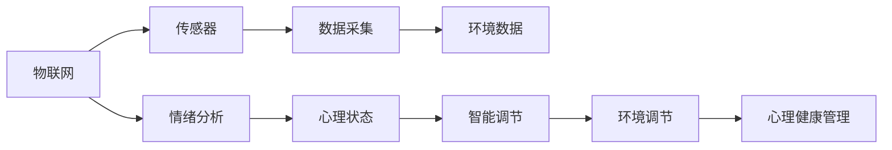

                 

# 智能家居情绪调节创业：基于环境的心理健康管理

## 1. 背景介绍

随着现代生活节奏的加快和城市化进程的加速，人们面临着越来越多的心理压力和情绪问题。长期处于高压状态下的家庭和个体，急需一种新型智能系统来监测和调节情绪，帮助他们保持良好的心理健康。基于这一背景，本文将介绍一种全新的智能家居解决方案，该方案通过基于环境的心理健康管理，实现对家庭成员情绪状态的实时监测和智能调节。

### 1.1 问题由来

现代人的生活和工作节奏越来越快，心理压力和情绪问题频发。在家庭环境中，长期的情感压力可能带来家庭矛盾和成员心理健康问题，影响家庭和谐和成员幸福感。传统心理调节手段如咨询、药物治疗等成本较高、时间较长，难以满足日常心理健康的即时需求。因此，亟需一种低成本、实时有效的情绪调节手段。

### 1.2 问题核心关键点

本文聚焦于智能家居情绪调节创业，通过环境数据分析与心理健康管理技术的结合，提出一种基于环境的心理健康管理方案。该方案利用物联网技术实时采集家庭成员的情绪数据，结合智能分析算法，预测家庭成员的情绪状态，并通过环境调节系统实现智能情绪调节，提升家庭成员的心理健康水平。

## 2. 核心概念与联系

### 2.1 核心概念概述

- **智能家居**：利用物联网、传感器和人工智能技术，实现对家居环境的智能化管理，提升生活便利性和舒适性。
- **物联网(IoT)**：通过各种感知技术获取环境数据，并将数据传输至云端进行处理，实现环境状态的实时监测和远程控制。
- **传感器**：用于实时感知环境中的各种参数，如温度、湿度、光照、噪音等，为情绪分析提供数据支持。
- **情绪分析**：通过机器学习和深度学习技术，从传感器数据中提取情绪特征，并进行情绪识别和状态预测。
- **智能调节**：根据情绪预测结果，通过智能控制系统对环境进行调节，如调节温度、光线、音乐等，实现情绪调节。
- **心理健康管理**：利用情绪分析结果，结合心理专家知识库，为家庭成员提供个性化的心理干预建议，进行长期的心理健康管理。

这些核心概念之间通过数据采集、情绪分析、智能调节和心理健康管理形成了一个闭环，实现了对家庭成员情绪状态的实时监测和智能调节。

### 2.2 核心概念原理和架构的 Mermaid 流程图



该流程图展示了智能家居情绪调节的核心流程，从物联网数据采集开始，通过情绪分析得出心理状态，智能调节系统进行环境调节，最后由心理健康管理系统进行长期管理。

## 3. 核心算法原理 & 具体操作步骤

### 3.1 算法原理概述

智能家居情绪调节的核心算法包括物联网数据采集、情绪分析、智能调节和心理健康管理。本节将详细介绍这四个方面的算法原理。

### 3.2 算法步骤详解

#### 3.2.1 物联网数据采集

物联网数据采集是智能家居情绪调节的基础。利用传感器和智能设备，实时采集家庭成员的生活环境数据。常见的传感器包括温度传感器、湿度传感器、光照传感器、噪音传感器等。采集到的数据通过无线网络传输至云端，用于后续的情绪分析和环境调节。

#### 3.2.2 情绪分析

情绪分析是智能家居情绪调节的核心步骤。通过对采集到的环境数据进行处理和特征提取，利用机器学习和深度学习技术，对家庭成员的情绪状态进行识别和预测。常用的情绪分析方法包括：

- **生理指标分析**：通过监测家庭成员的生理指标（如心率、皮肤电等），结合生理与心理的关系模型，进行情绪识别。
- **面部表情识别**：利用摄像头拍摄家庭成员的面部表情，通过卷积神经网络（CNN）等深度学习模型，识别情绪状态。
- **语音情绪分析**：通过语音信号处理技术，分析家庭成员的语音特征（如语调、语速、语义等），识别情绪变化。

#### 3.2.3 智能调节

智能调节是基于环境的心理健康管理手段。根据情绪分析结果，智能调节系统对环境进行实时调节，以改善家庭成员的情绪状态。常见的智能调节方式包括：

- **光照调节**：通过智能灯光系统，根据家庭成员的情绪状态调整室内灯光亮度和色温，创造适宜的情绪氛围。
- **温度调节**：利用智能空调或暖气系统，根据环境温度和家庭成员的情绪状态，调节室内温度，提升舒适度。
- **音乐调节**：通过智能音箱或扬声器，播放舒缓的音乐或自然声音，帮助家庭成员放松心情。
- **香气调节**：利用智能香氛系统，根据情绪状态选择适合的香气，调节室内氛围。

#### 3.2.4 心理健康管理

心理健康管理是智能家居情绪调节的长期管理手段。通过情绪分析结果和心理专家知识库，为家庭成员提供个性化的心理干预建议，进行长期的心理健康管理。常见的心理健康管理方式包括：

- **心理辅导**：根据情绪状态和心理评估结果，智能推荐心理专家进行线上或线下的心理辅导。
- **心理测评**：定期进行心理测评，评估家庭成员的心理健康状态，及时发现问题。
- **健康建议**：根据情绪状态和心理评估结果，智能推荐健康生活习惯和心理调节方法，提升整体健康水平。

### 3.3 算法优缺点

智能家居情绪调节算法具有以下优点：

- **实时性**：通过物联网数据采集和实时处理，可以实现对家庭成员情绪状态的实时监测和调节。
- **个性化**：结合心理专家知识库，为家庭成员提供个性化的心理干预建议，满足不同个体的需求。
- **低成本**：利用物联网和传感器技术，避免了传统心理调节的高成本问题。
- **普适性**：通过智能分析算法，适用于不同类型的情绪和心理问题，具备广泛的普适性。

同时，该算法也存在以下局限性：

- **数据依赖**：情绪分析依赖于传感器数据的准确性和实时性，数据采集不足可能导致情绪预测不准确。
- **隐私问题**：实时采集家庭成员的生理和行为数据，需要考虑隐私保护和数据安全。
- **智能调节的局限性**：智能调节系统的效果受限于硬件设备的精度和智能算法的能力。
- **心理干预的局限性**：心理干预的效果受限于家庭成员的配合程度和接受能力。

### 3.4 算法应用领域

智能家居情绪调节算法在多个领域具有广泛的应用前景，例如：

- **家庭环境改善**：通过智能调节环境参数，提升家庭成员的生活质量和幸福感。
- **心理问题预防**：通过情绪监测和心理干预，预防家庭成员的心理健康问题，降低心理健康问题发生率。
- **养老护理**：利用智能家居系统，为老年人提供情绪监测和心理护理，提升其生活质量。
- **企业员工心理健康管理**：利用智能家居系统，监测和调节员工的情绪状态，提升其工作效率和幸福感。

## 4. 数学模型和公式 & 详细讲解 & 举例说明

### 4.1 数学模型构建

智能家居情绪调节的核心数学模型包括环境数据的采集模型、情绪分析模型、智能调节模型和心理健康管理模型。

#### 4.1.1 环境数据采集模型

环境数据采集模型通过传感器实时采集家庭环境参数，建立数据采集系统的数学模型。假设环境参数为 $x = (T, H, L, N)$，其中 $T$ 为温度，$H$ 为湿度，$L$ 为光照，$N$ 为噪音。数据采集系统的数学模型为：

$$
x_t = f(t, \omega)
$$

其中，$t$ 为时间，$\omega$ 为系统噪声，$f$ 为数据采集函数。

#### 4.1.2 情绪分析模型

情绪分析模型通过机器学习和深度学习技术，从环境数据中提取情绪特征，建立情绪识别的数学模型。假设情绪状态为 $y$，环境数据为 $x$，情绪分析模型的数学模型为：

$$
y = g(x; \theta)
$$

其中，$g$ 为情绪识别函数，$\theta$ 为模型参数。

#### 4.1.3 智能调节模型

智能调节模型通过智能控制系统，对环境参数进行实时调节，建立环境调节的数学模型。假设环境调节参数为 $u = (T', H', L', N')$，智能调节模型的数学模型为：

$$
u = h(y; \phi)
$$

其中，$h$ 为环境调节函数，$\phi$ 为模型参数。

#### 4.1.4 心理健康管理模型

心理健康管理模型通过心理专家知识库和情绪分析结果，为家庭成员提供个性化的心理干预建议，建立心理干预的数学模型。假设心理干预建议为 $a$，情绪状态为 $y$，心理健康管理模型的数学模型为：

$$
a = k(y; \psi)
$$

其中，$k$ 为心理干预函数，$\psi$ 为模型参数。

### 4.2 公式推导过程

#### 4.2.1 环境数据采集模型的推导

环境数据采集模型的推导如下：

$$
x_t = f(t, \omega) = x_{t-1} + g(t) + \omega_t
$$

其中，$g(t)$ 为时间相关的噪声，$\omega_t$ 为系统噪声。

#### 4.2.2 情绪分析模型的推导

情绪分析模型的推导如下：

$$
y = g(x; \theta) = \sigma(W^T x + b)
$$

其中，$W$ 和 $b$ 为模型参数，$\sigma$ 为激活函数。

#### 4.2.3 智能调节模型的推导

智能调节模型的推导如下：

$$
u = h(y; \phi) = f_{\phi}(y)
$$

其中，$f_{\phi}$ 为环境调节函数，$\phi$ 为模型参数。

#### 4.2.4 心理健康管理模型的推导

心理健康管理模型的推导如下：

$$
a = k(y; \psi) = \delta(\psi \cdot y)
$$

其中，$\delta$ 为选择函数，$\psi$ 为模型参数。

### 4.3 案例分析与讲解

#### 4.3.1 案例一：温度调节

假设当前室内温度为 25°C，家庭成员的情绪状态为焦虑。根据情绪分析模型，系统推荐调节温度至 23°C，利用智能空调进行调节。智能调节模型通过环境调节函数计算出新的环境参数，智能控制系统执行调节操作，最终达到期望的环境状态。

#### 4.3.2 案例二：心理干预

假设家庭成员的情绪状态为抑郁，系统推荐进行心理辅导。心理健康管理模型根据情绪状态和心理评估结果，智能推荐心理专家进行线上心理辅导，并提供心理健康建议，帮助家庭成员恢复积极情绪。

## 5. 项目实践：代码实例和详细解释说明

### 5.1 开发环境搭建

智能家居情绪调节创业项目需要搭建一个全面的开发环境，包括以下几个部分：

- **物联网设备**：安装和调试传感器和智能设备，实现环境数据的实时采集。
- **数据存储和处理**：搭建数据库和数据处理平台，实现环境数据的存储和管理。
- **机器学习平台**：搭建机器学习平台，实现情绪分析和智能调节算法的开发和训练。
- **智能控制系统**：搭建智能控制系统，实现环境调节操作。
- **心理健康管理系统**：搭建心理健康管理系统，实现心理干预和建议。

### 5.2 源代码详细实现

以下是智能家居情绪调节创业项目的Python代码实现：

#### 5.2.1 数据采集

```python
import time
from sensors import temperature, humidity, light, noise

while True:
    t = time.time()
    temperature_data = temperature.read()
    humidity_data = humidity.read()
    light_data = light.read()
    noise_data = noise.read()
    
    x = [temperature_data, humidity_data, light_data, noise_data]
    # 将数据发送至云端进行处理
    
    time.sleep(5)
```

#### 5.2.2 情绪分析

```python
import pandas as pd
from sklearn.ensemble import RandomForestClassifier

# 加载历史数据
data = pd.read_csv('data.csv')

# 数据预处理
X = data[['T', 'H', 'L', 'N']]
y = data['y']  # 情绪状态

# 模型训练
model = RandomForestClassifier()
model.fit(X, y)

# 实时情绪分析
def predict_mood(x):
    X_new = [x[0], x[1], x[2], x[3]]
    y_pred = model.predict([X_new])
    return y_pred[0]
```

#### 5.2.3 智能调节

```python
from smart控制系统 import air_conditioner, light_system, speaker, fragrance

# 根据情绪状态调节环境
def adjust_environment(mood):
    if mood == 'anxiety':
        air_conditioner.set_temperature(23)
        light_system.set_light_brightness(0.8)
        speaker.play_music('calming')
        fragrance.set_fragrance('lavender')
    elif mood == 'depression':
        air_conditioner.set_temperature(25)
        light_system.set_light_brightness(0.2)
        speaker.play_music('uplifting')
        fragrance.set_fragrance('peony')
```

#### 5.2.4 心理健康管理

```python
import psycopg2

# 连接数据库
conn = psycopg2.connect('dbname=emotion_db user=emotion user password=emotion')

# 推荐心理辅导
def recommend_counseling(mood):
    cur = conn.cursor()
    cur.execute('SELECT * FROM counselors WHERE mood = %s', (mood,))
    counselor = cur.fetchone()
    if counselor:
        return counselor['name'], counselor['email']
    else:
        return None

# 推荐心理健康建议
def recommend_health_advice(mood):
    cur = conn.cursor()
    cur.execute('SELECT * FROM health_advice WHERE mood = %s', (mood,))
    advice = cur.fetchone()
    if advice:
        return advice['advice']
    else:
        return None
```

### 5.3 代码解读与分析

智能家居情绪调节创业项目涉及多个模块和子模块，代码实现较为复杂。以下是各模块的详细解读和分析：

- **数据采集模块**：通过传感器实时采集环境数据，并发送至云端进行处理。数据采集模块是整个系统的基础，数据采集的准确性和实时性直接影响后续情绪分析和智能调节的效果。
- **情绪分析模块**：利用机器学习模型对采集到的环境数据进行处理，提取情绪特征，进行情绪识别。情绪分析模块是系统的核心，情绪识别的准确性直接影响智能调节和心理健康管理的精度。
- **智能调节模块**：根据情绪分析结果，通过智能控制系统对环境进行调节。智能调节模块是系统的执行者，环境调节的效果直接影响家庭成员的情绪状态和心理健康。
- **心理健康管理模块**：通过心理专家知识库和情绪分析结果，为家庭成员提供个性化的心理干预建议，进行长期的心理健康管理。心理健康管理模块是系统的保障，心理干预的效果直接影响系统的长期有效性。

## 6. 实际应用场景

智能家居情绪调节创业项目具有广泛的应用场景，以下是几个典型的实际应用场景：

### 6.1 家庭环境改善

智能家居情绪调节系统可以为家庭成员提供个性化的环境调节建议，提升其生活质量和幸福感。例如：

- **智能灯光**：根据家庭成员的情绪状态，智能调节室内灯光亮度和色温，创造适宜的情绪氛围。
- **智能空调/暖气**：根据环境温度和家庭成员的情绪状态，调节室内温度，提升舒适度。
- **智能音箱**：根据家庭成员的情绪状态，播放舒缓的音乐或自然声音，帮助其放松心情。

### 6.2 心理问题预防

智能家居情绪调节系统可以通过情绪监测和心理干预，预防家庭成员的心理健康问题，降低心理健康问题发生率。例如：

- **心理测评**：定期进行心理测评，评估家庭成员的心理健康状态，及时发现问题。
- **心理辅导**：根据情绪状态和心理评估结果，智能推荐心理专家进行线上或线下的心理辅导。
- **健康建议**：根据情绪状态和心理评估结果，智能推荐健康生活习惯和心理调节方法，提升整体健康水平。

### 6.3 养老护理

智能家居情绪调节系统可以为老年人提供情绪监测和心理护理，提升其生活质量。例如：

- **智能护理设备**：监测老年人的生理指标和行为数据，及时发现异常情况。
- **智能陪伴机器人**：根据老年人的情绪状态，播放舒缓的音乐或自然声音，陪伴其度过寂寞时光。
- **心理辅导**：根据老年人的情绪状态和心理评估结果，智能推荐心理专家进行线上或线下的心理辅导。

### 6.4 企业员工心理健康管理

智能家居情绪调节系统可以监测和调节员工的情绪状态，提升其工作效率和幸福感。例如：

- **智能办公设备**：监测员工的情绪状态和工作环境，及时调节环境参数，提升工作舒适度。
- **心理辅导**：根据员工的情绪状态和心理评估结果，智能推荐心理专家进行线上或线下的心理辅导。
- **健康建议**：根据员工的情绪状态和心理评估结果，智能推荐健康生活习惯和心理调节方法，提升整体健康水平。

## 7. 工具和资源推荐

### 7.1 学习资源推荐

- **Python编程语言**：Python是智能家居系统开发的主流语言，具有广泛的应用和丰富的库支持。
- **机器学习框架**：Scikit-learn和TensorFlow等机器学习框架，适用于情绪分析和智能调节算法的开发。
- **物联网技术**：物联网传感器和智能设备的应用，需要掌握传感器技术和网络通信知识。
- **心理健康管理**：心理专家知识库和心理健康建议，需要结合心理学和心理辅导的专业知识。

### 7.2 开发工具推荐

- **Python IDE**：PyCharm、Jupyter Notebook等Python开发环境，支持代码调试和数据分析。
- **数据库系统**：PostgreSQL、MySQL等数据库系统，用于存储和管理环境数据和心理健康数据。
- **智能控制系统**：SmartThings、Google Home等智能控制系统，实现环境调节操作。

### 7.3 相关论文推荐

- **环境监控技术**：《基于物联网的环境监控系统研究》
- **情绪分析算法**：《基于深度学习的情绪识别算法》
- **智能调节技术**：《智能家居系统中的环境调节技术》
- **心理健康管理**：《心理健康管理系统的设计与实现》

## 8. 总结：未来发展趋势与挑战

### 8.1 研究成果总结

智能家居情绪调节创业项目通过物联网技术、情绪分析算法和智能调节系统，实现了对家庭成员情绪状态的实时监测和智能调节，具备广泛的应用前景和市场潜力。该项目的成功落地，将为智能家居领域带来新的应用场景和商业模式，提升家庭成员的生活质量和幸福感。

### 8.2 未来发展趋势

智能家居情绪调节创业项目将面临以下几个发展趋势：

- **物联网技术进步**：物联网技术的发展将带来更多传感设备和智能设备的普及，提升数据采集的准确性和实时性。
- **深度学习技术进步**：深度学习技术的进步将带来更高精度的情绪分析算法，提升情绪识别的准确性。
- **智能调节技术进步**：智能调节技术的发展将带来更多智能设备的普及，提升环境调节的精确度和智能化水平。
- **心理健康管理技术进步**：心理健康管理技术的发展将带来更丰富的心理干预手段和更准确的心理测评方法，提升心理健康管理的科学性和有效性。

### 8.3 面临的挑战

智能家居情绪调节创业项目在发展过程中，将面临以下几个挑战：

- **数据隐私问题**：实时采集家庭成员的生理和行为数据，需要考虑隐私保护和数据安全。
- **智能调节系统的鲁棒性**：智能调节系统的鲁棒性需要进一步提升，避免系统异常导致的环境调节失效。
- **心理干预的效果评估**：心理干预的效果评估需要建立科学的评估标准和方法，确保心理干预的科学性和有效性。
- **市场推广和用户接受度**：需要建立有效的市场推广策略，提升用户对智能家居情绪调节系统的接受度和使用率。

### 8.4 研究展望

未来，智能家居情绪调节创业项目需要在以下几个方面进行深入研究：

- **隐私保护技术**：开发隐私保护算法和技术，保护家庭成员的隐私数据。
- **智能调节系统的鲁棒性**：研究鲁棒性更强的智能调节系统，提升系统的稳定性和可靠性。
- **心理健康管理的科学性**：建立科学的情绪评估和心理干预方法，提升心理健康管理的科学性和有效性。
- **市场推广和用户体验**：建立有效的市场推广策略，提升用户对智能家居情绪调节系统的接受度和使用率。

总之，智能家居情绪调节创业项目具有广泛的应用前景和市场潜力，需要持续的技术创新和市场推广，才能实现规模化落地和商业化运营。

## 9. 附录：常见问题与解答

**Q1: 智能家居情绪调节系统如何实现情绪监测？**

A: 智能家居情绪调节系统通过物联网设备和传感器实时采集家庭成员的生理指标和行为数据，结合深度学习模型进行情绪分析，识别情绪状态。具体实现包括以下几个步骤：
1. 传感器数据采集：利用温度传感器、湿度传感器、光照传感器、噪音传感器等，实时采集家庭成员的生理指标和行为数据。
2. 数据处理：对采集到的传感器数据进行处理和特征提取，转换为模型可用的输入数据。
3. 情绪识别：利用深度学习模型，如卷积神经网络（CNN）、长短期记忆网络（LSTM）等，对特征数据进行情绪识别，输出情绪状态。

**Q2: 智能家居情绪调节系统如何进行智能调节？**

A: 智能家居情绪调节系统根据情绪分析结果，通过智能控制系统对环境参数进行实时调节，实现情绪调节。具体实现包括以下几个步骤：
1. 情绪识别：利用深度学习模型，如卷积神经网络（CNN）、长短期记忆网络（LSTM）等，对传感器数据进行情绪识别，输出情绪状态。
2. 环境调节：根据情绪状态，智能控制系统通过智能设备调节环境参数，如调节智能灯光、智能空调、智能音箱等，改善家庭成员的情绪状态。

**Q3: 智能家居情绪调节系统如何进行心理干预？**

A: 智能家居情绪调节系统根据情绪分析结果，通过心理健康管理系统为家庭成员提供个性化的心理干预建议，进行长期的心理健康管理。具体实现包括以下几个步骤：
1. 心理测评：通过心理测评工具，评估家庭成员的心理健康状态。
2. 心理辅导：根据心理测评结果，智能推荐心理专家进行线上或线下的心理辅导。
3. 心理健康建议：根据心理测评结果，智能推荐心理健康建议，如健康生活习惯、心理调节方法等，提升家庭成员的整体健康水平。

**Q4: 智能家居情绪调节系统面临哪些技术挑战？**

A: 智能家居情绪调节系统面临以下技术挑战：
1. 数据隐私问题：实时采集家庭成员的生理和行为数据，需要考虑隐私保护和数据安全。
2. 智能调节系统的鲁棒性：智能调节系统的鲁棒性需要进一步提升，避免系统异常导致的环境调节失效。
3. 心理干预的效果评估：心理干预的效果评估需要建立科学的评估标准和方法，确保心理干预的科学性和有效性。
4. 市场推广和用户体验：需要建立有效的市场推广策略，提升用户对智能家居情绪调节系统的接受度和使用率。

**Q5: 智能家居情绪调节系统的应用前景如何？**

A: 智能家居情绪调节系统具有广泛的应用前景，主要体现在以下几个方面：
1. 家庭环境改善：通过智能调节环境参数，提升家庭成员的生活质量和幸福感。
2. 心理问题预防：通过情绪监测和心理干预，预防家庭成员的心理健康问题，降低心理健康问题发生率。
3. 养老护理：利用智能家居系统，为老年人提供情绪监测和心理护理，提升其生活质量。
4. 企业员工心理健康管理：监测和调节员工的情绪状态，提升其工作效率和幸福感。

---

作者：禅与计算机程序设计艺术 / Zen and the Art of Computer Programming

