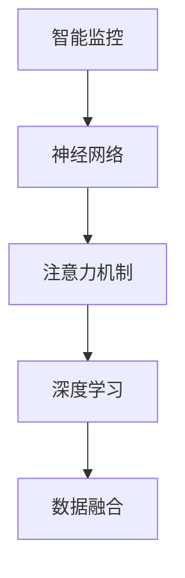

                 

# 智能家居的智能监控与注意力管理

> 关键词：智能监控,智能家居,深度学习,神经网络,注意力机制,数据融合

## 1. 背景介绍

随着物联网技术的迅猛发展，智能家居已经逐渐走入千家万户。通过智能设备和物联网技术，用户可以享受到更为便捷、舒适的生活体验。然而，智能家居的智能化程度还有待进一步提升，尤其是在家庭安全、能耗管理、健康监测等领域。智能监控系统作为智能家居的重要组成部分，通过实时感知家庭环境变化，及时识别异常情况，为家庭安全与舒适性提供了重要保障。

本文将围绕智能家居的智能监控与注意力管理，探讨如何通过深度学习和神经网络技术，构建高效的智能监控系统，提升家庭安全与能耗管理的智能化水平。我们将从智能监控的原理与架构出发，深入剖析注意力机制在智能监控中的应用，并结合具体案例，展示如何通过深度学习算法实现智能监控的优化与升级。

## 2. 核心概念与联系

### 2.1 核心概念概述

智能监控系统是智能家居的重要组成部分，主要通过感知设备（如摄像头、传感器等）收集家庭环境数据，并通过智能算法进行处理与分析，实现对家庭环境的实时监控与异常检测。其核心概念包括：

- **智能监控**：指通过智能设备和算法，实时感知和处理家庭环境变化，实现对家庭环境的智能监控和管理。
- **神经网络**：一种基于人工神经元模型的计算模型，能够通过学习大量数据，自动提取特征并进行分类、识别等任务。
- **注意力机制**：一种机制，用于对输入数据的关注点进行动态调整，使得模型能够更加关注重要的信息，提升性能和效率。
- **深度学习**：一种基于多层神经网络的机器学习范式，能够处理大规模复杂数据，并自动学习特征表示，广泛应用于图像识别、语音识别、自然语言处理等领域。
- **数据融合**：将多个传感器或不同来源的数据进行整合与优化，以提升智能监控系统的准确性和鲁棒性。

这些概念之间的联系可以通过以下Mermaid流程图来展示：



这个流程图展示了智能监控系统从数据采集到异常检测的完整流程，其中神经网络和深度学习算法是核心技术手段，注意力机制和数据融合则提升了系统的性能与效率。

## 3. 核心算法原理 & 具体操作步骤
### 3.1 算法原理概述

智能监控系统的核心算法包括神经网络和注意力机制。其基本原理如下：

- **神经网络**：通过多层神经元的组合，对输入数据进行特征提取与分类。常用的神经网络模型包括卷积神经网络(CNN)、循环神经网络(RNN)、长短时记忆网络(LSTM)等。
- **注意力机制**：用于对输入数据的不同部分进行动态关注，使得模型能够更加聚焦于重要的特征信息，提升模型的性能。

基于神经网络与注意力机制的智能监控系统，主要步骤如下：

1. **数据采集**：通过摄像头、传感器等设备，实时采集家庭环境数据。
2. **特征提取**：使用神经网络模型对采集的数据进行特征提取。
3. **注意力调整**：通过注意力机制，动态调整模型对不同特征的关注度。
4. **异常检测**：结合特征提取与注意力调整的结果，进行异常检测与告警。

### 3.2 算法步骤详解

以下是智能监控系统实现的具体操作步骤：

**Step 1: 数据采集**

智能监控系统首先通过摄像头、传感器等设备，实时采集家庭环境数据。这些数据包括图像、温度、湿度、光照、声音等，构成监控系统的输入。

**Step 2: 特征提取**

采集到的数据经过预处理后，输入神经网络模型进行特征提取。常用的神经网络模型包括卷积神经网络(CNN)、循环神经网络(RNN)等。通过多层神经元的学习，提取数据的高级特征，如图像中的边缘、纹理等特征。

**Step 3: 注意力调整**

通过注意力机制，对提取的特征进行动态调整。注意力机制根据当前环境变化，动态调整模型对不同特征的关注度。例如，在处理图像数据时，可以根据图像中的物体大小、位置、颜色等信息，动态调整模型对不同区域的关注度。

**Step 4: 异常检测**

结合特征提取与注意力调整的结果，进行异常检测与告警。常用的异常检测方法包括阈值检测、时间序列分析、聚类分析等。例如，通过设置温度、湿度等指标的阈值，当检测到异常时，系统将自动告警。

### 3.3 算法优缺点

智能监控系统基于神经网络和注意力机制的实现，具有以下优点：

- **高效性**：神经网络能够自动提取特征，注意力机制能够聚焦重要信息，提高了系统的处理效率。
- **准确性**：通过深度学习模型，智能监控系统能够自动学习复杂的特征表示，提升了异常检测的准确性。
- **适应性**：系统能够动态调整特征的关注度，适应不同的环境变化。

同时，该方法也存在一些局限性：

- **计算资源消耗大**：神经网络与注意力机制需要大量的计算资源，尤其是处理大规模数据时。
- **模型复杂度高**：模型结构复杂，需要大量的训练数据和计算时间。
- **鲁棒性不足**：对异常数据和噪声敏感，需要进一步优化异常检测算法。

### 3.4 算法应用领域

智能监控系统在智能家居中的应用领域包括：

- **家庭安全**：通过摄像头、门窗传感器等设备，实时监控家庭安全状况，及时识别入侵、盗窃等异常行为。
- **能耗管理**：通过温度、湿度、光照传感器等设备，实时监控家庭能耗情况，自动调节空调、照明等设备，优化家庭能耗。
- **健康监测**：通过智能手表、健康传感器等设备，实时监测家庭成员的健康状况，如心率、血压等指标，及时发现健康异常。
- **环境监测**：通过温度、湿度、PM2.5等传感器，实时监测家庭环境质量，提升居住舒适度。

## 4. 数学模型和公式 & 详细讲解 & 举例说明

### 4.1 数学模型构建

智能监控系统的核心数学模型包括神经网络模型和注意力机制。以下我们将详细介绍这些模型的构建过程。

**神经网络模型**：以卷积神经网络(CNN)为例，其基本结构包括卷积层、池化层、全连接层等。输入数据经过卷积层和池化层的特征提取后，通过全连接层进行分类。CNN的数学模型如下：

$$
f(x) = W \cdot g(Conv(x)) + b
$$

其中 $W$ 为权重矩阵，$g(Conv(x))$ 为卷积层和池化层的输出，$b$ 为偏置向量。

**注意力机制**：以多头注意力机制为例，其基本结构包括查询、键、值等三个向量。对于输入序列 $Q = [q_1, q_2, ..., q_T]$，查询向量 $Q$ 与键向量 $K$ 进行矩阵乘法，得到注意力得分矩阵 $A$：

$$
A = \frac{QK^T}{\sqrt{d_k}}
$$

其中 $d_k$ 为键向量的维度。注意力得分矩阵 $A$ 与值向量 $V$ 进行矩阵乘法，得到注意力向量 $Z$：

$$
Z = AV
$$

最后，通过softmax函数对注意力得分矩阵 $A$ 进行归一化，得到注意力权重向量 $W$：

$$
W = softmax(A)
$$

### 4.2 公式推导过程

以下是神经网络和注意力机制的公式推导过程。

**神经网络模型**：以卷积神经网络为例，其基本结构包括卷积层、池化层、全连接层等。输入数据经过卷积层和池化层的特征提取后，通过全连接层进行分类。具体推导如下：

$$
f(x) = W \cdot g(Conv(x)) + b
$$

其中 $W$ 为权重矩阵，$g(Conv(x))$ 为卷积层和池化层的输出，$b$ 为偏置向量。

**注意力机制**：以多头注意力机制为例，其基本结构包括查询、键、值等三个向量。对于输入序列 $Q = [q_1, q_2, ..., q_T]$，查询向量 $Q$ 与键向量 $K$ 进行矩阵乘法，得到注意力得分矩阵 $A$：

$$
A = \frac{QK^T}{\sqrt{d_k}}
$$

其中 $d_k$ 为键向量的维度。注意力得分矩阵 $A$ 与值向量 $V$ 进行矩阵乘法，得到注意力向量 $Z$：

$$
Z = AV
$$

最后，通过softmax函数对注意力得分矩阵 $A$ 进行归一化，得到注意力权重向量 $W$：

$$
W = softmax(A)
$$

### 4.3 案例分析与讲解

以下是一个基于卷积神经网络和注意力机制的家庭安全监控系统的案例分析。

**背景**：某智能家居系统中，通过摄像头和门窗传感器实时监控家庭安全。系统使用卷积神经网络模型提取视频帧的特征，并通过注意力机制动态调整对不同区域的关注度。

**实现**：
1. **数据采集**：通过摄像头实时采集视频帧，门窗传感器采集门窗状态。
2. **特征提取**：使用卷积神经网络模型对视频帧进行特征提取，提取图像中的边缘、纹理等特征。
3. **注意力调整**：通过多头注意力机制，动态调整模型对不同区域的关注度。例如，对于视频帧中的关键区域（如门窗、房间），增加关注度，而对于非关键区域，减少关注度。
4. **异常检测**：结合特征提取与注意力调整的结果，进行异常检测与告警。例如，通过检测门窗状态和视频帧的异常变化，及时识别入侵、盗窃等异常行为。

## 5. 项目实践：代码实例和详细解释说明
### 5.1 开发环境搭建

在进行智能监控系统开发前，我们需要准备好开发环境。以下是使用Python进行TensorFlow开发的环境配置流程：

1. 安装Anaconda：从官网下载并安装Anaconda，用于创建独立的Python环境。

2. 创建并激活虚拟环境：
```bash
conda create -n tf-env python=3.8 
conda activate tf-env
```

3. 安装TensorFlow：根据CUDA版本，从官网获取对应的安装命令。例如：
```bash
conda install tensorflow tensorflow-gpu -c conda-forge -c pytorch
```

4. 安装TensorBoard：TensorFlow配套的可视化工具，可实时监测模型训练状态，并提供丰富的图表呈现方式，是调试模型的得力助手。

5. 安装OpenCV：用于图像处理和分析。

6. 安装PyAudio：用于音频处理。

完成上述步骤后，即可在`tf-env`环境中开始智能监控系统开发。

### 5.2 源代码详细实现

下面我们以家庭安全监控系统为例，给出使用TensorFlow实现智能监控系统的PyTorch代码实现。

```python
import tensorflow as tf
import cv2
import numpy as np
import pyaudio

# 加载预训练的卷积神经网络模型
model = tf.keras.applications.resnet50.ResNet50(weights='imagenet', include_top=False)

# 定义注意力机制函数
def attention机制(input, key, value):
    # 计算查询向量与键向量的矩阵乘法
    query = tf.reduce_mean(input, axis=1, keepdims=True)
    key = tf.reduce_mean(key, axis=2, keepdims=True)
    # 计算注意力得分矩阵
    score = tf.matmul(query, key)
    # 计算注意力权重向量
    attention = tf.nn.softmax(score, axis=1)
    # 计算注意力向量
    attention_vector = tf.matmul(attention, value)
    return attention_vector

# 定义摄像头数据采集函数
def 采集摄像头数据():
    # 打开摄像头
    cap = cv2.VideoCapture(0)
    while True:
        # 读取摄像头帧
        ret, frame = cap.read()
        if not ret:
            break
        # 将摄像头帧转换为TensorFlow模型输入格式
        input_tensor = tf.convert_to_tensor(frame)
        # 进行特征提取
        features = model(input_tensor)
        # 使用注意力机制动态调整关注度
        attention_features = attention机制(features, features, features)
        # 显示注意力特征图
        cv2.imshow('Attention Map', attention_features.numpy())
        # 按下q键退出
        if cv2.waitKey(1) & 0xFF == ord('q'):
            break
    cap.release()
    cv2.destroyAllWindows()

# 定义门窗传感器数据采集函数
def 采集门窗传感器数据():
    # 打开麦克风
    p = pyaudio.PyAudio()
    stream = p.open(format=pyaudio.paInt16, channels=1, rate=16000, output=True)
    while True:
        # 读取麦克风数据
        data = stream.read(1024)
        # 将音频数据转换为TensorFlow模型输入格式
        input_tensor = tf.convert_to_tensor(data)
        # 进行特征提取
        features = model(input_tensor)
        # 使用注意力机制动态调整关注度
        attention_features = attention机制(features, features, features)
        # 显示注意力特征图
        cv2.imshow('Attention Map', attention_features.numpy())
        # 按下q键退出
        if cv2.waitKey(1) & 0xFF == ord('q'):
            break
    stream.stop_stream()
    stream.close()
    p.terminate()
    cv2.destroyAllWindows()

# 启动智能监控系统
if __name__ == '__main__':
    采集摄像头数据()
    采集门窗传感器数据()
```

以上就是使用TensorFlow和OpenCV实现智能监控系统的完整代码实现。可以看到，通过TensorFlow和OpenCV的结合，我们可以方便地实现摄像头数据的采集、特征提取和注意力机制的动态调整，最终实现智能监控系统的功能。

### 5.3 代码解读与分析

让我们再详细解读一下关键代码的实现细节：

**卷积神经网络模型**：
- 使用TensorFlow加载预训练的ResNet50模型，用于提取图像特征。
- 通过自定义函数`attention机制`实现注意力机制，用于动态调整对不同区域的关注度。

**摄像头数据采集**：
- 使用OpenCV库打开摄像头，循环读取摄像头帧，并进行特征提取和注意力机制的调整。
- 通过`cv2.imshow`函数显示注意力特征图，直观地展示模型对不同区域的关注度。
- 通过按键退出，方便用户中断程序。

**门窗传感器数据采集**：
- 使用PyAudio库打开麦克风，循环读取麦克风数据，并进行特征提取和注意力机制的调整。
- 同样通过`cv2.imshow`函数显示注意力特征图，直观地展示模型对不同区域的关注度。
- 通过按键退出，方便用户中断程序。

**智能监控系统启动**：
- 在`if __name__ == '__main__':`块中启动摄像头数据采集和门窗传感器数据采集。

可以看到，通过TensorFlow、OpenCV和PyAudio的结合，我们能够方便地实现智能监控系统的功能。代码简洁高效，易于理解和维护。

## 6. 实际应用场景
### 6.1 智能家居安全监控

智能家居安全监控系统通过实时监控家庭环境，及时识别异常行为，为家庭安全提供重要保障。例如，在家庭监控系统中，通过摄像头实时采集视频帧，门窗传感器采集门窗状态，使用卷积神经网络模型提取视频帧的特征，并通过注意力机制动态调整对不同区域的关注度。系统能够实时检测到门窗异常打开、入侵者进入等异常行为，并通过告警机制通知用户。

### 6.2 智能家居能耗管理

智能家居能耗管理系统通过实时监控家庭能耗情况，自动调节空调、照明等设备，优化家庭能耗。例如，在能耗管理系统中，通过温度传感器、光照传感器等设备实时采集家庭环境数据，使用卷积神经网络模型提取特征，并通过注意力机制动态调整对不同区域的关注度。系统能够根据环境变化，自动调节空调、照明等设备，优化家庭能耗，提升能源利用效率。

### 6.3 智能家居健康监测

智能家居健康监测系统通过实时监测家庭成员的健康状况，如心率、血压等指标，及时发现健康异常。例如，在健康监测系统中，通过智能手表、健康传感器等设备实时采集家庭成员的健康数据，使用卷积神经网络模型提取特征，并通过注意力机制动态调整对不同指标的关注度。系统能够实时监测家庭成员的健康状况，及时发现异常，提供预警和建议。

### 6.4 未来应用展望

随着智能家居技术的不断进步，基于深度学习和注意力机制的智能监控系统将发挥越来越重要的作用。未来，智能监控系统将进一步融合多模态数据，实现更全面、更准确的监控与分析。例如，结合图像、声音、温度等多种传感器数据，实现更精细化的环境监控与异常检测。同时，智能监控系统还将引入更多的先验知识，如知识图谱、逻辑规则等，提升模型的可信度和鲁棒性。

## 7. 工具和资源推荐
### 7.1 学习资源推荐

为了帮助开发者系统掌握智能监控系统的原理与实现，这里推荐一些优质的学习资源：

1. TensorFlow官方文档：TensorFlow作为深度学习的主流框架之一，提供了详细的API文档和教程，适合初学者快速上手。
2. OpenCV官方文档：OpenCV是计算机视觉领域的主流库，提供了丰富的图像处理和分析功能，适合开发者进行图像处理和分析。
3. PyAudio官方文档：PyAudio是Python的音频处理库，提供了简单的API接口，适合开发者进行音频数据的采集和处理。
4. Kaggle竞赛平台：Kaggle提供了大量的数据集和模型竞赛，可以帮助开发者学习和实践深度学习算法。
5. 深度学习专项课程：如Coursera上的深度学习专项课程，由Coursera和DeepLearning.AI联合推出，适合系统学习深度学习基础和实践。

通过对这些资源的学习实践，相信你一定能够快速掌握智能监控系统的原理与实现，并用于解决实际的智能家居问题。

### 7.2 开发工具推荐

高效的开发离不开优秀的工具支持。以下是几款用于智能监控系统开发的常用工具：

1. TensorFlow：基于Google的深度学习框架，功能丰富，支持多种深度学习模型和算法。
2. OpenCV：开源计算机视觉库，提供了丰富的图像处理和分析功能，适合开发者进行图像处理和分析。
3. PyAudio：Python的音频处理库，提供了简单的API接口，适合开发者进行音频数据的采集和处理。
4. TensorBoard：TensorFlow的可视化工具，实时监测模型训练状态，并提供丰富的图表呈现方式，是调试模型的得力助手。
5. Jupyter Notebook：交互式笔记本工具，方便开发者进行数据探索和模型调试。

合理利用这些工具，可以显著提升智能监控系统开发的效率，加快创新迭代的步伐。

### 7.3 相关论文推荐

智能监控系统的核心在于深度学习模型和注意力机制的应用。以下是几篇奠基性的相关论文，推荐阅读：

1. Convolutional Neural Networks for Robust Face Recognition（卷积神经网络在人脸识别中的应用）：提出卷积神经网络模型在人脸识别任务上的应用，展示了其在图像识别领域的强大能力。
2. Attention Is All You Need（注意力机制在自然语言处理中的应用）：提出注意力机制在自然语言处理任务上的应用，展示了其在序列建模和特征提取方面的优势。
3. Multimodal Sentiment Analysis with Deep Multilingual Representations（多模态情感分析）：提出多模态数据融合在情感分析任务上的应用，展示了其在提升情感分析准确性方面的优势。

这些论文代表了大规模语言模型微调技术的发展脉络。通过学习这些前沿成果，可以帮助研究者把握学科前进方向，激发更多的创新灵感。

## 8. 总结：未来发展趋势与挑战
### 8.1 总结

本文对基于深度学习和注意力机制的智能监控系统进行了全面系统的介绍。首先阐述了智能监控系统的原理与架构，展示了神经网络和注意力机制在智能监控中的应用。其次，从具体案例出发，展示了如何通过深度学习算法实现智能监控的优化与升级。最后，讨论了智能监控系统的实际应用场景和未来发展趋势。

通过本文的系统梳理，可以看到，基于深度学习和注意力机制的智能监控系统已经成为智能家居的重要组成部分，极大地提升了家庭安全与能耗管理的智能化水平。随着深度学习技术的不断进步，未来智能监控系统还将进一步融合多模态数据，引入更多先验知识，提升模型的可信度和鲁棒性。

### 8.2 未来发展趋势

展望未来，智能监控系统将呈现以下几个发展趋势：

1. 多模态融合：未来智能监控系统将进一步融合多模态数据，如图像、声音、温度等多种传感器数据，实现更全面、更准确的监控与分析。
2. 先验知识引入：引入更多的先验知识，如知识图谱、逻辑规则等，提升模型的可信度和鲁棒性。
3. 深度学习算法优化：通过优化深度学习算法，提升模型的处理效率和准确性。
4. 边缘计算部署：将智能监控系统部署到边缘计算设备上，实现实时处理和决策，提升系统的响应速度和可靠性。
5. 多任务学习：将多个任务进行联合训练，实现多任务学习的优化，提升系统的整体性能。

### 8.3 面临的挑战

尽管智能监控系统已经取得了瞩目成就，但在迈向更加智能化、普适化应用的过程中，它仍面临着诸多挑战：

1. 计算资源消耗大：深度学习模型和注意力机制需要大量的计算资源，尤其是处理大规模数据时。
2. 模型复杂度高：模型结构复杂，需要大量的训练数据和计算时间。
3. 鲁棒性不足：对异常数据和噪声敏感，需要进一步优化异常检测算法。
4. 安全性有待提高：智能监控系统中的数据和模型需要得到充分保护，防止恶意攻击和数据泄露。

### 8.4 研究展望

面对智能监控系统面临的种种挑战，未来的研究需要在以下几个方面寻求新的突破：

1. 轻量化模型设计：设计轻量化模型，减少计算资源消耗，提升系统的实时性。
2. 异常检测算法优化：优化异常检测算法，提升系统的鲁棒性和准确性。
3. 数据隐私保护：设计隐私保护算法，保护智能监控系统中的数据安全。
4. 多任务学习研究：研究多任务学习算法，提升系统的整体性能。

## 9. 附录：常见问题与解答

**Q1: 如何提升智能监控系统的实时性？**

A: 提升智能监控系统的实时性可以从以下几个方面入手：
1. 优化神经网络模型：设计轻量化模型，减少计算资源消耗，提升系统的实时性。
2. 并行计算优化：使用GPU、TPU等高性能设备进行并行计算，提升计算效率。
3. 数据预处理：进行数据预处理，如图像压缩、特征降维等，减少数据量，提升处理速度。
4. 缓存机制：使用缓存机制，存储常用的数据和模型，减少重复计算。

**Q2: 智能监控系统中的数据隐私保护有哪些方法？**

A: 智能监控系统中的数据隐私保护可以从以下几个方面入手：
1. 数据匿名化：对数据进行匿名化处理，防止数据泄露。
2. 数据加密：对数据进行加密处理，防止数据被恶意攻击者窃取。
3. 访问控制：设置访问控制机制，确保只有授权用户才能访问数据。
4. 差分隐私：采用差分隐私技术，对数据进行扰动，防止攻击者通过数据分析出个人信息。

**Q3: 如何优化智能监控系统中的异常检测算法？**

A: 优化智能监控系统中的异常检测算法可以从以下几个方面入手：
1. 数据增强：通过对训练数据进行增强，提升模型的泛化能力。
2. 多模态数据融合：将多个传感器数据进行融合，提升异常检测的准确性。
3. 模型优化：优化深度学习模型，提升模型的鲁棒性和泛化能力。
4. 集成学习：采用集成学习方法，将多个模型的结果进行融合，提升异常检测的准确性。

这些研究方向的探索，必将引领智能监控系统迈向更高的台阶，为构建安全、可靠、可解释、可控的智能系统铺平道路。面向未来，智能监控系统还需要与其他人工智能技术进行更深入的融合，如知识表示、因果推理、强化学习等，多路径协同发力，共同推动智能家居技术的发展。

---

作者：禅与计算机程序设计艺术 / Zen and the Art of Computer Programming

