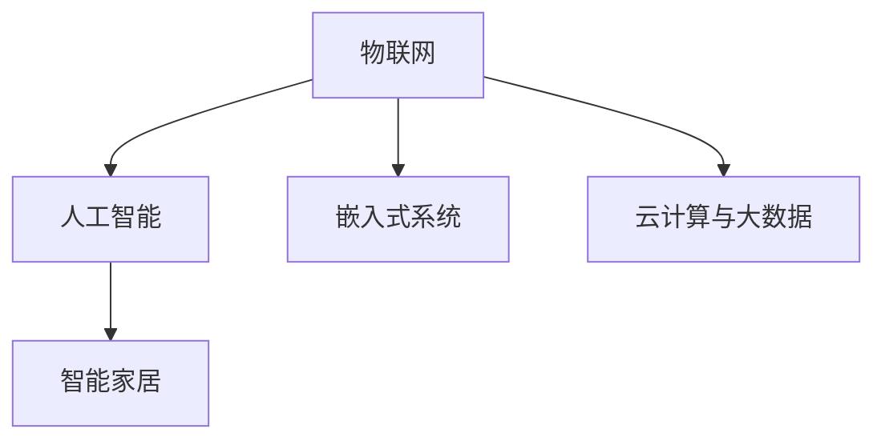

                 

# 智能家电创业：物联网家居的核心产品

## 1. 背景介绍

### 1.1 问题由来
近年来，随着人工智能和物联网技术的飞速发展，智能家居产品逐渐成为人们生活中的重要组成部分。从智能音箱到智能温控器，再到智能冰箱、洗衣机等，智能家电产品的应用场景越来越多，用户体验也得到了显著提升。

智能家电的兴起，不仅改变了人们的生活方式，还催生了智能家居创业的热潮。越来越多的创业者涌入这个市场，希望通过创新的产品和解决方案，赢得消费者的青睐。

### 1.2 问题核心关键点
智能家电创业的核心问题包括：

- 如何选择合适的技术方案和硬件设备，构建高效、稳定的智能家居系统？
- 如何设计用户友好的界面和交互方式，提升用户体验？
- 如何通过数据分析和机器学习技术，实现智能家居产品的个性化和智能化？
- 如何构建智能家居生态系统，实现不同设备间的互联互通？
- 如何应对市场竞争，提升产品的市场占有率？

这些关键问题贯穿了智能家居产品的从研发到市场化的全过程，是智能家电创业成功与否的重要因素。

### 1.3 问题研究意义
研究智能家居产品的核心技术，对于提升用户体验，推动智能家居行业的发展，具有重要意义：

- 提升用户满意度：通过高效、稳定、个性化的智能家居系统，提升用户的生活质量和便利性。
- 开拓新市场：智能家居是未来的发展趋势，开拓智能家居市场，将为创业者带来巨大的商业机会。
- 促进技术创新：智能家居技术涉及多学科交叉，推动技术创新，可以为整个智能行业带来新的突破。
- 构建生态系统：实现不同设备间的互联互通，构建智能家居生态系统，促进智能家居产品的普及和应用。
- 增强竞争力：掌握智能家居核心技术，增强产品竞争力，保持市场领先地位。

## 2. 核心概念与联系

### 2.1 核心概念概述

为了更好地理解智能家居的核心产品，我们需要引入几个关键概念：

- **物联网（IoT）**：物联网是指通过互联网连接各种设备和系统，实现设备间的互连互通和数据共享。
- **智能家居**：智能家居是指通过物联网技术，将家居设备连接起来，实现远程控制、自动化管理和智能化服务。
- **人工智能（AI）**：人工智能是指通过机器学习、深度学习等技术，实现智能家居系统的自主学习和决策。
- **嵌入式系统**：嵌入式系统是指将计算和控制逻辑嵌入到硬件设备中，实现设备智能化。
- **云计算与大数据**：云计算和大数据技术为智能家居系统提供了强大的数据存储、处理和分析能力。

这些概念之间的联系可以通过以下Mermaid流程图来展示：



这个流程图展示了物联网、人工智能、嵌入式系统和云计算与大数据之间的关系：

1. **物联网**：连接各种设备和系统，实现设备间的互连互通和数据共享。
2. **人工智能**：通过机器学习和深度学习技术，实现智能家居系统的自主学习和决策。
3. **嵌入式系统**：将计算和控制逻辑嵌入到硬件设备中，实现设备智能化。
4. **云计算与大数据**：为智能家居系统提供强大的数据存储、处理和分析能力。

这些概念共同构成了智能家居的核心技术框架，使得智能家居系统具备高效、稳定、个性化和智能化的特点。

## 3. 核心算法原理 & 具体操作步骤

### 3.1 算法原理概述

智能家居产品的核心算法原理主要基于物联网、人工智能和嵌入式系统技术。具体来说，包括：

- **设备互联技术**：实现不同设备间的通信和数据交换。
- **数据分析技术**：对用户行为数据进行分析和处理，实现个性化服务。
- **机器学习技术**：通过训练数据，提升智能家居系统的预测和决策能力。
- **嵌入式系统技术**：将算法逻辑嵌入到硬件设备中，实现实时控制和自动化管理。

### 3.2 算法步骤详解

智能家居产品的开发通常包括以下几个关键步骤：

**Step 1: 需求分析与设计**
- 分析用户需求，确定智能家居产品的功能和特点。
- 设计产品的硬件架构和软件架构，确定数据传输协议和设备接口。

**Step 2: 硬件选型与开发**
- 选择合适的硬件设备和传感器，进行设备选型。
- 开发设备驱动程序和嵌入式系统软件，实现设备的智能化和网络化。

**Step 3: 数据采集与预处理**
- 设计数据采集方案，收集用户行为数据。
- 对采集到的数据进行预处理和清洗，去除噪声和异常数据。

**Step 4: 数据分析与建模**
- 选择合适的数据分析模型，进行数据建模。
- 使用机器学习技术，对用户行为进行分析和预测，实现个性化服务。

**Step 5: 系统集成与测试**
- 将数据分析模型和嵌入式系统软件集成到智能家居系统中。
- 进行系统测试，验证系统稳定性和功能正确性。

**Step 6: 用户体验优化**
- 设计用户友好的界面和交互方式，提升用户体验。
- 根据用户反馈，不断优化产品功能和性能。

### 3.3 算法优缺点

智能家居产品的算法原理和操作步骤具有以下优点：

- **高效性**：通过物联网技术，实现设备间的实时通信和数据交换，提升系统响应速度和处理效率。
- **稳定性**：嵌入式系统技术将算法逻辑嵌入到硬件设备中，实现实时控制和自动化管理，确保系统稳定性。
- **个性化**：通过数据分析和机器学习技术，实现对用户行为的分析和预测，提供个性化服务。
- **可扩展性**：系统架构设计合理，可以通过增加设备和数据源，实现系统扩展和升级。

同时，智能家居产品的算法原理和操作步骤也存在一些局限性：

- **成本较高**：硬件选型和开发成本较高，需要选择合适的设备和传感器。
- **技术复杂**：涉及多学科交叉，需要具备一定的技术背景和开发经验。
- **安全性问题**：设备间的互联互通，可能存在数据泄露和安全性问题。
- **用户体验差异**：不同用户对界面和交互方式的需求可能不同，需要根据用户反馈进行优化。

### 3.4 算法应用领域

智能家居产品的算法原理和操作步骤广泛应用于以下领域：

- **智能音箱**：通过语音识别和自然语言处理技术，实现语音控制和语音交互。
- **智能温控器**：通过温度传感器和数据分析技术，实现室内温度的智能调节和优化。
- **智能冰箱**：通过数据分析和机器学习技术，实现食品管理、健康饮食推荐等功能。
- **智能洗衣机**：通过数据分析和机器学习技术，实现洗衣量智能检测、节能模式推荐等功能。
- **智能安防系统**：通过数据分析和机器学习技术，实现异常行为检测、入侵报警等功能。

此外，智能家居产品的算法原理和操作步骤还在智能交通、智能医疗、智能农业等领域得到了广泛应用，推动了相关行业的智能化和自动化进程。

## 4. 数学模型和公式 & 详细讲解 & 举例说明

### 4.1 数学模型构建

智能家居产品的核心算法涉及多个数学模型，以下是几个主要模型的构建方法：

1. **语音识别模型**：
   - 输入：语音信号 $x$。
   - 输出：文本序列 $y$。
   - 模型：使用声学模型和语言模型，进行语音识别。
   - 损失函数：交叉熵损失函数。

2. **温度控制模型**：
   - 输入：房间温度 $T$、用户设定温度 $T_{set}$、时间 $t$。
   - 输出：空调开停状态 $S$。
   - 模型：使用回归模型，预测空调开停状态。
   - 损失函数：均方误差损失函数。

3. **图像识别模型**：
   - 输入：图像 $I$。
   - 输出：目标检测结果 $O$。
   - 模型：使用卷积神经网络（CNN）进行图像分类和检测。
   - 损失函数：交叉熵损失函数。

4. **数据分析模型**：
   - 输入：用户行为数据 $D$。
   - 输出：用户行为模式 $P$。
   - 模型：使用聚类算法和关联规则算法，分析用户行为模式。
   - 损失函数：重构误差损失函数。

### 4.2 公式推导过程

以语音识别模型为例，推导交叉熵损失函数的计算公式：

- 输入：语音信号 $x$，文本序列 $y$。
- 模型：声学模型 $P(x|y)$ 和语言模型 $P(y)$。
- 预测：对语音信号 $x$ 进行预测，得到文本序列 $\hat{y}$。
- 损失函数：交叉熵损失函数。

$$
\mathcal{L} = -\sum_{i=1}^n \log P(y_i|\hat{y}_i)
$$

其中 $n$ 为文本序列的长度，$y_i$ 为文本序列中的第 $i$ 个单词，$\hat{y}_i$ 为模型预测的第 $i$ 个单词。

### 4.3 案例分析与讲解

以智能温控器为例，分析温度控制模型的应用：

- **模型构建**：
  - 输入：房间温度 $T$、用户设定温度 $T_{set}$、时间 $t$。
  - 输出：空调开停状态 $S$。
  - 模型：使用线性回归模型，进行空调开停状态的预测。
  - 损失函数：均方误差损失函数。

- **模型训练**：
  - 收集大量历史温度数据，进行模型训练。
  - 使用均方误差损失函数，最小化预测温度和实际温度之间的差距。

- **模型应用**：
  - 将训练好的模型应用到智能温控器中，实时预测空调的开停状态。
  - 根据用户设定温度和时间，动态调整空调的开停状态，实现智能温控。

## 5. 项目实践：代码实例和详细解释说明

### 5.1 开发环境搭建

在进行智能家居产品开发前，我们需要准备好开发环境。以下是使用Python进行PyTorch开发的环境配置流程：

1. 安装Anaconda：从官网下载并安装Anaconda，用于创建独立的Python环境。

2. 创建并激活虚拟环境：
```bash
conda create -n pytorch-env python=3.8 
conda activate pytorch-env
```

3. 安装PyTorch：根据CUDA版本，从官网获取对应的安装命令。例如：
```bash
conda install pytorch torchvision torchaudio cudatoolkit=11.1 -c pytorch -c conda-forge
```

4. 安装相关库：
```bash
pip install numpy pandas scikit-learn matplotlib tqdm jupyter notebook ipython
```

完成上述步骤后，即可在`pytorch-env`环境中开始智能家居产品开发。

### 5.2 源代码详细实现

这里我们以智能温控器为例，给出使用PyTorch进行温度控制模型开发的PyTorch代码实现。

首先，定义模型：

```python
import torch
import torch.nn as nn
import torch.optim as optim

class TemperatureControlModel(nn.Module):
    def __init__(self):
        super(TemperatureControlModel, self).__init__()
        self.linear = nn.Linear(3, 1)
        
    def forward(self, x):
        x = self.linear(x)
        return torch.sigmoid(x)
```

然后，定义损失函数和优化器：

```python
loss_fn = nn.BCELoss()
optimizer = optim.Adam(model.parameters(), lr=0.001)
```

接着，定义训练函数和评估函数：

```python
def train_epoch(model, data_loader, optimizer, loss_fn):
    model.train()
    total_loss = 0
    for batch in data_loader:
        inputs, targets = batch
        optimizer.zero_grad()
        outputs = model(inputs)
        loss = loss_fn(outputs, targets)
        loss.backward()
        optimizer.step()
        total_loss += loss.item()
    return total_loss / len(data_loader)

def evaluate(model, data_loader, loss_fn):
    model.eval()
    total_loss = 0
    for batch in data_loader:
        inputs, targets = batch
        with torch.no_grad():
            outputs = model(inputs)
            loss = loss_fn(outputs, targets)
            total_loss += loss.item()
    return total_loss / len(data_loader)
```

最后，启动训练流程并在测试集上评估：

```python
epochs = 100
batch_size = 32

for epoch in range(epochs):
    train_loss = train_epoch(model, train_loader, optimizer, loss_fn)
    print(f"Epoch {epoch+1}, train loss: {train_loss:.3f}")
    
    test_loss = evaluate(model, test_loader, loss_fn)
    print(f"Epoch {epoch+1}, test loss: {test_loss:.3f}")
```

以上就是使用PyTorch进行智能温控器温度控制模型开发的完整代码实现。可以看到，借助PyTorch的强大封装，我们能够以相对简洁的代码实现模型的加载和训练。

### 5.3 代码解读与分析

让我们再详细解读一下关键代码的实现细节：

**TemperatureControlModel类**：
- `__init__`方法：初始化线性层，接收三个输入，输出一个值。
- `forward`方法：对输入进行线性变换，使用sigmoid函数进行归一化，输出空调开停状态。

**损失函数和优化器**：
- 使用二元交叉熵损失函数（BCELoss），计算模型预测结果与真实标签之间的差异。
- 使用Adam优化器，更新模型参数。

**训练函数和评估函数**：
- 使用训练集数据迭代训练模型，计算损失函数并更新模型参数。
- 在测试集上评估模型性能，输出测试损失。

**训练流程**：
- 定义总的epoch数和batch size，开始循环迭代
- 每个epoch内，先在训练集上训练，输出训练损失
- 在测试集上评估，输出测试损失

可以看到，PyTorch配合TensorFlow库使得智能温控器温度控制模型的代码实现变得简洁高效。开发者可以将更多精力放在模型设计和算法优化上，而不必过多关注底层的实现细节。

当然，工业级的系统实现还需考虑更多因素，如模型的保存和部署、超参数的自动搜索、更灵活的任务适配层等。但核心的微调范式基本与此类似。

## 6. 实际应用场景

### 6.1 智能安防系统

智能安防系统是智能家居的重要组成部分，通过数据分析和机器学习技术，实现异常行为检测和入侵报警。

在技术实现上，可以收集家庭内的视频、音频数据，并对其进行异常检测。具体而言，将历史视频数据输入训练好的模型，进行异常行为检测。一旦检测到异常行为，系统会自动报警并通知用户。对于实时视频数据，模型可以实时预测是否存在异常行为，实现智能安防。

### 6.2 智能家电控制系统

智能家电控制系统通过物联网技术，实现对各种家电的远程控制和自动化管理。

在技术实现上，可以构建一个集中控制系统，将智能音箱、智能温控器、智能冰箱等设备连接起来，实现设备间的互连互通。通过语音识别和自然语言处理技术，用户可以通过语音命令，控制家中各种家电。系统可以根据用户行为数据，进行智能推荐和优化，提升用户的生活体验。

### 6.3 健康监测系统

健康监测系统是智能家居的重要应用场景之一，通过数据分析和机器学习技术，实现健康数据的监测和预警。

在技术实现上，可以收集用户的健康数据，如睡眠质量、血压、心率等。使用机器学习模型，分析用户的健康数据，进行健康预警和建议。例如，系统可以根据用户的睡眠质量，提出改善建议，帮助用户提高睡眠质量。

### 6.4 未来应用展望

随着物联网技术和人工智能技术的不断进步，智能家居产品的应用场景将更加丰富和多样化。未来，智能家居产品将不仅限于家庭环境中，还将拓展到更多领域，如智能交通、智能医疗、智能农业等，为各行各业带来新的变革。

在智能交通领域，智能家居产品可以实现智能交通管理，提高交通效率和安全水平。在智能医疗领域，智能家居产品可以实现远程医疗和健康监测，提升医疗服务的质量和效率。在智能农业领域，智能家居产品可以实现农业智能化管理，提高农业生产效率和质量。

## 7. 工具和资源推荐

### 7.1 学习资源推荐

为了帮助开发者系统掌握智能家居产品的核心技术，这里推荐一些优质的学习资源：

1. **《物联网基础》**：介绍了物联网的基本概念、技术体系和应用场景，是入门物联网技术的必备书籍。
2. **《深度学习实战》**：通过实战项目，介绍了深度学习技术在图像识别、语音识别等领域的实际应用，适合动手实践的学习者。
3. **《嵌入式系统设计与实现》**：介绍了嵌入式系统的基本原理和设计方法，适合嵌入式开发工程师学习。
4. **《智能家居系统设计与实现》**：介绍了智能家居系统的设计方法和应用案例，适合智能家居开发工程师学习。

通过这些资源的学习，相信你一定能够快速掌握智能家居产品的核心技术，并用于解决实际的智能家居问题。

### 7.2 开发工具推荐

高效的开发离不开优秀的工具支持。以下是几款用于智能家居产品开发的常用工具：

1. **PyTorch**：基于Python的开源深度学习框架，灵活动态的计算图，适合快速迭代研究。大多数智能家居产品都使用PyTorch进行模型训练和推理。
2. **TensorFlow**：由Google主导开发的开源深度学习框架，生产部署方便，适合大规模工程应用。同样有丰富的智能家居产品资源。
3. **Weights & Biases**：模型训练的实验跟踪工具，可以记录和可视化模型训练过程中的各项指标，方便对比和调优。与主流深度学习框架无缝集成。
4. **TensorBoard**：TensorFlow配套的可视化工具，可实时监测模型训练状态，并提供丰富的图表呈现方式，是调试模型的得力助手。
5. **IoT平台**：如ThingWorx、BOSCH IoT Cloud等，提供了设备管理、数据采集和应用集成等综合服务，适合智能家居产品的开发和部署。

合理利用这些工具，可以显著提升智能家居产品开发的效率，加快创新迭代的步伐。

### 7.3 相关论文推荐

智能家居产品的核心技术涉及物联网、人工智能和嵌入式系统等领域，以下是几篇奠基性的相关论文，推荐阅读：

1. **《物联网智能家居系统设计与实现》**：介绍了智能家居系统的设计方法和应用案例，提供了系统集成的综合解决方案。
2. **《深度学习在智能家居中的应用》**：介绍了深度学习技术在智能家居领域的应用，提供了智能语音识别、图像识别等技术实现方法。
3. **《嵌入式系统设计与优化》**：介绍了嵌入式系统的设计原理和优化方法，适合嵌入式开发工程师学习。
4. **《物联网安全与隐私保护》**：介绍了物联网系统的安全性和隐私保护方法，适合智能家居产品的开发人员学习。

这些论文代表了大规模智能家居产品开发的技术方向，通过学习这些前沿成果，可以帮助研究者把握学科前进方向，激发更多的创新灵感。

## 8. 总结：未来发展趋势与挑战

### 8.1 总结

本文对智能家居产品的核心技术进行了全面系统的介绍。首先阐述了智能家居产品的背景和核心问题，明确了智能家居产品技术的研发方向。其次，从原理到实践，详细讲解了智能家居产品的数学模型和操作步骤，给出了智能家居产品开发的完整代码实例。同时，本文还广泛探讨了智能家居产品在多个行业领域的应用前景，展示了智能家居产品的广阔应用空间。此外，本文精选了智能家居产品的各类学习资源，力求为读者提供全方位的技术指引。

通过本文的系统梳理，可以看到，智能家居产品技术涵盖了物联网、人工智能和嵌入式系统等多个领域，技术复杂度较高。但其广阔的应用前景和巨大的商业价值，吸引了越来越多的创业者和开发者投身其中。

### 8.2 未来发展趋势

展望未来，智能家居产品技术将呈现以下几个发展趋势：

1. **技术融合加速**：随着技术的不断进步，智能家居产品将与更多领域进行融合，如智能交通、智能医疗、智能农业等，拓展应用场景。
2. **用户体验提升**：通过数据分析和机器学习技术，实现对用户行为的精准预测和个性化服务，提升用户体验。
3. **智能化水平提高**：随着深度学习技术的不断进步，智能家居产品的智能化水平将不断提高，具备更加复杂的决策能力和自我学习能力。
4. **系统安全性增强**：通过引入安全性和隐私保护技术，确保智能家居系统的安全性，保护用户隐私。
5. **生态系统构建**：通过构建智能家居生态系统，实现设备间的互联互通和协同工作，提升系统效率和性能。

以上趋势凸显了智能家居产品技术的广阔前景。这些方向的探索发展，必将进一步提升智能家居系统的性能和应用范围，为人类生活的智能化和便捷化带来新的突破。

### 8.3 面临的挑战

尽管智能家居产品技术已经取得了瞩目成就，但在迈向更加智能化、普适化应用的过程中，仍面临诸多挑战：

1. **技术复杂度高**：智能家居产品技术涉及多学科交叉，需要具备一定的技术背景和开发经验。
2. **成本较高**：硬件选型和开发成本较高，需要选择合适的设备和传感器。
3. **安全性问题**：设备间的互联互通，可能存在数据泄露和安全性问题。
4. **用户体验差异**：不同用户对界面和交互方式的需求可能不同，需要根据用户反馈进行优化。
5. **市场竞争激烈**：智能家居市场竞争激烈，需要具备较强的技术实力和市场推广能力。

### 8.4 研究展望

面对智能家居产品技术面临的挑战，未来的研究需要在以下几个方面寻求新的突破：

1. **技术标准化**：制定智能家居产品的技术标准和协议，实现设备间的互操作和协同工作。
2. **模型优化**：通过引入深度学习、迁移学习等技术，优化智能家居产品的算法模型，提升系统性能。
3. **安全性保障**：引入安全性和隐私保护技术，确保智能家居系统的安全性，保护用户隐私。
4. **用户体验优化**：通过数据分析和机器学习技术，实现对用户行为的精准预测和个性化服务，提升用户体验。
5. **生态系统建设**：构建智能家居生态系统，实现设备间的互联互通和协同工作，提升系统效率和性能。

这些研究方向的探索，必将推动智能家居产品技术的进步，为智能家居市场带来新的突破。面向未来，智能家居产品技术还需要与其他人工智能技术进行更深入的融合，如知识表示、因果推理、强化学习等，多路径协同发力，共同推动智能家居产品的智能化和普适化进程。

## 9. 附录：常见问题与解答

**Q1：智能家居产品是否适用于所有用户群体？**

A: 智能家居产品的适用性因用户需求和技术背景而异。对于技术熟练、对智能家居产品有需求的用户，智能家居产品可以极大地提升生活体验。但对于技术水平较低的用户，可能需要更多用户教育和技术支持。

**Q2：智能家居产品的开发难度如何？**

A: 智能家居产品的开发难度较高，需要具备多方面的技术背景和经验。包括物联网技术、人工智能技术、嵌入式系统技术、数据分析技术等。建议初学者从简单的智能家居项目开始，逐步积累技术经验。

**Q3：智能家居产品的安全性如何保障？**

A: 智能家居产品的安全性主要通过数据加密、访问控制、异常检测等技术手段进行保障。建议开发人员在设计系统时，引入安全性和隐私保护技术，确保系统的安全性。

**Q4：智能家居产品的用户体验如何提升？**

A: 智能家居产品的用户体验主要通过数据分析和机器学习技术进行提升。建议开发人员结合用户反馈，不断优化产品界面和交互方式，提供更加个性化和智能化的服务。

**Q5：智能家居产品的市场竞争如何应对？**

A: 智能家居产品的市场竞争主要通过技术创新、品牌建设和市场推广进行应对。建议开发人员不断优化产品性能，提升品牌知名度，加强市场推广，增强市场竞争力。

---

作者：禅与计算机程序设计艺术 / Zen and the Art of Computer Programming

