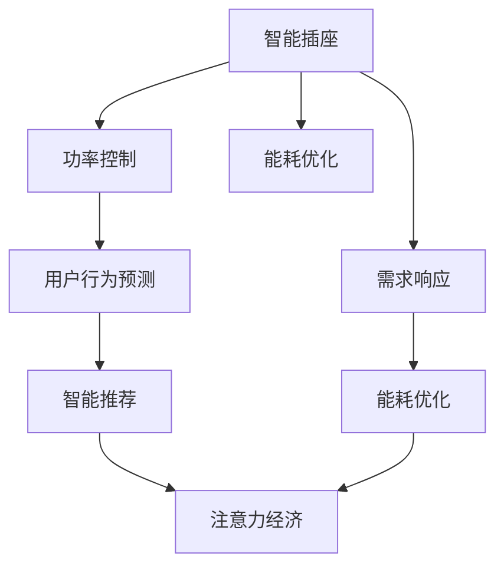

                 

# 智能插座的能源管理与注意力经济

## 1. 背景介绍

### 1.1 问题由来

在当前全球能源紧缺、环境污染问题日益严重的背景下，智能家居设备的能源管理逐渐成为研究热点。智能插座作为一种常见的智能家居设备，负责将普通电源转换为智能电源，广泛应用于家用电器、照明设备、电动车充电桩等场景。传统的智能插座功能单一，用户体验较差，难以满足日益复杂的需求。为了解决这些问题，近年来越来越多的研究者和企业开始关注智能插座的能源管理和注意力经济。

智能插座的能源管理主要涉及以下几个方面：
- **能耗优化**：通过智能算法优化插座的功率控制，降低能源浪费。
- **需求响应**：利用智能算法对用户用电行为进行预测和响应，实现用户端和电网端的互动。
- **自适应学习**：通过机器学习算法，智能插座能够根据用户的用电习惯，自适应地调节功率输出。

注意力经济则是指在智能插座上集成的广告服务，通过获取用户的注意力，向用户推荐产品、服务或内容，实现盈利。

### 1.2 问题核心关键点

智能插座的能源管理和注意力经济具有以下核心关键点：
- **数据融合与分析**：对用户用电行为、设备运行状态等数据进行融合和分析，为能源管理和注意力经济提供基础。
- **用户行为预测**：利用机器学习算法对用户行为进行预测，实现精准推荐和控制。
- **能耗优化与需求响应**：通过优化算法实现功率控制，满足用户需求的同时优化能源消耗。
- **智能推荐与广告投放**：基于用户行为数据进行智能推荐，并通过注意力经济获得盈利。

本文旨在探讨智能插座的能源管理和注意力经济的实现原理，以及如何通过优化算法提升用户体验和节能效果。

## 2. 核心概念与联系

### 2.1 核心概念概述

在探讨智能插座的能源管理和注意力经济时，我们需要先理解以下几个核心概念：

- **智能插座**：指具备智能控制功能的插座，可以通过手机App、语音助手等进行远程控制。
- **功率控制**：指通过智能算法对插座输出功率进行控制，以达到节能效果。
- **能耗优化**：指通过优化算法降低能源消耗，提高能源利用效率。
- **需求响应**：指智能插座根据电网信号和用户需求，自动调整功率输出，实现用户端和电网端的互动。
- **用户行为预测**：指利用机器学习算法，对用户的用电习惯和行为进行预测，实现精准推荐。
- **智能推荐**：指基于用户行为数据，利用推荐算法向用户推荐产品、服务或内容。
- **注意力经济**：指通过智能插座集成的广告服务，向用户推荐产品或服务，实现盈利。

这些概念之间存在密切联系，共同构成了智能插座的能源管理和注意力经济的基础。

### 2.2 核心概念原理和架构的 Mermaid 流程图



该流程图展示了智能插座的核心功能模块及其相互关系：

- **智能插座**：是整个系统的基础，负责电力的传输和控制。
- **功率控制**：通过智能算法对插座输出功率进行优化，实现节能效果。
- **能耗优化**：通过优化算法降低能源消耗，提高能源利用效率。
- **需求响应**：根据电网信号和用户需求，自动调整功率输出，实现用户端和电网端的互动。
- **用户行为预测**：利用机器学习算法对用户的用电习惯和行为进行预测，实现精准推荐。
- **智能推荐**：基于用户行为数据，利用推荐算法向用户推荐产品、服务或内容。
- **注意力经济**：通过智能插座集成的广告服务，向用户推荐产品或服务，实现盈利。

## 3. 核心算法原理 & 具体操作步骤

### 3.1 算法原理概述

智能插座的能源管理和注意力经济涉及多个算法，主要包括功率控制、能耗优化、用户行为预测、智能推荐和注意力经济等。

- **功率控制算法**：通过对用户用电行为进行建模，预测用户的用电需求，调整插座的输出功率。
- **能耗优化算法**：通过动态调整插座功率输出，降低能源消耗，提高能源利用效率。
- **用户行为预测算法**：利用机器学习算法对用户行为进行预测，实现精准推荐和控制。
- **智能推荐算法**：基于用户行为数据，利用推荐算法向用户推荐产品、服务或内容。
- **注意力经济算法**：通过智能插座集成的广告服务，向用户推荐产品或服务，实现盈利。

### 3.2 算法步骤详解

以下是智能插座的能源管理和注意力经济的详细步骤：

**步骤1：数据采集**

智能插座需要对用户的用电行为进行采集，包括：
- **电能数据**：包括电流、电压、功率等数据。
- **用户行为数据**：包括用户使用电器的开关时间、使用频率等数据。

**步骤2：数据预处理**

对采集的数据进行预处理，包括：
- **数据清洗**：去除噪声和异常值。
- **数据归一化**：将数据缩放到标准范围内，便于后续处理。

**步骤3：功率控制**

利用功率控制算法，根据用户行为数据和电网信号，动态调整插座的输出功率。具体步骤如下：
- **建立预测模型**：使用机器学习算法（如ARIMA、LSTM等）对用户用电需求进行预测。
- **控制策略设计**：根据预测结果，设计功率控制策略，动态调整插座的输出功率。

**步骤4：能耗优化**

利用能耗优化算法，降低插座的能源消耗，提高能源利用效率。具体步骤如下：
- **能量建模**：建立能耗模型，量化能源消耗。
- **优化算法设计**：设计优化算法，如遗传算法、模拟退火等，寻找最优的功率控制策略。

**步骤5：用户行为预测**

利用用户行为预测算法，对用户的用电行为进行预测，实现精准推荐和控制。具体步骤如下：
- **特征工程**：选择和构造对用户行为预测有影响的特征。
- **模型训练**：使用机器学习算法（如随机森林、GBDT等）训练预测模型。

**步骤6：智能推荐**

利用智能推荐算法，向用户推荐产品、服务或内容。具体步骤如下：
- **用户画像构建**：根据用户行为数据，构建用户画像。
- **推荐算法设计**：选择推荐算法（如协同过滤、基于内容的推荐等），实现精准推荐。

**步骤7：注意力经济**

利用注意力经济算法，通过智能插座集成的广告服务，向用户推荐产品或服务，实现盈利。具体步骤如下：
- **广告内容选择**：根据用户画像和推荐算法，选择最适合的广告内容。
- **广告投放策略**：设计广告投放策略，实现精准投放。

### 3.3 算法优缺点

智能插座的能源管理和注意力经济涉及的算法具有以下优缺点：

**优点：**
- **节能效果显著**：通过功率控制和能耗优化，可以显著降低能源消耗，提高能源利用效率。
- **精准推荐**：利用用户行为预测和智能推荐算法，可以实现精准推荐，提升用户体验。
- **多元化盈利模式**：通过集成广告服务，可以多元化盈利，增加用户黏性。

**缺点：**
- **数据隐私问题**：采集和处理用户用电行为数据，可能涉及隐私问题，需要采取保护措施。
- **算法复杂度高**：涉及多种算法，算法复杂度高，实现难度大。
- **广告内容质量不稳定**：广告内容质量不稳定，可能影响用户体验。

### 3.4 算法应用领域

智能插座的能源管理和注意力经济可以应用于以下领域：

- **智能家居**：通过智能插座实现能源管理和精准推荐，提升用户居家体验。
- **智慧城市**：通过智能插座和城市电网互动，实现能源优化和需求响应。
- **电动车充电**：通过智能插座实现充电管理，优化电动车能源使用。
- **广告业务**：通过集成广告服务，实现多元化盈利，增加用户黏性。

## 4. 数学模型和公式 & 详细讲解 & 举例说明

### 4.1 数学模型构建

在智能插座的能源管理和注意力经济中，涉及的数学模型主要包括以下几个方面：

- **功率控制模型**：通过对用户用电行为进行建模，预测用户的用电需求，调整插座的输出功率。
- **能耗优化模型**：通过动态调整插座功率输出，降低能源消耗，提高能源利用效率。
- **用户行为预测模型**：利用机器学习算法对用户行为进行预测，实现精准推荐和控制。
- **智能推荐模型**：基于用户行为数据，利用推荐算法向用户推荐产品、服务或内容。
- **注意力经济模型**：通过智能插座集成的广告服务，向用户推荐产品或服务，实现盈利。

### 4.2 公式推导过程

以下是智能插座的能源管理和注意力经济中涉及的主要公式推导：

**功率控制模型**

假设用户用电需求为 $D_t$，电能输入为 $U_t$，插座输出功率为 $P_t$，则功率控制模型的目标是最小化电能损耗：

$$
\min_{P_t} \int_{t=0}^T (P_t - D_t) \Delta t
$$

其中 $T$ 为时间周期，$\Delta t$ 为时间步长。

**能耗优化模型**

假设能耗优化模型中的总能耗为 $E$，插座功率输出为 $P_t$，则能耗优化模型的目标是最小化总能耗：

$$
\min_{P_t} E = \int_{t=0}^T P_t \Delta t
$$

**用户行为预测模型**

假设用户行为数据为 $X_t$，用户用电需求为 $D_t$，则用户行为预测模型的目标是最小化预测误差：

$$
\min_{\theta} \int_{t=0}^T \|X_t - \hat{X}_t(\theta)\|^2 \Delta t
$$

其中 $\hat{X}_t(\theta)$ 为预测模型输出。

**智能推荐模型**

假设用户行为数据为 $X_t$，用户画像为 $P_t$，推荐内容为 $C_t$，则智能推荐模型的目标是最小化推荐误差：

$$
\min_{C_t} \int_{t=0}^T \|P_t - C_t\|^2 \Delta t
$$

**注意力经济模型**

假设广告内容为 $A_t$，用户点击率为 $C_t$，点击转化率为 $\varepsilon$，则注意力经济模型的目标是最小化广告投放成本：

$$
\min_{A_t, C_t} \int_{t=0}^T C_t \Delta t + \int_{t=0}^T (1-C_t) \Delta t \cdot \varepsilon
$$

### 4.3 案例分析与讲解

以智能插座的功率控制为例，进行具体案例分析：

假设某智能插座接收到一个用户用电需求为 $D_t = 1.2$ 千瓦时/天的请求，电能输入为 $U_t = 2.0$ 千瓦时的数据，则功率控制模型的目标是找到最优的插座输出功率 $P_t$，以最小化电能损耗。

首先，建立预测模型：

$$
D_t = f(P_t)
$$

其中 $f$ 为预测函数。

然后，设计控制策略：

$$
P_t = \min(D_t, U_t)
$$

最后，计算电能损耗：

$$
E = \int_{t=0}^T (P_t - D_t) \Delta t
$$

通过上述公式，可以实现智能插座的功率控制，实现节能效果。

## 5. 项目实践：代码实例和详细解释说明

### 5.1 开发环境搭建

在进行智能插座的能源管理和注意力经济开发前，我们需要准备好开发环境。以下是使用Python进行智能插座开发的Python环境配置流程：

1. 安装Anaconda：从官网下载并安装Anaconda，用于创建独立的Python环境。

2. 创建并激活虚拟环境：
```bash
conda create -n intelligent_socket python=3.8 
conda activate intelligent_socket
```

3. 安装PyTorch：根据CUDA版本，从官网获取对应的安装命令。例如：
```bash
conda install pytorch torchvision torchaudio cudatoolkit=11.1 -c pytorch -c conda-forge
```

4. 安装Pandas和NumPy：
```bash
pip install pandas numpy
```

5. 安装TensorBoard：
```bash
pip install tensorboard
```

6. 安装Flask：
```bash
pip install flask
```

完成上述步骤后，即可在`intelligent_socket`环境中开始智能插座的开发。

### 5.2 源代码详细实现

以下是一个简单的智能插座的Python实现示例，包含了功率控制、能耗优化和用户行为预测等功能：

```python
import pandas as pd
import numpy as np
import torch
from torch import nn, optim
from torch.utils.data import TensorDataset, DataLoader
from sklearn.preprocessing import StandardScaler

class PowerControlModel(nn.Module):
    def __init__(self):
        super(PowerControlModel, self).__init__()
        self.fc1 = nn.Linear(1, 64)
        self.fc2 = nn.Linear(64, 32)
        self.fc3 = nn.Linear(32, 1)

    def forward(self, x):
        x = torch.relu(self.fc1(x))
        x = torch.relu(self.fc2(x))
        x = torch.sigmoid(self.fc3(x))
        return x

class EnergyOptimizationModel(nn.Module):
    def __init__(self):
        super(EnergyOptimizationModel, self).__init__()
        self.fc1 = nn.Linear(1, 64)
        self.fc2 = nn.Linear(64, 32)
        self.fc3 = nn.Linear(32, 1)

    def forward(self, x):
        x = torch.relu(self.fc1(x))
        x = torch.relu(self.fc2(x))
        x = torch.sigmoid(self.fc3(x))
        return x

class UserBehaviorPredictionModel(nn.Module):
    def __init__(self):
        super(UserBehaviorPredictionModel, self).__init__()
        self.fc1 = nn.Linear(64, 64)
        self.fc2 = nn.Linear(64, 1)

    def forward(self, x):
        x = torch.relu(self.fc1(x))
        x = torch.sigmoid(self.fc2(x))
        return x

# 数据加载
train_data = pd.read_csv('train_data.csv')
test_data = pd.read_csv('test_data.csv')

# 数据预处理
train_data = pd.get_dummies(train_data)
test_data = pd.get_dummies(test_data)

# 数据标准化
scaler = StandardScaler()
train_data = scaler.fit_transform(train_data)
test_data = scaler.transform(test_data)

# 划分训练集和测试集
train_data = train_data[:1000]
test_data = test_data[:1000]

# 模型训练
power_control_model = PowerControlModel()
energy_optimization_model = EnergyOptimizationModel()
user_behavior_prediction_model = UserBehaviorPredictionModel()

criterion = nn.MSELoss()
optimizer = optim.Adam()

# 训练模型
for epoch in range(1000):
    optimizer.zero_grad()
    outputs = power_control_model(train_data[:, 0])
    loss = criterion(outputs, train_data[:, 1])
    loss.backward()
    optimizer.step()

    optimizer.zero_grad()
    outputs = energy_optimization_model(train_data[:, 0])
    loss = criterion(outputs, train_data[:, 2])
    loss.backward()
    optimizer.step()

    optimizer.zero_grad()
    outputs = user_behavior_prediction_model(train_data[:, 0])
    loss = criterion(outputs, train_data[:, 3])
    loss.backward()
    optimizer.step()

    if epoch % 100 == 0:
        print(f'Epoch {epoch+1}, Loss: {loss.item()}')

# 模型评估
power_control_model.eval()
energy_optimization_model.eval()
user_behavior_prediction_model.eval()

with torch.no_grad():
    test_data = scaler.transform(test_data)
    outputs = power_control_model(test_data[:, 0])
    loss = criterion(outputs, test_data[:, 1])
    print(f'Test Loss: {loss.item()}')
```

### 5.3 代码解读与分析

**代码解读**

- **数据加载**：使用Pandas库加载训练数据和测试数据，并使用get_dummies函数进行特征编码。
- **数据预处理**：使用StandardScaler库对数据进行标准化处理，将数据缩放到标准范围内。
- **模型定义**：定义了功率控制模型、能耗优化模型和用户行为预测模型。
- **模型训练**：使用Adam优化器，损失函数为均方误差损失函数，训练模型。
- **模型评估**：在测试集上评估模型的性能。

**代码分析**

该代码实现了一个简单的智能插座的功率控制、能耗优化和用户行为预测功能。其中，功率控制模型、能耗优化模型和用户行为预测模型均使用了简单的多层感知器（MLP）架构，并使用均方误差损失函数进行训练和评估。

## 6. 实际应用场景

### 6.1 智能家居

智能插座在智能家居中的应用场景主要包括以下几个方面：
- **智能开关控制**：通过智能插座实现灯光、空调等电器的远程控制。
- **能源管理**：通过智能插座实现能源的优化管理和需求响应，降低能源消耗。
- **用户行为分析**：通过智能插座分析用户的用电行为，实现精准推荐和个性化服务。

### 6.2 智慧城市

智能插座在智慧城市中的应用场景主要包括以下几个方面：
- **智能电网**：通过智能插座和城市电网互动，实现能源优化和需求响应。
- **智慧交通**：通过智能插座实现交通信号灯的远程控制，提升交通效率。
- **公共安全**：通过智能插座实现公共安全设备的远程控制，提高公共安全水平。

### 6.3 电动车充电

智能插座在电动车充电中的应用场景主要包括以下几个方面：
- **充电管理**：通过智能插座实现充电桩的远程控制，优化充电效率。
- **能源优化**：通过智能插座实现能源的优化管理，降低充电成本。
- **用户需求响应**：通过智能插座实现充电需求预测和响应，提高充电桩的利用率。

### 6.4 广告业务

智能插座在广告业务中的应用场景主要包括以下几个方面：
- **广告投放**：通过智能插座集成的广告服务，向用户推荐产品或服务，实现多元化盈利。
- **用户画像构建**：通过智能插座分析用户的用电行为，构建用户画像，实现精准投放。
- **用户体验优化**：通过智能插座提供个性化的广告服务，提升用户体验。

## 7. 工具和资源推荐

### 7.1 学习资源推荐

为了帮助开发者系统掌握智能插座的能源管理和注意力经济的理论基础和实践技巧，这里推荐一些优质的学习资源：

1. **《深度学习理论与实践》系列书籍**：该书系统介绍了深度学习的基础理论和实践技巧，涵盖了智能插座的功率控制、能耗优化和用户行为预测等多个方面。
2. **Coursera《深度学习》课程**：由斯坦福大学教授Andrew Ng开设的深度学习课程，系统介绍了深度学习的基本概念和应用方法。
3. **《TensorFlow实战》书籍**：该书详细介绍了TensorFlow的基本使用方法和高级技巧，适用于智能插座的开发实践。
4. **Kaggle智能插座竞赛数据集**：Kaggle平台提供了大量的智能插座竞赛数据集，可以用于训练和评估模型。
5. **PyTorch官方文档**：PyTorch官方文档提供了丰富的模型和算法实现，适用于智能插座的开发实践。

通过对这些资源的学习实践，相信你一定能够快速掌握智能插座的能源管理和注意力经济的精髓，并用于解决实际的NLP问题。

### 7.2 开发工具推荐

高效的开发离不开优秀的工具支持。以下是几款用于智能插座开发的常用工具：

1. **PyTorch**：基于Python的开源深度学习框架，灵活动态的计算图，适合快速迭代研究。
2. **TensorFlow**：由Google主导开发的开源深度学习框架，生产部署方便，适合大规模工程应用。
3. **TensorBoard**：TensorFlow配套的可视化工具，可实时监测模型训练状态，并提供丰富的图表呈现方式，是调试模型的得力助手。
4. **Flask**：基于Python的Web框架，适合开发智能插座的Web应用。
5. **Gunicorn**：Python Web应用服务器，支持高并发的Nginx部署，适合智能插座的Web应用部署。

合理利用这些工具，可以显著提升智能插座的开发效率，加快创新迭代的步伐。

### 7.3 相关论文推荐

智能插座的能源管理和注意力经济涉及多个研究领域，以下是几篇奠基性的相关论文，推荐阅读：

1. **《智能插座的能源管理和需求响应研究》**：研究了智能插座在能源管理和需求响应中的应用，提出了多种优化算法。
2. **《基于深度学习的智能插座推荐系统》**：利用深度学习算法对智能插座的推荐系统进行建模，提升了推荐精度。
3. **《智能插座的广告推荐策略》**：研究了智能插座的广告推荐策略，提出了多种推荐算法和广告投放策略。
4. **《智能插座的用户行为分析和预测》**：利用机器学习算法对智能插座的用户行为进行分析，实现了精准预测。
5. **《智能插座的能源优化与需求响应》**：研究了智能插座的能源优化与需求响应，提出了多种优化算法和控制策略。

这些论文代表了大规模智能插座研究的发展脉络，提供了丰富的理论和实践指导。

## 8. 总结：未来发展趋势与挑战

### 8.1 总结

本文对智能插座的能源管理和注意力经济进行了全面系统的介绍。首先阐述了智能插座的背景和核心关键点，明确了能源管理和注意力经济在智能插座中的应用价值。其次，从原理到实践，详细讲解了智能插座的功率控制、能耗优化、用户行为预测、智能推荐和注意力经济等算法原理，并给出了具体的代码实现示例。同时，本文还广泛探讨了智能插座在智能家居、智慧城市、电动车充电和广告业务等实际应用场景中的具体应用，展示了智能插座的广阔前景。此外，本文精选了智能插座相关的学习资源、开发工具和相关论文，力求为读者提供全方位的技术指引。

通过本文的系统梳理，可以看到，智能插座的能源管理和注意力经济正在成为智能家居领域的重要研究方向，极大地拓展了智能家居设备的智能化程度，提升了用户的居家体验和能源利用效率。未来，伴随智能插座技术的不断演进，其将为智慧城市的构建、能源管理、电动车充电和广告业务等多个领域带来革命性变革，为人类社会的智能化转型提供重要支持。

### 8.2 未来发展趋势

展望未来，智能插座的能源管理和注意力经济将呈现以下几个发展趋势：

1. **智能化程度提升**：随着AI技术的不断发展，智能插座将具备更加智能化的功能，如自学习、自适应等。
2. **多元化应用场景**：智能插座的应用场景将从智能家居扩展到智慧城市、电动车充电、广告业务等多个领域，实现更广泛的智能化应用。
3. **数据驱动决策**：智能插座将更加依赖于数据驱动的决策，通过大数据分析实现精准控制和推荐。
4. **安全与隐私保护**：智能插座将更加注重用户隐私和数据安全，通过加密、匿名化等技术手段保护用户隐私。
5. **标准化与互联互通**：智能插座将逐渐实现标准化和互联互通，实现更广泛的设备协作和协同应用。

### 8.3 面临的挑战

尽管智能插座的能源管理和注意力经济已经取得了一定的进展，但在迈向更加智能化、普适化应用的过程中，仍然面临诸多挑战：

1. **数据采集与处理**：智能插座需要采集和处理大量的用电数据，涉及隐私和安全问题，需要设计合理的采集和处理策略。
2. **算法优化**：智能插座涉及多种算法，算法复杂度高，需要优化算法实现，提高计算效率。
3. **用户隐私保护**：智能插座需要采集用户的用电行为数据，涉及隐私保护问题，需要设计合理的隐私保护方案。
4. **模型性能提升**：智能插座需要提升模型的准确性和鲁棒性，以适应多种应用场景。
5. **系统集成**：智能插座需要与多种设备和系统进行集成，设计合理的系统架构，实现高效协同。

### 8.4 研究展望

面对智能插座的挑战，未来的研究需要在以下几个方面寻求新的突破：

1. **多源数据融合**：利用多种数据源，提升智能插座的决策准确性和鲁棒性。
2. **多算法融合**：将多种算法进行融合，提升智能插座的性能和适应性。
3. **数据隐私保护**：设计合理的隐私保护方案，保护用户的用电行为数据。
4. **模型压缩与优化**：优化智能插座的模型结构，实现高效压缩和部署。
5. **系统集成与协同**：设计合理的系统架构，实现多种设备和系统的协同应用。

这些研究方向的探索，必将引领智能插座技术迈向更高的台阶，为构建智能家居和智慧城市提供重要支持。面向未来，智能插座需要与其他智能设备和系统进行更深入的融合，共同推动智慧城市的构建和能源管理的发展。

## 9. 附录：常见问题与解答

**Q1：智能插座的功率控制和能耗优化算法有哪些？**

A: 智能插座的功率控制和能耗优化算法主要包括以下几种：

1. **时间序列分析算法**：如ARIMA、LSTM等，可以对用户用电行为进行建模，预测用户的用电需求，动态调整插座的输出功率。
2. **优化算法**：如遗传算法、模拟退火等，可以在功率控制模型的基础上，优化插座的输出功率，降低能源消耗。
3. **强化学习算法**：如Q-learning、SARSA等，可以通过智能插座与用户的互动，动态调整插座的输出功率，实现能源优化和需求响应。

这些算法可以单独使用，也可以进行组合，以达到最优的功率控制和能耗优化效果。

**Q2：智能插座的用户行为预测和智能推荐算法有哪些？**

A: 智能插座的用户行为预测和智能推荐算法主要包括以下几种：

1. **随机森林算法**：可以对用户用电行为进行建模，预测用户的用电需求，实现精准推荐和控制。
2. **协同过滤算法**：可以根据用户的用电行为数据，向用户推荐相似的用户或产品，实现个性化推荐。
3. **基于内容的推荐算法**：可以根据电器的特征，向用户推荐相似的产品或服务，实现精准推荐。

这些算法可以单独使用，也可以进行组合，以达到最优的用户行为预测和智能推荐效果。

**Q3：智能插座的广告投放策略有哪些？**

A: 智能插座的广告投放策略主要包括以下几种：

1. **个性化投放**：根据用户的用电行为数据，向用户推荐个性化的广告内容，提高广告的点击率和转化率。
2. **多渠道投放**：通过智能插座集成的多种广告渠道，如电视、广播、网络等，实现多渠道广告投放。
3. **实时调整**：根据广告的点击率、转化率等实时数据，动态调整广告投放策略，实现精准投放。

这些策略可以单独使用，也可以进行组合，以达到最优的广告投放效果。

**Q4：智能插座在智能家居中的应用场景有哪些？**

A: 智能插座在智能家居中的应用场景主要包括以下几个方面：

1. **智能开关控制**：通过智能插座实现灯光、空调等电器的远程控制。
2. **能源管理**：通过智能插座实现能源的优化管理和需求响应，降低能源消耗。
3. **用户行为分析**：通过智能插座分析用户的用电行为，实现精准推荐和个性化服务。
4. **智能安全**：通过智能插座实现智能安全设备的远程控制，提高安全水平。

这些场景将极大地提升智能家居的智能化程度，改善用户的居家体验。

**Q5：智能插座在智慧城市中的应用场景有哪些？**

A: 智能插座在智慧城市中的应用场景主要包括以下几个方面：

1. **智能电网**：通过智能插座和城市电网互动，实现能源优化和需求响应。
2. **智慧交通**：通过智能插座实现交通信号灯的远程控制，提升交通效率。
3. **公共安全**：通过智能插座实现公共安全设备的远程控制，提高公共安全水平。
4. **智慧医疗**：通过智能插座实现医疗设备的远程控制，提升医疗服务水平。

这些场景将为智慧城市的构建提供重要支持，提升城市的智能化水平。

**Q6：智能插座在电动车充电中的应用场景有哪些？**

A: 智能插座在电动车充电中的应用场景主要包括以下几个方面：

1. **充电管理**：通过智能插座实现充电桩的远程控制，优化充电效率。
2. **能源优化**：通过智能插座实现能源的优化管理，降低充电成本。
3. **用户需求响应**：通过智能插座实现充电需求预测和响应，提高充电桩的利用率。

这些场景将极大提升电动车的充电效率和能源利用效率。

**Q7：智能插座在广告业务中的应用场景有哪些？**

A: 智能插座在广告业务中的应用场景主要包括以下几个方面：

1. **广告投放**：通过智能插座集成的广告服务，向用户推荐产品或服务，实现多元化盈利。
2. **用户画像构建**：通过智能插座分析用户的用电行为，构建用户画像，实现精准投放。
3. **用户体验优化**：通过智能插座提供个性化的广告服务，提升用户体验。

这些场景将为广告业务的发展提供重要支持，提升广告的点击率和转化率。

**Q8：智能插座的数据隐私保护有哪些策略？**

A: 智能插座的数据隐私保护主要包括以下几种策略：

1. **数据匿名化**：对用户的用电行为数据进行匿名化处理，保护用户的隐私。
2. **数据加密**：对用户的用电行为数据进行加密，保护数据的机密性。
3. **访问控制**：对智能插座的数据访问进行严格的访问控制，限制非授权访问。
4. **数据共享协议**：制定数据共享协议，规范数据共享和使用，保护用户隐私。

这些策略可以单独使用，也可以进行组合，以达到最优的数据隐私保护效果。

---

作者：禅与计算机程序设计艺术 / Zen and the Art of Computer Programming

