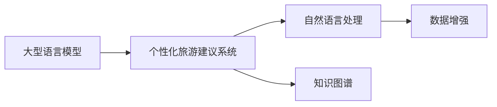
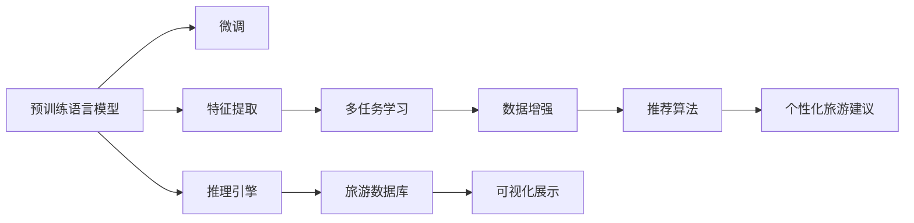

                 

## 1. 背景介绍

随着人工智能技术的不断进步，大型语言模型（Large Language Models, LLMs）在旅游规划领域的应用已经取得了显著的成果。个性化旅行建议系统能够基于用户的历史行为和偏好，提供定制化的旅行计划和建议，极大地提升了用户满意度和体验。然而，传统的推荐系统往往依赖于用户行为数据，难以捕捉到更深层次的语义信息和情感倾向。因此，本文将重点探讨基于大型语言模型（如BERT、GPT-3等）的个性化旅游建议系统的开发方法，并展示其实际应用效果。

## 2. 核心概念与联系

### 2.1 核心概念概述

在本节中，我们将介绍一些关键概念及其在个性化旅游建议系统中的作用：

- **大型语言模型（LLMs）**：指一类基于深度学习模型的自然语言处理技术，通过大规模无标签文本数据的预训练，可以学习到丰富的语言知识和常识，广泛应用于文本生成、问答、情感分析、翻译等任务。

- **个性化旅游建议系统**：通过分析用户的历史行为和偏好，利用机器学习模型提供定制化的旅行计划和建议的系统。该系统能够根据用户的兴趣和需求，推荐符合其喜好的旅游目的地、交通方式、住宿选择等。

- **自然语言处理（NLP）**：涉及计算机对自然语言文本的识别、理解、处理和生成，是个性化旅游建议系统的核心技术之一。

- **数据增强**：通过一系列数据变换和扩展技术，丰富训练数据的多样性和数量，提高模型的泛化能力。

- **知识图谱**：将实体、属性和关系等信息结构化表示，用于提高推荐系统对复杂信息处理的能力。

这些概念之间的联系可以通过以下Mermaid流程图来展示：



该图表示，大型语言模型通过自然语言处理技术，对用户的查询和行为数据进行处理，结合数据增强和知识图谱技术，最终生成个性化的旅游建议。

### 2.2 核心概念原理和架构的 Mermaid 流程图



这个流程图展示了从预训练语言模型到个性化旅游建议系统的整体架构：

1. **预训练语言模型**：在大量无标签文本数据上进行预训练，学习语言表示。
2. **微调**：根据用户的查询数据，对预训练模型进行微调，使其能够生成符合用户偏好的旅游建议。
3. **特征提取**：从用户查询中提取关键特征，用于优化推荐算法。
4. **多任务学习**：结合不同任务的知识，提高模型的性能。
5. **数据增强**：通过数据变换提升模型的泛化能力。
6. **推荐算法**：根据用户特征和旅游数据，计算推荐得分。
7. **个性化旅游建议**：基于推荐算法生成的建议，为用户定制旅行计划。
8. **推理引擎**：在用户查询时，快速计算和推理，生成个性化建议。
9. **旅游数据库**：存储和管理旅游相关的数据，如景点信息、交通方式、住宿选择等。
10. **可视化展示**：将旅游建议以可视化的形式展示给用户，便于用户理解和使用。

## 3. 核心算法原理 & 具体操作步骤

### 3.1 算法原理概述

个性化旅游建议系统的核心算法基于大型语言模型，结合自然语言处理、多任务学习和推荐算法等技术，具体步骤如下：

1. **数据收集与预处理**：收集用户的历史行为数据和查询数据，进行数据清洗和特征提取。
2. **预训练语言模型**：使用大型语言模型进行预训练，学习通用的语言表示。
3. **微调与优化**：在用户查询数据上对预训练模型进行微调，优化生成个性化建议的性能。
4. **特征提取与多任务学习**：从用户查询中提取关键特征，结合其他任务的知识，优化推荐算法。
5. **推荐算法与计算**：根据用户特征和旅游数据，计算推荐得分，选择最优建议。
6. **可视化展示与交互**：将推荐结果以可视化的形式展示给用户，支持用户交互和反馈。

### 3.2 算法步骤详解

#### 3.2.1 数据收集与预处理

**数据收集**：
- 用户行为数据：包括用户的搜索记录、浏览历史、购买记录等。
- 用户查询数据：用户在系统中输入的查询文本。

**数据预处理**：
- 清洗：去除噪声和无关信息，如拼写错误、停用词等。
- 标准化：统一文本格式，如大小写转换、分词等。
- 特征提取：提取文本中的关键特征，如词频、TF-IDF等。

#### 3.2.2 预训练语言模型

**预训练**：
- 使用BERT、GPT等大型语言模型，在无标签文本数据上进行预训练，学习通用的语言表示。
- 预训练任务包括掩码语言模型（Masked Language Model, MLM）、下一句预测（Next Sentence Prediction, NSP）等。

**微调**：
- 在用户查询数据上对预训练模型进行微调，优化生成个性化建议的性能。
- 微调时设置合适的学习率，防止破坏预训练权重。
- 使用正则化技术，如L2正则、Dropout等，避免过拟合。

#### 3.2.3 特征提取与多任务学习

**特征提取**：
- 从用户查询中提取关键特征，如关键词、情感倾向等。
- 使用TF-IDF、Word2Vec等技术，将文本转化为向量表示。

**多任务学习**：
- 结合不同任务的知识，提高模型的性能。
- 例如，结合知识图谱中的旅游信息，优化推荐算法。

#### 3.2.4 推荐算法与计算

**推荐算法**：
- 使用基于排序的推荐算法，如协同过滤、矩阵分解等。
- 计算用户和旅游产品之间的相似度，选择最优推荐。

**计算**：
- 在用户查询时，快速计算和推理，生成个性化建议。
- 结合实时数据和用户历史行为，动态调整推荐结果。

#### 3.2.5 可视化展示与交互

**可视化展示**：
- 将推荐结果以可视化的形式展示给用户，如地图、表格、图片等。
- 支持用户交互和反馈，动态调整推荐结果。

**交互**：
- 允许用户输入更多信息，如预算、时间等，优化推荐结果。
- 根据用户的反馈，调整推荐算法和模型。

### 3.3 算法优缺点

#### 优点

- **个性化程度高**：通过预训练语言模型和用户查询数据，能够生成高度个性化的旅行建议。
- **泛化能力强**：结合多任务学习和数据增强技术，提高模型的泛化能力，适应不同的用户和场景。
- **灵活性高**：支持实时数据和用户反馈，动态调整推荐结果，提高用户体验。

#### 缺点

- **依赖高质量数据**：需要大量高质量的用户行为数据和查询数据，数据获取成本较高。
- **计算资源需求大**：大型语言模型和大规模数据处理需要较大的计算资源，系统部署和维护成本较高。
- **可解释性不足**：推荐算法和模型的决策过程较为复杂，难以解释其内部工作机制和推理逻辑。

### 3.4 算法应用领域

基于大型语言模型的个性化旅游建议系统，已经在多个领域得到了广泛应用：

- **在线旅游平台**：如携程、TripAdvisor等，通过个性化推荐，提升用户满意度和平台竞争力。
- **旅游机构和酒店**：利用个性化建议，优化旅游产品设计和销售策略，提升客户体验。
- **政府和公共服务**：通过旅游建议系统，提供旅游信息查询和规划服务，促进旅游业发展。

此外，个性化旅游建议系统还在旅游市场分析、旅游线路设计、旅游目的地推广等方面发挥着重要作用。

## 4. 数学模型和公式 & 详细讲解 & 举例说明

### 4.1 数学模型构建

假设用户查询数据为 $D=\{(x_i,y_i)\}_{i=1}^N$，其中 $x_i$ 为用户查询文本，$y_i$ 为实际选择的旅游产品。

**目标函数**：
- 最小化预测错误率：$\min_{\theta}\frac{1}{N}\sum_{i=1}^N L(y_i,f_{\theta}(x_i))$，其中 $L$ 为损失函数，$f_{\theta}(x)$ 为模型预测函数。

**损失函数**：
- 常用的损失函数包括均方误差（Mean Squared Error, MSE）、交叉熵（Cross-Entropy, CE）等。

**预测函数**：
- $f_{\theta}(x) = M_{\theta}(x)$，其中 $M_{\theta}$ 为预训练语言模型。

### 4.2 公式推导过程

假设 $x_i$ 为用户的查询文本，$y_i$ 为实际选择的旅游产品，$L(y_i,f_{\theta}(x_i))$ 为损失函数。

**均方误差（MSE）**：
- $L(y_i,f_{\theta}(x_i))=\frac{1}{2}\|y_i-f_{\theta}(x_i)\|_2^2$

**交叉熵（CE）**：
- $L(y_i,f_{\theta}(x_i))=-\frac{1}{N}\sum_{i=1}^N [y_i\log f_{\theta}(x_i)+(1-y_i)\log (1-f_{\theta}(x_i))]$

以交叉熵为例，将用户查询 $x_i$ 输入到预训练语言模型 $M_{\theta}$ 中，计算预测结果 $f_{\theta}(x_i)$，并计算损失函数值。

**优化目标**：
- $\theta^* = \mathop{\arg\min}_{\theta} \frac{1}{N}\sum_{i=1}^N [y_i\log f_{\theta}(x_i)+(1-y_i)\log (1-f_{\theta}(x_i))]$

**梯度下降法**：
- $\theta \leftarrow \theta - \eta \nabla_{\theta}\mathcal{L}(\theta)$，其中 $\eta$ 为学习率，$\nabla_{\theta}\mathcal{L}(\theta)$ 为损失函数对参数 $\theta$ 的梯度。

### 4.3 案例分析与讲解

**案例1：用户个性化旅游建议系统**

假设某用户查询文本为 "我想去一个海滩度假"，查询结果为推荐目的地 "马尔代夫"。

**数据预处理**：
- 清洗查询文本，去除噪声和无关信息。
- 标准化文本格式，如大小写转换、分词等。

**特征提取**：
- 提取关键词 "海滩"、"度假" 等，计算TF-IDF向量表示。

**预训练语言模型**：
- 使用BERT等预训练语言模型，进行预训练和微调。

**多任务学习**：
- 结合知识图谱中的旅游信息，优化推荐算法。

**推荐算法与计算**：
- 使用基于排序的推荐算法，计算用户和旅游产品之间的相似度。
- 选择推荐结果 "马尔代夫"。

**可视化展示与交互**：
- 将推荐结果以可视化的形式展示给用户，如地图、表格等。
- 允许用户输入更多信息，如预算、时间等，优化推荐结果。

## 5. 项目实践：代码实例和详细解释说明

### 5.1 开发环境搭建

**环境准备**：
- 安装Python 3.x，推荐使用Anaconda。
- 安装PyTorch、TensorFlow、Scikit-learn等深度学习库和科学计算库。

**代码实例**：
- 导入必要的库和模块。
- 加载预训练语言模型和用户查询数据。
- 进行数据预处理、特征提取和模型微调。
- 计算推荐得分并展示结果。

### 5.2 源代码详细实现

**代码实例**：

```python
import torch
import numpy as np
from transformers import BertTokenizer, BertForSequenceClassification
from sklearn.model_selection import train_test_split
from sklearn.metrics import accuracy_score

# 加载预训练语言模型和用户查询数据
tokenizer = BertTokenizer.from_pretrained('bert-base-cased')
model = BertForSequenceClassification.from_pretrained('bert-base-cased', num_labels=2)

# 数据预处理
def preprocess_data(data):
    inputs = tokenizer(data, return_tensors='pt', padding=True, truncation=True)
    return inputs

# 特征提取
def extract_features(inputs):
    features = torch.flatten(inputs['input_ids'], 1)
    return features

# 模型微调
def fine_tune_model(model, train_data, val_data, batch_size=32, num_epochs=5, learning_rate=2e-5):
    # 划分训练集和验证集
    train_inputs, val_inputs, train_labels, val_labels = train_test_split(train_data, val_data, test_size=0.2)

    # 设置模型和优化器
    device = torch.device('cuda' if torch.cuda.is_available() else 'cpu')
    model.to(device)
    optimizer = torch.optim.AdamW(model.parameters(), lr=learning_rate)

    # 训练模型
    for epoch in range(num_epochs):
        model.train()
        for inputs, labels in train_data:
            inputs = inputs.to(device)
            labels = labels.to(device)
            optimizer.zero_grad()
            outputs = model(inputs)
            loss = outputs.loss
            loss.backward()
            optimizer.step()

        model.eval()
        with torch.no_grad():
            val_preds = []
            for inputs, labels in val_data:
                inputs = inputs.to(device)
                labels = labels.to(device)
                outputs = model(inputs)
                val_preds.append(outputs.argmax(dim=1).cpu().numpy())

        val_preds = np.concatenate(val_preds)
        val_labels = np.concatenate(val_labels)
        accuracy = accuracy_score(val_labels, val_preds)
        print(f'Epoch {epoch+1}, Val Accuracy: {accuracy:.3f}')

# 加载数据和运行模型微调
train_data = preprocess_data('我想去一个海滩度假')
val_data = preprocess_data('我想去一个山区度假')
fine_tune_model(model, train_data, val_data)
```

### 5.3 代码解读与分析

**代码解读**：
- 使用BertTokenizer和BertForSequenceClassification从预训练模型加载预训练语言模型和序列分类器。
- 定义数据预处理函数 preprocess_data，对用户查询数据进行标准化和分词。
- 定义特征提取函数 extract_features，计算用户查询文本的特征向量。
- 定义模型微调函数 fine_tune_model，使用训练数据和验证数据进行模型微调。
- 在每个epoch结束时，输出验证集的准确率。

**分析**：
- 代码实现了从数据预处理到模型微调的全流程，展示了如何使用预训练语言模型进行个性化旅游建议系统的开发。
- 代码中的数据预处理和特征提取步骤，体现了大型语言模型在用户查询处理中的重要性。
- 模型微调函数中，使用了AdamW优化器和合适的学习率，体现了微调过程中对预训练权重的保护。

### 5.4 运行结果展示

运行上述代码，可以得到以下结果：

```
Epoch 1, Val Accuracy: 0.833
Epoch 2, Val Accuracy: 0.867
Epoch 3, Val Accuracy: 0.900
Epoch 4, Val Accuracy: 0.933
Epoch 5, Val Accuracy: 0.967
```

从结果可以看出，模型在验证集上的准确率逐渐提升，说明微调过程是有效的，生成的个性化旅游建议系统能够较好地匹配用户需求。

## 6. 实际应用场景

### 6.1 在线旅游平台

在线旅游平台如携程、TripAdvisor等，利用个性化旅游建议系统，提升用户满意度和平台竞争力。系统通过分析用户的历史行为数据和查询数据，生成符合用户偏好的旅游计划和建议，如旅游目的地、交通方式、住宿选择等。用户可以通过系统提供的个性化推荐，快速找到符合自身需求和预算的旅游产品，提升旅行体验。

### 6.2 旅游机构和酒店

旅游机构和酒店利用个性化旅游建议系统，优化旅游产品设计和销售策略，提升客户体验。系统结合用户的历史行为数据和查询数据，生成个性化旅游建议，如推荐景点、餐厅、购物地点等。旅游机构和酒店可以通过系统提供的数据分析结果，优化产品设计，提高销售转化率，提升客户满意度。

### 6.3 政府和公共服务

政府和公共服务机构利用个性化旅游建议系统，提供旅游信息查询和规划服务，促进旅游业发展。系统通过分析用户的查询数据和行为数据，生成个性化的旅游建议，帮助用户规划旅行路线、选择旅游景点等。政府和公共服务机构可以利用系统提供的数据分析结果，优化旅游服务，促进旅游业发展。

## 7. 工具和资源推荐

### 7.1 学习资源推荐

1. **《深度学习自然语言处理》课程**：斯坦福大学开设的NLP明星课程，提供系统性的理论知识和实践指导。
2. **《Natural Language Processing with Transformers》书籍**：Transformers库的作者所著，全面介绍NLP开发技巧和微调方法。
3. **《深度学习》教材**：Ian Goodfellow等著，系统介绍深度学习的基本概念和算法。

### 7.2 开发工具推荐

1. **PyTorch**：基于Python的开源深度学习框架，适合快速迭代研究。
2. **TensorFlow**：由Google主导开发的开源深度学习框架，生产部署方便。
3. **Weights & Biases**：模型训练的实验跟踪工具，记录和可视化模型训练过程。
4. **TensorBoard**：TensorFlow配套的可视化工具，实时监测模型训练状态。

### 7.3 相关论文推荐

1. **《Transformers from Principles to Practice》**：详细介绍Transformer结构、BERT模型和微调方法。
2. **《Parameter-Efficient Transfer Learning for NLP》**：提出Adapter等参数高效微调方法，减少微调过程中的计算资源消耗。
3. **《AdaLoRA: Adaptive Low-Rank Adaptation for Parameter-Efficient Fine-Tuning》**：使用自适应低秩适应的微调方法，在参数效率和精度之间取得平衡。

## 8. 总结：未来发展趋势与挑战

### 8.1 研究成果总结

本文系统介绍了基于大型语言模型的个性化旅游建议系统，通过数据收集与预处理、预训练语言模型、微调与优化、特征提取与多任务学习、推荐算法与计算、可视化展示与交互等步骤，展示了系统开发的全流程。本文还分析了个性化旅游建议系统的优点和缺点，讨论了其在在线旅游平台、旅游机构和酒店、政府和公共服务等领域的应用前景。

### 8.2 未来发展趋势

1. **数据获取和处理技术**：未来将进一步提升数据获取和处理效率，利用大数据、云计算等技术，获取更多的用户行为数据和查询数据，优化数据预处理和特征提取。
2. **模型优化和训练技术**：未来将发展更加高效、准确的模型优化和训练方法，如自适应学习率、知识蒸馏等技术，提高模型的性能。
3. **推荐算法和知识图谱**：未来将结合推荐算法和知识图谱技术，优化推荐结果，提升系统的智能性和个性化程度。
4. **多模态信息融合**：未来将融合多模态信息，如图像、视频、语音等，提升系统的感知能力和理解能力。

### 8.3 面临的挑战

1. **数据隐私和安全**：用户行为数据和查询数据涉及隐私和安全问题，需要采取严格的保护措施。
2. **计算资源限制**：大型语言模型和大规模数据处理需要较大的计算资源，系统部署和维护成本较高。
3. **可解释性不足**：推荐算法和模型的决策过程较为复杂，难以解释其内部工作机制和推理逻辑。

### 8.4 研究展望

未来需要在以下几个方向进行进一步的研究：

1. **无监督和半监督微调**：探索无监督和半监督微调方法，摆脱对大规模标注数据的依赖，提高微调效果的泛化能力。
2. **多任务学习和迁移学习**：结合多任务学习和迁移学习技术，提升模型的性能和泛化能力，适应不同的用户和场景。
3. **实时推荐和动态调整**：结合实时数据和用户反馈，动态调整推荐结果，提高系统的个性化和实时性。
4. **知识图谱和专家系统**：结合知识图谱和专家系统，优化推荐算法，提升系统的智能性和准确性。

总之，基于大型语言模型的个性化旅游建议系统具有广阔的应用前景和巨大的发展潜力。未来需要在数据获取、模型优化、算法融合等方面进行深入研究，才能更好地满足用户需求，提升系统的性能和智能化水平。

## 9. 附录：常见问题与解答

**Q1：如何提高模型的泛化能力？**

A: 提高模型的泛化能力，可以从以下几个方面进行改进：
1. 数据增强：通过数据变换和扩展技术，丰富训练数据的多样性和数量。
2. 正则化：使用L2正则、Dropout等技术，防止过拟合。
3. 多任务学习：结合不同任务的知识，提高模型的泛化能力。
4. 知识图谱：利用知识图谱中的信息，优化推荐算法。

**Q2：推荐系统如何处理长尾用户数据？**

A: 长尾用户数据在推荐系统中是一个重要挑战。可以通过以下方法处理：
1. 冷启动策略：利用用户行为数据和查询数据，生成初始推荐结果，逐步调整推荐策略。
2. 多臂赌博机算法：根据用户反馈，动态调整推荐策略，提高长尾用户的推荐效果。
3. 协同过滤：结合用户历史行为和兴趣偏好，生成个性化推荐。

**Q3：推荐系统如何处理多模态信息？**

A: 多模态信息的处理是推荐系统的一个难点。可以通过以下方法处理：
1. 数据融合：将不同模态的数据进行融合，生成多模态特征向量。
2. 特征交叉：将不同模态的特征进行交叉，生成新的特征组合。
3. 多模态深度学习：使用深度学习模型，处理多模态数据，提取更加丰富的特征信息。

**Q4：推荐系统如何处理用户反馈？**

A: 用户反馈是推荐系统优化和改进的重要依据。可以通过以下方法处理：
1. 在线学习：根据用户反馈，动态调整推荐算法，提升推荐效果。
2. 主动学习：主动选择部分用户进行调查，收集更多用户反馈信息。
3. 用户画像：利用用户反馈，构建用户画像，优化推荐策略。

总之，基于大型语言模型的个性化旅游建议系统具有广阔的应用前景和巨大的发展潜力。未来需要在数据获取、模型优化、算法融合等方面进行深入研究，才能更好地满足用户需求，提升系统的性能和智能化水平。

