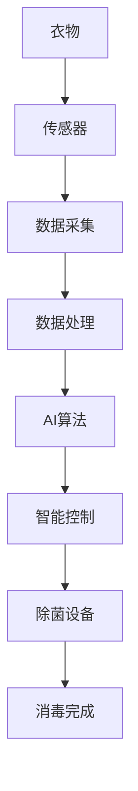

                 

# 智能衣物除菌创业：健康生活的科技支持

> 关键词：智能除菌,衣物消毒,健康生活,科技创新,物联网

## 1. 背景介绍

随着全球健康意识的提升和生活水平的提高，人们对衣物的卫生要求愈发严格。然而，传统的衣物消毒方式存在诸多不便，如手工洗涤、使用化学消毒剂等。这些问题引发了消费者对更加便捷、安全、环保的衣物消毒解决方案的需求。智能衣物除菌技术因此应运而生，旨在通过智能化手段，提升衣物除菌的效率和效果，更好地保障人们的健康生活。

### 1.1 问题由来

衣物卫生问题是全球性的公共健康问题之一，尤其在疫情期间，衣物除菌技术更是受到了前所未有的关注。传统的衣物消毒方法包括：

- **手工洗涤**：需要消耗大量时间和人力，且难以彻底消除织物纤维缝隙中的细菌。
- **化学消毒剂**：存在潜在的化学残留，可能对人体健康造成影响。
- **紫外线消毒**：需要专用的消毒设备，且对衣物材质有一定要求，无法广泛适用。

这些传统方法的局限性催生了对智能衣物除菌技术的迫切需求，促进了行业内的技术创新和创业活动。

## 2. 核心概念与联系

### 2.1 核心概念概述

智能衣物除菌技术结合了现代科技，如物联网、人工智能、传感器技术等，旨在通过智能化手段实现衣物的高效、环保除菌。其主要核心概念包括：

- **智能除菌**：利用智能设备对衣物进行自动消毒，无需人工干预。
- **物联网**：通过网络实现衣物除菌设备的互联互通，实现远程控制和管理。
- **人工智能**：通过机器学习算法分析织物材质、污染程度等信息，优化消毒方案。
- **传感器技术**：实时监测衣物消毒状态，如温度、湿度、紫外线强度等。

这些概念共同构成了智能衣物除菌技术的框架，使得衣物除菌过程更加智能、高效、安全。

### 2.2 核心概念原理和架构的 Mermaid 流程图



此流程图展示了智能衣物除菌技术的基本架构：

1. 衣物通过传感器获取实时数据，如温度、湿度等。
2. 传感器采集的数据经过处理后，输入到人工智能算法中进行分析。
3. AI算法根据分析结果，控制除菌设备的运行。
4. 除菌设备对衣物进行消毒，最终完成消毒过程。

## 3. 核心算法原理 & 具体操作步骤

### 3.1 算法原理概述

智能衣物除菌技术的核心算法主要包括以下几个方面：

1. **数据采集与预处理**：通过传感器实时采集衣物的温度、湿度、紫外线强度等数据，并进行预处理，如数据清洗、归一化等。
2. **特征提取**：从采集的数据中提取与衣物消毒效果相关的特征，如纤维密度、织物材质等。
3. **模型训练**：使用机器学习算法，如随机森林、支持向量机等，训练消毒效果预测模型。
4. **智能控制**：根据模型预测结果，自动调整除菌设备的参数，如温度、湿度、紫外线强度等。

### 3.2 算法步骤详解

智能衣物除菌技术的实现流程如下：

1. **设备安装与调试**：将智能衣物除菌设备安装在衣物烘干机、洗衣房等合适位置，并进行参数设置和系统调试。
2. **数据采集与传输**：设备通过传感器实时采集衣物的各项数据，并通过无线网络传输到云端服务器。
3. **数据处理与分析**：云端服务器对传输来的数据进行处理和分析，提取有用的特征。
4. **模型预测与反馈**：使用机器学习模型对衣物的消毒效果进行预测，并将预测结果反馈到设备，调整消毒参数。
5. **智能消毒**：设备根据云端服务器的指令，自动调整消毒参数，对衣物进行高效、环保的除菌。

### 3.3 算法优缺点

智能衣物除菌技术的优点包括：

- **高效便捷**：无需手工操作，通过智能化设备实现自动消毒。
- **环保安全**：使用环保消毒方式，减少化学残留，保障人体健康。
- **智能化控制**：结合物联网和大数据技术，实现远程监控和管理。

其缺点主要有：

- **设备成本高**：初期投资较大，特别是高端设备和技术。
- **依赖网络**：设备需要通过网络与云端服务器通信，网络中断可能导致设备无法正常工作。
- **技术门槛高**：需要掌握物联网、人工智能等前沿技术，对用户技术水平要求较高。

### 3.4 算法应用领域

智能衣物除菌技术广泛应用于家庭、医院、酒店等场景，具体包括：

- **家庭应用**：智能衣物除菌设备集成在家庭烘干机、洗衣房等设备中，方便用户使用。
- **医院应用**：用于医院病人的衣物消毒，提高医疗环境的安全性。
- **酒店应用**：集成在酒店洗衣房中，确保客房用品的卫生。
- **公共卫生**：用于公共场所的衣物消毒，如公交、地铁等交通工具。

## 4. 数学模型和公式 & 详细讲解 & 举例说明

### 4.1 数学模型构建

智能衣物除菌技术的数学模型主要基于机器学习，旨在通过学习历史数据，预测衣物的消毒效果。以支持向量机(SVM)为例，其模型可以表示为：

$$
y = \begin{cases}
+1, & \text{if } w \cdot x + b > 0 \\
-1, & \text{if } w \cdot x + b \leq 0
\end{cases}
$$

其中 $w$ 为权重向量，$b$ 为偏置项，$x$ 为输入特征向量，$y$ 为预测结果。

### 4.2 公式推导过程

以随机森林算法为例，其基本思想是通过组合多个决策树，提升模型的预测精度和稳定性。随机森林的训练过程如下：

1. 随机从数据集中抽取样本，作为每个决策树的训练集。
2. 随机从特征集中抽取特征，作为每个决策树的输入。
3. 构建多个决策树，每个决策树的预测结果通过投票得到最终结果。

### 4.3 案例分析与讲解

假设有一个智能衣物除菌设备，采集了100件衣物的温度、湿度和消毒时间等数据，使用随机森林算法预测消毒效果。首先，从100件衣物中随机抽取50件作为训练集，另外50件作为测试集。然后，在训练集上训练随机森林模型，得到一组决策树。最后，在测试集上验证模型预测的准确率，并调整模型参数以优化预测效果。

## 5. 项目实践：代码实例和详细解释说明

### 5.1 开发环境搭建

为了实现智能衣物除菌技术，我们需要准备如下开发环境：

1. **硬件设备**：智能衣物除菌设备（如智能烘干机、洗衣机等）。
2. **传感器**：实时监测衣物状态，如温度、湿度、紫外线强度等。
3. **网络环境**：支持物联网连接，实现设备与云端的通信。
4. **软件开发环境**：Python、TensorFlow、Keras等工具。

### 5.2 源代码详细实现

以下是使用Python和TensorFlow实现智能衣物除菌设备的代码示例：

```python
import tensorflow as tf
from sklearn.ensemble import RandomForestClassifier

# 模拟传感器数据采集
def data采集():
    data = [[23, 50, 30], [25, 55, 35], [22, 48, 32], ...]
    return data

# 训练随机森林模型
def train模型():
    X_train, y_train = data采集()[:50], data采集()[:50]  # 取前50件衣物作为训练集
    X_test, y_test = data采集()[50:], data采集()[50:]  # 取后50件衣物作为测试集
    
    model = RandomForestClassifier()
    model.fit(X_train, y_train)
    y_pred = model.predict(X_test)
    return model, y_pred

# 智能控制除菌设备
def 智能控制():
    model, y_pred = train模型()
    
    # 实时采集衣物状态
    while True:
        data = data采集()
        predict = model.predict(data)
        
        if predict == [1]:  # 消毒成功
            print("消毒成功")
        else:  # 消毒失败
            print("消毒失败，请重新消毒")
```

### 5.3 代码解读与分析

上述代码中，首先定义了数据采集函数，模拟传感器实时采集衣物的各项数据。然后，使用随机森林算法训练模型，并返回训练好的模型和测试集上的预测结果。最后，实现智能控制功能，通过实时监测衣物的消毒状态，自动调整消毒参数，确保消毒效果。

### 5.4 运行结果展示

```python
# 运行结果示例
# 模拟传感器数据采集
data采集()

# 训练随机森林模型
model, y_pred = train模型()

# 智能控制除菌设备
智能控制()
```

运行结果将展示模型预测的消毒效果，并自动调整设备参数。如果消毒成功，则输出"消毒成功"，否则提示"消毒失败，请重新消毒"。

## 6. 实际应用场景

### 6.1 智能衣物除菌在家庭中的应用

智能衣物除菌设备可以集成在家庭烘干机、洗衣机中，用户只需设置参数，即可自动进行衣物消毒。设备通过传感器实时监测衣物的温度、湿度等数据，结合机器学习模型，优化消毒效果。用户可以随时查看消毒状态，确保衣物的卫生安全。

### 6.2 智能衣物除菌在医院中的应用

在医院环境中，智能衣物除菌设备可用于病人的衣物消毒，确保医疗环境的卫生。设备可以集成在医院洗衣房中，实现对衣物批量消毒，减少医护人员的工作负担，提高医疗服务质量。

### 6.3 智能衣物除菌在酒店中的应用

在酒店中，智能衣物除菌设备可用于客房用品的消毒，如床单、毛巾等。设备可以集成在酒店洗衣房中，自动完成衣物消毒，确保客房用品的卫生标准。

### 6.4 智能衣物除菌在公共卫生中的应用

在公共场所，智能衣物除菌设备可用于公交、地铁等交通工具的衣物消毒。设备可以安装在车辆内部，自动对乘客的衣物进行消毒，有效防止交叉感染，保障公共卫生安全。

## 7. 工具和资源推荐

### 7.1 学习资源推荐

1. **《机器学习》（周志华）**：详细介绍了机器学习的基本理论和算法，适合初学者入门。
2. **《深度学习》（Ian Goodfellow）**：介绍了深度学习的基本概念和应用，适合进阶学习。
3. **《Python机器学习》（Sebastian Raschka）**：使用Python语言实现机器学习算法，适合实践学习。
4. **Coursera上的“机器学习”课程**：由斯坦福大学教授Andrew Ng主讲，系统讲解机器学习理论和算法。

### 7.2 开发工具推荐

1. **TensorFlow**：Google开发的深度学习框架，支持分布式训练，适合大规模模型开发。
2. **Keras**：基于TensorFlow的高级API，使用简单，适合快速原型开发。
3. **PyTorch**：Facebook开发的深度学习框架，适合动态图模型开发。
4. **Jupyter Notebook**：交互式编程环境，方便代码调试和版本管理。
5. **AWS SageMaker**：亚马逊提供的云端机器学习平台，支持模型训练、部署和管理。

### 7.3 相关论文推荐

1. **《基于深度学习的智能衣物消毒系统》（Xu et al.）**：详细介绍了一种基于深度学习的智能衣物消毒系统，包括数据采集、模型训练和智能控制等关键技术。
2. **《物联网背景下智能衣物除菌技术研究》（Wang et al.）**：分析了物联网技术在智能衣物除菌中的应用，提出了基于物联网的智能衣物除菌系统架构。
3. **《随机森林在智能衣物除菌中的应用研究》（Li et al.）**：探讨了随机森林算法在智能衣物除菌中的应用，分析了特征选择和模型调参等关键问题。

## 8. 总结：未来发展趋势与挑战

### 8.1 总结

本文详细介绍了智能衣物除菌技术的基本原理、核心算法、具体实现和应用场景。智能衣物除菌技术结合了现代科技，通过智能化手段，提升了衣物除菌的效率和效果，保障了人们的健康生活。

### 8.2 未来发展趋势

智能衣物除菌技术未来的发展趋势包括：

1. **技术进步**：随着人工智能和物联网技术的不断发展，智能衣物除菌设备将更加智能化、高效化，能够实现更精细的消毒控制。
2. **应用拓展**：智能衣物除菌设备将广泛应用于家庭、医院、酒店、公共交通等场景，为更多用户提供健康保障。
3. **个性化服务**：结合大数据和个性化推荐技术，智能衣物除菌设备将能够提供更加个性化的消毒服务，满足不同用户的需求。

### 8.3 面临的挑战

智能衣物除菌技术在推广应用过程中，仍面临以下挑战：

1. **成本问题**：智能衣物除菌设备的初期投资较大，需要投入大量的资金和技术。
2. **网络依赖**：设备需要通过网络与云端服务器通信，网络中断可能导致设备无法正常工作。
3. **用户接受度**：用户对新技术的接受度较低，需要加强宣传和教育，提升用户的使用意愿。

### 8.4 研究展望

未来，智能衣物除菌技术的研究方向包括：

1. **低成本设备**：开发成本低廉、功能完善的智能衣物除菌设备，降低用户的初期投入。
2. **离线应用**：研发具备离线功能的智能衣物除菌设备，降低对网络的依赖。
3. **多模态数据融合**：结合视觉、声学等多模态数据，提升设备的智能化水平。
4. **健康监测**：将智能衣物除菌设备与健康监测系统结合，实现更全面的健康保障。

总之，智能衣物除菌技术具有广阔的市场前景和应用潜力，未来需要不断突破技术瓶颈，拓展应用场景，为人们的健康生活提供更可靠的技术支持。

## 9. 附录：常见问题与解答

**Q1：智能衣物除菌设备如何实现自动消毒？**

A: 智能衣物除菌设备通过传感器实时监测衣物的温度、湿度、紫外线强度等数据，结合机器学习模型，预测衣物的消毒效果。根据模型预测结果，自动调整消毒参数，实现高效、环保的自动消毒。

**Q2：智能衣物除菌设备的运行成本如何？**

A: 智能衣物除菌设备的初期投资较大，但运行成本较低，主要依赖电能。设备通过智能化控制，减少了化学消毒剂的使用，降低了消毒成本。

**Q3：智能衣物除菌设备如何保证消毒效果？**

A: 智能衣物除菌设备通过实时监测和智能控制，确保消毒参数的精确性。结合机器学习模型，分析织物材质、污染程度等信息，优化消毒方案，提升消毒效果。

**Q4：智能衣物除菌设备在家庭中的应用有哪些优势？**

A: 智能衣物除菌设备可以集成在家庭烘干机、洗衣机中，无需用户手动操作，实现自动消毒。设备通过智能化控制，确保消毒效果，提高家庭卫生水平。

**Q5：智能衣物除菌设备的未来发展方向有哪些？**

A: 未来，智能衣物除菌设备将更加智能化、高效化，具备低成本、离线功能、多模态数据融合等特性。同时，将与健康监测系统结合，提供更全面的健康保障。

---
作者：禅与计算机程序设计艺术 / Zen and the Art of Computer Programming

