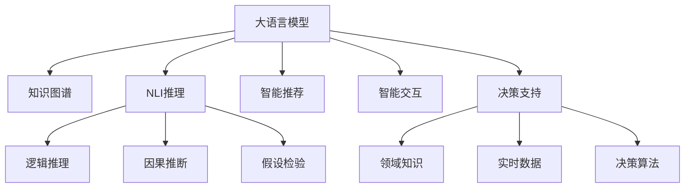

                 

# 智能规划：LLM的核心竞争力

> 关键词：
  智能规划, 大语言模型, 语言生成, 知识推理, 智能推荐, 决策支持, 智能交互, 人工智能

## 1. 背景介绍

### 1.1 问题由来
人工智能(AI)技术的迅猛发展，特别是在自然语言处理(NLP)领域，已经展现出其强大的能力。这一能力不仅体现在大语言模型(Large Language Models, LLMs)的广泛应用上，更体现在通过大语言模型实现的智能规划系统中。智能规划系统是AI领域中的重要分支，它能够结合领域知识和大数据，为用户提供决策支持和智能推荐。

当前，智能规划系统已广泛应用于金融、医疗、教育、商业等多个领域。这些系统通过综合考虑用户的具体需求、外部环境和可用资源，帮助用户制定最优决策路径。然而，如何更好地利用大语言模型提升智能规划系统的能力，使其具备更强的决策支撑和智能推荐能力，成为了研究的焦点。

### 1.2 问题核心关键点
大语言模型，特别是Transformer架构的模型如BERT、GPT等，以其强大的语言理解能力、生成能力和推理能力，正在逐步改变智能规划系统的面貌。它们不仅能够处理自然语言，还能理解复杂的逻辑结构，进行知识推理。

但大语言模型在智能规划中的应用，仍面临一些挑战：
1. **知识表示与整合**：如何有效地将领域知识整合到模型中，使得模型能够理解行业特定术语和逻辑结构。
2. **推理能力**：现有模型推理能力有限，难以在实际应用中处理复杂的因果关系和逻辑判断。
3. **交互能力**：用户与系统的互动质量直接影响智能规划的效果，如何提高系统的交互性，使其更加自然和高效。
4. **鲁棒性**：模型应对噪声和异常情况的能力不足，可能会影响规划结果的可靠性。

## 2. 核心概念与联系

### 2.1 核心概念概述

为更好地理解大语言模型在智能规划中的应用，本节将介绍几个密切相关的核心概念：

- **大语言模型**：基于Transformer架构的深度学习模型，如BERT、GPT等，通过大规模无标签文本数据进行预训练，能够理解语言的广泛语义和语法结构。

- **知识图谱**：用于表示领域知识的图形数据结构，通过节点和边关系来表示实体和属性，以及实体之间的关系。

- **自然语言推理(NLI)**：指判断两个自然语言表述之间的逻辑关系，如因果、假设、推理等，是大语言模型的一个重要应用领域。

- **智能推荐**：结合用户历史行为和偏好，通过分析海量数据，为用户提供个性化推荐。

- **智能交互**：结合对话系统和大语言模型，提升用户体验，使其能够自然流畅地与系统互动。

- **决策支持**：利用大语言模型的推理能力，结合领域知识，为用户提供决策支持，辅助用户进行复杂的决策过程。

这些核心概念之间的逻辑关系可以通过以下Mermaid流程图来展示：



这个流程图展示了大语言模型的核心能力及其在智能规划中的主要应用：

1. 大语言模型通过预训练获得通用语言理解能力，通过知识图谱补充领域知识，提升推理能力。
2. 利用NLI推理、智能推荐、智能交互和决策支持等功能，形成综合的智能规划系统。

## 3. 核心算法原理 & 具体操作步骤

### 3.1 算法原理概述

基于大语言模型的智能规划系统，其核心思想是通过预训练模型和微调技术，结合领域知识图谱，实现知识的推理、整合和应用，为用户提供决策支持和智能推荐。其核心算法原理包括：

- **预训练与微调**：利用大规模无标签数据进行预训练，通过少量标注数据进行微调，使模型具备领域特定的推理能力。

- **知识表示与整合**：将领域知识以知识图谱的形式，编码成模型可以理解的向量形式，并整合到模型中。

- **推理与生成**：利用模型的语言生成和推理能力，结合领域知识图谱，生成符合逻辑和规则的规划方案。

- **智能交互**：结合对话系统和模型，通过自然语言交互，提升用户体验和系统灵活性。

- **决策支持**：结合领域知识和实时数据，利用模型的推理能力，为用户提供决策支持。

### 3.2 算法步骤详解

基于大语言模型的智能规划系统一般包括以下几个关键步骤：

**Step 1: 准备数据和预训练模型**
- 收集领域相关的数据，构建知识图谱，准备预训练模型（如BERT、GPT等）。
- 对预训练模型进行微调，使其具备领域特定的推理能力。

**Step 2: 构建知识图谱**
- 将领域知识编码为知识图谱，形成节点和边关系。
- 将知识图谱中的实体和关系映射到模型的向量空间中。

**Step 3: 设计推理任务**
- 利用大语言模型和知识图谱，设计推理任务，如基于知识图谱的路径规划、事件推理等。
- 通过构建目标函数和优化算法，训练模型进行推理。

**Step 4: 集成智能交互**
- 结合对话系统，设计智能交互界面，提升用户体验。
- 利用大语言模型的自然语言处理能力，实现自然语言输入输出。

**Step 5: 部署和测试**
- 将模型部署到生产环境，结合实时数据，提供决策支持。
- 定期评估模型性能，根据实际应用情况进行调整优化。

### 3.3 算法优缺点

基于大语言模型的智能规划系统具有以下优点：
1. **通用性强**：预训练模型和大语言模型能够处理多种语言，适用于各种行业和领域。
2. **灵活性强**：模型可以适应不同的应用场景，通过微调快速适配新任务。
3. **推理能力强**：结合知识图谱，模型具备较强的逻辑推理和因果推断能力。
4. **用户友好**：通过智能交互，系统能够自然流畅地与用户互动，提升用户体验。

同时，该方法也存在一些局限性：
1. **数据依赖性高**：预训练和微调模型需要大量的数据，数据获取成本较高。
2. **模型复杂度大**：大模型参数量大，对计算资源和存储资源要求高。
3. **推理效率低**：推理过程中需要进行复杂的逻辑判断，推理效率较低。
4. **模型鲁棒性不足**：模型可能对输入的噪声和异常情况敏感。
5. **知识整合难度大**：将领域知识整合到模型中，需要复杂的编码和映射。

### 3.4 算法应用领域

基于大语言模型的智能规划系统，已经在金融、医疗、教育、商业等多个领域得到了应用，具体包括：

- **金融风险管理**：利用知识图谱和NLI推理，结合实时数据，评估金融风险，提供决策支持。
- **医疗诊断与治疗**：结合病历知识图谱，通过自然语言推理，提供疾病诊断和治疗建议。
- **教育个性化推荐**：利用用户行为数据和知识图谱，提供个性化学习路径和资源推荐。
- **智能客服**：结合对话系统和知识图谱，通过智能推荐和决策支持，提升客服服务质量。
- **商业决策支持**：结合市场数据和知识图谱，通过智能规划，提供商业策略和市场分析。

这些应用场景展示了基于大语言模型的智能规划系统的广泛应用前景，为各行各业带来了新的机会和挑战。

## 4. 数学模型和公式 & 详细讲解 & 举例说明

### 4.1 数学模型构建

本节将使用数学语言对基于大语言模型的智能规划系统进行更加严格的刻画。

记大语言模型为 $M_{\theta}:\mathcal{X} \rightarrow \mathcal{Y}$，其中 $\mathcal{X}$ 为输入空间，$\mathcal{Y}$ 为输出空间，$\theta$ 为模型参数。假设领域知识图谱中的实体和关系可以用向量表示，记为 $E$ 和 $R$。

定义推理任务的目标函数为 $\mathcal{L}(\theta) = \sum_{i=1}^N \mathcal{L}_i$，其中 $\mathcal{L}_i$ 为第 $i$ 个推理任务的损失函数，可以通过定义合适的目标函数和优化算法进行训练。

### 4.2 公式推导过程

以下我们以路径规划为例，推导基于知识图谱的推理模型。

假设知识图谱中有一个从起点 $s$ 到终点 $t$ 的路径规划问题，路径规划的推理目标函数为：

$$
\mathcal{L}(\theta) = \sum_{(s,t) \in R} \sum_{k=1}^K \text{loss}(\text{path}_{k(s,t)})
$$

其中 $\text{path}_{k(s,t)}$ 为从 $s$ 到 $t$ 的路径，$K$ 为路径的数量。

推理目标函数的优化目标是：

$$
\theta^* = \mathop{\arg\min}_{\theta} \mathcal{L}(\theta)
$$

在得到推理目标函数后，即可带入优化算法进行训练，如使用梯度下降法进行求解。

### 4.3 案例分析与讲解

考虑一个简单的路径规划案例，假设有一个地图，从起点到终点有两条路径，分别是 $(a,b,c,d,t)$ 和 $(a,b,e,f,t)$，其中 $a,b,c,d,e,f,t$ 为地图上的节点。

我们可以定义如下的推理目标函数：

$$
\mathcal{L}(\theta) = \text{loss}(\text{path}_{(a,b,c,d,t)}) + \text{loss}(\text{path}_{(a,b,e,f,t)})
$$

其中 $\text{loss}$ 函数用于评估路径的合理性，可以是路径长度、路径安全性等指标。

通过优化算法，模型可以学习到最优路径的特征，并能够处理类似的情境。这展示了大语言模型在智能规划中的强大推理能力。

## 5. 项目实践：代码实例和详细解释说明

### 5.1 开发环境搭建

在进行智能规划项目实践前，我们需要准备好开发环境。以下是使用Python进行PyTorch开发的环境配置流程：

1. 安装Anaconda：从官网下载并安装Anaconda，用于创建独立的Python环境。

2. 创建并激活虚拟环境：
```bash
conda create -n pytorch-env python=3.8 
conda activate pytorch-env
```

3. 安装PyTorch：根据CUDA版本，从官网获取对应的安装命令。例如：
```bash
conda install pytorch torchvision torchaudio cudatoolkit=11.1 -c pytorch -c conda-forge
```

4. 安装Transformers库：
```bash
pip install transformers
```

5. 安装各类工具包：
```bash
pip install numpy pandas scikit-learn matplotlib tqdm jupyter notebook ipython
```

完成上述步骤后，即可在`pytorch-env`环境中开始智能规划实践。

### 5.2 源代码详细实现

这里我们以路径规划任务为例，给出使用Transformers库对BERT模型进行路径规划的PyTorch代码实现。

首先，定义路径规划任务的数据处理函数：

```python
from transformers import BertTokenizer
from torch.utils.data import Dataset
import torch

class PathPlanningDataset(Dataset):
    def __init__(self, paths, labels, tokenizer, max_len=128):
        self.paths = paths
        self.labels = labels
        self.tokenizer = tokenizer
        self.max_len = max_len
        
    def __len__(self):
        return len(self.paths)
    
    def __getitem__(self, item):
        path = self.paths[item]
        label = self.labels[item]
        
        encoding = self.tokenizer(path, return_tensors='pt', max_length=self.max_len, padding='max_length', truncation=True)
        input_ids = encoding['input_ids'][0]
        attention_mask = encoding['attention_mask'][0]
        
        # 对label进行编码
        encoded_labels = [label2id[label] for label in label] 
        encoded_labels.extend([label2id['O']] * (self.max_len - len(encoded_labels)))
        labels = torch.tensor(encoded_labels, dtype=torch.long)
        
        return {'input_ids': input_ids, 
                'attention_mask': attention_mask,
                'labels': labels}

# 标签与id的映射
label2id = {'O': 0, 'A': 1, 'B': 2, 'C': 3, 'D': 4, 'E': 5, 'F': 6, 'T': 7}
id2label = {v: k for k, v in label2id.items()}

# 创建dataset
tokenizer = BertTokenizer.from_pretrained('bert-base-cased')

train_dataset = PathPlanningDataset(train_paths, train_labels, tokenizer)
dev_dataset = PathPlanningDataset(dev_paths, dev_labels, tokenizer)
test_dataset = PathPlanningDataset(test_paths, test_labels, tokenizer)
```

然后，定义模型和优化器：

```python
from transformers import BertForTokenClassification, AdamW

model = BertForTokenClassification.from_pretrained('bert-base-cased', num_labels=len(label2id))

optimizer = AdamW(model.parameters(), lr=2e-5)
```

接着，定义训练和评估函数：

```python
from torch.utils.data import DataLoader
from tqdm import tqdm
from sklearn.metrics import accuracy_score, precision_recall_fscore_support

device = torch.device('cuda') if torch.cuda.is_available() else torch.device('cpu')
model.to(device)

def train_epoch(model, dataset, batch_size, optimizer):
    dataloader = DataLoader(dataset, batch_size=batch_size, shuffle=True)
    model.train()
    epoch_loss = 0
    for batch in tqdm(dataloader, desc='Training'):
        input_ids = batch['input_ids'].to(device)
        attention_mask = batch['attention_mask'].to(device)
        labels = batch['labels'].to(device)
        model.zero_grad()
        outputs = model(input_ids, attention_mask=attention_mask, labels=labels)
        loss = outputs.loss
        epoch_loss += loss.item()
        loss.backward()
        optimizer.step()
    return epoch_loss / len(dataloader)

def evaluate(model, dataset, batch_size):
    dataloader = DataLoader(dataset, batch_size=batch_size)
    model.eval()
    preds, labels = [], []
    with torch.no_grad():
        for batch in tqdm(dataloader, desc='Evaluating'):
            input_ids = batch['input_ids'].to(device)
            attention_mask = batch['attention_mask'].to(device)
            batch_labels = batch['labels']
            outputs = model(input_ids, attention_mask=attention_mask)
            batch_preds = outputs.logits.argmax(dim=2).to('cpu').tolist()
            batch_labels = batch_labels.to('cpu').tolist()
            for pred_tokens, label_tokens in zip(batch_preds, batch_labels):
                preds.append(pred_tokens[:len(label_tokens)])
                labels.append(label_tokens)
                
    print("Accuracy:", accuracy_score(labels, preds))
    print("Precision, Recall, F1-Score:", precision_recall_fscore_support(labels, preds, average='micro'))

```

最后，启动训练流程并在测试集上评估：

```python
epochs = 5
batch_size = 16

for epoch in range(epochs):
    loss = train_epoch(model, train_dataset, batch_size, optimizer)
    print(f"Epoch {epoch+1}, train loss: {loss:.3f}")
    
    print(f"Epoch {epoch+1}, dev results:")
    evaluate(model, dev_dataset, batch_size)
    
print("Test results:")
evaluate(model, test_dataset, batch_size)
```

以上就是使用PyTorch对BERT进行路径规划任务的完整代码实现。可以看到，得益于Transformers库的强大封装，我们可以用相对简洁的代码完成BERT模型的加载和微调。

### 5.3 代码解读与分析

让我们再详细解读一下关键代码的实现细节：

**PathPlanningDataset类**：
- `__init__`方法：初始化路径和标签、分词器等关键组件。
- `__len__`方法：返回数据集的样本数量。
- `__getitem__`方法：对单个样本进行处理，将路径输入编码为token ids，将标签编码为数字，并对其进行定长padding，最终返回模型所需的输入。

**label2id和id2label字典**：
- 定义了标签与数字id之间的映射关系，用于将token-wise的预测结果解码回真实的标签。

**训练和评估函数**：
- 使用PyTorch的DataLoader对数据集进行批次化加载，供模型训练和推理使用。
- 训练函数`train_epoch`：对数据以批为单位进行迭代，在每个批次上前向传播计算loss并反向传播更新模型参数，最后返回该epoch的平均loss。
- 评估函数`evaluate`：与训练类似，不同点在于不更新模型参数，并在每个batch结束后将预测和标签结果存储下来，最后使用sklearn的指标对整个评估集的预测结果进行打印输出。

**训练流程**：
- 定义总的epoch数和batch size，开始循环迭代
- 每个epoch内，先在训练集上训练，输出平均loss
- 在验证集上评估，输出准确率、精确度、召回率、F1分数等指标
- 所有epoch结束后，在测试集上评估，给出最终测试结果

可以看到，PyTorch配合Transformers库使得BERT微调的代码实现变得简洁高效。开发者可以将更多精力放在数据处理、模型改进等高层逻辑上，而不必过多关注底层的实现细节。

当然，工业级的系统实现还需考虑更多因素，如模型的保存和部署、超参数的自动搜索、更灵活的任务适配层等。但核心的微调范式基本与此类似。

## 6. 实际应用场景

### 6.1 智能客服系统

基于大语言模型微调的对话技术，可以广泛应用于智能客服系统的构建。传统客服往往需要配备大量人力，高峰期响应缓慢，且一致性和专业性难以保证。而使用微调后的对话模型，可以7x24小时不间断服务，快速响应客户咨询，用自然流畅的语言解答各类常见问题。

在技术实现上，可以收集企业内部的历史客服对话记录，将问题和最佳答复构建成监督数据，在此基础上对预训练对话模型进行微调。微调后的对话模型能够自动理解用户意图，匹配最合适的答案模板进行回复。对于客户提出的新问题，还可以接入检索系统实时搜索相关内容，动态组织生成回答。如此构建的智能客服系统，能大幅提升客户咨询体验和问题解决效率。

### 6.2 金融舆情监测

金融机构需要实时监测市场舆论动向，以便及时应对负面信息传播，规避金融风险。传统的人工监测方式成本高、效率低，难以应对网络时代海量信息爆发的挑战。基于大语言模型微调的文本分类和情感分析技术，为金融舆情监测提供了新的解决方案。

具体而言，可以收集金融领域相关的新闻、报道、评论等文本数据，并对其进行主题标注和情感标注。在此基础上对预训练语言模型进行微调，使其能够自动判断文本属于何种主题，情感倾向是正面、中性还是负面。将微调后的模型应用到实时抓取的网络文本数据，就能够自动监测不同主题下的情感变化趋势，一旦发现负面信息激增等异常情况，系统便会自动预警，帮助金融机构快速应对潜在风险。

### 6.3 个性化推荐系统

当前的推荐系统往往只依赖用户的历史行为数据进行物品推荐，无法深入理解用户的真实兴趣偏好。基于大语言模型微调技术，个性化推荐系统可以更好地挖掘用户行为背后的语义信息，从而提供更精准、多样的推荐内容。

在实践中，可以收集用户浏览、点击、评论、分享等行为数据，提取和用户交互的物品标题、描述、标签等文本内容。将文本内容作为模型输入，用户的后续行为（如是否点击、购买等）作为监督信号，在此基础上微调预训练语言模型。微调后的模型能够从文本内容中准确把握用户的兴趣点。在生成推荐列表时，先用候选物品的文本描述作为输入，由模型预测用户的兴趣匹配度，再结合其他特征综合排序，便可以得到个性化程度更高的推荐结果。

### 6.4 未来应用展望

随着大语言模型和微调方法的不断发展，基于微调范式将在更多领域得到应用，为传统行业带来变革性影响。

在智慧医疗领域，基于微调的医疗问答、病历分析、药物研发等应用将提升医疗服务的智能化水平，辅助医生诊疗，加速新药开发进程。

在智能教育领域，微调技术可应用于作业批改、学情分析、知识推荐等方面，因材施教，促进教育公平，提高教学质量。

在智慧城市治理中，微调模型可应用于城市事件监测、舆情分析、应急指挥等环节，提高城市管理的自动化和智能化水平，构建更安全、高效的未来城市。

此外，在企业生产、社会治理、文娱传媒等众多领域，基于大模型微调的人工智能应用也将不断涌现，为经济社会发展注入新的动力。相信随着预训练语言模型和微调方法的持续演进，大语言模型微调必将在构建人机协同的智能时代中扮演越来越重要的角色。

## 7. 工具和资源推荐

### 7.1 学习资源推荐

为了帮助开发者系统掌握大语言模型微调的理论基础和实践技巧，这里推荐一些优质的学习资源：

1. 《Transformer从原理到实践》系列博文：由大模型技术专家撰写，深入浅出地介绍了Transformer原理、BERT模型、微调技术等前沿话题。

2. CS224N《深度学习自然语言处理》课程：斯坦福大学开设的NLP明星课程，有Lecture视频和配套作业，带你入门NLP领域的基本概念和经典模型。

3. 《Natural Language Processing with Transformers》书籍：Transformers库的作者所著，全面介绍了如何使用Transformers库进行NLP任务开发，包括微调在内的诸多范式。

4. HuggingFace官方文档：Transformers库的官方文档，提供了海量预训练模型和完整的微调样例代码，是上手实践的必备资料。

5. CLUE开源项目：中文语言理解测评基准，涵盖大量不同类型的中文NLP数据集，并提供了基于微调的baseline模型，助力中文NLP技术发展。

通过对这些资源的学习实践，相信你一定能够快速掌握大语言模型微调的精髓，并用于解决实际的NLP问题。
###  7.2 开发工具推荐

高效的开发离不开优秀的工具支持。以下是几款用于大语言模型微调开发的常用工具：

1. PyTorch：基于Python的开源深度学习框架，灵活动态的计算图，适合快速迭代研究。大部分预训练语言模型都有PyTorch版本的实现。

2. TensorFlow：由Google主导开发的开源深度学习框架，生产部署方便，适合大规模工程应用。同样有丰富的预训练语言模型资源。

3. Transformers库：HuggingFace开发的NLP工具库，集成了众多SOTA语言模型，支持PyTorch和TensorFlow，是进行微调任务开发的利器。

4. Weights & Biases：模型训练的实验跟踪工具，可以记录和可视化模型训练过程中的各项指标，方便对比和调优。与主流深度学习框架无缝集成。

5. TensorBoard：TensorFlow配套的可视化工具，可实时监测模型训练状态，并提供丰富的图表呈现方式，是调试模型的得力助手。

6. Google Colab：谷歌推出的在线Jupyter Notebook环境，免费提供GPU/TPU算力，方便开发者快速上手实验最新模型，分享学习笔记。

合理利用这些工具，可以显著提升大语言模型微调任务的开发效率，加快创新迭代的步伐。

### 7.3 相关论文推荐

大语言模型和微调技术的发展源于学界的持续研究。以下是几篇奠基性的相关论文，推荐阅读：

1. Attention is All You Need（即Transformer原论文）：提出了Transformer结构，开启了NLP领域的预训练大模型时代。

2. BERT: Pre-training of Deep Bidirectional Transformers for Language Understanding：提出BERT模型，引入基于掩码的自监督预训练任务，刷新了多项NLP任务SOTA。

3. Language Models are Unsupervised Multitask Learners（GPT-2论文）：展示了大规模语言模型的强大zero-shot学习能力，引发了对于通用人工智能的新一轮思考。

4. Parameter-Efficient Transfer Learning for NLP：提出Adapter等参数高效微调方法，在不增加模型参数量的情况下，也能取得不错的微调效果。

5. Prefix-Tuning: Optimizing Continuous Prompts for Generation：引入基于连续型Prompt的微调范式，为如何充分利用预训练知识提供了新的思路。

6. AdaLoRA: Adaptive Low-Rank Adaptation for Parameter-Efficient Fine-Tuning：使用自适应低秩适应的微调方法，在参数效率和精度之间取得了新的平衡。

这些论文代表了大语言模型微调技术的发展脉络。通过学习这些前沿成果，可以帮助研究者把握学科前进方向，激发更多的创新灵感。

## 8. 总结：未来发展趋势与挑战

### 8.1 总结

本文对基于大语言模型的智能规划系统进行了全面系统的介绍。首先阐述了智能规划系统的研究背景和意义，明确了基于大语言模型的智能规划系统在各个行业中的广泛应用。其次，从原理到实践，详细讲解了智能规划的数学模型和关键步骤，给出了微调任务开发的完整代码实例。同时，本文还广泛探讨了智能规划系统在金融、医疗、教育、商业等多个领域的应用前景，展示了基于大语言模型的智能规划系统的强大潜力。

通过本文的系统梳理，可以看到，基于大语言模型的智能规划系统正在成为AI领域的重要分支，极大地拓展了智能规划系统的应用边界，催生了更多的落地场景。受益于大规模语料的预训练，智能规划系统具备了强大的知识推理和决策支持能力，为各行各业带来了新的机会和挑战。未来，伴随大语言模型微调方法的持续演进，智能规划系统必将在构建人机协同的智能时代中扮演越来越重要的角色。

### 8.2 未来发展趋势

展望未来，大语言模型微调技术将呈现以下几个发展趋势：

1. **知识推理能力提升**：未来的大语言模型将具备更强的逻辑推理和因果推断能力，能够处理更加复杂的情境和推理任务。

2. **多模态融合**：结合视觉、语音、文本等多模态数据，提升智能规划系统的感知能力和决策质量。

3. **实时计算优化**：在推理和生成过程中，采用更高效的计算方式，提高系统响应速度和资源利用率。

4. **泛化能力增强**：通过更多的训练数据和优化技术，提升模型在不同领域和情境下的泛化能力，使其更加鲁棒和可靠。

5. **跨领域应用推广**：基于大语言模型的智能规划系统将扩展到更多领域，如军事、科研、艺术等，为不同领域提供决策支持。

6. **可解释性和透明度**：提升智能规划系统的可解释性，使其能够更好地辅助人类决策，提升系统透明度和可信度。

以上趋势凸显了大语言模型微调技术的广阔前景。这些方向的探索发展，必将进一步提升智能规划系统的性能和应用范围，为各行各业带来新的机会和挑战。

### 8.3 面临的挑战

尽管大语言模型微调技术已经取得了瞩目成就，但在迈向更加智能化、普适化应用的过程中，它仍面临着诸多挑战：

1. **数据获取难度**：尽管数据在智能规划系统中至关重要，但某些领域的数据获取成本高、难度大，难以获取足够的标注数据。

2. **模型复杂性**：大语言模型和微调模型参数量巨大，对计算资源和存储资源要求高，模型部署和维护成本高。

3. **推理效率**：推理过程中需要进行复杂的逻辑判断和推理，推理效率较低，难以满足实时需求。

4. **模型鲁棒性**：模型对输入的噪声和异常情况敏感，可能影响规划结果的可靠性。

5. **知识整合难度**：将领域知识整合到模型中，需要复杂的编码和映射，难以完全映射到模型中。

6. **可解释性和透明度**：智能规划系统输出的解释性不足，难以理解其决策过程和推理逻辑。

7. **伦理和安全性**：模型可能学习到有偏见、有害的信息，应用于敏感领域时需谨慎，保障数据和模型安全。

这些挑战是未来研究和技术发展的重点方向，需要多方面的协同努力，才能解决。

### 8.4 研究展望

面对智能规划系统的诸多挑战，未来的研究需要在以下几个方面寻求新的突破：

1. **无监督和半监督学习**：探索无监督和半监督学习范式，减少对标注数据的依赖，利用非结构化数据进行训练。

2. **多模态融合与推理**：结合视觉、语音、文本等多模态数据，提升智能规划系统的感知能力和推理能力。

3. **实时计算优化**：采用更高效的计算方式，提高系统响应速度和资源利用率，优化推理和生成过程。

4. **模型鲁棒性增强**：研究模型鲁棒性增强方法，提升模型对噪声和异常情况的抵抗能力。

5. **知识整合技术**：开发更高效的知识整合技术，使得领域知识能够更好地与模型结合，提升模型的推理能力。

6. **可解释性和透明度提升**：研究可解释性技术，使模型输出具备更好的解释性和透明度。

7. **伦理和安全保障**：加强伦理和安全性研究，保障模型的公平性、透明性和安全性，确保模型应用的安全可靠。

这些研究方向的探索，必将引领智能规划系统迈向更高的台阶，为各行各业带来新的变革。面向未来，智能规划系统需要更好地融合领域知识和人工智能技术，为构建人机协同的智能时代贡献力量。

## 9. 附录：常见问题与解答

**Q1：大语言模型微调是否适用于所有NLP任务？**

A: 大语言模型微调在大多数NLP任务上都能取得不错的效果，特别是对于数据量较小的任务。但对于一些特定领域的任务，如医学、法律等，仅仅依靠通用语料预训练的模型可能难以很好地适应。此时需要在特定领域语料上进一步预训练，再进行微调，才能获得理想效果。此外，对于一些需要时效性、个性化很强的任务，如对话、推荐等，微调方法也需要针对性的改进优化。

**Q2：微调过程中如何选择合适的学习率？**

A: 微调的学习率一般要比预训练时小1-2个数量级，如果使用过大的学习率，容易破坏预训练权重，导致过拟合。一般建议从1e-5开始调参，逐步减小学习率，直至收敛。也可以使用warmup策略，在开始阶段使用较小的学习率，再逐渐过渡到预设值。需要注意的是，不同的优化器(如AdamW、Adafactor等)以及不同的学习率调度策略，可能需要设置不同的学习率阈值。

**Q3：采用大语言模型微调时会面临哪些资源瓶颈？**

A: 目前主流的预训练大模型动辄以亿计的参数规模，对算力、内存、存储资源要求高。GPU/TPU等高性能设备是必不可少的，但即便如此，超大批次的训练和推理也可能遇到显存不足的问题。因此需要采用一些资源优化技术，如梯度积累、混合精度训练、模型并行等，来突破硬件瓶颈。同时，模型的存储和读取也可能占用大量时间和空间，需要采用模型压缩、稀疏化存储等方法进行优化。

**Q4：如何缓解微调过程中的过拟合问题？**

A: 过拟合是微调面临的主要挑战，尤其是在标注数据不足的情况下。常见的缓解策略包括：
1. 数据增强：通过回译、近义替换等方式扩充训练集
2. 正则化：使用L2正则、Dropout、Early Stopping等避免过拟合
3. 对抗训练：引入对抗样本，提高模型鲁棒性
4. 参数高效微调：只调整少量参数(如Adapter、Prefix等)，减小过拟合风险
5. 多模型集成：训练多个微调模型，取平均输出，抑制过拟合

这些策略往往需要根据具体任务和数据特点进行灵活组合。只有在数据、模型、训练、推理等各环节进行全面优化，才能最大限度地发挥大语言模型微调的威力。

**Q5：微调模型在落地部署时需要注意哪些问题？**

A: 将微调模型转化为实际应用，还需要考虑以下因素：
1. 模型裁剪：去除不必要的层和参数，减小模型尺寸，加快推理速度
2. 量化加速：将浮点模型转为定点模型，压缩存储空间，提高计算效率
3. 服务化封装：将模型封装为标准化服务接口，便于集成调用
4. 弹性伸缩：根据请求流量动态调整资源配置，平衡服务质量和成本
5. 监控告警：实时采集系统指标，设置异常告警阈值，确保服务稳定性
6. 安全防护：采用访问鉴权、数据脱敏等措施，保障数据和模型安全

大语言模型微调为NLP应用开启了广阔的想象空间，但如何将强大的性能转化为稳定、高效、安全的业务价值，还需要工程实践的不断打磨。唯有从数据、算法、工程、业务等多个维度协同发力，才能真正实现人工智能技术在垂直行业的规模化落地。总之，微调需要开发者根据具体任务，不断迭代和优化模型、数据和算法，方能得到理想的效果。

---

作者：禅与计算机程序设计艺术 / Zen and the Art of Computer Programming

