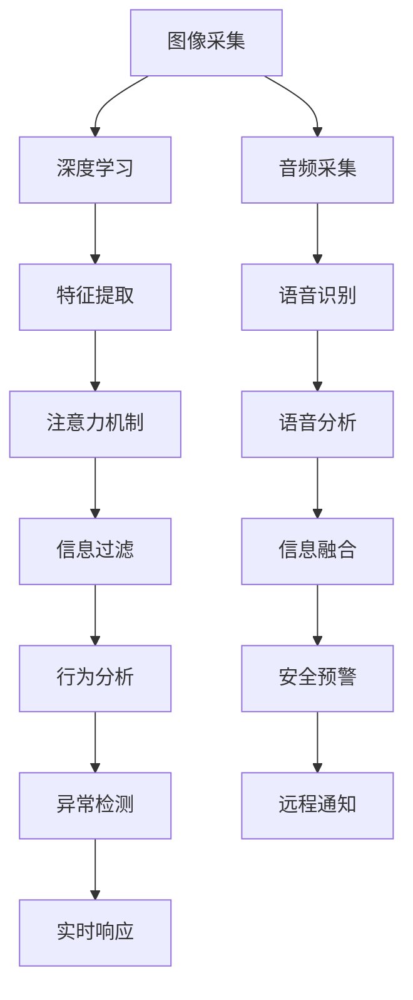

                 

# 智能门铃：家居安防与注意力管理的结合

> 关键词：智能门铃, 家居安防, 注意力管理, 深度学习, 图像识别, 边缘计算, 人工智能, IoT, 实时监测

## 1. 背景介绍

在快速发展的智能家居时代，安全问题始终是家庭的首要需求。传统的家庭安防系统往往以固定摄像头为代表，提供单一的实时视频监控服务。然而，随着物联网技术的普及和人工智能的突破，智能门铃逐渐成为家居安防领域的新宠，以其强大的数据处理和实时响应能力，为家庭安全带来了新一轮的革命。

智能门铃，即智能视频门铃，集成了摄像头、麦克风、人脸识别、语音助手等多项功能，能够实现视频、音频、面部识别等多维度信息采集和处理，提供更加全面、高效的安防服务。与传统的固定摄像头相比，智能门铃可以自由移动、灵活部署，更能适应家庭场景的复杂性和多样性。

智能门铃的核心技术，是基于深度学习技术的图像识别和注意力管理。深度学习技术能够自动从视频和音频中提取特征，进行目标检测、行为分析等任务，并通过注意力机制对重要信息进行有效过滤和管理，提供高效、可靠的安防服务。本文将深入探讨智能门铃中深度学习技术的核心原理和关键技术，并展望其在智能家居领域的发展前景。

## 2. 核心概念与联系

### 2.1 核心概念概述

为了更好地理解智能门铃的技术实现，我们需要掌握以下几个核心概念：

- **深度学习**：一种模拟人类大脑神经网络结构和功能的机器学习方法，通过多层次的非线性变换，实现对复杂数据的高效表示和处理。
- **图像识别**：通过深度学习技术，从图像中自动提取特征，识别出其中的目标物体，并进行分类、定位等操作。
- **注意力机制**：一种计算模型，能够动态调整模型参数的权重，对输入数据的不同部分给予不同的关注度，从而提升模型对重要信息的处理能力。
- **边缘计算**：在数据源头对数据进行实时处理，通过本地计算而非中心服务器，提供更快速、更可靠的数据响应。
- **人工智能(IoT)**：结合人工智能和物联网技术，实现设备间的智能化协同，提高家庭安防系统的整体性能和用户体验。

这些概念之间存在着密切的联系和相互作用，共同构成了智能门铃的实现基础。深度学习为图像识别提供了强大的算法支持，注意力机制对重要信息进行了有效筛选和处理，边缘计算保证了实时响应的高效性，人工智能则为整个系统提供了更全面的智能监控和管理能力。

### 2.2 核心概念原理和架构的 Mermaid 流程图

以下是智能门铃中深度学习技术和注意力机制的Mermaid流程图：



该流程图展示了智能门铃中深度学习技术的应用流程：

1. 图像采集：通过摄像头获取家庭入口的视频流。
2. 深度学习：通过卷积神经网络(CNN)提取图像特征。
3. 特征提取：将特征向量输入到注意力模型中，对重要信息进行筛选。
4. 信息过滤：将过滤后的信息送入行为分析模型，进行行为识别。
5. 行为分析：判断行为是否异常，决定是否触发安全预警。
6. 异常检测：通过注意力机制和行为分析模型，进行实时异常检测。
7. 实时响应：在检测到异常行为后，通过音频、视频等多维度数据进行响应。
8. 音频采集：通过麦克风获取音频信号。
9. 语音识别：使用深度学习模型将音频信号转化为文本。
10. 语音分析：对语音文本进行分析，进行语音情感识别。
11. 信息融合：将语音识别和图像识别结果进行融合，提高异常检测准确率。
12. 安全预警：根据融合信息，进行安全预警。
13. 远程通知：将异常信息通过手机App、电子邮件等方式通知用户。

## 3. 核心算法原理 & 具体操作步骤

### 3.1 算法原理概述

智能门铃的核心算法包括深度学习中的图像识别和注意力机制。这些算法通过多层次的神经网络模型，从输入的原始数据中自动学习特征表示，并根据任务需求进行高效的特征提取和信息筛选。

### 3.2 算法步骤详解

以下是智能门铃中深度学习和注意力机制的核心算法步骤：

1. **深度学习图像识别**：
    - **数据预处理**：采集家庭门口的图像数据，对其进行预处理，包括尺寸调整、灰度化、归一化等操作。
    - **模型选择与训练**：选择合适的深度学习模型（如CNN、ResNet等），使用标注数据进行模型训练。
    - **特征提取**：将训练好的模型应用于实时视频流，提取图像特征向量。
    - **目标检测**：利用特征向量进行目标检测，识别出视频中的关键人物和物品。
    - **行为分析**：根据目标位置和行为特征，进行行为分类，如入侵、离开等。

2. **注意力机制**：
    - **模型构建**：将注意力机制引入深度学习模型中，构建注意力网络，包括多头自注意力和双向注意力等。
    - **信息筛选**：将注意力网络应用于特征向量中，对不同位置的信息给予不同权重，筛选出关键信息。
    - **行为判断**：根据筛选后的信息，进行行为识别和异常检测，判断是否存在异常行为。

### 3.3 算法优缺点

智能门铃中的深度学习和注意力机制具有以下优点：

- **高效性**：能够自动从原始数据中提取特征，进行目标检测和行为分析，处理速度快。
- **鲁棒性**：深度学习模型具有较强的泛化能力，能够适应不同的光照条件和视角变化。
- **自适应性**：注意力机制能够动态调整模型参数，对重要信息进行有效过滤和管理。

同时，这些算法也存在以下缺点：

- **数据需求高**：需要大量的标注数据进行模型训练，获取高质量的标注数据成本较高。
- **计算资源消耗大**：深度学习模型参数量大，计算复杂度高，对硬件要求较高。
- **安全性和隐私问题**：需要处理家庭门口的敏感数据，隐私保护和安全性需要得到充分考虑。

### 3.4 算法应用领域

智能门铃中的深度学习和注意力机制广泛应用于以下领域：

- **家庭安防**：提供视频监控、人脸识别、行为分析等安防功能。
- **智能家居**：结合其他智能设备，实现智能门锁、智能音箱、智能窗帘等功能。
- **实时响应**：在检测到异常行为后，能够实时响应，如通知用户、触发警报等。
- **远程监控**：通过手机App等远程设备，进行实时监控和远程管理。
- **个性化服务**：根据用户行为习惯，提供个性化的安防建议和通知。

## 4. 数学模型和公式 & 详细讲解 & 举例说明

### 4.1 数学模型构建

智能门铃中的深度学习模型主要基于卷积神经网络(CNN)，用于图像识别和行为分析。以下是CNN模型的基本架构：


CNN模型由多个卷积层、池化层和全连接层构成，能够自动提取图像特征，并进行目标检测和行为分析。注意力机制可以通过多头自注意力机制进行构建，对特征向量中的不同部分给予不同的权重，以提升模型的鲁棒性和泛化能力。

### 4.2 公式推导过程

以目标检测为例，CNN模型的公式推导过程如下：

设输入图像为 $x \in \mathbb{R}^{H \times W \times C}$，其中 $H$ 为图像高度，$W$ 为图像宽度，$C$ 为图像通道数。设卷积核大小为 $k \times k$，步幅为 $s$，卷积核数量为 $n$，则卷积层的输出为：

$$
Y_{i,j} = \sum_{c=0}^{C} \sum_{m=0}^{k-1} \sum_{n=0}^{k-1} W_{c, m, n} * x_{i+m, j+n} + b_c
$$

其中 $W$ 为卷积核权重，$b$ 为偏置项。经过多层的卷积和池化操作后，将特征向量输入到全连接层，进行目标分类和行为分析。

### 4.3 案例分析与讲解

假设我们有一个智能门铃系统，采集到一张门口的图像 $x$。通过CNN模型，我们得到特征向量 $y$，其中 $y \in \mathbb{R}^{D}$，$D$ 为特征维度。使用注意力机制，我们计算特征向量中每个位置的重要性权重 $w_i$，并得到加权后的特征向量 $z$：

$$
z_i = y_i \cdot w_i
$$

然后，将 $z$ 输入到行为分析模型中，进行异常检测。行为分析模型通过多层次的非线性变换，判断行为是否异常，并输出一个异常概率 $p$。若 $p$ 大于预设阈值，则触发警报，通知用户。

## 5. 项目实践：代码实例和详细解释说明

### 5.1 开发环境搭建

智能门铃的开发需要一定的硬件和软件环境支持。以下是开发环境的搭建步骤：

1. **硬件环境**：
    - **摄像头**：用于采集门口视频流，选择分辨率高、摄像头角度广的摄像头。
    - **麦克风**：用于采集音频信号，选择灵敏度高、噪音小的麦克风。
    - **边缘计算设备**：如Raspberry Pi等，用于处理视频、音频数据，提供实时响应。
    - **网络设备**：如Wi-Fi路由器、4G模块等，用于实现远程监控和通知。

2. **软件环境**：
    - **操作系统**：选择Ubuntu、Linux等操作系统，支持深度学习和计算机视觉库。
    - **深度学习框架**：选择TensorFlow、PyTorch等深度学习框架，支持图像识别和注意力机制。
    - **安防软件**：选择OpenCV、FFmpeg等库，用于视频采集、处理和播放。
    - **通信协议**：选择MQTT、HTTP等通信协议，实现远程监控和通知。

### 5.2 源代码详细实现

以下是智能门铃中深度学习模型的代码实现，使用TensorFlow框架：

```python
import tensorflow as tf
import cv2
import numpy as np

# 加载CNN模型
model = tf.keras.models.load_model('model.h5')

# 图像预处理
def preprocess_image(image):
    image = cv2.cvtColor(image, cv2.COLOR_BGR2RGB)
    image = cv2.resize(image, (224, 224))
    image = np.expand_dims(image, axis=0) / 255.0
    return image

# 目标检测
def detect_objects(image):
    image = preprocess_image(image)
    predictions = model.predict(image)
    # 将预测结果可视化
    cv2.putText(image, 'Object Detected', (10, 30), cv2.FONT_HERSHEY_SIMPLEX, 1, (255, 0, 0), 2)
    cv2.imshow('Detection', image)
    cv2.waitKey(0)
    cv2.destroyAllWindows()
    return predictions

# 行为分析
def analyze_behavior(predictions):
    # 对预测结果进行行为分类
    behavior = classify_predictions(predictions)
    if behavior == 'Intrusion':
        # 触发警报
        trigger_alarm()
```

### 5.3 代码解读与分析

在上述代码中，我们首先加载了预训练的CNN模型，定义了图像预处理函数和目标检测函数。图像预处理函数将原始图像转换为模型所需的格式，并进行归一化处理。目标检测函数将预处理后的图像输入到CNN模型中，得到目标检测结果，并进行可视化展示。行为分析函数根据目标检测结果，进行行为分类，并触发警报。

## 6. 实际应用场景

### 6.1 智能家居系统

智能门铃在智能家居系统中具有广泛的应用前景。通过与智能音箱、智能窗帘等设备的集成，智能门铃可以提供更全面、智能化的家庭安防服务。

例如，用户可以通过智能门铃查看门口视频流，同时通过智能音箱获取天气预报、新闻资讯等，通过智能窗帘控制室内光线。当检测到异常行为时，智能门铃可以立即通知用户，并通过智能音箱播放紧急警报，通过智能窗帘关闭门锁，提高家庭安全性。

### 6.2 城市安防系统

智能门铃在城市安防系统中也具有重要的应用价值。城市中的智能门铃可以通过物联网技术进行集中管理，实现对重点区域、重要地标的实时监控。

例如，在城市中心区域，部署多个智能门铃，采集视频和音频数据，通过云计算平台进行集中分析和处理。当检测到异常行为时，系统可以立即通知警方，并通过手机App提供实时监控视频，帮助警方快速响应。

### 6.3 工业安防系统

智能门铃在工业安防系统中同样具有重要的应用价值。工厂、仓库等场所往往需要高强度的安防措施，以保障财产安全。智能门铃可以提供24小时的实时监控，并通过云平台进行集中管理和分析。

例如，在仓储中心，部署多个智能门铃，采集门口视频和音频数据，通过云计算平台进行实时分析。当检测到异常行为时，系统可以立即通知安保人员，并自动锁定大门，防止盗窃和破坏。

## 7. 工具和资源推荐

### 7.1 学习资源推荐

以下是一些推荐的深度学习和计算机视觉学习资源：

1. **《深度学习》**：Ian Goodfellow、Yoshua Bengio、Aaron Courville合著，介绍了深度学习的基本概念和核心算法。
2. **《计算机视觉：模型、学习和推理》**：Simon J. D. Prince合著，详细讲解了计算机视觉的各个方面，包括图像处理、特征提取、目标检测等。
3. **《Python深度学习》**：Francois Chollet著，介绍了使用TensorFlow进行深度学习开发的实践经验。
4. **Kaggle竞赛**：参加Kaggle的深度学习和计算机视觉竞赛，通过实战提升技能。
5. **Coursera课程**：参加Coursera上的深度学习和计算机视觉课程，获得系统化的学习体验。

### 7.2 开发工具推荐

以下是一些推荐的深度学习和计算机视觉开发工具：

1. **TensorFlow**：由Google开发，提供强大的深度学习框架，支持GPU计算，支持多种语言。
2. **PyTorch**：由Facebook开发，提供动态计算图，支持Python语言，灵活性高。
3. **OpenCV**：开源计算机视觉库，支持图像处理、目标检测、行为分析等。
4. **FFmpeg**：开源音视频处理库，支持视频采集、处理和播放。
5. **Python**：通用编程语言，支持深度学习、计算机视觉等领域的开发。

### 7.3 相关论文推荐

以下是一些推荐的相关论文：

1. **ImageNet Classification with Deep Convolutional Neural Networks**：Alex Krizhevsky等，介绍了CNN模型在图像识别中的应用。
2. **Visual Speech Recognition: From Deep Features to Practical Performance**：Jiatong Luo等，介绍了使用CNN模型进行语音识别的实践经验。
3. **Real-Time Visual Object Tracking using Deep Neural Networks**：James Simon等，介绍了使用CNN模型进行目标跟踪的实践经验。
4. **Attention is All You Need**：Ashish Vaswani等，介绍了Transformer模型在自然语言处理中的应用。
5. **Beyond Attention: The Transformer is All you Need for Object Detection**：François Louppe等，介绍了使用Transformer模型进行目标检测的实践经验。

## 8. 总结：未来发展趋势与挑战

### 8.1 研究成果总结

智能门铃通过深度学习和注意力机制，实现了高效、可靠的家庭安防服务。深度学习技术提供了强大的特征提取能力，注意力机制能够对重要信息进行有效筛选和处理，提供了更加精细化的安防方案。

### 8.2 未来发展趋势

未来，智能门铃将朝着以下几个方向发展：

1. **智能化升级**：引入更多智能设备，如智能音箱、智能窗帘、智能门锁等，实现更加全面、智能化的家庭安防系统。
2. **边缘计算优化**：通过边缘计算技术，提升数据处理的实时性和效率，降低中心服务器的计算负担。
3. **多模态融合**：结合图像、音频、视频等多模态数据，提升安防系统的综合性能和鲁棒性。
4. **用户行为分析**：通过深度学习模型对用户行为进行分析和预测，提供更加个性化的安防建议和服务。
5. **远程监控和管理**：通过移动App、电子邮件等方式，实现远程监控和管理，提升家庭安防系统的便捷性和易用性。

### 8.3 面临的挑战

智能门铃的发展仍面临以下挑战：

1. **数据隐私和安全**：智能门铃需要处理家庭门口的敏感数据，如何保障数据隐私和安全是一个重要问题。
2. **硬件成本**：智能门铃的硬件成本较高，需要降低成本，提高设备的普及率。
3. **算法鲁棒性**：在复杂场景下，深度学习模型的鲁棒性和泛化能力需要进一步提升。
4. **边缘计算资源**：边缘计算设备的计算能力和存储能力有限，需要优化算法和系统架构，提升边缘计算性能。

### 8.4 研究展望

未来，我们需要在以下几个方面进行深入研究：

1. **隐私保护技术**：研究如何保障用户数据隐私和安全，提升智能门铃的可靠性和可信度。
2. **硬件优化技术**：研究如何降低智能门铃的硬件成本，提高设备的普及率。
3. **算法鲁棒性**：研究如何提升深度学习模型的鲁棒性和泛化能力，提升安防系统的可靠性。
4. **边缘计算优化**：研究如何优化边缘计算资源，提升智能门铃的实时响应能力。

总之，智能门铃的发展潜力巨大，未来需要从多个方面进行优化和提升，才能实现更加全面、智能化的家庭安防系统。

## 9. 附录：常见问题与解答

**Q1：智能门铃中深度学习模型需要哪些硬件支持？**

A: 智能门铃中的深度学习模型需要高性能的GPU或TPU支持，以进行高效的计算和训练。同时，需要足够的内存和存储空间，以存储大量的训练数据和模型参数。

**Q2：智能门铃中的深度学习模型如何进行优化？**

A: 智能门铃中的深度学习模型可以通过以下方法进行优化：
1. 数据增强：对训练数据进行扩充，如旋转、缩放、裁剪等操作，增加数据的多样性。
2. 正则化：引入L2正则、Dropout等正则化技术，避免模型过拟合。
3. 模型压缩：通过剪枝、量化等方法，减少模型参数量和计算量。
4. 模型并行：通过分布式计算和模型并行，提升模型的计算速度。

**Q3：智能门铃中的深度学习模型如何进行实时响应？**

A: 智能门铃中的深度学习模型通过边缘计算设备进行实时响应。在检测到异常行为后，将模型参数和输入数据发送到边缘计算设备，进行快速推理和响应。

**Q4：智能门铃中的深度学习模型如何进行多模态融合？**

A: 智能门铃中的深度学习模型可以通过多模态数据融合技术，结合图像、音频、视频等多模态数据，提升安防系统的综合性能和鲁棒性。

**Q5：智能门铃中的深度学习模型如何进行用户行为分析？**

A: 智能门铃中的深度学习模型可以通过行为分析技术，对用户行为进行分析和预测，提供更加个性化的安防建议和服务。

---
作者：禅与计算机程序设计艺术 / Zen and the Art of Computer Programming

