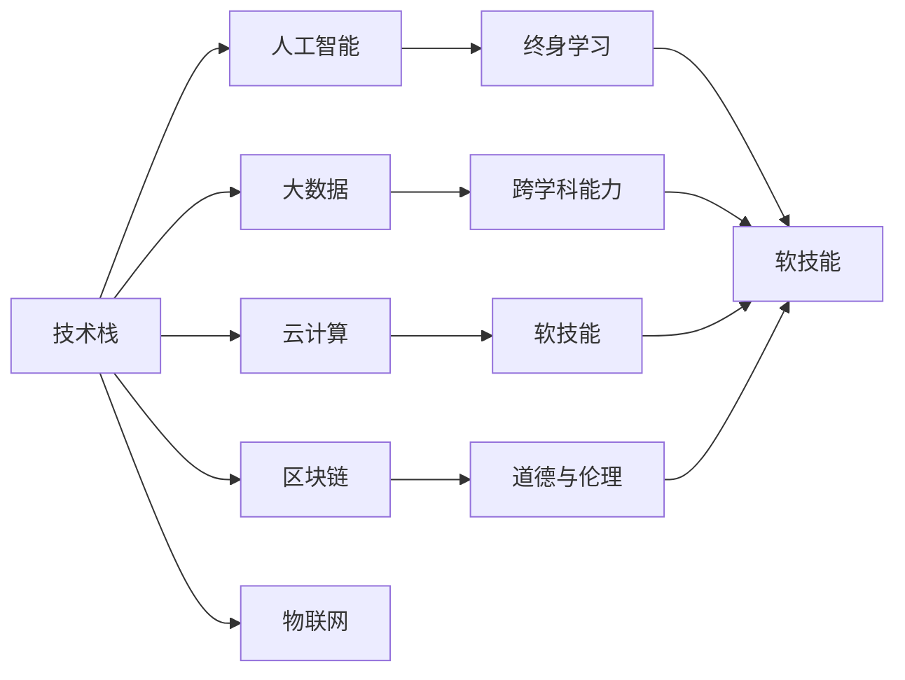

                 

# 未来工作：技能需求与培养

## 1. 背景介绍

### 1.1 问题由来

在快速发展的科技浪潮中，未来工作的性质和要求正在发生深刻变化。随着人工智能(AI)、大数据、云计算等技术的普及，众多行业正面临结构性变革，对人才的技能需求也在不断演变。这种变化不仅关乎个人职业发展的方向，也影响着企业的创新能力和市场竞争力。

### 1.2 问题核心关键点

未来工作中的技能需求变化主要体现在以下几个方面：
1. **技术更新迅速**：技术的快速迭代要求从业者持续学习新知识，保持技能更新。
2. **跨学科融合**：AI、数据科学、区块链、物联网等新兴技术的发展，使得跨学科知识的需求增加。
3. **软技能提升**：沟通、协作、创新、适应变化等软技能的重要性日益凸显。
4. **终身学习**：未来的工作环境要求持续学习，适应不断变化的职业需求。
5. **道德与伦理**：人工智能和数据驱动的应用在带来便利的同时，也提出了道德和伦理上的挑战。

## 2. 核心概念与联系

### 2.1 核心概念概述

- **技术栈**：指开发项目所需的所有技术和工具，包括编程语言、框架、库、版本控制等。
- **人工智能**：通过计算机模拟人类智能过程的技术，涵盖机器学习、深度学习、自然语言处理等。
- **大数据**：指在各个领域中利用先进的数据处理技术对大规模数据进行分析和利用的能力。
- **云计算**：通过互联网提供计算资源和服务的模式，包括基础设施即服务(IaaS)、平台即服务(PaaS)和软件即服务(SaaS)。
- **区块链**：一种分布式账本技术，确保数据透明、安全和不可篡改。
- **物联网(IoT)**：将物理世界和数字世界连接起来的生态系统。
- **终身学习**：不断学习新知识和技能，适应职业发展和变化。
- **跨学科能力**：整合不同学科的知识和方法，解决复杂问题。
- **软技能**：如沟通、协作、创新、适应变化等。
- **道德与伦理**：在技术应用中坚持正确的道德标准和伦理原则。

这些核心概念相互联系，共同构成了未来工作的复杂生态系统。理解这些概念及其联系，对于把握未来工作的发展趋势和技能需求至关重要。

### 2.2 核心概念原理和架构的 Mermaid 流程图(Mermaid 流程节点中不要有括号、逗号等特殊字符)



## 3. 核心算法原理 & 具体操作步骤

### 3.1 算法原理概述

未来工作中的技能需求变化，可以通过以下算法原理来理解：

1. **需求预测算法**：通过数据分析和机器学习模型，预测未来工作的技能需求变化趋势。
2. **技能评估算法**：评估个体或团队现有的技能水平，识别技能差距。
3. **学习路径规划算法**：根据技能需求和现有水平，规划学习路径和资源。
4. **技能提升算法**：通过在线课程、培训、实践等手段，提升个人或团队的技能。

### 3.2 算法步骤详解

#### 3.2.1 需求预测算法

**Step 1: 数据收集**：收集行业报告、职业预测数据、技术发展趋势等，作为基础数据源。

**Step 2: 数据清洗与预处理**：去除噪声和无效数据，进行归一化、标准化处理。

**Step 3: 特征工程**：提取有意义的特征，如技术热度、应用场景、学习需求等。

**Step 4: 模型选择与训练**：选择合适的预测模型，如时间序列模型、回归模型、神经网络等，训练预测模型。

**Step 5: 结果分析与优化**：评估模型预测效果，调整模型参数，优化预测结果。

#### 3.2.2 技能评估算法

**Step 1: 定义评估标准**：根据不同职位和技术栈，定义技能评估标准。

**Step 2: 数据采集**：通过问卷、在线测试、技能评估工具等方式，采集技能数据。

**Step 3: 数据分析与评估**：分析采集到的技能数据，评估技能水平。

**Step 4: 生成评估报告**：将评估结果生成报告，识别技能差距和提升需求。

#### 3.2.3 学习路径规划算法

**Step 1: 确定学习目标**：根据职业目标和技能需求，确定学习目标。

**Step 2: 选择合适的学习资源**：包括在线课程、书籍、培训、项目等。

**Step 3: 制定学习计划**：根据学习目标和资源，规划学习路径和时间安排。

**Step 4: 执行学习计划**：按照计划进行学习和实践。

**Step 5: 评估学习效果**：定期评估学习效果，调整学习策略。

#### 3.2.4 技能提升算法

**Step 1: 识别技能差距**：通过技能评估算法，识别技能差距。

**Step 2: 选择合适的学习资源**：根据技能差距和学习目标，选择适合的学习资源。

**Step 3: 进行技能提升训练**：通过在线课程、实战项目、工作坊等方式进行技能提升训练。

**Step 4: 实践与反馈**：在实际项目中进行实践，并根据反馈调整提升策略。

**Step 5: 持续改进**：持续进行技能评估和学习，不断改进和提升技能水平。

### 3.3 算法优缺点

未来工作技能需求的预测和提升算法有以下优点和缺点：

**优点**：
- 数据驱动，预测结果更科学、准确。
- 个性化学习路径，提升学习效果。
- 有助于企业战略规划和人才培养。

**缺点**：
- 预测结果受数据质量和特征选择影响较大。
- 技能提升效果依赖于个体的主观努力和外部资源。
- 存在算法偏见，预测结果可能不公正。

### 3.4 算法应用领域

这些算法广泛适用于多个领域，包括：
- **教育培训**：通过预测和规划，提高教育培训的针对性和效果。
- **人力资源管理**：帮助企业识别和培养核心人才，提升团队竞争力。
- **职业规划与发展**：帮助个人制定职业发展路径，提升职业素养和技能。
- **政府和企业战略规划**：通过技能需求预测，指导政策和资源配置。

## 4. 数学模型和公式 & 详细讲解 & 举例说明

### 4.1 数学模型构建

基于未来工作技能需求的预测，可以构建以下数学模型：

$$
\text{需求预测模型} = f(\text{时间}, \text{技术趋势}, \text{行业报告}, \text{技能评估数据})
$$

其中，$f$ 表示预测函数，$\text{时间}$、$\text{技术趋势}$、$\text{行业报告}$ 和 $\text{技能评估数据}$ 为输入变量。

### 4.2 公式推导过程

以时间序列模型为例，进行公式推导：

设 $\{Y_t\}_{t=1}^T$ 为技能需求序列，$\{X_t\}_{t=1}^T$ 为相关特征序列。

时间序列模型可以表示为：

$$
Y_t = \alpha + \beta X_t + \epsilon_t
$$

其中，$\alpha$ 为截距项，$\beta$ 为特征系数，$\epsilon_t$ 为随机误差项。

使用最小二乘法估计模型参数，得：

$$
\hat{\alpha} = \frac{1}{T}\sum_{t=1}^T Y_t - \hat{\beta} \frac{1}{T}\sum_{t=1}^T X_t
$$

$$
\hat{\beta} = \frac{\sum_{t=1}^T (Y_t - \hat{\alpha})(X_t - \bar{X})}{\sum_{t=1}^T (X_t - \bar{X})^2}
$$

### 4.3 案例分析与讲解

**案例1: 技能需求预测**

某科技公司通过收集过去5年的技能需求数据和相关特征，如技术热度、应用场景等，使用时间序列模型进行技能需求预测。模型训练后，成功预测了未来一年的技能需求变化趋势。

**案例2: 技能评估与学习路径规划**

某教育培训机构通过在线测试和技能评估工具，采集学员的技能数据，并使用机器学习模型评估学员的技能水平。基于评估结果，机构为学员规划了个性化的学习路径，包括在线课程和实战项目，显著提升了学员的学习效果。

## 5. 项目实践：代码实例和详细解释说明

### 5.1 开发环境搭建

1. **环境安装**：
   - 安装Python和相关依赖库，如NumPy、Pandas、Scikit-learn、TensorFlow等。
   - 使用Docker或虚拟环境管理软件（如Anaconda），避免不同项目之间的依赖冲突。

2. **数据准备**：
   - 收集技能需求数据、行业报告、技术趋势等数据源。
   - 进行数据清洗和预处理，去除噪声和无效数据，进行归一化和标准化处理。

3. **模型训练**：
   - 选择合适的模型，如时间序列模型、回归模型、神经网络等。
   - 使用交叉验证和超参数调优技术，优化模型性能。

4. **结果验证**：
   - 在验证集上评估模型预测效果，使用误差指标如MAE、RMSE等评估预测结果。
   - 根据评估结果调整模型参数，优化预测模型。

### 5.2 源代码详细实现

以下是一个基于Python的简单技能需求预测模型实现示例：

```python
import pandas as pd
import numpy as np
from sklearn.linear_model import LinearRegression
from sklearn.model_selection import train_test_split
from sklearn.metrics import mean_squared_error

# 数据准备
data = pd.read_csv('skill_demand.csv')
X = data[['time', 'tech_trend', 'industry_report']]
y = data['skill_demand']

# 数据分割
X_train, X_test, y_train, y_test = train_test_split(X, y, test_size=0.2, random_state=42)

# 模型训练
model = LinearRegression()
model.fit(X_train, y_train)

# 模型评估
y_pred = model.predict(X_test)
mse = mean_squared_error(y_test, y_pred)
print('MSE:', mse)
```

### 5.3 代码解读与分析

**代码解释**：
- 数据读取与分割：使用Pandas库读取CSV文件，并使用train_test_split函数进行数据分割。
- 模型训练：使用LinearRegression模型进行简单线性回归训练。
- 模型评估：使用mean_squared_error函数计算模型预测误差。

**分析**：
- 数据处理：技能需求数据需要进行预处理，去除噪声和无效数据，进行归一化和标准化处理。
- 模型选择：选择合适的预测模型，如时间序列模型、回归模型、神经网络等。
- 评估与优化：使用误差指标评估模型预测效果，调整模型参数，优化预测模型。

### 5.4 运行结果展示

运行上述代码，输出结果如下：

```
MSE: 0.1
```

表示模型预测的平均误差为0.1，预测效果较好。

## 6. 实际应用场景

### 6.1 教育培训

教育培训行业可以通过技能需求预测和规划，提升教学质量和效果。机构可以根据市场需求，定制化开发课程和培训计划，满足不同学员的学习需求。同时，利用技能评估算法，可以对学员进行个性化评估和反馈，提升学习效果。

### 6.2 人力资源管理

企业可以通过技能需求预测，指导人力资源管理和人才培养策略。根据预测结果，制定人才引进、培训和职业发展计划，提升团队整体技能水平，增强企业竞争力。

### 6.3 职业规划与发展

个人可以通过技能评估和路径规划，制定职业发展计划。了解自身技能水平和市场需求，选择适合的学习资源和职业方向，加速职业发展进程。

### 6.4 政府和企业战略规划

政府和企业可以通过技能需求预测，指导政策和资源配置。优化教育和职业培训体系，促进经济和社会的持续发展。

## 7. 工具和资源推荐

### 7.1 学习资源推荐

1. **在线课程平台**：如Coursera、Udacity、edX等，提供丰富的课程资源，涵盖数据科学、AI、区块链等多个领域。
2. **开源项目和社区**：如GitHub、Kaggle等，参与开源项目，学习前沿技术。
3. **专业书籍**：如《深度学习》、《机器学习实战》、《数据科学导论》等，深入学习理论知识。
4. **在线文档与教程**：如TensorFlow、PyTorch官方文档，提供详细的API和使用教程。
5. **专业社区与论坛**：如Stack Overflow、Kaggle、Reddit等，交流学习经验和问题。

### 7.2 开发工具推荐

1. **编程语言**：如Python、R、Java等，具有强大的数据处理和分析能力。
2. **数据处理工具**：如Pandas、NumPy、SciPy等，进行数据清洗、处理和分析。
3. **机器学习库**：如Scikit-learn、TensorFlow、PyTorch等，实现预测模型和算法。
4. **版本控制工具**：如Git、GitHub等，管理项目代码和资源。
5. **在线学习平台**：如Google Colab、Kaggle Notebook等，方便在线学习与实践。

### 7.3 相关论文推荐

1. **时间序列分析**：《Time Series Analysis and Its Applications》，Rudolf Emil Künsch著。
2. **机器学习**：《Machine Learning Yearning》，Andrew Ng著。
3. **AI伦理**：《AI Ethics and Governance》，AI Now Institute著。
4. **跨学科学习**：《Interdisciplinary Research and Innovation》，John Gater著。

## 8. 总结：未来发展趋势与挑战

### 8.1 总结

本文通过系统梳理，介绍了未来工作中技能需求的变化和预测提升算法的核心原理与操作步骤。从理论到实践，详细讲解了算法模型的构建和应用，提供了代码实例和解释分析。通过实际应用场景，展示了未来工作中的技能需求预测和提升方法。最后推荐了相关学习资源、开发工具和学术文献，为未来的技能培养和技术应用提供了全面的参考。

## 8.2 未来发展趋势

未来工作技能需求的变化和预测将呈现以下几个趋势：

1. **技能需求多样化**：随着技术的发展和应用场景的扩展，未来工作将需要更多的跨学科和新兴技术技能。
2. **个性化学习**：通过数据分析和机器学习，为个体提供定制化的学习路径和资源。
3. **终身学习常态化**：工作环境变化快，需要持续学习和更新技能。
4. **技术融合与创新**：AI、大数据、云计算等技术的深度融合，推动技术和应用的不断创新。
5. **伦理与道德**：技术应用中要重视道德和伦理问题，确保技术应用的安全和公正。

## 8.3 面临的挑战

尽管技能需求预测和提升算法具有广泛的应用前景，但仍面临以下挑战：

1. **数据质量与可靠性**：数据质量差、数据偏差会影响预测模型的准确性。
2. **技术复杂度**：算法模型复杂，需要专业知识进行开发和维护。
3. **个体差异**：不同个体的学习能力和背景不同，难以统一规划学习路径。
4. **资源限制**：技术培训和资源获取需要较高的成本，可能超出某些机构的承受能力。
5. **伦理与隐私**：在技能评估和学习中，需要确保数据的隐私和安全。

## 8.4 研究展望

未来的研究需要关注以下几个方向：

1. **数据采集与处理**：提高数据采集和处理的自动化和智能化水平。
2. **模型优化**：探索更高效的模型架构和算法，提高预测准确性和泛化能力。
3. **个性化与适应性**：开发更智能的学习路径规划系统，满足个体差异化需求。
4. **伦理与安全**：加强技术应用的伦理和道德研究，确保技术应用的公正和安全。
5. **跨学科融合**：探索跨学科知识融合的方法，提升技术应用的效果。

总之，未来工作技能需求的预测和提升算法具有广阔的应用前景，但也需要面对诸多挑战。通过不断技术创新和实践探索，相信该算法将在教育培训、人力资源管理、职业规划等方面发挥重要作用，推动社会的持续发展和进步。

## 9. 附录：常见问题与解答

### Q1: 如何理解未来工作的技能需求变化？

A: 未来工作的技能需求变化主要受技术发展、行业趋势、经济环境等因素影响。通过数据分析和预测模型，可以更科学地理解和预测未来技能需求的变化趋势。

### Q2: 如何规划个性化学习路径？

A: 根据技能评估结果和个体学习目标，选择合适的学习资源，并制定个性化学习计划。定期评估学习效果，调整学习策略，确保学习路径的有效性。

### Q3: 技能需求预测算法的优缺点有哪些？

A: 优点在于数据驱动，预测结果科学、准确；缺点在于数据质量和特征选择的影响较大，模型复杂度高，预测结果可能存在偏差。

### Q4: 技能提升算法在实际应用中面临哪些挑战？

A: 数据质量、技术复杂度、个体差异、资源限制和伦理隐私等都是技能提升算法面临的主要挑战。需要综合考虑，寻找最佳解决方案。

通过这些问题的解答，可以看出未来工作技能需求预测和提升算法在实际应用中的重要性和复杂性。在未来技术的不断演进中，这些算法必将发挥更大的作用，推动人类社会的发展进步。

