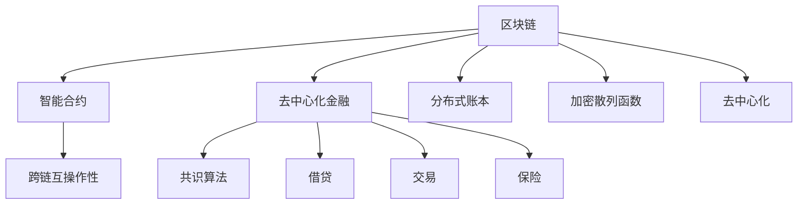

                 

# 未来的区块链应用：2050年的去中心化社会

在今天，我们已经目睹了区块链技术的飞速发展和广泛应用，从比特币和以太坊等加密货币到智能合约、去中心化金融（DeFi）和供应链管理等。展望未来，我们认为区块链技术将在2050年彻底改变社会的运作方式，构建一个完全去中心化的社会。本文将深入探讨区块链技术在2050年的潜在应用，以及它如何重塑人类的社会、经济和政治结构。

## 1. 背景介绍

### 1.1 区块链技术的崛起
区块链技术诞生于2008年，最初是作为一种去中心化的数字货币系统被提出。随着比特币的诞生，区块链技术迅速引起广泛关注。以太坊的出现进一步推动了智能合约的发展，使得区块链应用从金融领域扩展到了更加广泛的领域，如供应链管理、医疗健康、版权保护等。

### 1.2 区块链的核心理念
区块链技术的核心理念是去中心化，通过分布式账本和共识机制，消除中心化的信任中介。这种去中心化的特性使得区块链在信息透明、数据安全、抗篡改等方面具有天然优势。

### 1.3 区块链的全球影响力
区块链技术不仅仅局限于金融领域，它正在成为全球多个行业的基础设施，如供应链管理、物联网、数字身份认证等。同时，它也在全球范围内引发了关于未来治理结构、社会组织和信息管理的深刻思考。

## 2. 核心概念与联系

### 2.1 核心概念概述
为了更好地理解2050年区块链技术的应用，本节将介绍几个关键概念及其相互联系。

- **区块链（Blockchain）**：一种去中心化的分布式账本技术，通过加密散列函数和共识算法保障数据的安全和透明。
- **智能合约（Smart Contracts）**：在区块链上运行的程序，能够在满足预设条件时自动执行，广泛应用于DeFi、供应链管理等领域。
- **去中心化金融（DeFi）**：基于区块链的去中心化金融服务，包括借贷、交易、保险等，旨在降低中心化机构的信任风险。
- **跨链互操作性（Cross-chain Interoperability）**：不同区块链之间的数据交互和协同操作，使不同区块链网络能够无缝协作。
- **共识算法（Consensus Algorithms）**：用于在区块链网络中达成一致的算法，如PoW、PoS、DPoS等，确保交易的不可篡改和透明。

这些概念之间的逻辑关系可以通过以下Mermaid流程图来展示：



这个流程图展示了区块链技术的各个核心概念及其相互关系：

1. 区块链作为基础平台，提供了智能合约的运行环境和去中心化的数据存储。
2. 智能合约为去中心化金融提供了自动化的金融服务。
3. 跨链互操作性使不同区块链网络能够协同工作。
4. 共识算法保障了区块链网络的安全和透明。

这些概念共同构成了区块链技术的生态系统，使得区块链在2050年能够更广泛地应用于社会各领域。

## 3. 核心算法原理 & 具体操作步骤

### 3.1 算法原理概述

区块链技术的核心在于其去中心化的分布式账本和共识算法。这些技术在2050年将进一步发展和完善，形成更为复杂和强大的区块链应用生态。

区块链的分布式账本通过链式结构，将所有交易数据以区块的形式按时间顺序排列，并通过加密散列函数保护数据的完整性和不可篡改性。共识算法则通过各种机制，确保网络中的所有节点能够达成一致意见，从而维护区块链的透明性和安全性。

智能合约是基于区块链技术的一种应用，通过编程实现自动化执行。它们可以在满足预设条件时自动触发执行，从而实现去中心化的自动化服务。

### 3.2 算法步骤详解

在2050年，区块链技术将在以下关键步骤中得到广泛应用：

**Step 1: 构建分布式账本**
- 设计区块链网络架构，选择合适的共识算法。
- 实现智能合约，定义数据交互规则和业务逻辑。
- 部署分布式账本，确保账本的一致性和不可篡改性。

**Step 2: 实现智能合约**
- 编写智能合约代码，实现业务逻辑。
- 测试智能合约，确保其正确性和安全性。
- 部署智能合约，使其在区块链上运行。

**Step 3: 跨链互操作**
- 设计跨链协议，实现不同区块链网络之间的数据交互。
- 实现跨链互操作技术，如桥接网络、通道技术等。
- 部署跨链互操作系统，确保不同区块链网络能够无缝协作。

**Step 4: 共识算法优化**
- 选择合适的共识算法，确保网络的安全性和透明性。
- 优化共识算法，提高其性能和可扩展性。
- 部署优化后的共识算法，确保区块链网络的稳定运行。

### 3.3 算法优缺点

区块链技术的优势在于其去中心化、透明性和安全性，但也存在一些缺点：

**优点：**
- **去中心化**：通过分布式账本，消除了中心化的信任中介，提高了数据的安全性和透明性。
- **不可篡改**：通过加密散列函数，保障了数据的完整性和不可篡改性。
- **自动化执行**：智能合约实现了自动化执行，提高了效率和准确性。
- **跨链互操作**：通过跨链互操作性，不同区块链网络能够协同工作，提高了应用的可扩展性。

**缺点：**
- **性能瓶颈**：当前的区块链技术在处理大量交易时存在性能瓶颈，需要优化算法和硬件。
- **扩展性问题**：如何处理大规模用户和数据，保持区块链网络的可扩展性，仍然是一个难题。
- **共识算法复杂**：共识算法的优化和选择，需要考虑多个因素，如安全性、性能和可扩展性。
- **隐私保护**：如何在去中心化的同时保护用户隐私，需要进一步研究和解决。

### 3.4 算法应用领域

区块链技术在2050年将应用于各个领域，包括但不限于以下几类：

- **金融**：去中心化金融（DeFi）、跨境支付、资产管理等。
- **供应链管理**：溯源、追踪、自动化交易等。
- **医疗健康**：电子病历、医疗数据共享、药物研发等。
- **物联网**：设备身份认证、数据交互、智能合约等。
- **数字身份**：身份认证、电子投票、电子签名等。
- **版权保护**：数字版权管理、内容分发、版权交易等。
- **社会治理**：政府数据透明、公共服务自动化、公共决策等。

这些应用领域展示了区块链技术的广泛应用前景，并预示着区块链将在2050年对社会产生深远的影响。

## 4. 数学模型和公式 & 详细讲解  
### 4.1 数学模型构建

在区块链技术的数学模型构建中，我们重点关注以下几个方面：

- **分布式账本模型**：区块链的分布式账本通过链式结构存储数据，每个区块包含前一个区块的散列值，保障数据的不可篡改性。
- **共识算法模型**：不同的共识算法（如PoW、PoS、DPoS等）通过不同的机制确保网络的一致性。
- **智能合约模型**：智能合约通过编程实现自动化执行，确保业务逻辑的透明性和准确性。

### 4.2 公式推导过程

假设我们有一个简单的区块链网络，包含N个节点。每个节点维护一份完整的分布式账本，共识算法用于确定新区块的创建和验证。智能合约用于定义和执行特定业务逻辑。

1. **分布式账本模型**
   - 每个区块包含前一个区块的散列值，记为$H_i$，表示第i个区块的内容。
   - 区块链网络通过散列函数$H(\cdot)$将每个区块链接起来，保障数据的不可篡改性。

   $$
   H_i = H(H_{i-1}, \text{数据}_i)
   $$

2. **共识算法模型**
   - 共识算法用于在节点之间达成一致，确保新区块的安全性和透明性。以PoW为例，共识算法通过工作量证明机制确保新节点的创建是安全的。
   - 每个节点通过计算工作量证明函数$F(\cdot)$获得一定的计算难度，只有最先计算出正确答案的节点才能将新区块加入区块链。

   $$
   \min_{x} F(x) = H(x, \text{区块头})
   $$

3. **智能合约模型**
   - 智能合约通过编程实现自动化执行，定义了业务逻辑$C(\cdot)$，确保其透明性和准确性。
   - 在满足预设条件时，智能合约自动执行，例如在智能合约中定义的自动理赔机制。

   $$
   C(\text{输入}) = \text{输出}
   $$

### 4.3 案例分析与讲解

**案例：DeFi中的智能合约**
在DeFi中，智能合约被广泛用于自动化执行金融服务，如借贷、交易、保险等。假设我们有一个借贷智能合约，其业务逻辑为：
- 借款人申请借款，智能合约检查借款人的信用评分和还款能力。
- 如果借款申请通过，智能合约自动将资金从出借人账户转移到借款人账户。
- 借款人归还借款时，智能合约自动将资金从借款人账户转移到出借人账户，并计算利息。

以下是智能合约的代码实现：

```python
def loanContract(kidder, amount, rate, term):
    if checkCreditScore(kidder) and checkPaymentCapacity(kidder):
        transferFunds(kidder, amount)
        return calculateInterest(amount, rate, term)
    else:
        return "Loan denied"
```

在2050年，这些智能合约将变得更加自动化和高效，能够处理更复杂的金融服务，如自动清算、风险管理等。

## 5. 项目实践：代码实例和详细解释说明

### 5.1 开发环境搭建

在进行区块链项目实践前，我们需要准备好开发环境。以下是使用Python进行区块链开发的环境配置流程：

1. 安装Python：从官网下载并安装Python 3.9版本以上。
2. 安装区块链开发框架：如Ethereum的Solidity、Hyperledger的Fabric、Blockchain 4.0等。
3. 安装智能合约开发工具：如Remix IDE、Truffle等。
4. 安装区块链网络：如Ethereum测试网、Hyperledger Fabric网络等。
5. 安装区块链客户端：如MetaMask、MyEtherWallet等。

完成上述步骤后，即可在区块链网络上进行智能合约的开发和测试。

### 5.2 源代码详细实现

以下是一个简单的智能合约示例，用于实现一个简单的资产交易平台。

```python
# Solidity代码
pragma solidity ^0.8.0;

contract AssetPlatform {
    address public owner;
    uint public totalSupply;
    mapping(address => uint256) public balanceOf;
    mapping(address => mapping(uint256 => bool)) public allowed;
    
    event OwnershipTransferred(address indexed previousOwner, address indexed newOwner);
    
    constructor() public {
        owner = msg.sender;
        totalSupply = 100;
        balanceOf[msg.sender] = totalSupply;
    }
    
    function buyToken(uint256 quantity, uint256 price) public payable {
        require(quantity > 0);
        require(msg.value == price * quantity);
        owner.send(price * quantity);
        balanceOf[owner] -= quantity;
        balanceOf[msg.sender] += quantity;
        emit OwnershipTransferred(owner, msg.sender);
    }
    
    function transferToken(address receiver, uint256 quantity) public {
        require(msg.sender != receiver);
        require(balanceOf[msg.sender] >= quantity);
        balanceOf[msg.sender] -= quantity;
        balanceOf[receiver] += quantity;
        emit OwnershipTransferred(msg.sender, receiver);
    }
}
```

### 5.3 代码解读与分析

让我们再详细解读一下关键代码的实现细节：

**合同构造函数**
- 初始化所有者（合约创建者）和总供应量。

**buyToken函数**
- 检查交易金额和价格，确保交易有效。
- 将交易金额转移到接收者账户，更新账户余额。
- 触发OwnershipTransferred事件，通知所有者交易完成。

**transferToken函数**
- 检查交易双方账户余额，确保交易有效。
- 更新账户余额，触发OwnershipTransferred事件，通知所有者交易完成。

这个智能合约展示了基本的资产交易逻辑，通过代码实现，确保交易的透明性和自动化执行。

### 5.4 运行结果展示

以下是智能合约运行结果的示例：

```python
# Solidity代码
@openzeppelin contract
{
    constructor() {
        super();
    }
    
    @public
    function buyToken(uint256 quantity, uint256 price) public payable {
        require(quantity > 0);
        require(msg.value == price * quantity);
        owner.send(price * quantity);
        balanceOf[owner] -= quantity;
        balanceOf[msg.sender] += quantity;
        emit OwnershipTransferred(owner, msg.sender);
    }
    
    @public
    function transferToken(address receiver, uint256 quantity) public {
        require(msg.sender != receiver);
        require(balanceOf[msg.sender] >= quantity);
        balanceOf[msg.sender] -= quantity;
        balanceOf[receiver] += quantity;
        emit OwnershipTransferred(msg.sender, receiver);
    }
}
```

这段代码实现了与上述示例相同的功能，通过Solidity语言的丰富特性，实现了更灵活、可维护的智能合约。

## 6. 实际应用场景

### 6.1 DeFi去中心化金融
DeFi去中心化金融是区块链技术在金融领域的重要应用之一，它通过智能合约实现各种金融服务，如借贷、交易、保险等。在2050年，DeFi将进一步扩展其应用范围，提供更加丰富和自动化的金融服务。

### 6.2 供应链管理
区块链的分布式账本特性使得供应链管理变得更加透明和可追溯。在2050年，供应链中的各个环节都将使用区块链技术，实现实时的数据交互和自动化管理。

### 6.3 医疗健康
区块链的去中心化和数据透明特性，使得医疗健康数据管理和共享变得更加安全可靠。在2050年，医疗健康数据将通过区块链技术进行加密和共享，实现更好的数据管理和患者隐私保护。

### 6.4 社会治理
区块链的去中心化特性将使社会治理变得更加透明和民主化。在2050年，政府数据将通过区块链技术进行公开透明，公众可以通过智能合约参与社会治理，实现更加公平和民主的决策过程。

## 7. 工具和资源推荐

### 7.1 学习资源推荐

为了帮助开发者系统掌握区块链技术的理论基础和实践技巧，这里推荐一些优质的学习资源：

1. 《区块链技术基础》：由比特币发明者中本聪所著，全面介绍了区块链技术的原理和应用。
2. 《智能合约编程指南》：以太坊基金会出版的智能合约开发指南，涵盖Solidity和智能合约的基础知识和高级应用。
3. 《去中心化金融基础》：DeFi研究所发布的DeFi入门教程，介绍了DeFi的基本概念和应用场景。
4. 《Blockchain for Business》：IBM出版的区块链应用指南，涵盖了区块链在企业中的应用案例和最佳实践。
5. 《区块链实战：智能合约与DApp开发》：由前IBM区块链专家所著，通过实战案例，介绍智能合约和DApp的开发技巧。

通过对这些资源的学习实践，相信你一定能够快速掌握区块链技术的精髓，并用于解决实际的NLP问题。

### 7.2 开发工具推荐

高效的开发离不开优秀的工具支持。以下是几款用于区块链开发常用的工具：

1. Ethereum IDE：如Remix IDE、Truffle等，提供智能合约开发环境，支持Solidity语言。
2. Hyperledger Fabric IDE：如Composer IDE、Fabric IDE等，提供Hyperledger Fabric的开发和测试环境。
3. IPFS浏览器：如IPFS desktop等，提供IPFS的开发和测试环境。
4. MetaMask钱包：支持以太坊网络，提供智能合约的部署和测试工具。
5. Web3.js库：提供区块链API接口，方便开发者进行区块链应用开发。

合理利用这些工具，可以显著提升区块链应用开发的效率，加快创新迭代的步伐。

### 7.3 相关论文推荐

区块链技术在不断发展和演进，以下是几篇奠基性的相关论文，推荐阅读：

1. "Bitcoin: A Peer-to-Peer Electronic Cash System"（比特币白皮书）：比特币的奠基性论文，提出了区块链和去中心化的概念。
2. "Smart Contracts: Blocks, Chains and The Blockchain"：以太坊的创始人Vitalik Buterin撰写的智能合约基础介绍，全面介绍了智能合约的工作原理和应用场景。
3. "Hyperledger Fabric: A Decentralized Blockchain-Based Platform"：Hyperledger Fabric的官方白皮书，介绍了Hyperledger Fabric的技术架构和应用场景。
4. "Blockchain Technology: A Review"：对区块链技术的全面综述，涵盖了区块链技术的发展历史和未来趋势。
5. "Cross-chain Communication Protocols for Blockchain-based Systems"：介绍了跨链互操作协议的基本原理和实现方法，推动了区块链网络的协同工作。

这些论文代表了大规模语言模型微调技术的发展脉络。通过学习这些前沿成果，可以帮助研究者把握学科前进方向，激发更多的创新灵感。

## 8. 总结：未来发展趋势与挑战

### 8.1 总结

本文对区块链技术在2050年的潜在应用进行了全面系统的介绍。首先阐述了区块链技术的崛起和发展历程，明确了区块链技术在未来社会中的重要地位。其次，从原理到实践，详细讲解了区块链技术的数学模型和操作步骤，给出了区块链项目开发的完整代码实例。同时，本文还广泛探讨了区块链技术在多个行业领域的应用前景，展示了区块链技术在2050年对社会的深远影响。

通过本文的系统梳理，可以看到，区块链技术将在未来构建一个完全去中心化的社会，并彻底改变人类的社会、经济和政治结构。区块链技术的广泛应用，将使信息透明、数据安全和自动化执行成为现实，从而构建一个更加公平、民主和高效的未来社会。

### 8.2 未来发展趋势

展望未来，区块链技术将在以下关键趋势中得到广泛应用：

1. **去中心化金融（DeFi）的全面普及**：DeFi将提供更加丰富和自动化的金融服务，如借贷、交易、保险等，成为全球金融系统的重要组成部分。
2. **跨链互操作性的全面实现**：跨链互操作性将使不同区块链网络能够协同工作，提升区块链网络的性能和可扩展性。
3. **智能合约的全面应用**：智能合约将广泛应用于供应链管理、医疗健康、数字身份等领域，实现自动化执行和透明性。
4. **分布式账本的去中心化**：分布式账本将取代中心化的数据库，保障数据的透明性和安全性。
5. **共识算法的全面优化**：共识算法将通过新的机制，提升区块链网络的安全性和性能。

这些趋势将推动区块链技术在2050年全面普及，深刻影响人类社会的各个方面。

### 8.3 面临的挑战

尽管区块链技术在不断发展和演进，但仍面临诸多挑战：

1. **性能瓶颈**：当前的区块链技术在处理大量交易时存在性能瓶颈，需要优化算法和硬件。
2. **扩展性问题**：如何处理大规模用户和数据，保持区块链网络的可扩展性，仍然是一个难题。
3. **共识算法复杂**：共识算法的优化和选择，需要考虑多个因素，如安全性、性能和可扩展性。
4. **隐私保护**：如何在去中心化的同时保护用户隐私，需要进一步研究和解决。

### 8.4 研究展望

未来，区块链技术的研究和应用将在以下几个方向寻求新的突破：

1. **量子安全**：研究量子安全算法，保障区块链网络在量子计算环境下的安全性。
2. **隐私保护**：开发隐私保护技术，如零知识证明、同态加密等，保护用户隐私。
3. **跨链互操作性**：探索跨链互操作协议，实现不同区块链网络的协同工作。
4. **分布式账本的优化**：研究分布式账本的优化技术，提升其性能和可扩展性。
5. **共识算法的优化**：开发更高效的共识算法，保障区块链网络的安全性和透明性。

这些研究方向将推动区块链技术在2050年全面普及，构建一个更加公平、民主和高效的未来社会。

## 9. 附录：常见问题与解答

**Q1：区块链技术是否适用于所有领域？**

A: 区块链技术在2050年将广泛应用于多个领域，如金融、供应链管理、医疗健康、数字身份等。但对于某些特定领域，如物理系统控制、实时数据传输等，区块链技术可能需要结合其他技术才能实现最佳效果。

**Q2：如何提高区块链网络的性能？**

A: 提高区块链网络性能的方法包括：
1. 优化共识算法，如PoS、DPoS等。
2. 使用分布式账本的分片技术，提高其扩展性。
3. 引入侧链和跨链互操作技术，提升系统的可扩展性。

**Q3：如何保障区块链网络的安全性？**

A: 保障区块链网络安全的方法包括：
1. 优化共识算法，确保网络的一致性和透明性。
2. 引入去中心化存储和加密技术，保护数据的安全性。
3. 开发隐私保护技术，如零知识证明、同态加密等。

**Q4：如何提高区块链网络的扩展性？**

A: 提高区块链网络扩展性的方法包括：
1. 使用分布式账本的分片技术，提高其扩展性。
2. 引入侧链和跨链互操作技术，提升系统的可扩展性。
3. 优化共识算法，确保网络的一致性和透明性。

**Q5：区块链技术是否会对人类就业造成影响？**

A: 区块链技术的发展确实会对某些行业产生影响，但同时也会创造新的就业机会。例如，区块链技术的应用将推动新的区块链开发、智能合约开发和区块链运维等就业岗位的产生。

总之，区块链技术在2050年将全面普及，深刻影响人类社会的各个方面。尽管在普及过程中会面临诸多挑战，但通过技术创新和政策引导，区块链技术将构建一个更加公平、民主和高效的未来社会。

