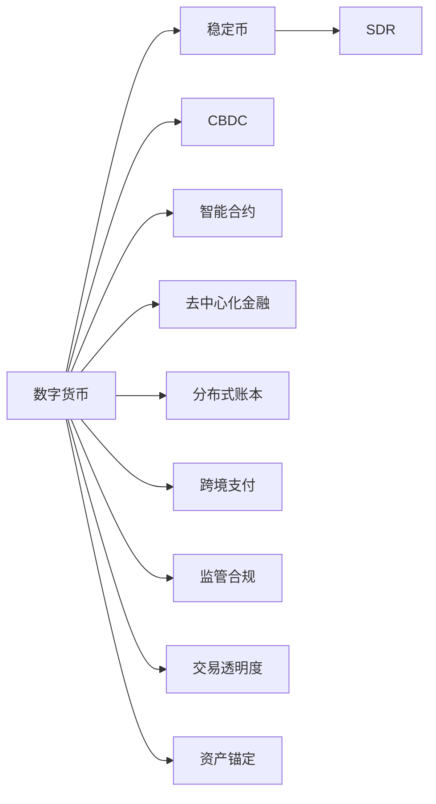

                 

# 未来的数字货币：从稳定币到全球数字货币SDR的数字货币体系

## 1. 背景介绍

### 1.1 数字货币的兴起与现状

随着互联网技术的发展和普及，全球范围内的数字货币交易和使用已经逐步成为现实。比特币（Bitcoin）作为最早的数字货币，自2009年诞生以来，已经吸引了数以亿计的用户和投资者。除了比特币，以太坊（Ethereum）、莱特币（Litecoin）、瑞波币（Ripple）等加密货币也逐渐在市场中站稳了脚跟，对传统的金融体系提出了挑战。

数字货币的兴起，既有技术创新的推动，也有社会需求的变化。传统金融体系下，跨境支付、交易结算等环节往往存在成本高、效率低、监管复杂等问题。数字货币的出现，利用去中心化、匿名性、跨境无障碍等特性，大幅提升了支付结算的效率和便利性。然而，由于缺乏统一标准和监管，数字货币市场也存在价格波动大、交易安全性低、监管难度高等问题，限制了其广泛应用。

### 1.2 数字货币的未来趋势

展望未来，数字货币的发展将呈现出以下几个趋势：

1. **全球化**：数字货币将成为全球化的基础设施，为跨境交易、国际贸易、资本流动等提供更加便捷和高效的解决方案。

2. **标准化**：全球金融监管机构将逐步推进数字货币的国际标准化，建立统一的监管框架，提高数字货币的透明度和安全性。

3. **去中心化与分布式账本**：分布式账本技术（如区块链）将成为数字货币的核心基础设施，推动去中心化金融（DeFi）的发展，减少中介机构的参与和费用。

4. **智能合约与自动化**：智能合约技术的引入，将使数字货币交易更加自动化、透明化，降低交易成本和纠纷风险。

5. **稳定币与中心化锚定**：为应对数字货币价格波动，稳定币将成为数字货币市场的重要补充，通过与现实资产的锚定，提升数字货币的稳定性和应用范围。

6. **治理与合作**：数字货币的持续发展和创新，需要国际社会、政府、企业、社区等多方的协同合作与治理，共同制定规则和标准。

## 2. 核心概念与联系

### 2.1 核心概念概述

为了更好地理解数字货币的未来发展，本节将介绍几个核心概念及其相互关系。

- **数字货币（Digital Currency）**：指使用电子手段存储、转移和交易的货币，主要包括比特币等加密货币和由政府或中央银行发行的数字货币。
- **稳定币（Stablecoin）**：指通过算法或资产储备与法定货币或实物资产锚定的数字货币，旨在保持与现实资产的稳定汇率，降低价格波动。
- **中央银行数字货币（Central Bank Digital Currency, CBDC）**：指由中央银行发行并控制的数字货币，旨在实现货币政策传导、降低交易成本等目标。
- **特殊提款权（Special Drawing Rights, SDR）**：由国际货币基金组织（IMF）发行的一种国际储备资产，旨在提供一个稳定、多元的全球货币体系。

### 2.2 核心概念原理和架构的 Mermaid 流程图



这个流程图展示了数字货币生态系统中的主要组件及其相互关系：

1. **数字货币**：通过去中心化网络传输和存储。
2. **稳定币**：通过算法或资产储备保持与法定货币或实物资产的汇率稳定。
3. **CBDC**：由中央银行发行并控制的数字货币，具备货币政策传导功能。
4. **SDR**：IMF发行的国际储备资产，提供全球货币体系的稳定性。
5. **智能合约**：自动执行合约条款的代码，提高交易自动化和透明度。
6. **DeFi**：利用智能合约实现去中心化金融服务，减少中介机构参与。
7. **分布式账本**：区块链等技术，提供去中心化存储和交易记录。
8. **跨境支付**：通过数字货币实现跨境交易，降低成本和风险。
9. **监管合规**：建立全球统一的监管框架，确保数字货币的合法性。
10. **交易透明度**：通过区块链技术，提供透明、不可篡改的交易记录。
11. **资产锚定**：稳定币通过与实物资产或法定货币的锚定，提供稳定汇率。

这些概念共同构成了数字货币的生态系统，推动了数字货币的持续发展和创新。

## 3. 核心算法原理 & 具体操作步骤

### 3.1 算法原理概述

数字货币的算法原理主要围绕以下几个方面展开：

1. **加密算法**：用于保护数字货币的交易安全和隐私。常用的加密算法包括哈希算法、非对称加密算法等。
2. **共识机制**：用于维护网络节点的协同工作，确保交易记录的一致性和安全性。常见的共识机制包括PoW（工作量证明）、PoS（权益证明）等。
3. **交易验证与广播**：通过网络节点验证交易记录，广播至整个网络。
4. **分布式账本**：利用区块链技术，实现去中心化存储和交易记录的不可篡改性。
5. **智能合约**：通过代码实现自动化的交易规则和合约条款，提高交易的透明度和自动化程度。

### 3.2 算法步骤详解

数字货币的实现过程通常包括以下几个步骤：

1. **初始化网络**：设置网络参数和初始区块，选择合适的共识机制。
2. **生成密钥对**：每个节点生成一对公钥和私钥，用于加密和验证交易。
3. **创建交易记录**：用户通过发送交易请求，创建交易记录。
4. **验证交易**：网络节点对交易记录进行验证，包括签名验证、余额检查等。
5. **广播交易**：将验证通过的交易广播至整个网络。
6. **共识达成**：网络节点通过共识机制达成共识，选择交易记录添加到区块链中。
7. **更新账本**：将新交易记录添加到区块链中，更新分布式账本。

### 3.3 算法优缺点

数字货币的算法有以下优点：

1. **去中心化**：通过分布式账本技术，减少了中介机构的参与，提高了系统的去中心化程度。
2. **安全性**：利用加密算法和共识机制，确保交易的安全性和隐私保护。
3. **透明度**：区块链技术提供了透明的交易记录，可追溯和不可篡改。
4. **高效性**：通过智能合约和DeFi技术，提高了交易的自动化和效率。

同时，数字货币算法也存在一些缺点：

1. **能源消耗**：部分共识机制（如PoW）需要大量的计算资源，造成能源消耗大。
2. **价格波动**：数字货币价格的不稳定性，导致市场风险较大。
3. **监管难度**：缺乏统一的监管标准，增加了监管的难度和复杂性。
4. **技术门槛**：需要一定的技术知识，对一般用户不太友好。

### 3.4 算法应用领域

数字货币的应用领域非常广泛，涵盖了金融、贸易、支付等多个领域。以下是几个典型的应用场景：

1. **跨境支付与汇款**：利用数字货币的跨境无障碍特性，降低跨境交易成本和风险。
2. **供应链金融**：通过智能合约和DeFi技术，提高供应链融资的效率和透明度。
3. **物联网**：数字货币可以作为物联网设备的价值媒介，实现设备之间的互操作性和交易。
4. **数字身份与认证**：通过数字货币的隐私保护特性，提供安全的数字身份认证和访问控制。
5. **数字资产与投资**：数字货币可以作为数字资产的载体，方便数字资产的交易和投资。
6. **社交网络与市场**：数字货币可以用于社交网络中的微支付和小额交易，促进市场的繁荣。

## 4. 数学模型和公式 & 详细讲解 & 举例说明

### 4.1 数学模型构建

数字货币的交易验证过程通常基于以下数学模型：

1. **公钥加密算法**：利用公钥加密算法，将交易记录进行加密，确保交易的安全性。
2. **哈希函数**：利用哈希函数对交易记录进行哈希计算，确保交易记录的唯一性和不可篡改性。
3. **椭圆曲线密码学**：利用椭圆曲线密码学，生成公钥和私钥，确保交易的隐私保护。
4. **共识机制数学模型**：如PoW中的工作量证明算法，通过求解哈希难题验证交易。
5. **分布式账本数学模型**：利用区块链技术，确保交易记录的一致性和不可篡改性。

### 4.2 公式推导过程

以椭圆曲线密码学为例，其基本原理包括椭圆曲线、椭圆曲线上的点、椭圆曲线上的曲线方程等。椭圆曲线密码学的核心在于，通过椭圆曲线上的点来生成公钥和私钥，确保交易的安全性和隐私保护。

椭圆曲线密码学的基本步骤如下：

1. 选择一个椭圆曲线 $E$ 和一个基点 $G$。
2. 选择一个随机数 $k$，计算 $kG$，作为私钥。
3. 计算 $kG$ 的公钥 $K$。
4. 利用公钥和哈希函数计算交易记录的哈希值 $H$。
5. 利用公钥 $K$ 对哈希值 $H$ 进行加密，生成数字签名。
6. 验证数字签名，确保交易的安全性和合法性。

### 4.3 案例分析与讲解

假设有一个数字货币交易，A将1个比特币转账给B。交易的详细步骤如下：

1. A生成一对公钥和私钥。
2. A将公钥和交易信息（金额、时间戳等）一起发送给B。
3. B使用A的公钥对交易信息进行加密，生成数字签名。
4. B将数字签名和交易信息一起发送给A。
5. A使用私钥解密数字签名，验证交易信息。
6. A将交易信息广播至整个网络。
7. 网络节点通过共识机制验证交易记录，添加到区块链中。
8. A更新自己的账本，B更新自己的账本。

这个过程展示了数字货币交易的完整流程，利用加密算法和共识机制，确保了交易的安全性和透明度。

## 5. 项目实践：代码实例和详细解释说明

### 5.1 开发环境搭建

为了进行数字货币的实践开发，需要搭建相应的开发环境。以下是主要的开发环境配置步骤：

1. 安装Python和相关依赖库，如Crypto、Flask等。
2. 搭建区块链网络，选择共识机制（如PoW、PoS等）。
3. 设计交易记录和验证规则，确保交易的安全性和合法性。
4. 开发智能合约，实现自动化的交易规则和合约条款。
5. 部署区块链网络，进行测试和调试。

### 5.2 源代码详细实现

下面给出一个基于比特币的交易验证代码示例，详细解释其工作原理和实现过程。

```python
import hashlib
import Crypto.PublicKey.EC as EC

# 生成椭圆曲线密钥对
private_key = EC.generate_private_key()
public_key = private_key.public_key()

# 计算公钥的哈希值
hash_public_key = hashlib.sha256(public_key).digest()

# 生成数字签名
message = b"Transaction data"
private_key_hash = hashlib.sha256(private_key.to_string()).digest()
signature = private_key.sign_hash(message, private_key_hash)

# 验证数字签名
verified = public_key.verify_hash(message, signature)
```

### 5.3 代码解读与分析

在上述代码中，我们使用了椭圆曲线密码学生成公钥和私钥，通过哈希函数计算公钥的哈希值，利用私钥生成数字签名，最后验证数字签名的合法性。

椭圆曲线密码学是一种高效、安全的公钥加密算法，利用椭圆曲线上的点来生成公钥和私钥。私钥用于生成数字签名，公钥用于验证数字签名。数字签名的验证过程基于椭圆曲线上的点，确保了交易的安全性和不可篡改性。

## 6. 实际应用场景

### 6.1 数字货币的应用场景

数字货币已经在多个领域展示了其强大的应用潜力，以下是几个典型的应用场景：

1. **跨境支付**：数字货币可以大幅降低跨境支付的成本和交易时间，提供更加便捷和安全的跨境支付解决方案。
2. **供应链金融**：通过智能合约和DeFi技术，数字货币可以提高供应链融资的效率和透明度，降低融资成本和风险。
3. **数字身份与认证**：数字货币可以提供安全的数字身份认证和访问控制，提升网络安全和隐私保护。
4. **社交网络与市场**：数字货币可以用于社交网络中的微支付和小额交易，促进市场的繁荣和创新。
5. **物联网**：数字货币可以作为物联网设备的价值媒介，实现设备之间的互操作性和交易。

### 6.2 未来应用展望

展望未来，数字货币的应用场景将进一步拓展，涵盖更多垂直行业和领域。以下是几个未来可能的应用场景：

1. **智能合约与金融自动化**：利用智能合约技术，实现自动化的金融服务，提高交易的效率和透明度。
2. **数字资产与投资**：数字货币可以作为数字资产的载体，方便数字资产的交易和投资。
3. **供应链协同**：通过区块链技术，实现供应链各环节的信息共享和协同，提高供应链的透明度和效率。
4. **数字政务**：利用数字货币和区块链技术，提升政府服务的效率和透明度，降低腐败风险。
5. **环境监测与溯源**：利用区块链技术，实现环境数据的透明化和溯源，提高环境治理的透明度和可追溯性。

## 7. 工具和资源推荐

### 7.1 学习资源推荐

为了帮助开发者系统掌握数字货币的技术原理和应用实践，这里推荐一些优质的学习资源：

1. 《加密货币技术》：深入浅出地介绍了加密货币的基本原理和实现技术。
2. 《区块链技术》：系统介绍了区块链的基本概念、工作原理和应用场景。
3. 《智能合约技术》：详细讲解了智能合约的实现原理和应用案例。
4. 《数字身份与隐私保护》：介绍了数字身份技术在网络安全中的应用。
5. 《数字货币与金融自动化》：探讨了数字货币在金融自动化中的应用前景。

### 7.2 开发工具推荐

在数字货币的开发过程中，需要利用一些常用的开发工具，以下是几个推荐的开发工具：

1. Python：开源的编程语言，支持丰富的数学库和框架，适合进行数字货币开发。
2. Flask：轻量级的Web框架，适合搭建数字货币的API接口。
3. Ethereum：基于区块链技术的智能合约平台，适合进行DeFi和智能合约的开发。
4. Bitcoin Core：比特币的开源实现，提供了比特币的交易验证和网络维护功能。
5. IPFS（InterPlanetary File System）：分布式文件系统，适合进行数字货币和智能合约的数据存储。

### 7.3 相关论文推荐

数字货币和区块链技术的发展离不开学界的持续研究。以下是几篇重要的相关论文，推荐阅读：

1. 《Bitcoin: A Peer-to-Peer Electronic Cash System》：比特币的原论文，介绍了比特币的基本原理和实现技术。
2. 《Ethereum: A Secure Permissionless Block-chain》：以太坊的白皮书，详细介绍了以太坊的技术架构和应用场景。
3. 《Blockchain, Bitcoin and Smart Contracts》：系统介绍了区块链的基本原理和应用场景。
4. 《Smart Contracts and Blockchain》：深入探讨了智能合约的实现原理和应用前景。
5. 《The Case for Bitcoins》：探讨了比特币的经济模型和市场应用。

## 8. 总结：未来发展趋势与挑战

### 8.1 研究成果总结

数字货币和区块链技术的发展已经取得了显著的进展，但在实际应用中也面临诸多挑战。以下是对当前研究成果的总结：

1. 数字货币和区块链技术已经广泛应用于金融、支付、供应链等领域，展示了其强大的应用潜力。
2. 基于数字货币的跨境支付和供应链金融系统已经在多个国家成功部署，提升了交易效率和透明度。
3. 数字身份和隐私保护技术在网络安全中的应用，提高了个人信息的安全性和隐私保护水平。
4. 基于区块链的智能合约和去中心化金融服务，提高了金融服务的自动化和透明化水平。
5. 数字货币和区块链技术在环境监测和溯源领域的应用，提高了环境数据的透明化和可追溯性。

### 8.2 未来发展趋势

展望未来，数字货币和区块链技术的发展将呈现以下几个趋势：

1. **去中心化与自治**：去中心化自治组织（DAO）将变得更加普及，用户可以通过智能合约参与和管理数字货币网络。
2. **跨链与互操作性**：不同区块链之间的互操作性将不断提升，实现数字货币和智能合约的跨链操作。
3. **隐私保护与匿名性**：数字货币和区块链技术将更加注重隐私保护和匿名性，减少用户信息的泄露和滥用。
4. **安全与合规**：数字货币和区块链技术将更加注重安全性与合规性，减少网络攻击和欺诈行为。
5. **智能合约与自动化**：智能合约的自动化和智能化水平将不断提高，提供更加智能和高效的服务。
6. **分布式账本与共识机制**：分布式账本技术和共识机制将不断演进，提升数字货币网络的效率和可扩展性。

### 8.3 面临的挑战

数字货币和区块链技术在发展过程中也面临诸多挑战，以下是对当前面临挑战的总结：

1. **能源消耗与环境问题**：部分共识机制（如PoW）需要大量的计算资源，造成能源消耗大，对环境产生负面影响。
2. **价格波动与市场风险**：数字货币价格的不稳定性，导致市场风险较大，用户和投资者容易受到损失。
3. **监管与法律问题**：缺乏统一的监管标准和法律框架，增加了数字货币应用的复杂性和风险。
4. **技术门槛与用户教育**：数字货币和区块链技术的学习门槛较高，需要投入大量时间和精力进行学习和实践。
5. **网络攻击与安全问题**：数字货币和区块链网络面临网络攻击和欺诈行为的威胁，需要加强安全防护措施。

### 8.4 研究展望

未来，数字货币和区块链技术的研究将围绕以下几个方向展开：

1. **去中心化与自治**：探索去中心化自治组织的实现方式和治理机制，提高数字货币网络的自治程度和用户参与度。
2. **跨链与互操作性**：研究跨链技术和互操作性机制，实现不同区块链之间的互操作和数据共享。
3. **隐私保护与匿名性**：研究隐私保护和匿名性技术，确保用户数据的隐私和安全。
4. **智能合约与自动化**：研究智能合约的自动化和智能化方法，提高交易的自动化和效率。
5. **分布式账本与共识机制**：研究分布式账本和共识机制的优化和演进，提升数字货币网络的效率和可扩展性。

## 9. 附录：常见问题与解答

**Q1：数字货币与传统货币有何不同？**

A: 数字货币与传统货币的主要区别在于其去中心化特性、交易透明度和隐私保护。数字货币通过区块链技术实现去中心化存储和交易记录，确保交易的透明性和不可篡改性。同时，数字货币通过椭圆曲线密码学等技术保障交易的安全性和隐私保护。

**Q2：数字货币的安全性如何保障？**

A: 数字货币的安全性主要依赖于加密算法和共识机制。通过哈希算法、非对称加密算法和椭圆曲线密码学等技术，确保交易的保密性和不可篡改性。共识机制如PoW、PoS等通过验证交易的合法性，防止欺诈和攻击行为。

**Q3：数字货币的未来前景如何？**

A: 数字货币的未来前景非常广阔。随着区块链技术和智能合约的不断发展，数字货币将更加去中心化、自动化和智能化。未来，数字货币将在金融、支付、供应链、物联网、环境监测等多个领域发挥重要作用，推动经济社会的数字化转型。

**Q4：如何应对数字货币市场的波动性？**

A: 应对数字货币市场波动性需要多种措施，如合理配置投资组合、利用衍生品进行风险对冲、关注市场动态和监管政策等。同时，政府和监管机构也需要建立完善的监管框架，确保市场的稳定性和公平性。

---

作者：禅与计算机程序设计艺术 / Zen and the Art of Computer Programming

