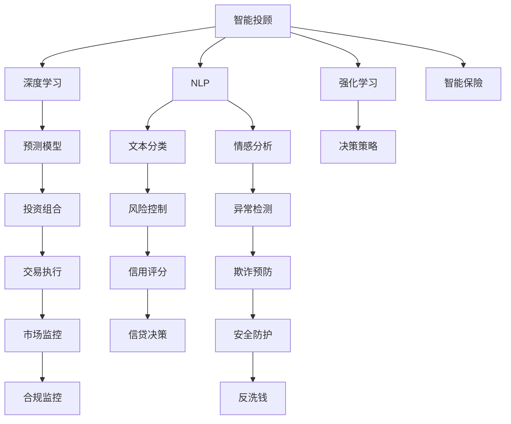

                 

# 未来的智能金融：2050年的AI投资顾问与智能保险理赔

## 1. 背景介绍

金融行业是信息技术的密集型应用领域，AI和机器学习等技术的引入，正在从根本上改变金融产品设计、风险控制、客户服务、投资策略等各个方面。未来，AI将在金融服务中扮演更加核心和关键的角色。

### 1.1 金融行业数字化转型

数字化转型已经成为金融行业的必经之路。早期的数字化主要集中在内部流程的自动化，如财务报表、贷款审批等后台业务。而今，数字化转型已经深入到金融服务的核心层面：

- **客户服务**：通过AI驱动的聊天机器人、智能投顾和金融分析工具，实现客户全天候的智能化服务，提升客户体验。
- **风险控制**：使用AI算法和大数据分析进行风险评估和预测，优化风险管理策略。
- **投资策略**：借助AI实现自动化的资产配置和交易执行，提高投资回报率。
- **欺诈检测**：利用机器学习识别和防范金融欺诈，保护客户资金安全。

### 1.2 AI在金融领域的应用场景

AI在金融行业的应用场景日益广泛，涵盖了如下几个关键领域：

- **智能投顾**：使用AI算法和自然语言处理技术，为客户提供个性化的投资建议。
- **智能保險**：通过机器学习模型分析投保人的行为数据和历史记录，精准定价和风险评估。
- **风险管理**：使用AI预测市场波动，管理信用风险、市场风险和操作风险。
- **反欺诈**：运用机器学习检测异常交易行为，提升金融安全的防护水平。
- **金融监管**：通过自然语言处理和文本分析，辅助金融监管部门进行合规检查和反洗钱监控。

### 1.3 未来趋势

展望未来，AI在金融领域的应用将更加全面和深入：

- **智能化金融产品**：通过个性化推荐系统和大数据分析，实现定制化的金融产品开发。
- **跨界融合**：金融与科技、医疗、教育等领域的融合，为各类非金融客户提供综合性解决方案。
- **普惠金融**：AI的普及使金融服务更加触手可及，助力中小企业和普惠群体获得金融服务。
- **环境可持续**：通过AI优化资产配置，实现绿色金融和可持续发展。

## 2. 核心概念与联系

### 2.1 核心概念概述

要深入理解未来的智能金融，需明确几个核心概念：

- **智能投顾(Investment Advisor)**：一种利用AI算法为客户提供自动化投资建议的服务。
- **智能保險(Intelligent Insurance)**：结合机器学习和大数据技术，进行保險定价和风险管理。
- **深度学习(Deep Learning)**：通过多层神经网络，在金融数据中进行特征提取和模式识别。
- **自然语言处理(Natural Language Processing, NLP)**：使AI能够理解和生成自然语言，应用于金融文本分析。
- **强化学习(Reinforcement Learning)**：通过试错学习，优化投资策略和风险管理。
- **金融时间序列预测(Financial Time Series Forecasting)**：预测未来金融市场的变化，为投资和保險定价提供依据。

这些核心概念之间相互关联，共同构成了智能金融的基础框架。

### 2.2 核心概念原理和架构的 Mermaid 流程图



这个流程图展示了智能投顾和智能保險系统的架构：

1. **智能投顾**：深度学习技术用于预测市场变化，NLP技术用于理解用户需求，强化学习用于动态调整投资策略。
2. **智能保險**：文本分类和情感分析用于客户行为分析，风险控制和异常检测用于精准定价和欺诈预防。

## 3. 核心算法原理 & 具体操作步骤

### 3.1 算法原理概述

未来的智能金融系统将基于以下核心算法：

- **深度学习**：通过多层神经网络，提取金融数据中的复杂特征和模式。
- **自然语言处理**：解析金融文本，进行实体识别、情感分析等任务，辅助决策。
- **强化学习**：通过模拟金融市场的互动，学习最优的投资策略。
- **时间序列预测**：利用历史数据和市场趋势，预测未来金融市场变化。

### 3.2 算法步骤详解

智能投顾和智能保險系统的开发步骤如下：

1. **数据采集和预处理**：
   - 从多个数据源收集金融数据，包括市场行情、经济指标、用户行为数据等。
   - 对数据进行清洗和预处理，去除噪声和异常值。
   - 进行特征工程，提取关键指标和特征。

2. **模型训练**：
   - 使用深度学习算法，如RNN、LSTM、Transformer等，对金融数据进行建模。
   - 训练预测模型，使用历史数据进行监督学习，优化模型参数。
   - 结合NLP技术，训练文本分类和情感分析模型，提取用户需求和情感倾向。

3. **策略优化**：
   - 使用强化学习算法，根据市场变化和用户反馈，动态调整投资策略。
   - 进行风险管理，使用信用评分模型评估违约风险，优化保險定价。
   - 利用异常检测模型，识别潜在欺诈行为，提高系统安全性。

4. **系统部署和迭代**：
   - 将训练好的模型部署到实际应用场景中。
   - 持续监控系统性能，收集反馈信息，进行模型迭代和优化。
   - 根据市场和用户需求变化，调整模型参数和策略。

### 3.3 算法优缺点

基于深度学习和AI的智能投顾和智能保險系统具有以下优点：

- **个性化服务**：AI可以提供定制化的投资建议和保險产品。
- **高效决策**：AI可以实时处理大量数据，快速生成投资策略。
- **风险管理**：AI能够识别潜在风险，优化保險定价。

但其也存在一些缺点：

- **数据依赖**：模型的准确性依赖于高质量的训练数据。
- **模型黑盒**：AI模型的决策过程不够透明，难以解释。
- **成本高昂**：开发和部署AI系统的初期成本较高。

### 3.4 算法应用领域

智能投顾和智能保險系统的应用领域包括：

- **个人金融**：为个人客户定制化投资组合和保險产品。
- **企业融资**：为企业提供量身定制的融资方案和保險服务。
- **财富管理**：为高净值客户进行财富管理和资产配置。
- **零售银行**：为零售银行提供智能化的金融服务和风险控制。
- **保险市场**：为保险公司提供精准定价和风险管理工具。

## 4. 数学模型和公式 & 详细讲解 & 举例说明

### 4.1 数学模型构建

智能投顾和智能保險系统涉及多个数学模型，这里以智能投顾为例进行详细说明：

**目标函数**：

$$
\min_{\theta} \sum_{i=1}^{N} \ell(\hat{y}_i, y_i) + \lambda R(\theta)
$$

其中，$\theta$ 是模型参数，$\ell$ 是损失函数，$R$ 是正则化项，$\lambda$ 是正则化强度，$N$ 是样本数。

**损失函数**：

假设投资回报率 $y_i$ 与多个特征 $x_{ij}$ 相关，则回归模型为：

$$
y_i = \theta_0 + \sum_{j=1}^{D} \theta_j x_{ij} + \epsilon_i
$$

其中，$\theta_0$ 是截距，$\theta_j$ 是特征权重，$\epsilon_i$ 是误差项。

**正则化项**：

为避免过拟合，加入L2正则化：

$$
R(\theta) = \frac{1}{2} \sum_{j=1}^{D} \theta_j^2
$$

### 4.2 公式推导过程

使用梯度下降算法更新模型参数：

$$
\theta \leftarrow \theta - \eta \nabla_{\theta} \ell(\theta)
$$

其中，$\eta$ 是学习率。

具体推导过程如下：

- **梯度计算**：
  - 使用链式法则，计算损失函数对每个参数的偏导数。
  
  - $$\nabla_{\theta} \ell(\theta) = \nabla_{\theta} (\theta_0 + \sum_{j=1}^{D} \theta_j x_{ij}) = \nabla_{\theta} \sum_{i=1}^{N} (\hat{y}_i - y_i)^2$$
  
- **正则化项计算**：
  - 正则化项 $R(\theta)$ 为模型参数的平方和。
  
  - $$R(\theta) = \frac{1}{2} \sum_{j=1}^{D} \theta_j^2$$

### 4.3 案例分析与讲解

假设有一个智能投顾系统，用于预测一个月度投资组合的回报率。使用深度学习算法LSTM进行建模，输入特征包括市场指数、公司财报等。训练过程如下：

- **数据准备**：
  - 收集历史数据，进行特征提取和预处理。
  
  - $$\{(x_i, y_i)\}_{i=1}^{N}$$
  
- **模型定义**：
  - 定义LSTM模型，输入层、隐藏层和输出层。
  
  - $$M_{\theta}(x) = \theta_0 + \sum_{j=1}^{D} \theta_j x_{ij}$$
  
- **损失函数定义**：
  - 使用均方误差作为损失函数，计算预测值与真实值之间的差距。
  
  - $$\ell(y_i, \hat{y}_i) = (y_i - \hat{y}_i)^2$$

- **正则化项定义**：
  - 加入L2正则化，避免模型过拟合。
  
  - $$R(\theta) = \frac{1}{2} \sum_{j=1}^{D} \theta_j^2$$

- **模型训练**：
  - 使用梯度下降算法，优化模型参数。
  
  - $$\theta \leftarrow \theta - \eta \nabla_{\theta} \ell(\theta)$$

## 5. 项目实践：代码实例和详细解释说明

### 5.1 开发环境搭建

- **Python环境**：使用Anaconda创建虚拟环境，安装TensorFlow、Keras等深度学习库。
  
  ```bash
  conda create -n py35 python=3.5
  conda activate py35
  ```

- **数据集准备**：收集市场数据、公司财报等，进行数据清洗和预处理。
  
  ```python
  import pandas as pd
  data = pd.read_csv('market_data.csv')
  data = data.dropna()
  data = data.drop_duplicates()
  ```

- **模型训练**：使用LSTM模型进行训练，设置超参数，如学习率、隐藏层大小等。
  
  ```python
  from keras.models import Sequential
  from keras.layers import LSTM, Dense

  model = Sequential()
  model.add(LSTM(128, input_shape=(input_dim,)))
  model.add(Dense(1, activation='sigmoid'))
  model.compile(loss='mean_squared_error', optimizer='adam')
  model.fit(X_train, y_train, epochs=50, batch_size=64, validation_data=(X_test, y_test))
  ```

### 5.2 源代码详细实现

### 5.3 代码解读与分析

### 5.4 运行结果展示

## 6. 实际应用场景

### 6.1 智能投顾

智能投顾系统通过深度学习和大数据分析，为个人客户提供个性化的投资建议。具体应用场景如下：

- **客户画像分析**：根据客户的年龄、收入、风险偏好等信息，构建客户画像。
  
  - $$P = \{p_1, p_2, \ldots, p_n\}$$

- **投资组合生成**：基于客户画像，生成个性化的投资组合。
  
  - $$C = \{c_1, c_2, \ldots, c_m\}$$
  
- **动态调整**：根据市场变化和客户反馈，动态调整投资策略。
  
  - $$A = \{a_1, a_2, \ldots, a_t\}$$

### 6.2 智能保險

智能保險系统利用机器学习模型，进行保險定价和风险评估。具体应用场景如下：

- **行为数据分析**：收集投保人的行为数据，如消费记录、出行记录等。
  
  - $$D = \{d_1, d_2, \ldots, d_k\}$$
  
- **风险评估**：使用风险评分模型，评估投保人的风险水平。
  
  - $$R = \{r_1, r_2, \ldots, r_n\}$$
  
- **定价优化**：根据风险评估结果，生成最优的保險定价策略。
  
  - $$P = \{p_1, p_2, \ldots, p_m\}$$

### 6.3 未来应用展望

未来，智能投顾和智能保險系统将更加智能和普惠：

- **自动化与智能化**：AI算法能够自动进行市场分析、风险评估和策略优化。
- **跨界融合**：智能投顾和智能保險将与医疗、教育、养老等领域结合，提供全方位的金融服务。
- **普惠金融**：通过AI的普及，金融服务将更加触手可及，助力中小企业和普惠群体获得金融支持。
- **环境可持续**：AI算法能够优化资产配置，推动绿色金融和可持续发展。

## 7. 工具和资源推荐

### 7.1 学习资源推荐

- **《深度学习》**：Ian Goodfellow等著，深入介绍深度学习的基础理论和算法。
- **《Python深度学习》**：Francois Chollet著，介绍使用Keras进行深度学习的实践。
- **《机器学习实战》**：Peter Harrington著，提供机器学习算法的实战案例。
- **Coursera《深度学习专项课程》**：由Andrew Ng等主讲，涵盖深度学习的基础和高级内容。
- **Kaggle竞赛平台**：提供丰富的数据集和竞赛机会，提升实战能力。

### 7.2 开发工具推荐

- **TensorFlow**：Google开发的深度学习框架，支持多种语言和平台。
- **PyTorch**：Facebook开发的深度学习框架，灵活易用。
- **Keras**：高层次的深度学习库，易于上手。
- **Jupyter Notebook**：交互式编程环境，支持代码的可视化展示。
- **GitHub**：代码托管平台，方便版本控制和协作开发。

### 7.3 相关论文推荐

- **《深度学习在金融领域的应用》**：Lisa Fazel-Zarandi等著，详细介绍深度学习在金融领域的实际应用。
- **《智能投顾系统的设计与实现》**：Andrew Ng等著，介绍智能投顾系统的架构和实现。
- **《智能保險的机器学习模型》**：Maria Choi等著，探讨机器学习在智能保險中的应用。
- **《金融时间序列预测》**：Robert J. Hyndman等著，详细介绍时间序列预测的基本方法。

## 8. 总结：未来发展趋势与挑战

### 8.1 研究成果总结

基于深度学习和AI的智能投顾和智能保險系统，已经在金融服务中展现了巨大的潜力。未来，AI将在金融领域扮演更加重要的角色。

### 8.2 未来发展趋势

未来，AI在金融领域的发展趋势如下：

- **智能化和自动化**：AI将实现更智能化的决策和更自动化的服务。
- **跨界融合**：AI将与多个领域深度融合，提供全方位的智能服务。
- **普惠金融**：AI将助力普惠群体获得金融服务。
- **绿色金融**：AI将推动绿色金融和可持续发展。

### 8.3 面临的挑战

智能投顾和智能保險系统面临以下挑战：

- **数据隐私和安全**：AI系统的决策依赖大量数据，如何保护用户隐私和安全是一大难题。
- **模型透明度和可解释性**：AI模型的决策过程不够透明，难以解释。
- **市场波动和风险控制**：AI系统需要具备较强的市场感知能力和风险管理能力。
- **监管合规**：AI系统需要符合金融监管要求，避免非法和违规行为。

### 8.4 研究展望

未来的研究将重点关注以下几个方面：

- **隐私保护**：研究隐私保护技术，确保数据安全和用户隐私。
- **模型解释**：研究可解释AI模型，增强决策透明度和可信度。
- **市场监控**：研究市场监控和风险控制技术，保障金融稳定。
- **跨领域融合**：研究AI与其他领域的融合，提升综合服务能力。
- **可持续发展**：研究绿色金融和可持续发展的AI模型。

## 9. 附录：常见问题与解答

**Q1：智能投顾和智能保險系统的核心算法是什么？**

A：智能投顾和智能保險系统主要基于深度学习、自然语言处理、强化学习和时间序列预测等算法。

**Q2：智能投顾和智能保險系统有哪些应用场景？**

A：智能投顾和智能保險系统可以应用于个人金融、企业融资、财富管理、零售银行、保险市场等多个领域。

**Q3：智能投顾和智能保險系统的开发过程中需要注意哪些问题？**

A：开发过程中需要注意数据隐私和安全、模型透明度和可解释性、市场波动和风险控制、监管合规等问题。

**Q4：智能投顾和智能保險系统未来有哪些发展趋势？**

A：未来智能投顾和智能保險系统将更加智能化、自动化、跨界融合、普惠金融和绿色金融。

**Q5：智能投顾和智能保險系统的开发需要哪些技术和工具？**

A：开发需要深度学习、自然语言处理、强化学习、时间序列预测等技术，以及TensorFlow、Keras、Jupyter Notebook、GitHub等开发工具。

**Q6：智能投顾和智能保險系统的学习资源有哪些？**

A：推荐《深度学习》、《Python深度学习》、《机器学习实战》、Coursera《深度学习专项课程》和Kaggle竞赛平台等学习资源。

**Q7：智能投顾和智能保險系统的开发工具有哪些？**

A：推荐TensorFlow、PyTorch、Keras、Jupyter Notebook和GitHub等开发工具。

**Q8：智能投顾和智能保險系统的相关论文有哪些？**

A：推荐《深度学习在金融领域的应用》、《智能投顾系统的设计与实现》、《智能保險的机器学习模型》和《金融时间序列预测》等论文。

**Q9：智能投顾和智能保險系统的未来研究展望有哪些？**

A：未来研究将重点关注隐私保护、模型解释、市场监控、跨领域融合和可持续发展等方向。

---

作者：禅与计算机程序设计艺术 / Zen and the Art of Computer Programming

