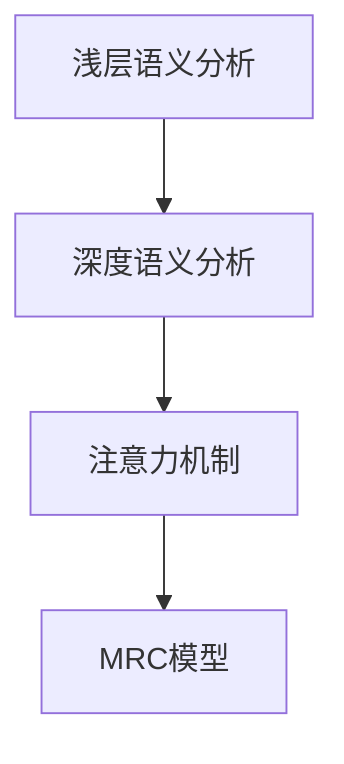

                 

# 机器阅读理解：从浅层到深层语义分析

## 1. 背景介绍

### 1.1 问题由来
在过去的十年中，自然语言处理（NLP）领域取得了显著的进展，尤其是在机器阅读理解（Machine Reading Comprehension, MRC）任务上。从浅层语义匹配到深层语义推理，MRC模型的能力在不断提升。这些模型在各种问答、文本摘要、机器翻译等任务中展示了卓越的性能，极大地推动了NLP技术的发展。然而，尽管有了这些进步，MRC模型的性能仍受到一些限制，特别是在理解复杂文本和多模态数据方面。本文将深入探讨机器阅读理解及其发展趋势，从浅层到深层语义分析，探讨这一领域未来的可能性和挑战。

### 1.2 问题核心关键点
机器阅读理解的核心在于模型如何理解和处理自然语言文本，从而能够回答有关文本的问题。当前，基于深度学习的阅读理解模型主要包括浅层模型和深度模型两种。浅层模型如规则匹配、词向量和最大熵分类器等，通常用于理解文本的浅层语义关系。而深度模型如基于卷积神经网络（CNN）和递归神经网络（RNN）的模型，能够学习更深层的语义关系，并利用注意力机制来处理长文本。

本文将从浅层到深层语义分析，探讨这些模型如何工作，并讨论它们在实际应用中的表现和未来发展方向。

## 2. 核心概念与联系

### 2.1 核心概念概述
在深入探讨阅读理解之前，我们先明确一些关键概念：

- **机器阅读理解（MRC）**：是指让计算机能够理解自然语言文本并回答有关文本的问题。这是NLP领域中的一个重要任务，涉及到语义理解、逻辑推理和知识表示等多方面的能力。
- **浅层语义分析**：基于词向量或短句向量的匹配和分类，通常用于理解文本的表层语义关系。
- **深层语义分析**：使用深度学习模型（如Transformer）学习更复杂的语义关系，并进行长文本理解、语义推理和知识表示。
- **注意力机制（Attention Mechanism）**：在深度模型中用于突出文本中重要的部分，并捕捉不同部分的语义关系。

这些概念之间的关系可以通过以下Mermaid流程图来展示：



这个流程图展示了从浅层语义分析到深度语义分析的过程，并最终应用于阅读理解任务中。

## 3. 核心算法原理 & 具体操作步骤
### 3.1 算法原理概述
基于深度学习的阅读理解模型通常采用Transformer架构，包括编码器和解码器。编码器将输入文本序列转换为一系列向量表示，而解码器将这些向量与问题向量进行交互，产生最终的预测结果。这种架构使得模型能够捕捉长文本中的复杂语义关系，并进行逻辑推理。

### 3.2 算法步骤详解
阅读理解模型的训练通常包括以下步骤：

1. **数据准备**：收集并标注包含问答对的数据集，如SQuAD、CoQA等。
2. **模型选择**：选择预训练的Transformer模型，如BERT、RoBERTa等。
3. **微调训练**：在标注数据上微调预训练模型，通常使用二分类交叉熵或序列到序列损失函数。
4. **验证评估**：在验证集上评估模型性能，如准确率、F1分数等。
5. **模型部署**：将微调后的模型应用于实际问题中，如问答系统、文本摘要、文本生成等。

### 3.3 算法优缺点
深度阅读理解模型具有以下优点：

- **强大表现**：在各种阅读理解任务中取得了最先进的性能。
- **灵活应用**：可以用于多种NLP任务，如文本摘要、文本生成、问答等。
- **可解释性**：通过注意力机制，可以分析模型的推理过程。

然而，这些模型也存在一些缺点：

- **数据依赖**：需要大量的标注数据进行微调，标注成本较高。
- **计算资源需求高**：需要高性能计算设备，如GPU或TPU。
- **模型复杂**：模型结构复杂，训练和推理速度较慢。

### 3.4 算法应用领域
深度阅读理解模型已经在多个领域得到了广泛应用，包括：

- **问答系统**：如Siri、Alexa等语音助手。
- **文本摘要**：自动生成新闻摘要、科技文章摘要等。
- **文本生成**：如机器翻译、对话系统等。
- **知识图谱**：利用阅读理解模型抽取和融合知识图谱中的信息，进行知识推理。

## 4. 数学模型和公式 & 详细讲解 & 举例说明

### 4.1 数学模型构建
阅读理解模型的数学模型通常由两个部分组成：编码器和解码器。编码器将输入文本序列转换为一系列向量表示，解码器将这些向量与问题向量进行交互，产生最终的预测结果。以下是一个典型的Transformer阅读理解模型的架构图：

```
Encoder -- Attention Mechanism -- Decoder -- Attention Mechanism -- Output
```

### 4.2 公式推导过程
假设我们有一个包含$N$个词的文本序列$X=\{x_1,x_2,\cdots,x_N\}$，其中$x_i$表示第$i$个词。假设我们的问题是一个二分类问题，即判断该文本是否包含特定信息。假设问题向量为$Q$。我们使用一个Transformer模型来处理这个问题。

首先，我们需要将文本序列$X$和问题向量$Q$转换为向量表示。这可以通过以下公式实现：

$$
\text{Encoder}(X) = \text{Embedding}(X) * \text{Positional Encoding}(X) * \text{Encoder Layer}^N
$$

其中，$\text{Embedding}$表示词嵌入，$\text{Positional Encoding}$表示位置编码，$\text{Encoder Layer}$表示编码器层。

接下来，我们将问题向量$Q$与编码器输出进行交互，并使用注意力机制来捕捉文本中重要的部分。注意力机制的计算公式如下：

$$
\text{Attention}(Q, \text{Encoder Output}) = \text{Softmax}(Q * \text{Attention Query} + \text{Encoder Output} * \text{Attention Key}) * \text{Encoder Output} * \text{Attention Value}
$$

最后，我们将注意力机制的输出与问题向量$Q$进行拼接，并经过全连接层和softmax函数，得到最终的概率分布：

$$
\text{Output} = \text{softmax}(W * (\text{Attention Output} + Q))
$$

### 4.3 案例分析与讲解
我们可以以BERT模型为例，详细解释其工作原理。BERT模型是一种基于Transformer的预训练语言模型，被广泛应用于各种NLP任务。它的训练过程包括两个阶段：自监督预训练和微调训练。在自监督预训练阶段，BERT模型通过掩码语言模型（Masked Language Modeling, MLM）和下一句预测（Next Sentence Prediction, NSP）任务进行训练。在微调训练阶段，我们可以将微调后的BERT模型用于各种NLP任务，如问答、文本分类等。

## 5. 项目实践：代码实例和详细解释说明
### 5.1 开发环境搭建

要使用BERT模型进行阅读理解任务的微调，我们需要以下Python环境和库：

1. **Python 3.7+**：用于编写代码。
2. **TensorFlow 2.x**：深度学习框架。
3. **BERT Tokenizer**：用于分词和编码。
4. **TensorBoard**：可视化工具。

在开始之前，我们需要安装这些库：

```bash
pip install tensorflow tensorflow-text tensorflow-hub bert-base-uncased
```

### 5.2 源代码详细实现
以下是一个简单的代码示例，展示了如何使用TensorFlow和BERT进行阅读理解任务的微调。

首先，我们需要定义BERT的Tokenizer和模型：

```python
import tensorflow as tf
from tensorflow_text.contrib import bert

tokenizer = bert.BertTokenizer.from_pretrained('bert-base-uncased')
model = bert.BertModel.from_pretrained('bert-base-uncased')
```

然后，我们需要定义数据集和标签：

```python
texts = ["This is a sample text.", "Another sample text."]
labels = [0, 1]  # 0表示文本不包含特定信息，1表示文本包含特定信息
```

接下来，我们需要将文本和标签转换为模型所需的格式：

```python
inputs = tokenizer.batch_encode_plus(texts, max_length=128, truncation=True, padding='max_length', return_tensors='tf')
labels = tf.convert_to_tensor(labels)
```

然后，我们可以定义模型并开始训练：

```python
optimizer = tf.keras.optimizers.Adam()
loss = tf.keras.losses.BinaryCrossentropy()
```

在训练过程中，我们需要计算损失并更新模型参数：

```python
with tf.GradientTape() as tape:
    logits = model(inputs['input_ids'], attention_mask=inputs['attention_mask'])
    loss_value = loss(logits, labels)

gradients = tape.gradient(loss_value, model.trainable_variables)
optimizer.apply_gradients(zip(gradients, model.trainable_variables))
```

最后，我们可以在TensorBoard上可视化训练过程：

```python
summary_writer = tf.summary.create_file_writer('logs')

@tf.function
def train_step(inputs, labels):
    with summary_writer.as_default():
        with tf.GradientTape() as tape:
            logits = model(inputs['input_ids'], attention_mask=inputs['attention_mask'])
            loss_value = loss(logits, labels)

        gradients = tape.gradient(loss_value, model.trainable_variables)
        optimizer.apply_gradients(zip(gradients, model.trainable_variables))

        train_loss, train_acc = loss_value, logits > 0.5
        train_loss = tf.reduce_mean(train_loss)
        train_acc = tf.reduce_mean(tf.cast(train_acc, tf.float32))

        tf.summary.scalar('train_loss', train_loss.numpy(), step=step)
        tf.summary.scalar('train_acc', train_acc.numpy(), step=step)

    return train_loss, train_acc

for epoch in range(10):
    for step, (inputs, labels) in enumerate(train_dataset):
        train_loss, train_acc = train_step(inputs, labels)
        
        if step % 100 == 0:
            print('Epoch {}, Step {}, Loss: {}, Accuracy: {}'.format(epoch, step, train_loss.numpy(), train_acc.numpy()))
```

### 5.3 代码解读与分析
这个简单的代码示例展示了使用TensorFlow和BERT进行阅读理解任务的基本流程。我们首先定义了BERT的Tokenizer和模型，然后准备数据集和标签，并使用TensorFlow的Graph函数和GradientTape进行模型的训练。在每个epoch中，我们定义了一个train_step函数，用于计算损失并更新模型参数。最后，我们在TensorBoard上可视化训练过程。

## 6. 实际应用场景
### 6.1 问答系统

问答系统是机器阅读理解的一个重要应用场景。在问答系统中，用户提出问题，系统通过阅读理解模型从大量文本中抽取信息并生成答案。问答系统被广泛应用于智能客服、智能助理、搜索引擎等领域。

### 6.2 文本摘要

文本摘要是指从长文本中自动生成简洁的摘要。阅读理解模型可以用于理解文本的语义，并从中提取关键信息。这对于新闻、科技文章、法律文件等长文本的自动化摘要具有重要意义。

### 6.3 文本生成

文本生成是指使用机器学习模型生成新的文本。阅读理解模型可以通过学习文本的语义关系，生成符合语法和语义规则的新文本。这在对话系统、自动写作、文本翻译等领域有广泛应用。

## 7. 工具和资源推荐
### 7.1 学习资源推荐

为了帮助开发者系统掌握阅读理解技术，这里推荐一些优质的学习资源：

1. **《深度学习》第二版**：Ian Goodfellow等人著，全面介绍了深度学习的理论和实践。
2. **《自然语言处理综论》**：Denny Britz等人著，详细讲解了NLP领域的各种模型和技术。
3. **《Transformers: State-of-the-Art Natural Language Processing》**：Tomas Mikolov等人著，介绍了Transformer模型的原理和应用。
4. **Hugging Face官方文档**：提供了丰富的预训练模型和代码示例，是初学者快速上手的必备资源。
5. **Coursera的《Deep Learning Specialization》**：由Andrew Ng等人开设的深度学习课程，涵盖了深度学习的各个方面。

### 7.2 开发工具推荐

高效的工具支持是开发高效阅读理解模型的关键。以下是几款常用的开发工具：

1. **TensorFlow**：一个广泛使用的深度学习框架，支持TensorBoard可视化。
2. **PyTorch**：另一个流行的深度学习框架，支持动态计算图。
3. **BERT Tokenizer**：用于分词和编码的工具，支持多种预训练模型。
4. **TensorBoard**：可视化工具，可以实时监控模型训练过程。
5. **Kaggle**：数据科学竞赛平台，提供大量标注数据集和竞赛任务。

### 7.3 相关论文推荐

阅读理解技术的快速发展离不开学界的持续研究。以下是几篇重要的相关论文，推荐阅读：

1. **Attention is All You Need**：提出Transformer模型，开启NLP领域的预训练大模型时代。
2. **BERT: Pre-training of Deep Bidirectional Transformers for Language Understanding**：提出BERT模型，引入掩码语言模型和下一句预测任务。
3. **Dense Passage Retrieval for Reading Comprehension**：提出密集段落检索方法，用于问答系统。
4. **Knowledge-aware Text Generation with Neural Attention**：提出知识图谱辅助的文本生成方法。

## 8. 总结：未来发展趋势与挑战
### 8.1 总结

本文对机器阅读理解技术进行了全面系统的介绍，从浅层语义匹配到深层语义分析，探讨了阅读理解模型的原理和应用。通过详细讲解深度模型的工作原理和实现步骤，展示了其在问答、摘要、生成等任务中的强大表现。同时，我们介绍了阅读理解模型的优缺点，并讨论了其在实际应用中的前景和挑战。

### 8.2 未来发展趋势

展望未来，阅读理解技术将呈现以下几个发展趋势：

1. **多模态阅读理解**：阅读理解模型将能够处理图像、视频等多模态数据，进行更全面的语义理解。
2. **可解释性增强**：研究可解释的阅读理解模型，使得用户能够理解模型的推理过程。
3. **知识图谱融合**：将知识图谱与阅读理解模型结合，增强模型的知识表示和推理能力。
4. **高效训练和推理**：研究更高效的训练和推理方法，降低计算成本，提高系统性能。
5. **跨领域应用扩展**：阅读理解模型将广泛应用于更多领域，如医疗、法律、金融等。

### 8.3 面临的挑战

尽管阅读理解技术取得了显著进展，但在向实际应用推广的过程中，仍面临一些挑战：

1. **数据依赖**：大规模标注数据的获取成本较高，难以覆盖所有应用场景。
2. **模型复杂性**：深度模型结构复杂，训练和推理速度较慢，计算资源需求高。
3. **可解释性不足**：模型输出的可解释性不足，难以理解推理过程，影响应用可靠性。
4. **知识表示能力有限**：模型无法灵活运用外部知识库，难以处理复杂问题。
5. **数据安全和隐私**：在处理敏感数据时，需要考虑数据安全和隐私保护问题。

### 8.4 研究展望

未来研究需要在以下几个方面寻求新的突破：

1. **跨模态阅读理解**：研究如何更好地处理多模态数据，提高模型的语义理解能力。
2. **知识图谱融合**：将知识图谱与阅读理解模型结合，增强模型的知识表示和推理能力。
3. **可解释性增强**：研究可解释的阅读理解模型，使得用户能够理解模型的推理过程。
4. **高效训练和推理**：研究更高效的训练和推理方法，降低计算成本，提高系统性能。
5. **跨领域应用扩展**：阅读理解模型将广泛应用于更多领域，如医疗、法律、金融等。

这些研究方向将推动阅读理解技术的进一步发展和应用，为构建智能交互系统和解决复杂问题提供新的思路和方法。

## 9. 附录：常见问题与解答

**Q1：阅读理解模型是否适用于所有NLP任务？**

A: 阅读理解模型主要适用于需要理解文本语义的任务，如问答、文本摘要、文本生成等。对于一些简单的任务，如词性标注、分词等，浅层模型如词向量和最大熵分类器可能更适合。

**Q2：如何优化阅读理解模型的训练过程？**

A: 优化训练过程的方法包括：
1. 数据增强：通过回译、近义替换等方式扩充训练集。
2. 正则化：使用L2正则、Dropout、Early Stopping等避免过拟合。
3. 对抗训练：引入对抗样本，提高模型鲁棒性。
4. 参数高效微调：只调整少量参数，减小过拟合风险。
5. 模型裁剪：去除不必要的层和参数，减小模型尺寸，加快推理速度。

**Q3：阅读理解模型在实际应用中面临哪些问题？**

A: 阅读理解模型在实际应用中面临的问题包括：
1. 数据依赖：需要大量的标注数据进行微调，标注成本较高。
2. 模型复杂性：深度模型结构复杂，训练和推理速度较慢，计算资源需求高。
3. 可解释性不足：模型输出的可解释性不足，难以理解推理过程，影响应用可靠性。
4. 知识表示能力有限：模型无法灵活运用外部知识库，难以处理复杂问题。
5. 数据安全和隐私：在处理敏感数据时，需要考虑数据安全和隐私保护问题。

**Q4：如何缓解阅读理解模型中的过拟合问题？**

A: 缓解过拟合问题的方法包括：
1. 数据增强：通过回译、近义替换等方式扩充训练集。
2. 正则化：使用L2正则、Dropout、Early Stopping等避免过拟合。
3. 对抗训练：引入对抗样本，提高模型鲁棒性。
4. 参数高效微调：只调整少量参数，减小过拟合风险。
5. 模型裁剪：去除不必要的层和参数，减小模型尺寸，加快推理速度。

这些方法可以结合使用，根据具体任务和数据特点灵活调整。只有在数据、模型、训练、推理等各环节进行全面优化，才能最大限度地发挥阅读理解模型的性能。

---

作者：禅与计算机程序设计艺术 / Zen and the Art of Computer Programming

