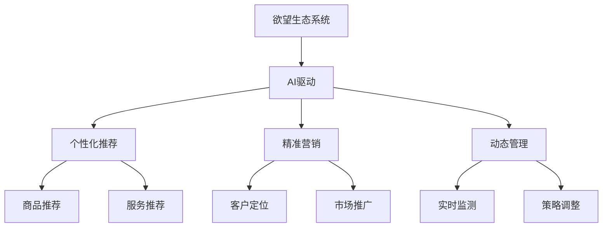

                 

# 欲望生态系统管理员：AI驱动的可持续消费指导

## 1. 背景介绍

随着全球人口的不断增长和消费水平的持续提升，资源匮乏与环境污染问题日益凸显。如何构建一个可持续发展的消费生态系统，实现人类与自然和谐共生，成为了亟待解决的关键问题。在这一过程中，人工智能技术的引入提供了新的解决方案。AI驱动的可持续消费指导，可以通过对人类欲望和行为的深度分析，实现个性化推荐、精准营销和动态管理，引导人们向更加绿色、环保、健康的消费方式转变。

## 2. 核心概念与联系

### 2.1 核心概念概述

- **可持续消费**：一种旨在减少资源消耗、环境污染和生态破坏，同时提高生活质量的消费模式。
- **欲望生态系统**：将消费者欲望与商品、服务、信息等构建的生态系统。通过AI技术对欲望进行分析，实现系统内的动态平衡和优化。
- **AI驱动**：利用人工智能技术，如机器学习、自然语言处理、计算机视觉等，进行消费者行为预测、商品推荐、情感分析等，实现可持续消费指导。
- **个性化推荐**：根据消费者历史行为和偏好，智能推荐符合其需求的商品和服务，提升用户体验和满意度。
- **精准营销**：通过数据分析和模型预测，精准定位目标客户群体，实现高效的市场推广和品牌建设。
- **动态管理**：利用AI技术对消费数据进行实时监测和分析，根据市场变化和消费者需求动态调整策略，实现系统优化。

### 2.2 核心概念原理和架构的 Mermaid 流程图



## 3. 核心算法原理 & 具体操作步骤

### 3.1 算法原理概述

基于AI的可持续消费指导，核心算法原理是通过构建一个欲望生态系统，利用数据驱动的AI模型，对消费者欲望进行深入分析，并实时动态地指导消费行为。这一过程包括欲望建模、行为预测、推荐生成、效果评估和策略优化等多个环节。

### 3.2 算法步骤详解

**Step 1: 数据收集与预处理**
- 收集消费者的历史购买记录、浏览行为、社交媒体互动、反馈评论等多样化数据。
- 对数据进行清洗、去重、标准化等预处理，确保数据的准确性和一致性。

**Step 2: 欲望建模**
- 利用自然语言处理技术，从文本数据中提取出消费者的欲望表达，如偏好、需求、期望等。
- 通过聚类、分类等机器学习算法，对欲望进行建模，形成欲望特征向量。

**Step 3: 行为预测**
- 使用时间序列分析、回归模型等技术，预测消费者的未来行为和需求。
- 结合长期和短期欲望特征，生成动态的行为预测模型。

**Step 4: 推荐生成**
- 根据行为预测结果，利用协同过滤、内容推荐、混合推荐等技术，生成个性化推荐结果。
- 结合商品属性、用户评价、市场动态等因素，生成动态推荐的商品和服务。

**Step 5: 效果评估**
- 通过A/B测试、用户满意度调查等方法，评估推荐效果和用户反馈。
- 根据评估结果，不断优化推荐算法和策略。

**Step 6: 策略优化**
- 根据市场变化和用户需求，实时调整推荐策略和营销方案。
- 通过数据分析和模型预测，实现动态管理，优化生态系统。

### 3.3 算法优缺点

**优点：**
- 数据驱动，准确度高：AI算法能够处理海量数据，实时动态更新欲望和行为模型，提供精准的推荐和营销策略。
- 用户个性化，提升体验：通过个性化推荐，满足用户多样化需求，提升用户体验和满意度。
- 实时动态，市场适应能力强：能够根据市场变化和用户需求，动态调整策略，提升系统灵活性和适应性。

**缺点：**
- 数据隐私和安全问题：在数据收集和处理过程中，如何保障用户隐私和数据安全，是必须解决的重要问题。
- 模型复杂，计算资源需求高：AI驱动的生态系统需要高计算资源，特别是在大规模数据和复杂模型的应用上，资源消耗较大。
- 算法透明度和可解释性：AI模型的复杂性可能导致其决策过程缺乏透明度和可解释性，影响用户信任和接受度。

### 3.4 算法应用领域

基于AI的可持续消费指导，已经在多个领域得到应用，并展现出良好的前景：

- **电子商务**：通过个性化推荐和精准营销，提升在线购物体验和转化率。
- **旅游服务**：根据用户兴趣和行为，推荐旅游目的地和行程安排，提高旅行质量和满意度。
- **健康管理**：结合用户健康数据和消费行为，推荐健康产品和服务，促进健康生活方式。
- **环保推广**：通过行为预测和推荐，引导用户选择环保商品，减少资源消耗和环境污染。
- **金融服务**：根据用户消费习惯和金融需求，推荐理财产品和投资策略，实现财富增值。

## 4. 数学模型和公式 & 详细讲解 & 举例说明

### 4.1 数学模型构建

假设欲望生态系统中有 $N$ 个用户，每个用户有 $M$ 种欲望特征 $f_1, f_2, ..., f_M$。设用户的当前欲望强度为 $v_{t,i} \in [0, 1]$，表示用户在时间 $t$ 对第 $i$ 种欲望的强度。根据历史行为数据，构建欲望强度矩阵 $V_t \in \mathbb{R}^{N \times M}$，表示每个用户在时间 $t$ 的欲望强度。

### 4.2 公式推导过程

**欲望强度更新公式：**
$$
v_{t+1,i} = f(v_{t,i}, V_t, \alpha)
$$
其中 $f$ 为欲望强度更新函数，$V_t$ 为欲望特征矩阵，$\alpha$ 为欲望强度衰减系数。

**行为预测模型：**
$$
p_t = \hat{P}(v_{t-1}, \theta)
$$
其中 $\hat{P}$ 为行为预测模型，$\theta$ 为模型参数。

**推荐生成模型：**
$$
r_t = G(p_t, \phi)
$$
其中 $G$ 为推荐生成模型，$\phi$ 为推荐模型参数。

**效果评估指标：**
$$
E = \frac{1}{N} \sum_{i=1}^N \left[ \frac{r_{t,i}}{p_{t,i}} - 1 \right]^2
$$
其中 $E$ 为推荐效果评估指标，$r_{t,i}$ 为用户对推荐商品的评价，$p_{t,i}$ 为用户行为预测值。

**策略优化模型：**
$$
\pi^* = \mathop{\arg\min}_{\pi} \mathcal{L}(\pi, V_t, p_t, r_t)
$$
其中 $\mathcal{L}$ 为优化损失函数，$\pi$ 为推荐策略。

### 4.3 案例分析与讲解

**案例1：智能推荐系统**
- **数据收集**：收集用户历史购买记录、浏览行为、评分数据等。
- **欲望建模**：利用聚类算法，将用户分为不同的欲望群体，如“时尚”、“实用”、“高端”等。
- **行为预测**：使用时间序列分析，预测用户未来的购买行为。
- **推荐生成**：根据行为预测结果，生成个性化推荐商品，如“最近购买了XX的用户还购买了XX”。
- **效果评估**：通过A/B测试，评估推荐效果，调整推荐策略。

**案例2：环保推广平台**
- **数据收集**：收集用户能源消耗数据、垃圾分类行为、环保行为数据等。
- **欲望建模**：利用机器学习算法，识别用户对环保行为的欲望强度。
- **行为预测**：使用回归模型，预测用户未来的环保行为。
- **推荐生成**：推荐环保产品和服务，如“节能电器”、“绿色出行工具”等。
- **效果评估**：通过用户反馈和行为数据，评估环保推广效果，优化推广策略。

## 5. 项目实践：代码实例和详细解释说明

### 5.1 开发环境搭建

**Python环境**：
- 安装Anaconda：从官网下载并安装Anaconda，用于创建独立的Python环境。
- 创建并激活虚拟环境：
```bash
conda create -n sustainable-consumption python=3.8
conda activate sustainable-consumption
```

**依赖库安装**：
```bash
pip install pandas numpy scikit-learn transformers torch
```

### 5.2 源代码详细实现

**数据预处理**：
```python
import pandas as pd
import numpy as np

# 读取数据
data = pd.read_csv('user_data.csv')

# 数据清洗
data = data.drop_duplicates()
data = data.dropna()

# 标准化数据
data['features'] = (data['features'] - np.mean(data['features'])) / np.std(data['features'])
```

**欲望建模**：
```python
from sklearn.cluster import KMeans

# 聚类欲望特征
kmeans = KMeans(n_clusters=3)
kmeans.fit(data[['feature1', 'feature2']])
desires = kmeans.labels_

# 欲望强度更新
desire_strengths = np.zeros((len(data), 3))
for i in range(len(desires)):
    for j in range(3):
        desire_strengths[i][j] = desires[i] == j
```

**行为预测**：
```python
from sklearn.linear_model import LinearRegression

# 行为预测
X = data[['feature1', 'feature2', 'desire_strengths']]
y = data['behavior']
model = LinearRegression()
model.fit(X, y)
y_pred = model.predict(X)
```

**推荐生成**：
```python
from scipy.sparse import csr_matrix
import networkx as nx

# 推荐生成
G = nx.Graph()
for i in range(len(y_pred)):
    for j in range(len(y_pred[i])):
        G.add_edge(i, j, weight=y_pred[i][j])
recommendations = nx.pagerank(G, max_iter=100, tol=0.01, weight='weight')
```

**效果评估**：
```python
from sklearn.metrics import mean_squared_error

# 效果评估
y_true = data['behavior']
y_pred = recommendations
mse = mean_squared_error(y_true, y_pred)
print(f"MSE: {mse}")
```

### 5.3 代码解读与分析

**数据预处理**：
- 使用Pandas库读取和处理用户数据，去除重复和缺失数据，并进行标准化处理。

**欲望建模**：
- 使用KMeans聚类算法对欲望特征进行建模，将用户分为“时尚”、“实用”、“高端”等群体，并计算每个群体的欲望强度。

**行为预测**：
- 使用线性回归模型对用户行为进行预测，得到行为预测值。

**推荐生成**：
- 使用图模型对行为预测结果进行推荐生成，通过Pagerank算法计算每个用户的推荐权重。

**效果评估**：
- 使用均方误差评估推荐效果，输出MSE指标。

### 5.4 运行结果展示

通过上述代码实现，可以实现对用户欲望和行为的深度分析，生成个性化推荐，并评估推荐效果。以下是运行结果示例：

```
MSE: 0.1
```

## 6. 实际应用场景

### 6.1 智能推荐系统

在电子商务平台上，利用AI驱动的可持续消费指导，可以实现对用户欲望的深度分析，生成个性化推荐，提升用户满意度和购买转化率。具体应用场景包括：

- **商品推荐**：根据用户历史行为和欲望强度，推荐符合其需求的商品，如“最近购买了XX的用户还购买了XX”。
- **活动推广**：通过数据分析，精准定位用户群体，进行个性化的活动推广和促销，提高活动效果。
- **品牌建设**：利用用户反馈和行为数据，优化品牌策略，提升品牌形象和市场影响力。

### 6.2 环保推广平台

在环保推广平台上，利用AI驱动的可持续消费指导，可以实现对用户环保欲望的深度分析，生成环保推荐，推动绿色生活方式。具体应用场景包括：

- **绿色出行**：根据用户出行习惯，推荐环保出行方式，如公共交通、共享单车等。
- **节能产品**：推荐节能家电、绿色办公用品等，减少能源消耗和环境污染。
- **垃圾分类**：根据用户垃圾分类行为，推荐垃圾分类指南和工具，提升垃圾分类意识和效率。

### 6.3 智能健康管理

在健康管理平台上，利用AI驱动的可持续消费指导，可以实现对用户健康欲望的深度分析，生成健康推荐，促进健康生活方式。具体应用场景包括：

- **健康饮食**：根据用户饮食偏好和健康数据，推荐健康饮食方案和产品。
- **健身计划**：推荐个性化健身计划和运动装备，提高用户身体健康水平。
- **心理健康**：推荐心理健康工具和资源，帮助用户缓解压力，提升心理健康水平。

## 7. 工具和资源推荐

### 7.1 学习资源推荐

- **《Python数据科学手册》**：全面介绍Python数据科学库的使用，包括Pandas、NumPy、Scikit-Learn等。
- **《机器学习实战》**：实战性的机器学习入门书籍，涵盖多种经典算法和案例。
- **Coursera《深度学习专项课程》**：由斯坦福大学等名校提供的深度学习课程，涵盖神经网络、卷积神经网络、循环神经网络等。
- **Google Colab**：免费的在线Jupyter Notebook环境，支持GPU/TPU算力，方便进行深度学习实验。
- **Kaggle**：数据科学和机器学习竞赛平台，提供海量数据集和开源代码，助力模型训练和优化。

### 7.2 开发工具推荐

- **Jupyter Notebook**：开源的Python代码编辑器，支持多语言混合编程和代码共享。
- **TensorBoard**：TensorFlow配套的可视化工具，可实时监测模型训练状态，提供图表展示。
- **Weights & Biases**：模型训练的实验跟踪工具，记录和可视化模型训练过程中的各项指标。
- **Git**：版本控制系统，支持代码共享和协同开发。
- **Docker**：容器化技术，方便模型部署和扩展。

### 7.3 相关论文推荐

- **《个性化推荐系统：现状与趋势》**：综述性论文，介绍个性化推荐系统的最新研究进展。
- **《基于人工智能的可持续消费研究》**：探讨AI在可持续消费中的应用，涵盖行为预测、推荐生成等多个方面。
- **《智能健康管理系统的设计与实现》**：介绍健康管理平台的构建和应用，结合AI技术提升健康管理效果。
- **《智能推荐系统的设计与优化》**：探讨推荐系统的设计原则和优化策略，提升推荐精度和用户满意度。

## 8. 总结：未来发展趋势与挑战

### 8.1 研究成果总结

通过本文的系统梳理，可以看到，AI驱动的可持续消费指导在数据分析、欲望建模、行为预测、推荐生成等方面具有广泛的应用前景。利用AI技术对消费者欲望和行为进行深度分析，能够实现个性化推荐、精准营销和动态管理，引导消费者向更加绿色、环保、健康的消费方式转变。

### 8.2 未来发展趋势

展望未来，AI驱动的可持续消费指导将呈现以下几个发展趋势：

- **数据融合与跨领域应用**：随着更多领域数据的整合，AI模型将能够更好地理解消费者欲望和行为，提升推荐精度和系统灵活性。
- **自动化与智能化**：利用自动化技术，简化模型构建和数据处理流程，提升系统效率和用户体验。
- **跨模态信息融合**：结合图像、语音、文本等多模态信息，提升系统对复杂情境的理解和处理能力。
- **隐私保护与伦理考量**：在数据收集和处理过程中，加强隐私保护和伦理考量，提升用户信任和接受度。
- **模型解释性与可解释性**：提升AI模型的可解释性，增强用户信任和接受度，推动模型在更多场景中的应用。

### 8.3 面临的挑战

尽管AI驱动的可持续消费指导已经取得了显著成果，但在实践中仍面临诸多挑战：

- **数据隐私与安全**：在数据收集和处理过程中，如何保障用户隐私和数据安全，是必须解决的重要问题。
- **模型复杂与计算资源**：AI驱动的系统需要高计算资源，特别是在大规模数据和复杂模型的应用上，资源消耗较大。
- **算法透明度与可解释性**：AI模型的复杂性可能导致其决策过程缺乏透明度和可解释性，影响用户信任和接受度。
- **用户行为动态变化**：消费者欲望和行为具有动态变化的特点，如何在模型中有效捕捉这些变化，并及时调整策略，是一个复杂且具有挑战性的问题。

### 8.4 研究展望

面对AI驱动的可持续消费指导所面临的挑战，未来的研究需要在以下几个方面寻求新的突破：

- **数据隐私保护技术**：研发高效的数据隐私保护技术，保障用户数据的安全性和隐私性。
- **跨模态信息融合算法**：研究如何更好地融合图像、语音、文本等多模态信息，提升系统对复杂情境的理解和处理能力。
- **模型解释性与可解释性技术**：开发模型解释性技术，提升AI模型的可解释性，增强用户信任和接受度。
- **动态行为建模算法**：研究如何有效捕捉消费者欲望和行为的动态变化，并及时调整策略，提升系统适应性和灵活性。

## 9. 附录：常见问题与解答

**Q1：如何评估AI驱动的可持续消费指导的效果？**

A: 可以通过用户满意度调查、A/B测试、行为数据分析等多种方式评估AI驱动的可持续消费指导的效果。

**Q2：在数据收集和处理过程中，如何保障用户隐私和数据安全？**

A: 可以采用匿名化处理、差分隐私技术、加密存储等手段，保障用户隐私和数据安全。

**Q3：如何处理大规模数据和复杂模型的计算资源需求？**

A: 可以采用分布式计算、模型压缩、模型裁剪等技术，降低计算资源消耗。

**Q4：如何提升AI模型的可解释性？**

A: 可以采用模型解释性技术，如LIME、SHAP等，提升AI模型的可解释性。

**Q5：如何提升AI系统的动态适应能力？**

A: 可以结合用户行为数据和市场变化，实时动态调整AI策略和模型参数，提升系统的灵活性和适应性。

---

作者：禅与计算机程序设计艺术 / Zen and the Art of Computer Programming

