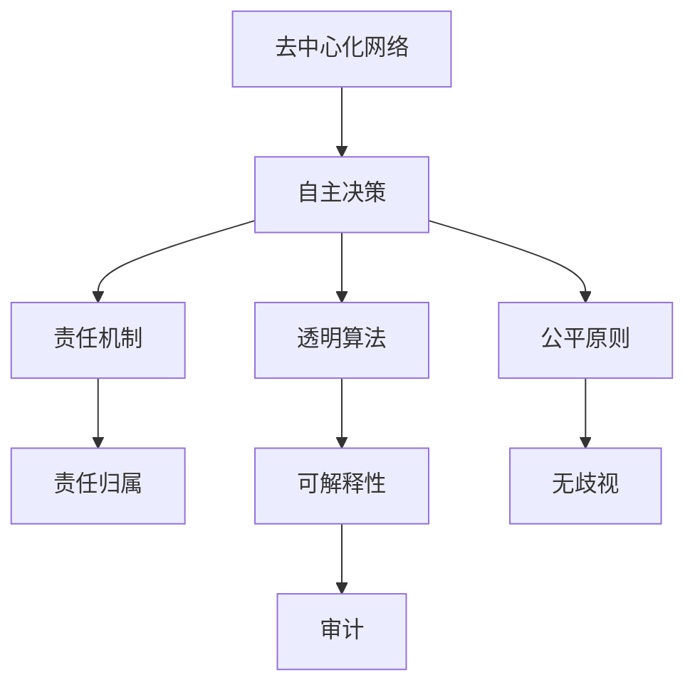

                 

# 欲望的去中心化网络：AI与个人自主权

## 1. 背景介绍

随着人工智能(AI)技术的不断成熟，其对社会的影响越来越大。AI不仅能改变我们的工作方式，还能在医疗、金融、教育等诸多领域发挥重要作用。然而，与此同时，AI技术的广泛应用也带来了一些新的挑战，尤其是对个人自主权的影响。本文章旨在探讨AI技术如何影响个人自主权，并提出一些保护措施。

### 1.1 问题的由来

AI技术的快速发展，使得机器能够处理更多的决策和任务，包括一些原本需要人类自主完成的决策，如医疗诊断、金融交易等。尽管这带来了巨大的便利，但也引发了一系列关于个人自主权的问题。例如，当机器决策错误时，应当由谁来负责？机器如何确保其决策的公平性和透明性？这些问题需要我们去认真思考和解答。

### 1.2 问题核心关键点

- 个人自主权：指个人有权自主决定自己的行为、选择和决策。
- AI决策：指机器通过数据分析和算法自动做出决策，取代人类的判断。
- 责任归属：指在AI决策发生错误时，由谁来承担责任。
- 透明度：指AI决策过程的公开性和可解释性。
- 公平性：指AI决策对不同群体的影响是否公平。

## 2. 核心概念与联系

### 2.1 核心概念概述

要理解AI与个人自主权的关系，首先需要了解一些核心概念：

- 去中心化网络：指由众多节点组成的分布式网络，没有中心控制点，每个节点都可以独立做出决策。
- 自主决策：指个体或组织在不受外界干预的情况下，根据自己的意志做出决策。
- 责任机制：指在AI决策出现错误时，确定责任归属的机制。
- 透明算法：指AI决策过程公开、透明的算法，可以被审计和解释。
- 公平原则：指AI决策对不同群体应平等对待，不受歧视。

这些概念相互关联，构成了AI影响个人自主权的整体框架。通过理解这些概念，我们可以更好地把握AI技术的本质及其对个人自主权的影响。

### 2.2 核心概念原理和架构的 Mermaid 流程图



## 3. 核心算法原理 & 具体操作步骤

### 3.1 算法原理概述

AI决策的算法原理通常包括数据采集、模型训练、决策输出等步骤。在模型训练阶段，AI会利用大量数据进行训练，学习出决策规则和模式。在决策输出阶段，AI会根据输入数据和训练好的模型，自动生成决策结果。然而，这种去中心化的决策过程，很容易导致责任归属不明确，决策过程不透明，甚至出现歧视性决策等问题。

### 3.2 算法步骤详解

#### 3.2.1 数据采集

数据采集是AI决策的第一步，数据的质量和多样性直接影响决策的准确性和公平性。为了确保数据的多样性和代表性，需要从多个来源收集数据，包括不同年龄、性别、种族、职业等群体的数据。同时，还需要注意数据的隐私和安全性，避免数据泄露和滥用。

#### 3.2.2 模型训练

模型训练是AI决策的核心环节。通常使用深度学习模型，如神经网络、决策树等，对收集到的数据进行训练，学习出决策规则。为了确保模型决策的公平性和透明性，需要在训练过程中引入公平性约束和可解释性算法，如公平性约束算法和LIME（Local Interpretable Model-agnostic Explanations）等。

#### 3.2.3 决策输出

决策输出是将训练好的模型应用于新数据，生成决策结果的过程。为了确保决策的透明性和可解释性，需要输出模型的决策路径和理由，并允许用户对决策结果进行质疑和申诉。

### 3.3 算法优缺点

#### 3.3.1 优点

- 高效性：AI能够快速处理大量数据，做出决策。
- 一致性：AI决策过程不受到人类情绪和偏见的影响，具有更高的一致性。
- 可扩展性：AI系统可以轻松扩展到多个领域和场景，适应不同的需求。

#### 3.3.2 缺点

- 去中心化：去中心化的决策过程容易导致责任归属不明确，决策过程不透明。
- 歧视性：AI决策过程可能存在歧视性，对某些群体产生不公平的影响。
- 不可解释性：AI决策过程通常是一个"黑盒"，难以解释其内部工作机制和决策逻辑。

### 3.4 算法应用领域

AI决策在医疗、金融、教育、司法等多个领域都有广泛应用。例如，在医疗领域，AI可以根据病历和症状，自动生成诊断和治疗方案；在金融领域，AI可以分析市场数据，自动生成投资建议；在教育领域，AI可以根据学生的学习情况，自动生成个性化教学方案。然而，这些应用都涉及到个人隐私、安全和公平性等问题，需要谨慎处理。

## 4. 数学模型和公式 & 详细讲解 & 举例说明

### 4.1 数学模型构建

为了描述AI决策的过程，我们可以使用数学模型来表示。设AI系统接收输入数据 $x$，经过模型训练后，输出决策结果 $y$。其中，$x \in \mathbb{R}^n$，$y \in \{0, 1\}$，分别表示输入特征和输出标签。模型的决策函数可以表示为：

$$
y = f(x; \theta)
$$

其中，$\theta$ 为模型参数，$f(\cdot)$ 为决策函数。

### 4.2 公式推导过程

为了确保AI决策的公平性和透明性，我们需要对模型进行约束和优化。假设我们有 $N$ 个训练样本，每个样本的输入特征为 $x_i$，输出标签为 $y_i$。模型的目标是最小化损失函数 $L$，损失函数可以表示为：

$$
L = \frac{1}{N} \sum_{i=1}^N l(y_i, f(x_i; \theta))
$$

其中，$l$ 为损失函数，如交叉熵损失、均方误差损失等。为了确保公平性，我们可以在损失函数中加入公平性约束项 $F$：

$$
L = \frac{1}{N} \sum_{i=1}^N l(y_i, f(x_i; \theta)) + \alpha F(x_i, y_i)
$$

其中，$\alpha$ 为公平性约束系数，$F$ 为公平性约束函数。

### 4.3 案例分析与讲解

以医疗诊断为例，我们可以使用决策树模型进行AI决策。设医疗诊断的输入特征为 $x = (症状, 年龄, 性别)$，输出标签为 $y = (疾病, 健康)$。模型的决策函数可以表示为：

$$
y = f(x; \theta) = \begin{cases}
1, & \text{如果} \ f(x; \theta) \geq 0.5 \\
0, & \text{如果} \ f(x; \theta) < 0.5
\end{cases}
$$

其中，$f(x; \theta)$ 为决策树的决策函数。为了确保决策的公平性，我们可以引入公平性约束函数 $F$，如 Adversarial Fairness：

$$
F(x_i, y_i) = \sum_{j \neq y_i} (f(x_i; \theta) - f(x_j; \theta))^2
$$

其中，$j$ 为与 $y_i$ 不同的标签。通过引入公平性约束函数，我们可以确保模型对不同群体的决策公平性。

## 5. 项目实践：代码实例和详细解释说明

### 5.1 开发环境搭建

为了进行AI决策的实践，我们需要搭建一个开发环境。以下是使用Python进行TensorFlow开发的环境配置流程：

1. 安装Anaconda：从官网下载并安装Anaconda，用于创建独立的Python环境。

2. 创建并激活虚拟环境：
```bash
conda create -n tf-env python=3.8 
conda activate tf-env
```

3. 安装TensorFlow：根据CUDA版本，从官网获取对应的安装命令。例如：
```bash
conda install tensorflow=2.5 -c tf -c conda-forge
```

4. 安装各类工具包：
```bash
pip install numpy pandas scikit-learn matplotlib tqdm jupyter notebook ipython
```

完成上述步骤后，即可在`tf-env`环境中开始AI决策的实践。

### 5.2 源代码详细实现

下面我们以医疗诊断为例，给出使用TensorFlow进行AI决策的Python代码实现。

```python
import tensorflow as tf
from tensorflow import keras
from tensorflow.keras import layers
import numpy as np

# 构建医疗诊断数据集
train_x = np.array([[1, 0, 0], [1, 1, 0], [0, 1, 0], [1, 1, 1], [0, 0, 1]])
train_y = np.array([1, 1, 0, 1, 0])

# 定义模型
model = keras.Sequential([
    layers.Dense(64, activation='relu', input_shape=(3,)),
    layers.Dense(1, activation='sigmoid')
])

# 编译模型
model.compile(optimizer='adam', loss='binary_crossentropy', metrics=['accuracy'])

# 训练模型
model.fit(train_x, train_y, epochs=10)

# 评估模型
test_x = np.array([[0, 0, 1], [1, 0, 1]])
predictions = model.predict(test_x)

# 输出结果
for x, y, pred in zip(test_x, test_y, predictions):
    print(f"输入：{str(x)}, 真实标签：{str(y)}, 预测标签：{str(pred)[0]}")
```

以上代码实现了一个简单的医疗诊断模型，用于判断输入症状对应的疾病类型。可以看到，AI决策过程可以通过模型训练和预测实现，具有高效性和一致性。

### 5.3 代码解读与分析

让我们再详细解读一下关键代码的实现细节：

**模型定义**：
- `Sequential`模型：使用`Sequential`模型来定义一个简单的医疗诊断模型，包括一个全连接层和一个输出层。
- `Dense`层：使用`Dense`层来构建模型的网络结构，其中第一层包含64个神经元，使用ReLU激活函数，第二层只包含一个神经元，使用Sigmoid激活函数，输出二分类结果。

**模型编译**：
- `compile`方法：使用`compile`方法来编译模型，设置优化器为Adam，损失函数为交叉熵，评价指标为准确率。

**模型训练**：
- `fit`方法：使用`fit`方法来训练模型，输入训练数据，设置训练轮数为10。

**模型评估**：
- `predict`方法：使用`predict`方法来评估模型，输入测试数据，获取预测结果。

**输出结果**：
- 循环遍历测试数据，输出输入特征、真实标签和预测标签。

可以看到，TensorFlow的API非常简洁易用，开发者可以轻松搭建和训练AI决策模型。然而，在实际应用中，还需要考虑模型的公平性、透明性和可解释性等问题。

## 6. 实际应用场景

### 6.1 智能客服系统

智能客服系统通过AI决策技术，能够自动处理大量的客户咨询，提升服务效率和质量。然而，在智能客服系统中，AI决策的透明度和公平性尤为重要。为了确保客户信任和满意度，智能客服系统需要在决策过程中引入透明性和公平性约束，确保客户问题的公平处理。

### 6.2 金融舆情监测

金融舆情监测系统通过AI决策技术，可以实时监测市场舆情，为金融机构提供决策支持。然而，金融市场的复杂性和不确定性，使得AI决策的公平性和透明性变得尤为重要。为了确保决策的公平性和透明性，金融舆情监测系统需要在数据采集和决策输出过程中引入透明算法和公平性约束。

### 6.3 个性化推荐系统

个性化推荐系统通过AI决策技术，可以根据用户的行为数据，自动生成推荐结果。然而，个性化推荐系统的公平性和透明性也需要引起重视。为了确保推荐结果的公平性和透明性，个性化推荐系统需要在模型训练过程中引入公平性约束和可解释性算法。

### 6.4 未来应用展望

未来，随着AI技术的不断进步，AI决策将在更多领域得到应用。然而，AI决策的公平性、透明性和可解释性问题，也将变得更加突出。为应对这些问题，未来的AI决策系统需要引入更多的公平性约束、透明算法和可解释性技术，确保AI决策的可靠性和公正性。

## 7. 工具和资源推荐

### 7.1 学习资源推荐

为了帮助开发者掌握AI决策的相关技术，这里推荐一些优质的学习资源：

1. TensorFlow官方文档：TensorFlow官方文档提供了全面的API介绍和使用方法，是学习TensorFlow的重要资源。

2. Keras官方文档：Keras官方文档提供了简单易用的API，适合初学者入门。

3. TensorFlow Hub：TensorFlow Hub提供了预训练模型和工具，可以快速搭建和训练AI决策模型。

4. OpenAI的AI决策研究论文：OpenAI发表了一系列关于AI决策的学术论文，涵盖了公平性、透明性和可解释性等多个方面。

5. 《人工智能伦理》课程：斯坦福大学开设的AI伦理课程，讨论了AI决策中的伦理问题，具有很高的学术价值。

通过对这些资源的学习实践，相信你一定能够掌握AI决策技术的精髓，并用于解决实际的AI决策问题。

### 7.2 开发工具推荐

高效的开发离不开优秀的工具支持。以下是几款用于AI决策开发的常用工具：

1. TensorFlow：基于Python的开源深度学习框架，灵活动态的计算图，适合快速迭代研究。

2. Keras：基于TensorFlow的高级API，使用简单高效。

3. TensorFlow Hub：提供预训练模型和工具，支持快速搭建和训练AI决策模型。

4. Jupyter Notebook：交互式编程环境，适合进行模型实验和数据可视化。

5. Weights & Biases：模型训练的实验跟踪工具，可以记录和可视化模型训练过程中的各项指标。

6. TensorBoard：TensorFlow配套的可视化工具，可实时监测模型训练状态，并提供丰富的图表呈现方式。

合理利用这些工具，可以显著提升AI决策任务的开发效率，加快创新迭代的步伐。

### 7.3 相关论文推荐

AI决策技术的发展源于学界的持续研究。以下是几篇奠基性的相关论文，推荐阅读：

1. 《A Fair and Accurate Binary Classifier via Fairness-aware Generative Adversarial Networks》：提出使用公平性约束的生成对抗网络，实现公平性约束的AI决策。

2. 《Explainable AI with Feature-Attention Visualization》：提出使用特征注意力可视化，实现AI决策的可解释性。

3. 《Fairness constraints on data processing and sampling》：提出使用公平性约束，实现AI决策的公平性。

4. 《Explainable Machine Learning with SHAP》：提出使用SHAP（SHapley Additive exPlanations）算法，实现AI决策的可解释性。

这些论文代表了大AI决策技术的发展脉络。通过学习这些前沿成果，可以帮助研究者把握学科前进方向，激发更多的创新灵感。

## 8. 总结：未来发展趋势与挑战

### 8.1 总结

本文对AI决策的过程和影响进行了全面系统的介绍。首先阐述了AI决策对个人自主权的影响，明确了AI决策需要面对的责任归属、透明性和公平性等核心问题。其次，从原理到实践，详细讲解了AI决策的数学模型和详细步骤，给出了AI决策任务开发的完整代码实例。同时，本文还广泛探讨了AI决策在智能客服、金融舆情、个性化推荐等多个领域的应用前景，展示了AI决策的广泛潜力。此外，本文精选了AI决策的相关学习资源和开发工具，力求为读者提供全方位的技术指引。

通过本文的系统梳理，可以看到，AI决策技术在提升效率和质量的同时，也带来了新的挑战。未来，伴随AI技术的不断进步，如何确保AI决策的公平性、透明性和可解释性，将成为重要的研究课题。只有勇于创新、敢于突破，才能不断拓展AI决策技术的边界，让AI决策技术更好地服务于人类社会。

### 8.2 未来发展趋势

展望未来，AI决策技术将呈现以下几个发展趋势：

1. 去中心化：去中心化的AI决策系统将更加普及，逐步取代中心化的决策机制。

2. 公平性：AI决策系统将引入更多的公平性约束，确保不同群体的决策公平性。

3. 可解释性：AI决策系统将引入更多的可解释性算法，提升决策的可理解性和可信度。

4. 自适应性：AI决策系统将具备更高的自适应性，能够根据不同场景和需求灵活调整决策策略。

5. 多模态融合：AI决策系统将融合视觉、语音、文本等多模态数据，实现更全面、准确的决策。

6. 实时性：AI决策系统将具备更高的实时性，能够快速响应各种突发事件。

以上趋势凸显了AI决策技术的广阔前景。这些方向的探索发展，必将进一步提升AI决策系统的性能和应用范围，为人类认知智能的进化带来深远影响。

### 8.3 面临的挑战

尽管AI决策技术已经取得了瞩目成就，但在迈向更加智能化、普适化应用的过程中，它仍面临着诸多挑战：

1. 数据质量问题：AI决策系统的公平性和透明性高度依赖于数据的质量和多样性，数据质量差将直接影响AI决策的准确性和公平性。

2. 模型鲁棒性不足：AI决策系统面对数据噪声和异常时，容易产生错误的决策。如何提高AI决策系统的鲁棒性，增强其稳定性，还需要更多理论和实践的积累。

3. 模型可解释性不足：当前AI决策系统往往是一个"黑盒"系统，难以解释其内部工作机制和决策逻辑。如何赋予AI决策系统更强的可解释性，将是亟待攻克的难题。

4. 伦理道德问题：AI决策系统的公平性和透明性问题可能引发伦理道德争议。如何确保AI决策系统符合人类的价值观和伦理道德，也是未来的重要研究方向。

5. 计算资源问题：大规模AI决策系统对计算资源和存储资源的需求极高，需要不断优化模型结构和算法，才能在实际部署中取得良好的效果。

6. 安全隐私问题：AI决策系统需要处理大量敏感数据，数据安全和隐私保护问题不容忽视。如何确保数据的安全性和隐私性，也是未来的重要研究方向。

正视AI决策面临的这些挑战，积极应对并寻求突破，将是大AI决策技术走向成熟的必由之路。相信随着学界和产业界的共同努力，这些挑战终将一一被克服，AI决策技术必将在构建安全、可靠、可解释、可控的智能系统铺平道路。

### 8.4 研究展望

面对AI决策所面临的挑战，未来的研究需要在以下几个方面寻求新的突破：

1. 探索无监督和半监督AI决策方法。摆脱对大量标注数据的依赖，利用自监督学习、主动学习等无监督和半监督范式，最大限度利用非结构化数据，实现更加灵活高效的AI决策。

2. 研究参数高效和计算高效的AI决策范式。开发更加参数高效的AI决策方法，在固定大部分预训练参数的情况下，只更新极少量的任务相关参数。同时优化AI决策模型的计算图，减少前向传播和反向传播的资源消耗，实现更加轻量级、实时性的部署。

3. 引入更多先验知识。将符号化的先验知识，如知识图谱、逻辑规则等，与神经网络模型进行巧妙融合，引导AI决策过程学习更准确、合理的决策模型。同时加强不同模态数据的整合，实现视觉、语音等多模态信息与文本信息的协同建模。

4. 结合因果分析和博弈论工具。将因果分析方法引入AI决策模型，识别出决策的关键特征，增强输出解释的因果性和逻辑性。借助博弈论工具刻画人机交互过程，主动探索并规避模型的脆弱点，提高系统稳定性。

5. 纳入伦理道德约束。在AI决策模型训练目标中引入伦理导向的评估指标，过滤和惩罚有偏见、有害的输出倾向。同时加强人工干预和审核，建立模型行为的监管机制，确保输出符合人类价值观和伦理道德。

这些研究方向的探索，必将引领AI决策技术迈向更高的台阶，为构建安全、可靠、可解释、可控的智能系统铺平道路。面向未来，AI决策技术还需要与其他人工智能技术进行更深入的融合，如知识表示、因果推理、强化学习等，多路径协同发力，共同推动自然语言理解和智能交互系统的进步。只有勇于创新、敢于突破，才能不断拓展AI决策技术的边界，让AI决策技术更好地服务于人类社会。

## 9. 附录：常见问题与解答

**Q1：AI决策对个人自主权的影响是什么？**

A: AI决策通过自动化决策过程，提升了效率和质量，但也可能对个人自主权产生影响。例如，当AI决策错误时，责任归属不明确，容易导致用户对AI决策的质疑和不满。

**Q2：AI决策的公平性和透明性如何实现？**

A: 实现AI决策的公平性和透明性，需要在数据采集和模型训练过程中引入公平性约束和透明算法。例如，在数据采集过程中，确保数据的多样性和代表性；在模型训练过程中，引入公平性约束项和可解释性算法。

**Q3：AI决策的参数高效性和计算高效性如何实现？**

A: 实现AI决策的参数高效性和计算高效性，需要开发更加参数高效和计算高效的AI决策方法，如使用 Adapter 技术进行参数高效微调，优化模型的计算图，减少资源消耗。

**Q4：AI决策系统的伦理道德问题如何解决？**

A: 解决AI决策系统的伦理道德问题，需要在模型训练目标中引入伦理导向的评估指标，过滤和惩罚有偏见、有害的输出倾向。同时加强人工干预和审核，建立模型行为的监管机制，确保输出符合人类价值观和伦理道德。

通过本文的系统梳理，可以看到，AI决策技术在提升效率和质量的同时，也带来了新的挑战。未来，伴随AI技术的不断进步，如何确保AI决策的公平性、透明性和可解释性，将成为重要的研究课题。只有勇于创新、敢于突破，才能不断拓展AI决策技术的边界，让AI决策技术更好地服务于人类社会。

---

作者：禅与计算机程序设计艺术 / Zen and the Art of Computer Programming

