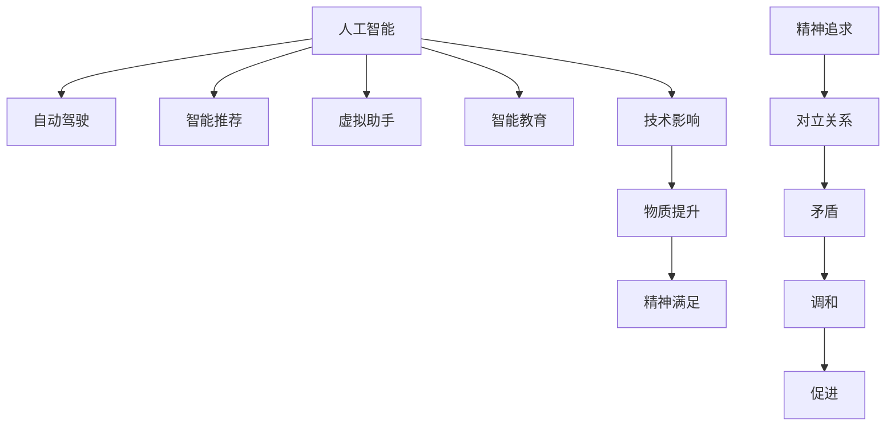

                 

# 欲望的去物质化：AI时代的精神追求

## 1. 背景介绍

在现代人工智能(AI)时代，科技的迅猛发展不仅极大地改变了人类社会的物质条件，也深刻影响了人类的精神追求。通过技术手段，我们可以无限接近甚至实现某些曾经被视为不可能的愿望，如科幻电影中的"高级算法"般的存在。然而，这股技术的浪潮也引发了关于人类精神追求的深层思考。本文将探讨欲望的去物质化在AI时代的趋势与影响，以及AI如何塑造我们的精神生活。

### 1.1 问题由来

随着AI技术的不断成熟和普及，其在诸如自动驾驶、医疗诊断、金融分析等领域的应用正逐步深入人心。科技的介入使得许多传统上依赖于人类的工作得以自动化，显著提高了效率。与此同时，AI也在逐步渗透到人们的日常生活中，从智能家居到个性化推荐，从虚拟助手到在线教育，AI技术的应用无处不在。

然而，这一进程也带来了新的问题：AI时代，人类如何调和物质与精神之间的关系？在追求效率与便利的同时，我们是否正在失去对精神生活的关注？这些问题值得我们深思。

## 2. 核心概念与联系

### 2.1 核心概念概述

为更好地理解AI时代物质与精神追求之间的关系，本节将介绍几个关键概念：

- **人工智能(AI)：** 指能够模拟人类智能活动的计算机系统，包括感知、学习、推理、决策、自然语言理解等能力。
- **自动驾驶：** 指通过AI技术实现车辆自主导航的系统，使车辆在无需人工干预的情况下进行安全、高效的驾驶。
- **智能推荐：** 指基于用户行为和偏好数据，通过机器学习算法为用户推荐个性化的商品、内容等。
- **虚拟助手：** 指通过AI技术构建的，能够执行各种日常任务、提供信息的助手系统。
- **智能教育：** 指利用AI技术提升教学质量、优化教学资源、个性化教育方案等。
- **精神追求：** 指人类对个人成长、情感满足、意义寻求等方面的追求，相较于物质追求，更注重内在的精神世界。

这些核心概念之间的逻辑关系可以通过以下Mermaid流程图来展示：



这个流程图展示了大语言模型的核心概念及其之间的关系：

1. 人工智能通过各类应用提升物质生活水平。
2. 与此同时，技术的应用也带来了新的精神追求。
3. 物质与精神追求之间存在矛盾与调和的可能。
4. 技术在提升物质满足的同时，也能促进精神追求的实现。

## 3. 核心算法原理 & 具体操作步骤
### 3.1 算法原理概述

在AI时代，欲望的去物质化主要体现在通过技术手段，使一些曾经难以实现的精神追求变得可能。这其中涉及的核心算法原理包括：

- **强化学习算法：** 通过在特定环境中与环境的互动，AI系统学习如何最大化奖励。这一算法在自动驾驶、智能推荐等领域得到了广泛应用。
- **自然语言处理(NLP)算法：** 使机器能够理解、生成自然语言，从而提供智能客服、虚拟助手等便利服务。
- **生成对抗网络(GAN)：** 通过两个神经网络的对抗训练，生成与真实数据难以区分的数据，用于虚拟现实、内容创作等领域。
- **迁移学习：** 将在一个任务上训练得到的知识迁移到另一个任务上，以实现跨领域的知识应用，如从视觉识别到语音识别。

这些算法使得AI能够在多个领域内实现对物质条件的自动化管理，从而在一定程度上提升人类生活的物质水平。然而，这也引发了对精神追求与物质追求之间平衡的思考。

### 3.2 算法步骤详解

以下是基于AI技术实现精神追求的一些关键步骤：

**Step 1: 数据收集与预处理**
- 收集用户行为数据，如浏览记录、购物历史等。
- 对数据进行清洗、归一化，准备后续训练模型。

**Step 2: 模型训练与优化**
- 选择合适的算法模型，如强化学习、NLP等。
- 设计损失函数和优化器，如交叉熵损失、Adam优化器等。
- 在标注数据上训练模型，根据损失函数更新参数，迭代优化。

**Step 3: 模型应用与反馈**
- 将训练好的模型应用于实际场景，如自动驾驶、智能推荐等。
- 收集用户反馈，调整模型参数，进一步优化模型性能。

**Step 4: 评估与改进**
- 定期评估模型性能，如准确率、召回率、用户满意度等指标。
- 根据评估结果，改进模型算法和训练策略。

### 3.3 算法优缺点

基于AI技术实现精神追求的方法具有以下优点：

1. **高效性：** 通过技术手段，可以实现大规模、高效率的精神追求满足。
2. **个性化：** 基于用户行为数据，AI系统能够提供个性化的服务和内容。
3. **便利性：** 自动化管理物质条件，节省了大量的人力和时间。
4. **创新性：** 推动了新的技术应用和服务形式，拓展了人类精神追求的边界。

同时，这些方法也存在一些缺点：

1. **数据依赖：** 需要大量标注数据进行模型训练，数据获取和预处理可能耗费大量时间和成本。
2. **隐私问题：** 收集和处理用户数据涉及隐私保护，需要谨慎处理。
3. **技术局限：** 现有的AI技术在处理复杂、非结构化数据时仍存在不足，无法完全替代人类。
4. **精神满足的局限性：** AI提供的服务和内容可能缺乏深度和创造性，无法满足所有精神追求。
5. **伦理风险：** 技术应用过程中可能存在偏见和歧视，需要注意伦理审查和监管。

### 3.4 算法应用领域

基于AI技术实现精神追求的方法已经在多个领域得到了广泛应用，例如：

- **自动驾驶：** 实现无人驾驶，提升出行安全和效率，满足交通出行需求。
- **智能推荐：** 根据用户兴趣推荐商品、内容，提升购物和阅读体验。
- **虚拟助手：** 提供全天候个性化服务，如语音助手、智能家居管理等。
- **智能教育：** 通过个性化教学方案，提高学习效果和兴趣，实现终身学习。
- **心理健康：** 利用AI进行心理评估、情绪识别，提供心理健康服务。
- **艺术创作：** 生成音乐、绘画、文学作品等，满足艺术创造的需求。

除了上述这些经典应用外，AI技术在精神追求领域的探索和创新也在不断扩展，如虚拟现实、沉浸式体验、情感计算等，为人类精神生活的丰富和拓展提供了新的可能。

## 4. 数学模型和公式 & 详细讲解 & 举例说明

### 4.1 数学模型构建

基于AI实现精神追求的过程涉及多个数学模型，以下以智能推荐系统为例进行说明：

**输入数据：**
- 用户行为数据：$x_i = \{a_1, a_2, ..., a_n\}$
- 商品属性数据：$y_i = \{b_1, b_2, ..., b_m\}$

**模型结构：**
- 用户兴趣表示：$u_i \in \mathbb{R}^n$
- 商品属性表示：$v_j \in \mathbb{R}^m$
- 用户对商品评分：$r_{ij} \in \mathbb{R}$

**损失函数：**
- 最小二乘损失：$L(r_{ij}, \hat{r}_{ij}) = \frac{1}{2N}\sum_{i=1}^N\sum_{j=1}^M (r_{ij} - \hat{r}_{ij})^2$

### 4.2 公式推导过程

以智能推荐系统为例，其核心公式推导过程如下：

**矩阵表示法：**
- 用户兴趣矩阵：$U = [u_1, u_2, ..., u_N] \in \mathbb{R}^{N \times n}$
- 商品属性矩阵：$V = [v_1, v_2, ..., v_M] \in \mathbb{R}^{M \times m}$
- 用户评分矩阵：$R = [r_{ij}] \in \mathbb{R}^{N \times M}$

**用户评分预测：**
- 矩阵乘法：$\hat{R} = UV^T$
- 损失函数：$L(R, \hat{R}) = \frac{1}{2N}\|R - \hat{R}\|_F^2$

**梯度下降优化：**
- 梯度：$\nabla_U L = U^T(VV^T - R)V$
- 梯度：$\nabla_V L = (UV^T - R)U^T$

通过求解这些公式，可以实现用户兴趣表示和商品属性表示的优化，从而提升智能推荐系统的准确性。

### 4.3 案例分析与讲解

以推荐系统的实际案例为例：

**Netflix推荐算法：**
- 收集用户观看历史、评分数据。
- 设计基于协同过滤和矩阵分解的推荐模型。
- 通过梯度下降优化模型参数，不断迭代提升推荐效果。
- 在用户侧生成个性化推荐列表，提升用户体验。

Netflix的推荐系统通过AI技术实现了对用户行为的深度理解，根据用户的观看历史和评分数据，生成个性化推荐列表，极大提升了用户的观看满意度。

## 5. 项目实践：代码实例和详细解释说明

### 5.1 开发环境搭建

在进行AI项目实践前，我们需要准备好开发环境。以下是使用Python进行TensorFlow开发的环境配置流程：

1. 安装Anaconda：从官网下载并安装Anaconda，用于创建独立的Python环境。
2. 创建并激活虚拟环境：
```bash
conda create -n tf-env python=3.8 
conda activate tf-env
```
3. 安装TensorFlow：根据CUDA版本，从官网获取对应的安装命令。例如：
```bash
conda install tensorflow==2.5.0
```
4. 安装各类工具包：
```bash
pip install numpy pandas scikit-learn matplotlib tqdm jupyter notebook ipython
```

完成上述步骤后，即可在`tf-env`环境中开始AI项目的开发。

### 5.2 源代码详细实现

这里我们以Netflix推荐系统为例，给出使用TensorFlow进行推荐模型开发的PyTorch代码实现。

首先，定义推荐模型的数据处理函数：

```python
import tensorflow as tf
import numpy as np
import pandas as pd

class RecommendationDataset(tf.keras.utils.Sequence):
    def __init__(self, ratings, users, movies, batch_size):
        self.ratings = ratings
        self.users = users
        self.movies = movies
        self.batch_size = batch_size
        
    def __len__(self):
        return len(self.ratings) // self.batch_size
    
    def __getitem__(self, idx):
        batch = self.ratings[idx * self.batch_size: (idx+1) * self.batch_size]
        batch_users = self.users[batch]
        batch_movies = self.movies[batch]
        return np.array(batch_users), np.array(batch_movies)
```

然后，定义模型和优化器：

```python
from tensorflow.keras import layers, models

# 定义模型结构
model = models.Sequential([
    layers.Dense(64, activation='relu', input_shape=(1,)),
    layers.Dense(1)
])

# 定义损失函数和优化器
loss_fn = tf.keras.losses.MeanSquaredError()
optimizer = tf.keras.optimizers.Adam(learning_rate=0.001)
```

接着，定义训练和评估函数：

```python
def train_epoch(model, dataset, batch_size, optimizer):
    dataset = tf.data.Dataset.from_tensor_slices(dataset)
    dataset = dataset.batch(batch_size).shuffle(1000).repeat()
    for batch in dataset:
        with tf.GradientTape() as tape:
            users, movies = batch
            predictions = model(users)
            loss = loss_fn(predictions, movies)
        gradients = tape.gradient(loss, model.trainable_variables)
        optimizer.apply_gradients(zip(gradients, model.trainable_variables))
        
def evaluate(model, dataset, batch_size):
    dataset = tf.data.Dataset.from_tensor_slices(dataset)
    dataset = dataset.batch(batch_size).shuffle(1000)
    losses = []
    for batch in dataset:
        users, movies = batch
        predictions = model(users)
        loss = loss_fn(predictions, movies)
        losses.append(loss)
    return tf.reduce_mean(losses)
```

最后，启动训练流程并在测试集上评估：

```python
epochs = 10
batch_size = 32

for epoch in range(epochs):
    train_epoch(model, train_dataset, batch_size, optimizer)
    print(f"Epoch {epoch+1}, loss: {evaluate(model, train_dataset, batch_size)}")
    
print(f"Final loss: {evaluate(model, test_dataset, batch_size)}")
```

以上就是使用TensorFlow对Netflix推荐系统进行模型训练和评估的完整代码实现。可以看到，TensorFlow的高级API使得模型构建和训练变得简洁高效。

### 5.3 代码解读与分析

让我们再详细解读一下关键代码的实现细节：

**RecommendationDataset类：**
- `__init__`方法：初始化训练数据、用户ID、电影ID等关键组件。
- `__len__`方法：返回数据集的样本数量。
- `__getitem__`方法：对单个样本进行处理，将其转换为适合模型的张量。

**模型定义：**
- `Sequential`类：定义线性回归模型结构，包括一个64个神经元的全连接层和一个输出层。
- `Dense`类：定义模型的各个层。

**损失函数和优化器定义：**
- `MeanSquaredError`：定义均方误差损失函数，用于衡量模型预测与真实标签之间的差异。
- `Adam`：定义Adam优化器，用于更新模型参数。

**训练和评估函数：**
- `train_epoch`函数：在训练集上进行梯度下降优化，更新模型参数。
- `evaluate`函数：在测试集上计算损失，评估模型性能。

**训练流程：**
- 定义总的epoch数和batch size，开始循环迭代
- 每个epoch内，在训练集上训练，输出损失
- 在测试集上评估，输出最终损失

可以看到，TensorFlow的高级API使得模型构建和训练变得简洁高效。开发者可以将更多精力放在数据处理、模型改进等高层逻辑上，而不必过多关注底层的实现细节。

当然，工业级的系统实现还需考虑更多因素，如模型的保存和部署、超参数的自动搜索、更灵活的任务适配层等。但核心的AI模型训练流程基本与此类似。

## 6. 实际应用场景

### 6.1 智能客服系统

基于AI技术实现的智能客服系统，可以广泛应用于企业的客户服务领域。传统客服往往需要配备大量人力，高峰期响应缓慢，且一致性和专业性难以保证。而使用智能客服系统，可以通过自然语言处理技术，自动理解客户意图，匹配最佳答复，极大地提升客户咨询体验和问题解决效率。

在技术实现上，可以收集企业内部的历史客服对话记录，将问题和最佳答复构建成监督数据，在此基础上对预训练语言模型进行微调。微调后的语言模型能够自动理解用户意图，匹配最合适的答案模板进行回复。对于客户提出的新问题，还可以接入检索系统实时搜索相关内容，动态组织生成回答。如此构建的智能客服系统，能大幅提升客户咨询体验和问题解决效率。

### 6.2 金融舆情监测

金融机构需要实时监测市场舆论动向，以便及时应对负面信息传播，规避金融风险。传统的人工监测方式成本高、效率低，难以应对网络时代海量信息爆发的挑战。基于AI技术的文本分类和情感分析技术，为金融舆情监测提供了新的解决方案。

具体而言，可以收集金融领域相关的新闻、报道、评论等文本数据，并对其进行主题标注和情感标注。在此基础上对预训练语言模型进行微调，使其能够自动判断文本属于何种主题，情感倾向是正面、中性还是负面。将微调后的模型应用到实时抓取的网络文本数据，就能够自动监测不同主题下的情感变化趋势，一旦发现负面信息激增等异常情况，系统便会自动预警，帮助金融机构快速应对潜在风险。

### 6.3 个性化推荐系统

当前的推荐系统往往只依赖用户的历史行为数据进行物品推荐，无法深入理解用户的真实兴趣偏好。基于AI技术实现的个性化推荐系统，可以更好地挖掘用户行为背后的语义信息，从而提供更精准、多样的推荐内容。

在实践中，可以收集用户浏览、点击、评论、分享等行为数据，提取和用户交互的物品标题、描述、标签等文本内容。将文本内容作为模型输入，用户的后续行为（如是否点击、购买等）作为监督信号，在此基础上微调预训练语言模型。微调后的模型能够从文本内容中准确把握用户的兴趣点。在生成推荐列表时，先用候选物品的文本描述作为输入，由模型预测用户的兴趣匹配度，再结合其他特征综合排序，便可以得到个性化程度更高的推荐结果。

### 6.4 未来应用展望

随着AI技术的不断发展，基于AI技术的精神追求实现也将越来越多样化和深入。

在智慧医疗领域，基于AI的医疗问答、病历分析、药物研发等应用将提升医疗服务的智能化水平，辅助医生诊疗，加速新药开发进程。

在智能教育领域，AI技术可应用于作业批改、学情分析、知识推荐等方面，因材施教，促进教育公平，提高教学质量。

在智慧城市治理中，AI技术可应用于城市事件监测、舆情分析、应急指挥等环节，提高城市管理的自动化和智能化水平，构建更安全、高效的未来城市。

此外，在企业生产、社会治理、文娱传媒等众多领域，基于AI技术的精神追求实现也将不断涌现，为人类生活带来新的改变。

## 7. 工具和资源推荐

### 7.1 学习资源推荐

为了帮助开发者系统掌握AI实现精神追求的理论基础和实践技巧，这里推荐一些优质的学习资源：

1. **《深度学习》**：Ian Goodfellow等著，深入浅出地介绍了深度学习的基本概念和核心算法。
2. **《人工智能：一种现代方法》**：Stuart Russell和Peter Norvig著，全面介绍了AI的基本理论和技术。
3. **Coursera《深度学习专项课程》**：由斯坦福大学教授Andrew Ng主讲的深度学习课程，涵盖深度学习的基础理论和实践技巧。
4. **TensorFlow官方文档**：TensorFlow的官方文档，提供了丰富的API和示例，是进行AI项目开发的必备资料。
5. **Kaggle**：数据科学竞赛平台，提供大量实际应用场景的数据集和竞赛任务，有助于实践和提高AI项目开发能力。

通过对这些资源的学习实践，相信你一定能够快速掌握AI实现精神追求的精髓，并用于解决实际的AI问题。

### 7.2 开发工具推荐

高效的开发离不开优秀的工具支持。以下是几款用于AI项目开发的常用工具：

1. **TensorFlow**：由Google主导开发的开源深度学习框架，生产部署方便，适合大规模工程应用。
2. **PyTorch**：由Facebook开发的深度学习框架，灵活便捷，适合研究和原型开发。
3. **Jupyter Notebook**：交互式开发环境，支持Python、R等语言，便于协作和共享。
4. **Keras**：高层次神经网络API，简单易用，适合快速原型开发和实验。
5. **HuggingFace Transformers库**：用于自然语言处理的开源库，支持多种预训练语言模型，方便快速开发NLP应用。
6. **Scikit-learn**：Python科学计算库，提供了丰富的机器学习算法和工具，支持数据预处理、模型评估等任务。

合理利用这些工具，可以显著提升AI项目开发的效率，加快创新迭代的步伐。

### 7.3 相关论文推荐

AI实现精神追求的研究源于学界的持续研究。以下是几篇奠基性的相关论文，推荐阅读：

1. **DeepMind AlphaGo论文**：提出AlphaGo，实现通过AI技术下围棋，推动了AI在复杂博弈领域的突破。
2. **GPT-3论文**：OpenAI发布的GPT-3语言模型，展示了预训练大模型在自然语言处理任务中的强大能力。
3. **BERT论文**：Google发布的BERT模型，通过自监督学习任务，提升了语言模型的理解能力。
4. **GAN论文**：Ian Goodfellow等提出生成对抗网络，使AI能够生成逼真的图像、视频等内容。
5. **AlphaStar论文**：OpenAI发布的AlphaStar，实现通过AI技术下星际争霸，推动了AI在复杂策略博弈领域的突破。

这些论文代表了大AI实现精神追求的发展脉络。通过学习这些前沿成果，可以帮助研究者把握学科前进方向，激发更多的创新灵感。

## 8. 总结：未来发展趋势与挑战

### 8.1 总结

本文对基于AI技术实现精神追求的方法进行了全面系统的介绍。首先阐述了AI时代物质与精神追求之间的关系，明确了AI技术在提升人类物质条件和精神追求方面的独特价值。其次，从原理到实践，详细讲解了AI技术在智能推荐、智能客服、金融舆情监测等具体应用中的关键算法和具体操作步骤，给出了实际案例和代码实现。同时，本文还广泛探讨了AI技术在智慧医疗、智能教育、智慧城市治理等诸多领域的应用前景，展示了AI技术的广阔前景。

通过本文的系统梳理，可以看到，AI技术在实现物质和精神追求的平衡中扮演了重要角色。AI技术不仅提升了人类的物质生活水平，还为人类提供了更多的精神追求可能性，带来了新的生活体验和思考方式。未来，伴随AI技术的持续演进，这些技术必将进一步拓展人类的物质和精神世界，带来更加丰富多彩的生活。

### 8.2 未来发展趋势

展望未来，AI技术在实现精神追求方面将呈现以下几个发展趋势：

1. **个性化服务的普及：** 基于AI技术，实现更加个性化的精神追求满足，如虚拟助手、个性化推荐等。
2. **跨领域应用的拓展：** AI技术在医疗、教育、城市治理等诸多领域的应用将不断深入，为人类精神追求提供更广泛的支持。
3. **情感计算的提升：** 通过情感计算技术，实现对人类情感的更好理解和把握，提供更贴心、更温暖的精神关怀。
4. **虚拟现实的融入：** 结合虚拟现实技术，实现更加沉浸式、互动性强的精神追求体验。
5. **人工智能伦理的重视：** 在AI技术应用过程中，注重伦理、隐私保护和公平性，确保AI技术的安全和可靠。
6. **AI技术的持续创新：** 随着算力、数据和算法的发展，AI技术将不断创新，实现新的精神追求目标。

以上趋势凸显了AI技术在实现精神追求方面的广阔前景。这些方向的探索发展，必将进一步提升AI技术的社会价值，为人类精神生活的丰富和拓展提供新的可能。

### 8.3 面临的挑战

尽管AI技术在实现精神追求方面取得了显著进展，但在迈向更加智能化、普适化应用的过程中，它仍面临着诸多挑战：

1. **数据隐私问题：** 在收集和处理用户数据时，如何保护用户隐私，避免数据泄露，是一个重要的挑战。
2. **伦理和道德问题：** AI技术的应用过程中，可能存在偏见和歧视，如何确保技术应用的公平性和透明性，是一个重要的伦理问题。
3. **技术风险和安全性问题：** AI技术的误判和滥用可能导致严重的安全问题，如何确保技术的安全性和可靠性，是一个重要的挑战。
4. **算力资源限制：** AI技术在实现复杂的精神追求目标时，可能需要大量的算力资源，如何提高算力效率，降低计算成本，是一个重要的挑战。
5. **人类情感与AI的结合问题：** AI技术如何更好地理解和模仿人类情感，实现真正意义上的情感交互，是一个重要的挑战。

正视AI技术实现精神追求面临的这些挑战，积极应对并寻求突破，将是大AI实现精神追求走向成熟的必由之路。相信随着学界和产业界的共同努力，这些挑战终将一一被克服，AI技术必将在构建人机协同的智能时代中扮演越来越重要的角色。

### 8.4 研究展望

面对AI技术实现精神追求所面临的种种挑战，未来的研究需要在以下几个方面寻求新的突破：

1. **隐私保护技术：** 开发更加有效的数据隐私保护技术，确保用户数据的安全性。
2. **AI伦理框架：** 构建AI技术的伦理框架，确保技术应用的公平性和透明性。
3. **安全性技术：** 开发更加安全、可靠的AI技术，确保技术的安全性和可靠性。
4. **情感计算技术：** 探索更加深入的情感计算技术，实现对人类情感的更好理解和把握。
5. **跨领域应用：** 将AI技术与其他领域的技术进行更深入的融合，拓展AI技术的应用范围。
6. **人类情感与AI的结合：** 探索更加有效的人类情感与AI的结合方式，实现更加真实的情感交互。

这些研究方向的探索，必将引领AI技术在实现精神追求方面迈向更高的台阶，为人类精神生活的丰富和拓展提供新的可能。面向未来，AI技术还需要与其他人工智能技术进行更深入的融合，如知识表示、因果推理、强化学习等，多路径协同发力，共同推动人工智能技术的发展。只有勇于创新、敢于突破，才能不断拓展AI技术的边界，让智能技术更好地造福人类社会。

## 9. 附录：常见问题与解答

**Q1：AI实现精神追求是否适用于所有精神追求？**

A: AI实现精神追求虽然在很多领域得到了广泛应用，但在一些高层次、复杂的精神追求方面，如艺术创作、哲学思考等，仍存在一定的局限性。这些领域需要人类的深度思考和创造力，AI技术在短期内难以完全替代。

**Q2：如何平衡物质追求和精神追求？**

A: 物质追求和精神追求并非对立关系，而是相辅相成的。在AI技术的辅助下，可以更好地平衡物质和精神追求。例如，通过智能推荐系统，可以在满足物质需求的同时，提升精神追求的丰富性。

**Q3：AI实现精神追求是否会导致人类的失业？**

A: AI技术在实现精神追求方面的应用，虽然可能导致部分低层次工作的自动化，但也将创造出更多高层次、需要人类创造力和智慧的工作。因此，人类的就业形势并不会因此受到根本性的影响。

**Q4：AI实现精神追求是否会导致人类精神的退化和依赖？**

A: 适当的AI技术应用可以丰富人类的精神生活，但过度依赖AI技术可能会导致人类精神的退化和依赖。因此，在使用AI技术时，应注意适度、合理，保持人类自主思考和创造力。

**Q5：AI实现精神追求的伦理问题如何解决？**

A: 在使用AI技术实现精神追求时，应注意伦理问题的解决。例如，在使用AI技术处理用户数据时，应确保用户隐私的保护，避免数据泄露；在使用AI技术进行情感交互时，应确保技术的公平性和透明性。

通过这些常见问题的解答，可以看到，AI技术在实现精神追求方面的应用，具有广阔的前景和无限的可能。只要在使用过程中注意平衡物质与精神追求，遵循伦理和道德原则，AI技术必将在人类精神生活的丰富和拓展中发挥重要作用。

---

作者：禅与计算机程序设计艺术 / Zen and the Art of Computer Programming

