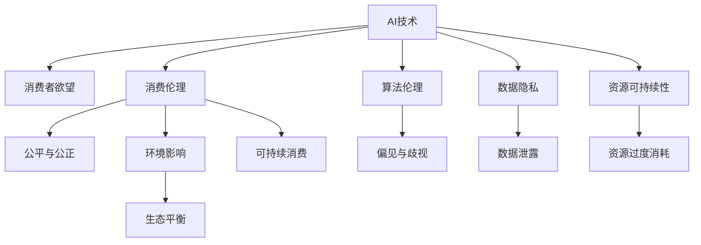

                 

# 欲望的可持续性：AI时代的消费伦理

> 关键词：人工智能(AI), 消费伦理, 可持续性, 算法伦理, 数据隐私

## 1. 背景介绍

### 1.1 问题由来

在AI技术的迅猛发展中，消费行为及其背后的欲望表达和满足方式，正受到前所未有的影响。这种影响体现在多个层面，从日常购物到大型投资决策，从个性化推荐系统到虚拟现实购物体验，AI的算法和数据正在重塑消费者的欲望表达和满足模式。但与此同时，AI技术的双刃剑效应也凸显出来，对消费伦理带来了深远的挑战。

消费者的欲望及其表达，从根本上由其价值观、社会环境、经济状况等多重因素构成。而AI技术通过精准的数据分析和智能算法，能够显著增强消费者欲望的实现和满足方式，但也可能加剧资源的过度消费，引发环境与社会的诸多问题。例如，推荐系统的个性化推荐，虽然极大地提升了消费者购物体验，但也容易导致过度消费，而大数据分析的应用可能侵害消费者隐私，引发数据伦理问题。

鉴于此，如何在AI时代促进欲望的可持续性，维护消费者权益，确保公平正义，成为了一个重要而迫切的问题。本研究旨在深入探讨AI技术如何影响消费者的欲望表达与满足，分析其伦理困境，并提出相应的解决策略。

### 1.2 问题核心关键点

AI时代消费伦理的核心问题包括但不限于以下几个方面：

- **数据隐私与伦理**：如何平衡数据收集与用户隐私保护？
- **算法透明度与可解释性**：如何提升算法的透明度，确保消费者能够理解其决策逻辑？
- **欲望的可持续性**：如何在追求商业利益的同时，防止资源过度消耗，实现可持续消费？
- **公平与公正**：如何避免算法偏见，确保不同消费者群体能够平等享受AI带来的便利？
- **环境影响**：AI如何影响环境资源的合理分配与利用？

这些问题需要通过技术、伦理、法律、政策等多维度的共同努力，方能得到妥善解决。本文将重点探讨如何通过算法设计和伦理规范，实现AI时代消费者欲望的可持续性。

### 1.3 问题研究意义

研究AI时代的消费伦理，对于实现公平、可持续的消费方式具有重要意义。具体如下：

1. **保护消费者权益**：通过规范AI技术的使用，确保消费者的隐私和数据安全，提升算法的透明度和公平性。
2. **促进环境可持续发展**：通过优化算法和设计，减少资源消耗，提升资源利用效率，推动绿色消费。
3. **推动科技伦理进步**：在AI技术广泛应用的背景下，明确技术伦理边界，探索技术与伦理的平衡点。
4. **提升社会福祉**：通过技术手段，实现资源更公平的分配，提升社会整体福祉。

## 2. 核心概念与联系

### 2.1 核心概念概述

为深入探讨AI时代消费伦理问题，首先需要理解几个核心概念及其联系：

- **AI技术**：以机器学习、深度学习等为代表的智能算法，能够处理大规模数据，实现自动化决策。
- **消费者欲望**：指消费者基于其价值观和需求，希望满足的各种消费目标。
- **消费伦理**：涉及消费者行为的社会伦理，包括消费的公平性、可持续性、隐私保护等方面。
- **算法伦理**：指算法设计和使用的伦理原则，旨在避免偏见、歧视、隐私侵害等问题。
- **数据隐私**：指在数据处理过程中，保护个人隐私不被不当利用的原则和措施。
- **资源可持续性**：指在消费过程中，合理利用资源，实现环境、社会、经济的可持续发展。

这些概念之间的逻辑关系可以通过以下Mermaid流程图来展示：



这个流程图展示了大语言模型微调技术各概念间的联系和影响关系：

1. AI技术通过数据驱动的算法，影响消费者的欲望表达和满足方式。
2. 消费者欲望的实现可能引发隐私、资源消耗、伦理等社会问题。
3. 算法伦理和数据隐私保护，旨在提升AI使用的公平性和透明性。
4. 资源可持续性旨在平衡经济发展与环境保护。

## 3. 核心算法原理 & 具体操作步骤
### 3.1 算法原理概述

AI时代消费伦理的核心在于如何通过算法设计，促进资源的合理利用，实现消费者欲望的可持续性。具体算法原理如下：

- **推荐系统算法**：利用协同过滤、内容推荐、深度学习等技术，根据消费者历史行为和偏好，推荐个性化商品。
- **情感分析算法**：通过文本挖掘、情感分类等方法，分析消费者的情感倾向，识别欲望的触发点。
- **行为预测算法**：基于用户行为数据，预测未来消费行为，实现资源的精细化管理。

这些算法的核心目标是通过数据分析和智能推理，提升消费者欲望的实现效率，但同时也要确保算法的公平性、透明性和隐私保护，防止过度消费和资源浪费。

### 3.2 算法步骤详解

基于上述算法原理，AI时代消费伦理的实现步骤包括：

1. **数据收集与预处理**：收集消费者行为数据、商品信息、环境数据等，进行清洗和标准化处理。
2. **算法设计**：设计推荐、情感分析、行为预测等算法，确保算法的公平性、透明性和隐私保护。
3. **模型训练与优化**：通过大数据训练模型，进行超参数调优和模型验证，确保模型的准确性和效率。
4. **伦理审查与监管**：进行算法伦理审查，确保算法符合隐私保护和公平正义的原则。
5. **用户反馈与调整**：收集用户反馈，调整算法和模型，提升用户体验和满意度。

### 3.3 算法优缺点

AI技术在消费伦理中的应用，具有以下优缺点：

**优点**：

- **效率提升**：通过算法优化，能够显著提升消费者欲望的实现效率。
- **需求精准匹配**：通过智能推荐，提升消费体验，满足个性化需求。
- **资源优化**：通过数据分析，实现资源的精准分配和优化利用。

**缺点**：

- **隐私风险**：数据收集和分析可能侵犯消费者隐私。
- **算法偏见**：算法设计不当可能引入偏见，影响公平性。
- **过度消费**：智能推荐可能导致消费者过度消费。
- **环境问题**：资源过度消耗可能引发环境问题。

### 3.4 算法应用领域

AI技术在消费伦理中的应用领域广泛，涵盖以下几个方面：

- **电子商务**：通过推荐系统，提升商品推荐精准度，促进消费。
- **智能家居**：通过环境监测与智能调节，提升生活便利性，实现可持续消费。
- **金融服务**：通过行为预测与风险控制，提升金融服务的公平性与安全性。
- **健康医疗**：通过情感分析与行为监控，实现个性化医疗服务，促进健康消费。

## 4. 数学模型和公式 & 详细讲解 & 举例说明

### 4.1 数学模型构建

为系统描述AI时代消费伦理问题，本节将构建几个关键数学模型：

- **推荐系统模型**：基于协同过滤、矩阵分解等技术，构建推荐算法模型。
- **情感分析模型**：基于文本分类、情感极性分析等技术，构建情感分析模型。
- **行为预测模型**：基于时间序列分析、深度学习等技术，构建行为预测模型。

**推荐系统模型**：

假设消费者序列为 $X=(x_1, x_2, ..., x_n)$，商品序列为 $Y=(y_1, y_2, ..., y_m)$，消费者-商品交互矩阵为 $R \in \mathbb{R}^{n \times m}$，其中 $R_{i,j} = 1$ 表示消费者 $i$ 对商品 $j$ 进行了交互，$R_{i,j} = 0$ 表示未交互。通过协同过滤等技术，构建推荐算法，提升消费者与商品的匹配度。

**情感分析模型**：

假设消费者对商品 $y_i$ 的情感极性为 $t_i$，其中 $t_i \in \{-1, 0, 1\}$ 表示负面、中性、正面情感。通过文本分类等技术，构建情感分析模型，预测消费者对商品的情感倾向。

**行为预测模型**：

假设消费者行为序列为 $A=(a_1, a_2, ..., a_t)$，其中 $a_t$ 表示消费者在第 $t$ 时刻的消费行为。通过时间序列分析、深度学习等技术，构建行为预测模型，预测未来消费行为。

### 4.2 公式推导过程

**推荐系统公式推导**：

协同过滤算法中，利用用户-商品评分矩阵 $R$，计算用户 $u$ 对商品 $v$ 的评分预测值 $\hat{R}_{u,v}$。具体推导如下：

$$
\hat{R}_{u,v} = \frac{\sum_{i=1}^N r_{i,v} \cdot w_{u,i}}{\sum_{i=1}^N w_{u,i}}
$$

其中 $r_{i,v}$ 表示用户 $i$ 对商品 $v$ 的评分，$w_{u,i}$ 表示用户 $u$ 对用户 $i$ 的相似度权重。

**情感分析公式推导**：

情感极性分类问题可转化为二分类问题。假设文本特征为 $f(x)$，情感分类器为 $h(x)$，其中 $x \in \mathcal{X}$ 表示文本输入，$y \in \{0,1\}$ 表示情感极性。情感分类模型可表示为：

$$
h(x) = \sigma(\theta^T \cdot f(x))
$$

其中 $\sigma$ 为激活函数，$\theta$ 为分类器参数。

**行为预测公式推导**：

基于长短期记忆网络(LSTM)的行为预测模型，假设消费者行为序列为 $A=(a_1, a_2, ..., a_t)$，预测行为 $a_{t+1}$。假设行为编码向量为 $c_t$，模型参数为 $\theta$。行为预测模型可表示为：

$$
a_{t+1} = \sigma(\theta^T \cdot \hat{c}_{t+1})
$$

其中 $\hat{c}_{t+1}$ 为第 $t+1$ 时刻的行为编码向量。

### 4.3 案例分析与讲解

以下以智能推荐系统的实际应用案例，对推荐算法进行详细讲解：

**案例背景**：一家电商平台希望通过推荐系统提升用户购物体验，提高销售额。

**数据集**：收集用户行为数据，包括浏览历史、购买记录、评分信息等。

**算法实现**：
1. 数据预处理：对用户行为数据进行清洗、去重、归一化处理。
2. 模型训练：利用协同过滤算法，构建用户-商品评分矩阵，进行模型训练。
3. 推荐优化：通过A/B测试等方法，优化推荐算法，提升推荐效果。
4. 效果评估：在验证集上评估模型性能，调整模型参数，确保推荐效果。

**关键参数**：
- **相似度计算方法**：采用余弦相似度、皮尔逊相关系数等方法计算用户-商品相似度。
- **权重计算方法**：采用基于共现频率、评分密度等方法计算权重。
- **推荐策略**：采用基于阈值的推荐策略、基于排序的推荐策略等。

通过上述案例，可以看到，智能推荐系统在实际应用中，需要通过多轮实验和调整，才能达到理想的推荐效果。

## 5. 项目实践：代码实例和详细解释说明
### 5.1 开发环境搭建

在进行智能推荐系统开发前，我们需要准备好开发环境。以下是使用Python进行TensorFlow开发的初步环境配置流程：

1. 安装Anaconda：从官网下载并安装Anaconda，用于创建独立的Python环境。

2. 创建并激活虚拟环境：
```bash
conda create -n tf-env python=3.8 
conda activate tf-env
```

3. 安装TensorFlow：根据CUDA版本，从官网获取对应的安装命令。例如：
```bash
pip install tensorflow
```

4. 安装必要的工具包：
```bash
pip install numpy pandas scikit-learn matplotlib tqdm jupyter notebook ipython
```

完成上述步骤后，即可在`tf-env`环境中开始智能推荐系统的开发。

### 5.2 源代码详细实现

以下是一个基于TensorFlow的智能推荐系统代码实现：

```python
import tensorflow as tf
from tensorflow.keras.layers import Dense, Input, Embedding, Dot, Concatenate, Flatten
from tensorflow.keras.models import Model
import numpy as np
from sklearn.metrics import precision_score, recall_score, f1_score

# 假设数据集已经加载到X和Y中，X表示用户行为，Y表示商品ID

# 定义模型输入和输出
user_input = Input(shape=(1,), name='user')
item_input = Input(shape=(1,), name='item')

# 定义用户和商品的嵌入层
user_embed = Embedding(input_dim=10000, output_dim=32, name='user_embedding')(user_input)
item_embed = Embedding(input_dim=10000, output_dim=32, name='item_embedding')(item_input)

# 定义用户和商品的相似度计算
user_item_dot = Dot(axes=1, normalize=True, name='user_item_dot')([user_embed, item_embed])

# 定义输出层
output = Dense(1, activation='sigmoid', name='output')(user_item_dot)

# 构建模型
model = Model(inputs=[user_input, item_input], outputs=output)

# 编译模型
model.compile(optimizer='adam', loss='binary_crossentropy', metrics=['precision', 'recall'])

# 训练模型
model.fit(x=[X], y=[Y], epochs=10, batch_size=32, validation_split=0.2)
```

上述代码实现了一个基于协同过滤的推荐系统，利用用户和商品嵌入层计算相似度，并使用 sigmoid 激活函数进行二分类预测。通过训练模型，可以获得用户对商品的评分预测。

### 5.3 代码解读与分析

让我们再详细解读一下关键代码的实现细节：

**模型定义**：
- 定义了两个输入层，分别表示用户和商品的ID。
- 定义了用户和商品的嵌入层，将ID映射到低维向量表示。
- 通过点积计算用户和商品的相似度，得到推荐评分。
- 定义输出层，使用 sigmoid 激活函数进行二分类预测。

**模型编译与训练**：
- 使用 Adam 优化器编译模型，损失函数为二元交叉熵。
- 通过 fit 方法训练模型，指定训练轮数、批次大小和验证集比例。

**评估指标**：
- 使用精度、召回率和 F1 分数作为模型评估指标，反映推荐系统的性能。

**代码实现细节**：
- 代码中的 `Dense` 层、`Input` 层、`Embedding` 层和 `Dot` 层等，分别实现了线性层、输入层、嵌入层和点积计算等常见操作。
- `Model` 层用于构建完整的推荐模型，输入和输出层通过连接实现用户-商品相似度计算和评分预测。
- `compile` 方法用于编译模型，指定优化器、损失函数和评估指标。
- `fit` 方法用于训练模型，指定训练数据、批次大小和验证集比例。

通过上述代码，可以看到，智能推荐系统的开发涉及数据预处理、模型设计、编译训练和评估等环节，需要综合考虑算法设计和工程实践。

## 6. 实际应用场景

### 6.1 智能推荐系统

智能推荐系统在电商、视频流媒体、音乐播放等多个领域广泛应用，通过分析用户行为数据，提升商品推荐精准度，提升用户体验。

**案例**：亚马逊电商的推荐系统通过分析用户浏览历史、购买记录和评分信息，智能推荐相似商品，提升用户体验和销售额。

**效果**：智能推荐系统通过精准推荐，使得用户购买转化率显著提升，提升了电商平台的用户黏性和满意度。

### 6.2 个性化营销

基于AI的个性化营销，通过精准定位消费者需求，实现精细化营销，提升营销效果。

**案例**：某化妆品品牌通过分析用户行为数据，精准推荐适合的化妆品，提升用户购买意愿和品牌忠诚度。

**效果**：通过个性化营销，品牌能够更高效地接触目标客户，提升销售额和市场占有率。

### 6.3 智能家居

智能家居通过环境监测与智能调节，提升生活便利性，实现可持续消费。

**案例**：智能温控系统通过监测室内温度，智能调节加热和制冷设备，实现节能减排。

**效果**：智能家居系统通过优化能源利用，减少了能源消耗，实现了可持续消费。

### 6.4 未来应用展望

随着AI技术的不断发展，基于AI的消费伦理问题将呈现新的趋势：

1. **智能化程度提升**：通过深度学习等技术，推荐系统将更加精准，用户行为分析将更加全面。
2. **跨领域融合**：推荐系统将与其他AI技术如自然语言处理、计算机视觉等融合，实现更全面的消费场景覆盖。
3. **数据伦理保护**：消费者隐私保护将更加严格，数据隐私法律法规将进一步完善。
4. **可持续发展**：AI技术将更加注重资源利用效率，推动绿色消费。

## 7. 工具和资源推荐

### 7.1 学习资源推荐

为帮助开发者系统掌握AI时代消费伦理的理论基础和实践技巧，这里推荐一些优质的学习资源：

1. **《AI时代消费伦理》课程**：斯坦福大学开设的AI伦理课程，深入探讨AI在消费行为中的应用和伦理问题。
2. **《推荐系统算法》书籍**：详细介绍协同过滤、矩阵分解等推荐系统算法，适合深入学习推荐系统的理论和实践。
3. **《数据隐私保护》书籍**：深入探讨数据隐私保护的理论和技术，适合学习数据隐私保护的实践技巧。
4. **《机器学习伦理》论文集**：汇集多篇机器学习伦理研究的最新成果，适合了解AI伦理的最新进展。
5. **《智能推荐系统》在线课程**：详细讲解智能推荐系统的设计和优化方法，适合学习推荐系统的工程实践。

通过这些资源的学习实践，相信你一定能够系统掌握AI时代消费伦理的理论基础和实践技巧。

### 7.2 开发工具推荐

高效的开发离不开优秀的工具支持。以下是几款用于AI时代消费伦理开发的常用工具：

1. **TensorFlow**：基于Python的开源深度学习框架，灵活的计算图设计，适合研究推荐系统等算法。
2. **PyTorch**：灵活的动态计算图设计，适合研究和实验新的算法和模型。
3. **Scikit-learn**：Python机器学习库，提供多种常用机器学习算法，适合初步探索和实验。
4. **Jupyter Notebook**：交互式编程环境，适合编写和调试推荐系统等算法。
5. **Google Colab**：谷歌提供的在线Jupyter Notebook环境，免费提供GPU/TPU算力，适合快速实验。

合理利用这些工具，可以显著提升AI时代消费伦理开发效率，加快创新迭代的步伐。

### 7.3 相关论文推荐

AI时代消费伦理的研究源于学界的持续研究。以下是几篇奠基性的相关论文，推荐阅读：

1. **《智能推荐系统中的隐私保护》**：研究智能推荐系统中的隐私保护方法，探讨如何在保护用户隐私的前提下，实现个性化推荐。
2. **《AI伦理与消费行为》**：探讨AI伦理对消费者行为的影响，研究AI如何影响消费者的消费决策和伦理行为。
3. **《跨领域融合的推荐系统》**：研究推荐系统与计算机视觉、自然语言处理等领域的融合方法，提升推荐系统的精准度和泛化能力。
4. **《智能推荐系统中的算法偏见》**：研究智能推荐系统中的算法偏见问题，探讨如何消除偏见，提升推荐系统的公平性。
5. **《智能推荐系统的可持续性研究》**：研究智能推荐系统的可持续性问题，探讨如何通过优化算法和设计，实现资源的合理利用和可持续发展。

这些论文代表了大语言模型微调技术的发展脉络。通过学习这些前沿成果，可以帮助研究者把握学科前进方向，激发更多的创新灵感。

## 8. 总结：未来发展趋势与挑战

### 8.1 总结

本文对AI时代消费伦理问题进行了全面系统的介绍。首先阐述了AI技术对消费者欲望表达与满足方式的影响，明确了AI时代消费伦理的复杂性。其次，从算法设计、数据处理、伦理审查等角度，详细讲解了AI时代消费伦理的实现步骤。同时，本文还探讨了AI时代消费伦理的实际应用场景，展示了AI技术的广阔前景。

通过本文的系统梳理，可以看到，AI时代消费伦理问题涉及算法、数据、伦理等多维度的交叉，需要从多个角度进行综合考虑和优化。只有在技术、伦理、法律、政策等多方面共同努力，才能实现AI时代消费者欲望的可持续性。

### 8.2 未来发展趋势

展望未来，AI时代消费伦理将呈现以下几个发展趋势：

1. **智能化程度提升**：通过深度学习等技术，推荐系统将更加精准，用户行为分析将更加全面。
2. **跨领域融合**：推荐系统将与其他AI技术如自然语言处理、计算机视觉等融合，实现更全面的消费场景覆盖。
3. **数据伦理保护**：消费者隐私保护将更加严格，数据隐私法律法规将进一步完善。
4. **可持续发展**：AI技术将更加注重资源利用效率，推动绿色消费。

### 8.3 面临的挑战

尽管AI时代消费伦理技术已经取得了一定进展，但在迈向更加智能化、普适化应用的过程中，仍面临诸多挑战：

1. **隐私保护**：如何在大数据时代保护消费者隐私，防止数据滥用。
2. **算法公平性**：如何避免算法偏见，确保不同消费者群体能够平等享受AI带来的便利。
3. **资源消耗**：如何在追求商业利益的同时，防止资源过度消耗，实现可持续发展。
4. **伦理规范**：如何在技术创新与伦理规范之间找到平衡点，确保技术应用的公正性和公平性。

### 8.4 研究展望

面对AI时代消费伦理面临的诸多挑战，未来的研究需要在以下几个方面寻求新的突破：

1. **数据隐私保护**：开发更加严格的数据隐私保护技术，如差分隐私、联邦学习等，确保数据在处理和分析过程中不被滥用。
2. **算法公平性**：研究更加公平、透明的算法设计方法，如对抗性训练、模型解释等，提升算法的公平性和透明度。
3. **资源可持续性**：开发更加高效、节能的推荐算法，实现资源的精细化管理与优化利用。
4. **伦理规范**：建立更加完善的伦理规范体系，确保AI技术的合理应用和公平公正。

这些研究方向的探索，必将引领AI时代消费伦理技术迈向更高的台阶，为构建公平、可持续的消费环境铺平道路。

## 9. 附录：常见问题与解答

**Q1：智能推荐系统是否会导致用户过度消费？**

A: 智能推荐系统通过精准推荐，确实有可能导致用户过度消费。为避免这种情况，需要引入用户反馈机制和行为预测模型，及时调整推荐策略，避免过度推荐。同时，可以增加对用户消费频率的监测，及时预警过度消费的风险。

**Q2：智能推荐系统如何保护用户隐私？**

A: 智能推荐系统需要严格遵循数据隐私保护的原则和法律法规，如GDPR等。具体措施包括：
1. 数据匿名化：对用户数据进行匿名化处理，防止数据泄露。
2. 数据加密：在数据传输和存储过程中，采用加密技术保护数据安全。
3. 最小化数据收集：仅收集必要的数据，避免过度收集用户信息。
4. 用户知情同意：在数据收集和使用过程中，确保用户知情并同意，保护用户隐私权益。

**Q3：智能推荐系统如何实现资源可持续性？**

A: 智能推荐系统通过优化算法和设计，实现资源的精细化管理与优化利用，具体措施包括：
1. 需求预测：通过行为预测模型，提前预测用户需求，减少资源浪费。
2. 资源共享：通过资源共享机制，实现资源的优化分配和利用。
3. 环境监测：通过环境监测与智能调节，提升能源利用效率，减少环境污染。

**Q4：智能推荐系统如何避免算法偏见？**

A: 智能推荐系统需要避免算法偏见，具体措施包括：
1. 数据多样化：收集多样化的数据，避免数据偏差。
2. 特征平衡：在模型训练中，平衡各类特征，避免特征不平衡导致的偏见。
3. 模型解释：通过模型解释技术，理解算法决策逻辑，发现和纠正偏见。
4. 公平性测试：在模型部署前，进行公平性测试，确保不同群体的公平性。

**Q5：智能推荐系统如何实现跨领域融合？**

A: 智能推荐系统通过与其他AI技术如自然语言处理、计算机视觉等融合，实现更全面的消费场景覆盖，具体措施包括：
1. 多模态融合：将文本、图像、语音等多模态信息进行融合，提升推荐系统的精准度。
2. 协同学习：与其他AI技术进行协同学习，实现知识的共享和提升。
3. 知识图谱：构建知识图谱，实现对商品和用户的全面理解，提升推荐系统的泛化能力。

通过上述问题与解答，可以看到，AI时代消费伦理问题的解决需要从多个角度进行综合考虑和优化，需要在技术、伦理、法律等多方面共同努力，才能实现公平、可持续的消费环境。

---

作者：禅与计算机程序设计艺术 / Zen and the Art of Computer Programming

