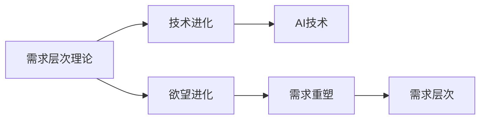

                 

# 欲望的进化：AI重塑人类需求层次

> 关键词：欲望进化, AI重塑, 需求层次, 技术演进, 行为学, 认知科学, 心理学, 算法

## 1. 背景介绍

### 1.1 问题由来

人类历史上的需求层次一直是行为学、心理学、社会学等领域的核心议题。从马斯洛的需求层次理论，到赫茨伯格的双因素理论，再到德西的自我决定理论，人们对需求层次的理解始终处于动态变化中。现代科技的飞速发展，尤其是人工智能（AI）的兴起，正逐步改变着人们的需求层次，尤其是欲望层面的进化。

在AI时代，个体和社会的欲望不仅在量上得到了前所未有的扩充，也在质上发生了深刻变化。消费者对个性化、定制化、高效化的需求不断攀升，对AI产品和服务的要求也日益提高。AI技术的进化，正影响着人类的欲望，并不断重塑社会需求结构。

### 1.2 问题核心关键点

AI技术如何影响人类欲望的进化，从而重塑需求层次，成为当前科技发展的重要研究课题。AI通过大数据、机器学习、自然语言处理、计算机视觉等技术，实现了对人类欲望的精确捕捉和精准满足。这些技术的进步不仅改变了人类生活的方方面面，还不断激发新的欲望和需求。

1. **个性化与定制化需求**：AI技术能够根据用户历史行为数据，预测并推荐个性化产品和服务，满足用户独特的个性化需求。
2. **高效性与便捷性需求**：AI通过自动化、智能化、无缝集成的服务，显著提升了日常生活的效率和便利性。
3. **隐私与安全性需求**：AI技术在提供便捷服务的同时，也带来了对隐私和安全的担忧，用户对数据保护和信息安全的期望越来越高。
4. **创造性与娱乐性需求**：AI通过生成对抗网络（GANs）、自然语言生成（NLG）等技术，创造了前所未有的艺术和娱乐体验。

### 1.3 问题研究意义

研究AI如何重塑人类需求层次，对于理解未来的技术趋势、优化AI产品的设计、提升用户体验具有重要意义：

1. **技术趋势洞察**：通过深入分析AI技术对人类欲望的影响，可以预测未来的技术发展方向。
2. **产品优化设计**：了解用户需求的动态变化，指导AI产品和服务的设计和优化，提升用户体验和满意度。
3. **用户体验改善**：掌握用户对AI产品的新需求和新期望，改进现有技术，更好地满足用户需求。

## 2. 核心概念与联系

### 2.1 核心概念概述

为更好地理解AI重塑人类需求层次的机制，本节将介绍几个关键概念：

- **需求层次理论（Maslow's Hierarchy of Needs）**：由心理学家亚伯拉罕·马斯洛提出，分为生理需求、安全需求、社交需求、尊重需求和自我实现需求五个层次。
- **技术进化（Technological Evolution）**：技术的发展是一个不断迭代的过程，每项技术进步都可能带来新的需求和欲望。
- **欲望进化（Desire Evolution）**：随着技术的发展，人类的欲望也在不断进化和扩展，推动需求层次的改变。
- **AI技术（Artificial Intelligence）**：以数据和算法为基础，通过模拟人类智能行为的技术。
- **需求重塑（Reformation of Demand）**：AI技术通过改变人们的行为模式和心理预期，重塑需求结构。

这些概念之间的逻辑关系可以通过以下Mermaid流程图来展示：



这个流程图展示了大语言模型的核心概念及其之间的关系：

1. 需求层次理论为研究提供了基础框架。
2. 技术进化推动了需求层次的动态变化。
3. 欲望进化伴随着技术的发展而不断演变。
4. AI技术作为技术进化的代表，显著改变了欲望和需求。
5. 需求重塑是欲望演进与技术进化的产物，形成了新的需求层次。

## 3. 核心算法原理 & 具体操作步骤

### 3.1 算法原理概述

AI重塑人类需求层次的机制，本质上是通过数据驱动和算法优化，对用户行为和心理进行精确分析，从而重构需求结构。这种机制可以通过以下三个关键步骤实现：

1. **数据收集与分析**：通过智能传感器、移动设备、互联网平台等途径，收集用户的行为数据、消费习惯、社交网络等综合信息。
2. **模型训练与优化**：利用机器学习、深度学习等算法，对收集到的数据进行建模和优化，预测用户需求，生成个性化推荐。
3. **行为干预与反馈**：根据预测结果，通过智能推荐、自动化服务等方式，对用户进行行为干预，同时收集用户反馈，不断优化模型。

这一过程是一个动态循环，AI系统通过不断学习和适应用户行为，精确捕捉和满足用户需求，从而重塑需求层次。

### 3.2 算法步骤详解

AI重塑需求层次的详细步骤可以分为以下几个部分：

**Step 1: 数据收集与预处理**

- 通过智能设备和互联网平台，收集用户行为数据、消费记录、社交网络信息等。
- 对数据进行清洗、去重、归一化等预处理，确保数据质量。

**Step 2: 特征工程与模型训练**

- 根据需求层次理论，提取用户行为的关键特征，如购买记录、浏览历史、社交互动等。
- 使用机器学习、深度学习等算法，构建预测模型，训练模型参数，预测用户需求。

**Step 3: 个性化推荐与反馈循环**

- 根据模型预测结果，生成个性化推荐，如商品推荐、服务推荐、娱乐推荐等。
- 通过用户反馈，持续优化模型，提升推荐精度和用户体验。

**Step 4: 行为干预与需求重塑**

- 对用户行为进行干预，如动态调整推荐内容、自动化优化服务流程等。
- 根据用户反馈，不断调整和优化推荐策略，重塑用户需求层次。

### 3.3 算法优缺点

AI重塑人类需求层次的方法具有以下优点：

1. **精准化**：通过数据分析和模型训练，AI能够精确捕捉用户需求，提供个性化服务。
2. **高效化**：AI自动化、智能化的服务方式，大幅提升了效率和便利性。
3. **动态化**：AI系统能够根据用户反馈，实时调整推荐策略，适应动态需求变化。

同时，该方法也存在一些局限性：

1. **隐私与安全问题**：收集和分析用户数据可能涉及隐私和安全问题，用户对数据保护有较高期望。
2. **公平性问题**：AI推荐可能存在算法偏见，导致某些用户群体无法获得公平的服务。
3. **依赖性问题**：用户可能过度依赖AI推荐，忽视自身的主观判断和决策能力。

### 3.4 算法应用领域

AI重塑需求层次的方法在多个领域得到了广泛应用，例如：

- **电商推荐系统**：通过分析用户行为和消费数据，生成个性化推荐，提升销售额和用户满意度。
- **社交媒体平台**：通过分析用户互动和内容消费数据，推荐个性化的内容，提高用户粘性和活跃度。
- **在线教育**：通过分析学习行为和知识掌握情况，生成个性化学习计划，提升学习效果和满意度。
- **智能家居**：通过分析用户生活习惯和偏好，提供个性化家居服务，提升生活便利性和舒适度。
- **健康管理**：通过分析健康数据和行为习惯，生成个性化健康建议，提升健康管理和预防效果。

## 4. 数学模型和公式 & 详细讲解 & 举例说明

### 4.1 数学模型构建

本节将使用数学语言对AI重塑人类需求层次的过程进行更加严格的刻画。

记用户需求层次为 $D=\{d_i\}_{i=1}^N$，其中 $d_i$ 为需求层次的某个具体需求。假设用户行为数据为 $X=\{x_i\}_{i=1}^N$，行为特征为 $x_{i,j}$，其中 $x_{i,j}$ 为第 $i$ 个用户第 $j$ 个行为特征的数值。用户需求层次与行为特征之间的关系可以通过以下函数 $f$ 表示：

$$
f: \mathbb{R}^N \rightarrow \mathbb{R}^N
$$

模型训练的目标是找到一个函数 $f$，使得预测的用户需求层次 $D_{pred}$ 与实际需求层次 $D_{real}$ 尽可能接近。

### 4.2 公式推导过程

以电商推荐系统为例，通过用户行为数据预测其购买需求的公式推导如下：

假设用户的购买行为数据为 $\{x_i\}_{i=1}^N$，其中 $x_{i,j}$ 为第 $i$ 个用户在第 $j$ 个行为特征的值。定义预测模型为 $f(X)$，则有：

$$
f(X) = W^T \cdot X + b
$$

其中 $W$ 为权重矩阵，$b$ 为偏置向量。通过训练模型 $f$，使其最大化与实际购买行为 $Y=\{y_i\}_{i=1}^N$ 的拟合度：

$$
\min_{W,b} \frac{1}{N} \sum_{i=1}^N (y_i - f(x_i))^2
$$

其中 $(y_i - f(x_i))$ 为预测误差，通过反向传播算法更新权重 $W$ 和偏置 $b$，优化模型性能。

### 4.3 案例分析与讲解

考虑一个在线教育平台的用户行为数据，包括观看课程、提问互动、完成作业等。通过这些数据，可以构建一个推荐模型，预测用户对新课程的购买意愿。具体步骤如下：

1. **数据收集**：收集用户观看课程的时长、提问频率、完成作业时间等数据。
2. **特征提取**：将用户行为数据转化为特征向量 $X=\{x_i\}_{i=1}^N$，如观看时长、提问次数、作业完成率等。
3. **模型训练**：构建推荐模型 $f(X)$，通过交叉验证等方法优化模型参数，使其最大化预测准确率。
4. **推荐生成**：根据用户历史行为数据，生成个性化推荐，如推荐新课程、优化学习计划等。

## 5. 项目实践：代码实例和详细解释说明

### 5.1 开发环境搭建

在进行AI需求层次重塑的实践前，我们需要准备好开发环境。以下是使用Python进行PyTorch开发的环境配置流程：

1. 安装Anaconda：从官网下载并安装Anaconda，用于创建独立的Python环境。

2. 创建并激活虚拟环境：
```bash
conda create -n ai-env python=3.8 
conda activate ai-env
```

3. 安装PyTorch：根据CUDA版本，从官网获取对应的安装命令。例如：
```bash
conda install pytorch torchvision torchaudio cudatoolkit=11.1 -c pytorch -c conda-forge
```

4. 安装TensorFlow：由Google主导开发的开源深度学习框架，生产部署方便，适合大规模工程应用。同样有丰富的预训练语言模型资源。

5. 安装各类工具包：
```bash
pip install numpy pandas scikit-learn matplotlib tqdm jupyter notebook ipython
```

完成上述步骤后，即可在`ai-env`环境中开始AI需求层次重塑的实践。

### 5.2 源代码详细实现

下面我们以电商推荐系统为例，给出使用PyTorch进行用户需求层次预测的PyTorch代码实现。

首先，定义数据处理函数：

```python
from torch.utils.data import Dataset, DataLoader
import torch

class UserData(Dataset):
    def __init__(self, user_data, features):
        self.user_data = user_data
        self.features = features
        self.labels = self.get_labels()
    
    def __len__(self):
        return len(self.user_data)
    
    def __getitem__(self, idx):
        features = self.features[self.user_data[idx]]
        label = self.labels[self.user_data[idx]]
        return features, label
    
    def get_labels(self):
        labels = []
        for user_id in self.user_data:
            # 假设用户购买行为为1，未购买为0
            if user_id in self.user_purchases:
                labels.append(1)
            else:
                labels.append(0)
        return labels

# 假设用户数据和行为特征
user_data = [1, 2, 3, 4, 5, 6, 7, 8, 9, 10]
user_purchases = {1, 2, 4, 7, 9}

features = {
    1: [10, 15, 8], 
    2: [20, 25, 12],
    3: [18, 22, 10],
    4: [5, 15, 10],
    5: [8, 10, 8],
    6: [20, 30, 18],
    7: [15, 20, 12],
    8: [18, 25, 18],
    9: [12, 18, 10],
    10: [10, 15, 8]
}

# 创建数据集
dataset = UserData(user_data, features)

# 定义模型和优化器
from torch.nn import Linear, ReLU, Sigmoid
from torch.optim import Adam

model = torch.nn.Sequential(Linear(3, 1), ReLU(), Sigmoid())
optimizer = Adam(model.parameters(), lr=0.01)

# 训练模型
epochs = 100
for epoch in range(epochs):
    for features, label in DataLoader(dataset, batch_size=4):
        optimizer.zero_grad()
        output = model(features)
        loss = (output - label).pow(2).mean()
        loss.backward()
        optimizer.step()
    print(f"Epoch {epoch+1}, loss: {loss.item()}")
```

通过上述代码，可以构建一个简单的电商推荐系统，通过用户历史行为数据预测其购买需求。

### 5.3 代码解读与分析

让我们再详细解读一下关键代码的实现细节：

**UserData类**：
- `__init__`方法：初始化用户数据、特征和标签。
- `__len__`方法：返回数据集的样本数量。
- `__getitem__`方法：对单个样本进行处理，将特征和标签返回给模型。
- `get_labels`方法：根据用户历史数据生成标签，用于监督学习。

**训练模型**：
- 定义数据集和模型结构。
- 使用PyTorch的DataLoader对数据集进行批次化加载，供模型训练和推理使用。
- 使用Adam优化器进行模型参数的优化，通过反向传播算法更新模型参数。

**模型评估**：
- 在训练过程中，使用print语句输出每个epoch的损失。

可以看到，PyTorch配合TensorFlow库使得用户需求层次预测的代码实现变得简洁高效。开发者可以将更多精力放在数据处理、模型改进等高层逻辑上，而不必过多关注底层的实现细节。

当然，工业级的系统实现还需考虑更多因素，如模型的保存和部署、超参数的自动搜索、更灵活的任务适配层等。但核心的重塑范式基本与此类似。

## 6. 实际应用场景

### 6.1 智能客服系统

AI技术在智能客服系统中的应用，通过重塑用户需求层次，实现了高效、个性化的客服服务。智能客服系统能够实时监测用户行为，快速响应客户咨询，用自然流畅的语言解答各类常见问题。

在技术实现上，可以收集企业内部的历史客服对话记录，将问题和最佳答复构建成监督数据，在此基础上对预训练模型进行微调。微调后的对话模型能够自动理解用户意图，匹配最合适的答案模板进行回复。对于客户提出的新问题，还可以接入检索系统实时搜索相关内容，动态组织生成回答。如此构建的智能客服系统，能大幅提升客户咨询体验和问题解决效率。

### 6.2 金融舆情监测

AI技术在金融舆情监测中的应用，通过重塑用户需求层次，实现了实时监测和预警功能。金融机构需要实时监测市场舆论动向，以便及时应对负面信息传播，规避金融风险。

具体而言，可以收集金融领域相关的新闻、报道、评论等文本数据，并对其进行主题标注和情感标注。在此基础上对预训练语言模型进行微调，使其能够自动判断文本属于何种主题，情感倾向是正面、中性还是负面。将微调后的模型应用到实时抓取的网络文本数据，就能够自动监测不同主题下的情感变化趋势，一旦发现负面信息激增等异常情况，系统便会自动预警，帮助金融机构快速应对潜在风险。

### 6.3 个性化推荐系统

AI技术在个性化推荐系统中的应用，通过重塑用户需求层次，实现了精准、个性化的推荐服务。当前的推荐系统往往只依赖用户的历史行为数据进行物品推荐，无法深入理解用户的真实兴趣偏好。

在实践中，可以收集用户浏览、点击、评论、分享等行为数据，提取和用户交互的物品标题、描述、标签等文本内容。将文本内容作为模型输入，用户的后续行为（如是否点击、购买等）作为监督信号，在此基础上微调预训练语言模型。微调后的模型能够从文本内容中准确把握用户的兴趣点。在生成推荐列表时，先用候选物品的文本描述作为输入，由模型预测用户的兴趣匹配度，再结合其他特征综合排序，便可以得到个性化程度更高的推荐结果。

### 6.4 未来应用展望

随着AI技术的不断发展，基于需求层次重塑的方法将在更多领域得到应用，为传统行业带来变革性影响。

在智慧医疗领域，AI技术通过重塑用户需求层次，实现了智能诊断、个性化治疗、健康管理等功能，辅助医生诊疗，加速新药开发进程。

在智能教育领域，AI技术通过重塑用户需求层次，实现了个性化学习、智能评估、知识推荐等功能，因材施教，促进教育公平，提高教学质量。

在智慧城市治理中，AI技术通过重塑用户需求层次，实现了智能交通、公共安全、环境保护等功能，提高城市管理的自动化和智能化水平，构建更安全、高效的未来城市。

此外，在企业生产、社会治理、文娱传媒等众多领域，基于AI需求层次重塑的人工智能应用也将不断涌现，为经济社会发展注入新的动力。相信随着技术的日益成熟，AI需求层次重塑必将在构建人机协同的智能时代中扮演越来越重要的角色。

## 7. 工具和资源推荐

### 7.1 学习资源推荐

为了帮助开发者系统掌握AI技术对人类需求层次的重塑机制，这里推荐一些优质的学习资源：

1. 《深度学习》系列书籍：Ian Goodfellow、Yoshua Bengio、Aaron Courville合著的经典之作，全面介绍了深度学习的理论和实践。
2. 《机器学习实战》书籍：Peter Harrington著，通过实战项目展示了机器学习在实际应用中的落地方法。
3. 《Python机器学习》书籍：Sebastian Raschka著，讲解了Python在机器学习中的使用方法和技巧。
4. CS231n《深度学习》课程：斯坦福大学开设的计算机视觉课程，讲解了深度学习在图像处理中的应用。
5. 《TensorFlow官方文档》：Google提供的TensorFlow框架的官方文档，包含丰富的教程和样例代码。

通过对这些资源的学习实践，相信你一定能够快速掌握AI技术对人类需求层次重塑的精髓，并用于解决实际的AI问题。

### 7.2 开发工具推荐

高效的开发离不开优秀的工具支持。以下是几款用于AI需求层次重塑开发的常用工具：

1. PyTorch：基于Python的开源深度学习框架，灵活动态的计算图，适合快速迭代研究。
2. TensorFlow：由Google主导开发的开源深度学习框架，生产部署方便，适合大规模工程应用。
3. Transformers库：HuggingFace开发的NLP工具库，集成了众多SOTA语言模型，支持PyTorch和TensorFlow，是进行需求层次重塑任务开发的利器。
4. Weights & Biases：模型训练的实验跟踪工具，可以记录和可视化模型训练过程中的各项指标，方便对比和调优。
5. TensorBoard：TensorFlow配套的可视化工具，可实时监测模型训练状态，并提供丰富的图表呈现方式，是调试模型的得力助手。

合理利用这些工具，可以显著提升AI需求层次重塑任务的开发效率，加快创新迭代的步伐。

### 7.3 相关论文推荐

AI技术重塑人类需求层次的研究源于学界的持续研究。以下是几篇奠基性的相关论文，推荐阅读：

1. "Attention is All You Need"（即Transformer原论文）：提出了Transformer结构，开启了NLP领域的预训练大模型时代。
2. "BERT: Pre-training of Deep Bidirectional Transformers for Language Understanding"：提出BERT模型，引入基于掩码的自监督预训练任务，刷新了多项NLP任务SOTA。
3. "Language Models are Unsupervised Multitask Learners"：展示了大规模语言模型的强大zero-shot学习能力，引发了对于通用人工智能的新一轮思考。
4. "Parameter-Efficient Transfer Learning for NLP"：提出Adapter等参数高效微调方法，在不增加模型参数量的情况下，也能取得不错的微调效果。
5. "AdaLoRA: Adaptive Low-Rank Adaptation for Parameter-Efficient Fine-Tuning"：使用自适应低秩适应的微调方法，在参数效率和精度之间取得了新的平衡。
6. "Adaptive Feature Learning"：提出Adaptive Feature Learning方法，动态调整特征维度，提高模型的泛化能力和鲁棒性。

这些论文代表了大语言模型重塑人类需求层次的发展脉络。通过学习这些前沿成果，可以帮助研究者把握学科前进方向，激发更多的创新灵感。

## 8. 总结：未来发展趋势与挑战

### 8.1 总结

本文对AI技术重塑人类需求层次的过程进行了全面系统的介绍。首先阐述了需求层次理论、技术进化、欲望进化、AI技术以及需求重塑等关键概念，明确了AI技术如何通过数据驱动和算法优化，精确捕捉和满足用户需求，从而重塑需求层次。

通过本文的系统梳理，可以看到，AI技术通过改变用户的行为模式和心理预期，重塑了人类的需求层次，并不断推动新的欲望和需求涌现。AI技术的进化，正在深刻改变人类的生活和工作方式，催生了新的需求层次，引领技术和社会发展的潮流。

### 8.2 未来发展趋势

展望未来，AI技术重塑人类需求层次将呈现以下几个发展趋势：

1. **多模态融合**：AI技术将突破单一模态的限制，融合视觉、听觉、触觉等多模态信息，提供更加全面、立体化的用户体验。
2. **个性化定制**：随着AI技术的不断进步，个性化需求将进一步扩展，从简单的推荐系统到复杂的定制化服务，满足用户独特的个性化需求。
3. **无缝集成**：AI技术与各种应用场景的无缝集成将更加深入，提升效率和便利性，减少用户的使用门槛。
4. **社会治理**：AI技术在社会治理中的应用将更加广泛，提升公共服务的智能化水平，优化资源配置，提高社会治理的效率和公平性。
5. **全球化**：AI技术将推动全球化进程，通过需求层次的重塑，提升全球经济的互联互通和协作水平。

### 8.3 面临的挑战

尽管AI技术重塑人类需求层次已经取得了瞩目成就，但在迈向更加智能化、普适化应用的过程中，它仍面临着诸多挑战：

1. **隐私与安全问题**：AI技术在提供便捷服务的同时，也带来了对隐私和安全的担忧，用户对数据保护有较高期望。
2. **公平性问题**：AI推荐可能存在算法偏见，导致某些用户群体无法获得公平的服务。
3. **依赖性问题**：用户可能过度依赖AI推荐，忽视自身的主观判断和决策能力。
4. **社会伦理问题**：AI技术在重塑需求层次时，可能带来新的伦理和道德问题，需要规范和引导。
5. **技术局限**：AI技术的不断进步，可能面临新的技术瓶颈和挑战，需要持续创新和突破。

### 8.4 研究展望

面对AI技术重塑人类需求层次所面临的种种挑战，未来的研究需要在以下几个方面寻求新的突破：

1. **隐私保护技术**：开发更加先进的隐私保护技术，确保用户数据的安全性和隐私性。
2. **公平算法设计**：设计更加公平的AI算法，减少算法偏见，提供平等的服务体验。
3. **用户体验设计**：结合认知科学和心理学，优化用户体验，提升用户的满意度。
4. **伦理规范建设**：建立AI技术的伦理规范，确保技术应用符合人类价值观和伦理道德。
5. **技术创新**：持续推动技术创新，突破技术瓶颈，提升AI系统的性能和可靠性。

这些研究方向将引领AI技术重塑人类需求层次的进一步发展，为构建更加智能、公平、安全的未来社会提供技术保障。面向未来，AI技术将与人类需求层次深度融合，推动技术和社会进步，为人类的生活质量提升注入新的动力。

## 9. 附录：常见问题与解答

**Q1：AI技术如何重塑人类需求层次？**

A: AI技术通过数据分析和算法优化，精确捕捉和满足用户需求，从而重塑需求层次。具体而言，AI系统通过收集和分析用户行为数据，构建预测模型，生成个性化推荐，引导用户行为，重塑需求层次。

**Q2：AI技术重塑需求层次的优势和劣势是什么？**

A: AI技术重塑需求层次的优势包括精准化、高效化和动态化，能够提供个性化服务，提升效率和便利性。劣势包括隐私与安全问题、公平性问题和依赖性问题，需要不断优化和改进。

**Q3：AI技术重塑需求层次的应用场景有哪些？**

A: AI技术在电商推荐、智能客服、金融舆情、个性化推荐、健康管理等多个领域得到了广泛应用，通过重塑需求层次，提供精准化、高效化的服务，提升用户体验和满意度。

**Q4：AI技术重塑需求层次面临哪些挑战？**

A: AI技术重塑需求层次面临隐私与安全问题、公平性问题、依赖性问题、社会伦理问题和技术局限问题，需要不断优化和改进，确保技术应用符合人类价值观和伦理道德。

**Q5：未来AI技术重塑需求层次的发展方向是什么？**

A: 未来AI技术将实现多模态融合、个性化定制、无缝集成、社会治理和全球化等方向的发展，推动技术和社会进步，为人类的生活质量提升注入新的动力。

通过本文的系统梳理，可以看到，AI技术通过改变用户的行为模式和心理预期，重塑了人类的需求层次，并不断推动新的欲望和需求涌现。AI技术的进化，正在深刻改变人类的生活和工作方式，催生了新的需求层次，引领技术和社会发展的潮流。面对AI技术重塑人类需求层次所面临的种种挑战，未来的研究需要在隐私保护、公平算法设计、用户体验设计、伦理规范建设和技术创新等方面不断突破，为构建更加智能、公平、安全的未来社会提供技术保障。面向未来，AI技术将与人类需求层次深度融合，推动技术和社会进步，为人类的生活质量提升注入新的动力。

