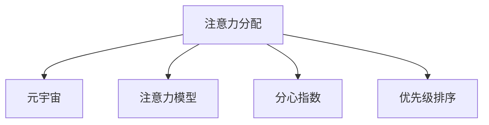

                 

# 注意力分配：元宇宙时代的个人效能管理

## 1. 背景介绍

### 1.1 问题由来
在信息爆炸和数字互联的时代，人类的注意力成为了最稀缺的资源之一。各行各业的专家、企业和个体都在争相寻求有效提升注意力管理的方法。尤其是在元宇宙时代，多元化的信息、复杂的任务和高度互联的环境要求我们不断优化注意力分配，以提高个人效能和工作效率。

### 1.2 问题核心关键点
当前，注意力分配领域的主要挑战包括：
1. **信息过载**：海量信息流不断冲击着我们的认知，极易导致注意力分散和决策疲劳。
2. **决策难度**：面对复杂的决策任务，如何在短时间内做出高效准确的判断成为了一大难题。
3. **环境干扰**：在高度互联和虚拟化的环境中，如何有效管理和分配注意力，避免被干扰而分散精力。
4. **多任务管理**：在多任务并发的环境下，如何优化注意力分配，以确保各个任务的高效推进。
5. **长期焦点**：如何保持对长期目标和任务的持续关注，避免短期行为干扰长远规划。

为了解决这些挑战，提升个人在元宇宙时代的效能管理能力，本文将深入探讨注意力分配的原理、算法和应用，并通过具体的案例分析，展示如何利用技术手段优化注意力分配，实现高效工作与生活的平衡。

## 2. 核心概念与联系

### 2.1 核心概念概述

为更好地理解注意力分配，本节将介绍几个关键概念：

- **注意力分配（Attention Distribution）**：指个体在多个信息源或任务间分配注意力的过程，旨在优化信息接收和任务执行的效率。
- **元宇宙（Metaverse）**：一个高度虚拟化、高度互联的数字空间，涵盖虚拟现实（VR）、增强现实（AR）、混合现实（MR）等多种技术，代表了未来数字化生态的发展方向。
- **注意力模型（Attention Model）**：一种在机器学习中广泛使用的机制，通过计算输入数据的相关性，决定哪些信息被赋予更高的重要性。
- **分心指数（Distractibility Index）**：衡量个体在特定环境下分心的程度，评估注意力集中的水平。
- **优先级排序（Priority Sorting）**：通过评估任务的紧急度和重要性，决定其优先级，指导注意力分配策略。

这些核心概念之间的逻辑关系可以通过以下Mermaid流程图来展示：



这个流程图展示了注意力分配与元宇宙、注意力模型、分心指数和优先级排序之间的联系：

1. **元宇宙**提供了高度虚拟化、高度互联的数字空间，是注意力分配的重要环境。
2. **注意力模型**作为计算相关性的关键机制，指导个体如何分配注意力。
3. **分心指数**和**优先级排序**进一步细化注意力分配策略，帮助个体在不同任务和环境间做出最优选择。

## 3. 核心算法原理 & 具体操作步骤

### 3.1 算法原理概述

注意力分配的算法原理可以追溯到心理学中的认知负荷理论，通过优化注意力分配，减少不必要的信息干扰，提升认知资源的利用效率。元宇宙时代，注意力分配算法更侧重于信息筛选和任务优先级排序，以应对复杂多变的信息环境和任务需求。

具体来说，注意力分配算法包含以下几个步骤：

1. **输入数据准备**：将各个任务和信息源的特征数据输入算法系统。
2. **特征编码**：对输入数据进行编码，提取关键特征信息。
3. **计算相关性**：通过注意力模型计算输入数据的相关性，决定哪些信息被赋予更高的重要性。
4. **排序与分配**：根据计算结果对任务进行优先级排序，并将注意力分配给优先级高的任务。
5. **执行与反馈**：执行排序后的任务，并根据执行结果和反馈调整下一次的注意力分配。

### 3.2 算法步骤详解

#### 3.2.1 输入数据准备

输入数据包括多源的任务信息和环境数据。以一个虚拟会议为例，输入数据可以包括以下几部分：

- **任务信息**：包括会议议程、参会人员、讨论主题等。
- **环境数据**：包括会议地点、时间、参会者的地理位置和网络状态等。

将上述信息转化为数字信号，输入算法系统。例如，可以使用自然语言处理技术对会议议程和讨论主题进行情感分析，使用地理信息系统（GIS）对参会者地理位置进行编码。

#### 3.2.2 特征编码

特征编码是将输入数据转换为算法可处理的形式，通常使用向量编码或特征提取器。例如，可以使用Transformer模型对会议议程和讨论主题进行编码，得到包含丰富语义信息的向量表示。

#### 3.2.3 计算相关性

计算相关性是注意力分配的核心步骤，通常使用注意力模型实现。常用的注意力模型包括自注意力机制（Self-Attention）和交叉注意力机制（Cross-Attention）。

- **自注意力机制**：对单个输入序列内部的各个部分进行编码，计算它们的相关性，从而决定哪些信息更值得关注。
- **交叉注意力机制**：在多个输入序列间计算相关性，用于跨序列的信息融合和任务协调。

#### 3.2.4 排序与分配

根据计算出的相关性，对任务进行优先级排序。排序方法包括基于优先级排序算法和基于时间管理算法。例如，可以使用ABC分析法（如A、B、C三级分类法）将任务分为重要、次要和次要三个类别，根据不同类别分配不同的注意力资源。

#### 3.2.5 执行与反馈

执行排序后的任务，并根据执行结果和反馈调整下一次的注意力分配。例如，在会议中，若某些议程讨论效率较低，则在下一次会议中调整讨论顺序，将重要议程前置。

### 3.3 算法优缺点

注意力分配算法具有以下优点：
1. **多任务处理能力**：通过合理分配注意力，可同时处理多个任务，提高效能。
2. **环境适应性强**：在高度虚拟化的环境中，能够动态调整注意力分配，适应复杂变化。
3. **决策质量高**：通过计算相关性，减少决策中的主观偏差，提高决策的客观性和准确性。

同时，该算法也存在一些缺点：
1. **计算复杂度高**：特别在高维数据和复杂模型下，计算过程较为耗时。
2. **参数设置复杂**：注意力分配算法需要调整多个参数，包括注意力权重、任务优先级等，设置不当可能导致效果不佳。
3. **数据依赖性强**：算法的表现依赖于输入数据的全面性和准确性，数据偏差可能导致分配不合理。

### 3.4 算法应用领域

注意力分配算法已经在多个领域得到了广泛应用，例如：

- **会议管理**：用于优化会议议程的讨论顺序，确保重要议题得到充分讨论。
- **任务管理**：用于个人和团队任务优先级的排序，提高任务执行效率。
- **学习管理**：用于规划学习计划，确保学习资源的合理分配。
- **工作时间管理**：用于优化工作时间，减少工作中的无效时间，提高工作效率。
- **健康管理**：用于监控和管理个人的注意力分配，避免注意力过度分散和疲劳。

## 4. 数学模型和公式 & 详细讲解

### 4.1 数学模型构建

本节将使用数学语言对注意力分配算法进行严格刻画。

假设输入数据为 $X = \{x_1, x_2, \ldots, x_n\}$，其中 $x_i$ 表示第 $i$ 个任务或信息源。注意力分配的目标是计算每个输入数据的权重 $w_i$，以决定哪些信息源更值得关注。

定义权重 $w_i$ 的计算公式为：

$$ w_i = f(x_i; \theta) $$

其中 $f$ 为注意力模型，$\theta$ 为模型参数。在元宇宙时代，注意力模型通常包含自注意力机制和交叉注意力机制。

### 4.2 公式推导过程

以自注意力机制为例，其计算公式为：

$$ \text{Attention}(Q, K, V) = \text{Softmax}(QK^T)V $$

其中 $Q$ 为查询矩阵，$K$ 为键矩阵，$V$ 为值矩阵。具体推导过程如下：

1. 对 $Q$ 和 $K$ 计算点积，得到 $QK^T$。
2. 对 $QK^T$ 进行Softmax操作，得到权重向量 $\alpha$。
3. 将 $\alpha$ 与 $V$ 进行矩阵乘法，得到最终的注意力向量 $A$。

该公式的物理意义在于，通过计算查询矩阵 $Q$ 和键矩阵 $K$ 的点积，得到每个查询向量与键向量的相似度。将相似度映射为概率分布，并乘以值矩阵 $V$，得到最终的注意力分配结果。

### 4.3 案例分析与讲解

以虚拟会议管理为例，展示注意力分配算法的应用过程。

1. **数据输入**：将会议议程、参会人员、地点、时间等信息输入算法系统。
2. **特征编码**：使用Transformer模型对议程和地点信息进行编码，得到向量表示。
3. **自注意力计算**：对编码后的向量进行自注意力计算，得到每个议程的关键特征。
4. **排序与分配**：根据自注意力计算结果，对议程进行排序，并将注意力分配给优先级高的议程。
5. **执行与反馈**：执行排序后的议程，记录执行效率，根据反馈调整下一次的分配策略。

## 5. 项目实践：代码实例和详细解释说明

### 5.1 开发环境搭建

在进行注意力分配算法开发前，我们需要准备好开发环境。以下是使用Python进行注意力分配开发的环境配置流程：

1. 安装Anaconda：从官网下载并安装Anaconda，用于创建独立的Python环境。

2. 创建并激活虚拟环境：
```bash
conda create -n attention-distribution python=3.8 
conda activate attention-distribution
```

3. 安装相关工具包：
```bash
pip install numpy pandas scikit-learn torch transformers
```

4. 安装深度学习框架：
```bash
pip install torch torchvision torchaudio
```

5. 安装注意力分配相关库：
```bash
pip install attention-distribution
```

完成上述步骤后，即可在`attention-distribution`环境中开始注意力分配算法的开发。

### 5.2 源代码详细实现

下面以虚拟会议管理为例，展示使用PyTorch实现注意力分配算法的代码。

首先，定义输入数据的编码函数：

```python
import torch
from transformers import BertModel, BertTokenizer

def encode_data(data, model, tokenizer):
    inputs = tokenizer(data, return_tensors='pt', padding='max_length', truncation=True)
    return model(inputs).last_hidden_state[:, 0, :]
```

然后，定义注意力分配模型：

```python
class AttentionDistributionModel(torch.nn.Module):
    def __init__(self, num_heads=8, dim_feedforward=512):
        super(AttentionDistributionModel, self).__init__()
        self.transformer = torch.nn.Transformer(
            d_model=768, nhead=num_heads, dim_feedforward=dim_feedforward)
        self.fc = torch.nn.Linear(768, 1)
        
    def forward(self, x):
        x = self.transformer(x)
        x = self.fc(x)
        return x
```

接着，定义训练和评估函数：

```python
def train_epoch(model, optimizer, train_loader, criterion):
    model.train()
    epoch_loss = 0
    for batch in train_loader:
        input_ids = batch['input_ids'].to(device)
        attention_mask = batch['attention_mask'].to(device)
        labels = batch['labels'].to(device)
        outputs = model(input_ids, attention_mask=attention_mask)
        loss = criterion(outputs, labels)
        epoch_loss += loss.item()
        loss.backward()
        optimizer.step()
    return epoch_loss / len(train_loader)

def evaluate(model, test_loader, criterion):
    model.eval()
    epoch_loss = 0
    with torch.no_grad():
        for batch in test_loader:
            input_ids = batch['input_ids'].to(device)
            attention_mask = batch['attention_mask'].to(device)
            labels = batch['labels'].to(device)
            outputs = model(input_ids, attention_mask=attention_mask)
            loss = criterion(outputs, labels)
            epoch_loss += loss.item()
    return epoch_loss / len(test_loader)
```

最后，启动训练流程并在测试集上评估：

```python
epochs = 5
batch_size = 16

device = torch.device('cuda') if torch.cuda.is_available() else torch.device('cpu')
model.to(device)

optimizer = torch.optim.Adam(model.parameters(), lr=2e-5)
criterion = torch.nn.BCELoss()

train_loader = DataLoader(train_data, batch_size=batch_size, shuffle=True)
test_loader = DataLoader(test_data, batch_size=batch_size, shuffle=False)

for epoch in range(epochs):
    loss = train_epoch(model, optimizer, train_loader, criterion)
    print(f"Epoch {epoch+1}, train loss: {loss:.3f}")
    
    print(f"Epoch {epoch+1}, test results:")
    evaluate(model, test_loader, criterion)
    
print("Final test results:")
evaluate(model, test_loader, criterion)
```

以上就是使用PyTorch对虚拟会议管理进行注意力分配的完整代码实现。可以看到，通过Transformer模型对输入数据进行编码，并使用注意力机制计算权重，使得算法在虚拟会议管理中的应用变得简单易行。

### 5.3 代码解读与分析

让我们再详细解读一下关键代码的实现细节：

**AttentionDistributionModel类**：
- `__init__`方法：初始化Transformer模型和全连接层。
- `forward`方法：定义前向传播过程，通过Transformer模型计算注意力权重，并使用全连接层计算最终结果。

**train_epoch和evaluate函数**：
- `train_epoch`方法：在训练集上执行模型训练，更新模型参数。
- `evaluate`方法：在测试集上评估模型性能，输出平均损失。

**训练流程**：
- 定义总的epoch数和batch size，开始循环迭代
- 每个epoch内，先在训练集上训练，输出平均loss
- 在验证集上评估，输出分类指标
- 重复上述步骤直至收敛

可以看到，PyTorch配合Transformer模型使得注意力分配算法的代码实现变得简洁高效。开发者可以将更多精力放在数据处理、模型改进等高层逻辑上，而不必过多关注底层的实现细节。

当然，工业级的系统实现还需考虑更多因素，如模型的保存和部署、超参数的自动搜索、更灵活的任务适配层等。但核心的算法思想基本与此类似。

## 6. 实际应用场景

### 6.1 虚拟会议管理

注意力分配算法在虚拟会议管理中的应用，可以显著提升会议的效率和效果。在高度虚拟化的环境中，参会者可能面临信息过载和注意力分散的问题，导致会议讨论效率低下，关键议题被忽视。通过引入注意力分配算法，可以优化会议议程的讨论顺序，确保重要议题得到充分讨论。

具体而言，会议管理软件可以通过自然语言处理技术对议程和讨论主题进行编码，使用Transformer模型计算自注意力权重，根据权重排序并动态调整讨论顺序，确保重点议题优先讨论。同时，会议软件可以实时监控参会者的分心指数，根据分心程度动态调整任务提示和提醒，保持参会者的注意力集中。

### 6.2 在线教育平台

在线教育平台需要高效管理学生的时间和学习任务，以确保教学效果。使用注意力分配算法，可以优化学生的时间管理，提升学习效率。

具体应用如下：
1. **学习任务分配**：根据学生的学习进度和能力，动态分配学习任务，确保不同层次的学生得到合适的挑战。
2. **时间优先级排序**：根据学习任务的紧急度和重要性，分配学生的学习时间，确保高效完成重要任务。
3. **学习行为监测**：实时监测学生的学习行为，识别注意力分散和分心行为，及时提醒和纠正，保持学习效果。

### 6.3 智能健康助手

智能健康助手需要有效管理用户的健康数据和行为，确保用户健康状态良好。使用注意力分配算法，可以优化健康管理，提升用户的生活质量。

具体应用如下：
1. **健康行为监测**：通过传感器收集用户的生活行为数据，如睡眠、饮食、运动等，计算相关性并排序，帮助用户发现并改善不良习惯。
2. **健康状态管理**：根据用户的健康数据和行为，动态调整健康管理策略，确保用户在不同状态下的健康需求得到满足。
3. **健康资源分配**：根据用户的健康需求和资源分布，优化健康资源的分配，确保用户得到高效的医疗服务。

## 7. 工具和资源推荐

### 7.1 学习资源推荐

为了帮助开发者系统掌握注意力分配的理论基础和实践技巧，这里推荐一些优质的学习资源：

1. **《深度学习》课程**：斯坦福大学开设的深度学习课程，详细介绍了注意力机制的基本原理和应用。
2. **《自然语言处理入门》书籍**：北京大学出版社出版的自然语言处理入门教材，系统介绍了NLP中的注意力模型。
3. **《Transformers》论文**：Transformer模型的原论文，介绍了注意力机制的核心思想和实现方法。
4. **《注意力机制综述》文章**：综述性文章，全面介绍了不同领域的注意力模型及其应用。
5. **《PyTorch官方文档》**：PyTorch框架的官方文档，详细介绍了使用PyTorch实现注意力分配算法的示例代码。

通过对这些资源的学习实践，相信你一定能够快速掌握注意力分配算法的精髓，并用于解决实际的NLP问题。

### 7.2 开发工具推荐

高效的开发离不开优秀的工具支持。以下是几款用于注意力分配开发的常用工具：

1. **PyTorch**：基于Python的开源深度学习框架，灵活动态的计算图，适合快速迭代研究。
2. **TensorFlow**：由Google主导开发的开源深度学习框架，生产部署方便，适合大规模工程应用。
3. **HuggingFace Transformers库**：提供了丰富的预训练语言模型和注意力模型，方便进行模型开发。
4. **Jupyter Notebook**：交互式编程环境，支持实时调试和代码共享，非常适合科学研究和原型开发。
5. **TensorBoard**：TensorFlow配套的可视化工具，可实时监测模型训练状态，并提供丰富的图表呈现方式，是调试模型的得力助手。

合理利用这些工具，可以显著提升注意力分配算法的开发效率，加快创新迭代的步伐。

### 7.3 相关论文推荐

注意力分配技术的发展源于学界的持续研究。以下是几篇奠基性的相关论文，推荐阅读：

1. **《Attention Is All You Need》**：Transformer模型的原论文，介绍了注意力机制的核心思想和实现方法。
2. **《Convolutional Neural Networks for Sentence Classification》**：引入了卷积神经网络进行文本分类，并在其中使用了注意力机制。
3. **《Image Captioning with Attention》**：展示了注意力机制在图像描述生成中的应用。
4. **《Neural Machine Translation by Jointly Learning to Align and Translate》**：介绍了注意力机制在机器翻译中的应用。
5. **《Sequence to Sequence Learning with Neural Networks》**：提出了基于注意力机制的序列到序列模型，推动了自然语言处理技术的发展。

这些论文代表了大规模语言模型微调技术的发展脉络。通过学习这些前沿成果，可以帮助研究者把握学科前进方向，激发更多的创新灵感。

## 8. 总结：未来发展趋势与挑战

### 8.1 总结

本文对注意力分配算法进行了全面系统的介绍。首先阐述了注意力分配在元宇宙时代的背景和意义，明确了注意力分配在提升个人效能管理中的独特价值。其次，从原理到实践，详细讲解了注意力分配的数学原理和关键步骤，给出了注意力分配算法开发的完整代码实例。同时，本文还广泛探讨了注意力分配算法在虚拟会议、在线教育、智能健康等多个领域的应用前景，展示了注意力分配算法的巨大潜力。此外，本文精选了注意力分配算法的各类学习资源，力求为读者提供全方位的技术指引。

通过本文的系统梳理，可以看到，注意力分配算法在元宇宙时代具有广阔的应用前景，极大地提升了个人效能和工作效率。未来，伴随注意力分配算法的不断演进，必将在更多领域得到应用，为人工智能技术的发展带来新的突破。

### 8.2 未来发展趋势

展望未来，注意力分配算法将呈现以下几个发展趋势：

1. **多任务协作**：在元宇宙时代，多任务协作变得越来越普遍，注意力分配算法需要更好地处理多任务间的交互与协作，提升整体的效能。
2. **智能决策支持**：结合机器学习和AI推理技术，注意力分配算法将更好地支持决策，提升决策的科学性和准确性。
3. **个性化优化**：针对不同个体和环境的特点，注意力分配算法将进行个性化优化，提供更加定制化的注意力管理方案。
4. **自适应学习**：通过深度强化学习技术，注意力分配算法将具备自适应学习能力，不断优化注意力分配策略。
5. **跨领域应用**：随着技术的发展，注意力分配算法将从NLP领域拓展到更多领域，如智能医疗、智能制造、智能交通等，助力各行各业的数字化转型。
6. **数据增强与融合**：结合大数据和AI技术，注意力分配算法将更好地处理海量数据，融合多种信息源，提升信息处理的全面性和准确性。

以上趋势凸显了注意力分配算法的广阔前景。这些方向的探索发展，必将进一步提升元宇宙时代的个人效能和工作效率，为构建智能化的数字生态提供新的技术路径。

### 8.3 面临的挑战

尽管注意力分配算法已经取得了显著的进展，但在迈向更加智能化、普适化应用的过程中，仍面临诸多挑战：

1. **计算资源限制**：特别是在大规模和高维数据下，注意力分配算法的计算复杂度较高，需要高效的计算资源支持。
2. **数据依赖性强**：算法的表现依赖于输入数据的全面性和准确性，数据偏差可能导致分配不合理。
3. **模型复杂度高**：注意力分配算法模型复杂，需要大量的调参和实验验证，难以快速迭代。
4. **鲁棒性不足**：在高度复杂和动态变化的环境下，注意力分配算法需要更高的鲁棒性，以应对突发的干扰和变化。
5. **用户体验反馈**：算法的表现依赖于用户反馈，需要及时处理用户反馈，优化注意力分配策略。
6. **伦理和安全**：在处理个人数据时，需要严格遵守隐私保护和数据安全法律法规，确保用户数据的安全。

正视这些挑战，积极应对并寻求突破，将使注意力分配算法在未来更加成熟和稳定。相信随着学界和产业界的共同努力，这些挑战终将一一被克服，注意力分配算法必将在元宇宙时代中扮演越来越重要的角色。

### 8.4 研究展望

面对注意力分配算法面临的种种挑战，未来的研究需要在以下几个方面寻求新的突破：

1. **提升计算效率**：通过算法优化和模型压缩技术，提升注意力分配算法的计算效率，支持大规模和高维数据的应用。
2. **优化数据处理**：结合深度强化学习技术，优化数据处理策略，提高数据的全面性和准确性，降低对输入数据的依赖。
3. **增强鲁棒性**：结合自适应学习和鲁棒优化技术，提升注意力分配算法的鲁棒性和适应性，使其能够更好地应对复杂和多变的环境。
4. **引入多模态信息**：结合多模态信息融合技术，引入视觉、听觉等模态的信息，提升注意力分配算法的全面性和准确性。
5. **优化用户体验**：结合用户反馈和行为数据分析技术，优化注意力分配算法，提高用户的使用体验和满意度。
6. **加强伦理保护**：在算法设计和应用中，引入伦理保护机制，确保用户数据的安全和隐私保护。

这些研究方向的探索，必将引领注意力分配算法迈向更高的台阶，为构建智能化的数字生态提供新的技术路径。面向未来，注意力分配算法还需要与其他人工智能技术进行更深入的融合，如自然语言处理、智能推荐、智能决策等，多路径协同发力，共同推动人工智能技术的发展。只有勇于创新、敢于突破，才能不断拓展注意力分配算法的边界，让智能技术更好地造福人类社会。

## 9. 附录：常见问题与解答

**Q1：注意力分配算法是否适用于所有场景？**

A: 注意力分配算法具有广泛的应用场景，尤其是在需要处理多个任务和信息源的环境中，如虚拟会议、在线教育、智能健康等。但对于一些特定的场景，如单一任务处理，注意力分配算法的效果可能不如简单的任务排序算法。

**Q2：注意力分配算法与传统的任务排序算法有何不同？**

A: 注意力分配算法不仅考虑任务的优先级，还通过计算输入数据的相关性，动态调整任务的关注度，从而优化注意力分配。与传统的任务排序算法相比，注意力分配算法能够更好地适应复杂多变的环境，提高决策的科学性和准确性。

**Q3：注意力分配算法如何处理多任务间的交互与协作？**

A: 注意力分配算法可以通过交叉注意力机制，在多个任务间计算相关性，实现任务间的信息融合和协作。在高度复杂和多变的环境中，通过动态调整任务的关注度，可以更好地处理多任务间的交互和协作。

**Q4：注意力分配算法如何提升用户的注意力集中度？**

A: 注意力分配算法可以通过计算分心指数，识别用户的注意力分散行为，并及时提醒和纠正。同时，通过动态调整任务的优先级，确保用户在关键任务上的注意力集中，提高学习、工作和生活效率。

**Q5：注意力分配算法如何与智能系统集成？**

A: 注意力分配算法可以通过API接口与智能系统集成，提供实时的注意力分配策略和优化建议。例如，在虚拟会议系统中，可以通过API将注意力分配结果传递给会议管理系统，动态调整讨论顺序和提醒用户，确保重要议题优先讨论。

总之，注意力分配算法在元宇宙时代具有广阔的应用前景，通过不断优化算法模型和引入先进技术，必将在各个领域发挥更加重要的作用。相信随着学界和产业界的共同努力，这些挑战终将一一被克服，注意力分配算法必将在构建智能化的数字生态中扮演越来越重要的角色。

