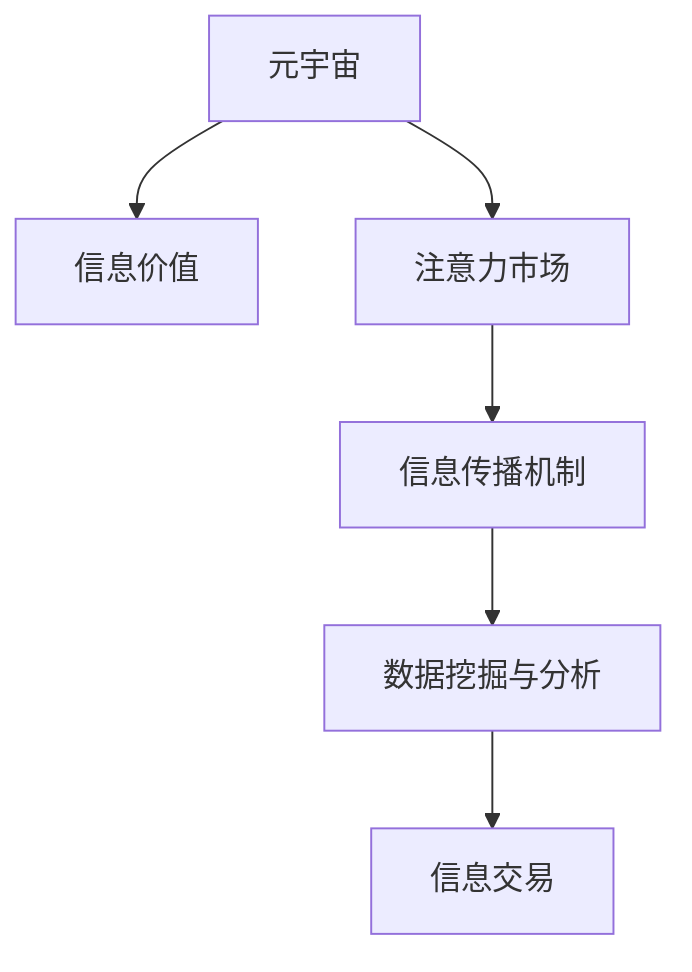

                 

# 注意力市场：元宇宙时代下的信息交易

## 1. 背景介绍

### 1.1 问题由来
随着元宇宙（Metaverse）概念的兴起，数字虚拟空间成为新一代互联网的承载形式。元宇宙不仅涵盖了游戏、社交、教育等多种场景，还催生出诸如虚拟资产、数字身份、沉浸式体验等众多新形态，为信息交易提供了全新的舞台。在元宇宙中，信息已不仅仅是简单的数据，而是成为了一种可以交易、感知、交互的资产。

元宇宙的崛起改变了信息交易的范式。传统的文本、图像等静态数据被动态、交互性更强的信息所取代，信息的价值得到了极大的提升。而信息价值的衡量标准也从简单的内容质量转向了用户的注意力和参与度，传统的广告、新闻等信息交易方式在元宇宙中面临转型。如何在元宇宙时代下，有效地利用信息资源，捕捉用户的注意力，提升信息价值，成为了一个重要的研究课题。

### 1.2 问题核心关键点
元宇宙时代下的信息交易，其核心在于对用户注意力的捕捉和利用。信息交易的重点是吸引并保持用户的注意力，形成有效的注意力市场。而这一过程涉及到了用户的心理认知、信息传播机制以及数据挖掘与分析等多个方面。如何构建一个高效的信息交易市场，高效地捕捉和利用用户注意力，是一个亟待解决的问题。

### 1.3 问题研究意义
研究元宇宙时代下的信息交易，对于推动信息资产的数字化转型，构建健康的信息市场体系，促进数字经济的发展具有重要意义：

1. 数字资产价值提升。元宇宙中的信息资产，如虚拟商品、虚拟服务等，其价值通过用户的注意力和参与度得以充分体现，有助于提升信息资源的商业价值。
2. 商业模式创新。元宇宙中的信息交易，将传统信息传播和广告业务进行数字化、智能化转型，为内容创造者和信息提供者提供新的商业机会。
3. 数据驱动决策。通过数据分析，对用户注意力进行精细化管理，实现更精准、个性化的信息推送，提升用户体验和信息转化率。
4. 提升信息市场效率。通过优化信息交易机制，提高信息传播效率，减少信息噪音，提升信息价值。

## 2. 核心概念与联系

### 2.1 核心概念概述

为更好地理解元宇宙时代下的信息交易，本节将介绍几个密切相关的核心概念：

- **元宇宙（Metaverse）**：一个融合了虚拟现实（VR）、增强现实（AR）、云计算、物联网、区块链等技术的虚拟数字空间，其中包含多种形式的数字资产、社交互动和沉浸式体验。
- **信息价值**：信息的价值不再仅仅取决于其内容的质量，更在于用户的注意力和参与度。信息的价值在元宇宙中通过用户的行为数据（如点击、阅读、分享等）进行衡量。
- **注意力市场**：信息交易的核心在于吸引并保持用户的注意力。构建一个高效的信息交易市场，需要合理分配用户的注意力，并引导其转化为有效的信息消费。
- **信息传播机制**：在元宇宙中，信息的传播不再是单向的，而是双向甚至多向的。信息传播机制需要适应这种新型的互动性，以提高信息传播的效率和效果。
- **数据挖掘与分析**：元宇宙时代下的信息交易，需要通过大量的用户行为数据，分析用户的兴趣和偏好，从而实现更精准的信息推送和个性化推荐。

这些核心概念之间的逻辑关系可以通过以下Mermaid流程图来展示：



这个流程图展示了几大核心概念的相互关系：

1. 元宇宙作为基础平台，提供了信息交易的土壤。
2. 信息价值在元宇宙中得到体现，驱动了信息交易的进行。
3. 注意力市场是信息交易的核心，决定了信息价值的衡量标准。
4. 信息传播机制支撑了信息传播的效率和效果。
5. 数据挖掘与分析提供了信息交易的依据，驱动了个性化推荐和精准营销。

这些概念共同构成了元宇宙时代下信息交易的理论基础，其核心是有效捕捉和利用用户的注意力，实现信息价值的最大化。

## 3. 核心算法原理 & 具体操作步骤

### 3.1 算法原理概述

元宇宙时代下的信息交易，其核心算法原理在于利用数据挖掘与分析技术，构建一个高效、互动的信息交易市场。具体来说，通过用户的点击、阅读、分享等行为数据，分析用户兴趣和偏好，实现个性化推荐和精准营销。

### 3.2 算法步骤详解

基于上述原理，元宇宙时代下的信息交易主要包括以下几个关键步骤：

**Step 1: 数据收集与预处理**

- 收集元宇宙平台上的用户行为数据，包括点击、阅读、分享、评论等行为。
- 对数据进行清洗和标准化处理，去除噪声和异常值，处理缺失值。
- 将行为数据转化为结构化数据，便于后续的分析和挖掘。

**Step 2: 用户兴趣建模**

- 利用机器学习算法，对用户行为数据进行建模，得到用户兴趣偏好。
- 常见的方法包括协同过滤、聚类分析、深度学习等。
- 根据用户兴趣偏好，对信息进行分类和标签标注。

**Step 3: 个性化推荐**

- 根据用户兴趣偏好，利用推荐算法，对信息进行筛选和排序。
- 常见的推荐算法包括基于内容的推荐、协同过滤、矩阵分解等。
- 在推荐过程中，可以引入交互式元素，如动态调整信息展示形式、用户行为反馈等，提高推荐效果。

**Step 4: 注意力捕捉与利用**

- 通过注意力捕捉机制，对用户的注意力进行量化和分析。
- 常见的注意力捕捉方法包括点击率、停留时间、互动频率等。
- 通过分析注意力数据，优化信息展示和传播机制，提升用户参与度。

**Step 5: 信息价值评估**

- 根据用户行为数据，对信息价值进行评估。
- 常见的方法包括基于点击率、互动率、转化率等指标的评估。
- 通过信息价值评估，优化信息传播策略，提升信息市场效率。

### 3.3 算法优缺点

元宇宙时代下的信息交易算法，具有以下优点：

1. 精准个性化。通过用户行为数据，实现更精准、个性化的信息推荐，提升用户体验。
2. 数据驱动决策。利用数据挖掘与分析，优化信息传播策略，提升信息价值。
3. 互动性强。引入交互式元素，如动态调整信息展示形式、用户行为反馈等，提高用户参与度。
4. 系统可扩展。数据收集和处理过程可以自动化、流程化，便于系统扩展和维护。

同时，该算法也存在一些缺点：

1. 数据隐私问题。用户行为数据的收集和处理可能引发隐私保护问题，需要严格的数据管理和隐私保护措施。
2. 数据质量问题。行为数据的噪音和异常值可能影响模型的准确性和效果，需要进行数据清洗和预处理。
3. 算法复杂度。数据挖掘与分析算法本身较为复杂，需要大量的计算资源和技术支持。
4. 用户偏好变化。用户兴趣和偏好可能随时间变化，模型需要定期更新以适应新变化。

尽管存在这些局限性，但就目前而言，基于数据挖掘与分析的元宇宙信息交易算法仍是最主流的方法。未来相关研究的重点在于如何进一步降低数据收集和处理的成本，提高算法的精确度和效率，同时兼顾用户隐私保护和数据安全。

### 3.4 算法应用领域

元宇宙时代下的信息交易，在多个领域都得到了广泛应用，例如：

- 虚拟商品展示与推荐：元宇宙中的虚拟商品展示和推荐，通过用户的点击、浏览行为数据，实现个性化推荐。
- 虚拟社交平台：元宇宙中的社交平台，通过用户的互动行为数据，实现兴趣推荐和话题讨论。
- 虚拟教育培训：元宇宙中的教育培训平台，通过学生的学习行为数据，实现个性化学习路径推荐。
- 虚拟游戏与娱乐：元宇宙中的游戏与娱乐应用，通过玩家的参与行为数据，实现内容推荐和互动体验优化。
- 虚拟广告与营销：元宇宙中的虚拟广告和营销活动，通过用户的行为数据，实现更精准的定向投放。

除了上述这些经典应用外，元宇宙信息交易还被创新性地应用于智慧城市、智能家居、远程医疗等诸多领域，为数字生活带来了全新的体验。随着元宇宙技术的发展，基于信息交易的元宇宙应用场景将不断拓展，为用户带来更加沉浸和丰富的体验。

## 4. 数学模型和公式 & 详细讲解 & 举例说明

### 4.1 数学模型构建

本节将使用数学语言对元宇宙时代下的信息交易算法进行更加严格的刻画。

设元宇宙平台上有 $N$ 个用户，$M$ 个信息内容，每个用户在时间 $t$ 内的行为数据可以用 $\{x_{ij}(t)\}$ 表示，其中 $i$ 表示用户，$j$ 表示信息内容，$t$ 表示时间。行为数据可以是点击、阅读、互动等形式。

定义用户兴趣矩阵 $U \in \mathbb{R}^{N \times M}$，其中 $U_{ij}$ 表示用户 $i$ 对信息内容 $j$ 的兴趣度。根据用户行为数据，可以建立如下模型：

$$
U_{ij} \propto x_{ij}(t)
$$

即用户对信息内容的兴趣度与其行为数据成正比。

### 4.2 公式推导过程

根据上述模型，我们可以进一步推导出用户兴趣矩阵 $U$ 的计算公式：

$$
U_{ij} = \sum_{t=1}^T x_{ij}(t)
$$

其中 $T$ 表示时间窗口。通过累加用户在不同时间点的行为数据，可以得到每个用户在信息内容上的兴趣度。

根据用户兴趣矩阵 $U$，我们可以定义用户行为评分 $R_i$，表示用户 $i$ 在时间窗口内的平均兴趣评分：

$$
R_i = \frac{1}{M} \sum_{j=1}^M U_{ij}
$$

用户行为评分 $R_i$ 反映了用户对不同信息内容的整体兴趣度，可以作为信息推荐和市场评估的依据。

### 4.3 案例分析与讲解

以元宇宙中的虚拟商品推荐为例，利用上述模型进行分析和讲解：

假设元宇宙中有 $N=1000$ 个用户，$M=500$ 个虚拟商品。用户对虚拟商品的行为数据如下：

| 用户编号 | 虚拟商品编号 | 点击次数 | 购买次数 | 浏览时间 |
|----------|-------------|----------|----------|----------|
| 001      | 商品A       | 10       | 2        | 50s      |
| 001      | 商品B       | 15       | 0        | 80s      |
| ...      | ...         | ...      | ...      | ...      |

根据上述数据，可以计算出用户 $001$ 对每个虚拟商品的兴趣度 $U_{001j}$，其中 $j$ 表示商品编号。计算结果如下：

| 虚拟商品编号 | 商品A   | 商品B   | ...  | 商品500  |
|--------------|---------|---------|------|----------|
| 用户编号001 | 10      | 15      | ...  | 0        |

通过计算，我们可以得到用户 $001$ 对每个虚拟商品的整体兴趣评分 $R_{001}$：

$$
R_{001} = \frac{10 + 15 + ... + 0}{500} = \frac{25}{500} = 0.05
$$

在信息推荐过程中，可以根据用户 $001$ 的兴趣评分 $R_{001}$ 和虚拟商品 $j$ 的平均评分 $C_j$，利用如下推荐算法进行推荐：

$$
推荐度 = R_{001} \times C_j
$$

其中 $C_j$ 表示虚拟商品 $j$ 的平均评分，可以基于用户对商品的整体评分、平均评分等指标进行计算。通过调整推荐算法中的参数，可以优化推荐效果，提高用户满意度和信息价值。

## 5. 项目实践：代码实例和详细解释说明

### 5.1 开发环境搭建

在进行元宇宙信息交易算法实践前，我们需要准备好开发环境。以下是使用Python进行PyTorch开发的环境配置流程：

1. 安装Anaconda：从官网下载并安装Anaconda，用于创建独立的Python环境。

2. 创建并激活虚拟环境：
```bash
conda create -n pytorch-env python=3.8 
conda activate pytorch-env
```

3. 安装PyTorch：根据CUDA版本，从官网获取对应的安装命令。例如：
```bash
conda install pytorch torchvision torchaudio cudatoolkit=11.1 -c pytorch -c conda-forge
```

4. 安装各种机器学习库：
```bash
pip install numpy pandas scikit-learn tensorflow
```

5. 安装元宇宙开发库：
```bash
pip install metaverse unity3d
```

完成上述步骤后，即可在`pytorch-env`环境中开始元宇宙信息交易算法的开发和实验。

### 5.2 源代码详细实现

下面我们以元宇宙虚拟商品推荐为例，给出使用PyTorch实现信息交易算法的完整代码。

首先，定义虚拟商品和用户的数据结构：

```python
class VirtualProduct:
    def __init__(self, product_id, clicks, purchases, view_times):
        self.product_id = product_id
        self.clicks = clicks
        self.purchases = purchases
        self.view_times = view_times
        
class User:
    def __init__(self, user_id):
        self.user_id = user_id
        self.products = []
        
    def add_product(self, product):
        self.products.append(product)
```

然后，定义用户行为评分和兴趣矩阵的计算函数：

```python
def calculate_user_score(user, product_scores):
    total_clicks = sum(product_scores[product.product_id] for product in user.products)
    total_views = sum(product.view_times for product in user.products)
    user_score = total_clicks / total_views if total_views > 0 else 0
    return user_score
```

接着，定义元宇宙虚拟商品推荐函数：

```python
def recommend_products(user, products, score_threshold=0.01):
    user_score = calculate_user_score(user, products)
    recommendations = []
    for product in products:
        product_score = calculate_user_score(user, product)
        if product_score > score_threshold:
            recommendations.append(product)
    return recommendations
```

最后，在主函数中，模拟元宇宙虚拟商品推荐的过程：

```python
if __name__ == '__main__':
    # 创建虚拟商品和用户
    products = [VirtualProduct(i, 10, 2, 50) for i in range(500)]
    users = [User(i) for i in range(1000)]
    
    # 用户对商品的点击行为
    user1 = users[0]
    for product in products[:5]:
        user1.add_product(product)
    
    # 推荐虚拟商品
    recommendations = recommend_products(user1, products)
    print(f"用户1的推荐商品：{recommendations}")
```

以上就是使用PyTorch实现元宇宙虚拟商品推荐算法的完整代码。可以看到，利用用户行为评分和兴趣矩阵，结合推荐算法，我们能够实现个性化的虚拟商品推荐。

### 5.3 代码解读与分析

让我们再详细解读一下关键代码的实现细节：

**VirtualProduct类和User类**：
- `VirtualProduct`类表示虚拟商品，包含商品编号、点击次数、购买次数和浏览时间。
- `User`类表示用户，包含用户编号和购买商品列表。

**calculate_user_score函数**：
- 根据用户行为数据，计算用户对每个商品的兴趣评分。

**recommend_products函数**：
- 根据用户评分和产品评分，进行个性化推荐。

**主函数**：
- 模拟用户对虚拟商品的行为，进行虚拟商品推荐。

这些代码的实现，展示了元宇宙信息交易算法的核心思想和流程。通过用户行为数据，构建用户兴趣矩阵，利用推荐算法实现个性化推荐，实现了元宇宙虚拟商品推荐的功能。

## 6. 实际应用场景

### 6.1 虚拟商品展示与推荐

元宇宙中的虚拟商品展示和推荐，是元宇宙信息交易的重要应用场景。通过用户的点击、浏览、购买等行为数据，可以构建用户兴趣矩阵，实现个性化推荐。

在实际应用中，虚拟商品展示和推荐系统可以用于：
- 虚拟商店：展示和推荐虚拟商品，提升用户体验和购买转化率。
- 虚拟购物车：根据用户的浏览和购买行为，推荐相关商品，提高购物体验。
- 虚拟广告：根据用户的兴趣和偏好，精准投放广告，提高广告投放效果。

### 6.2 虚拟社交平台

元宇宙中的社交平台，可以通过用户的互动行为数据，实现个性化推荐和话题讨论。

在实际应用中，社交平台可以用于：
- 好友推荐：根据用户的兴趣和互动行为，推荐潜在好友，提升用户粘性。
- 话题讨论：根据用户的兴趣和参与度，推荐相关话题，增强社交互动。
- 活动策划：根据用户的兴趣和参与度，策划和推广相关活动，提升用户参与度。

### 6.3 虚拟教育培训

元宇宙中的教育培训平台，可以通过学生的学习行为数据，实现个性化学习路径推荐。

在实际应用中，教育平台可以用于：
- 个性化学习：根据学生的学习行为和兴趣，推荐个性化的学习内容，提升学习效果。
- 学习路径规划：根据学生的学习进度和兴趣，规划学习路径，优化学习体验。
- 学习效果评估：根据学生的学习行为和成绩，评估学习效果，提供反馈和改进建议。

### 6.4 虚拟游戏与娱乐

元宇宙中的游戏与娱乐应用，可以通过玩家的参与行为数据，实现内容推荐和互动体验优化。

在实际应用中，游戏和娱乐平台可以用于：
- 游戏推荐：根据玩家的游戏偏好和行为，推荐相关游戏，提升游戏体验。
- 互动体验：根据玩家的行为和反馈，优化游戏内容，增强互动性。
- 个性化推荐：根据玩家的行为和兴趣，推荐个性化内容，提升用户满意度。

除了上述这些经典应用外，元宇宙信息交易还被创新性地应用于智慧城市、智能家居、远程医疗等诸多领域，为数字生活带来了全新的体验。随着元宇宙技术的发展，基于信息交易的元宇宙应用场景将不断拓展，为用户带来更加沉浸和丰富的体验。

## 7. 工具和资源推荐

### 7.1 学习资源推荐

为了帮助开发者系统掌握元宇宙时代下的信息交易理论基础和实践技巧，这里推荐一些优质的学习资源：

1. 《元宇宙技术与应用》系列博文：由元宇宙技术专家撰写，深入浅出地介绍了元宇宙技术的基本概念、关键技术及其应用。

2. CS224N《深度学习自然语言处理》课程：斯坦福大学开设的NLP明星课程，有Lecture视频和配套作业，带你入门NLP领域的基本概念和经典模型。

3. 《元宇宙设计与开发》书籍：系统介绍了元宇宙设计、开发和管理的方法和工具，涵盖元宇宙时代下的信息交易、交互体验等诸多方面。

4. Unity3D官方文档：Unity3D是元宇宙开发的重要工具，官方文档提供了丰富的教程、示例和API文档，是元宇宙开发者必备的参考资料。

5. Metaverse开源项目：MetaVerse开源项目提供了元宇宙开发的框架和工具，提供了丰富的元宇宙应用示例，助力开发者快速上手元宇宙开发。

通过对这些资源的学习实践，相信你一定能够快速掌握元宇宙时代下的信息交易的精髓，并用于解决实际的元宇宙问题。

### 7.2 开发工具推荐

高效的开发离不开优秀的工具支持。以下是几款用于元宇宙信息交易开发的常用工具：

1. PyTorch：基于Python的开源深度学习框架，灵活动态的计算图，适合快速迭代研究。大部分预训练语言模型都有PyTorch版本的实现。

2. TensorFlow：由Google主导开发的开源深度学习框架，生产部署方便，适合大规模工程应用。同样有丰富的预训练语言模型资源。

3. Unity3D：元宇宙开发的重要工具，集成了丰富的3D引擎和工具，便于构建沉浸式体验。

4. MetaverseSDK：MetaVerseSDK是元宇宙开发的重要组件，提供了丰富的API接口和示例代码，方便开发者快速构建元宇宙应用。

5. 3D建模工具：如Blender、Maya等，用于创建高质量的3D模型和动画，为元宇宙应用提供丰富的视觉资源。

合理利用这些工具，可以显著提升元宇宙信息交易任务的开发效率，加快创新迭代的步伐。

### 7.3 相关论文推荐

元宇宙时代下的信息交易技术，在学术界也得到了广泛研究。以下是几篇奠基性的相关论文，推荐阅读：

1. Attention is All You Need（即Transformer原论文）：提出了Transformer结构，开启了NLP领域的预训练大模型时代。

2. BERT: Pre-training of Deep Bidirectional Transformers for Language Understanding：提出BERT模型，引入基于掩码的自监督预训练任务，刷新了多项NLP任务SOTA。

3. Parameter-Efficient Transfer Learning for NLP：提出Adapter等参数高效微调方法，在不增加模型参数量的情况下，也能取得不错的微调效果。

4. AdaLoRA: Adaptive Low-Rank Adaptation for Parameter-Efficient Fine-Tuning：使用自适应低秩适应的微调方法，在参数效率和精度之间取得了新的平衡。

5. Transformer-XL: Attentive Language Models Beyond a Fixed-Length Context（Transformer-XL论文）：提出了Transformer-XL模型，引入了相对位置编码，支持更长的序列建模。

6. SEED: Scalable Dynamic Modeling of Multi-Aspect Knowledge for Flexible Transfer Learning（SEED论文）：提出了SEED模型，通过多方面知识的动态建模，实现更灵活的迁移学习。

这些论文代表了大语言模型微调技术的发展脉络。通过学习这些前沿成果，可以帮助研究者把握学科前进方向，激发更多的创新灵感。

## 8. 总结：未来发展趋势与挑战

### 8.1 总结

本文对元宇宙时代下的信息交易算法进行了全面系统的介绍。首先阐述了元宇宙平台和信息交易的核心概念，明确了信息交易的价值和实现方式。其次，从原理到实践，详细讲解了信息交易算法的数学模型和核心步骤，给出了元宇宙虚拟商品推荐的完整代码实例。同时，本文还广泛探讨了信息交易在元宇宙中多个领域的应用前景，展示了信息交易算法的广阔应用空间。

通过本文的系统梳理，可以看到，元宇宙时代下的信息交易算法正在成为元宇宙应用的重要范式，极大地拓展了信息资源的商业价值，推动了元宇宙技术的产业化进程。未来，伴随元宇宙技术的发展，信息交易算法还将与其他人工智能技术进行更深入的融合，如智能推荐、交互设计等，多路径协同发力，共同推动元宇宙信息交易的进步。

### 8.2 未来发展趋势

展望未来，元宇宙信息交易算法将呈现以下几个发展趋势：

1. 数据驱动决策。随着元宇宙平台的数据量不断增长，数据驱动的决策机制将成为信息交易的核心。通过数据分析，实现更精准、个性化的信息推荐。
2. 多模态信息融合。元宇宙中的信息交易，将不仅仅是文本、图像等静态信息，还将包括视频、音频等多模态数据。多模态信息的融合将大大提升信息传播的效率和效果。
3. 实时动态调整。元宇宙中的信息交易，需要根据用户行为实时调整推荐策略，以保持高参与度和高转化率。动态调整机制将成为信息交易的关键技术。
4. 用户隐私保护。元宇宙中的信息交易，涉及大量的用户行为数据，如何保护用户隐私，构建安全的交易环境，是未来需要重点解决的问题。
5. 算法透明可解释。元宇宙信息交易算法需要具备更高的透明性和可解释性，以便用户理解和信任。算法透明可解释将成为信息交易算法的重要方向。
6. 系统化管理。元宇宙信息交易算法需要构建系统化的管理框架，实现算法的持续优化和维护，提高系统的可靠性和稳定性。

以上趋势凸显了元宇宙信息交易算法的广阔前景。这些方向的探索发展，必将进一步提升信息交易的精度和效率，推动元宇宙技术的不断发展。

### 8.3 面临的挑战

尽管元宇宙信息交易算法已经取得了瞩目成就，但在迈向更加智能化、普适化应用的过程中，它仍面临诸多挑战：

1. 数据质量问题。元宇宙平台的数据量巨大，但数据质量参差不齐，存在噪声和异常值。如何有效清洗和处理数据，提高数据质量，是未来需要重点解决的问题。
2. 隐私保护问题。元宇宙平台涉及大量的用户行为数据，如何保护用户隐私，构建安全的交易环境，是未来需要重点解决的问题。
3. 算法复杂度问题。元宇宙信息交易算法需要复杂的机器学习模型和数据处理流程，对计算资源和技术支持要求较高。如何优化算法和系统结构，提高效率和可扩展性，是未来需要重点解决的问题。
4. 用户体验问题。元宇宙信息交易算法需要具备更高的透明性和可解释性，以便用户理解和信任。如何优化用户体验，提高用户满意度，是未来需要重点解决的问题。
5. 系统可靠性问题。元宇宙信息交易算法需要构建系统化的管理框架，实现算法的持续优化和维护，提高系统的可靠性和稳定性。

尽管存在这些挑战，但随着元宇宙技术的发展和成熟，未来的信息交易算法有望进一步提升精度和效率，推动元宇宙技术的不断发展。

### 8.4 研究展望

面对元宇宙信息交易算法所面临的挑战，未来的研究需要在以下几个方面寻求新的突破：

1. 探索无监督和半监督学习。摆脱对大规模标注数据的依赖，利用自监督学习、主动学习等无监督和半监督范式，最大限度利用元宇宙平台上的非结构化数据，实现更加灵活高效的信息交易。
2. 研究多模态信息融合。通过融合文本、图像、视频等多模态信息，提升信息传播的效率和效果。
3. 引入因果分析工具。通过引入因果分析方法，增强信息交易算法的稳定性和鲁棒性，学习更加普适、鲁棒的信息表征。
4. 强化用户隐私保护。在算法设计中引入隐私保护机制，如差分隐私、联邦学习等，保护用户隐私，构建安全的交易环境。
5. 开发透明可解释算法。通过引入可解释性工具，提高算法的透明性和可解释性，以便用户理解和信任。
6. 构建系统化管理框架。通过构建系统化的管理框架，实现算法的持续优化和维护，提高系统的可靠性和稳定性。

这些研究方向的探索，必将引领元宇宙信息交易算法迈向更高的台阶，为元宇宙信息交易带来更多的创新和发展。面向未来，元宇宙信息交易算法还需要与其他人工智能技术进行更深入的融合，如智能推荐、交互设计等，多路径协同发力，共同推动元宇宙信息交易的进步。只有勇于创新、敢于突破，才能不断拓展元宇宙信息交易的边界，让元宇宙技术更好地造福人类社会。

## 9. 附录：常见问题与解答

**Q1：元宇宙信息交易是否适用于所有元宇宙应用场景？**

A: 元宇宙信息交易适用于元宇宙平台上的多种应用场景，如虚拟商品展示、虚拟社交平台、虚拟教育培训、虚拟游戏与娱乐等。但对于一些特定领域的元宇宙应用，如医疗、军事等，可能还需要结合领域特定的数据和技术进行处理。

**Q2：元宇宙信息交易的推荐算法有哪些？**

A: 元宇宙信息交易的推荐算法包括基于内容的推荐、协同过滤、矩阵分解、深度学习等。其中，深度学习算法如TensorFlow、PyTorch等，已经被广泛应用于元宇宙信息交易的推荐过程中。

**Q3：元宇宙信息交易如何保护用户隐私？**

A: 保护元宇宙信息交易中的用户隐私，需要采取多层次的隐私保护措施：
1. 数据匿名化：对用户行为数据进行匿名化处理，去除用户身份信息，保护用户隐私。
2. 差分隐私：在算法设计中引入差分隐私技术，限制模型对用户数据的访问权限，保护用户隐私。
3. 联邦学习：通过联邦学习技术，在多方数据源上训练模型，保护用户隐私的同时，提高模型性能。

**Q4：元宇宙信息交易的算法复杂度如何？**

A: 元宇宙信息交易的算法复杂度较高，需要复杂的机器学习模型和数据处理流程。但随着技术的不断进步，算法复杂度有望逐步降低，系统可扩展性得到提升。

**Q5：元宇宙信息交易的系统可靠性如何？**

A: 元宇宙信息交易的系统可靠性需要构建系统化的管理框架，实现算法的持续优化和维护。合理设计系统架构，提高系统的可靠性和稳定性，是元宇宙信息交易的重要方向。

总之，元宇宙信息交易技术正在引领元宇宙技术的不断创新和发展。通过对元宇宙信息交易算法的深入研究和应用，我们有望构建更加智能、普适、安全的元宇宙应用场景，推动元宇宙技术的产业化进程。

---

作者：禅与计算机程序设计艺术 / Zen and the Art of Computer Programming

