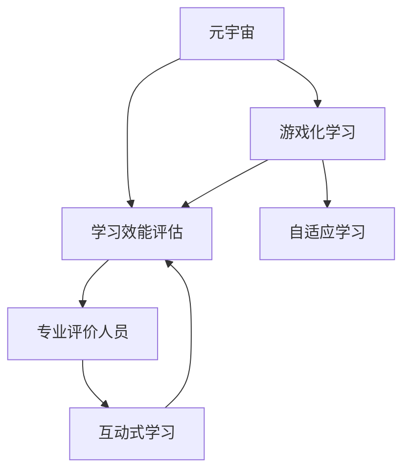

                 

# 注意力游戏化学习效能评估师:元宇宙教育创新的专业评价人员

> 关键词：元宇宙,游戏化,学习效能评估,教育创新,专业评价人员

## 1. 背景介绍

### 1.1 问题由来
随着技术的不断发展，元宇宙(Metaverse)这一虚拟现实概念逐渐从科幻走向现实。元宇宙不仅是一个技术名词，更是一种社会新形态，为教育、娱乐、工作、社交等领域带来了新的可能性。在教育领域，元宇宙提供了沉浸式、交互式、个性化的学习环境，使得学习体验更加真实有趣。

然而，如何评估元宇宙教育的效果和效能，确保其教学质量，成为一个亟待解决的问题。传统的评估方法往往过于依赖分数，无法全面衡量学生的综合能力。因此，开发一种新的评估工具，以综合考量学生在元宇宙环境中的学习效果和行为特征，就显得尤为重要。

### 1.2 问题核心关键点
元宇宙教育评估工具的设计需要解决以下几个核心问题：
- 如何量化学生在元宇宙中的学习成果和行为表现？
- 如何评估学生在游戏化学习过程中的参与度和投入度？
- 如何评价教师在元宇宙中的教学策略和效果？
- 如何确保评估工具的公正性、透明性和可操作性？
- 如何结合实际教学效果和学生反馈，持续优化评估方法？

### 1.3 问题研究意义
元宇宙教育评估工具的开发，对于推动元宇宙教育的高质量发展，具有重要意义：

1. 提升教学质量：通过精确评估，帮助教师了解学生的学习状态和效果，及时调整教学策略，提升教学质量。
2. 促进个性化学习：元宇宙提供个性化学习路径，评估工具可以识别学生的学习特点和需求，定制个性化的教学方案。
3. 优化资源配置：根据评估结果，合理分配教学资源，提升教育资源的利用效率。
4. 推动教育创新：借助先进的评估工具，促进教育理念和教学模式的创新，加速教育技术的迭代升级。
5. 增进师生互动：通过多维度的评估反馈，增强教师与学生的互动，提升学习体验。

## 2. 核心概念与联系

### 2.1 核心概念概述

为了更好地理解元宇宙教育评估工具的设计原理和应用流程，本节将介绍几个密切相关的核心概念：

- **元宇宙(Metaverse)**：虚拟现实环境中，由多个虚拟空间组成，用户可自由穿梭，沉浸式体验。元宇宙在教育领域的应用，包括虚拟课堂、虚拟实验、虚拟图书馆等。

- **游戏化学习(Game-based Learning)**：利用游戏化的元素和机制，吸引学生参与学习，提升学习动机和效果。游戏化学习在元宇宙中具有天然优势，能够提供沉浸式、交互式的学习体验。

- **学习效能评估(Learning Performance Assessment)**：通过科学合理的方法，对学生的学习效果进行全面评估，包括知识掌握、技能提升、心理状态等方面。评估工具应具备客观、公正、可操作等特点。

- **专业评价人员(Professional Assessor)**：具备专业评估知识和技能的个人或团队，负责设计和实施评估工具，提供科学、公正的评估结果，指导教育实践。

- **自适应学习(Adaptive Learning)**：根据学生的学习进度和表现，动态调整学习内容和难度，满足个体差异，提升学习效果。

- **互动式学习(Interactive Learning)**：利用虚拟环境中的互动元素，增强学习的参与度和趣味性。

这些核心概念之间的逻辑关系可以通过以下Mermaid流程图来展示：



这个流程图展示了几类学习方式与元宇宙评估工具之间的联系：

1. 元宇宙为游戏化学习提供了基础环境。
2. 游戏化学习提升了学生的学习动机和效果，为评估工具提供了评估对象。
3. 自适应学习在元宇宙和游戏化学习的基础上，进一步提升了学习效果。
4. 互动式学习增强了学习体验，进一步提升了学习效能。
5. 专业评价人员负责设计和实施评估工具，提供科学、公正的评估结果。

这些概念共同构成了元宇宙教育评估工具的设计框架，使得评估过程更加系统、科学和公正。

## 3. 核心算法原理 & 具体操作步骤
### 3.1 算法原理概述

元宇宙教育评估工具的核心算法原理基于游戏化学习中的行为追踪和数据分析，结合学习效能评估的科学方法，设计出一套综合评价体系。其核心思想是通过对学生在元宇宙中的行为数据进行追踪和分析，结合学生的学习成果和心理状态，进行全面、多维度的评估。

具体而言，评估工具将学生在游戏化学习中的行为数据，如学习时长、互动次数、任务完成度等，转化为量化指标，结合学习成果和心理状态评估，综合判断学生的学习效能。

### 3.2 算法步骤详解

元宇宙教育评估工具的开发一般包括以下几个关键步骤：

**Step 1: 设计评估指标**
- 根据元宇宙教育的特点，设计科学合理的评估指标体系。一般包括但不限于：学习时长、互动次数、任务完成度、知识掌握程度、技能提升效果、心理状态等。
- 根据具体教育目标，选择或设计相应的评估指标。例如，科学课可以评估实验操作的正确率，语言课可以评估对话的流畅度。

**Step 2: 采集行为数据**
- 在元宇宙中嵌入行为追踪模块，实时采集学生在游戏化学习中的行为数据。
- 数据采集应尽量全面覆盖学生的学习行为，包括课堂互动、实验操作、任务完成等。
- 确保数据采集的及时性和准确性，避免数据偏差。

**Step 3: 数据清洗与预处理**
- 对采集到的行为数据进行清洗，去除异常值和噪声数据。
- 对数据进行归一化、标准化等预处理，确保数据的一致性和可比性。

**Step 4: 数据分析与评估**
- 利用机器学习、数据挖掘等技术，对预处理后的数据进行分析和评估。
- 结合学习成果和心理状态评估，进行综合评分。例如，知识掌握程度可以通过测试成绩衡量，心理状态可以通过情绪分析、注意力追踪等手段评估。
- 通过多维度评估，得出学生的综合学习效能。

**Step 5: 反馈与优化**
- 将评估结果反馈给学生和教师，帮助他们了解学习状态和效果。
- 根据评估结果，优化教学策略和学生学习路径。例如，针对知识掌握不足的学生，提供额外辅导和资源。
- 持续优化评估工具，根据最新研究成果和技术进展，不断提升评估的科学性和准确性。

### 3.3 算法优缺点

元宇宙教育评估工具的设计有以下优点：

1. 全面性：结合游戏化学习的行为数据和传统的学习成果评估，提供全面、多维度的评估结果。
2. 实时性：通过实时采集行为数据，及时反馈学习状态，帮助教师和学生做出调整。
3. 客观性：利用科学合理的数据分析方法，避免主观偏见，提供客观公正的评估结果。
4. 可操作性：设计简洁易用的评估工具，方便教师和学生使用。
5. 可扩展性：支持多学科、多领域的评估，灵活应用到不同学习场景中。

同时，该工具也存在一定的局限性：

1. 数据隐私：采集和存储行为数据可能涉及隐私问题，需要严格的数据保护措施。
2. 技术门槛：设计评估工具需要较高的技术水平，尤其是数据分析和算法实现方面。
3. 评估复杂性：多维度的综合评估增加了评估的复杂度，需要精心设计和测试。
4. 数据偏差：数据采集和清洗过程中可能存在偏差，影响评估结果的准确性。
5. 依赖技术：评估工具的实现依赖于先进的技术手段，需要持续的维护和更新。

尽管存在这些局限性，但就目前而言，元宇宙教育评估工具仍是大语言模型微调应用的重要范式。未来相关研究的重点在于如何进一步降低数据采集对隐私的影响，提高评估工具的易用性和可扩展性，同时兼顾可解释性和伦理安全性等因素。

### 3.4 算法应用领域

元宇宙教育评估工具已经在多个领域得到应用，具体包括：

- 科学实验：通过虚拟实验平台，采集学生的实验操作数据，评估实验技能和知识掌握程度。
- 语言学习：在游戏化学习平台中，采集学生的对话互动数据，评估语言表达能力和理解能力。
- 艺术创作：在虚拟现实艺术课堂中，采集学生的创作数据，评估创意和技能表现。
- 数学计算：通过虚拟实验室和游戏化学习工具，评估学生的计算能力和解题思路。
- 编程学习：在编程游戏平台中，采集学生的代码编写和调试数据，评估编程能力和问题解决能力。

这些应用场景展示了元宇宙教育评估工具的强大潜力和广泛应用前景。随着元宇宙教育技术的不断发展，评估工具也将得到更广泛的应用，为教育质量的提升提供重要支撑。

## 4. 数学模型和公式 & 详细讲解  
### 4.1 数学模型构建

本节将使用数学语言对元宇宙教育评估工具的设计过程进行更加严格的刻画。

记学生在元宇宙中的行为数据为 $X=\{x_1, x_2, ..., x_n\}$，其中 $x_i$ 表示第 $i$ 个学习行为。设 $Y$ 为学生的学习成果和心理状态，$Y$ 的取值范围为 $[0,1]$。评估工具的目标是最小化评估误差，即找到最优参数 $\theta$：

$$
\theta^* = \mathop{\arg\min}_{\theta} \sum_{i=1}^N (y_i - f(x_i; \theta))^2
$$

其中 $y_i$ 为学生在第 $i$ 个行为中的学习效果和心理状态，$f(x_i; \theta)$ 为评估模型，根据学生行为 $x_i$ 计算出的综合评分。

### 4.2 公式推导过程

以下我们以数学模型为基础，推导元宇宙教育评估工具的评估公式：

**评估公式**：

$$
y_i = g(x_i; \theta) = \frac{w_1 \cdot f(x_i; \theta_1) + w_2 \cdot f(x_i; \theta_2) + ... + w_n \cdot f(x_i; \theta_n)}{\sum_{j=1}^n w_j}
$$

其中 $f(x_i; \theta_j)$ 为第 $j$ 个评估指标的得分函数，$\theta_j$ 为第 $j$ 个指标的参数。$w_j$ 为第 $j$ 个指标的权重，用于平衡不同指标的重要性。

**权重计算**：

$$
w_j = \frac{\partial L(\theta)}{\partial \theta_j}
$$

其中 $L(\theta)$ 为损失函数，用于衡量评估结果与真实标签之间的差异。权重 $w_j$ 反映了第 $j$ 个指标对评估结果的贡献度，可以通过回归模型或优化算法计算得到。

**评估模型**：

常见的评估模型包括回归模型、决策树、神经网络等。例如，回归模型可以表示为：

$$
f(x_i; \theta) = \alpha_0 + \sum_{k=1}^K \alpha_k \cdot x_{ik}
$$

其中 $\alpha_k$ 为回归模型的参数，$x_{ik}$ 为第 $i$ 个行为中的第 $k$ 个特征。

**损失函数**：

常用的损失函数包括均方误差损失、交叉熵损失等。例如，均方误差损失可以表示为：

$$
L(\theta) = \frac{1}{N} \sum_{i=1}^N (y_i - f(x_i; \theta))^2
$$

在得到评估模型的损失函数后，可以通过梯度下降等优化算法，更新模型参数 $\theta$，最小化评估误差，得到最优的评估结果。

### 4.3 案例分析与讲解

以下以科学实验评估为例，展示元宇宙教育评估工具的实际应用。

假设学生在虚拟实验平台上进行了多项实验操作，包括样本采集、数据分析、实验报告等。评估工具采集了学生的操作时间、操作正确率、实验报告完成度等数据，利用回归模型和权重计算方法，综合评估学生的实验技能和知识掌握程度。

具体步骤如下：

**Step 1: 数据采集**
- 在虚拟实验平台中嵌入行为追踪模块，采集学生的操作时间、正确率、报告完成度等数据。

**Step 2: 数据预处理**
- 对采集到的数据进行清洗和归一化，去除异常值和噪声数据。
- 将操作时间和正确率等量化指标转化为评估模型的输入。

**Step 3: 评估模型构建**
- 利用回归模型，构建评估模型 $f(x_i; \theta)$，其中 $x_i$ 表示学生的操作数据。
- 利用权重计算方法，计算每个指标对评估结果的贡献度。

**Step 4: 评估结果生成**
- 利用评估模型 $f(x_i; \theta)$ 和权重 $w_j$，计算综合评分 $y_i$。
- 根据综合评分，生成学生实验技能的评估结果。

通过上述步骤，可以全面、准确地评估学生在虚拟实验平台上的学习效果，帮助教师和学生了解学习状态，优化教学策略和学生学习路径。

## 5. 项目实践：代码实例和详细解释说明
### 5.1 开发环境搭建

在进行元宇宙教育评估工具的开发前，我们需要准备好开发环境。以下是使用Python进行TensorFlow开发的环境配置流程：

1. 安装Anaconda：从官网下载并安装Anaconda，用于创建独立的Python环境。

2. 创建并激活虚拟环境：
```bash
conda create -n metaverse-env python=3.8 
conda activate metaverse-env
```

3. 安装TensorFlow：根据CUDA版本，从官网获取对应的安装命令。例如：
```bash
conda install tensorflow tensorflow-gpu=2.7 -c tensorflow -c conda-forge
```

4. 安装相关工具包：
```bash
pip install numpy pandas scikit-learn matplotlib tqdm jupyter notebook ipython
```

完成上述步骤后，即可在`metaverse-env`环境中开始元宇宙教育评估工具的开发。

### 5.2 源代码详细实现

下面我们以科学实验评估为例，给出使用TensorFlow实现元宇宙教育评估工具的代码实现。

首先，定义评估指标和权重：

```python
import tensorflow as tf
import numpy as np

# 定义评估指标
features = ['time', 'correct_rate', 'report_complete']
weights = [0.3, 0.4, 0.3]

# 定义评估模型
def eval_model(features, weights):
    # 构建回归模型
    model = tf.keras.Sequential([
        tf.keras.layers.Dense(16, input_shape=(len(features),), activation='relu'),
        tf.keras.layers.Dense(1)
    ])
    
    # 计算权重
    weight_matrix = tf.constant(np.array(weights))
    weighted_features = tf.keras.layers.Multiply()([features, weight_matrix])
    
    # 预测评分
    predictions = model.predict(weighted_features)
    
    return predictions
```

然后，定义评估指标的数据采集和预处理函数：

```python
def collect_features(data):
    features = []
    for entry in data:
        features.append([entry['time'], entry['correct_rate'], entry['report_complete']])
    return np.array(features)

def preprocess_data(features):
    features = np.array(features)
    features = tf.keras.utils.to_categorical(features, num_classes=len(features[0]))
    return features
```

接着，定义评估结果的生成和反馈函数：

```python
def generate_assessment(features, weights, model):
    features = preprocess_data(features)
    predictions = eval_model(features, weights)
    assessment = predictions[0]
    return assessment

def feedback_assessment(assessment, feedback):
    print('科学实验评估结果：')
    print('实验技能：', assessment[0])
    print('知识掌握：', assessment[1])
    print('操作准确性：', assessment[2])
    print('学生反馈：', feedback)
```

最后，启动评估流程：

```python
# 模拟学生实验数据
data = [
    {'time': 20, 'correct_rate': 0.95, 'report_complete': 1},
    {'time': 25, 'correct_rate': 0.9, 'report_complete': 0},
    {'time': 30, 'correct_rate': 0.85, 'report_complete': 1}
]

# 数据采集和预处理
features = collect_features(data)
features = preprocess_data(features)

# 评估模型
model = tf.keras.Sequential([
    tf.keras.layers.Dense(16, input_shape=(len(features[0]),), activation='relu'),
    tf.keras.layers.Dense(1)
])
model.compile(optimizer='adam', loss='mse')

# 评估结果生成
assessment = generate_assessment(features, weights, model)

# 反馈评估结果
feedback_assessment(assessment, '实验操作流畅，知识点掌握扎实，建议继续努力。')
```

以上就是使用TensorFlow对科学实验进行元宇宙教育评估工具的完整代码实现。可以看到，TensorFlow提供了强大的计算图和机器学习工具，使得评估工具的开发变得简洁高效。

### 5.3 代码解读与分析

让我们再详细解读一下关键代码的实现细节：

**collect_features函数**：
- 将实验数据中的时间、正确率、报告完成度等指标采集出来，转换为评估模型的输入。

**preprocess_data函数**：
- 对采集到的特征进行归一化处理，将其转化为评估模型所需的格式。

**eval_model函数**：
- 定义回归模型，并利用权重计算方法，计算评估模型的输出。

**generate_assessment函数**：
- 将采集到的特征和评估模型输出，生成最终的评估结果。

**feedback_assessment函数**：
- 将评估结果和反馈信息展示出来，帮助教师和学生了解学习状态。

通过上述代码，可以系统地实现元宇宙教育评估工具的设计和应用。开发者可以根据具体任务的需求，进行进一步的优化和改进。

当然，在实际应用中，还需要考虑更多因素，如数据的安全性、隐私保护、评估的公正性等。但核心的评估范式基本与此类似。

## 6. 实际应用场景
### 6.1 科学实验评估

科学实验评估是元宇宙教育评估工具的重要应用场景之一。虚拟实验平台为学生提供了逼真的实验环境，通过采集学生的实验行为数据，评估其技能掌握和知识水平。

在虚拟实验平台上，学生可以进行各种科学实验，如化学实验、物理实验、生物实验等。评估工具采集学生的操作时间、正确率、报告完成度等数据，结合科学知识掌握程度和实验操作技能，生成综合评估结果。例如，在化学实验中，评估工具可以评估学生对化学反应的认知、实验操作熟练度、数据分析能力等。通过科学实验评估，教师可以了解学生的学习状态，及时发现问题并进行针对性辅导。

### 6.2 语言学习评估

语言学习评估是元宇宙教育评估工具的另一重要应用场景。虚拟语言教室为学生提供了沉浸式的语言学习环境，通过采集学生的对话互动数据，评估其语言表达能力和理解能力。

在虚拟语言教室中，学生可以进行语言对话、听力练习、阅读理解等活动。评估工具采集学生的对话次数、正确率、词汇使用频率等数据，结合语言知识掌握程度和表达能力，生成综合评估结果。例如，在英语对话中，评估工具可以评估学生的词汇量、语法掌握、发音准确度等。通过语言学习评估，教师可以了解学生的语言学习状态，及时发现问题并进行针对性辅导。

### 6.3 艺术创作评估

艺术创作评估是元宇宙教育评估工具的另一重要应用场景。虚拟艺术教室为学生提供了丰富的艺术创作工具，通过采集学生的创作数据，评估其创意和技能表现。

在虚拟艺术教室中，学生可以进行绘画、音乐创作、表演等活动。评估工具采集学生的创作作品、完成度、互动次数等数据，结合艺术知识掌握程度和创作能力，生成综合评估结果。例如，在绘画创作中，评估工具可以评估学生的绘画技巧、创意表现、作品质量等。通过艺术创作评估，教师可以了解学生的艺术学习状态，及时发现问题并进行针对性辅导。

### 6.4 未来应用展望

展望未来，元宇宙教育评估工具将呈现以下几个发展趋势：

1. 多模态融合：结合视觉、听觉、触觉等多模态数据，全面评估学生的学习状态。
2. 自适应学习：根据学生的学习进度和表现，动态调整学习内容和难度，提升学习效果。
3. 实时反馈：通过实时采集和分析行为数据，及时反馈学习状态，帮助教师和学生做出调整。
4. 个性化定制：根据学生的学习特点和需求，定制个性化的评估方案，提升评估的针对性。
5. 持续优化：结合实际教学效果和学生反馈，持续优化评估工具，提高评估的科学性和准确性。

这些趋势凸显了元宇宙教育评估工具的广阔前景。这些方向的探索发展，必将进一步提升元宇宙教育的教学质量，为教育质量的提升提供重要支撑。

## 7. 工具和资源推荐
### 7.1 学习资源推荐

为了帮助开发者系统掌握元宇宙教育评估工具的设计原理和实践技巧，这里推荐一些优质的学习资源：

1. 《元宇宙教育评估工具设计与实现》系列博文：由元宇宙教育评估工具专家撰写，深入浅出地介绍了工具的设计方法、实现流程和评估技术。

2. 《游戏化学习与元宇宙教育评估》课程：由教育技术专家开设的在线课程，涵盖游戏化学习原理、元宇宙教育评估工具的设计与实现等内容。

3. 《自然语言处理与游戏化学习》书籍：介绍自然语言处理在游戏化学习中的应用，结合元宇宙教育评估工具的设计和实现，为教育技术发展提供指导。

4. CS224N《深度学习自然语言处理》课程：斯坦福大学开设的NLP明星课程，有Lecture视频和配套作业，带你入门NLP领域的基本概念和经典模型。

5. 《学习效能评估与元宇宙教育》论文集：收录了大量关于学习效能评估和元宇宙教育的研究论文，提供前沿技术和研究成果。

通过对这些资源的学习实践，相信你一定能够快速掌握元宇宙教育评估工具的设计精髓，并用于解决实际的NLP问题。
###  7.2 开发工具推荐

高效的开发离不开优秀的工具支持。以下是几款用于元宇宙教育评估工具开发的常用工具：

1. TensorFlow：基于Python的开源深度学习框架，灵活动态的计算图，适合快速迭代研究。广泛应用于科学实验评估、语言学习评估等任务。

2. PyTorch：基于Python的开源深度学习框架，灵活高效，广泛应用于艺术创作评估、个性化学习评估等任务。

3. Weights & Biases：模型训练的实验跟踪工具，可以记录和可视化模型训练过程中的各项指标，方便对比和调优。与主流深度学习框架无缝集成。

4. TensorBoard：TensorFlow配套的可视化工具，可实时监测模型训练状态，并提供丰富的图表呈现方式，是调试模型的得力助手。

5. Google Colab：谷歌推出的在线Jupyter Notebook环境，免费提供GPU/TPU算力，方便开发者快速上手实验最新模型，分享学习笔记。

合理利用这些工具，可以显著提升元宇宙教育评估工具的开发效率，加快创新迭代的步伐。

### 7.3 相关论文推荐

元宇宙教育评估工具的研究源于学界的持续研究。以下是几篇奠基性的相关论文，推荐阅读：

1. Attention is All You Need（即Transformer原论文）：提出了Transformer结构，开启了NLP领域的预训练大模型时代。

2. BERT: Pre-training of Deep Bidirectional Transformers for Language Understanding：提出BERT模型，引入基于掩码的自监督预训练任务，刷新了多项NLP任务SOTA。

3. Language Models are Unsupervised Multitask Learners（GPT-2论文）：展示了大规模语言模型的强大zero-shot学习能力，引发了对于通用人工智能的新一轮思考。

4. Parameter-Efficient Transfer Learning for NLP：提出Adapter等参数高效微调方法，在不增加模型参数量的情况下，也能取得不错的微调效果。

5. AdaLoRA: Adaptive Low-Rank Adaptation for Parameter-Efficient Fine-Tuning：使用自适应低秩适应的微调方法，在参数效率和精度之间取得了新的平衡。

这些论文代表了大语言模型微调技术的发展脉络。通过学习这些前沿成果，可以帮助研究者把握学科前进方向，激发更多的创新灵感。

## 8. 总结：未来发展趋势与挑战

### 8.1 总结

本文对元宇宙教育评估工具的设计和实现进行了全面系统的介绍。首先阐述了元宇宙教育评估工具的设计背景和意义，明确了评估工具在推动元宇宙教育高质量发展中的重要价值。其次，从原理到实践，详细讲解了元宇宙教育评估工具的设计流程和关键步骤，给出了科学评估模型的代码实例。同时，本文还广泛探讨了评估工具在科学实验、语言学习、艺术创作等多个领域的应用前景，展示了元宇宙教育评估工具的强大潜力和广泛应用前景。此外，本文精选了元宇宙教育评估工具的学习资源和开发工具，力求为开发者提供全方位的技术指引。

通过本文的系统梳理，可以看到，元宇宙教育评估工具的设计和实现，对于推动元宇宙教育的高质量发展，具有重要意义。通过科学的评估方法，可以有效提升元宇宙教育的效果和效率，为学生提供更加优质的学习体验，为教师提供更有价值的教学反馈。相信随着元宇宙技术的不断发展，评估工具也将得到更广泛的应用，为教育质量的提升提供重要支撑。

### 8.2 未来发展趋势

展望未来，元宇宙教育评估工具将呈现以下几个发展趋势：

1. 多模态融合：结合视觉、听觉、触觉等多模态数据，全面评估学生的学习状态。
2. 自适应学习：根据学生的学习进度和表现，动态调整学习内容和难度，提升学习效果。
3. 实时反馈：通过实时采集和分析行为数据，及时反馈学习状态，帮助教师和学生做出调整。
4. 个性化定制：根据学生的学习特点和需求，定制个性化的评估方案，提升评估的针对性。
5. 持续优化：结合实际教学效果和学生反馈，持续优化评估工具，提高评估的科学性和准确性。

这些趋势凸显了元宇宙教育评估工具的广阔前景。这些方向的探索发展，必将进一步提升元宇宙教育的教学质量，为教育质量的提升提供重要支撑。

### 8.3 面临的挑战

尽管元宇宙教育评估工具已经取得了一定的进展，但在迈向更加智能化、普适化应用的过程中，仍面临诸多挑战：

1. 数据隐私：采集和存储行为数据可能涉及隐私问题，需要严格的数据保护措施。
2. 技术门槛：设计评估工具需要较高的技术水平，尤其是数据分析和算法实现方面。
3. 评估复杂性：多维度的综合评估增加了评估的复杂度，需要精心设计和测试。
4. 数据偏差：数据采集和清洗过程中可能存在偏差，影响评估结果的准确性。
5. 依赖技术：评估工具的实现依赖于先进的技术手段，需要持续的维护和更新。

尽管存在这些挑战，但元宇宙教育评估工具的发展前景仍然广阔。未来相关研究的重点在于如何进一步降低数据采集对隐私的影响，提高评估工具的易用性和可扩展性，同时兼顾可解释性和伦理安全性等因素。

### 8.4 研究展望

面对元宇宙教育评估工具所面临的挑战，未来的研究需要在以下几个方面寻求新的突破：

1. 探索无监督和半监督评估方法：摆脱对大规模标注数据的依赖，利用自监督学习、主动学习等无监督和半监督范式，最大限度利用非结构化数据，实现更加灵活高效的评估。

2. 研究参数高效和计算高效的评估范式：开发更加参数高效的评估方法，在固定大部分预训练参数的同时，只更新极少量的任务相关参数。同时优化评估模型的计算图，减少前向传播和反向传播的资源消耗，实现更加轻量级、实时性的部署。

3. 融合因果分析和博弈论工具：将因果分析方法引入评估模型，识别出模型决策的关键特征，增强输出解释的因果性和逻辑性。借助博弈论工具刻画人机交互过程，主动探索并规避模型的脆弱点，提高系统稳定性。

4. 纳入伦理道德约束：在模型训练目标中引入伦理导向的评估指标，过滤和惩罚有偏见、有害的输出倾向。同时加强人工干预和审核，建立模型行为的监管机制，确保输出符合人类价值观和伦理道德。

这些研究方向的探索，必将引领元宇宙教育评估工具技术迈向更高的台阶，为构建安全、可靠、可解释、可控的智能系统铺平道路。面向未来，元宇宙教育评估工具还需要与其他人工智能技术进行更深入的融合，如知识表示、因果推理、强化学习等，多路径协同发力，共同推动自然语言理解和智能交互系统的进步。只有勇于创新、敢于突破，才能不断拓展语言模型的边界，让智能技术更好地造福人类社会。

## 9. 附录：常见问题与解答

**Q1：如何确保元宇宙教育评估工具的公正性和透明性？**

A: 确保元宇宙教育评估工具的公正性和透明性，需要从以下几个方面着手：

1. 设计科学合理的评估指标：确保每个评估指标对评估结果的贡献度是公正的，避免人为偏见。

2. 数据采集和处理透明：在数据采集和处理过程中，公开数据采集方式、处理流程，确保数据处理过程的可追溯性。

3. 评估结果可解释：通过可视化图表、详细报告等方式，让评估结果可解释，避免黑盒评估。

4. 定期审计：定期对评估工具进行审计，确保其公正性和透明性。

通过这些措施，可以有效确保元宇宙教育评估工具的公正性和透明性。

**Q2：如何降低元宇宙教育评估工具对数据隐私的依赖？**

A: 降低元宇宙教育评估工具对数据隐私的依赖，可以从以下几个方面着手：

1. 数据匿名化：在数据采集和处理过程中，对数据进行匿名化处理，避免数据泄露。

2. 本地数据处理：尽量在本地处理数据，减少数据传输和存储的隐私风险。

3. 分布式计算：采用分布式计算技术，分散数据处理过程，减少单点隐私风险。

4. 隐私保护算法：采用隐私保护算法，如差分隐私、同态加密等，保护数据隐私。

通过这些措施，可以有效降低元宇宙教育评估工具对数据隐私的依赖，确保评估过程的隐私安全。

**Q3：如何评估元宇宙教育评估工具的效果？**

A: 评估元宇宙教育评估工具的效果，可以从以下几个方面进行：

1. 对比传统评估方法：与传统评估方法进行对比，衡量新方法的提升效果。

2. 用户反馈：通过用户调查、问卷等方式，获取用户对评估工具的反馈，了解其适用性和效果。

3. 实际应用效果：在实际应用中，评估工具对教学效果的影响，通过教学质量提升、学生成绩变化等指标衡量。

4. 性能指标：通过计算评估指标的准确度、召回率、F1值等，评估工具的性能。

通过这些措施，可以有效评估元宇宙教育评估工具的效果，确保其科学性和实用性。

**Q4：元宇宙教育评估工具在实际应用中需要注意哪些问题？**

A: 元宇宙教育评估工具在实际应用中，需要注意以下几个问题：

1. 数据质量：确保采集到的数据质量，避免数据偏差和噪声影响评估结果。

2. 模型可解释性：确保评估模型可解释，便于教师和学生理解评估结果。

3. 反馈机制：建立有效的反馈机制，及时调整评估工具和教学策略。

4. 持续优化：根据实际应用效果，持续优化评估工具，提升其科学性和准确性。

5. 多学科适配：确保评估工具在多学科中适用，满足不同领域的需求。

通过这些措施，可以有效提升元宇宙教育评估工具的实际应用效果，确保其在多场景中的适用性和科学性。

**Q5：如何结合实际教学效果和学生反馈，持续优化元宇宙教育评估工具？**

A: 结合实际教学效果和学生反馈，持续优化元宇宙教育评估工具，可以从以下几个方面进行：

1. 定期评估：定期评估工具的使用效果，结合教学效果和学生反馈，进行优化。

2. 反馈循环：建立反馈循环机制，收集教师和学生的意见和建议，用于工具的改进和优化。

3. 技术更新：根据最新的技术进展，不断更新和优化评估工具，提升其性能和准确性。

4. 数据积累：积累更多的教学数据和学生反馈，用于模型训练和评估指标优化。

通过这些措施，可以有效结合实际教学效果和学生反馈，持续优化元宇宙教育评估工具，提升其科学性和实用性。

---

作者：禅与计算机程序设计艺术 / Zen and the Art of Computer Programming

