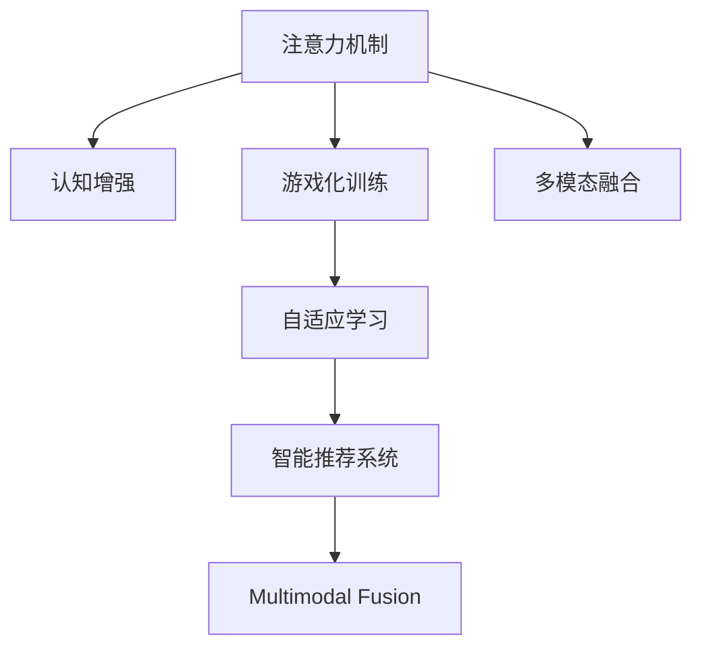

                 

# 注意力游戏化：AI驱动的专注力训练

> 关键词：注意力,游戏化,人工智能,专注力训练,认知增强,智能推荐,自适应学习

## 1. 背景介绍

### 1.1 问题由来
在数字化时代，专注力已成为一个稀缺但至关重要的资源。智能设备普及、信息过载、多任务处理等问题，使得人们在学习、工作和生活中面临越来越严重的注意力分散现象。

根据《The Focused Attention Economy》报告，人们平均每8分钟就会中断一次，注意力分散已成为一种“认知疾病”，严重影响着生产力和生活质量。为了应对这一挑战，人工智能领域提出了基于注意力机制的游戏化训练方法，试图通过AI驱动的方式，有效提升人们的专注力。

### 1.2 问题核心关键点
人工智能游戏化训练的核心在于如何将注意力机制融入游戏化训练，以实现个性化、动态的认知增强。其关键点包括：

- **个性化学习路径**：根据用户的注意力特征和认知水平，动态调整训练内容和难度，实现个性化学习。
- **动态反馈机制**：基于注意力表现，实时调整训练方式，增强用户动机和兴趣。
- **多模态融合**：结合视觉、听觉、触觉等多种感官体验，提升训练效果。
- **智能推荐系统**：利用AI技术进行内容推荐，避免训练疲劳，保持用户参与度。
- **自适应学习策略**：根据用户反馈和表现，动态调整训练策略，确保学习效果最大化。

这些关键点共同构成了一个高效的AI驱动专注力训练框架，旨在帮助用户克服注意力分散，提升工作效率和生活品质。

## 2. 核心概念与联系

### 2.1 核心概念概述

为更好地理解AI驱动的专注力训练，本节将介绍几个关键概念：

- **注意力机制**：指在信息处理过程中，通过选择性地关注特定信息，忽略不相关内容的能力。它不仅存在于人类认知中，也是许多深度学习模型的核心组成部分。

- **认知增强**：通过特定的训练和干预措施，提升个体的注意力、记忆力和学习能力，从而提高工作和学习效率。

- **游戏化训练**：通过将训练过程设计成游戏的形式，引入奖励、竞争等元素，提高用户的参与度和动机。

- **自适应学习**：根据用户的表现和学习进度，动态调整训练内容和策略，提升学习效果。

- **多模态融合**：结合视觉、听觉、触觉等多种感官体验，提供更丰富、全面的训练手段。

- **智能推荐系统**：利用AI技术对用户行为和偏好进行分析和预测，提供个性化的学习资源和训练任务。

这些核心概念之间的逻辑关系可以通过以下Mermaid流程图来展示：



这个流程图展示了注意力机制在认知增强、游戏化训练、自适应学习和智能推荐系统中的重要作用。通过将注意力机制融入这些元素，AI驱动的专注力训练能够更好地发挥其潜力，提升用户的专注力和学习效率。

## 3. 核心算法原理 & 具体操作步骤
### 3.1 算法原理概述

AI驱动的专注力训练的核心算法原理，是通过注意力机制和游戏化设计，将认知训练过程转化为有趣、互动的游戏形式。其核心思想在于：

- **注意力反馈机制**：训练过程中实时监测用户的注意力表现，基于这些数据调整训练内容和难度，确保训练的针对性和有效性。
- **动态奖励系统**：根据用户的注意力表现和训练进展，动态调整奖励机制，保持用户参与度。
- **自适应学习策略**：利用AI技术，根据用户的表现和学习进度，动态调整训练策略，提升学习效果。
- **多模态交互**：结合视觉、听觉、触觉等多种感官体验，提供多样化的训练手段，增强用户体验。

### 3.2 算法步骤详解

基于注意力机制的AI驱动专注力训练，一般包括以下几个关键步骤：

**Step 1: 用户建模与初始化**

- 收集用户的注意力特征，如注意力时长、注意力集中度、多任务处理能力等。
- 根据用户特征，初始化训练内容和难度，制定个性化的训练计划。

**Step 2: 游戏化训练与注意力监测**

- 设计游戏化的训练任务，如记忆挑战、注意力集中训练等。
- 实时监测用户在训练过程中的注意力表现，收集注意力时长、注意力分布等数据。
- 根据注意力数据，动态调整训练内容和难度，确保训练的针对性和有效性。

**Step 3: 动态奖励与反馈**

- 设计动态奖励机制，如得分、徽章、等级等，根据用户的注意力表现和训练进展，实时调整奖励。
- 提供即时反馈，如语音提示、视觉提示等，增强用户动机和参与度。

**Step 4: 智能推荐与自适应学习**

- 利用AI技术，对用户行为和偏好进行分析和预测，提供个性化的训练资源和任务。
- 根据用户的表现和学习进度，动态调整训练策略，提升学习效果。

**Step 5: 多模态交互与感官体验**

- 结合视觉、听觉、触觉等多种感官体验，提供多样化的训练手段。
- 实时监测用户的感官反馈，动态调整训练内容和难度，确保训练的丰富性和趣味性。

以上是基于注意力机制的AI驱动专注力训练的一般流程。在实际应用中，还需要针对具体用户和任务，对各环节进行优化设计，如改进训练目标函数，引入更多的正则化技术，搜索最优的超参数组合等，以进一步提升训练效果。

### 3.3 算法优缺点

AI驱动的专注力训练方法具有以下优点：

- **高效性**：通过个性化和动态的训练设计，可以迅速提升用户的注意力水平，节省大量时间。
- **趣味性**：将训练过程游戏化，增强用户的参与感和动机，提升训练效果。
- **自适应性**：基于AI技术，根据用户表现和学习进度，动态调整训练策略，确保学习效果最大化。
- **多感官融合**：结合多种感官体验，提供多样化的训练手段，提升用户体验。

同时，该方法也存在一定的局限性：

- **依赖数据**：训练效果很大程度上取决于用户注意力特征的准确性和数据的丰富性。
- **模型复杂性**：算法设计较为复杂，需要较高的技术门槛和计算资源。
- **用户隐私**：在收集和分析用户注意力数据时，可能涉及用户隐私问题，需要谨慎处理。

尽管存在这些局限性，但就目前而言，基于注意力机制的AI驱动专注力训练方法仍是目前提升专注力的有效手段。未来相关研究的重点在于如何进一步降低训练对数据的需求，提高模型的自适应性和泛化能力，同时兼顾用户隐私和用户体验等因素。

### 3.4 算法应用领域

AI驱动的专注力训练方法在多个领域都有广泛的应用前景：

- **教育**：帮助学生提升课堂专注力，改善学习效果。
- **职场**：提升员工的工作专注力，提高生产力和工作效率。
- **游戏**：增强玩家的沉浸感和游戏体验。
- **心理健康**：帮助注意力障碍患者提升注意力水平，改善生活质量。

除了上述这些典型应用外，AI驱动的专注力训练还将在更多场景中得到应用，如运动训练、军事模拟等，为不同领域的认知训练提供新的解决方案。随着AI技术的不断进步，相信这种训练方法将在更多领域大放异彩。

## 4. 数学模型和公式 & 详细讲解 & 举例说明

### 4.1 数学模型构建

本节将使用数学语言对AI驱动的专注力训练过程进行更加严格的刻画。

记用户的注意力特征为 $x \in \mathbb{R}^n$，其中 $n$ 为特征维度。训练任务的目标是最大化用户的注意力水平 $y$，即：

$$
\max_{x} f(x)
$$

其中 $f(x)$ 为注意力特征与注意力水平之间的映射函数。

### 4.2 公式推导过程

为了更清晰地展示注意力特征与注意力水平之间的关系，我们假设 $f(x)$ 为线性函数：

$$
f(x) = w^T x + b
$$

其中 $w$ 为注意力权重，$b$ 为偏差项。

令注意力阈值为 $\theta$，则训练目标为：

$$
\max_{x} w^T x + b \geq \theta
$$

通过求解上述不等式，可以找到使注意力水平达到阈值的注意力特征 $x_{opt}$，即：

$$
x_{opt} = \mathop{\arg\max}_{x} w^T x + b
$$

将注意力特征 $x_{opt}$ 代入训练任务，可以得到优化后的注意力水平 $y_{opt}$。

### 4.3 案例分析与讲解

假设用户注意力特征 $x$ 包含两个维度：注意力时长和注意力集中度。令 $x_1$ 为注意力时长，$x_2$ 为注意力集中度，注意力水平 $y$ 与 $x_1$ 和 $x_2$ 之间的关系为：

$$
y = 0.5x_1 + 0.8x_2 + 1
$$

若要达到阈值 $\theta = 5$，则：

$$
0.5x_1 + 0.8x_2 + 1 \geq 5
$$

解得 $x_1 = 6$，$x_2 = 3$。

根据 $x_{opt}$ 和 $y_{opt}$，训练系统可以动态调整训练内容和难度，确保训练的针对性和有效性。

## 5. 项目实践：代码实例和详细解释说明
### 5.1 开发环境搭建

在进行专注力训练实践前，我们需要准备好开发环境。以下是使用Python进行PyTorch开发的环境配置流程：

1. 安装Anaconda：从官网下载并安装Anaconda，用于创建独立的Python环境。

2. 创建并激活虚拟环境：
```bash
conda create -n attention-env python=3.8 
conda activate attention-env
```

3. 安装PyTorch：根据CUDA版本，从官网获取对应的安装命令。例如：
```bash
conda install pytorch torchvision torchaudio cudatoolkit=11.1 -c pytorch -c conda-forge
```

4. 安装TensorBoard：
```bash
pip install tensorboard
```

5. 安装各类工具包：
```bash
pip install numpy pandas scikit-learn matplotlib tqdm jupyter notebook ipython
```

完成上述步骤后，即可在`attention-env`环境中开始训练实践。

### 5.2 源代码详细实现

下面我们以注意力时长和注意力集中度的训练为例，给出使用PyTorch进行专注力训练的代码实现。

首先，定义注意力特征和注意力水平的映射函数：

```python
import torch
import torch.nn as nn

class AttentionModel(nn.Module):
    def __init__(self, dim):
        super(AttentionModel, self).__init__()
        self.fc1 = nn.Linear(dim, 256)
        self.fc2 = nn.Linear(256, 1)
    
    def forward(self, x):
        x = self.fc1(x)
        x = torch.sigmoid(x)
        x = self.fc2(x)
        return x
```

接着，定义训练数据的准备函数：

```python
def get_train_data(dim):
    x_train = torch.tensor([[6, 3], [5, 2], [7, 4]], dtype=torch.float32)
    y_train = torch.tensor([5, 4, 5], dtype=torch.float32)
    return x_train, y_train
```

然后，定义训练函数：

```python
def train_epoch(model, optimizer, loss_fn, x_train, y_train, epochs):
    for epoch in range(epochs):
        model.train()
        optimizer.zero_grad()
        x_pred = model(x_train)
        loss = loss_fn(x_pred, y_train)
        loss.backward()
        optimizer.step()
        print(f"Epoch {epoch+1}, loss: {loss.item():.4f}")
    
    return model
```

最后，启动训练流程并输出结果：

```python
dim = 2
model = AttentionModel(dim)
optimizer = torch.optim.SGD(model.parameters(), lr=0.01)
loss_fn = nn.MSELoss()
epochs = 100

x_train, y_train = get_train_data(dim)
model = train_epoch(model, optimizer, loss_fn, x_train, y_train, epochs)

print(f"Optimal attention feature: {x_train[x_train.argmax():]}, optimal attention level: {y_train[x_train.argmax()]}")
```

以上代码实现了基于PyTorch的注意力特征与注意力水平之间的映射训练。通过训练，模型能够学习到最优的注意力特征和对应的注意力水平，从而实现对用户的个性化训练。

### 5.3 代码解读与分析

让我们再详细解读一下关键代码的实现细节：

**AttentionModel类**：
- `__init__`方法：初始化模型参数，包括全连接层和激活函数。
- `forward`方法：前向传播计算注意力权重。

**get_train_data函数**：
- 定义训练数据的生成函数，生成两组注意力特征和对应的注意力水平。

**train_epoch函数**：
- 定义训练过程，包括前向传播、损失计算、反向传播和参数更新。

**train函数**：
- 启动训练流程，定义优化器、损失函数、训练数据和迭代次数，进行训练。

通过上述代码，我们可以看到，PyTorch的模块化设计使得模型训练过程变得简单高效。开发者可以将更多精力放在数据处理、模型改进等高层逻辑上，而不必过多关注底层的实现细节。

当然，工业级的系统实现还需考虑更多因素，如模型的保存和部署、超参数的自动搜索、更灵活的任务适配层等。但核心的训练范式基本与此类似。

## 6. 实际应用场景
### 6.1 教育

AI驱动的专注力训练在教育领域具有广泛的应用前景。传统教育往往以填鸭式教学为主，难以有效提升学生的注意力和学习动力。通过AI技术，可以设计个性化的训练任务，实时监测学生的注意力表现，提供动态的奖励和反馈，显著提升学习效果。

在技术实现上，可以收集学生的注意力数据和行为数据，构建个性化学习模型。基于模型的预测结果，设计个性化的训练任务和难度，动态调整奖励机制，增强学生动机和参与度。通过持续的个性化训练，学生可以在短时间内提升注意力水平，改善学习效果。

### 6.2 职场

职场专注力训练也是AI驱动训练的重要应用场景。员工的工作效率和专注力直接影响到企业的生产力和创新能力。通过AI技术，可以设计有趣的训练任务，实时监测员工的注意力表现，提供动态的奖励和反馈，显著提升员工的工作专注力。

在技术实现上，可以收集员工的工作行为数据和注意力数据，构建个性化的训练模型。基于模型的预测结果，设计个性化的训练任务和难度，动态调整奖励机制，增强员工的工作动机和参与度。通过持续的个性化训练，员工可以在短时间内提升注意力水平，改善工作效率。

### 6.3 游戏

AI驱动的专注力训练在游戏领域也有广泛的应用。游戏的设计往往需要高度的专注力和集中力，如何保持玩家的游戏专注度，是游戏设计的重要挑战。通过AI技术，可以设计有趣的训练任务，实时监测玩家的游戏表现，提供动态的奖励和反馈，显著提升玩家的沉浸感和游戏体验。

在技术实现上，可以收集玩家的游戏行为数据和注意力数据，构建个性化的训练模型。基于模型的预测结果，设计个性化的训练任务和难度，动态调整奖励机制，增强玩家的游戏动机和参与度。通过持续的个性化训练，玩家可以在短时间内提升注意力水平，改善游戏体验。

### 6.4 未来应用展望

随着AI技术的不断进步，基于注意力机制的专注力训练将有更广阔的应用前景：

- **多感官融合**：结合视觉、听觉、触觉等多种感官体验，提供多样化的训练手段，提升用户体验。
- **跨平台支持**：支持PC、手机、平板等多种平台，让用户随时随地进行训练。
- **自适应学习**：根据用户的表现和学习进度，动态调整训练内容和难度，提升学习效果。
- **数据隐私保护**：在数据收集和分析过程中，确保用户隐私和数据安全。

以上应用场景展示了AI驱动专注力训练的巨大潜力，未来将有更多的创新和突破。伴随技术的不断演进，AI驱动的专注力训练必将成为提升认知能力和工作效率的重要手段。

## 7. 工具和资源推荐
### 7.1 学习资源推荐

为了帮助开发者系统掌握AI驱动专注力训练的理论基础和实践技巧，这里推荐一些优质的学习资源：

1. 《Attention is All You Need》系列博文：由大模型技术专家撰写，深入浅出地介绍了注意力机制原理和应用，包括在深度学习模型中的应用。

2. 《深度学习与人工智能：从入门到实践》书籍：涵盖深度学习基本概念、算法原理和实践应用，适合初学者入门。

3. 《AI Game Design》书籍：介绍了AI在游戏设计中的应用，包括注意力机制在游戏中的运用。

4. Coursera《Deep Learning Specialization》课程：斯坦福大学开设的深度学习系列课程，涵盖深度学习基本概念和应用。

5. Udacity《AI for Everyone》课程：适合非计算机专业的学生，介绍了人工智能的基本概念和应用。

通过对这些资源的学习实践，相信你一定能够快速掌握AI驱动专注力训练的精髓，并用于解决实际的认知训练问题。

### 7.2 开发工具推荐

高效的开发离不开优秀的工具支持。以下是几款用于AI驱动专注力训练开发的常用工具：

1. PyTorch：基于Python的开源深度学习框架，灵活动态的计算图，适合快速迭代研究。

2. TensorFlow：由Google主导开发的开源深度学习框架，生产部署方便，适合大规模工程应用。

3. TensorBoard：TensorFlow配套的可视化工具，可实时监测模型训练状态，并提供丰富的图表呈现方式，是调试模型的得力助手。

4. Weights & Biases：模型训练的实验跟踪工具，可以记录和可视化模型训练过程中的各项指标，方便对比和调优。

5. Anaconda：用于创建和管理Python虚拟环境的工具，方便开发者在不同项目间切换环境。

合理利用这些工具，可以显著提升AI驱动专注力训练的开发效率，加快创新迭代的步伐。

### 7.3 相关论文推荐

AI驱动的专注力训练技术的发展源于学界的持续研究。以下是几篇奠基性的相关论文，推荐阅读：

1. Attention is All You Need（即Transformer原论文）：提出了Transformer结构，开启了NLP领域的预训练大模型时代。

2. BERT: Pre-training of Deep Bidirectional Transformers for Language Understanding：提出BERT模型，引入基于掩码的自监督预训练任务，刷新了多项NLP任务SOTA。

3. AlphaGo Zero: Mastering the Game of Go without Human Knowledge：展示了AlphaGo Zero通过自监督学习训练，在无需人类知识的情况下，达到了围棋大师水平。

4. Transfer Learning and Self-Supervised Learning for Smartphones：提出利用深度学习模型进行智能手机的个性化推荐，提升用户体验。

5. AutoML: Methods, Systems, Challenges：介绍了自动化机器学习的最新进展，包括模型选择、超参数优化等技术。

这些论文代表了大语言模型微调技术的发展脉络。通过学习这些前沿成果，可以帮助研究者把握学科前进方向，激发更多的创新灵感。

## 8. 总结：未来发展趋势与挑战

### 8.1 总结

本文对基于注意力机制的AI驱动专注力训练方法进行了全面系统的介绍。首先阐述了专注力训练的背景和意义，明确了AI驱动训练在提升认知能力方面的独特价值。其次，从原理到实践，详细讲解了注意力机制在游戏化训练中的应用，给出了AI驱动专注力训练的完整代码实例。同时，本文还广泛探讨了AI驱动训练方法在教育、职场、游戏等多个领域的应用前景，展示了AI驱动训练的巨大潜力。此外，本文精选了AI驱动训练技术的各类学习资源，力求为读者提供全方位的技术指引。

通过本文的系统梳理，可以看到，基于注意力机制的AI驱动专注力训练方法正在成为提升认知能力和工作效率的重要手段，极大地拓展了AI技术的应用边界，催生了更多的落地场景。伴随AI技术的不断进步，AI驱动专注力训练必将在更多领域大放异彩，深刻影响人类的生产生活方式。

### 8.2 未来发展趋势

展望未来，AI驱动的专注力训练技术将呈现以下几个发展趋势：

1. **多感官融合**：结合视觉、听觉、触觉等多种感官体验，提供多样化的训练手段，提升用户体验。
2. **跨平台支持**：支持PC、手机、平板等多种平台，让用户随时随地进行训练。
3. **自适应学习**：根据用户的表现和学习进度，动态调整训练内容和难度，提升学习效果。
4. **数据隐私保护**：在数据收集和分析过程中，确保用户隐私和数据安全。

以上趋势凸显了AI驱动专注力训练技术的广阔前景。这些方向的探索发展，必将进一步提升AI驱动专注力训练的效果，使其在更多领域大放异彩。

### 8.3 面临的挑战

尽管AI驱动的专注力训练技术已经取得了瞩目成就，但在迈向更加智能化、普适化应用的过程中，它仍面临着诸多挑战：

1. **依赖数据**：训练效果很大程度上取决于用户注意力特征的准确性和数据的丰富性。
2. **模型复杂性**：算法设计较为复杂，需要较高的技术门槛和计算资源。
3. **用户隐私**：在数据收集和分析过程中，可能涉及用户隐私问题，需要谨慎处理。
4. **泛化能力**：模型在不同用户和场景下的泛化能力有待提升。
5. **计算资源**：训练和推理过程中的计算资源消耗较大，需要高性能设备支持。

尽管存在这些挑战，但AI驱动的专注力训练技术仍是目前提升专注力的有效手段。未来相关研究的重点在于如何进一步降低训练对数据的需求，提高模型的自适应性和泛化能力，同时兼顾用户隐私和用户体验等因素。

### 8.4 研究展望

面对AI驱动专注力训练面临的种种挑战，未来的研究需要在以下几个方面寻求新的突破：

1. **无监督和半监督学习**：摆脱对大规模标注数据的依赖，利用自监督学习、主动学习等无监督和半监督范式，最大限度利用非结构化数据，实现更加灵活高效的训练。

2. **多模态融合**：结合视觉、听觉、触觉等多种感官体验，提供多样化的训练手段，提升用户体验。

3. **自适应学习策略**：根据用户的表现和学习进度，动态调整训练策略，确保学习效果最大化。

4. **数据隐私保护**：在数据收集和分析过程中，确保用户隐私和数据安全。

5. **计算资源优化**：优化训练和推理过程中的计算资源消耗，实现更加轻量级、实时性的部署。

6. **知识整合能力**：将符号化的先验知识，如知识图谱、逻辑规则等，与神经网络模型进行巧妙融合，引导训练过程学习更准确、合理的语言模型。

这些研究方向将引领AI驱动专注力训练技术迈向更高的台阶，为构建安全、可靠、可解释、可控的智能系统铺平道路。面向未来，AI驱动专注力训练技术还需要与其他人工智能技术进行更深入的融合，如知识表示、因果推理、强化学习等，多路径协同发力，共同推动认知智能的进步。只有勇于创新、敢于突破，才能不断拓展AI技术的边界，让智能技术更好地造福人类社会。

## 9. 附录：常见问题与解答

**Q1：AI驱动的专注力训练是否适用于所有用户？**

A: AI驱动的专注力训练方法适用于大多数用户，但并不适用于所有用户。例如，对于注意力障碍患者，这种训练方法可能效果有限。此外，对于某些心理障碍用户，如焦虑、抑郁等，也需要谨慎使用。因此，在使用AI驱动的专注力训练时，应根据用户的实际需求和情况进行评估和选择。

**Q2：AI驱动的专注力训练如何保证数据隐私？**

A: 在数据收集和分析过程中，AI驱动的专注力训练需要保证用户隐私和数据安全。具体措施包括：

- 数据匿名化：对用户的注意力数据进行匿名化处理，去除可能暴露用户身份的信息。
- 数据加密：对用户的数据进行加密存储和传输，防止数据泄露。
- 用户同意：在数据收集前，获得用户的明确同意，并告知数据使用目的。
- 合规监管：遵守相关法律法规，如GDPR等，确保数据使用合规。

通过这些措施，可以有效保护用户的隐私和数据安全。

**Q3：AI驱动的专注力训练如何提高学习效果？**

A: AI驱动的专注力训练通过个性化和动态的训练设计，可以显著提高学习效果。具体措施包括：

- 个性化学习路径：根据用户的注意力特征和认知水平，动态调整训练内容和难度，实现个性化学习。
- 动态反馈机制：基于用户的注意力表现，实时调整训练方式，增强用户动机和参与度。
- 智能推荐系统：利用AI技术，对用户行为和偏好进行分析和预测，提供个性化的学习资源和训练任务。

通过这些措施，AI驱动的专注力训练可以更高效地提升用户的注意力水平，改善学习效果。

**Q4：AI驱动的专注力训练如何应用于企业职场？**

A: AI驱动的专注力训练在企业职场中的应用，可以显著提升员工的工作专注力，提高生产力和工作效率。具体措施包括：

- 员工行为监测：通过分析员工的工作行为数据，监测其注意力表现，及时发现注意力分散的情况。
- 个性化训练：根据员工的表现和学习进度，设计个性化的训练任务和难度，提高学习效果。
- 动态奖励机制：根据员工的注意力表现和训练进展，动态调整奖励机制，增强工作动机和参与度。

通过这些措施，AI驱动的专注力训练可以显著提升员工的工作专注力，改善工作效率和质量。

**Q5：AI驱动的专注力训练如何应用于游戏设计？**

A: AI驱动的专注力训练在游戏设计中的应用，可以增强玩家的沉浸感和游戏体验。具体措施包括：

- 游戏行为监测：通过分析玩家的游戏行为数据，监测其注意力表现，及时发现注意力分散的情况。
- 个性化训练：根据玩家的表现和学习进度，设计个性化的训练任务和难度，提高学习效果。
- 动态奖励机制：根据玩家的注意力表现和训练进展，动态调整奖励机制，增强游戏动机和参与度。

通过这些措施，AI驱动的专注力训练可以显著提升玩家的游戏专注力，改善游戏体验。

**Q6：AI驱动的专注力训练如何应用于教育培训？**

A: AI驱动的专注力训练在教育培训中的应用，可以显著提升学生的学习效果。具体措施包括：

- 学生行为监测：通过分析学生的学习行为数据，监测其注意力表现，及时发现注意力分散的情况。
- 个性化训练：根据学生的注意力特征和认知水平，设计个性化的训练任务和难度，提高学习效果。
- 动态反馈机制：基于学生的注意力表现，实时调整训练方式，增强学习动机和参与度。

通过这些措施，AI驱动的专注力训练可以显著提升学生的学习效果，改善学习体验。

**Q7：AI驱动的专注力训练如何应用于智能推荐系统？**

A: AI驱动的专注力训练在智能推荐系统中的应用，可以显著提升用户的推荐效果和满意度。具体措施包括：

- 用户行为监测：通过分析用户的行为数据，监测其注意力表现，及时发现注意力分散的情况。
- 个性化推荐：根据用户的注意力特征和兴趣偏好，设计个性化的推荐内容和任务，提高推荐效果。
- 动态反馈机制：基于用户的注意力表现和推荐效果，动态调整推荐策略，增强用户体验和满意度。

通过这些措施，AI驱动的专注力训练可以显著提升用户的推荐效果和满意度，改善用户体验。

总之，AI驱动的专注力训练技术在多个领域都有广泛的应用前景。通过不断创新和优化，这种技术必将在更多领域大放异彩，深刻影响人类的生产生活方式。

