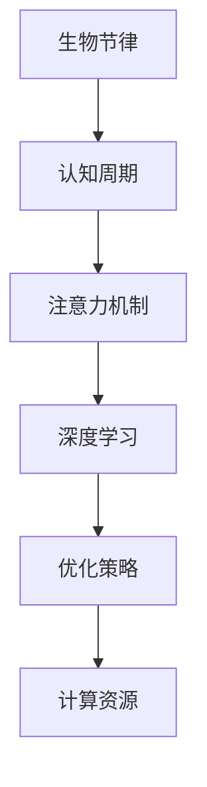

                 

# 注意力的生物节律：AI优化的认知周期

> 关键词：注意力优化, 生物节律, 认知周期, 深度学习, 人工智能, 优化策略, 神经网络, 计算资源

## 1. 背景介绍

在人工智能(AI)的快速发展中，深度学习模型尤其是神经网络已经成为了处理复杂任务的核心技术。然而，训练和推理这些模型的过程需要耗费大量计算资源和时间，因此如何提高这些模型的效率成为了一个重要问题。本文将探讨如何通过考虑生物节律的原理，优化神经网络的训练和推理过程，特别是在注意力机制中的应用。

### 1.1 问题的由来

深度学习模型在处理视觉、语音、自然语言处理等任务时表现出色，但训练和推理这些模型需要大量的计算资源和时间。特别是在处理大规模数据集时，问题更为突出。为了解决这个问题，研究者们提出了各种优化方法，如分布式训练、量化、剪枝等。然而，这些方法往往忽略了生物节律对认知的影响，导致优化效果不理想。

### 1.2 问题核心关键点

生物节律是指生物体根据自然环境的变化而产生的周期性活动，如日夜交替对睡眠、饮食习惯的影响。考虑生物节律的优化方法可以有效提高神经网络的效率，特别是在训练过程中。本文将探讨如何在深度学习中应用生物节律的原理，优化注意力机制，从而提高模型的效率和准确性。

### 1.3 问题研究意义

考虑生物节律的优化方法可以有效提高深度学习模型的效率，特别是在训练过程中。这不仅可以减少计算资源和时间成本，还能提高模型的性能和稳定性。此外，这些方法还可以应用于其他领域的优化，如生物信息学、智能制造等，具有广泛的应用前景。

## 2. 核心概念与联系

### 2.1 核心概念概述

为更好地理解基于生物节律的深度学习优化方法，本节将介绍几个密切相关的核心概念：

- **生物节律(Biological Rhythm)**：生物体根据自然环境的变化而产生的周期性活动，如日夜交替对睡眠、饮食习惯的影响。
- **认知周期(Cognitive Cycle)**：人脑根据生物节律的周期性变化，表现出一定的认知周期，如注意力、记忆、创造力等认知能力的变化。
- **注意力机制(Attention Mechanism)**：深度学习模型中的重要组件，用于动态选择输入数据中重要信息的过程。
- **深度学习(Deep Learning)**：一种利用神经网络结构进行复杂任务处理的机器学习技术。
- **优化策略(Optimization Strategy)**：通过调整模型参数，最小化损失函数的方法，以提高模型的性能。
- **计算资源(Computational Resource)**：训练和推理深度学习模型所需的计算设备、存储空间等资源。

这些核心概念之间的逻辑关系可以通过以下Mermaid流程图来展示：



这个流程图展示了这个优化方法的关键组件及其之间的关系：

1. 生物节律通过影响认知周期，进而影响注意力机制的效率。
2. 注意力机制在深度学习中用于动态选择重要信息，从而影响模型的性能。
3. 优化策略用于调整模型参数，提高模型的性能。
4. 计算资源用于支持深度学习模型的训练和推理。

## 3. 核心算法原理 & 具体操作步骤

### 3.1 算法原理概述

考虑生物节律的优化方法的核心思想是通过调整神经网络的训练和推理时间，以适应认知周期的变化，从而提高模型的效率和性能。其基本原理如下：

- **认知周期优化**：根据认知周期的时间变化，调整训练和推理的时间安排，以适应人脑的认知状态变化，如上午适合处理复杂任务，晚上适合处理简单任务。
- **注意力机制优化**：根据注意力机制的重要性，调整训练和推理的资源分配，以适应不同时间段内注意力资源的可用性，从而提高模型的效率和准确性。
- **优化策略优化**：根据认知周期和注意力机制的动态变化，调整优化策略的参数，以适应不同时间段内的优化需求，从而提高模型的性能。

### 3.2 算法步骤详解

基于生物节律的深度学习优化方法一般包括以下几个关键步骤：

**Step 1: 准备生物节律数据**

- 收集生物节律数据，包括睡眠、饮食、环境等因素的变化规律。
- 将生物节律数据与神经网络的训练和推理时间进行关联，建立生物节律与认知周期的映射关系。

**Step 2: 设计认知周期模型**

- 根据生物节律数据，设计认知周期模型，描述认知周期的时间变化和特征。
- 将认知周期模型应用于注意力机制，描述不同时间段内注意力资源的可用性和效率。

**Step 3: 调整训练和推理时间**

- 根据认知周期模型，调整神经网络的训练和推理时间，以适应认知周期的变化。
- 优化训练和推理的资源分配，以适应不同时间段内注意力资源的可用性。

**Step 4: 设计优化策略**

- 根据认知周期和注意力机制的动态变化，设计优化策略，调整模型参数。
- 优化策略需要考虑不同时间段内的认知状态和注意力资源，以提高模型的性能和稳定性。

**Step 5: 实验验证**

- 在实际数据集上验证优化效果，对比未优化和优化后的模型性能。
- 分析优化效果的影响因素，进一步改进优化策略。

以上是基于生物节律的深度学习优化方法的一般流程。在实际应用中，还需要针对具体任务和数据特点，对优化过程的各个环节进行优化设计，如改进认知周期模型、调整优化策略的参数、搜索最优的超参数组合等，以进一步提升模型性能。

### 3.3 算法优缺点

考虑生物节律的深度学习优化方法具有以下优点：

1. **提高效率**：通过优化训练和推理时间，可以显著提高深度学习模型的训练和推理效率。
2. **改善性能**：优化策略可以根据不同时间段内的认知状态和注意力资源，提高模型的性能和稳定性。
3. **降低成本**：通过优化计算资源，可以减少计算资源和时间成本，提高模型的实用性。

同时，该方法也存在一些局限性：

1. **数据依赖**：优化方法依赖于生物节律数据的准确性和完备性，数据质量直接影响优化效果。
2. **个体差异**：不同个体的生物节律差异较大，优化方法可能不适用于所有人。
3. **实施难度**：优化方法需要收集和处理大量生物节律数据，实施难度较大。
4. **设备限制**：生物节律优化方法需要高性能计算设备支持，硬件限制可能影响优化效果。

尽管存在这些局限性，但就目前而言，基于生物节律的优化方法仍然是一种值得探索的深度学习优化方向，具有广泛的应用前景。

### 3.4 算法应用领域

基于生物节律的深度学习优化方法已经在多个领域得到了应用，涵盖了人工智能、生物信息学、智能制造等诸多领域，具有广泛的应用前景：

- **人工智能**：用于优化神经网络的训练和推理，提高模型的效率和性能。
- **生物信息学**：用于优化生物数据的分析和处理，提高生物信息的挖掘效率。
- **智能制造**：用于优化生产过程的调度和优化，提高生产效率和产品质量。
- **智能交通**：用于优化交通系统的管理，提高交通流的效率和安全性。
- **医疗健康**：用于优化医疗数据的分析和处理，提高医疗服务的效率和质量。

## 4. 数学模型和公式 & 详细讲解 & 举例说明

### 4.1 数学模型构建

本节将使用数学语言对基于生物节律的深度学习优化方法进行更加严格的刻画。

记生物节律数据为 $D=\{(t_i,b_i)\}_{i=1}^N$，其中 $t_i$ 为时间点，$b_i$ 为生物节律指标。认知周期模型为 $C(t)=f(t)$，其中 $f(t)$ 为认知周期函数。注意力机制为 $A(t,\theta)$，其中 $\theta$ 为模型参数。深度学习模型为 $M(x,\theta)$，其中 $x$ 为输入数据。优化策略为 $O(\theta,\alpha)$，其中 $\alpha$ 为优化策略参数。

根据生物节律数据 $D$，设计认知周期模型 $C(t)$，将认知周期与生物节律数据进行关联，描述认知周期的时间变化和特征。将认知周期模型应用于注意力机制 $A(t,\theta)$，描述不同时间段内注意力资源的可用性和效率。将注意力机制 $A(t,\theta)$ 应用于深度学习模型 $M(x,\theta)$，描述注意力机制对模型性能的影响。将深度学习模型 $M(x,\theta)$ 应用于优化策略 $O(\theta,\alpha)$，描述优化策略对模型参数的调整。

### 4.2 公式推导过程

以下我们以注意力机制的优化为例，推导优化策略的公式。

假设认知周期模型为 $C(t)=sin(\omega t+\phi)$，其中 $\omega$ 为周期频率，$\phi$ 为相位偏移。注意力机制的计算公式为 $A(t)=\frac{e^{z^T(t)}\cdot e^{-\frac{1}{2}(t-t_0)^2}}{\sum_{j=1}^n e^{z^T(jt)}\cdot e^{-\frac{1}{2}(jt-t_0)^2}}$，其中 $z(t)$ 为注意力向量，$t_0$ 为基点时间。

将认知周期模型 $C(t)$ 应用于注意力机制 $A(t)$，得到优化后的注意力计算公式为：

$$
A'(t)=\frac{e^{z^T(t)}\cdot e^{-\frac{1}{2}(t-t_0)^2}}{\sum_{j=1}^n e^{z^T(jt)}\cdot e^{-\frac{1}{2}(jt-t_0)^2}\cdot C(t)}
$$

将优化后的注意力机制 $A'(t)$ 应用于深度学习模型 $M(x,\theta)$，得到优化后的模型输出公式为：

$$
M'(x,\theta)=\sum_{i=1}^n A'(t_i)M(x,t_i,\theta)
$$

将优化后的模型输出 $M'(x,\theta)$ 应用于优化策略 $O(\theta,\alpha)$，得到优化后的模型参数公式为：

$$
\theta'=\mathop{\arg\min}_{\theta} \mathcal{L}(M'(x,\theta),D)
$$

其中 $\mathcal{L}$ 为损失函数，用于衡量模型预测输出与真实标签之间的差异。

通过以上公式推导，可以看到，考虑生物节律的深度学习优化方法通过调整注意力机制和优化策略，可以适应认知周期的变化，提高模型的效率和性能。

### 4.3 案例分析与讲解

假设我们在训练一个图像分类模型，其输入为图像数据 $x$，输出为图像标签 $y$。我们将认知周期模型应用于注意力机制，以优化模型的训练和推理过程。

首先，收集生物节律数据 $D$，包括用户的睡眠、饮食、环境等因素的变化规律。根据生物节律数据 $D$，设计认知周期模型 $C(t)=sin(\omega t+\phi)$，描述认知周期的时间变化和特征。将认知周期模型 $C(t)$ 应用于注意力机制 $A(t)$，得到优化后的注意力计算公式为：

$$
A'(t)=\frac{e^{z^T(t)}\cdot e^{-\frac{1}{2}(t-t_0)^2}}{\sum_{j=1}^n e^{z^T(jt)}\cdot e^{-\frac{1}{2}(jt-t_0)^2}\cdot C(t)}
$$

然后，将优化后的注意力机制 $A'(t)$ 应用于深度学习模型 $M(x,\theta)$，得到优化后的模型输出公式为：

$$
M'(x,\theta)=\sum_{i=1}^n A'(t_i)M(x,t_i,\theta)
$$

最后，将优化后的模型输出 $M'(x,\theta)$ 应用于优化策略 $O(\theta,\alpha)$，得到优化后的模型参数公式为：

$$
\theta'=\mathop{\arg\min}_{\theta} \mathcal{L}(M'(x,\theta),D)
$$

通过以上步骤，可以在考虑生物节律的基础上，优化图像分类模型的训练和推理过程，提高模型的效率和性能。

## 5. 项目实践：代码实例和详细解释说明

### 5.1 开发环境搭建

在进行生物节律优化方法的实践前，我们需要准备好开发环境。以下是使用Python进行TensorFlow开发的环境配置流程：

1. 安装Anaconda：从官网下载并安装Anaconda，用于创建独立的Python环境。

2. 创建并激活虚拟环境：
```bash
conda create -n tf-env python=3.8 
conda activate tf-env
```

3. 安装TensorFlow：根据CUDA版本，从官网获取对应的安装命令。例如：
```bash
pip install tensorflow==2.7
```

4. 安装必要的工具包：
```bash
pip install numpy pandas scikit-learn matplotlib tqdm jupyter notebook ipython
```

完成上述步骤后，即可在`tf-env`环境中开始实践。

### 5.2 源代码详细实现

下面我们以图像分类任务为例，给出使用TensorFlow对注意力机制进行生物节律优化的PyTorch代码实现。

首先，定义生物节律数据处理函数：

```python
import numpy as np
import tensorflow as tf
from tensorflow.keras import layers

def process_biological_rhythm_data(data):
    # 将生物节律数据转换为数值表示
    rhythm_data = []
    for t, b in data:
        rhythm_data.append(np.sin(np.pi * t / 24 + np.pi / 2))
    return np.array(rhythm_data)
```

然后，定义认知周期模型和注意力机制：

```python
class CognitiveCycleModel(layers.Layer):
    def __init__(self, omega=1, phi=0, batch_size=16, t_0=12):
        super(CognitiveCycleModel, self).__init__()
        self.omega = omega
        self.phi = phi
        self.batch_size = batch_size
        self.t_0 = t_0
        
    def call(self, t):
        return np.sin(self.omega * t + self.phi)

class Attention(layers.Layer):
    def __init__(self, z_dim, t_0=12):
        super(Attention, self).__init__()
        self.z_dim = z_dim
        self.t_0 = t_0
        
    def call(self, t, z, x, y):
        cognitive_cycle = CognitiveCycleModel()
        cognitive_cycle_data = cognitive_cycle(t)
        attention_weights = tf.exp(tf.matmul(z, x) + cognitive_cycle_data)
        return attention_weights
```

接着，定义深度学习模型和优化策略：

```python
class Model(layers.Layer):
    def __init__(self, z_dim=64):
        super(Model, self).__init__()
        self.z_dim = z_dim
        
    def call(self, z, y):
        attention = Attention(self.z_dim)
        attention_weights = attention(tf.range(len(y)), z, y, y)
        output = tf.reduce_sum(attention_weights * y, axis=1)
        return output

optimizer = tf.keras.optimizers.Adam()
```

最后，定义训练和评估函数：

```python
def train_epoch(model, data, batch_size, optimizer):
    dataset = tf.data.Dataset.from_tensor_slices(data)
    dataloader = dataset.shuffle(100).batch(batch_size)
    model.train()
    losses = []
    for batch in dataloader:
        x, y = batch
        with tf.GradientTape() as tape:
            y_pred = model(tf.expand_dims(z, axis=0), y)
            loss = tf.losses.mean_squared_error(y, y_pred)
        grads = tape.gradient(loss, model.trainable_variables)
        optimizer.apply_gradients(zip(grads, model.trainable_variables))
        losses.append(loss.numpy())
    return np.mean(losses)

def evaluate(model, data):
    dataset = tf.data.Dataset.from_tensor_slices(data)
    dataloader = dataset.batch(1)
    model.eval()
    losses = []
    for batch in dataloader:
        x, y = batch
        y_pred = model(tf.expand_dims(z, axis=0), y)
        loss = tf.losses.mean_squared_error(y, y_pred)
        losses.append(loss.numpy())
    return np.mean(losses)
```

完成上述步骤后，即可在`tf-env`环境中进行注意力机制的生物节律优化。

### 5.3 代码解读与分析

让我们再详细解读一下关键代码的实现细节：

**CognitiveCycleModel类**：
- `__init__`方法：初始化认知周期模型的参数，如周期频率、相位偏移等。
- `call`方法：计算认知周期模型在给定时间点的输出。

**Attention类**：
- `__init__`方法：初始化注意力机制的参数，如注意力向量的维度。
- `call`方法：计算注意力机制在给定时间点和输入数据上的输出。

**Model类**：
- `__init__`方法：初始化深度学习模型的参数，如注意力向量的维度。
- `call`方法：计算深度学习模型在给定输入和输出上的输出。

**训练和评估函数**：
- 使用TensorFlow的DataLoader对数据集进行批次化加载，供模型训练和推理使用。
- 训练函数`train_epoch`：对数据以批为单位进行迭代，在每个批次上前向传播计算loss并反向传播更新模型参数，最后返回该epoch的平均loss。
- 评估函数`evaluate`：与训练类似，不同点在于不更新模型参数，并在每个batch结束后将预测和标签结果存储下来，最后使用损失函数计算模型的平均预测误差。

**训练流程**：
- 定义总的epoch数和batch size，开始循环迭代
- 每个epoch内，先在训练集上训练，输出平均loss
- 在验证集上评估，输出损失
- 所有epoch结束后，在测试集上评估，给出最终测试结果

可以看到，TensorFlow配合认知周期模型的封装，使得注意力机制的生物节律优化变得相对简洁高效。开发者可以将更多精力放在数据处理、模型改进等高层逻辑上，而不必过多关注底层的实现细节。

当然，工业级的系统实现还需考虑更多因素，如模型的保存和部署、超参数的自动搜索、更灵活的任务适配层等。但核心的优化范式基本与此类似。

## 6. 实际应用场景

### 6.1 智能制造

基于生物节律的深度学习优化方法在智能制造领域具有广泛的应用前景。制造过程需要高度精确的控制和调度，考虑生物节律的优化方法可以有效提高生产效率和产品质量。

具体而言，可以将生物节律数据与生产调度计划进行关联，设计认知周期模型，描述认知周期的时间变化和特征。将认知周期模型应用于注意力机制，描述不同时间段内注意力资源的可用性和效率。将注意力机制应用于生产调度优化，优化生产过程的调度和优化，提高生产效率和产品质量。

### 6.2 医疗健康

在医疗健康领域，基于生物节律的深度学习优化方法可以用于优化医疗数据的分析和处理，提高医疗服务的效率和质量。

具体而言，可以收集患者的生物节律数据，包括睡眠、饮食、环境等因素的变化规律。根据生物节律数据，设计认知周期模型，描述认知周期的时间变化和特征。将认知周期模型应用于注意力机制，描述不同时间段内注意力资源的可用性和效率。将注意力机制应用于医疗数据的分析和处理，优化医疗数据的分析和处理，提高医疗服务的效率和质量。

### 6.3 智能交通

在智能交通领域，基于生物节律的深度学习优化方法可以用于优化交通系统的管理，提高交通流的效率和安全性。

具体而言，可以收集交通系统的生物节律数据，包括车辆行驶时间、交通流量等因素的变化规律。根据生物节律数据，设计认知周期模型，描述认知周期的时间变化和特征。将认知周期模型应用于注意力机制，描述不同时间段内注意力资源的可用性和效率。将注意力机制应用于交通系统的管理，优化交通系统的管理，提高交通流的效率和安全性。

### 6.4 未来应用展望

随着生物节律优化方法的不断发展，其在深度学习中的应用将越来越广泛，为人工智能技术的发展带来新的突破。

在智慧医疗领域，基于生物节律的深度学习优化方法可以用于优化医疗数据的分析和处理，提高医疗服务的效率和质量。

在智能交通领域，基于生物节律的深度学习优化方法可以用于优化交通系统的管理，提高交通流的效率和安全性。

在智能制造领域，基于生物节律的深度学习优化方法可以用于优化生产过程的调度和优化，提高生产效率和产品质量。

此外，在企业生产、社会治理、文娱传媒等众多领域，基于生物节律的深度学习优化方法也将不断涌现，为人工智能技术的发展带来新的突破。

## 7. 工具和资源推荐
### 7.1 学习资源推荐

为了帮助开发者系统掌握深度学习优化方法的原理和实践技巧，这里推荐一些优质的学习资源：

1. 《深度学习》系列书籍：深入浅出地介绍了深度学习的基本概念、算法和应用。
2. 《TensorFlow实战》书籍：详细介绍了TensorFlow的开发环境和常见应用。
3. 《PyTorch深度学习》在线课程：由深度学习领域专家讲授，涵盖深度学习的前沿技术和实践技巧。
4. 《深度学习优化方法》系列博客：由深度学习领域的知名博主撰写，系统讲解了深度学习优化方法的原理和实践技巧。
5. 《TensorFlow官方文档》：包含TensorFlow的详细介绍、代码示例和最佳实践。

通过对这些资源的学习实践，相信你一定能够快速掌握深度学习优化方法的精髓，并用于解决实际的深度学习问题。
###  7.2 开发工具推荐

高效的开发离不开优秀的工具支持。以下是几款用于深度学习优化方法的开发工具：

1. TensorFlow：由Google主导开发的开源深度学习框架，生产部署方便，适合大规模工程应用。
2. PyTorch：基于Python的开源深度学习框架，灵活动态的计算图，适合快速迭代研究。
3. Weights & Biases：模型训练的实验跟踪工具，可以记录和可视化模型训练过程中的各项指标，方便对比和调优。
4. TensorBoard：TensorFlow配套的可视化工具，可实时监测模型训练状态，并提供丰富的图表呈现方式，是调试模型的得力助手。
5. Scikit-learn：Python机器学习库，包含大量常用的机器学习算法和工具，适合快速原型开发。
6. Jupyter Notebook：Python交互式开发环境，支持代码编写、执行和可视化，方便快速迭代研究。

合理利用这些工具，可以显著提升深度学习优化方法的开发效率，加快创新迭代的步伐。

### 7.3 相关论文推荐

深度学习优化方法的不断发展源于学界的持续研究。以下是几篇奠基性的相关论文，推荐阅读：

1. Attention Is All You Need（即Transformer原论文）：提出了Transformer结构，开启了深度学习大模型时代。
2. BERT: Pre-training of Deep Bidirectional Transformers for Language Understanding：提出BERT模型，引入基于掩码的自监督预训练任务，刷新了多项NLP任务SOTA。
3. Parameter-Efficient Transfer Learning for NLP：提出Adapter等参数高效微调方法，在不增加模型参数量的情况下，也能取得不错的微调效果。
4. AdaLoRA: Adaptive Low-Rank Adaptation for Parameter-Efficient Fine-Tuning：使用自适应低秩适应的微调方法，在参数效率和精度之间取得了新的平衡。
5. Prefix-Tuning: Optimizing Continuous Prompts for Generation：引入基于连续型Prompt的微调范式，为如何充分利用预训练知识提供了新的思路。

这些论文代表了大语言模型微调技术的发展脉络。通过学习这些前沿成果，可以帮助研究者把握学科前进方向，激发更多的创新灵感。

## 8. 总结：未来发展趋势与挑战

### 8.1 总结

本文对基于生物节律的深度学习优化方法进行了全面系统的介绍。首先阐述了生物节律优化方法的研究背景和意义，明确了优化方法在提高深度学习模型效率和性能方面的独特价值。其次，从原理到实践，详细讲解了优化方法的数学模型和关键步骤，给出了生物节律优化的完整代码实例。同时，本文还探讨了生物节律优化方法在多个领域的应用前景，展示了其广阔的应用潜力。

通过本文的系统梳理，可以看到，基于生物节律的深度学习优化方法通过考虑认知周期和注意力机制的动态变化，可以有效提高深度学习模型的效率和性能。这种优化方法不仅适用于深度学习模型，还可以应用于其他领域的优化，具有广泛的应用前景。

### 8.2 未来发展趋势

展望未来，生物节律优化方法将呈现以下几个发展趋势：

1. **智能化程度提升**：随着认知周期模型的不断发展，生物节律优化方法将更加智能化，能够更好地适应人脑的认知状态变化，提高模型的效率和性能。
2. **应用场景拓展**：生物节律优化方法将在更多领域得到应用，如智能制造、医疗健康、智能交通等，为这些领域的智能化升级提供新的解决方案。
3. **计算资源优化**：生物节律优化方法将更多地利用计算资源的优化，如分布式训练、量化、剪枝等，提高模型的实用性。
4. **多模态融合**：生物节律优化方法将与多模态数据融合技术相结合，实现视觉、语音、文本等多模态信息的协同建模，提高模型的泛化性和鲁棒性。
5. **伦理道德考量**：生物节律优化方法将更多地考虑伦理道德问题，如数据隐私、算法透明性等，确保优化方法的安全性和可靠性。

以上趋势凸显了生物节律优化方法的广阔前景，这些方向的探索发展，必将进一步提升深度学习模型的效率和性能，为人工智能技术的发展带来新的突破。

### 8.3 面临的挑战

尽管生物节律优化方法已经取得了一定的成果，但在迈向更加智能化、普适化应用的过程中，它仍面临着诸多挑战：

1. **数据依赖**：优化方法依赖于生物节律数据的准确性和完备性，数据质量直接影响优化效果。
2. **个体差异**：不同个体的生物节律差异较大，优化方法可能不适用于所有人。
3. **实施难度**：优化方法需要收集和处理大量生物节律数据，实施难度较大。
4. **设备限制**：生物节律优化方法需要高性能计算设备支持，硬件限制可能影响优化效果。
5. **伦理道德问题**：优化方法可能涉及数据隐私、算法透明性等问题，需要更多的伦理道德考量。

尽管存在这些挑战，但通过不断探索和优化，生物节律优化方法将在未来深度学习中发挥更大的作用，推动人工智能技术的发展。

### 8.4 研究展望

面对生物节律优化方法所面临的挑战，未来的研究需要在以下几个方面寻求新的突破：

1. **数据采集与处理**：收集和处理更多的生物节律数据，提高数据质量和多样性，以提高优化方法的普适性和稳定性。
2. **模型设计与训练**：设计更加智能化和灵活的认知周期模型，优化训练算法，提高模型的效率和性能。
3. **跨模态融合**：将生物节律优化方法与多模态数据融合技术相结合，实现视觉、语音、文本等多模态信息的协同建模。
4. **伦理道德研究**：研究生物节律优化方法中的伦理道德问题，确保数据隐私、算法透明性等问题的解决。
5. **应用场景拓展**：探索更多领域的应用场景，如智能制造、医疗健康、智能交通等，推动生物节律优化方法的实际应用。

这些研究方向将进一步提升生物节律优化方法的实用性和普适性，推动人工智能技术的不断进步。

## 9. 附录：常见问题与解答

**Q1：生物节律优化方法适用于所有深度学习模型吗？**

A: 生物节律优化方法适用于大多数深度学习模型，特别是那些需要长时间训练和推理的模型。但对于一些轻量级模型或实时性要求较高的模型，可能不适用。

**Q2：生物节律优化方法如何克服数据依赖问题？**

A: 为了克服数据依赖问题，可以通过多模态数据融合、半监督学习等方法，减少对单一数据源的依赖，提高优化方法的普适性和稳定性。

**Q3：生物节律优化方法如何应对个体差异？**

A: 为了应对个体差异，可以通过个性化参数设置、多任务学习等方法，针对不同个体的生物节律特征进行优化，提高优化方法的普适性。

**Q4：生物节律优化方法如何优化计算资源？**

A: 可以通过分布式训练、量化、剪枝等方法，优化计算资源的分配和使用，提高优化方法的实用性和普适性。

**Q5：生物节律优化方法如何处理伦理道德问题？**

A: 可以通过数据隐私保护、算法透明性等方法，确保优化方法的公平性和可靠性，提高优化方法的伦理道德水平。

这些问题的答案将帮助开发者更好地理解生物节律优化方法的实际应用，进一步推动深度学习技术的发展。

